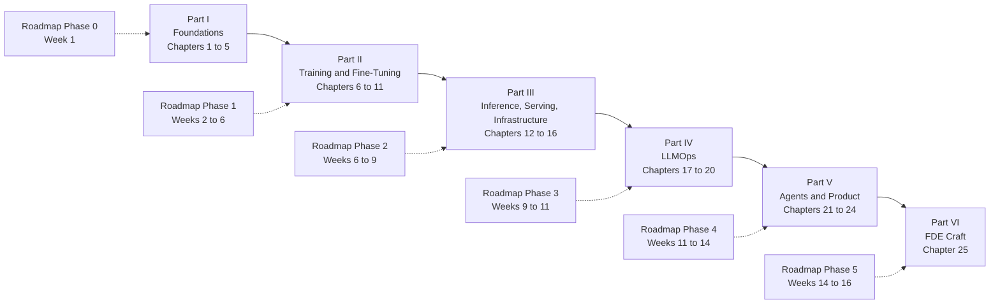

# The Forward Deployed AI Engineer Handbook

The self-contained technical companion to [FDE_AI_Roadmap.md](../FDE_AI_Roadmap.md). The roadmap says what to build and how to know it is done. The phase guides in `guides/` walk through each project step by step. This handbook explains how every mechanism works, with the derivation, a worked example with real numbers, the implementation, the failure modes, and exercises. You should not need to leave it to understand and implement any project in the roadmap.

It is written for one reader: an ML engineer with a master's degree, four years of ML work, and three years of production LLM systems, who is closing specific gaps rather than learning the field. The tone follows from that. Nothing is padded, nothing fundamental is re-explained, and every claim carries a number or a citation.

## How to read it

There are three sensible orders.

**By phase.** Each part of the handbook maps to one phase of the roadmap. Read Part I in Week 1 alongside P0.1 and P0.2, Part II across Weeks 2 to 6, and so on. Each chapter's opener names the roadmap projects it serves, so you can read exactly the chapters the current project needs. This is the intended order and the one the schedule assumes.

**As a reference.** Every chapter has a failure-modes table, an on-your-machine section with concrete numbers for your hardware, and a summary of the facts to retain. Appendix A collects every formula, Appendix B every sizing table, Appendix C every defined term. When a fine-tune diverges at 2 a.m., go to the failure-modes table of the relevant chapter, not to the beginning.

**Cover to cover.** The chapters are ordered so that each one uses only what came before it. Part I derives the objects (tokens, the transformer, the training loop, the memory and compute arithmetic) that every later part reasons about. Reading straight through takes about forty hours and is worth doing once, probably during Phases 2 and 3 when the training material is fresh and the serving material is next.

## What is assumed known and what is not

Assumed, and never re-explained: linear algebra through eigendecomposition; probability through expectation, variance, and Bayes' rule; gradient descent and backpropagation; PyTorch modules, autograd, and data loaders; Python, SQL, Spark, Docker, and Git; cloud basics (object storage, virtual machines, IAM as a concept); retrieval-augmented generation as a pattern; prompt engineering; Langfuse tracing; MLflow and Airflow.

Not assumed, and derived in full: everything in the gaps list. Tokenizer internals. The transformer at the level of writing every line. Optimizer states, schedules, and mixed precision. Memory, FLOPs, and throughput arithmetic. Distributed training. Scaling laws. LoRA, QLoRA, DPO, GRPO. Contrastive training for retrieval. Distillation. Bootstrap statistics and judge calibration. Quantization methods. Continuous batching, PagedAttention, and speculative decoding. Kubernetes, Terraform, and CI for ML. Gateways and routing. The data flywheel. Drift detection. Threat modeling and red-teaming. SLOs and FinOps. Agent loops, durable execution, and human-in-the-loop design. MCP transports and authorization. Vision-language models. Demo front-ends. The engagement lifecycle.

If a chapter explains something you already know, skip the section, not the exercises. The exercises are the check that the knowledge is at the level of the definitions of done.

## Notation

The same symbols are used in every chapter. Each chapter still defines every symbol at first use, so a chapter can be read alone.

| Symbol | Meaning |
|---|---|
| $N$ | Number of model parameters. Non-embedding parameters unless the text says total |
| $D$ | Number of training tokens |
| $L$ | Number of transformer layers, also called blocks |
| $d$ | Model width, the dimension of the residual stream. Written $d_{model}$ where the contrast with other widths matters |
| $d_{ff}$ | Hidden width of the MLP block |
| $h$ | Number of attention heads. $n_{kv}$ is the number of key-value heads under grouped-query attention |
| $d_{head}$ | Dimension of one attention head, $d / h$ |
| $V$ | Vocabulary size, the number of token ids |
| $T$ | Sequence length in tokens |
| $B$ | Batch size in sequences. Tokens per step is $B \cdot T$ |
| $r$ | LoRA rank. $\alpha$ is the LoRA scaling numerator |
| $\beta$ | Strength of the KL constraint to the reference policy in RLHF, DPO, and GRPO |
| $\beta_1, \beta_2$ | AdamW moment decay rates. Always subscripted, so there is no clash with $\beta$ above |
| $\eta$ | Learning rate |
| $\sigma(\cdot)$ | Logistic sigmoid, $\sigma(z) = 1 / (1 + e^{-z})$ |
| $\pi_\theta, \pi_{ref}$ | The policy being trained and the frozen reference policy |
| $\mathcal{L}$ | A loss. Subscripted by method where several appear |
| $\mathbb{E}$, $\mathrm{Var}$ | Expectation and variance |
| $x, y$ | A prompt and a response, or an input and a target, as the chapter states |

Units. Memory is stated in bytes with binary prefixes: 1 KB is 1024 bytes, 1 MB is 1024 KB, 1 GB is 1024 MB. GPU spec sheets use decimal gigabytes, which are about 7 percent smaller at the gigabyte scale. The handbook says which convention applies when the difference matters, for example when a model is close to fitting. Compute is stated in FLOPs (floating-point operations, plural) and rates in FLOPS per second are written TFLOPS with a capital S. Prices are stated in US dollars with the date and the phrase "verify", because they change.

Approximations are written as approximations. "About 16 bytes per parameter" is preferred to a decimal that implies false precision.

## How the handbook relates to the roadmap, the guides, and the log

Four documents, four jobs.

- **The roadmap** ([FDE_AI_Roadmap.md](../FDE_AI_Roadmap.md)) owns scope, hours, dates, and the definition of done for each of the 22 projects, P0.1 through P5.3. The handbook never changes any of these.
- **The guides** (`guides/Phase-N-*.md`) own the method: the step-by-step walkthrough of each project, the checks at each milestone, and what to hand to Claude Code versus what to write yourself. They contain no code by design.
- **The handbook** (this folder) owns the mechanisms: derivations, worked examples, listings, failure modes, exercises. It goes far deeper than the guides and is the place to look when a guide says "implement RoPE" and you want to know exactly what the rotation is and why it encodes relative position.
- **The log** (`ROADMAP_LOG.md`) owns what actually happened: hours, spend, results with confidence intervals and dates, decisions.

When the documents disagree, the roadmap wins on hours, dates, and scope, and the guides win on method. The handbook explains and does not adjudicate; if you find it contradicting either, the handbook is stale and should be fixed, with a line in the log's decision table.

Cross-references inside the handbook use the form "Chapter 7, section 7.3". References to projects use the ID, such as P1.2. References to the guides are made only when you need the step-by-step walkthrough.

## Chapter map

*Figure 0.1: the six parts of the handbook and the roadmap phases each one serves.*

### Part I: Foundations (Phase 0)

1. **Tokenization and Data Representation.** Byte-level BPE from scratch, vocabulary trade-offs, bytes per token, special tokens, chat templates, packing into shards, label shifting. Serves P0.2 and P1.1.
2. **The Transformer, Derived.** The residual stream, RoPE with the relative-position proof, attention with the scaling factor derived, GQA and the KV cache, SwiGLU, RMSNorm, parameter counting, FlashAttention. Serves P0.2, P1.1, and Chapter 4.
3. **Training Dynamics.** Cross-entropy at initialization, AdamW, schedules, clipping, accumulation, mixed precision and loss scaling, exact-resume checkpoints, reading loss curves. Serves P0.2, P1.1, P1.2.
4. **Memory, Compute, and Throughput.** Bytes per parameter by scenario, activation memory, the KV-cache formula, LoRA and QLoRA arithmetic on 8 GB, FLOPs, MFU, the roofline, run-time and decode-speed estimates. Serves every training and serving project.
5. **The Working Environment.** WSL2 and GPU passthrough, `uv`, Docker with the NVIDIA toolkit, the project template, secrets, cloud providers, thermals on a laptop GPU. Serves P0.1 and every project.

### Part II: Training and Fine-Tuning (Phase 1)

6. **Pretraining at Small Scale.** Corpus construction and deduplication, DDP and FSDP, scaling laws and Chinchilla, the two-point experiment, evaluating a pretrained model. Serves P1.1.
7. **Supervised Fine-Tuning, LoRA, and QLoRA.** What SFT changes, completion-only loss, LoRA derived and counted, NF4 and QLoRA, Unsloth, text-to-SQL as a task, exporting to GGUF and Ollama. Serves P1.2, P1.5, P4.3.
8. **Preference Optimization and Reinforcement Learning.** Bradley-Terry, the KL-regularized objective and its optimum, DPO derived, the DPO family, GRPO with the advantage and the clipped objective, reward design and reward hacking. Serves P1.3.
9. **Embeddings, Retrieval, and Rerankers.** InfoNCE and MNRL, hard negatives, Matryoshka, cross-encoders and late interaction, BM25 and fusion, HNSW and quantized indexes, nDCG and MRR. Serves P1.4.
10. **Synthetic Data and Distillation.** Logit, sequence, and rationale distillation, taxonomy-driven generation, curation and decontamination, the cost-quality trade. Serves P1.5, P3.1.
11. **Evaluation and Statistics.** lm-eval, bootstrap and paired bootstrap, sample size, LLM-as-judge calibration with Cohen's kappa, Bradley-Terry aggregation, evalkit. Serves P1.6 and every project.

### Part III: Inference, Serving, and Infrastructure (Phase 2)

12. **Quantization.** Scale and zero point, per-group quantization, GPTQ, AWQ, bitsandbytes, GGUF k-quants, FP8, KV-cache quantization, measuring the accuracy cliff. Serves P2.1, P2.2.
13. **Serving Systems.** Continuous batching, PagedAttention, prefix caching, speculative decoding with the expected-tokens formula, multi-LoRA, engines compared, benchmarking, the cost model. Serves P2.2, P2.5, P3.1.
14. **Kubernetes for Model Serving.** The object model, scheduling GPUs, probes for slow-loading servers, rolling updates, autoscaling with KEDA, Helm, kind, managed clusters. Serves P2.3, P2.4, P5.2.
15. **Infrastructure as Code and CI/CD.** Terraform's model and state, module design for a GPU cluster, OIDC federation, GitHub Actions with an evaluation gate, container hygiene. Serves P2.4, P3.1, P5.2.
16. **Gateways, Routing, and Cost Engineering.** Gateway responsibilities, cascades and classifiers, semantic caching, prompt caching, OpenTelemetry, cost attribution. Serves P2.5, P3.1, P3.4.

### Part IV: LLMOps (Phase 3)

17. **The Data Flywheel.** Trace anatomy, curation scoring, PII redaction, review queues, dataset versioning, the three-set gate, registry aliases, canary rollout and rollback. Serves P3.1, P5.2.
18. **Evaluation Platforms and Monitoring.** Golden sets from production, eval-as-CI, online judging, PSI and Kolmogorov-Smirnov drift detection, alert thresholds, tools. Serves P3.2, P3.4.
19. **Security for LLM Systems.** Threat modeling with the instruction-data boundary, the OWASP Top 10 for LLM applications, prompt injection defense in depth, MCP threats, guardrail layers, red-teaming, the security review document. Serves P3.3, P4.2, P5.2.
20. **Reliability and FinOps.** SLIs and SLOs including a quality SLO, error budgets and burn rates, resilience patterns for a gateway, game days, unit economics. Serves P3.4, P5.2.

### Part V: Agents and Product (Phase 4)

21. **Agents in Production.** Workflows versus agents, the loop as a state machine, tool contracts, durable execution, human-in-the-loop, memory, context management, agent evaluation with pass^k. Serves P4.1, P5.2.
22. **MCP in Depth.** Host, client, and server, JSON-RPC shapes, transports, OAuth 2.1 with PKCE and audience binding, multi-tenancy, tool ergonomics, contract tests, deployment. Serves P4.2, P5.2.
23. **Multimodal and Document AI.** Vision-language architecture and image token cost, three document pipelines, structured extraction and field metrics, fine-tuning small VLMs on 8 GB, a voice pipeline note. Serves P4.3, P5.2.
24. **Demos and Front-Ends.** Two tiers of front-end, streaming and tool-call rendering, data-agnostic design, deployment, the five-beat narrative. Serves P4.4, P5.2.

### Part VI: FDE Craft (Phase 5)

25. **Engagements, from Discovery to Readout.** The engagement lifecycle, discovery technique, use-case scoring, the architecture memo, the ROI model, statements of work, delivery and expectation management, the executive readout, positioning. Serves P5.1, P5.2, P5.3.

### Appendices

- **A. Formula Sheet.** Every formula in the handbook with symbols defined, grouped by chapter.
- **B. Sizing Tables.** What fits where, for 0.5B to 70B models, on the RTX 4060, T4, L4, A100, and H100.
- **C. Glossary.** Every defined term, one line each, with the chapter that introduces it.
- **D. Bibliography.** Papers and primary documentation by chapter.

## Data policy

Every example, listing, dataset, prompt, and number in this handbook uses public or synthetic data. Nothing from Atom11 appears anywhere: no data, no schemas, no prompts, no customer names, no metrics. When a chapter needs the shape of a real problem, it recreates the shape with synthetic data (a synthetic retail schema for text-to-SQL, synthetic invoices for document extraction, synthetic traces for the flywheel). The same rule applies to every project repository, every prompt you send to any model, and every log you keep. This is what makes every artifact of the roadmap publishable.

## How to study a chapter

The chapters are built for a fixed routine. Each step feeds the next.

1. **Read** the chapter once without stopping, including the failure-modes table. Aim for the shape of the mechanism, not every symbol.
2. **Derive.** Close the file and reproduce the chapter's central derivation on paper: the scaling factor, the DPO loss, the KV-cache formula, the bootstrap interval. If you cannot, reread the section and try again. The definitions of done in the roadmap ask for exactly this ("rederive attention and the memory table on a whiteboard").
3. **Run on the 4060.** Type the listings into a scratch file and run them, then change one thing and predict what happens before you run it again. The on-your-machine section gives the sizes that fit in 8 GB and how long each takes. Use the Kaggle T4s or a rented A100 only where that section says to.
4. **Do the exercises** before opening the solutions. The calculations are the ones you will do in front of a customer; the derivations are the ones you will do in an interview.
5. **Then do the roadmap project.** The handbook has now covered every mechanism the project needs. Open the phase guide for the walkthrough and the roadmap for the definition of done, and build. Return to the handbook's failure-modes table when something breaks.

Write down what surprised you after each chapter. Those sentences become the "what surprised me" paragraphs of your write-ups, and they are the paragraphs interviewers ask about.

## Conventions in the chapters

- Listings are labeled `Listing N.M` in bold before the code and are followed by a paragraph explaining the non-obvious lines. They show the core of an implementation in PyTorch, not the plumbing, and are under about 60 lines each. Where a library API is version-dependent, the text names the version range assumed and says "check your version".
- Figures are Mermaid diagrams labeled `Figure N.M` with a one-sentence italic caption.
- Exercises come with solutions in collapsible blocks. Open them after you have an answer, not before.
- Hardware facts refer to your machine unless stated: MSI Raider GE68 HX 13V, Core i9-13950HX, 32 GB RAM, RTX 4060 Laptop GPU with 8 GB VRAM (Ada, compute capability 8.9, bf16 and FP8 supported), WSL2 Ubuntu. Kaggle gives two T4s with 16 GB each and no bf16. RunPod Community Cloud A100 80 GB was about 1.39 dollars per hour in September 2026; verify before renting.
- Prices and library versions are marked "as of mid-2026; verify". Contested claims are marked as contested, with the practical default stated.
- Papers are cited by author, year, and exact title. URLs appear only for official documentation roots.
