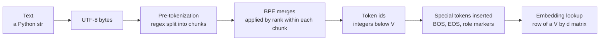
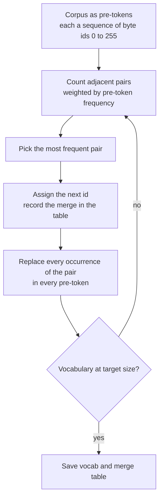
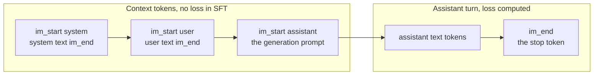
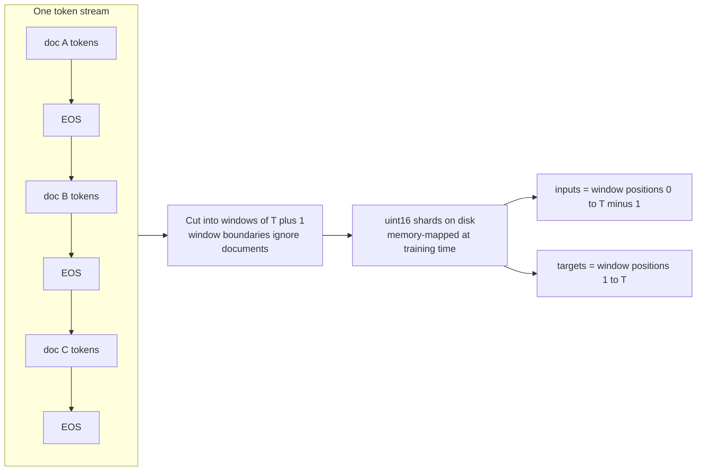

# Chapter 1: Tokenization and Data Representation

> **What you will be able to do.** Train a byte-level BPE tokenizer from scratch and explain every step of a merge; measure bytes per token on any corpus and predict cost and context consequences; reason about vocabulary size as an engineering trade-off with numbers; read a chat template as a token-layout contract and detect a mismatch; pack a corpus into memory-mapped shards with correct label shifting; diagnose the tokenization bugs that produce a falling loss and garbage samples.
>
> **Where it is used.** P0.2 (the BPE tokenizer and the TinyStories data pipeline), P1.1 (the 16k tokenizer versus the SmolLM tokenizer, the uint16 shards), and every fine-tuning project from P1.2 onward through chat templates and loss masks.
>
> **Prerequisites.** None.

## 1.0 The problem this chapter solves

A customer's fine-tuned text-to-SQL model answers well in the notebook where it was trained and badly behind the serving endpoint. The weights are identical. The difference is eleven bytes in a template string: the serving stack renders the conversation with a newline the training data never had, and the model, which has never seen that token sequence at that position, quietly produces worse SQL and sometimes fails to stop. Nobody sees an error, because there is none. The loss during training was fine. The problem is in the layer that turns text into integers and back, and that layer is invisible unless you know how to look at it.

The same layer decides how much a Hindi user pays per sentence relative to an English user, whether `user_id` costs one token or three, whether a 128k vocabulary is a gift or a burden for a 60M-parameter model, and whether your pretraining shards contain what you think they contain. Every one of these has a number attached, and an FDE is expected to produce that number on request.

This chapter builds the tokenizer from bytes up, then follows the integers through packing, sharding, and label shifting to the point where they enter the model. Chapter 2 picks up at the embedding table.

## 1.1 Models see integers, not text

A language model is a function from a sequence of integers to a probability distribution over the next integer. Nothing in the network knows what a letter is. The mapping from text to integers is fixed before training begins, it is learned from data rather than designed, and it is part of the model in every practical sense: change it and the weights are meaningless.

The mapping has a fixed range. The vocabulary size $V$ is the number of distinct integers the model accepts and produces. Each integer indexes one row of the embedding matrix $E \in \mathbb{R}^{V \times d}$, where $d$ is the model width, and one column of the output projection that produces logits. So $V$ appears twice in the parameter count and once in every forward pass, which is why it is a design decision rather than a detail.



*Figure 1.1: the path from a string to the vector the first transformer layer reads.*

Three choices of unit are possible. Characters give a tiny vocabulary and very long sequences, and a model must spend capacity learning that "t", "h", "e" form a unit. Words give short sequences but an unbounded vocabulary with no way to represent a word never seen. Subwords sit between: frequent strings become single tokens, rare strings decompose into a few pieces, and every string has a representation. Byte-pair encoding (BPE) is the algorithm that finds those subwords by frequency, and its byte-level variant is what GPT-2, Llama 3, Qwen2.5, and nearly every current open model use. Sentencepiece's unigram model is the main alternative and was used by T5 and early Llama; it optimizes a different objective but produces the same kind of artifact, a vocabulary and a way to segment text into it.

The consequences of "integers, not text" run through the whole handbook. The model cannot count letters in a word it sees as one token. It cannot see that two tokens differ by capitalization unless it has learned that from co-occurrence. It treats `" cat"` and `"cat"` as unrelated symbols until training relates them. And the tokenizer's compression ratio sets the price of every request.

## 1.2 Byte-level BPE, step by step

BPE was introduced for compression by Gage in 1994 and adapted to neural machine translation by Sennrich, Haddow, and Birch in 2016. The idea is a greedy merge loop. Start with an alphabet of atomic symbols. Count every adjacent pair of symbols in the corpus. Replace the most frequent pair everywhere with a new symbol. Repeat until the vocabulary reaches the target size. The merges, in order, are the tokenizer.

The byte-level variant, introduced with GPT-2 (Radford et al. 2019), takes the 256 possible byte values as the atomic alphabet. Text is first encoded as UTF-8, so a corpus in any script becomes a sequence of integers 0 to 255, and the base vocabulary is exactly 256 tokens. Merges then build up multi-byte tokens. The final vocabulary of size $V$ contains 256 byte tokens, $V - 256 - n_{special}$ merged tokens, and $n_{special}$ reserved special tokens.

### The training algorithm

Let the corpus be split into pre-tokens (section 1.4), each a sequence of byte ids, and let $c(w)$ be the count of pre-token $w$. One merge step:

1. For every pre-token $w$ and every adjacent pair $(a, b)$ inside it, add $c(w)$ to the pair count $n(a, b)$.
2. Pick $(a^*, b^*) = \arg\max_{(a,b)} n(a, b)$. Ties are broken by an implementation-specific rule; the listing in section 1.11 takes the first pair encountered in corpus order.
3. Assign the next unused id $t = |\text{vocab}|$ to the merged token, set $\text{vocab}[t] = \text{vocab}[a^*] \,\|\, \text{vocab}[b^*]$ (byte concatenation), and append $(a^*, b^*) \to t$ to the merge table.
4. In every pre-token, replace every occurrence of the adjacent pair $(a^*, b^*)$ with $t$, scanning left to right so that overlapping occurrences like "aaa" resolve deterministically.

Pairs never cross pre-token boundaries. That is the only reason pre-tokenization exists: it constrains which merges are possible and keeps the pair counting local.



*Figure 1.2: the BPE training loop; one pass of the loop adds one token to the vocabulary.*

### A worked merge example

Corpus: `the cat sat on the mat the cat ate`. Pre-tokenization attaches each leading space to the following word (section 1.4), giving nine pre-tokens with these counts: `the` 1, ` cat` 2, ` sat` 1, ` on` 1, ` the` 2, ` mat` 1, ` ate` 1. In byte ids, `t` is 116, `h` 104, `e` 101, space 32, `c` 99, `a` 97, `s` 115, `o` 111, `n` 110, `m` 109.

Initial pair counts, weighted by pre-token frequency: $(a, t)$ appears in ` cat` twice, ` sat`, ` mat`, and ` ate`, so $n(97, 116) = 5$. $(t, h)$ and $(h, e)$ each appear in `the` once and ` the` twice, so 3 each. $(\text{space}, c)$, $(c, a)$, and $(\text{space}, t)$ appear twice each. Everything else once.

| Merge | Pair | New id | Bytes | Count | Corpus after the merge |
|---|---|---|---|---|---|
| 1 | (97, 116) | 256 | `at` | 5 | `the`, ` c[at]`, ` s[at]`, ` on`, ` the`, ` m[at]`, ` [at]e` |
| 2 | (116, 104) | 257 | `th` | 3 | `[th]e`, ` c[at]`, ` s[at]`, ` on`, ` [th]e`, ` m[at]`, ` [at]e` |
| 3 | (257, 101) | 258 | `the` | 3 | `[the]`, ` c[at]`, ` s[at]`, ` on`, ` [the]`, ` m[at]`, ` [at]e` |
| 4 | (32, 99) | 259 | ` c` | 2 | `[the]`, `[ c][at]`, ` s[at]`, ` on`, ` [the]`, ` m[at]`, ` [at]e` |
| 5 | (259, 256) | 260 | ` cat` | 2 | `[the]`, `[ cat]`, ` s[at]`, ` on`, ` [the]`, ` m[at]`, ` [at]e` |
| 6 | (32, 258) | 261 | ` the` | 2 | `[the]`, `[ cat]`, ` s[at]`, ` on`, `[ the]`, ` m[at]`, ` [at]e` |

Merge 2 is a tie between $(t, h)$ and $(h, e)$ at count 3; the first-encountered rule picks $(t, h)$ because `the` is the first pre-token. Merge 4 is a three-way tie at 2; the rule picks $(\text{space}, c)$ because ` cat` is the second pre-token and that is its first pair. Note that merge 3 consumes a merged token (257) as its left element, and merge 5 merges two merged tokens. Tokens are built hierarchically, and the merge table records the tree.

After six merges the vocabulary has 262 entries and the whole corpus encodes to 17 tokens for 34 bytes, exactly 2.0 bytes per token. The phrase `the cat` encodes to `[258, 260]`, two tokens for seven bytes.

### Encoding with the merge table

Encoding does not recount anything. For each pre-token, start from its bytes and repeatedly apply the lowest-ranked merge (the earliest in the table) whose pair is present, until no pair in the sequence is in the table. Rank order matters: applying merges in a different order can produce a different, non-canonical segmentation, and the model was trained on the canonical one.

The unseen word ` that` encodes as follows. Bytes: 32, 116, 104, 97, 116. Present pairs with ranks: $(116, 104)$ has rank 1, $(97, 116)$ has rank 0. Apply rank 0 first: 32, 116, 104, 256. Now $(116, 104)$ at rank 1 is the only present merge: 32, 257, 256. Neither $(32, 257)$ nor $(257, 256)$ is in the table, so the result is `[32, 257, 256]`, the pieces ` `, `th`, `at`. Three tokens for five bytes, for a word the tokenizer never saw. This is the whole point: the vocabulary generalizes because it is built from parts.

The consequence for practice is that the merge table, not the vocabulary file, is the tokenizer. Two vocabularies with identical token strings but different merge orders segment text differently. When you save a tokenizer, save both, and when you compare two tokenizers, compare the ids they produce on a fixed sample.

## 1.3 Byte fallback: why no token is ever unknown

Because the base alphabet is all 256 byte values, every UTF-8 string has at least one encoding: its raw bytes, one token each. Merges only shorten that. So a byte-level BPE tokenizer has no unknown token and never fails on input. A string of emoji, Devanagari, Cyrillic, or binary garbage all encode; they just encode badly if the merges never saw them.

GPT-2 implemented this with an indirection: each of the 256 bytes is mapped to a printable Unicode character so that the merge code can operate on strings rather than bytes. That mapping is invertible and is an implementation detail, but it explains why a GPT-2 vocabulary file looks like `Ġthe` for ` the`; `Ġ` is the printable stand-in for the space byte. Llama 3 and Qwen2.5 use tiktoken-style tokenizers with the same byte-level design.

SentencePiece, the tokenizer library behind Llama 2, T5, and Gemma, operates on Unicode characters rather than bytes and therefore can meet a character not in its alphabet. Its `byte_fallback` option adds 256 byte tokens written `<0x00>` through `<0xFF>` and decomposes unknown characters into them. Llama 2 enabled this, so it too never produces an unknown token. Older SentencePiece models without the option emit a single `<unk>` id for any unknown character and lose the information.

Two consequences follow from byte-level operation. First, a multi-byte character can be split across tokens. A three-byte Devanagari character may become one, two, or three tokens, and the middle token on its own is not valid UTF-8. Take `न` (U+0928), whose UTF-8 encoding is the bytes `E0 A4 A8`. A tokenizer whose merges include `(E0, A4)` but not the full character emits two tokens, `[E0 A4]` and `[A8]`. After the first token arrives, the decoder holds an incomplete sequence: a lead byte announcing three bytes and one continuation byte. Decoding it with `errors="replace"` yields a replacement character; decoding correctly means holding the two bytes until the third arrives. Decoding must therefore buffer bytes and emit characters only when a complete sequence is available, which is why streaming decoders hold back partial output and why naive token-by-token decoding shows replacement characters that vanish when the next token arrives. Second, the model's cost for a script is set by how many merges the training corpus produced for that script. An English-heavy corpus produces almost no Devanagari merges, and the fallback path, correct but expensive, becomes the normal path for Hindi. Section 1.6 puts numbers on this.

## 1.4 Pre-tokenization rules and their consequences

Before any merge is counted, text is split into chunks by a regular expression, and merges are confined within chunks. The rule set defines what a token can possibly be. GPT-2's pattern has been the template for almost every successor, and its parts, in order of precedence, are:

1. Common English contractions: `'s`, `'t`, `'re`, `'ve`, `'m`, `'ll`, `'d`, split off as their own chunk.
2. An optional space followed by a run of letters (Unicode category L).
3. An optional space followed by a run of digits (category N). GPT-2 allows any length. cl100k_base (GPT-4) and the Llama 3 tokenizer cap this at one to three digits.
4. An optional space followed by a run of characters that are neither whitespace, letters, nor digits: punctuation and symbols.
5. Whitespace runs, split so that the last whitespace character before a non-space attaches to the following chunk.

Each rule has a consequence you will meet.

**The leading space belongs to the word.** ` cat` and `cat` are different chunks and therefore different tokens. Words at the start of a document have no leading space and are tokenized differently from the same word mid-sentence. A prompt that ends with a trailing space forces the model to continue from a chunk boundary it rarely saw in training (the space alone), which measurably worsens the next token. This is why prompt templates should not end with a space and why some inference engines implement "token healing" to back up over the boundary.

**Digits.** Under GPT-2's rule, `1234567` is one chunk and the merges carve it into whatever pieces were frequent, so `1234` and `4567` might be tokens while `12345` is not, and the same number in different contexts can segment differently. Under the one-to-three rule, `1234567` splits into `123`, `456`, `7` before merging, so every number is a sequence of one-to-three-digit tokens. This regularity is one reason models with the newer rule are more reliable at arithmetic and at copying identifiers. The Qwen2.5 tokenizer splits digits individually, which is the extreme of the same idea.

**Punctuation and underscores.** Rule 4 groups punctuation runs, and an underscore is punctuation. `user_id` pre-tokenizes to `user`, `_`, `id`: three chunks, so at least three tokens, and typically exactly three. A snake_case identifier with $k$ parts costs at least $2k - 1$ tokens. `count(*)` becomes `count`, `(*)`. `SELECT`, ` SELECT`, `select`, and ` select` are four distinct chunks and four distinct tokens. For a text-to-SQL fine-tune this means the casing convention of the training data is a signal the model learns, and a mixed convention splits probability mass. Normalize to one convention before training.

**Whitespace and code.** Rule 5 means that in `    return x` the four-space indent becomes a chunk of three spaces and a chunk ` return`. Whether three spaces are one token or three depends on whether the merges learned space runs. GPT-2's vocabulary, trained on web text, lacks tokens for most whitespace runs, so indented code is expensive under it. The Codex paper (Chen et al. 2021) reports that adding a set of tokens for whitespace runs of different lengths cut the token count of Python code by about 30 percent, and later tokenizers such as cl100k_base inherit this. Newlines are their own whitespace chunks, and `\n\n` is commonly a single token.

**Combining marks.** Rule 2 matches letters (category L), not marks (category M). Devanagari vowel signs and the virama are combining marks, so the greeting `नमस्ते` (six code points, eighteen bytes) pre-tokenizes into four chunks, one of which is a single combining mark, and each chunk is merged separately. Even a tokenizer trained on Hindi cannot form a token that spans a chunk boundary, so this rule alone raises the token count for Indic scripts under GPT-2-style rules. SentencePiece-based tokenizers such as Gemma's do not use this rule set and are not affected in the same way; tiktoken-style rule sets vary in detail from model to model, so measure rather than assume.

**Case is not normalized.** GPT-style tokenizers apply no lowercasing or Unicode normalization. SentencePiece applies NFKC normalization by default, which maps some visually identical characters to one code point. Two tokenizers can therefore disagree on the byte content of the same visible text. When you switch tokenizers, verify round-tripping on a sample that includes accented characters and typographic quotes.

### Concrete segmentations

The chunks below are the actual output of the rule set in Listing 1.1 (GPT-2 rules with one-to-three digit grouping). Merges then operate inside each chunk and can never join two chunks.

| Input | Chunks | Consequence |
|---|---|---|
| `user_id` | `user`, `_`, `id` | At least three tokens for a two-part identifier |
| `SELECT count(*) FROM orders` | `SELECT`, ` count`, `(*)`, ` FROM`, ` orders` | Keywords with a leading space are their own tokens; `(*)` is one punctuation chunk |
| `    return x` | three spaces, ` return`, ` x` | Indentation is a separate chunk; its token count depends on space-run merges |
| `1234567` | `123`, `456`, `7` | Every number is a sequence of one-to-three-digit tokens |
| `Hello hello HELLO` | `Hello`, ` hello`, ` HELLO` | Three unrelated tokens for one word |
| `नमस्ते दुनिया` (13 characters, 37 bytes) | ten chunks | Combining marks are split from their base letters; with no Devanagari merges, up to 37 tokens |

The last row is the byte-fallback worst case: one token per byte. The English `hello world` (11 bytes) is two tokens under any common tokenizer. Same information content, an order of magnitude apart in token count, decided entirely by the rule set and the merge table.

## 1.5 Vocabulary size trade-offs

The vocabulary size $V$ trades sequence length against parameter count, compute, and the learnability of rare tokens. Bigger vocabularies compress text into fewer tokens; smaller ones give every token more training examples and a smaller embedding table.

### Parameter and memory cost

The embedding matrix has $V \cdot d$ parameters. Untied models (Chapter 2, section 2.8) have a second $V \cdot d$ matrix for the output projection. In bf16 each parameter is 2 bytes.

| $V$ | $d = 768$ | $d = 2048$ | $d = 4096$ | bf16 bytes at $d = 2048$ | LM head FLOPs per token at $d = 2048$ |
|---|---|---|---|---|---|
| 16,384 | 12.6M | 33.6M | 67.1M | 64 MB | 67 MFLOP |
| 32,768 | 25.2M | 67.1M | 134.2M | 128 MB | 134 MFLOP |
| 50,257 (GPT-2) | 38.6M | 102.9M | 205.9M | 196 MB | 206 MFLOP |
| 128,256 (Llama 3) | 98.5M | 262.7M | 525.3M | 501 MB | 525 MFLOP |

The last column is $2Vd$, the multiply-adds of the output projection per position, which every forward pass pays regardless of model size. Compare it with the non-embedding forward cost of about $2N$ FLOPs per token (Chapter 4). For a model with $N = 85$M non-embedding parameters at $d = 768$, the forward pass costs about 170 MFLOP per token, and a 128k head adds 197 MFLOP, more than doubling it. For Llama-3-8B with $N \approx 7.0$B non-embedding parameters, the head's 1.05 GFLOP is about 7 percent of the 14 GFLOP forward pass. Large vocabularies are cheap for large models and expensive for small ones. That is why P1.1 trains a 16k tokenizer for 30M to 125M parameter models and why Llama 3 could afford 128k.

Weight tying (using $E$ for both input and output) halves the embedding parameter cost and is the default in small models: Qwen2.5-1.5B ties its 151,936 by 1536 embedding, 233M parameters, about 15 percent of its 1.54B total. Untying it would add another 233M.

### Compression gain

Larger vocabularies produce fewer tokens for the same text, with diminishing returns because the additional tokens are increasingly rare strings. Meta reported that the Llama 3 128k tokenizer compresses English at about 3.9 characters per token against about 3.2 for the Llama 2 32k tokenizer, about 20 percent fewer tokens, with larger gains on code and non-English text where the 32k vocabulary had few merges. Fewer tokens means proportionally fewer FLOPs per document during training and inference, more text per context window, and lower per-request cost at a fixed price per token.

Worked example at the request level. A text-to-SQL deployment serves 10M requests a month, each carrying about 3.9 KB of prompt (schema, instructions, question). At 4.3 bytes per token that is about 900 input tokens per request, 9.0B input tokens a month. A tokenizer that compresses 15 percent better makes it 765 tokens per request and 7.65B a month, a saving of 1.35B tokens. At an illustrative input price of 1 dollar per million tokens the saving is about 1,350 dollars a month; at the 10 to 15 dollars per million that frontier models charged for large-context input in 2025, it is five figures. The same saving applies to KV-cache memory and prefill compute on a self-hosted model. This is why a tokenizer comparison belongs in every serving cost memo (Chapter 16).

### Rare-token learning

A token's embedding row receives a gradient only when the token appears. Token frequencies follow a Zipf-like law: if $f_k$ is the frequency of the $k$-th most common token and $f_1$ that of the most common (a few percent for a token like ` the` or `,`), then approximately $f_k \approx f_1 / k$. Take $f_1 = 0.04$. The 16,000th token has frequency about $2.5 \times 10^{-6}$ and appears about 750 times in a 300M-token run. The 128,000th token has frequency about $3.1 \times 10^{-7}$ and appears about 94 times. Below a few hundred occurrences, an embedding row is barely trained. Tokens with essentially zero training occurrences, which exist in every large vocabulary because the tokenizer's training data and the model's training data differ, have random embeddings, and prompting with them produces erratic output. These are the glitch tokens documented for GPT-2 and GPT-3 in 2023. The rule is that vocabulary size should grow with training tokens; Tao et al. (circa 2024) fit this relationship and argue larger models deserve larger vocabularies.

### The practical default

For a model you pretrain yourself on 100M to 1B tokens, use 16k to 32k. For fine-tuning, you inherit the base model's tokenizer and the question does not arise. For serving cost analysis, the vocabulary is fixed and bytes per token (next section) is what you measure.

## 1.6 Bytes per token is a property of tokenizer and data

Define bytes per token for a string $s$ under a tokenizer $\text{enc}$ as

$$
\text{bpt}(s) = \frac{|\text{utf8}(s)|}{|\text{enc}(s)|},
$$

where $|\text{utf8}(s)|$ is the length of the UTF-8 encoding in bytes and $|\text{enc}(s)|$ is the number of tokens. Higher is better compression. It is a joint property of the tokenizer and the text: the same tokenizer scores differently on English, Hindi, and Python, and the same text scores differently under two tokenizers.

Worked example. A 12,000-byte sample of English prose encodes to 2,800 tokens under a 50k English-centric tokenizer: $\text{bpt} = 4.29$. An 8,192-token context window therefore holds about 35 KB of English, roughly 6,000 words. The same tokenizer on Devanagari text reaches perhaps 1.4 bytes per token, because most characters go through byte fallback in pieces and combining marks are split by pre-tokenization. Since a Devanagari character is 3 bytes, that is about 2.1 tokens per character, versus about 0.23 tokens per character for English. Per character, Hindi costs about nine times as many tokens under this tokenizer. A context window that holds 6,000 English words holds about 3,800 Hindi characters, which is a few paragraphs. At a fixed price per million tokens, the Hindi user pays several times more for the same information. Petrov et al. (2023) measured this disparity across languages and tokenizers and found differences of up to about an order of magnitude for the worst-served languages.

For code, the numbers depend on indentation handling. Under a tokenizer with space-run merges, Python lands around 3 to 3.5 bytes per token; under GPT-2's, deeply nested code can fall below 2.5 because each indent level costs tokens. SQL sits between prose and code: keywords are common tokens, identifiers with underscores are expensive.

Measure it, do not assume it. The procedure is: take a held-out sample of at least a few hundred kilobytes that is representative of the deployment data, encode it, divide. Report it with the tokenizer name and the sample description. P1.1 asks you to do this for your 16k tokenizer against the SmolLM tokenizer on the same slice of your corpus; expect the larger vocabulary to win by a modest margin on English web text and by more on code. The exercise at the end of this chapter uses a synthetic multilingual sample for the same purpose.

Bytes per token feeds three later calculations: the tokens-per-step unit in Chapter 3, the training-run token budget in Chapter 6, and the cost per document in Chapters 13 and 16. In each, a change in tokenizer or in the language mix moves the answer by the ratio of the bytes-per-token values.

## 1.7 Special tokens

Special tokens are reserved ids that mark structure rather than content: beginning of sequence (BOS), end of sequence (EOS), padding, and, in chat models, role and turn delimiters. They are added to the vocabulary after BPE training and so are never produced by merges. The encoder handles them by splitting the input on their literal strings before pre-tokenization, so that `<|endoftext|>` in the input becomes the reserved id rather than the pieces `<`, `|`, `end`, and so on. That splitting is controllable and matters for security; see below.

GPT-2 has one, `<|endoftext|>` at id 50256, used as both BOS and EOS. Llama 3 reserves 256 ids, 128,000 through 128,255, of which a handful are named (`<|begin_of_text|>`, `<|end_of_text|>`, `<|start_header_id|>`, `<|end_header_id|>`, `<|eot_id|>`) and the rest are placeholders for future use. Qwen2.5 has `<|endoftext|>` at 151,643, `<|im_start|>` at 151,644, and `<|im_end|>` at 151,645, plus tool-call markers, with the embedding matrix padded to 151,936 rows for kernel efficiency; verify these ids against the tokenizer you download.

How they are trained is the part that bites. A special token's embedding row starts random like every other row and learns only when the token appears in training data. In pretraining, EOS appears at every document boundary, millions of times, so it is well trained; the model learns that after EOS comes the start of an unrelated document, which is what lets a single EOS separate packed documents (section 1.9). Chat delimiters do not appear in pretraining at all. They are trained during supervised fine-tuning, where they appear a few times per example. If you add a new special token to a base model and fine-tune with LoRA, the adapters do not touch the embedding matrix, so the new row stays random and the model cannot learn to use it. The fixes are to mark the embedding and output matrices as fully trainable modules alongside the adapters, to initialize the new row to the mean of the existing rows so that it starts in a sane region, or to reuse one of the reserved placeholder ids that Llama 3 provides for this purpose. Chapter 7 returns to this.

Padding deserves a note. Decoder-only models trained with packing need no padding token at all. Fine-tuning with per-example batches does need one, and it must be a token whose positions are excluded from the loss and masked from attention. Many base models define no padding token, and the common fix of setting it equal to EOS is safe only if the loss mask is built from a separate attention mask, not from the token id; otherwise every real EOS is also masked and the model never learns to stop.

Special tokens as an attack surface: if the encoder is allowed to recognize special-token strings inside user-provided text, a user who types the literal string `<|im_end|>` followed by a fabricated system turn can forge a conversation boundary. Encode untrusted content with special-token recognition disabled (the Hugging Face `transformers` tokenizer argument `split_special_tokens=True`, or an explicit `allowed_special` set in tiktoken) so the string becomes ordinary punctuation tokens. Chapter 19 treats this as one of the injection vectors.

## 1.8 Chat templates as a token-layout contract

A chat template is the rule that turns a list of messages with roles into one token sequence. It is stored with the tokenizer (in Hugging Face's format, as a Jinja string in `tokenizer_config.json`) and applied by `tokenizer.apply_chat_template`. Its job is layout: which special tokens open and close each turn, how roles are written, where the system prompt goes and whether a default one is inserted, what separates turns, and which token ends an assistant turn.

The ChatML layout, used by Qwen2.5, shown abstractly with one message per role:

```
<|im_start|>system\n{system text}<|im_end|>\n
<|im_start|>user\n{user text}<|im_end|>\n
<|im_start|>assistant\n{assistant text}<|im_end|>\n
```

Two special tokens, `<|im_start|>` and `<|im_end|>`, do the structural work. The role names `system`, `user`, `assistant` and the newlines are ordinary tokens. The generation prompt, what the serving stack appends when it wants the model to speak, is `<|im_start|>assistant\n`. The model is trained so that after producing its reply it emits `<|im_end|>`, and the serving stack must treat that id as a stop token. Llama 3's layout has the same shape with different tokens: `<|start_header_id|>role<|end_header_id|>\n\n` opens a turn and `<|eot_id|>` closes it, with `<|begin_of_text|>` at the start.



*Figure 1.3: a ChatML conversation as a token layout; the boundary between the two groups is where the loss mask and the stop condition both live.*

Read the template as a contract with four clauses. The training data must be rendered with exactly this layout. The loss mask in supervised fine-tuning (Chapter 7) must locate assistant turns by this layout. The serving stack must render incoming requests with this layout and append this generation prompt. And the serving stack must stop on this end-of-turn token, which in Llama 3 is `<|eot_id|>` rather than the pretraining EOS `<|end_of_text|>`, a distinction that has caused a great many models to run on until the length limit.

A mismatch in any clause degrades silently. The model is a language model; given a layout it never saw, it still produces plausible text, just from a distribution it was not fine-tuned for. Typical symptoms are a few points of lost accuracy, a system prompt that is partially ignored, replies that fail to stop, or replies that begin by repeating part of the prompt. None of these raises an exception. The check is mechanical: render one training example through the training code and through the serving stack, compare the token ids, and assert the assistant turn ends with an id that is in the model's `generation_config` stop list. Listing 1.5 includes the check.

Two more clauses are worth writing into your own contract. Whether the template inserts a default system prompt when none is given (Qwen2.5's does, Llama 3's does not) changes the token layout of every request with no system message. And whether the template ends the last turn with a trailing newline or not changes the first token the model sees after the generation prompt. Both are eleven-byte differences with measurable consequences.

## 1.9 Packing, shards, and label shifting

Pretraining data is a stream of documents of wildly varying length. Feeding them one per sequence would waste most of every batch on padding. Packing removes the waste: concatenate every document's tokens, place an EOS between documents, and cut the resulting stream into fixed windows.



*Figure 1.4: packing a corpus into a single stream, cutting windows, and deriving inputs and targets from the same window.*

Windows have length $T + 1$, not $T$, because inputs and targets come from the same window offset by one. If the window is $w_0, w_1, \ldots, w_T$, then the input sequence is $w_0 \ldots w_{T-1}$ and the target sequence is $w_1 \ldots w_T$: at position $i$ the model sees $w_i$ and is trained to predict $w_{i+1}$. This is the label shift. Getting it wrong in either direction is a classic bug. Unshifted targets teach the model to output its input and the loss falls to near zero. Shifting twice (once in your data code and once inside a framework that also shifts, as the Hugging Face causal-LM models do when you pass `labels`) trains the model to predict two tokens ahead and gives a loss that plateaus high. When using Hugging Face models, pass `labels = input_ids` and let the model shift.

Windows ignore document boundaries. A window may begin in the middle of document B and end in the middle of document C, with an EOS between. The model learns that EOS resets context, and at inference you start every prompt with BOS or after an EOS for the same reason. Attention within a window does cross the EOS, so tokens of document C can attend to document B. Standard practice at small scale accepts this; the Llama 3 report describes masking attention across document boundaries within a packed sequence, which matters for long-context training. Chapter 7 uses the same idea, per-example position ids and block-diagonal masks, for supervised fine-tuning where cross-contamination between examples matters more.

Shards are the on-disk form. The token stream is written as a flat array of unsigned 16-bit integers, valid for any vocabulary up to 65,536 ids, into files of a fixed size, for example 100M tokens (200 MB) each. At training time each shard is memory-mapped, so the operating system pages in only the windows that are read, and a batch is drawn by picking random offsets. A 300M-token corpus is 600 MB on disk and fits in the page cache of a 32 GB machine, so after the first epoch reads are memory-speed. Vocabularies above 65,536, such as Llama 3's 128,256, need `uint32` shards or a compact `int32`; writing them as `uint16` silently wraps ids modulo 65,536 and produces the failure described next.

The paging arithmetic explains why memory-mapping is the right tool here. An operating-system page is 4 KB, which holds 2,048 `uint16` tokens. A window of 1,025 tokens touches one page or two, so a batch of 32 windows touches at most 64 pages, 256 KB, regardless of how large the corpus is. On a cold start the first pass over a 600 MB corpus reads it from an NVMe drive in a few seconds; after that every access is a memory read. Compare with loading the whole corpus as a Python list of integers, which would occupy about 28 bytes per token in CPython, about 8 GB for 300M tokens, before a single batch is assembled.

## 1.10 How tokenization errors show up in training

Tokenization bugs are dangerous because the loss curve usually looks healthy. A language model trained on a wrong but consistent integer stream learns that stream. Six patterns account for almost every case.

**Fluent loss, garbage samples.** The encoder and decoder disagree. Causes: shards written with the wrong dtype so ids wrapped; a tokenizer file from a different vocabulary loaded at sampling time; the byte-to-unicode indirection not inverted. The loss falls normally because the training stream is self-consistent. Confirm by decoding a random training window directly from the shard with the same tokenizer object used for sampling, before any model is involved.

**Loss falls to near zero within a few hundred steps.** Targets not shifted, or shifted the wrong way, so the model is predicting a token it can see. Chapter 2 gives the causal-mask version of the same symptom. Confirm by printing one batch and asserting `y[:, :-1] == x[:, 1:]`.

**Loss starts at the wrong value.** At initialization a correctly wired model with uniform-ish logits has cross-entropy about $\ln V$: 9.70 for 16,384, 10.83 for 50,257, 11.76 for 128,256. A starting loss far below this means the targets are degenerate (for example every target is padding or EOS); far above means the logits are badly scaled (Chapter 3). Confirm on the first batch before training.

**Validation loss good, generated text fluent, task performance poor.** The template used at inference differs from the one used in training (section 1.8), or the inference tokenizer is the base model's while training added tokens. Confirm by diffing token ids of one rendered example.

**Replies never stop.** The stop token configured at serving is not the token the fine-tune learned to emit at end of turn. Confirm by generating with no stop token and inspecting which special token appears where the reply should end.

**Rare, bizarre completions on specific inputs.** Glitch tokens: ids that exist in the vocabulary but had near-zero occurrences in the model's training data, so their embeddings are untrained. Confirm by counting occurrences of the suspect id in the training shards.

## 1.11 Implementation notes

The five listings below are the tokenizer trainer, the encoder and decoder, special-token handling with the trusted and untrusted paths, the shard writer with its sampler, and the sanity checks. They use the `regex` package for Unicode categories, which the standard `re` module does not support.

**Listing 1.1: a minimal byte-level BPE trainer.**

```python
import regex as re
from collections import Counter

# GPT-2 style rules with the one-to-three digit grouping of newer tokenizers.
PAT = r"""'s|'t|'re|'ve|'m|'ll|'d| ?\p{L}+| ?\p{N}{1,3}| ?[^\s\p{L}\p{N}]+|\s+(?!\S)|\s+"""

def pretokenize(text: str) -> list[bytes]:
    return [m.encode("utf-8") for m in re.findall(PAT, text)]

def merge_word(word: tuple[int, ...], a: int, b: int, new_id: int) -> tuple[int, ...]:
    out, i = [], 0
    while i < len(word):
        if i < len(word) - 1 and word[i] == a and word[i + 1] == b:
            out.append(new_id)
            i += 2
        else:
            out.append(word[i])
            i += 1
    return tuple(out)

def train_bpe(text: str, vocab_size: int):
    words = Counter(tuple(w) for w in pretokenize(text))     # bytes -> tuple of ints in 0..255
    vocab = {i: bytes([i]) for i in range(256)}
    merges: list[tuple[int, int]] = []
    while len(vocab) < vocab_size:
        pairs = Counter()
        for word, freq in words.items():
            for a, b in zip(word, word[1:]):
                pairs[(a, b)] += freq
        if not pairs:
            break
        (a, b), _ = pairs.most_common(1)[0]                 # ties: first seen in corpus order
        new_id = len(vocab)
        vocab[new_id] = vocab[a] + vocab[b]
        merges.append((a, b))
        words = Counter({merge_word(w, a, b, new_id): f for w, f in words.items()})
    return vocab, merges
```

The corpus is reduced to a `Counter` of pre-tokens before any merging, so the pair count is weighted by frequency without touching the raw text again. Each merge is a full pass over the distinct pre-tokens, so the cost is (number of merges) times (number of distinct pre-tokens), which is fine for a few megabytes and hopeless for a gigabyte; production trainers keep an index from pairs to the words that contain them and update counts incrementally. `merge_word` scans left to right, which is what makes `aaa` resolve to `[aa][a]` rather than `[a][aa]`. `most_common(1)` returns the first maximal entry in insertion order, which is the tie-break rule the worked example used; Hugging Face `tokenizers` and tiktoken break ties differently, so do not expect identical merge tables from different trainers on the same corpus.

**Listing 1.2: encode and decode with the merge table.**

```python
def encode(text: str, merges: list[tuple[int, int]]) -> list[int]:
    rank = {pair: i for i, pair in enumerate(merges)}
    ids: list[int] = []
    for word in pretokenize(text):
        toks = list(word)
        while len(toks) > 1:
            best = min(zip(toks, toks[1:]), key=lambda p: rank.get(p, float("inf")))
            if best not in rank:
                break                                        # no applicable merge remains
            toks = list(merge_word(tuple(toks), best[0], best[1], 256 + rank[best]))
        ids.extend(toks)
    return ids

def decode(ids: list[int], vocab: dict[int, bytes]) -> str:
    return b"".join(vocab[i] for i in ids).decode("utf-8", errors="replace")
```

The id of the merge at rank $i$ is $256 + i$ by construction, so the encoder needs only the merge list. The `min` over adjacent pairs by rank finds the earliest-learned applicable merge; applying merges in rank order reproduces the segmentation the trainer would have produced, which is the canonical one. Special tokens are not handled here; Listing 1.3 adds them. `decode` concatenates bytes before decoding so that multi-byte characters split across tokens reassemble correctly; `errors="replace"` covers a truncated final character in streaming.

**Listing 1.3: encoding with special tokens, trusted and untrusted paths.**

```python
def encode_with_specials(text: str, merges, specials: dict[str, int], trusted: bool) -> list[int]:
    """specials maps literal strings such as '<|im_end|>' to their reserved ids."""
    if not trusted:
        return encode(text, merges)                     # special strings become ordinary bytes
    pattern = "(" + "|".join(re.escape(s) for s in specials) + ")"
    ids: list[int] = []
    for piece in re.split(pattern, text):
        if piece in specials:
            ids.append(specials[piece])
        elif piece:
            ids.extend(encode(piece, merges))
    return ids

def render_chatml(turns: list[tuple[str, str]], specials: dict[str, int], merges) -> list[int]:
    ids: list[int] = []
    for role, content in turns:                          # content is untrusted user or tool text
        ids += [specials["<|im_start|>"]] + encode(role + "\n", merges)
        ids += encode_with_specials(content, merges, specials, trusted=False)
        ids += [specials["<|im_end|>"]] + encode("\n", merges)
    return ids
```

The split-then-dispatch structure is how every production encoder handles special tokens: the literal strings are located before pre-tokenization, so the BPE loop never sees them, and the reserved ids are emitted directly. The `trusted` flag is the security control. Template code that assembles a conversation calls the trusted path only for the delimiters it inserts itself, and encodes every piece of user, tool, or retrieved content on the untrusted path, where `<|im_end|>` typed by a user becomes the punctuation chunks `<|`, `im`, `_`, `end`, `|>` and cannot forge a turn boundary. `render_chatml` shows the two paths side by side; the Hugging Face equivalent is `apply_chat_template` for the layout with `split_special_tokens=True` on user content, and tiktoken's equivalent is the `allowed_special` argument.

**Listing 1.4: packing into uint16 shards and sampling windows.**

```python
import numpy as np
import torch

def pack_to_shards(docs, encode_fn, eos_id: int, shard_tokens: int, out_dir: str, dtype=np.uint16):
    assert eos_id <= np.iinfo(dtype).max, "vocabulary does not fit the shard dtype"
    buf = np.empty(shard_tokens, dtype=dtype)
    fill, shard_idx = 0, 0
    for doc in docs:                                  # an iterator of strings streamed from disk
        ids = encode_fn(doc) + [eos_id]               # one EOS separates documents
        pos = 0
        while pos < len(ids):
            n = min(len(ids) - pos, shard_tokens - fill)
            buf[fill:fill + n] = ids[pos:pos + n]
            fill += n
            pos += n
            if fill == shard_tokens:
                buf.tofile(f"{out_dir}/shard_{shard_idx:04d}.bin")
                shard_idx += 1
                fill = 0
    if fill:
        buf[:fill].tofile(f"{out_dir}/shard_{shard_idx:04d}.bin")   # final partial shard

class ShardSampler:
    def __init__(self, paths: list[str], T: int, dtype=np.uint16):
        self.shards = [np.memmap(p, dtype=dtype, mode="r") for p in paths]
        self.T = T

    def batch(self, B: int, device: str):
        x = np.empty((B, self.T), dtype=np.int64)
        y = np.empty_like(x)
        for i in range(B):
            s = self.shards[np.random.randint(len(self.shards))]
            j = np.random.randint(len(s) - self.T - 1)
            w = s[j:j + self.T + 1].astype(np.int64)  # T + 1 tokens: inputs and targets overlap
            x[i], y[i] = w[:-1], w[1:]
        return torch.from_numpy(x).to(device), torch.from_numpy(y).to(device)
```

The assertion on `eos_id` is a proxy for "the largest id fits"; check the vocabulary size explicitly in real code. Documents that straddle a shard boundary are split across two files, which is harmless because windows ignore boundaries anyway. The sampler picks a shard uniformly and then an offset uniformly, which slightly over-samples a short final shard; for pretraining this bias is negligible, and you can weight by shard length if it bothers you. The window is read as $T + 1$ tokens and split into inputs and targets on the same line, which makes the shift impossible to get wrong in two places. Casting to `int64` happens per window because PyTorch embedding lookups need a 64-bit index tensor; the on-disk format stays 16-bit. For Hugging Face `tokenizers`, `encode_fn` is `lambda s: tok.encode(s).ids`; for tiktoken it is `tok.encode`.

**Listing 1.5: sanity checks to run before training.**

```python
import math

def check_round_trip(encode_fn, decode_fn, sample: str) -> float:
    ids = encode_fn(sample)
    assert decode_fn(ids) == sample, "round trip changed the text"
    return len(sample.encode("utf-8")) / len(ids)          # bytes per token

def check_shift(x: torch.Tensor, y: torch.Tensor) -> None:
    assert torch.equal(x[:, 1:], y[:, :-1]), "targets are not inputs shifted by one"

def check_window_decodes(shard_path: str, decode_fn, T: int, dtype=np.uint16) -> str:
    s = np.memmap(shard_path, dtype=dtype, mode="r")
    j = np.random.randint(len(s) - T)
    return decode_fn(s[j:j + T].tolist())               # read it; it must be text, not garbage

def check_template(tokenizer, messages: list[dict], stop_ids: set[int]) -> None:
    ids = tokenizer.apply_chat_template(messages, tokenize=True, add_generation_prompt=False)
    assert ids[-1] in stop_ids or ids[-2] in stop_ids, "assistant turn does not end with a stop token"
    prompt = tokenizer.apply_chat_template(messages[:-1], tokenize=True, add_generation_prompt=True)
    assert ids[:len(prompt)] == prompt, "generation prompt is not a prefix of the rendered example"

def check_initial_loss(loss: float, V: int, tol: float = 0.5) -> None:
    assert abs(loss - math.log(V)) < tol, f"initial loss {loss:.2f} far from ln V = {math.log(V):.2f}"
```

`check_round_trip` doubles as the bytes-per-token measurement. `check_window_decodes` is the test that catches the fluent-loss-garbage-samples failure: it goes from the shard bytes to text with no model in the path. `check_template` encodes two facts of the contract: the rendered example ends in a stop token (allowing for a trailing newline token, hence `ids[-2]`), and the serving-side generation prompt is a prefix of the training-side rendering, so the model sees at inference exactly what it saw in training up to the assistant text. The `apply_chat_template` signature is that of Hugging Face `transformers` 4.4x; check your version. `check_initial_loss` belongs to Chapter 3 but is cheap enough to run here.

## 1.12 Failure modes

| Symptom | Likely cause | How to confirm | Fix |
|---|---|---|---|
| Loss falls normally, samples are garbage | Encoder and decoder disagree: wrong dtype in shards (ids wrapped modulo 65,536), wrong tokenizer file at sampling, byte mapping not inverted | Decode a random window straight from the shard with the sampling-time tokenizer | Rewrite shards with a dtype that fits $V$; load tokenizer from the same path the packer used |
| Loss near zero within a few hundred steps | Targets not shifted, or shifted the wrong way | `assert (x[:, 1:] == y[:, :-1]).all()` on one batch | Derive inputs and targets from one $T + 1$ window as in Listing 1.4 |
| Loss plateaus well above $\ln V$ minus a little, never improves | Double shift: your code shifted and the framework shifted again | Print `x[0, :8]` and the labels the model actually receives | Pass unshifted `labels = input_ids` to Hugging Face models |
| Initial loss far from $\ln V$ | Degenerate targets (all EOS or padding) or mis-scaled logits | Histogram the target ids of the first batch; check logit standard deviation | Fix the data path; see Chapter 3 for initialization |
| Fine-tuned model ignores the system prompt or scores below the base | Chat template mismatch between training and serving | Diff token ids of one example rendered both ways | Ship the tokenizer and template with the adapter; run `check_template` in CI |
| Replies run to the length limit | Stop token at serving is not the end-of-turn token the model learned | Generate without a stop list and inspect where the reply should have ended | Add the end-of-turn id (for example `<|eot_id|>`, `<|im_end|>`) to the stop list |
| New special token never used by the fine-tuned model | LoRA left the embedding row at random initialization | Compare the row's norm and neighbors with trained rows | Train embedding and output matrices, or initialize from the mean row, or reuse a reserved id |
| Users can inject a fake system turn | Special-token strings recognized in untrusted text | Encode `<\|im_end\|>` typed as text and inspect the ids | Encode untrusted content with special-token recognition disabled |
| Hindi or code requests cost several times the tokens of English | Byte fallback and pre-tokenization on an English-trained vocabulary | Measure bytes per token per language on a sample | Choose a tokenizer trained on the target mix; budget tokens per language |
| Trailing space in the prompt hurts the first generated token | Prompt ends at an unusual chunk boundary | Compare completions with and without the trailing space | Strip trailing whitespace from prompts; end on the generation prompt exactly |
| Tokenizer training runs for hours in Python | The naive trainer rescans all pre-tokens per merge | Time one merge on your corpus | Use Hugging Face `tokenizers` for real corpora; keep Listing 1.1 for study |

## 1.13 On your machine

Tokenization is CPU work. The Core i9-13950HX has 24 cores and 32 threads, and the Hugging Face `tokenizers` library is Rust with parallel batch encoding, so this chapter's real-scale tasks run on the laptop while the GPU is free.

**Training a 16k tokenizer for P1.1.** On about 1 GB of text (a 250M-token slice of FineWeb-Edu at roughly 4.3 bytes per token), a byte-level BPE trainer from `tokenizers` finishes in a few minutes with all cores busy. Listing 1.1 is for understanding: with 50,000 distinct pre-tokens and 16,000 merges it performs about 800 million inner-loop steps in Python and would take the better part of an hour. Use it on a few hundred kilobytes, on TinyStories for instance, and compare its merges with the library's on the same corpus.

**Shards.** 300M tokens at `uint16` is 600 MB, about 572 MiB. Write three shards of 100M tokens. Keep them in the WSL2 ext4 filesystem, for example under your home directory, not under the mounted Windows drive: reads across that boundary go through a file-system bridge and are several times slower, and the random-access pattern of `ShardSampler` makes it worse. After the first pass the shards are in the page cache (32 GB of RAM is ample) and a batch of 32 windows of 1,024 tokens costs well under a millisecond to assemble. Encoding 300M tokens with parallel batch encoding takes several minutes; do it once and check the shards into a local data directory that the Makefile's `data` target reproduces.

**TinyStories for P0.2.** A 100M-token slice is enough. A 4k to 8k vocabulary is appropriate for children's stories with a small lexicon; measure bytes per token for 4k, 8k, and 16k on a held-out story sample and keep the table for the README. Expect between 3.5 and 4.5 bytes per token; the exact numbers are yours to measure.

**Embedding tables at this scale.** A 16,384 by 384 embedding is 6.3M parameters, 12.6 MB in bf16, trivial for the 4060. For Qwen2.5-1.5B, which you fine-tune in P1.2, the tied 151,936 by 1536 embedding is 233M parameters and 467 MB in bf16 sitting in VRAM; when you train it (to teach a new special token) it also needs gradients and optimizer state, which under AdamW in mixed precision is about 16 bytes per parameter, another 3.7 GB, which does not fit alongside the rest on 8 GB. That is a concrete reason to reuse reserved tokens or to freeze the embedding and use only tokens the base model already knows.

**Kaggle.** The working directory is wiped between sessions, so upload your shards once as a Kaggle dataset (600 MB is fine) and attach it to the notebook. Do not re-tokenize on Kaggle's CPUs.

**RunPod A100.** Pods come with few CPU cores relative to the GPU. Tokenize locally, upload shards to a network volume or to S3, and start the pod only when the data is ready; a pod waiting on tokenization is the most common way to pay for nothing.

## Exercises

### Exercise 1.1: bytes per token from a sample

A held-out English sample of 8,192 bytes encodes to 1,950 tokens. A Hindi sample of 6,000 bytes encodes to 4,100 tokens under the same tokenizer. Compute bytes per token for each, the tokens per character for each (Devanagari characters are 3 bytes; assume the English is ASCII), and the ratio of tokens needed for a 2,000-character document in each language.

<details><summary>Solution</summary>

English: $8192 / 1950 = 4.20$ bytes per token, and since each ASCII character is one byte, $1 / 4.20 = 0.238$ tokens per character. Hindi: $6000 / 4100 = 1.46$ bytes per token; at 3 bytes per character that is $3 / 1.46 = 2.05$ tokens per character. A 2,000-character document costs about $2000 \times 0.238 = 476$ tokens in English and $2000 \times 2.05 = 4{,}100$ tokens in Hindi, a ratio of about 8.6. At the same price per token, the Hindi document costs 8.6 times as much and consumes 8.6 times as much context window.

</details>

### Exercise 1.2: why a template mismatch degrades silently

A text-to-SQL model is fine-tuned on examples rendered as `<|im_start|>assistant\n{sql}<|im_end|>` and served through a stack that renders the generation prompt as `<|im_start|>assistant\n\n` (an extra newline) and stops only on `<|endoftext|>`. Explain what the model experiences, why no error is raised, what you expect to observe, and how you would detect it in an automated test.

<details><summary>Solution</summary>

At inference the model's first generated token follows `\n\n` where training always had `\n`. It has essentially never seen this sequence at this position, so its next-token distribution is out of the fine-tuned regime; it is still a language model and produces plausible SQL, but conditioned differently from how it was trained, so accuracy drops by some points on the task metric. Because `<|im_end|>` is not in the stop list, the model emits `<|im_end|>` at the end of its answer as trained, the server does not stop, and the model continues generating: typically a new `<|im_start|>user` turn it invents, or repeated content, until the token limit or an incidental `<|endoftext|>`. No error is raised because every step is a valid sampling step from a valid distribution; the tokenizer accepts any layout and the model returns a distribution for any prefix. Detection: render one training example through the training code and the serving stack and assert equal token ids up to the assistant text; and assert that the end-of-turn id in the training data is in the serving stop list. Both checks are in Listing 1.5 and belong in the CI job that builds the serving image.

</details>

### Exercise 1.3: embedding table size

A model has $V = 32{,}768$ and $d = 2{,}048$. Compute the embedding parameter count, its size in bf16, and the additional cost if the output projection is untied. If the model has 1.3B non-embedding parameters, what fraction of the total is embeddings in the tied and untied cases?

<details><summary>Solution</summary>

$V d = 32{,}768 \times 2{,}048 = 67{,}108{,}864$, about 67.1M parameters, which is $67.1\text{M} \times 2 = 134$ MB in bf16 (exactly 128 MiB). Untied adds another 67.1M parameters and 134 MB. Tied total: $1.3\text{B} + 0.067\text{B} = 1.367\text{B}$, so embeddings are $0.067 / 1.367 = 4.9$ percent. Untied total: $1.434$B, embeddings $0.134 / 1.434 = 9.4$ percent. For comparison, at $V = 128{,}256$ the tied fraction would be $0.263 / 1.563 = 16.8$ percent.

</details>

### Exercise 1.4: merges by hand

Train BPE on the single pre-token `aaabdaaabac` (bytes: `a` 97, `b` 98, `c` 99, `d` 100) for three merges using the first-encountered tie rule. Give the merge table and the final encoding.

<details><summary>Solution</summary>

Pairs in `a a a b d a a a b a c`: $(a,a)$ occurs at positions 0, 1, 5, 6, count 4; $(a,b)$ count 2; $(b,d)$, $(d,a)$, $(b,a)$, $(a,c)$ count 1 each. Merge 1: $(97, 97) \to 256$; left-to-right replacement gives `[256] a b d [256] a b a c` (the third `a` in each `aaa` is left alone). Pairs now: $(256, a)$ count 2, $(a, b)$ count 2, others 1; $(256, a)$ is encountered first. Merge 2: $(256, 97) \to 257$, giving `[257] b d [257] b a c`. Pairs: $(257, b)$ count 2, others 1. Merge 3: $(257, 98) \to 258$, giving `[258] d [258] a c`. Final encoding: `[258, 100, 258, 97, 99]`, five tokens for eleven bytes. The merge table is $(97,97)$, $(256,97)$, $(257,98)$, and the token 258 stands for the bytes `aaab`.

</details>

### Exercise 1.5: the uint16 wraparound

Shards for a Llama 3 tokenizer ($V = 128{,}256$) are mistakenly written as `uint16`. What happens to id 128,001? Why does the training loss still decrease? Roughly what fraction of token occurrences are affected, given that BPE ids are assigned in merge order and merge order is approximately frequency order? How would the failure be caught?

<details><summary>Solution</summary>

`numpy` casts by wrapping modulo 65,536, so 128,001 becomes $128{,}001 - 65{,}536 = 62{,}465$, an unrelated token. Every id above 65,535 is remapped this way, and the remapping is deterministic, so the corrupted stream is a consistent language with a permuted vocabulary. The model learns it and the loss decreases normally. Ids above 65,535 are the later merges, which are the rarer tokens; under a Zipf-like distribution the top 65,536 tokens of 128,256 cover the large majority of occurrences, so perhaps 5 to 15 percent of token occurrences are corrupted, enough to wreck generation but not enough to make the loss look wrong. Catch it with `check_window_decodes` from Listing 1.5, which decodes shard bytes directly to text, and with the dtype assertion in `pack_to_shards`, which should compare the vocabulary size against the dtype's maximum.

</details>

### Exercise 1.6: keyword casing in text-to-SQL

Explain why `SELECT`, ` SELECT`, `select`, and ` select` are four different tokens under a GPT-style tokenizer, and state the consequence for assembling a text-to-SQL training set from several public sources that use different casing conventions.

<details><summary>Solution</summary>

Pre-tokenization attaches a leading space to the following letter run and applies no case normalization, so the four strings are four distinct chunks; each frequent chunk becomes a distinct merged token, with no shared structure in the embedding table until training relates them. A training set mixing conventions teaches the model that either casing is acceptable, splitting probability mass between two token sequences at every keyword; this lowers the probability of any single correct answer, makes greedy decoding less stable, and inflates exact-match variance without affecting execution accuracy directly. Normalize the training set to one convention (upper-case keywords, lower-case identifiers is common), and keep the evaluation's comparison on execution results rather than strings so the convention choice is not penalized.

</details>

### Exercise 1.7: rare tokens and training tokens

Using $f_k \approx f_1 / k$ with $f_1 = 0.04$, estimate how many times the 16,000th and the 100,000th most frequent tokens appear in a 300M-token run and in a 15T-token run. What does this say about vocabulary size for the P1.1 model versus Llama 3?

<details><summary>Solution</summary>

Frequency of token 16,000: $0.04 / 16{,}000 = 2.5 \times 10^{-6}$; occurrences: $300\text{M} \times 2.5 \times 10^{-6} = 750$ and $15\text{T} \times 2.5 \times 10^{-6} = 3.75 \times 10^{7}$. Token 100,000: $4 \times 10^{-7}$; occurrences: $120$ in 300M tokens and $6 \times 10^{6}$ in 15T tokens. A tail token that sees 120 updates in the whole run is poorly trained; one that sees millions is fine. A 16k vocabulary matches a 300M-token budget; a 128k vocabulary is justified by Llama 3's roughly 15T-token budget. The Zipf approximation is crude (real distributions bend at the tail) but the order of magnitude is what matters.

</details>

### Exercise 1.8: streaming decode of a split character

A model streams the tokens for `नम` (bytes `E0 A4 A8 E0 A4 AE`) as four tokens with byte contents `[E0 A4]`, `[A8 E0]`, `[A4]`, `[AE]`. State what a correct streaming decoder emits after each token, and what a decoder that calls `decode(..., errors="replace")` on each token individually emits.

<details><summary>Solution</summary>

A correct decoder accumulates bytes and emits only complete characters. After token 1 (`E0 A4`): the lead byte `E0` announces a three-byte sequence and only one continuation has arrived, so it emits nothing. After token 2 (`A8 E0`): the buffer is `E0 A4 A8 E0`; the first three bytes complete `न`, which is emitted, and `E0` is retained as the start of the next character. After token 3 (`A4`): buffer `E0 A4`, incomplete, nothing emitted. After token 4 (`AE`): buffer `E0 A4 AE` completes `म`, emitted. Output: nothing, `न`, nothing, `म`. The per-token replace decoder emits one replacement character for token 1 (an incomplete sequence), two for token 2 (a stray continuation byte and an incomplete lead), one for token 3, and one for token 4: five replacement characters and no Devanagari at all, because no single token contains a complete character. The bytes are correct; only the decoder is wrong.

</details>

### Exercise 1.9: tokenizer choice in a cost memo

A customer runs 2M document-summarization requests a month. Documents average 12 KB of English. Two candidate self-hosted models have tokenizers measured at 4.1 and 4.6 bytes per token on a sample of the customer's documents. Compute monthly input tokens under each, the difference, and the fraction of prefill compute and KV-cache memory saved by the better tokenizer, assuming equal model size.

<details><summary>Solution</summary>

Tokens per document: $12{,}288 / 4.1 \approx 2{,}997$ and $12{,}288 / 4.6 \approx 2{,}671$. Monthly: $2\text{M} \times 2{,}997 \approx 5.99\text{B}$ and $2\text{M} \times 2{,}671 \approx 5.34\text{B}$ tokens, a difference of about 650M tokens a month. Prefill FLOPs and KV-cache bytes per document both scale linearly with token count for a fixed model, so the better tokenizer saves $1 - 2{,}671 / 2{,}997 = 10.9$ percent of both. The memo should carry the measured bytes per token, the sample it was measured on, and the date, because the customer's document mix can change the answer.

</details>

### Exercise 1.10: window count and epochs

A 300M-token stream is cut into windows of $T + 1 = 1{,}025$. How many non-overlapping windows exist? If each step consumes 32 windows and the run is 20,000 steps, how many epochs is that, and why does the random-offset sampler in Listing 1.4 make "epoch" an approximate notion?

<details><summary>Solution</summary>

$300 \times 10^{6} / 1{,}025 \approx 292{,}683$ non-overlapping windows. The run consumes $32 \times 20{,}000 = 640{,}000$ windows, about $640{,}000 / 292{,}683 = 2.19$ epochs' worth of tokens. The sampler draws offsets uniformly at random rather than walking the stream, so windows overlap arbitrarily and some tokens are seen more often than others; the notion of an epoch becomes "the expected number of times each token is seen", which is $2.19$ in expectation but with variance. For strict single-epoch training, a shuffled permutation of window indices is the standard fix (Chapter 6).

</details>

## Summary

- A language model consumes and produces integers below $V$; the tokenizer is part of the model, and changing it invalidates the weights.
- Byte-level BPE starts from 256 byte tokens and greedily merges the most frequent adjacent pair within pre-tokens; the ordered merge table is the tokenizer, and encoding applies merges in rank order.
- Because the alphabet is all bytes, no input is ever unknown; scripts the merges never saw are encoded correctly but expensively through byte fallback.
- Pre-tokenization decides what a token can be: leading spaces attach to words, digits are grouped (one to three in modern tokenizers), underscores and punctuation split identifiers, combining marks split Indic text, and case is never normalized.
- Vocabulary size trades embedding parameters ($V d$, doubled if untied) and LM-head compute ($2Vd$ FLOPs per token) against compression; 16k to 32k suits models trained on under a billion tokens, 128k suits multi-trillion-token runs.
- Bytes per token is a joint property of tokenizer and data; English prose runs about 4 to 4.5 under common tokenizers, Hindi can fall below 1.5 under English-centric ones, and per-character cost can differ by an order of magnitude.
- Special tokens are reserved ids added after training, recognized by string splitting before pre-tokenization, and trained only where they appear; a new special token under LoRA stays random unless the embedding is trained.
- A chat template is a token-layout contract with four clauses: training rendering, loss mask, serving rendering, and stop token. Any mismatch degrades silently.
- Packing concatenates documents with EOS, cuts $T + 1$ windows, stores `uint16` shards for vocabularies up to 65,536, and derives inputs and targets from the same window shifted by one.
- Tokenization bugs produce healthy loss curves; test the data path with no model in it: decode a shard window, assert the shift, check the initial loss against $\ln V$, and diff rendered templates.

## Further reading

- Sennrich, Haddow, and Birch (2016). Neural Machine Translation of Rare Words with Subword Units.
- Radford, Wu, Child, Luan, Amodei, and Sutskever (2019). Language Models are Unsupervised Multitask Learners. Section 2.2 introduces byte-level BPE.
- Kudo and Richardson (2018). SentencePiece: A simple and language independent subword tokenizer and detokenizer for Neural Text Processing.
- Kudo (2018). Subword Regularization: Improving Neural Network Translation Models with Multiple Subword Candidates. The unigram alternative to BPE.
- Petrov, La Malfa, Torr, and Bibi (2023). Language Model Tokenizers Introduce Unfairness Between Languages.
- Tao et al. (circa 2024). Scaling Laws with Vocabulary: Larger Models Deserve Larger Vocabularies.
- Grattafiori et al. (2024). The Llama 3 Herd of Models. The tokenizer section and the note on document masking within packed sequences.
- Qwen Team (2024). Qwen2.5 Technical Report. The tokenizer and the ChatML template.
- Chen et al. (2021). Evaluating Large Language Models Trained on Code. The Codex paper; section 2 describes the whitespace-run tokens.
- Eldan and Li (2023). TinyStories: How Small Can Language Models Be and Still Speak Coherent English?
- Karpathy. Let's build the GPT Tokenizer (video) and the accompanying minbpe repository. The clearest walkthrough of the GPT-2 byte-to-unicode indirection.
- Hugging Face `tokenizers` documentation, in particular the byte-level BPE trainer and the chat-template documentation in `transformers`.
- OpenAI tiktoken repository, for the exact pre-tokenization patterns of the GPT-2, cl100k_base, and o200k_base encodings.
