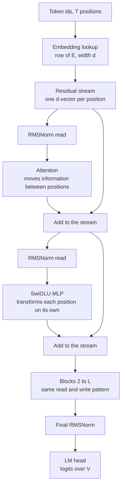
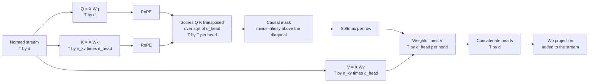
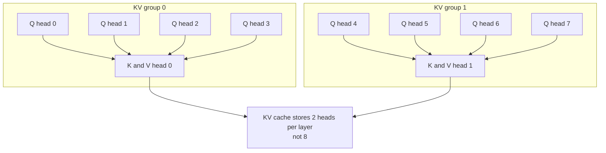
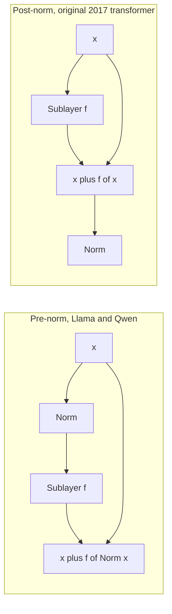
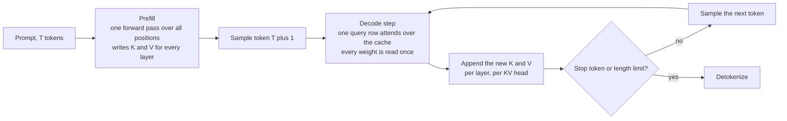

# Chapter 2: The Transformer, Derived

> **What you will be able to do.** Write a Llama-style decoder from an empty file, with RoPE, grouped-query attention, SwiGLU, RMSNorm, tied embeddings, and a KV cache, and explain every line; derive the attention scaling factor and the relative-position property of RoPE on a whiteboard; count the parameters of any published configuration from its config file; compute KV-cache size per token and explain why decode is bandwidth-bound; state what FlashAttention changes and what it does not.
>
> **Where it is used.** P0.2 (the model you build), P1.1 (the Llama-architecture models at 30M to 125M), and Chapter 4, which turns this chapter's parameter and cache arithmetic into memory and throughput estimates for every later project.
>
> **Prerequisites.** Chapter 1 for token ids, embeddings as table rows, and label shifting.

## 2.0 The problem this chapter solves

A customer asks why their 8B model needs an 80 GB GPU to fine-tune but runs on a laptop for inference, why the same model serves 60 concurrent users at 4k context and 8 at 32k, and whether the 70B model would fit on their two 24 GB cards. Each answer is a few lines of arithmetic on the architecture: how many parameters per layer, how many bytes per token of cache, which operations are compute-bound and which are bandwidth-bound. The arithmetic is only reliable if you know exactly what the layers contain, and the only way to know that is to have built one.

The same knowledge is what lets you debug. A fine-tune whose loss collapses to near zero in two hundred steps has a leaking causal mask. A model that generates well without a cache and garbage with one has a position offset bug. A loss that starts at 30 instead of 9.7 has a logit-scale problem. None of these are visible from a framework's high-level API, and all of them are obvious once you have implemented the block yourself.

This chapter derives the decoder-only transformer as used by Llama 3 and Qwen2.5, component by component, with the math where the math is used in practice, worked examples on real shapes, and listings that assemble into a complete model in under 200 lines. Chapter 3 trains it. Chapter 4 takes the counts derived here and turns them into memory, FLOPs, and time.

## 2.1 The residual stream

The organizing idea of the architecture is a vector of width $d$ per token position, called the residual stream, that every layer reads from and adds to. Nothing replaces it. The embedding writes the initial value; each of the $L$ blocks reads it through a normalization and a projection, computes something, and adds the result back; the final normalization and the language-model head read the last value and produce logits. Elhage et al. (2021) made this the frame for interpreting transformers, and it is also the right frame for implementing them: a block is a pair of read-compute-write operations on a shared bus.



*Figure 2.1: the residual stream runs vertically; each block reads it, computes, and adds back, and only the final norm and head consume it.*

Two facts follow. First, the two sublayers divide the work: attention is the only operation that mixes information across positions, and the MLP is applied to each position independently. Everything the model knows about token 37 that came from token 12 arrived through an attention head. Second, because writes are additive, the stream's magnitude grows with depth; pre-norm architectures (section 2.8) normalize on every read so that the growing magnitude does not destabilize the sublayers, and the final norm exists because the head would otherwise see an unnormalized sum of $2L$ contributions.

Formally, with $x^{(0)} \in \mathbb{R}^{T \times d}$ the embedded input and $\text{Attn}$, $\text{MLP}$, $\text{Norm}$ the sublayers,

$$
x^{(\ell + 1/2)} = x^{(\ell)} + \text{Attn}\big(\text{Norm}(x^{(\ell)})\big), \qquad x^{(\ell + 1)} = x^{(\ell + 1/2)} + \text{MLP}\big(\text{Norm}(x^{(\ell + 1/2)})\big),
$$

for $\ell = 0, \ldots, L - 1$, and the logits are $z = \text{Norm}(x^{(L)}) \, W_{out}$ with $W_{out} \in \mathbb{R}^{d \times V}$.

## 2.2 Token embeddings

The embedding matrix $E \in \mathbb{R}^{V \times d}$ maps id $i$ to row $E_i$. The lookup is a matrix multiply of a one-hot vector by $E$, implemented as an index. There is no nonlinearity and no position information yet; two occurrences of the same token start with the same vector.

The initialization scale matters more than it looks, because in a tied model (section 2.9) the same matrix produces the logits. GPT-2 initializes with a normal distribution of standard deviation 0.02. With $d = 768$, a row then has norm about $0.02 \sqrt{768} \approx 0.55$, and the logit for token $j$ at initialization, $z_j = h \cdot E_j$, has a standard deviation set by the norm of the final hidden state $h$ (about $\sqrt{d}$ after RMSNorm with unit gain, so $\sqrt{768} \approx 27.7$) times 0.02, about 0.55. Logits with standard deviation near 0.5 give a near-uniform softmax and an initial loss near $\ln V$, which is the check Chapter 3 asks for. Initialize with standard deviation 1 instead and the logits have standard deviation near 28, the softmax is nearly one-hot on a random token, and the initial loss is in the twenties.

Some implementations multiply the embedding output by $\sqrt{d}$ (the original 2017 transformer and Gemma do). Llama and Qwen do not. Either is fine as long as the initialization is chosen to match; mixing conventions between a checkpoint and a loader is a real bug.

## 2.3 Position: learned absolute versus RoPE

Attention (next section) is a set operation: permute the tokens and it computes the permuted result. The model must be told where each token is. Two mechanisms dominate.

### Learned absolute positions

GPT-2 adds a learned vector per position: a second table $P \in \mathbb{R}^{T_{max} \times d}$ and $x^{(0)}_t = E_{\text{id}_t} + P_t$. For GPT-2 small, $T_{max} = 1024$ and $d = 768$, so $P$ has 786,432 parameters. The table is a hard ceiling. Position 1025 has no vector, and positions near the end of the table are seen less often during training than positions near the start, so quality degrades toward the ceiling. The score between two tokens depends on their absolute indices, so the pattern "attend to the previous token" must be learned separately for every pair of adjacent positions.

### Rotary position embedding

RoPE (Su et al. 2021) injects position by rotating the query and key vectors, not by adding to the stream. It acts on pairs of dimensions. Take one pair $(x_1, x_2)$ of a query or key vector at position $m$, and an angular frequency $\theta$. The rotation by angle $m \theta$ is

$$
R(m\theta) \begin{pmatrix} x_1 \\ x_2 \end{pmatrix} = \begin{pmatrix} \cos m\theta & -\sin m\theta \\ \sin m\theta & \cos m\theta \end{pmatrix} \begin{pmatrix} x_1 \\ x_2 \end{pmatrix} = \begin{pmatrix} x_1 \cos m\theta - x_2 \sin m\theta \\ x_1 \sin m\theta + x_2 \cos m\theta \end{pmatrix}.
$$

Apply this to the query at position $m$ and the key at position $n$, and take their dot product. Because rotation matrices are orthogonal and compose by adding angles, $R(a)^{\top} R(b) = R(-a) R(b) = R(b - a)$, so

$$
\big(R(m\theta)\, q\big)^{\top} \big(R(n\theta)\, k\big) = q^{\top} R(m\theta)^{\top} R(n\theta)\, k = q^{\top} R\big((n - m)\theta\big)\, k.
$$

The score depends on $q$, $k$, and the offset $n - m$ only. Shift both tokens by the same amount and the score is unchanged. This is the relative-position property, and it is exact, not approximate.

Worked example. Let $\theta = 1$, $q = (1, 0)$ at position $m = 2$, $k = (1, 0)$ at position $n = 5$. Rotated: $q' = (\cos 2, \sin 2) = (-0.416, 0.909)$, $k' = (\cos 5, \sin 5) = (0.284, -0.959)$. Dot product: $(-0.416)(0.284) + (0.909)(-0.959) = -0.118 - 0.872 = -0.990$, which is $\cos 3 = \cos(5 - 2)$. Move both to positions 12 and 15: $(\cos 12, \sin 12) \cdot (\cos 15, \sin 15) = \cos 3 = -0.990$ again.

A head of dimension $d_{head}$ has $d_{head} / 2$ pairs, each with its own frequency,

$$
\theta_i = b^{-2i / d_{head}}, \qquad i = 0, 1, \ldots, d_{head}/2 - 1,
$$

where $b$ is the base, 10,000 in the original paper and Llama 2, 500,000 in Llama 3, 1,000,000 in Qwen2.5. Pair 0 rotates one radian per token, a wavelength of $2\pi \approx 6.3$ tokens, and resolves fine local order. For $d_{head} = 128$ and $b = 10{,}000$, the last pair has $\theta_{63} = 10{,}000^{-126/128} \approx 1.15 \times 10^{-4}$, a wavelength of about 54,000 tokens; it barely turns within an 8k context and encodes coarse position. Raising the base to 500,000 pushes that wavelength to about 2.6 million tokens, which is part of how Llama 3 supports long contexts. The frequencies are a geometric series, so the pairs cover scales from a few tokens to far beyond the training length, with more pairs at the fine end.

Why this generalizes better than a learned table. The model never sees an absolute index; every attention pattern it learns is a function of offset, so "attend three tokens back" learned at positions 10 to 13 applies at positions 5,000 to 5,003. There are no position parameters, so there is no table to run off the end of. The limit is that offsets larger than any seen in training put the low-frequency pairs at rotation angles the model never encountered, and quality degrades past the training length even though the mechanism is defined for any length. Position interpolation (Chen et al. 2023) and YaRN (Peng et al. 2023) rescale the frequencies so that a longer context maps onto the trained range of angles; Llama 3's large base is the same idea applied at pretraining time.

Two implementation conventions exist for which dimensions form a pair. The paper pairs adjacent dimensions $(x_{2i}, x_{2i+1})$. The Hugging Face Llama implementation pairs $x_i$ with $x_{i + d_{head}/2}$, the half-split layout, which lets the rotation be written as `x * cos + rotate_half(x) * sin` with a single concatenation. The two are equivalent up to a fixed permutation of the head dimensions, but a checkpoint trained under one is garbage under the other. Listing 2.1 uses the half-split layout to match the checkpoints you will load.

RoPE is applied to $q$ and $k$ only, after their projections and before the score, never to $v$. Applying it to $v$ would rotate the information being moved, which has no useful interpretation and hurts.

## 2.4 Attention from scratch

Attention lets each position gather information from earlier positions, weighted by relevance. The mechanism has six steps.



*Figure 2.2: the data flow of one causal self-attention sublayer, from the normalized stream to the write-back.*

**Projections.** From the normalized input $X \in \mathbb{R}^{T \times d}$, compute queries, keys, and values by three linear maps: $Q = X W_Q$, $K = X W_K$, $V = X W_V$. For a single head of dimension $d_{head}$, each matrix is $d \times d_{head}$. A query is what a position is looking for, a key is what a position advertises, a value is what it hands over when selected. Llama and Qwen2.5 use no biases here except that Qwen2.5 keeps biases on $W_Q$, $W_K$, $W_V$; GPT-2 has biases everywhere.

**Scores.** The score of query $i$ against key $j$ is the dot product $q_i \cdot k_j$, scaled:

$$
S_{ij} = \frac{q_i \cdot k_j}{\sqrt{d_{head}}}.
$$

The scale is not decoration. Suppose the components of $q$ and $k$ are independent with mean zero and unit variance, which is what a normalized input and a sensibly initialized projection produce. The dot product is a sum of $d_{head}$ products $q_{i,c} k_{j,c}$. Each product has mean $\mathbb{E}[q_{i,c}] \mathbb{E}[k_{j,c}] = 0$ and variance $\mathbb{E}[q_{i,c}^2] \mathbb{E}[k_{j,c}^2] = 1$, and the products are independent, so

$$
\mathrm{Var}(q_i \cdot k_j) = \sum_{c=1}^{d_{head}} \mathrm{Var}(q_{i,c} k_{j,c}) = d_{head}, \qquad \text{so} \qquad \mathrm{Var}\!\left(\frac{q_i \cdot k_j}{\sqrt{d_{head}}}\right) = 1.
$$

Without the scale, scores for $d_{head} = 128$ have standard deviation $\sqrt{128} \approx 11.3$. Two keys whose scores differ by two standard deviations, about 22.6, get softmax weights in the ratio $e^{22.6} \approx 6.5 \times 10^{9}$: the softmax is one-hot, and the gradient of a softmax output with respect to its input is proportional to $p(1 - p)$, which is essentially zero for a one-hot distribution. The head cannot learn. With the scale, a two-standard-deviation gap is a ratio of $e^{2} \approx 7.4$, weights of about 0.88 and 0.12, informative and trainable. The scale keeps the softmax in its responsive range at initialization; training then moves the scores where it wants them.

**Causal mask.** A decoder predicts token $t + 1$ from tokens $1$ to $t$. During training all positions are computed in parallel, so position $i$ must be prevented from seeing positions $j > i$. Set $S_{ij} = -\infty$ for $j > i$ before the softmax; $e^{-\infty} = 0$, so those positions receive exactly zero weight and contribute nothing to the output or the gradient. The mask is applied before the softmax and not after: zeroing weights after the softmax leaves the remaining weights summing to less than one and, worse, leaks information through the normalization constant. A mask that fails to cover even one future position is the most common bug in from-scratch implementations; section 2.14 describes the symptom and Exercise 2.4 the mechanism.

**Softmax.** Per row, $A_{ij} = \exp(S_{ij}) / \sum_{j'} \exp(S_{ij'})$, giving a distribution over the positions query $i$ may read from. Compute it in fp32 even when the model runs in bf16 or fp16: the exponentials are sensitive, and an fp16 softmax without max-subtraction overflows for any score above about 11.1 because $e^{11.1} > 65{,}504$, the largest fp16 value. Library kernels subtract the row maximum first; a hand-written one must too.

**Weighted sum.** The output for position $i$ is $o_i = \sum_j A_{ij} v_j$, a convex combination of the values at the positions the query selected. In matrix form $O = A V$ with $O \in \mathbb{R}^{T \times d_{head}}$.

**Output projection.** Heads are concatenated to width $d$ and multiplied by $W_O \in \mathbb{R}^{d \times d}$, and the result is added to the residual stream. $W_O$ is what lets the block choose which subspace of the stream each head writes into.

Worked example with $d_{head} = 2$ and three positions. Keys $k_1 = (1, 0)$, $k_2 = (0, 1)$, $k_3 = (1, 1)$; values $v_1 = (1, 0)$, $v_2 = (0, 1)$, $v_3 = (0, 0)$; query at position 3 is $q_3 = (1, 0)$. Raw scores $(1, 0, 1)$, scaled by $1/\sqrt{2}$ to $(0.707, 0, 0.707)$. Softmax: $e^{0.707} = 2.028$, sum $5.056$, weights $(0.401, 0.198, 0.401)$. Output $0.401 (1, 0) + 0.198 (0, 1) + 0.401 (0, 0) = (0.401, 0.198)$. Now the same query at position 2, where the causal mask hides $k_3$: scores $(0.707, 0)$, weights $(0.670, 0.330)$, output $(0.670, 0.330)$. Same query, different visible set, different answer. That dependence on the visible set is what the mask enforces and what a leak destroys.

The compute of one head is dominated by two matrix products: $Q K^{\top}$ costs $2 T^2 d_{head}$ FLOPs and $A V$ costs the same. Summed over $h$ heads with $h \, d_{head} = d$, attention costs about $4 T^2 d$ FLOPs per layer, against about $2 T \cdot 12 d^2 = 24 T d^2$ for the linear layers of a standard block. The ratio is $T / (6d)$: for $T = 512$, $d = 384$ it is 0.22, and for $T = 8192$, $d = 4096$ it is 0.33. Attention's quadratic term is a minority of the FLOPs at typical lengths but, as section 2.11 shows, a majority of the memory traffic.

## 2.5 Multi-head attention and what heads buy

Instead of one head of width $d$, the layer runs $h$ heads of width $d_{head} = d / h$ in parallel, each with its own $W_Q^{(i)}, W_K^{(i)}, W_V^{(i)} \in \mathbb{R}^{d \times d_{head}}$, concatenates the $h$ outputs into a $T \times d$ matrix, and applies $W_O$. In implementation the $h$ query projections are one $d \times d$ matrix whose output is reshaped to $(T, h, d_{head})$, and likewise for keys and values.

Heads cost nothing extra. The projections total $4 d^2$ parameters whether $h$ is 1 or 64, and the score computation totals $h \cdot 2 T^2 d_{head} = 2 T^2 d$ FLOPs regardless of $h$. What changes is expressiveness: each head has its own attention pattern, so a layer can simultaneously attend to the previous token, to the subject of the sentence, and to an earlier occurrence of the current token. Olsson et al. (2022) showed that specific heads implement specific algorithms, including induction heads that find the previous occurrence of the current token and copy what followed it, the mechanism behind in-context learning of repeated patterns. One head cannot express two patterns at once because a single softmax yields a single distribution.

The trade-off is per-head capacity. A head of dimension 64 computes scores in a 64-dimensional space; with $d_{head}$ too small the head cannot separate the keys it needs to. Head dimensions of 64 to 128 are the norm across published models (GPT-2 small uses 64, Llama 3 and Qwen2.5 use 128), and the choice is as much about kernel efficiency, which likes multiples of 64, as about modeling.

## 2.6 Grouped-query and multi-query attention

At inference, every decode step attends over every earlier position, and the keys and values of earlier positions do not change. Recomputing them would be $O(t)$ work per step for a sequence of length $t$; storing them, the KV cache (section 2.12), makes a step $O(1)$ in projections at the price of memory. That memory is $2 \times L \times h \times d_{head} \times \text{bytes}$ per token under standard multi-head attention, and for a large model at a long context it exceeds the weights.

Multi-query attention (MQA, Shazeer 2019) shares one key head and one value head across all $h$ query heads: $W_K, W_V \in \mathbb{R}^{d \times d_{head}}$ instead of $d \times d$, cutting the cache by a factor of $h$. Quality suffers measurably. Grouped-query attention (GQA, Ainslie et al. 2023) is the compromise: $n_{kv}$ key-value heads, each shared by $h / n_{kv}$ query heads. Ainslie et al. showed that GQA with 8 groups matches MHA quality closely while MQA does not, and that an MHA checkpoint can be converted by mean-pooling its key and value heads into groups and training briefly.



*Figure 2.3: grouped-query attention with 8 query heads and 2 key-value heads; each key-value head serves 4 query heads, and only the key-value heads are cached.*

The arithmetic for Llama-3-8B, which has $L = 32$, $d = 4096$, $h = 32$, $n_{kv} = 8$, $d_{head} = 128$:

- Parameters. $W_Q$ and $W_O$ are $4096 \times 4096$, 16.8M each. $W_K$ and $W_V$ are $4096 \times (8 \times 128) = 4096 \times 1024$, 4.2M each, instead of 16.8M under MHA. Attention per layer: $2 \times 16.8 + 2 \times 4.2 = 41.9$M parameters, versus 67.1M under MHA. Across 32 layers GQA saves about 805M parameters, about 10 percent of the model.
- Cache per token. $2 \times 32 \times 8 \times 128 \times 2 \text{ bytes} = 131{,}072$ bytes, 128 KB, versus 512 KB under MHA. An 8k-token sequence holds 1 GB of cache; 64 concurrent 8k sequences hold 64 GB. Under MHA the same load would be 256 GB. On an 80 GB A100 with 16 GB of bf16 weights, GQA leaves room for about 60 such sequences and MHA for about 15.

In implementation, each key-value head's tensor is repeated $h / n_{kv}$ times along the head axis before the score computation (Listing 2.2 uses `repeat_interleave`), or the kernel indexes the shared head directly to avoid the copy. PyTorch's `scaled_dot_product_attention` accepts unequal head counts with `enable_gqa=True` from version 2.5; check your version.

## 2.7 The MLP block: GELU versus SwiGLU

After attention has moved information between positions, the MLP transforms each position's vector independently. It holds about two thirds of a standard block's parameters and is where most factual associations are stored.

The original form is two linear maps with a nonlinearity between them and an expansion factor of 4:

$$
\text{MLP}(x) = \phi(x W_1 + b_1) W_2 + b_2, \qquad W_1 \in \mathbb{R}^{d \times 4d}, \quad W_2 \in \mathbb{R}^{4d \times d},
$$

for $8d^2$ parameters plus biases. GPT-2's $\phi$ is GELU (Hendrycks and Gimpel 2016), $\text{GELU}(z) = z \, \Phi(z)$ with $\Phi$ the standard normal cumulative distribution function, usually computed with a tanh approximation. It is a smooth relative of ReLU that passes small negative values with a small weight rather than zeroing them.

Llama, Qwen2.5, and most models since 2022 use SwiGLU (Shazeer 2020), a gated linear unit with the SiLU activation $\text{SiLU}(z) = z \, \sigma(z)$:

$$
\text{SwiGLU}(x) = \Big( \text{SiLU}(x W_{gate}) \odot (x W_{up}) \Big) W_{down}, \qquad W_{gate}, W_{up} \in \mathbb{R}^{d \times d_{ff}}, \quad W_{down} \in \mathbb{R}^{d_{ff} \times d}.
$$

Written per hidden unit $j$: the gate path computes $g_j = \text{SiLU}(x \cdot w^{gate}_j)$, the up path computes $u_j = x \cdot w^{up}_j$, and the hidden activation is the product $g_j u_j$. The gate is an input-dependent multiplier on a linear feature, which gives the unit a multiplicative interaction a single nonlinearity lacks. Shazeer reported better perplexity per parameter and per FLOP than GELU across the GLU variants he tested and offered no theoretical reason; the result has held up empirically across every major open model since.

Three matrices instead of two changes the parameter count: $3 d \, d_{ff}$ with no biases. To match the $8d^2$ of a standard block, $d_{ff} = 8d / 3 \approx 2.67 d$. Llama 2 7B, with $d = 4096$, uses $d_{ff} = 11{,}008$, which is $8d/3 = 10{,}923$ rounded up to a multiple of 256 for kernel alignment. Llama 3 8B uses $14{,}336 = 3.5d$, a deliberately larger MLP. Qwen2.5-1.5B uses $8{,}960 \approx 5.83 d$ with $d = 1536$. The $8/3$ rule is a convention for matching parameter budgets, not a law; read $d_{ff}$ from the configuration and count.

Worked count for Llama-3-8B: $3 \times 4096 \times 14{,}336 = 176{,}160{,}768$ parameters in the MLP of each layer, against 41.9M in attention. The MLP is 81 percent of the layer.

## 2.8 Normalization and block layout

Normalization rescales each position's vector to a standard magnitude before a sublayer reads it, so that the growing residual stream does not push the sublayer's inputs out of the range its weights were initialized for.

**LayerNorm** (Ba et al. 2016) subtracts the mean and divides by the standard deviation across the $d$ features, then applies a learned gain $\gamma$ and bias $\beta$:

$$
\mu = \frac{1}{d} \sum_{c=1}^{d} x_c, \qquad \sigma^2 = \frac{1}{d} \sum_{c=1}^{d} (x_c - \mu)^2, \qquad \text{LN}(x) = \gamma \odot \frac{x - \mu}{\sqrt{\sigma^2 + \epsilon}} + \beta,
$$

with $2d$ parameters and $\epsilon$ a small constant, typically $10^{-5}$, for numerical safety.

**RMSNorm** (Zhang and Sennrich 2019) drops the mean subtraction and the bias:

$$
\text{RMSNorm}(x) = \gamma \odot \frac{x}{\sqrt{\frac{1}{d} \sum_{c=1}^{d} x_c^2 + \epsilon}},
$$

with $d$ parameters. It is cheaper by one reduction and its authors found no quality loss; every Llama-style model uses it, with $\epsilon$ between $10^{-6}$ and $10^{-5}$.

Worked example on $x = (3, -4, 0, 0)$ with unit gain. RMSNorm: mean square $(9 + 16) / 4 = 6.25$, root $2.5$, output $(1.2, -1.6, 0, 0)$. LayerNorm: mean $-0.25$, variance $6.1875$, standard deviation $2.487$, output $(1.307, -1.508, 0.101, 0.101)$. Both put the vector at a magnitude near $\sqrt{d} = 2$; only LayerNorm shifts it.

**Pre-norm versus post-norm.** The 2017 transformer applied normalization after the residual addition, $x \leftarrow \text{Norm}(x + f(x))$, called post-norm. Every modern decoder normalizes before the sublayer, $x \leftarrow x + f(\text{Norm}(x))$, called pre-norm.



*Figure 2.4: pre-norm keeps an unnormalized identity path from input to output; post-norm normalizes the sum and breaks that path.*

Xiong et al. (2020) analyzed why pre-norm trains more stably. In post-norm, the gradient norm at initialization grows with depth near the output layers, so a large learning rate at step one diverges and a long warmup is needed. In pre-norm, the residual path from the embedding to the head is an unbroken identity plus small perturbations, gradients at initialization are well-behaved across depth, and training tolerates larger learning rates and shorter warmups. Post-norm, when it does train, can reach slightly lower loss at the same depth, which is why some encoder models kept it. For a decoder you train yourself, pre-norm with RMSNorm is the default and there is no reason to deviate.

Pre-norm has one consequence for the final layers: the stream reaching the head is unnormalized, so a final norm before the head is required. Omitting it produces logits whose scale depends on depth and an initial loss far above $\ln V$.

## 2.9 Weight tying, the LM head, and logits

The language-model head maps the normalized final stream to a score per vocabulary item: $z = \text{Norm}(x^{(L)}) \, W_{out}$, $W_{out} \in \mathbb{R}^{d \times V}$, giving logits $z \in \mathbb{R}^{T \times V}$. Softmax over the last axis gives the next-token distribution; cross-entropy against the shifted targets gives the loss (Chapter 3). The head costs $2 V d$ FLOPs per position and produces a $T \times V$ tensor that, in fp32 for the loss, is $4 T V$ bytes: for $T = 2048$ and $V = 128{,}256$, about 1 GB per sequence, which is why frameworks compute the loss in chunks for large vocabularies.

Weight tying (Press and Wolf 2017) sets $W_{out} = E^{\top}$: the same matrix embeds inputs and scores outputs. It saves $V d$ parameters, which is significant for small models: 38.6M of GPT-2 small's 124M, 233M of Qwen2.5-1.5B's 1.54B. It also couples the geometry of input and output representations, which acts as a regularizer at small scale and a constraint at large scale. The published pattern is consistent: GPT-2, SmolLM, Gemma, and Qwen2.5 at 0.5B to 3B tie; Llama 3 at every size and Qwen2.5 at 7B and above do not. For the P0.2 and P1.1 models, tie; the parameters saved are worth more than the constraint costs.

With tying, the embedding initialization sets the initial logit scale, as section 2.2 computed. Untied models can initialize the head separately, and some scale it by $1/\sqrt{d}$ for the same effect.

## 2.10 Parameter counting

Count per layer, multiply by $L$, add the embeddings. Biases and normalization gains are under 0.1 percent and are ignored except where a published total is being matched exactly.

**Standard block** (multi-head attention, GELU MLP with 4x expansion). Attention: $W_Q, W_K, W_V, W_O$ each $d \times d$, total $4d^2$. MLP: $d \times 4d$ and $4d \times d$, total $8d^2$. Per layer $12 d^2$, so

$$
N_{\text{non-embed}} \approx 12 \, L \, d^2 .
$$

Embeddings add $V d$, or $2 V d$ if untied, and learned positions add $T_{max} d$.

**Llama-style block** (GQA attention, SwiGLU MLP, no biases). $W_Q$ and $W_O$ are $d \times d$; $W_K$ and $W_V$ are $d \times n_{kv} d_{head}$. With $d = h \, d_{head}$, that is $d^2 \cdot n_{kv}/h$ each. MLP is $3 d \, d_{ff}$. Per layer:

$$
N_{\text{layer}} = 2 d^2 \left(1 + \frac{n_{kv}}{h}\right) + 3 \, d \, d_{ff}.
$$

With $n_{kv} = h$ and $d_{ff} = 8d/3$ this reduces to $4d^2 + 8d^2 = 12d^2$, the standard count.

**GPT-2 small**: $L = 12$, $d = 768$, $h = 12$, $V = 50{,}257$, $T_{max} = 1024$, tied. Per layer, $12 \times 768^2 = 7{,}077{,}888$, plus biases and LayerNorm parameters $4 \times 768 + 3072 + 768 + 4 \times 768 = 9{,}984$, giving 7,087,872. Twelve layers: 85,054,464. Embeddings $50{,}257 \times 768 = 38{,}597{,}376$. Positions $1024 \times 768 = 786{,}432$. Final LayerNorm 1,536. Total 124,439,808, the published 124M. Embeddings and positions are 32 percent of the model.

**Qwen2.5-1.5B**: from its configuration, $L = 28$, $d = 1536$, $h = 12$, $n_{kv} = 2$, $d_{head} = 128$, $d_{ff} = 8960$, $V = 151{,}936$, tied, with biases on $W_Q, W_K, W_V$. Attention per layer: $2 \times 1536^2 \times (1 + 2/12) = 5{,}505{,}024$, plus biases $1536 + 256 + 256 = 2048$. MLP: $3 \times 1536 \times 8960 = 41{,}287{,}680$. Two RMSNorms: 3,072. Per layer 46,797,824. Twenty-eight layers: 1,310,339,072, which is the 1.31B non-embedding count on the model card. Embeddings $151{,}936 \times 1536 = 233{,}373{,}696$. Total about 1.544B, the published 1.54B. Attention is 12 percent of each layer; GQA with $n_{kv} = 2$ made the key and value projections one sixth the size of the query projection.

**Llama-3-8B**: $L = 32$, $d = 4096$, $h = 32$, $n_{kv} = 8$, $d_{ff} = 14{,}336$, $V = 128{,}256$, untied. Attention $2 \times 4096^2 \times 1.25 = 41{,}943{,}040$; MLP $176{,}160{,}768$; per layer 218.1M; 32 layers 6.98B; embeddings $2 \times 128{,}256 \times 4096 = 1.05$B; total 8.03B. Non-embedding parameters are 87 percent of the model.

The counts feed Chapter 4 directly: bf16 weights are $2N$ bytes, training states are about $16N$ bytes, forward FLOPs are about $2N$ per token. Count before you download, and check the framework's reported count against yours.

## 2.11 FlashAttention

Standard attention materializes the $T \times T$ score matrix $S$ and the probability matrix $A$ for every head, writes them to GPU memory, reads them back for the softmax and the value product, and saves $A$ for the backward pass. For $T = 4096$ and $h = 32$ in bf16, $S$ alone is $4096^2 \times 32 \times 2$ bytes, 1 GB, per layer per sequence, and $A$ is another. Across 32 layers with $A$ saved for backward, that is 32 GB of activations for one sequence, more than the weights. The memory scales as $T^2$, which is what made long contexts impractical.

FlashAttention (Dao et al. 2022) computes the same result, exactly, without materializing $S$ or $A$. The observation is that GPU memory (HBM) is slow relative to the on-chip SRAM of a streaming multiprocessor, and attention at typical sizes is bound by HBM traffic, not by arithmetic. The kernel tiles $Q$, $K$, and $V$ into blocks small enough to sit in SRAM, loads a block of queries once, streams the key and value blocks past it, and accumulates the output for those queries without ever writing a full row of scores.

The trick that makes streaming possible is the online softmax (Milakov and Gimelshein 2018). A softmax needs the row maximum and the row sum of exponentials, which seem to require seeing the whole row first. Instead, keep running statistics and rescale when a new block raises the maximum. For a row processed in blocks $j = 1, 2, \ldots$ with score block $S_j$ and value block $V_j$:

$$
m_j = \max\big(m_{j-1}, \text{rowmax}(S_j)\big), \qquad \ell_j = e^{m_{j-1} - m_j} \, \ell_{j-1} + \text{rowsum}\big(e^{S_j - m_j}\big), \qquad O_j = e^{m_{j-1} - m_j} \, O_{j-1} + e^{S_j - m_j} \, V_j ,
$$

with $m_0 = -\infty$, $\ell_0 = 0$, $O_0 = 0$, and the final output $O / \ell$. Worked example on a row with scores $(1, 3)$ in block 1 and $(2, 5)$ in block 2: after block 1, $m_1 = 3$ and $\ell_1 = e^{-2} + e^{0} = 1.135$; after block 2, $m_2 = 5$ and $\ell_2 = e^{3 - 5} \times 1.135 + e^{-3} + e^{0} = 0.154 + 0.050 + 1 = 1.203$, which equals the direct sum $e^{-4} + e^{-2} + e^{-3} + e^{0} = 1.203$. The rescaling factor $e^{m_{j-1} - m_j}$ corrects everything accumulated under the old maximum.

For the backward pass, FlashAttention stores only $O$ and the per-row statistic $\log \ell + m$, and recomputes $A$ block by block from $Q$, $K$, and that statistic. Memory for attention falls from $O(T^2)$ to $O(T)$ per head. FLOPs rise slightly, by the recomputation, but wall-clock time falls by two to four times at typical sizes because the HBM traffic that was the bottleneck has been removed. FlashAttention-2 (Dao 2023) reorganized the work partitioning across warps and reached 50 to 70 percent of peak matrix throughput on A100 and H100.

What it changes: memory and speed. What it does not change: the result, which is bit-for-bit attention up to floating-point reassociation, and the asymptotic FLOP count, which stays $O(T^2 d)$. FlashAttention does not make attention linear in $T$; it makes the quadratic part affordable by keeping it on-chip.

In PyTorch, `F.scaled_dot_product_attention` dispatches to a FlashAttention-2 kernel on Ampere, Ada, and Hopper GPUs (compute capability 8.0 and above, so the RTX 4060 at 8.9 qualifies), and to a memory-efficient kernel derived from xFormers on older GPUs such as the T4, which also avoids materializing $A$ but is slower. The explicit `flash-attn` package adds features such as variable-length packed batches. Use the fused kernel for anything beyond a few hundred tokens; the hand-written attention of Listing 2.2 is for understanding and for verifying the fused kernel's output on small inputs.

## 2.12 The KV cache at inference and why decode is sequential

Generation proceeds one token at a time. Given a prompt of $T$ tokens, the model computes logits at position $T$, a token is sampled, appended, and the model must now compute logits at position $T + 1$. Only the new position's query is new: the keys and values of positions $1$ to $T$ are exactly what they were, because each position's $k$ and $v$ depend only on that position's stream and RoPE angle, neither of which has changed.



*Figure 2.5: prefill fills the cache in one parallel pass; each decode step adds one column to it and reads all of it.*

The KV cache stores, for every layer and every key-value head, the $k$ and $v$ vectors of every position seen so far. A decode step projects the single new token to $q$, $k$, $v$, appends $k$ and $v$ to the cache, and attends the one query row over the full cache. The per-token size is

$$
\text{bytes per token} = 2 \times L \times n_{kv} \times d_{head} \times \text{bytes per element},
$$

the leading 2 for keys and values. Llama-3-8B in bf16: $2 \times 32 \times 8 \times 128 \times 2 = 131{,}072$ bytes, 128 KB. Qwen2.5-1.5B: $2 \times 28 \times 2 \times 128 \times 2 = 28{,}672$ bytes, 28 KB. The P0.2 model of section 2.15 with $L = 6$, $n_{kv} = 2$, $d_{head} = 64$: 3 KB. Chapter 4 extends this to sequences and concurrent users; Chapter 13 builds PagedAttention on top of it.

Two properties of decode follow and drive every serving design. First, decode is sequential: the input to step $t + 1$ is the token sampled at step $t$, so the steps of one sequence cannot run in parallel, however many GPUs are available. Speculative decoding (Chapter 13) is the workaround, and it works by guessing. Second, decode is memory-bound: each step reads every weight of the model once, plus the entire cache, to produce a single token per sequence. With bf16 weights of $2N$ bytes and a bandwidth of $W$ bytes per second, no single-sequence decoder can exceed $W / 2N$ tokens per second. On the RTX 4060 Laptop GPU, with about 256 GB/s of memory bandwidth (verify against the spec sheet), Qwen2.5-1.5B in bf16 (3.1 GB) is bounded at about 83 tokens per second and a 7B model at 4-bit (about 4 GB) at about 64; the 30-plus tokens per second that P0.1 asks Ollama to demonstrate is this bound with kernel overheads. Batching many sequences reads the weights once per step for all of them, which is why throughput per GPU rises almost linearly with batch until the cache reads dominate. Prefill, by contrast, processes $T$ positions per weight read and is compute-bound. Chapter 4 makes this the roofline argument.

RoPE interacts with the cache in one way that causes real bugs: the new token must be rotated by the angle of its actual position, $T + t$, not position 0. A cache implementation that recomputes cosines and sines from `arange(len(new_tokens))` instead of from the running position produces output that is fine for the first step and drifts thereafter. Listing 2.4 threads a `start_pos` through the forward pass for this reason, and the test in section 2.14 catches the bug in one line.

## 2.13 Implementation notes

Four listings assemble into a complete model. They are written to be read top to bottom and to run with `import math`, `import torch`, `import torch.nn as nn`, and `import torch.nn.functional as F`. Shapes are commented at the points where they change.

**Listing 2.1: RoPE tables and application, half-split layout.**

```python
def rope_cache(max_T: int, d_head: int, base: float = 10000.0, device=None):
    inv_freq = 1.0 / (base ** (torch.arange(0, d_head, 2, device=device).float() / d_head))
    pos = torch.arange(max_T, device=device).float()
    freqs = torch.outer(pos, inv_freq)                 # (max_T, d_head/2), entry m * theta_i
    emb = torch.cat([freqs, freqs], dim=-1)            # (max_T, d_head), half-split layout
    return emb.cos(), emb.sin()

def rotate_half(x: torch.Tensor) -> torch.Tensor:
    x1, x2 = x.chunk(2, dim=-1)
    return torch.cat([-x2, x1], dim=-1)

def apply_rope(x: torch.Tensor, cos: torch.Tensor, sin: torch.Tensor) -> torch.Tensor:
    # x: (B, H, T, d_head); cos, sin: (T, d_head) for exactly the positions of x
    return x * cos + rotate_half(x) * sin
```

`inv_freq` is the vector $\theta_i = b^{-2i/d_{head}}$; `torch.outer` with the position index gives the angle $m \theta_i$ for every position and pair. The tables are concatenated with themselves so that dimension $i$ and dimension $i + d_{head}/2$ carry the same angle, which is the half-split pairing. `apply_rope` then computes, for the first half, $x_i \cos - x_{i + d/2} \sin$, and for the second half, $x_{i + d/2} \cos + x_i \sin$: exactly the 2-d rotation of section 2.3 applied to each pair. The tables are computed once for `max_T` positions and sliced per call; the caller is responsible for passing the slice that matches the positions of `x`, which is how the decode offset is handled.

**Listing 2.2: causal self-attention with grouped-query heads and an optional cache.**

```python
class CausalSelfAttention(nn.Module):
    def __init__(self, d: int, n_heads: int, n_kv_heads: int):
        super().__init__()
        assert d % n_heads == 0 and n_heads % n_kv_heads == 0
        self.h, self.hkv, self.dh = n_heads, n_kv_heads, d // n_heads
        self.wq = nn.Linear(d, n_heads * self.dh, bias=False)
        self.wk = nn.Linear(d, n_kv_heads * self.dh, bias=False)
        self.wv = nn.Linear(d, n_kv_heads * self.dh, bias=False)
        self.wo = nn.Linear(n_heads * self.dh, d, bias=False)

    def forward(self, x, cos, sin, cache=None):
        B, T, _ = x.shape
        q = self.wq(x).view(B, T, self.h, self.dh).transpose(1, 2)      # (B, H, T, dh)
        k = self.wk(x).view(B, T, self.hkv, self.dh).transpose(1, 2)    # (B, Hkv, T, dh)
        v = self.wv(x).view(B, T, self.hkv, self.dh).transpose(1, 2)
        q, k = apply_rope(q, cos, sin), apply_rope(k, cos, sin)
        if cache is not None:                                           # decode: extend the cache
            k = torch.cat([cache[0], k], dim=2)
            v = torch.cat([cache[1], v], dim=2)
        new_cache = (k, v)
        rep = self.h // self.hkv                                        # query heads per KV head
        k = k.repeat_interleave(rep, dim=1)                             # (B, H, S, dh)
        v = v.repeat_interleave(rep, dim=1)
        S = k.size(2)
        scores = (q @ k.transpose(-2, -1)) / math.sqrt(self.dh)         # (B, H, T, S)
        causal = torch.ones(T, S, dtype=torch.bool, device=x.device).tril(diagonal=S - T)
        scores = scores.masked_fill(~causal, float("-inf"))
        w = torch.softmax(scores.float(), dim=-1).to(q.dtype)           # softmax in fp32
        y = (w @ v).transpose(1, 2).reshape(B, T, self.h * self.dh)     # concatenate heads
        return self.wo(y), new_cache
```

The three projections produce $h$ query heads but only $n_{kv}$ key and value heads, so `wk` and `wv` have $n_{kv} d_{head}$ output features: that is the GQA parameter saving. RoPE is applied before the cache concatenation so that cached keys carry their own position's rotation permanently. `repeat_interleave` expands each key-value head to serve its group of `rep` consecutive query heads, matching the grouping convention of Hugging Face checkpoints. The mask is built for a `T` by `S` score matrix where `S` may exceed `T` during decode; `tril(diagonal=S - T)` keeps entry $(i, j)$ when $j \le i + (S - T)$, so query $i$ of the new block sees all cached positions and its own, and nothing after. The softmax runs in fp32 and is cast back, which costs little and removes an fp16 overflow risk. For any real training run, replace the four lines from `scores` to `y` with `F.scaled_dot_product_attention(q, k, v, is_causal=True, enable_gqa=True)` (PyTorch 2.5 or later; check your version) to get the fused kernel; keep this version for tests.

**Listing 2.3: RMSNorm, SwiGLU, and the pre-norm block.**

```python
class RMSNorm(nn.Module):
    def __init__(self, d: int, eps: float = 1e-6):
        super().__init__()
        self.eps, self.weight = eps, nn.Parameter(torch.ones(d))

    def forward(self, x):
        xf = x.float()
        xf = xf * torch.rsqrt(xf.pow(2).mean(dim=-1, keepdim=True) + self.eps)
        return self.weight * xf.to(x.dtype)

class SwiGLU(nn.Module):
    def __init__(self, d: int, d_ff: int):
        super().__init__()
        self.w_gate = nn.Linear(d, d_ff, bias=False)
        self.w_up = nn.Linear(d, d_ff, bias=False)
        self.w_down = nn.Linear(d_ff, d, bias=False)

    def forward(self, x):
        return self.w_down(F.silu(self.w_gate(x)) * self.w_up(x))

class Block(nn.Module):
    def __init__(self, d: int, n_heads: int, n_kv_heads: int, d_ff: int):
        super().__init__()
        self.norm1, self.attn = RMSNorm(d), CausalSelfAttention(d, n_heads, n_kv_heads)
        self.norm2, self.mlp = RMSNorm(d), SwiGLU(d, d_ff)

    def forward(self, x, cos, sin, cache=None):
        a, cache = self.attn(self.norm1(x), cos, sin, cache)
        x = x + a                                   # write attention output to the stream
        x = x + self.mlp(self.norm2(x))             # write MLP output to the stream
        return x, cache
```

`RMSNorm` computes the mean square in fp32 regardless of the model dtype, because the sum of squares of a bf16 vector loses precision, then casts back before applying the gain; this is the Llama reference behavior. `SwiGLU` is three matrices and one line: the gate path through SiLU multiplies the up path elementwise, then projects down. `Block` is the residual stream made literal: two reads through norms, two adds. The block never normalizes its output; that is the pre-norm layout, and it is why the model needs a final norm.

**Listing 2.4: a tied-embedding Llama-style model with cached generation.**

```python
class TinyLlama(nn.Module):
    def __init__(self, V, d, L, n_heads, n_kv_heads, d_ff, max_T, rope_base=10000.0):
        super().__init__()
        self.embed = nn.Embedding(V, d)
        self.blocks = nn.ModuleList(Block(d, n_heads, n_kv_heads, d_ff) for _ in range(L))
        self.norm = RMSNorm(d)
        self.lm_head = nn.Linear(d, V, bias=False)
        self.lm_head.weight = self.embed.weight                        # weight tying
        cos, sin = rope_cache(max_T, d // n_heads, rope_base)
        self.register_buffer("cos", cos, persistent=False)
        self.register_buffer("sin", sin, persistent=False)
        self.apply(self._init)

    @staticmethod
    def _init(m):
        if isinstance(m, (nn.Linear, nn.Embedding)):
            nn.init.normal_(m.weight, mean=0.0, std=0.02)

    def forward(self, idx, targets=None, caches=None, start_pos: int = 0):
        B, T = idx.shape
        cos, sin = self.cos[start_pos:start_pos + T], self.sin[start_pos:start_pos + T]
        x = self.embed(idx)
        new_caches = []
        for i, blk in enumerate(self.blocks):
            x, c = blk(x, cos, sin, None if caches is None else caches[i])
            new_caches.append(c)
        logits = self.lm_head(self.norm(x))
        loss = None
        if targets is not None:
            loss = F.cross_entropy(logits.float().view(-1, logits.size(-1)), targets.view(-1))
        return logits, loss, new_caches

    @torch.no_grad()
    def generate(self, idx, max_new: int, temperature: float = 1.0):
        logits, _, caches = self(idx)                                   # prefill fills the cache
        for _ in range(max_new):
            probs = torch.softmax(logits[:, -1].float() / temperature, dim=-1)
            nxt = torch.multinomial(probs, num_samples=1)
            idx = torch.cat([idx, nxt], dim=1)
            logits, _, caches = self(nxt, caches=caches, start_pos=idx.size(1) - 1)
        return idx
```

Assigning `self.lm_head.weight = self.embed.weight` makes the two modules share one parameter tensor; the parameter count drops by $V d$ and gradients from both uses accumulate into it. The RoPE tables are buffers, not parameters, and are marked non-persistent so that checkpoints do not carry them. `start_pos` selects the RoPE rows for the positions actually being processed: zero for a full forward or prefill, and the current sequence length minus one for each decode step, which is the fix for the drift bug of section 2.12. The loss is computed on fp32 logits, the standard precaution with large vocabularies. `generate` runs prefill once, then one-token forward passes against the cache; a correct implementation produces the same tokens as re-running the full forward at every step under greedy decoding, which is the equivalence test in the next section. Top-k and top-p sampling and the residual-branch initialization scaling belong to Chapter 3.

## 2.14 Failure modes

| Symptom | Likely cause | How to confirm | Fix |
|---|---|---|---|
| Training loss falls to near zero within a few hundred steps, samples are garbage | Causal mask leaks: wrong `diagonal`, mask applied after softmax, or `is_causal` omitted from the fused call | Perturb token 8 of a 12-token input; logits at positions 0 to 7 must be unchanged | Mask before softmax with $-\infty$; use `tril(diagonal=S - T)`; assert the leak test in CI |
| Initial loss far above $\ln V$ (20 or more) | Logit scale too large: embedding init too wide with tying, missing final norm, or the $\sqrt{d}$ embedding multiplier applied without matching init | Print the standard deviation of the logits on the first batch; it should be under 1 | Init embeddings at std 0.02; add the final RMSNorm; pick one convention |
| Initial loss far below $\ln V$ | Targets degenerate (all one id) or labels equal inputs | Histogram the first batch of targets; check the shift | Fix the data path (Chapter 1) |
| NaN in the first steps | Softmax over a fully masked row (all $-\infty$ gives $0/0$); fp16 softmax overflow; RMSNorm without $\epsilon$ on a zero vector | Check for rows where every key is masked, for instance padding at the start; check dtype of the softmax | Never mask a query's own position; compute softmax in fp32 with max-subtraction; keep $\epsilon$ |
| Cached generation matches uncached for one step then diverges | RoPE angle for new tokens taken from position 0 instead of the running position | Greedy-decode 8 tokens with and without the cache and compare ids | Slice `cos` and `sin` at `start_pos`; test equivalence in CI |
| Cached generation differs at every step | Cache appended before RoPE, or keys and values swapped, or cache from the wrong layer | Compare the first decode step's attention weights with the full forward's last row | Apply RoPE before concatenation; index caches by layer |
| Parameter count off by exactly $V d$ | Tying applied in one place and not the other, or counted twice | Compare `sum(p.numel())` with the hand count | Tie by assigning the weight tensor; count shared parameters once |
| Shape error when `n_kv_heads` differs from `n_heads` | Keys not expanded to the query head count before the matmul | Print `k.shape` before `scores` | `repeat_interleave` by `h // hkv`, or `enable_gqa=True` |
| Loading a Llama checkpoint gives garbage despite matching shapes | RoPE pairing convention differs from the checkpoint (interleaved versus half-split) | Feed a known prompt and compare logits against the reference implementation | Use the half-split layout for Hugging Face Llama weights; permute otherwise |
| Out of memory at sequence length 4k with a small model | Materialized $T \times T$ attention matrices in the hand-written path | Memory scales with $T^2$ when you double $T$ | Switch to `scaled_dot_product_attention` |
| Loss improves but far slower than a reference | Post-norm layout or missing pre-norm, or the residual add applied to the normed tensor instead of the raw stream | Diff the block against Listing 2.3 line by line | Add to the raw stream; norm only on the read path |
| Model attends only to the previous token or only to position 0 | RoPE base or frequencies wrong (all pairs at the same frequency), or positions not passed | Print `inv_freq`; it must be a geometric series from 1 down | Recompute the tables from $\theta_i = b^{-2i/d_{head}}$ |

## 2.15 On your machine

**The P0.2 model.** A configuration that trains to readable TinyStories in under an hour on the RTX 4060: $V = 8192$, $d = 384$, $L = 6$, $h = 6$, $n_{kv} = 2$, $d_{ff} = 1024$, $T = 512$, tied. Count: attention per layer $2 \times 384^2 \times (1 + 2/6) = 393{,}216$, MLP $3 \times 384 \times 1024 = 1{,}179{,}648$, per layer 1.57M, six layers 9.44M, embeddings $8192 \times 384 = 3.15$M, total 12.6M parameters (13.8M with $n_{kv} = 6$). Training states at about 16 bytes per parameter (Chapter 3) are 200 MB. Activations at batch 32 and $T = 512$ with the hand-written attention are dominated by the score and probability matrices, $32 \times 6 \times 512^2 \times 2$ bytes, about 100 MB each per layer, about 1.2 GB across six layers; with the fused kernel that term disappears and the MLP activations of about 34 MB per tensor per layer dominate. Total under 3 GB either way, so batch 32 is comfortable and batch 64 fits.

Forward and backward FLOPs are about $6 N$ per token (Chapter 4), $6 \times 12.6\text{M} \approx 76$ MFLOP, plus the tied head at $6 \times 3.15\text{M} \approx 19$ MFLOP counted in that $N$. At an achieved 8 to 12 TFLOPS, which is realistic for a model this small on the 4060 where kernel launch overhead is significant, expect 80,000 to 150,000 tokens per second, so a 100M-token pass takes 11 to 21 minutes. Measure and record tokens per second; a number under 40,000 means the data loader or a Python-level loop is the bottleneck (Chapter 3).

**The tests to run on the 4060 before training.** Parameter count against the hand count. Initial loss within 0.5 of $\ln 8192 = 9.01$. The causal leak test: change one token and confirm earlier logits are bit-identical. The cache equivalence test: greedy decoding with and without the cache produces identical ids for 32 steps. The fused-kernel check: `scaled_dot_product_attention` output matches Listing 2.2 within $10^{-5}$ on a 7-token input in fp32. All five run in seconds on the GPU or the CPU.

**Inference with Qwen2.5-1.5B.** Weights in bf16 are 3.1 GB. Its cache is 28 KB per token, so after weights and about 0.5 GB of runtime overhead, about 4.4 GB remain for cache: about 160,000 tokens, which is 20 sequences of 8k or 5 of 32k. Single-sequence decode is bounded near 83 tokens per second by the 4060's bandwidth. Hand-written attention at 8k context would materialize $12 \times 8192^2 \times 2$ bytes, 1.6 GB, per layer for the scores alone and fail; the fused kernel makes 32k feasible.

**Kaggle T4s.** 16 GB each, compute capability 7.5, so no FlashAttention-2 and no bf16. `scaled_dot_product_attention` falls back to the memory-efficient kernel, which still avoids the $T^2$ materialization. Train in fp16 with a loss scaler (Chapter 3) and keep the softmax in fp32, as Listing 2.2 does; the fp16 overflow row of the failure-modes table is a T4 problem, not a 4060 problem.

**A rented A100 80 GB.** FlashAttention-2 at full speed and 2 TB/s of bandwidth. The 125M model of P1.1 with the fused kernel should exceed 300,000 tokens per second in bf16; the exact figure depends on the data loader and is one of the numbers P1.1 asks you to report with its MFU. Llama-3-8B in bf16 leaves about 64 GB for cache, about 500,000 tokens at 128 KB each: 60 sequences of 8k, or a handful at 128k.

## Exercises

### Exercise 2.1: derive the scaling factor

Let $q, k \in \mathbb{R}^{d_{head}}$ have independent components with mean 0 and variance 1. Show that $\mathrm{Var}(q \cdot k) = d_{head}$ and hence that dividing by $\sqrt{d_{head}}$ gives unit variance. Then compute the softmax weights for two keys whose unscaled scores differ by $2\sqrt{d_{head}}$ when $d_{head} = 128$, with and without the scale.

<details><summary>Solution</summary>

$q \cdot k = \sum_{c=1}^{d_{head}} q_c k_c$. Each term has $\mathbb{E}[q_c k_c] = \mathbb{E}[q_c]\mathbb{E}[k_c] = 0$ by independence and $\mathrm{Var}(q_c k_c) = \mathbb{E}[q_c^2 k_c^2] - 0 = \mathbb{E}[q_c^2]\mathbb{E}[k_c^2] = 1$. The terms are independent, so variances add: $\mathrm{Var}(q \cdot k) = d_{head}$. Dividing by $\sqrt{d_{head}}$ divides the variance by $d_{head}$, giving 1. A gap of $2\sqrt{128} = 22.6$ in unscaled scores gives weights $1 / (1 + e^{-22.6}) \approx 1 - 1.5 \times 10^{-10}$ and $1.5 \times 10^{-10}$: one-hot to ten decimal places, with a softmax gradient proportional to $p(1-p) \approx 10^{-10}$. Scaled, the gap is 2, and the weights are $1/(1 + e^{-2}) = 0.881$ and $0.119$, with gradient factor $0.881 \times 0.119 = 0.105$.

</details>

### Exercise 2.2: count parameters from a configuration

A Llama-style model has $L = 24$, $d = 2048$, $h = 16$, $n_{kv} = 8$, $d_{ff} = 5632$, $V = 32{,}000$, tied embeddings, no biases. Compute the per-layer count, the non-embedding total, the embedding count, and the total. What fraction of each layer is attention?

<details><summary>Solution</summary>

$d_{head} = 128$. Attention: $2 \times 2048^2 \times (1 + 8/16) = 2 \times 4{,}194{,}304 \times 1.5 = 12{,}582{,}912$. MLP: $3 \times 2048 \times 5632 = 34{,}603{,}008$. Per layer $47{,}185{,}920$, of which attention is 26.7 percent. Non-embedding: $24 \times 47{,}185{,}920 = 1{,}132{,}462{,}080$, about 1.13B. Embeddings: $32{,}000 \times 2048 = 65{,}536{,}000$, counted once because tied. Total about 1.198B, so this is a "1.2B" model with 5.5 percent of its parameters in the embedding.

</details>

### Exercise 2.3: KV-cache bytes per token

Compute the KV-cache size per token in bf16 for Qwen2.5-1.5B ($L = 28$, $n_{kv} = 2$, $d_{head} = 128$) and Llama-3-8B ($L = 32$, $n_{kv} = 8$, $d_{head} = 128$). Then compute the cache for one 8,192-token sequence and for 64 concurrent such sequences for each. How many 8k sequences fit in 4 GB of free memory on the 4060 for Qwen2.5-1.5B?

<details><summary>Solution</summary>

Qwen2.5-1.5B: $2 \times 28 \times 2 \times 128 \times 2 = 28{,}672$ bytes, 28 KB per token. Per 8k sequence: $28{,}672 \times 8192 = 234{,}881{,}024$ bytes, 224 MB. For 64 sequences: 14 GB. Llama-3-8B: $2 \times 32 \times 8 \times 128 \times 2 = 131{,}072$ bytes, 128 KB per token; 1 GB per 8k sequence; 64 GB for 64 sequences. In 4 GB free on the 4060, Qwen2.5-1.5B fits $4096 / 224 \approx 18$ sequences of 8k tokens.

</details>

### Exercise 2.4: why a broken causal mask drives the loss to near zero

Suppose the mask is built with `tril(diagonal=1)` instead of `tril(diagonal=0)`. Explain mechanically how the model achieves near-zero training loss, why validation loss also collapses, and why generation is nonetheless garbage.

<details><summary>Solution</summary>

With `diagonal=1`, query $i$ may attend to key $i + 1$, the position holding the very token it is trained to predict (targets are inputs shifted by one). An attention head can learn to place all its weight on position $i + 1$ and its value projection to pass the token identity through; $W_O$ and the MLP then map that identity to a one-hot logit. This is a copy circuit that needs no language knowledge, is easy to find by gradient descent, and drives cross-entropy toward zero within hundreds of steps. Validation loss collapses too because the validation forward pass uses the same leaking mask on full sequences, so the same copy is available. At generation time the token at position $i + 1$ does not exist yet; the copy circuit reads whatever occupies that slot, which is nothing meaningful, and the model has learned nothing else, so output is garbage. The leak test (perturb a later token, check that earlier logits are unchanged) catches this before training; the guide's rule that "loss near zero means peeking" is this mechanism.

</details>

### Exercise 2.5: the relative-position property for a 2-d pair

Prove that $R(a)^{\top} R(b) = R(b - a)$ for 2-d rotation matrices, and conclude that the RoPE score between a query at position $m$ and a key at position $n$ depends only on $n - m$. Verify numerically with $\theta = 1$, $q = (1, 0)$, $k = (0, 1)$, $m = 3$, $n = 7$.

<details><summary>Solution</summary>

$R(a)^{\top}$ is the rotation by $-a$ because $\cos$ is even and $\sin$ is odd: transposing swaps the off-diagonal $-\sin a$ and $\sin a$, which is $R(-a)$. Rotations compose by adding angles, $R(-a) R(b) = R(b - a)$, by the angle-addition identities $\cos(b-a) = \cos a \cos b + \sin a \sin b$ and $\sin(b-a) = \sin b \cos a - \cos b \sin a$, which are what the matrix product yields entry by entry. Then $(R(m\theta) q) \cdot (R(n\theta) k) = q^{\top} R(m\theta)^{\top} R(n\theta) k = q^{\top} R((n-m)\theta) k$, a function of $n - m$. Numerically: $q' = (\cos 3, \sin 3) = (-0.990, 0.141)$, $k' = R(7)(0, 1) = (-\sin 7, \cos 7) = (-0.657, 0.754)$. Dot: $0.650 + 0.106 = 0.757$. Directly, $q^{\top} R(4) k = (1, 0) \cdot (-\sin 4, \cos 4) = -\sin 4 = 0.757$. Equal, and independent of the absolute positions.

</details>

### Exercise 2.6: SwiGLU width for a fixed budget

For $d = 2048$, find $d_{ff}$ so that a SwiGLU MLP has the same parameters as a standard 4x GELU MLP, then round up to a multiple of 256. Llama-3-8B chose $d_{ff} = 3.5 d$; by what factor is its MLP larger than the budget-matched one, and what does that do to the per-layer attention fraction?

<details><summary>Solution</summary>

Standard MLP: $8 d^2 = 8 \times 2048^2 = 33{,}554{,}432$. SwiGLU has $3 d \, d_{ff}$, so $d_{ff} = 8d/3 = 5{,}461.3$; rounding up to a multiple of 256 gives $5{,}632$, and $3 \times 2048 \times 5632 = 34{,}603{,}008$, about 3 percent over budget. Llama-3-8B's $3.5 d$ is $3.5 / 2.667 = 1.31$ times the budget-matched width, so its MLP is 31 percent larger than a standard block's MLP: $176.2$M versus $134.2$M at $d = 4096$. With attention at 41.9M, the attention fraction falls from $41.9 / 176.1 = 23.8$ percent under the matched budget to $41.9 / 218.1 = 19.2$ percent as built.

</details>

### Exercise 2.7: what GQA saved Llama-3-8B

Compute the parameter and per-token cache savings of $n_{kv} = 8$ over $n_{kv} = 32$ for Llama-3-8B, and the savings of $n_{kv} = 1$ (MQA) over $n_{kv} = 8$. Why did Meta not take the second step?

<details><summary>Solution</summary>

Under MHA, $W_K$ and $W_V$ are each $4096 \times 4096 = 16.8$M per layer; under GQA-8 they are $4096 \times 1024 = 4.2$M each. Saving per layer: $2 \times (16.8 - 4.2) = 25.2$M; over 32 layers, 805M parameters, 10 percent of the model. Cache: 512 KB per token under MHA, 128 KB under GQA-8, a saving of 384 KB per token, so 3 GB per 8k sequence. MQA would cut the cache further to 16 KB per token (another 112 KB saved, 7 times less than GQA-8) and the parameters by another $2 \times (4.2 - 0.5) \times 32 = 235$M. Ainslie et al. (2023) found MQA measurably worse than MHA on quality while GQA-8 matched it, so the second step buys an 8-fold cache reduction at a quality cost that the first step avoided; GQA-8 captures most of the memory benefit with none of the measured loss.

</details>

### Exercise 2.8: fp16 softmax overflow

A hand-written softmax computes `exp(scores)` in fp16 without subtracting the row maximum. For what score does the exponential overflow, and what does the row produce? Why does the scaling factor alone not protect against this after some training?

<details><summary>Solution</summary>

fp16's largest finite value is 65,504, and $e^{z} > 65{,}504$ when $z > \ln 65{,}504 = 11.09$. Any score above about 11.1 gives `inf`; the row sum becomes `inf`; `inf / inf` is `NaN`; the NaN propagates through the value product, the residual stream, and the loss, and one step later through every parameter via the gradient. The $1/\sqrt{d_{head}}$ scale gives unit-variance scores only at initialization; training is free to grow the query and key norms, and sharp attention patterns (a head that always attends to one position) require scores tens of units apart. Max-subtraction makes the largest exponent exactly $e^0 = 1$ and every other one at most 1, so overflow is impossible; underflow to zero for very negative entries is harmless. Compute the softmax in fp32 as well; bf16 has fp32's exponent range but only 8 bits of mantissa, which loses precision in the sum.

</details>

### Exercise 2.9: attention FLOPs versus linear FLOPs

Using $4 T^2 d$ for the two attention matmuls and $24 T d^2$ for the linear layers of a standard block, compute the ratio for the P0.2 model ($T = 512$, $d = 384$), for Llama-3-8B at $T = 8192$, and at $T = 131{,}072$. What does FlashAttention change about these numbers?

<details><summary>Solution</summary>

The ratio is $T / (6d)$. P0.2: $512 / 2304 = 0.22$. Llama-3-8B at 8k: $8192 / 24{,}576 = 0.33$. At 128k: $131{,}072 / 24{,}576 = 5.3$, so attention is 84 percent of the FLOPs. FlashAttention changes none of these: it performs the same matmuls (plus recomputation in backward). It changes the memory traffic, from $O(T^2)$ bytes written and read per head to $O(T)$, which is why it makes the 128k case feasible even though the FLOPs are dominated by attention.

</details>

### Exercise 2.10: design the cache equivalence test

Write, in prose, a test that proves a KV-cache implementation correct, including the specific bug classes it must catch and why greedy decoding is required.

<details><summary>Solution</summary>

Fix a seed and a random prompt of 10 tokens. Path A: for 32 steps, run the full forward on the whole sequence and append the argmax of the last logits. Path B: run the forward on the prompt once to obtain caches, then for 32 steps run the forward on the single new token with the caches and `start_pos` equal to the current length minus one, appending the argmax. Assert the two 42-token sequences are identical. Greedy decoding is required because sampling would make the two paths diverge by chance even when both are correct; argmax is deterministic given identical logits, and if the logits differ materially the argmax will differ at some step. Bug classes caught: wrong RoPE offset (diverges from step 2), cache appended before RoPE or keys and values swapped (diverges at step 1), wrong mask diagonal during decode (the new query sees or misses positions), caches indexed by the wrong layer. Strengthen it by also asserting the logits of the two paths agree within $10^{-4}$ in fp32, which catches numerical drift that argmax would hide.

</details>

## Summary

- The residual stream is a $d$-vector per position that every sublayer reads through a norm and adds to; attention is the only cross-position operation, the MLP acts per position, and the final norm exists because the stream is never normalized in place.
- RoPE rotates each pair of query and key dimensions by an angle proportional to position; because $R(a)^{\top} R(b) = R(b - a)$, scores depend only on the offset, which is why it generalizes across positions and why extrapolation beyond trained offsets still needs frequency rescaling.
- The $1/\sqrt{d_{head}}$ factor makes scores unit-variance at initialization; without it, softmax saturates and heads cannot learn.
- The causal mask sets future scores to $-\infty$ before the softmax; a leak lets the model copy its own target and collapses training and validation loss to near zero.
- Heads cost no extra parameters or FLOPs; they buy multiple simultaneous attention patterns per layer.
- GQA shares each key-value head among $h / n_{kv}$ query heads; for Llama-3-8B it cuts attention parameters by 38 percent per layer and the cache from 512 KB to 128 KB per token.
- SwiGLU is three matrices, $3 d \, d_{ff}$ parameters, gating a linear path with a SiLU path; $d_{ff} = 8d/3$ matches the standard budget, and published models often choose more.
- RMSNorm divides by the root mean square with a learned gain; pre-norm keeps an identity path through the network and is what makes deep decoders train without fragile warmup.
- Non-embedding parameters are about $12 L d^2$ for a standard block and $2d^2(1 + n_{kv}/h) + 3 d \, d_{ff}$ per layer for a Llama-style block; GPT-2 small is 124M, Qwen2.5-1.5B is 1.54B with 1.31B non-embedding, Llama-3-8B is 8.03B.
- FlashAttention tiles the computation to keep it in SRAM and uses the online softmax to avoid materializing the $T \times T$ matrices; it changes memory and wall-clock time, not the result or the FLOP count.
- The KV cache stores $2 L n_{kv} d_{head}$ elements per token; decode is sequential because each step depends on the last sample, and memory-bound because each step reads every weight for one token.

## Further reading

- Vaswani, Shazeer, Parmar, Uszkoreit, Jones, Gomez, Kaiser, and Polosukhin (2017). Attention Is All You Need.
- Su, Lu, Pan, Murtadha, Wen, and Liu (2021). RoFormer: Enhanced Transformer with Rotary Position Embedding.
- Chen, Wong, Chen, and Tian (2023). Extending Context Window of Large Language Models via Positional Interpolation.
- Peng, Quesnelle, Fan, and Shippole (2023). YaRN: Efficient Context Window Extension of Large Language Models.
- Shazeer (2019). Fast Transformer Decoding: One Write-Head is All You Need. Multi-query attention.
- Ainslie, Lee-Thorp, de Jong, Zemlyanskiy, Lebrón, and Sanghai (2023). GQA: Training Generalized Multi-Query Transformer Models from Multi-Head Checkpoints.
- Shazeer (2020). GLU Variants Improve Transformer.
- Hendrycks and Gimpel (2016). Gaussian Error Linear Units (GELUs).
- Ba, Kiros, and Hinton (2016). Layer Normalization.
- Zhang and Sennrich (2019). Root Mean Square Layer Normalization.
- Xiong et al. (2020). On Layer Normalization in the Transformer Architecture.
- Press and Wolf (2017). Using the Output Embedding to Improve Language Models. Weight tying.
- Dao, Fu, Ermon, Rudra, and Ré (2022). FlashAttention: Fast and Memory-Efficient Exact Attention with IO-Awareness.
- Dao (2023). FlashAttention-2: Faster Attention with Better Parallelism and Work Partitioning.
- Milakov and Gimelshein (2018). Online normalizer calculation for softmax.
- Elhage et al. (2021). A Mathematical Framework for Transformer Circuits. The residual stream view.
- Olsson et al. (2022). In-context Learning and Induction Heads.
- Radford, Wu, Child, Luan, Amodei, and Sutskever (2019). Language Models are Unsupervised Multitask Learners. The GPT-2 configuration.
- Touvron et al. (2023). LLaMA: Open and Efficient Foundation Language Models. The pre-norm RMSNorm, SwiGLU, RoPE recipe.
- Grattafiori et al. (2024). The Llama 3 Herd of Models. Section 3 for the architecture and the RoPE base.
- Qwen Team (2024). Qwen2.5 Technical Report.
- Raschka (2024). Build a Large Language Model (From Scratch). Chapters 3 and 4 for an independent implementation to compare against.
