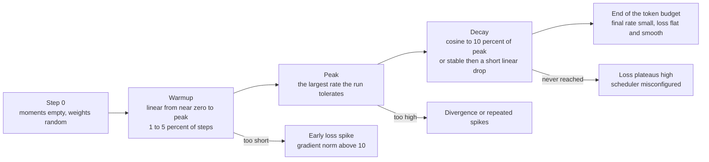
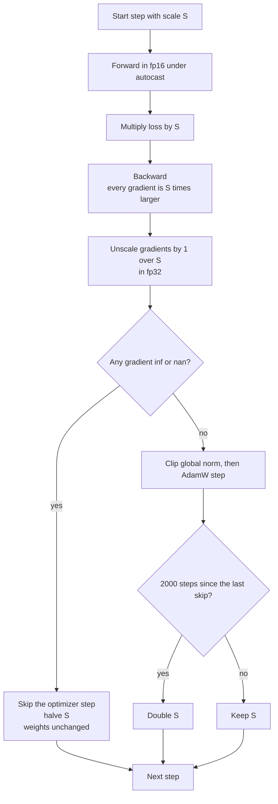
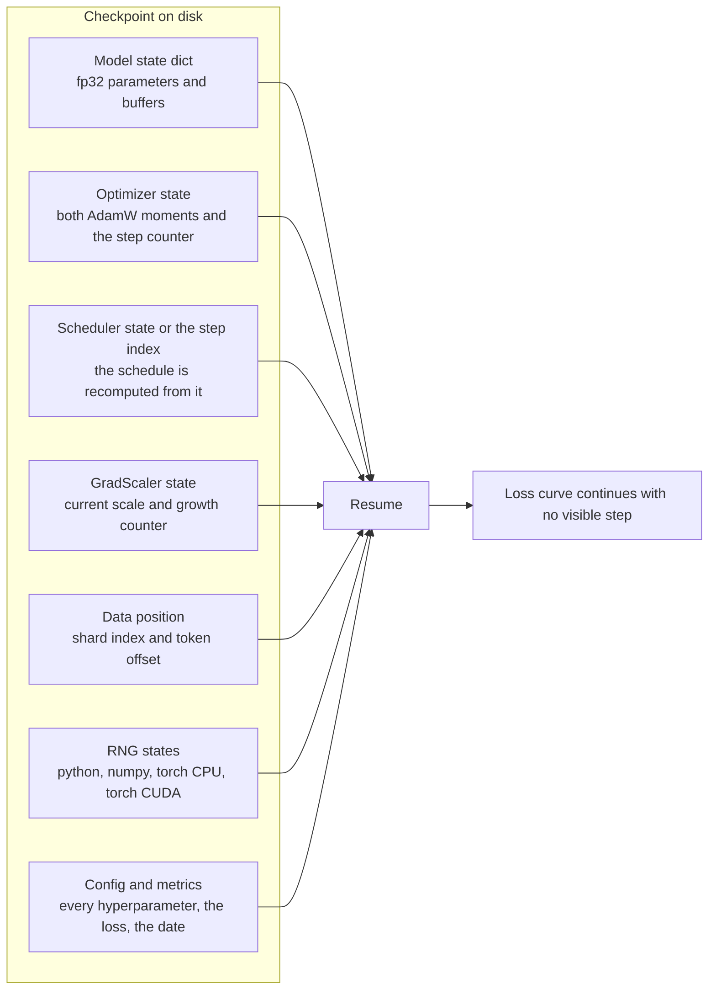
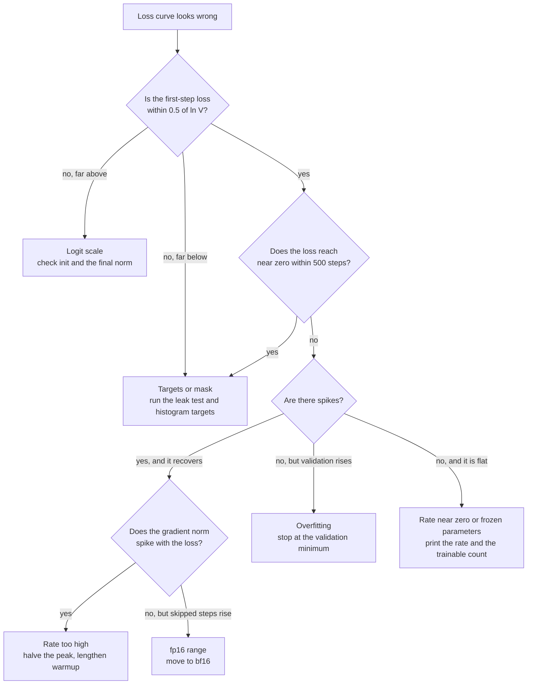
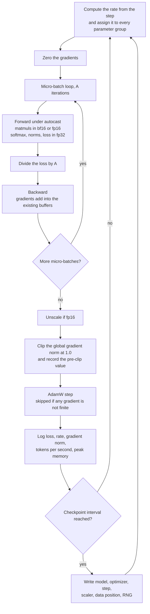

# Chapter 3: Training Dynamics

> **What you will be able to do.** Predict the loss a correctly wired model reports on its first batch and diagnose it when the number is wrong; write the AdamW update from memory and say what each of its two moments costs in bytes; choose a peak learning rate, a warmup length, and a decay shape for a given token budget and defend each choice; run fp16 with a loss scaler and bf16 without one, and explain the bit layouts that make the difference; write a checkpoint that resumes a killed run with a loss curve that shows no seam; read a loss curve and name the pathology from its shape.
>
> **Where it is used.** P0.2 (the training loop you write and the kill-and-resume test), P1.1 (the 300M-token pretraining run and its schedule), P1.2 (fine-tuning hyperparameters), and every later training project, which reuses this loop with a different loss.
>
> **Prerequisites.** Chapter 1 for label shifting and packed shards, Chapter 2 for the model whose parameters this chapter moves.

## 3.0 The problem this chapter solves

A run has been going for six hours on a rented A100. The loss was 3.1 an hour ago and is now `nan`. The Weights and Biases (W&B) dashboard shows the gradient norm spiking to 400 twelve steps before the collapse, and the learning rate at its cosine peak. You have one decision to make and a billing meter running: restart from the last checkpoint with a lower peak learning rate, restart with a longer warmup, or restart in bf16 instead of fp16. Getting this right is worth about forty dollars and an evening. Getting it wrong costs both again.

Every decision in that paragraph is a training-dynamics decision, and none of them are visible from a framework's `Trainer.train()`. The optimizer's two moments explain why the step after a spike is worse than the spike itself. The loss scaler explains why fp16 produces `nan` where bf16 does not. The schedule explains why the collapse happened at the peak and not at step 50. The checkpoint's contents explain whether resuming continues the run or restarts a subtly different one.

This chapter is the loop: objective, initialization, optimizer, schedule, clipping, batch, precision, checkpointing, input pipeline, and diagnosis. Every number in it is checkable before a long run starts, and the discipline this chapter asks for is that you check them. The initial loss check takes one second and catches three classes of bug. The overfit-one-batch test takes two minutes and catches the rest. The resume test takes five minutes and is the difference between a laptop that can train overnight and one that cannot.

Chapter 4 turns the same loop into memory and time estimates. Chapter 6 scales it across GPUs. Chapters 7 and 8 replace the loss with a fine-tuning or preference objective and change almost nothing else.

## 3.1 The objective and its value at initialization

A language model is trained by maximum likelihood on next-token prediction. For a sequence of token ids $y_1, \ldots, y_T$ the model produces logits $z_t \in \mathbb{R}^{V}$ at each position from the prefix, where $V$ is the vocabulary size, and the loss is the mean negative log probability of the token that actually followed:

$$
\mathcal{L} = -\frac{1}{T} \sum_{t=1}^{T} \log p_\theta(y_t \mid y_{<t}), \qquad p_\theta(y_t \mid y_{<t}) = \frac{\exp(z_{t, y_t})}{\sum_{j=1}^{V} \exp(z_{t, j})}.
$$

Here $\theta$ is the parameter vector, $z_{t,j}$ the logit for vocabulary item $j$ at position $t$, and the sum in the denominator runs over the whole vocabulary. The targets are the inputs shifted by one (Chapter 1, section 1.8); the model at position $t$ sees $y_{<t}$ only, which the causal mask of Chapter 2 enforces.

At initialization the model has learned nothing and the logits are near-uniform, so each probability is about $1/V$ and

$$
\mathcal{L}_0 \approx -\log(1/V) = \ln V .
$$

This is the single cheapest correctness check in the whole roadmap. Run a forward pass on one untrained batch, print the loss, and compare.

| $V$ | $\ln V$ | Where it appears |
|---|---|---|
| 8,192 | 9.01 | The P0.2 model |
| 16,384 | 9.70 | A larger P0.2 variant |
| 49,152 | 10.80 | The P1.1 pretraining tokenizer |
| 50,257 | 10.82 | GPT-2 |
| 128,256 | 11.76 | Llama 3 |
| 151,936 | 11.93 | Qwen2.5 |

A loss far **above** $\ln V$ means the logits are too large in magnitude: a wide embedding initialization under weight tying, a missing final normalization, or an embedding multiplier applied without the matching initialization (Chapter 2, sections 2.2 and 2.8). A loss far **below** $\ln V$ means the targets are degenerate or the causal mask leaks. Either way the run is already wrong, and every hour after this point is wasted.

**Perplexity** is the exponential of the mean cross-entropy in nats, $\mathrm{PPL} = e^{\mathcal{L}}$, read as the effective number of equally likely choices the model is deciding among. At initialization the perplexity is $V$ exactly, by construction. A loss of 3.0 is a perplexity of 20.1; a loss of 2.5 is 12.2. The important caveat: perplexity is comparable only between models that share a tokenizer, because a tokenizer that produces fewer tokens per byte puts more information in each token and raises the per-token loss for the same modeling quality. Chapter 6, section 6.12 makes this precise for cross-model comparisons.

## 3.2 Initialization scale and residual branches

Chapter 2 fixed the embedding initialization at a normal with standard deviation 0.02 so that the tied head produces near-uniform logits. Two further conventions matter for depth.

**Per-layer weights.** GPT-2 and most Llama-style implementations initialize every linear weight from $\mathcal{N}(0, 0.02^2)$ and every normalization gain at 1. Some codebases use a width-dependent scale, $\sigma = \sqrt{2/(5d)}$ in the Llama reference, which for $d = 4096$ gives 0.0099 and for $d = 384$ gives 0.032. Both work. What does not work is leaving PyTorch's `nn.Linear` default, which is a uniform distribution with bound $1/\sqrt{d_{in}}$: for $d = 768$ that is a standard deviation of 0.021, close enough by accident, but for $d = 4096$ it is 0.0090 and for the $d_{ff} \to d$ projection with $d_{in} = 14{,}336$ it is 0.0048, so the scales drift across the layer in a way nobody chose.

**Residual branch scaling.** Each block adds two contributions to the residual stream. If every branch writes a vector of variance $\sigma^2$ and the branches are roughly independent, the stream's variance after $L$ blocks is about $2 L \sigma^2$, so its standard deviation grows as $\sqrt{2L}$. The pre-norm layout tolerates this (each read is normalized), but the logits and the early-training dynamics do not: the deeper the stack, the larger the activations reaching the final norm, and the more the gradient at step one is dominated by the last few blocks.

The standard fix, from GPT-2 and repeated in nanoGPT and most modern implementations, is to scale down the weights of the projections that **write** to the stream, $W_O$ in attention and $W_{down}$ in the MLP, by $1/\sqrt{2L}$:

$$
\sigma_{\text{out-proj}} = \frac{0.02}{\sqrt{2L}} .
$$

Worked example for the P0.2 model with $L = 6$: $\sqrt{12} = 3.46$, so $W_O$ and $W_{down}$ initialize at 0.00577 instead of 0.02, and the residual stream's standard deviation after all six blocks stays near its embedding value instead of growing by $\sqrt{12} = 3.46$. For a 32-layer model the divisor is 8. The effect is small at six layers and large at thirty-two; implement it once and stop thinking about it.

## 3.3 AdamW

AdamW (Loshchilov and Hutter 2017) is the optimizer for every model in this handbook. It keeps two exponential moving averages per parameter and decouples weight decay from the gradient.

Let $g_t$ be the gradient of the loss with respect to a parameter at step $t$, $\eta$ the learning rate, $\beta_1, \beta_2$ the moment decay rates, $\epsilon$ a numerical floor, and $\lambda$ the weight decay coefficient. Then

$$
m_t = \beta_1 m_{t-1} + (1 - \beta_1) g_t, \qquad v_t = \beta_2 v_{t-1} + (1 - \beta_2) g_t^2,
$$

$$
\hat{m}_t = \frac{m_t}{1 - \beta_1^{t}}, \qquad \hat{v}_t = \frac{v_t}{1 - \beta_2^{t}}, \qquad \theta_t = \theta_{t-1} - \eta \lambda \theta_{t-1} - \eta \frac{\hat{m}_t}{\sqrt{\hat{v}_t} + \epsilon},
$$

with $m_0 = v_0 = 0$. The first moment $m$ is a smoothed gradient, which averages out minibatch noise and carries momentum through flat regions. The second moment $v$ is a smoothed squared gradient, and dividing by its square root gives every parameter its own effective step size: a coordinate with persistently large gradients takes small steps, one with small gradients takes large ones. That per-coordinate normalization is why Adam trains transformers where plain SGD needs heavy tuning, and it is also why the optimizer costs memory: two fp32 tensors the size of the model, 8 bytes per parameter (Chapter 4).

**Bias correction, precisely.** Because $m_0 = v_0 = 0$, both averages are biased toward zero early. The correction divides by $1 - \beta^t$, which is the total weight actually accumulated. The effect on the step is not what intuition suggests. At $t = 1$, $m_1 = (1-\beta_1) g_1$ and $v_1 = (1-\beta_2) g_1^2$, so the uncorrected ratio is

$$
\frac{m_1}{\sqrt{v_1}} = \frac{1 - \beta_1}{\sqrt{1 - \beta_2}} \, \mathrm{sign}(g_1),
$$

which for the fine-tuning defaults $(0.9, 0.999)$ is $0.1 / 0.0316 = 3.16$, a first step **three times too large**, and for the pretraining pair $(0.9, 0.95)$ is $0.1 / 0.2236 = 0.45$, a first step **half the intended size**. With the correction, $\hat{m}_1 / \sqrt{\hat{v}_1} = \mathrm{sign}(g_1)$ exactly, so the first step is $\eta$ per coordinate in magnitude, which is the intended contract. Never disable bias correction.

**Decoupled weight decay.** Adam with L2 regularization adds $\lambda \theta$ to the gradient, which then passes through the $1/\sqrt{\hat{v}}$ normalization, so parameters with large gradients get less decay than parameters with small ones. Loshchilov and Hutter showed that this couples two unrelated knobs and hurts generalization. AdamW applies $-\eta \lambda \theta_{t-1}$ directly to the parameter, outside the adaptive path. Decay is applied to weight matrices only, never to normalization gains, biases, or the embedding table in most recipes: those parameters have no scale symmetry for decay to exploit, and decaying the embeddings shrinks rare-token rows that receive few gradients.

**Typical values.** Pretraining uses $\beta_1 = 0.9$, $\beta_2 = 0.95$, $\lambda = 0.1$, $\epsilon = 10^{-8}$, and gradient clipping at 1.0; this is the GPT-3 and Llama recipe. Fine-tuning uses $\beta_2 = 0.999$ and $\lambda$ between 0 and 0.01, because runs are short and heavy decay does more harm than the regularization is worth. The lower $\beta_2$ in pretraining shortens the second moment's memory to about $1/(1 - 0.95) = 20$ steps instead of 1,000, which makes the optimizer react faster after a loss spike and is part of why long pretraining runs prefer it.

**When the moments do not fit.** On 8 GB the two fp32 moments are often what pushes a run over. Three reductions, in the order you should reach for them. 8-bit Adam (Dettmers et al. 2022) quantizes each moment blockwise to 8 bits, cutting the optimizer from 8 bytes per parameter to 2 with a quality difference that is not measurable on the runs in this roadmap. A paged optimizer keeps the moments in unified memory and lets the driver move blocks to host RAM under pressure, which converts an out-of-memory crash into a slowdown at the spike. Adafactor factorizes the second moment into row and column statistics, costing $O(d_{in} + d_{out})$ instead of $O(d_{in} d_{out})$ per matrix, at some loss of fidelity; it is the right answer when even 8-bit moments do not fit and the wrong answer if they do. Chapter 4 does the arithmetic for all three, and Chapter 7 uses the paged 8-bit variant for 7B QLoRA on the 4060.

## 3.4 Learning-rate schedules

The learning rate is the hyperparameter that decides whether a run converges, and its value should change over the run. Three phases, in this order.



*Figure 3.1: the three phases of a learning-rate schedule and the failure each phase produces when it is set wrong.*

**Warmup.** Increase the rate linearly from near zero to the peak over the first $W$ steps, typically 1 to 5 percent of the run, or a fixed 100 to 2,000 steps. The reason is the previous section's result. At step 1 the AdamW update is exactly $-\eta \, \mathrm{sign}(g)$ in every coordinate, independent of the gradient's magnitude, because $\hat{v}_1 = g_1^2$ makes the normalization exact. The displacement in parameter space is therefore $\eta \sqrt{N}$ for $N$ parameters, whatever the loss landscape looks like.

Worked example for GPT-2 small, $N = 124$M, initialized at standard deviation 0.02 so that $\lVert \theta_0 \rVert \approx 0.02 \sqrt{N} = 223$. With $\eta = 6 \times 10^{-4}$, the first step moves $6 \times 10^{-4} \times \sqrt{1.24 \times 10^8} = 6.7$, three percent of the weight norm, in a direction determined by the sign of a single minibatch's gradient. Do that twenty times before $\hat{v}$ has averaged over enough batches to be meaningful and the model is somewhere the initialization did not intend. Liu et al. (2020) analyzed this as the high variance of the adaptive rate in early steps and proposed rectification; linear warmup is the version everyone actually uses. With warmup over 2,000 steps the first step is $\eta / 2000$ and the model is still near its initialization when the moments become reliable.

**Peak.** The largest rate the run survives. Practical starting points, all for AdamW with clipping at 1.0: for pretraining from scratch, $3 \times 10^{-4}$ to $6 \times 10^{-4}$ at the 100M scale and $1.5 \times 10^{-4}$ to $3 \times 10^{-4}$ at the 1B scale, because the tolerable rate falls roughly as model width grows. For full fine-tuning, $1 \times 10^{-5}$ to $2 \times 10^{-5}$. For LoRA, $1 \times 10^{-4}$ to $3 \times 10^{-4}$, two orders of magnitude above full fine-tuning because the adapter matrices start at zero output and have no pretrained scale to disturb (Chapter 7). If the loss spikes repeatedly, halve the peak before changing anything else.

**Cosine decay.** After warmup, decay from the peak $\eta_{\max}$ to a floor $\eta_{\min} = 0.1 \, \eta_{\max}$ following a half cosine over the remaining steps:

$$
\eta(s) = \eta_{\min} + (\eta_{\max} - \eta_{\min}) \cdot \frac{1}{2}\left(1 + \cos\left(\pi \frac{s - W}{S - W}\right)\right), \qquad W \le s \le S,
$$

with $s$ the step index and $S$ the total steps. Worked example with $\eta_{\max} = 6 \times 10^{-4}$, $W = 200$, $S = 5{,}000$: at $s = 200$ the rate is the peak; at $s = 2{,}600$, halfway through decay, $\cos(\pi/2) = 0$ and the rate is $0.6 \times 10^{-4} + 0.5 \times 5.4 \times 10^{-4} = 3.3 \times 10^{-4}$; at $s = 5{,}000$ it is the floor $6 \times 10^{-5}$.

Cosine has one operational defect: the shape depends on $S$, so the schedule must know the total number of steps in advance, and a run stopped early has not decayed and is worse than a shorter run that did. This matters when the token budget is uncertain, which it usually is on rented hardware.

**Warmup-stable-decay (WSD).** Warm up, hold the rate constant for most of the run, then decay sharply over the last 10 to 20 percent. Hu et al. (2024), in the MiniCPM work, reported that this matches cosine at the same token count while allowing the run to be extended: the stable phase's checkpoints are valid starting points for a longer run, and the decay phase can be re-run from any of them. For P1.1's two-point scaling experiment, where you want checkpoints at several token counts from one training trajectory, WSD is the better choice. For a single run with a fixed budget, cosine is fine and is what most published recipes use.

## 3.5 Gradient clipping

Clip by global norm. Compute the norm over all parameters jointly,

$$
\lVert g \rVert_2 = \sqrt{\sum_{i} g_i^2}, \qquad g \leftarrow g \cdot \min\left(1, \frac{c}{\lVert g \rVert_2 + 10^{-6}}\right),
$$

with $c$ the threshold, 1.0 by convention. Clipping rescales the whole gradient vector, preserving its direction, so a batch that would take a huge step takes a normal-sized one instead of being discarded. Per-parameter clipping would change the direction and is not what `torch.nn.utils.clip_grad_norm_` does.

Worked example: a healthy 125M-parameter run settles at a gradient norm between 0.2 and 0.8 after the first few hundred steps. One batch containing a long run of repeated characters produces a norm of 14. Without clipping, the AdamW step for that batch is not 14 times larger, because $\hat{v}$ normalizes per coordinate, but the spike enters $v$ and inflates it for about $1/(1-\beta_2) = 20$ steps, during which every subsequent step is damped: the visible symptom is a loss spike followed by a plateau. With clipping at 1.0 the offending gradient is scaled by $1/14$ and contributes to $v$ at a normal magnitude.

Log the pre-clip norm every step. It is the most informative single scalar after the loss. A norm that trends upward over thousands of steps is an instability building; a norm that jumps to hundreds in one step and returns is one bad batch; a norm that is exactly zero means a detached graph or a fully masked loss; a norm that is `nan` means the forward pass already produced `nan` and the step after it will destroy the weights.

## 3.6 Batch size, accumulation, and tokens per step

The right unit of batch size for a language model is **tokens per step**, not sequences. Two runs with batch 32 at length 512 and batch 8 at length 2,048 both see 16,384 tokens per step and produce gradients of similar noise, and the second has four times the memory pressure from attention and activations. Report and compare tokens per step.

**Gradient accumulation** reaches a large token batch on a small GPU. Run $A$ micro-batches of $B$ sequences forward and backward, adding their gradients, then take one optimizer step. The effective batch is

$$
\text{tokens per step} = B \times T \times A \times (\text{number of data-parallel ranks}),
$$

and the rank factor is 1 until Chapter 6. Two correctness requirements. First, divide each micro-batch's loss by $A$ before calling backward, so that the accumulated gradient is the mean over the full effective batch and not its sum; getting this wrong multiplies the effective learning rate by $A$. Second, if micro-batches contain different numbers of contributing tokens, which happens when padding or completion-only masking is used (Chapter 7), dividing by $A$ is biased: accumulate the summed loss and the token count, and divide once at the end.

**Setting the learning rate for the effective batch.** Gradient noise falls as $1/\sqrt{\text{batch}}$, so a larger batch supports a larger step. The useful frame is McCandlish et al. (2018): there is a critical batch size, estimable from the gradient noise scale, below which doubling the batch roughly halves the number of steps needed and above which it mostly wastes compute. Below the critical size, the practical heuristic for Adam is square-root scaling, $\eta \propto \sqrt{\text{batch}}$, in contrast to the linear rule used with SGD. This is a heuristic and the literature is not unanimous; the reliable statement is that the learning rate belongs to the effective batch, so if you change accumulation you have changed a hyperparameter.

Worked example. A run tuned at 65,536 tokens per step with $\eta = 6 \times 10^{-4}$ is moved to a GPU where only 16,384 tokens per step fit and accumulation is not increased. Under square-root scaling the peak should drop to $6 \times 10^{-4} \times \sqrt{16384/65536} = 3 \times 10^{-4}$. Leaving it at $6 \times 10^{-4}$ is the most common cause of "the same script diverged on the smaller machine".

Accumulation costs nothing in FLOPs and everything in wall-clock latency per step; it is a memory trade, not a compute trade. Under DistributedDataParallel, wrap all but the final micro-step in `model.no_sync()` so that the gradient all-reduce happens once per optimizer step rather than once per micro-step (Chapter 6, section 6.6).

## 3.7 Mixed precision

Training entirely in fp32 wastes both memory and the tensor cores, which are several times faster at 16-bit inputs. Mixed precision runs the forward and backward passes in a 16-bit format and keeps the parameters and the optimizer state in fp32.

| Format | Sign | Exponent | Mantissa | Max finite | Smallest normal | Spacing near 1.0 |
|---|---|---|---|---|---|---|
| fp32 | 1 | 8 | 23 | $3.4 \times 10^{38}$ | $1.2 \times 10^{-38}$ | $1.2 \times 10^{-7}$ |
| fp16 | 1 | 5 | 10 | 65,504 | $6.1 \times 10^{-5}$ | $9.8 \times 10^{-4}$ |
| bf16 | 1 | 8 | 7 | $3.4 \times 10^{38}$ | $1.2 \times 10^{-38}$ | $7.8 \times 10^{-3}$ |

Read the table as two independent trades. bf16 keeps fp32's exponent, so it has fp32's dynamic range and cannot overflow or underflow where fp32 would not, and it pays with precision: about two to three decimal digits. fp16 keeps three more mantissa bits and pays with range: values above 65,504 become `inf` and values below $6 \times 10^{-8}$ (the smallest subnormal) become zero.

**Why fp16 needs loss scaling.** Gradients in a transformer are small. A gradient of magnitude $10^{-8}$ is ordinary in the deeper layers of a converged model, and in fp16 it flushes to zero, so that parameter stops receiving signal. The fix is to multiply the loss by a scale $S$ before the backward pass. By the chain rule every gradient is multiplied by $S$, moving the whole distribution into fp16's representable range; the gradients are divided by $S$ again before clipping and before the optimizer step, so the mathematics is unchanged.

Worked example with $S = 65{,}536 = 2^{16}$: the $10^{-8}$ gradient becomes $6.6 \times 10^{-4}$, comfortably normal in fp16, and unscaling restores $10^{-8}$ in fp32. A gradient of $2 \times 10^{-1}$ becomes $1.3 \times 10^{4}$, still under 65,504. A gradient of $2$ becomes $1.3 \times 10^{5}$ and overflows, which is why the scale must adapt.



*Figure 3.2: the dynamic loss-scaling loop that PyTorch's GradScaler implements; the growth interval and the halving factor are the defaults, so check them for your version.*

The algorithm probes for the largest usable scale. It starts high, halves on any overflow and throws that step away, and doubles after a fixed number of clean steps. A handful of skipped steps in the first few dozen is normal and is the scaler finding its level. Skips continuing at a rate of a few percent through the run mean the gradients genuinely span more than fp16's range, and the answer is bf16 or a lower learning rate, not a larger scale.

**Why bf16 needs none.** bf16's exponent range is fp32's, so no scaling is needed and no steps are skipped. The cost is precision, and it shows in exactly one place: accumulation. Summing 10,000 numbers in bf16 loses the small ones. This is why normalization statistics, the softmax, the loss, and the optimizer state are all computed in fp32 even in a bf16 run, and why matrix multiplies on tensor cores take bf16 inputs but accumulate in fp32 in hardware.

**Master weights.** The optimizer keeps the parameters in fp32 and the autocast machinery casts them to 16-bit for each operation. The reason is the spacing column of the table. A weight near 1.0 in bf16 has neighbors 0.0078 away, so an update smaller than 0.0039 rounds back to the same value and is lost entirely. A fine-tuning step with $\eta = 2 \times 10^{-5}$ and a normalized AdamW direction moves each coordinate by about $2 \times 10^{-5}$: five hundred times below the rounding threshold. Training a model whose parameters are stored in bf16 therefore does nothing at all for most coordinates, while fp32 storage, with spacing $1.2 \times 10^{-7}$, resolves the step easily. Full bf16 training without master weights works only with stochastic rounding, which PyTorch's autocast path does not do.

**What autocast actually does.** `torch.autocast` is a dispatch-level context manager, not a cast of the model. Inside it, PyTorch consults a per-operation list: matrix multiplies, linear layers, and convolutions run with 16-bit inputs on tensor cores; reductions, normalizations, softmax, exponentials, and losses are promoted to fp32; elementwise operations run in whatever their inputs are. The parameters themselves stay fp32 in `model.parameters()`, and the cast happens on the fly for each matmul, which is why the memory saving of mixed precision is in the activations and not in the weights. Three consequences. The loss comes back as an fp32 tensor even though the forward ran in bf16. A hand-written kernel or a custom autograd function is not covered by the op list and must cast explicitly, which is why Chapter 2's attention listing calls `.float()` around the softmax. And `model.half()` or `model.bfloat16()` is a different thing entirely: it converts the stored parameters, removes the fp32 master copy, and breaks training for the reason below.

`GradScaler` is only needed for fp16. In bf16 it is instantiated with `enabled=False` so that the same loop runs unchanged on both, as Listing 3.3 does.

## 3.8 What a checkpoint must contain

A checkpoint that lets you *use* a model needs the weights. A checkpoint that lets you *resume training* needs six more things, and missing any of them produces a visible seam in the loss curve.



*Figure 3.3: the seven parts of a resumable checkpoint; dropping any one of the middle five produces a run that looks resumed and is not.*

What each omission costs. Without the **optimizer state**, both moments restart at zero, bias correction restarts at $t=1$, and the first step after resume is a full $\eta \, \mathrm{sign}(g)$ in every coordinate: the loss jumps, visibly, and takes hundreds of steps to recover. Without the **step index**, the schedule restarts at warmup and the model takes peak-rate steps on converged weights. Without the **GradScaler state** in an fp16 run, the scale restarts at 65,536 and the first few steps after resume are skipped, which is harmless but confusing. Without the **data position**, the resumed run re-reads tokens the model has already seen, which is an epoch boundary in the middle of a run and a small amount of memorization. Without the **RNG states**, dropout masks and data shuffling differ, so the resumed run is not the run you killed, and a bug that reproduced before the kill may not reproduce after.

Two operational rules. Write to a temporary path and rename atomically, so that a crash during the write does not leave a truncated file where the last good checkpoint was. And keep three checkpoints: the latest, the previous, and the best by validation loss. Checkpoint size is about 12 bytes per parameter for fp32 weights plus two fp32 moments (Chapter 4), so the 125M model of P1.1 writes 1.5 GB per checkpoint and the 12.6M model of P0.2 writes 151 MB.

The test that the checkpoint is correct is behavioral, not structural, and section 3.11 writes it: train $2k$ steps, save at step $k$, kill, resume, and confirm the loss at step $2k$ matches the uninterrupted run to within floating-point reassociation.

## 3.9 The input pipeline as a bottleneck

A training step that should take 180 ms takes 400 ms, the GPU is at 45 percent utilization, and nothing in the model is wrong. The data loader is starving the GPU.

Diagnose it in two minutes with a substitution test. Replace the loader with a single pre-made batch held on the GPU and re-run the step loop. If the step time collapses, the loader is the bottleneck; if it does not, the model or the optimizer is. This is more reliable than reading utilization percentages, which average over a sampling window and hide short gaps.

The arithmetic says the cause is almost never disk throughput. Packed uint16 shards (Chapter 1, section 1.9) hold two bytes per token, so a run at 100,000 tokens per second reads 200 KB per second from a memory-mapped file that the operating system has cached in RAM. The real causes are Python-level: per-example tensor construction in a single-process loader, collation that copies, tokenizing inside the loop instead of ahead of time, and synchronous host-to-device transfers. The fixes are `num_workers` at 4 to 8 with `persistent_workers=True`, `pin_memory=True` with a non-blocking copy, slicing contiguous windows from a memory map rather than gathering individual examples, and never tokenizing during training.

Watch one interaction on the 4060: each data-loader worker is a process with its own CUDA context if it touches the GPU, and 32 GB of system RAM shared with Windows does not leave room for eight workers each holding a large memory map. Four workers is the safe setting on this laptop.

## 3.10 Reading loss curves

Log, every step: loss, learning rate, pre-clip gradient norm, tokens per second, and peak allocated memory. In an fp16 run add the current loss scale and the cumulative count of skipped steps. Log, every few hundred steps: validation loss on a fixed subset and one sampled generation. The generation catches tokenizer and template bugs that the loss cannot see, because a model can have a perfectly healthy loss while decoding to nonsense (Chapter 1, section 1.10).

Two of these are not diagnostics but contracts with your future self. Tokens per second, recorded from the first run onward, is what makes the next run's estimate honest and is what the roadmap asks you to report with model FLOPs utilization (Chapter 4). Peak allocated memory, recorded at the same cadence, tells you how much headroom a longer sequence or a larger micro-batch has before the run dies at hour three rather than at step ten.

**A note on dropout.** Pretraining runs on a corpus large enough that no example is seen twice use dropout 0, and Llama and most modern recipes set it there: there is nothing to regularize against when there is no repetition. Fine-tuning on a few thousand examples for two or three epochs is the opposite case, and a dropout of 0.05 to 0.1 on the adapter or on the attention output is a cheap hedge against memorization. Whatever you choose, it must be off for the overfit-one-batch test, which is trying to memorize, and off in `eval()` mode for the validation number, which is otherwise not comparable to the training number.

| Shape | Likely cause | Distinguishing evidence |
|---|---|---|
| Starts far above $\ln V$ | Logit scale: wide init under tying, missing final norm | Standard deviation of the first batch's logits is above 2 |
| Starts far below $\ln V$ | Degenerate targets, or labels equal to inputs | Histogram the first batch's target ids |
| Falls to near zero in a few hundred steps | Causal mask leak, or targets not shifted | Perturb a later token and check that earlier logits are unchanged |
| Smooth fall, then validation rises while training falls | Overfitting; the dataset has fewer tokens than the model can memorize | Validation and training curves separate at a repeatable step |
| Repeated spikes that recover | Learning rate too high, or fp16 overflow | Gradient norm spikes with the loss means the rate; skipped-step count rising means the scaler |
| One spike that never recovers | A single corrupt batch plus no clipping, or a `nan` in the forward pass | Gradient norm is `nan` one step before the loss is |
| Flat from step one | Rate too low, a dead scheduler stuck in warmup, or a frozen parameter set | Print the rate at step 100 and the count of parameters with `requires_grad` |
| Suspiciously low validation loss with a normal training loss | Leakage: validation documents appear in training | Hash documents and intersect the two splits |
| Throughput falls over hours while loss is fine | Thermal throttling or a leaking loader | Clock and temperature over time; Chapter 5, section 5.9 |
| Steps at a plateau after a spike | The spike inflated the second moment and is damping every step | The plateau lasts about $1/(1 - \beta_2)$ steps |



*Figure 3.5: the triage order for a loss curve, from the cheapest check to the most expensive.*

**Overfit one batch.** Before any real run, take a single batch, disable dropout, and train on it alone with a constant learning rate. Within 100 to 300 steps the loss must go below 0.1 and the model must reproduce the batch exactly under greedy decoding. If it plateaus at 2 or 3, the gradient is not reaching some parameters, the labels are misaligned, or the learning rate is far too small. This test takes two minutes, uses no data pipeline, and has caught more bugs in practice than any other single check. Chapter 2's leak test and this test together cover the correctness of the model and the loop.

**Validation protocol.** Fix the validation subset once, by seed, and never change it during a project: a validation loss computed on a different sample each time is not comparable across steps. Evaluate in `eval()` mode with `torch.no_grad()`, at a fixed step interval, on enough tokens to be stable (200 sequences of length 1,024 is about 200,000 tokens, which for a small model gives a standard error on the mean loss of a few thousandths). Aggregate as a token-weighted mean, summing the total negative log likelihood and dividing by the total token count, not as a mean of per-batch means, which is wrong whenever batches hold different token counts.

## 3.11 Implementation notes

Five listings. They assume `import math, os, random`, `import numpy as np`, `import torch`, and a model that returns `(logits, loss, caches)` as in Chapter 2, Listing 2.4.

**Listing 3.1: one AdamW step written in tensor operations.**

```python
@torch.no_grad()
def adamw_step(params, state, lr, betas=(0.9, 0.95), eps=1e-8, wd=0.1):
    b1, b2 = betas
    state["t"] += 1
    t = state["t"]
    bc1, bc2 = 1.0 - b1 ** t, 1.0 - b2 ** t          # bias corrections
    for i, p in enumerate(params):
        if p.grad is None:
            continue
        g = p.grad
        m, v = state["m"][i], state["v"][i]           # fp32, allocated once at startup
        m.mul_(b1).add_(g, alpha=1.0 - b1)            # first moment
        v.mul_(b2).addcmul_(g, g, value=1.0 - b2)     # second moment
        m_hat = m / bc1
        denom = (v / bc2).sqrt_().add_(eps)
        if state["decay"][i]:                         # matrices only, not norms or biases
            p.mul_(1.0 - lr * wd)                     # decoupled weight decay
        p.addcdiv_(m_hat, denom, value=-lr)
```

The two moments are allocated once and updated in place, which is where the 8 bytes per parameter live. `addcmul_(g, g, value=1-b2)` is the fused form of $v \leftarrow \beta_2 v + (1-\beta_2) g^2$. The bias corrections are scalars recomputed each step from $t$, so resuming requires restoring `state["t"]`. The decay multiply happens before the adaptive update and is not divided by $\sqrt{\hat{v}}$: that is the entire difference between AdamW and Adam with L2. `state["decay"]` is precomputed by walking the named parameters once and marking anything whose name ends in `weight` and whose tensor has two or more dimensions. In production use `torch.optim.AdamW(fused=True)`, which is the same arithmetic in one kernel; this listing exists so that you can say what that kernel does.

**Listing 3.2: the schedule as a pure function of the step.**

```python
def lr_at(step: int, peak: float, warmup: int, total: int, floor_frac: float = 0.1) -> float:
    if step < warmup:
        return peak * (step + 1) / warmup                       # linear warmup
    progress = min(1.0, (step - warmup) / max(1, total - warmup))
    cosine = 0.5 * (1.0 + math.cos(math.pi * progress))          # 1 at start, 0 at end
    return peak * (floor_frac + (1.0 - floor_frac) * cosine)
```

Writing the schedule as a function of the step rather than as a stateful `LRScheduler` object means resume needs only the integer step, not another state dictionary to serialize and get wrong. Call it at the top of each step and assign to every parameter group. `step + 1` in the warmup branch avoids a rate of exactly zero at step 0, which would waste the first batch. `floor_frac` at 0.1 is the usual final rate; setting it to 0 makes the last few hundred steps do nothing.



*Figure 3.4: one optimizer step, with the accumulation loop inside it and the five things every step should log.*

The order in the figure is not arbitrary. The rate is set before the step, not after, so the logged rate is the one actually used. The gradients are zeroed before the micro-batch loop and not inside it, because accumulation depends on them persisting. Unscaling precedes clipping, because a threshold of 1.0 applied to gradients that are $S$ times too large never triggers. Clipping precedes the optimizer step, because the point is to keep the outlier out of the moments. Logging precedes checkpointing so that a crash during the write still leaves the step in the log.

**Listing 3.3: the training loop with accumulation, autocast, scaling, and clipping.**

```python
amp_dtype = torch.bfloat16 if torch.cuda.is_bf16_supported() else torch.float16
scaler = torch.amp.GradScaler("cuda", enabled=(amp_dtype == torch.float16))  # PyTorch 2.4+
opt = torch.optim.AdamW(param_groups, lr=PEAK, betas=(0.9, 0.95), eps=1e-8, fused=True)

for step in range(start_step, total_steps):
    lr = lr_at(step, PEAK, WARMUP, total_steps)
    for group in opt.param_groups:
        group["lr"] = lr
    opt.zero_grad(set_to_none=True)
    loss_sum = 0.0
    for _ in range(accum):
        x, y = loader.next_batch()                       # (B, T) int64, already on the GPU
        with torch.autocast("cuda", dtype=amp_dtype):
            _, loss, _ = model(x, targets=y)
        scaler.scale(loss / accum).backward()            # gradients accumulate across micro-steps
        loss_sum += loss.item() / accum
    scaler.unscale_(opt)                                 # must come before clipping
    gnorm = torch.nn.utils.clip_grad_norm_(model.parameters(), 1.0)
    scaler.step(opt)                                     # a no-op if any gradient is inf or nan
    scaler.update()
    if step % LOG_EVERY == 0:
        log(step=step, loss=loss_sum, lr=lr, gnorm=float(gnorm),
            scale=scaler.get_scale(), mem=torch.cuda.max_memory_allocated())
```

Five lines carry the chapter. `amp_dtype` is chosen from the hardware, which is the one line that differs between the 4060 and a Kaggle T4; the scaler is a no-op in bf16, so the same loop runs on both. `loss / accum` before `backward` makes the accumulated gradient a mean over the effective batch. `scaler.unscale_(opt)` must precede `clip_grad_norm_`, because clipping a scaled gradient would clip at the wrong threshold; forgetting it is a silent bug that makes clipping never trigger. `clip_grad_norm_` returns the pre-clip norm, which is what to log. `scaler.step` skips the update if any gradient is not finite, so the weights are never poisoned by an overflow. `loss.item()` forces a synchronization each micro-step; at high throughput, accumulate the loss as a tensor and call `.item()` only at the logging interval.

**Listing 3.4: the checkpoint save and load pair.**

```python
def save_ckpt(path, model, opt, scaler, step, data_pos, cfg):
    blob = {
        "model": model.state_dict(), "opt": opt.state_dict(),
        "scaler": scaler.state_dict(), "step": step,
        "data_pos": data_pos, "cfg": cfg,
        "rng": {"py": random.getstate(), "np": np.random.get_state(),
                "torch": torch.get_rng_state(), "cuda": torch.cuda.get_rng_state_all()},
    }
    torch.save(blob, path + ".tmp")
    os.replace(path + ".tmp", path)              # atomic: a crash never truncates the live file

def load_ckpt(path, model, opt, scaler):
    blob = torch.load(path, map_location="cuda", weights_only=False)
    model.load_state_dict(blob["model"])
    opt.load_state_dict(blob["opt"])             # restores both moments and the step count t
    scaler.load_state_dict(blob["scaler"])
    random.setstate(blob["rng"]["py"])
    np.random.set_state(blob["rng"]["np"])
    torch.set_rng_state(blob["rng"]["torch"])
    torch.cuda.set_rng_state_all(blob["rng"]["cuda"])
    return blob["step"] + 1, blob["data_pos"], blob["cfg"]
```

`os.replace` is atomic on both Linux and Windows, so the previous checkpoint stays valid until the new one is completely written; a plain `torch.save` to the live path loses everything if the process dies mid-write, which on a laptop that sleeps is not hypothetical. `weights_only=False` is required because the blob holds RNG tuples and a config, not only tensors; PyTorch 2.6 changed this default, so load only your own checkpoints this way. `opt.load_state_dict` restores the moments and the internal step counter that drives bias correction, which is the part people forget. `load_ckpt` returns the **next** step, so the resumed run does not repeat the step that was already applied.

**Listing 3.5: the two tests that gate every run.**

```python
def overfit_one_batch(model, x, y, steps=200, lr=1e-3):
    model.train()
    opt = torch.optim.AdamW(model.parameters(), lr=lr, betas=(0.9, 0.95), weight_decay=0.0)
    for _ in range(steps):
        opt.zero_grad(set_to_none=True)
        _, loss, _ = model(x, targets=y)
        loss.backward()
        opt.step()
    assert loss.item() < 0.1, f"cannot memorize one batch: loss {loss.item():.3f}"

def resume_is_seamless(train_fn, tmp, k=50, tol=1e-3):
    a = train_fn(steps=2 * k, ckpt_at=None, seed=0)              # uninterrupted reference
    train_fn(steps=k, ckpt_at=k, ckpt_path=tmp, seed=0)          # stop and checkpoint
    b = train_fn(steps=2 * k, resume_from=tmp, seed=0)           # resume to the same step
    assert abs(a[-1] - b[-1]) < tol, f"seam: {a[-1]:.5f} vs {b[-1]:.5f}"
```

`overfit_one_batch` deliberately uses a high constant learning rate and no decay: the goal is memorization, not generalization, and a model that cannot memorize eight sequences has a wiring bug. Run it on the CPU in CI with a two-layer configuration so that it costs seconds. `resume_is_seamless` is the P0.2 definition of done expressed as an assertion. The tolerance is loose rather than exact because floating-point reductions are not associative and a resumed run can reorder them; a seam from a missing optimizer state is 0.1 or larger, far above any reassociation noise, so the test separates the two cases cleanly.

## 3.12 Failure modes

| Symptom | Likely cause | How to confirm | Fix |
|---|---|---|---|
| First-batch loss is 20 or more when $\ln V \approx 10$ | Logit scale: embedding init too wide under tying, or the final norm is missing | Print the standard deviation of the first logits; it should be under 1 | Init embeddings at std 0.02; add the final RMSNorm |
| First-batch loss is 1 or less | Targets degenerate or the mask leaks | Histogram target ids; run Chapter 2's leak test | Fix the shift in the data path; fix the mask |
| Loss becomes `nan` after hours, gradient norm spiked first | Learning rate above what the run tolerates; the spike entered the second moment | Gradient norm rises for several steps before the `nan` | Resume from the last good checkpoint at half the peak rate and double the warmup |
| Loss becomes `nan` in fp16 with no gradient spike | Forward overflow: a softmax without max subtraction, or an unscaled loss | Check the scale is being applied; check for `inf` in activations with a hook | Use `GradScaler`; compute softmax and loss in fp32; switch to bf16 if available |
| GradScaler skips steps continuously after the first fifty | Gradients genuinely exceed fp16's range | `scaler.get_scale()` keeps falling and never grows back | Move to bf16, or lower the peak learning rate |
| Clipping never triggers although the logged norm is huge | `unscale_` not called before `clip_grad_norm_` in an fp16 run | The logged norm is about $S$ times the expected value | Call `scaler.unscale_(opt)` first |
| Effective learning rate is $A$ times too large | Micro-batch loss not divided by the accumulation count | Divergence appears only when accumulation is increased | Divide by `accum`, or track the token count and divide once |
| Loss jumps at resume and recovers over hundreds of steps | Optimizer state or step index not restored | The jump is at exactly the resume step | Save and load the optimizer state dict and the step |
| Resumed run diverges from the reference immediately | RNG state or data position not restored | The first post-resume batch differs from the reference's | Save all four RNG states and the shard offset |
| Loss is flat from step one | Rate stuck at zero, scheduler misconfigured, or parameters frozen | Print the rate at step 100 and count parameters with `requires_grad` | Fix the schedule bounds; unfreeze |
| Throughput is half the estimate and the GPU sits at 45 percent | Data loader starving the GPU | Substitute one cached batch; step time collapses | More workers, pinned memory, memory-mapped windows, no tokenizing in the loop |
| Throughput decays over three hours | Thermal throttling on the laptop | Clocks fall while temperature holds at the limit | Cap the power limit; raise the laptop; see Chapter 5 |
| Validation loss far below training loss | Validation documents leaked into training, or dropout still active in the training number | Hash and intersect the splits; check `model.eval()` | Re-split by document hash; evaluate in eval mode |
| Loss plateaus for twenty steps after every spike | The spike inflated $v$; the adaptive rate is damped for about $1/(1-\beta_2)$ steps | Plateau length matches 20 steps at $\beta_2 = 0.95$ | Clip at 1.0 so spikes never enter $v$ at full size |
| A 12-hour run has no usable artifact after a crash | Checkpoints written non-atomically, or only at the end | The file exists and fails to load | Write to `.tmp` and `os.replace`; checkpoint every 30 minutes |

## 3.13 On your machine

**P0.2 on the RTX 4060 (8 GB, Ada, bf16).** The 12.6M-parameter model of Chapter 2, section 2.15 at $V = 8192$, $d = 384$, $L = 6$, $T = 512$. Initial loss must be $9.01 \pm 0.5$. Optimizer and weight state is about 16 bytes per parameter, 200 MB, so the entire training state plus activations at batch 32 stays under 3 GB and the GPU is never the constraint. Use bf16 autocast and no scaler: `torch.cuda.is_bf16_supported()` returns true on compute capability 8.9. A run over 100M tokens at batch 32 and $T = 512$ is 16,384 tokens per step and 6,100 steps. Set warmup to 200 steps (3 percent), peak $6 \times 10^{-4}$, cosine to $6 \times 10^{-5}$, clipping 1.0, $\beta = (0.9, 0.95)$, weight decay 0.1 on matrices only. At 80,000 to 150,000 tokens per second the run is 11 to 21 minutes, so checkpoint every 500 steps; each checkpoint is 151 MB at 12 bytes per parameter and three of them are 453 MB. Expect the gradient norm to sit between 0.2 and 1.0 after step 300.

**The three checks before the real run, in order.** Initial loss within 0.5 of 9.01, about one second. Overfit one batch to below 0.1 in 200 steps, about two minutes on the GPU. Kill and resume with no seam, using $k = 50$, about five minutes. All three run before any long job on any machine, and all three belong in the repository's test suite so that they run in continuous integration on the CPU with a two-layer configuration.

**P1.1 on the 4060.** The 125M model at 300M tokens with micro-batch 4 at $T = 1024$ and accumulation 16 is 65,536 tokens per step and about 4,600 steps (Chapter 6, section 6.15 sizes the memory). Warmup 100 steps, peak $3 \times 10^{-4}$ for this width, cosine to 10 percent. This is an overnight job of 3 to 5 hours, which means three things: checkpoint every 30 minutes, put the laptop somewhere with airflow, and log tokens per second so that the morning's curve shows whether throttling cost you an hour (Chapter 5, section 5.9).

**Kaggle T4s (16 GB each, compute capability 7.5, fp16 only).** `torch.cuda.is_bf16_supported()` returns false, so Listing 3.3 selects fp16 and enables the scaler with no other change. Expect 5 to 20 skipped steps in the first hundred as the scale settles, then none. Log `scaler.get_scale()`; a scale that stabilizes near $2^{15}$ to $2^{17}$ is healthy, and one that keeps halving toward $2^{8}$ means the run needs a lower learning rate. A session ends at 12 hours and the working directory is wiped, so checkpoint to a Kaggle dataset or the Hugging Face Hub, not only to local disk, and make the resume path the default entry point rather than an afterthought.

**A rented A100 80 GB (about $1.39 per hour on RunPod Community Cloud as of September 2026; verify).** bf16 with no scaler, no memory constraint at these model sizes, and the loop unchanged. The A100 is where a training-dynamics mistake is expensive: the arithmetic of the chapter opener is that a six-hour run costs about $8.34, so running the three checks locally on the 4060 first, at zero marginal cost, is always the right order. Start the pod, run 50 steps, confirm the loss matches the local run's first 50 steps to within noise, then start the real job.

## Exercises

### Exercise 3.1: initial loss and perplexity

A model with $V = 16{,}384$ reports a first-batch loss of 9.71. Is it correctly wired? What perplexity does that correspond to? A second model with the same vocabulary reports 6.2 on its first batch, and a third reports 24.0. Name the most likely cause for each and the one-line check that confirms it.

<details><summary>Solution</summary>

$\ln 16{,}384 = 9.704$, so 9.71 is correct to within sampling noise and the loss, the head shape, and the label alignment are all consistent. Perplexity $e^{9.71} = 16{,}500$, which is $V$ as expected. The model at 6.2 is far below $\ln V$: the targets are degenerate (every target the same id, for instance all padding or all EOS) or the causal mask leaks so the model is reading its own target. Confirm by histogramming the first batch's target ids and by Chapter 2's leak test, which perturbs a later token and checks that earlier logits are unchanged. The model at 24.0 has logits far too large: with tied embeddings the logit standard deviation is roughly $\sqrt{d}$ times the embedding initialization standard deviation, so an initialization at 1.0 instead of 0.02 puts the softmax nearly one-hot on a random token and the loss in the twenties. Confirm by printing `logits.std()` on the first batch; it should be under 1.

</details>

### Exercise 3.2: the bias-correction factor at step 1

Show that without bias correction the AdamW step at $t = 1$ has magnitude $\eta (1-\beta_1)/\sqrt{1-\beta_2}$ per coordinate, and evaluate it for $(\beta_1, \beta_2) = (0.9, 0.999)$ and for $(0.9, 0.95)$. What is the corrected magnitude?

<details><summary>Solution</summary>

With $m_0 = v_0 = 0$: $m_1 = (1-\beta_1) g_1$ and $v_1 = (1-\beta_2) g_1^2$. The uncorrected update is $\eta m_1 / (\sqrt{v_1} + \epsilon)$, and with $\epsilon$ negligible this is $\eta (1-\beta_1) |g_1| / (\sqrt{1-\beta_2}\, |g_1|) = \eta (1-\beta_1)/\sqrt{1-\beta_2}$ in magnitude, with the sign of $g_1$. For $(0.9, 0.999)$: $0.1/0.0316 = 3.16$, so the first step is 3.16 times the intended size. For $(0.9, 0.95)$: $0.1/0.2236 = 0.447$, so it is 45 percent of it. Both are wrong and in opposite directions, which is why the correction is not optional. With correction, $\hat m_1 = g_1$ and $\hat v_1 = g_1^2$, so the update is exactly $\eta \, \mathrm{sign}(g_1)$: magnitude $\eta$ per coordinate, which is the contract warmup is designed around.

</details>

### Exercise 3.3: effective batch and learning rate

A recipe was tuned at micro-batch 8, sequence 2,048, accumulation 4, on 2 GPUs, with peak $\eta = 6 \times 10^{-4}$. You will run it on one RTX 4060 at micro-batch 1, sequence 1,024, accumulation 8. Compute both effective batches in tokens per step, and give the peak rate implied by square-root scaling. What accumulation would preserve the original recipe exactly?

<details><summary>Solution</summary>

Original: $8 \times 2048 \times 4 \times 2 = 131{,}072$ tokens per step. New: $1 \times 1024 \times 8 \times 1 = 8{,}192$ tokens per step, a factor of 16 smaller. Square-root scaling gives $6 \times 10^{-4} / \sqrt{16} = 1.5 \times 10^{-4}$. To preserve the original effective batch exactly, accumulation must satisfy $1 \times 1024 \times A = 131{,}072$, so $A = 128$, which means 128 forward and backward passes per optimizer step. That is feasible (accumulation costs no FLOPs) but it makes each step 128 times longer in wall clock and the total step count 16 times smaller, so the run takes the same total time. Note also that halving the sequence length changes what the model sees, not only the batch: long-range dependencies beyond 1,024 tokens are no longer in any training example.

</details>

### Exercise 3.4: a specific NaN scenario

A T4 run in fp16 produces `nan` at step 3. The gradient norm logged at step 2 was 0.31, unremarkable. `scaler.get_scale()` reads 65,536 and has never halved. Explain what happened, and why bf16 on the 4060 would not have produced it.

<details><summary>Solution</summary>

The gradient norm is normal, so the backward pass is fine and the problem is in the forward pass. The most likely cause is an overflow inside the forward computation, which produces `inf` in the activations and then `nan` in the loss, before any gradient exists. The classic source is a softmax computed in fp16 without subtracting the row maximum: $e^{z} > 65{,}504$ for $z > 11.09$, so any attention score above about 11.1 becomes `inf`, the row sum becomes `inf`, and `inf / inf` is `nan` (Chapter 2, Exercise 2.8). A second candidate is an fp16 accumulation in a normalization computing a sum of squares over a wide vector. The scaler cannot help: it checks gradients, not activations, and a loss that is already `nan` produces `nan` gradients that the scaler would skip forever without fixing the cause. bf16 would not produce it because bf16 has fp32's exponent range, so $e^{z}$ overflows only above $z \approx 88$, which attention scores do not reach. The fix in either precision is to compute the softmax, the normalization statistics, and the loss in fp32, which is what autocast's op list does for library kernels and what a hand-written kernel must do explicitly.

</details>

### Exercise 3.5: design a resume test

Write, in prose, the test that proves a checkpoint resumes exactly, including which comparison you make, what tolerance you allow and why it is not zero, and which of the seven checkpoint components each possible failure implicates.

<details><summary>Solution</summary>

Fix a seed and a small configuration that runs 100 steps in under a minute. Run A trains 100 steps uninterrupted, recording the loss at every step. Run B trains 50 steps, writes a checkpoint, exits the process, starts a new process, loads the checkpoint, and trains to step 100, recording losses. Compare the two loss sequences from step 51 to 100. The tolerance is not zero because floating-point reductions are not associative and a new process can choose different kernels or reduction orders, giving differences around $10^{-5}$ to $10^{-4}$ in the loss; use $10^{-3}$, which is far below any real seam. Diagnosis by shape: a jump at step 51 that decays over hundreds of steps implicates the optimizer state (moments restarted at zero). A jump that persists with an obviously different learning rate implicates the step index and therefore the schedule. A difference starting at step 51 that is small but never converges implicates the RNG states (different dropout masks) or the data position (different batches). In an fp16 run, two or three skipped steps right after resume and no loss difference implicate the GradScaler state only, which is benign. Identical losses through step 100 but different final weights implicate nothing in the loop and everything in how you compared. Run this test in continuous integration on the CPU, because it is the only check that the overnight job is recoverable.

</details>

### Exercise 3.6: gradient clipping and the second moment

A run with $\beta_2 = 0.95$ and no clipping takes one batch whose gradient norm is 20 times the running level. Estimate how many steps the model's effective step size stays depressed, and show the calculation. What does clipping at 1.0 change?

<details><summary>Solution</summary>

The second moment is an exponential moving average with decay $\beta_2 = 0.95$, so a single contribution decays as $0.95^k$ and the average has an effective memory of $1/(1-\beta_2) = 20$ steps. A gradient 20 times larger contributes $400$ times the usual squared magnitude, weighted by $(1-\beta_2) = 0.05$, so $v$ jumps by about 20 times its normal value. Since the step divides by $\sqrt{v}$, the effective step size falls by about $\sqrt{20} = 4.5$ immediately and recovers as $0.95^k$ brings the contribution down: after 20 steps the spike's weight is $0.95^{20} = 0.36$ of its initial value, after 60 steps $0.046$. So expect roughly 20 to 60 steps of visibly slowed progress, which on a loss curve reads as a plateau following a spike. Clipping at 1.0 rescales the offending gradient by $1/20$ before it reaches the optimizer, so it enters $v$ at normal magnitude and there is no plateau. This is the main argument for clipping: not that it prevents one large step, which the adaptive normalization already limits, but that it keeps outliers out of the optimizer's memory.

</details>

### Exercise 3.7: why master weights must be fp32

A colleague proposes storing parameters in bf16 to save 2 bytes per parameter, arguing that the forward pass already runs in bf16. Compute, for a weight of magnitude 1.0 and a fine-tuning learning rate of $2 \times 10^{-5}$, what fraction of the update survives. What would need to change for bf16 parameters to work?

<details><summary>Solution</summary>

bf16 has 7 stored mantissa bits, so representable values in $[1, 2)$ are spaced $2^{-7} = 7.8 \times 10^{-3}$ apart and round-to-nearest sends any increment below $3.9 \times 10^{-3}$ back to the original value. An AdamW update at $\eta = 2 \times 10^{-5}$ moves each coordinate by about $2 \times 10^{-5}$, which is 200 times smaller than the rounding threshold, so the weight does not change at all: none of the update survives, and it does not survive after any number of repetitions either, because each individual addition rounds away. In fp32 the spacing near 1.0 is $1.2 \times 10^{-7}$, so the same update is resolved with two significant digits to spare. For bf16 parameters to work you need stochastic rounding, where an update of $2 \times 10^{-5}$ against a spacing of $7.8 \times 10^{-3}$ moves the weight one step up with probability $2.6 \times 10^{-3}$ and leaves it otherwise, making the update correct in expectation. Some specialized frameworks implement this; PyTorch autocast does not, so keep fp32 master weights. The memory accounting is in Chapter 4.

</details>

### Exercise 3.8: sizing a schedule for a token budget

You have 300M tokens, micro-batch 4 at sequence 1,024, accumulation 16, on one GPU. Compute tokens per step and the total step count. Choose warmup and give the learning rate at step 0, at the end of warmup, at the midpoint of decay, and at the last step, for a peak of $3 \times 10^{-4}$ and a floor fraction of 0.1.

<details><summary>Solution</summary>

Tokens per step: $4 \times 1024 \times 16 = 65{,}536$. Steps: $3 \times 10^{8} / 65{,}536 = 4{,}578$. Warmup at 2 percent is 92 steps; round to 100. Using `lr_at` from Listing 3.2, where the cosine factor multiplies the range above the floor: at step 0, $3 \times 10^{-4} \times 1/100 = 3 \times 10^{-6}$. At step 99, the end of warmup, the full peak $3 \times 10^{-4}$. At the decay midpoint, step $100 + (4578-100)/2 = 2{,}339$, progress is 0.5 and $\cos(\pi/2) = 0$, so the cosine factor is $0.5(1 + 0) = 0.5$ and the rate is $3 \times 10^{-4} \times (0.1 + 0.9 \times 0.5) = 1.65 \times 10^{-4}$. At the last step, progress 1 and the cosine factor 0, so the rate is the floor, $3 \times 10^{-5}$. The midpoint value is always the arithmetic mean of peak and floor for a half cosine, which is a useful sanity check on any schedule implementation: if the rate halfway through decay is not $(\eta_{\max} + \eta_{\min})/2$, the phase or the progress fraction is wrong. The trap in this exercise is the difference between the midpoint of the decay phase, step 2,339, and the midpoint of the run, step 2,289; at 4,578 steps the two rates differ by less than one percent, but with a warmup of 2,000 steps they would not.

</details>

### Exercise 3.9: diagnose a data-loader bottleneck

A 125M-parameter run on the 4060 reports 9,000 tokens per second. The FLOPs estimate says the GPU should manage 25,000. Design the two measurements that distinguish a loader bottleneck from a model bottleneck, and compute the disk throughput the loader would need at the target rate.

<details><summary>Solution</summary>

Measurement one: replace the loader with a single batch created once and kept on the GPU, and re-time the step loop. If tokens per second jumps toward 25,000, the loader is the bottleneck; if it stays near 9,000, the model or the optimizer is, and the next suspects are a non-fused optimizer, an unfused attention path, or synchronizing calls such as `.item()` inside the accumulation loop. Measurement two: time the loader alone in a loop with no model, and compare its throughput in tokens per second against the target. A loader that alone cannot produce 25,000 tokens per second is conclusive. Disk arithmetic: packed uint16 shards hold 2 bytes per token, so 25,000 tokens per second is 50 KB per second, which any storage medium delivers and which the page cache usually serves from RAM. The bottleneck is therefore never the disk at this scale; it is Python overhead, per-example tensor construction, collation copies, or a synchronous host-to-device transfer. Fix with more workers, `pin_memory` with a non-blocking copy, and slicing contiguous windows out of a memory map.

</details>

### Exercise 3.10: read three curves

(a) Training loss falls smoothly to 3.4 while validation loss bottoms at 3.9 at step 1,200 and rises to 4.4 by step 4,000. (b) Loss is 9.7 at step 0, drops to 0.02 by step 400, and samples are gibberish. (c) Loss spikes from 3.1 to 6.0 at step 2,200, returns to 3.3 by step 2,240, then sits at 3.3 for 300 steps before resuming its decline. Name each pathology and the single next action.

<details><summary>Solution</summary>

(a) Overfitting: the model has more capacity than the dataset has information, and the separation point at step 1,200 is where memorization begins. Next action: stop at the validation minimum and either add data or reduce epochs; this is the normal picture for a fine-tune on a few thousand examples (Chapter 7). (b) A causal-mask leak or an unshifted target: a loss of 0.02 means the model is reading the answer, and gibberish samples confirm it has learned a copy circuit rather than the language. Next action: run the leak test from Chapter 2, section 2.14, before anything else. (c) A loss spike followed by a second-moment plateau. The recovery within 40 steps rules out divergence; the 300-step flat region is the inflated second moment damping every subsequent step, which at $\beta_2 = 0.95$ should last about 20 to 60 steps, so 300 suggests either $\beta_2 = 0.999$ (memory 1,000 steps) or an unclipped gradient that was orders of magnitude out. Next action: check whether clipping is applied after unscaling, and log the pre-clip norm so that the next spike is identifiable.

</details>

## Summary

- Cross-entropy at initialization is $\ln V$: 9.01 for a vocabulary of 8,192 and 11.76 for Llama 3's 128,256. Checking the first batch against this number costs one second and catches logit-scale, label, and mask bugs.
- Perplexity is $e^{\mathcal{L}}$ and is comparable only between models sharing a tokenizer.
- Initialize output projections ($W_O$, $W_{down}$) at $0.02/\sqrt{2L}$ so the residual stream does not grow as $\sqrt{2L}$ with depth.
- AdamW keeps two fp32 moments per parameter, 8 bytes, and applies weight decay outside the adaptive path so that decay and gradient scale stay independent. Pretraining uses $\beta = (0.9, 0.95)$ and decay 0.1 on matrices only.
- Bias correction makes the step at $t=1$ exactly $\eta \, \mathrm{sign}(g)$ per coordinate; without it the first step is $(1-\beta_1)/\sqrt{1-\beta_2}$ times wrong, which is 3.16 at $\beta_2 = 0.999$.
- Warmup exists because that first step moves $\eta \sqrt{N}$ in parameter space regardless of the gradient, and because $\hat{v}$ is high-variance until it has averaged over many batches. One to five percent of the run is the usual length.
- Cosine decay to 10 percent of peak is the default and requires knowing the total steps in advance; warmup-stable-decay gives extendable runs and intermediate checkpoints that are valid starting points.
- Clip by global norm at 1.0, and log the pre-clip norm: its main benefit is keeping outliers out of the second moment, which otherwise damps every step for about $1/(1-\beta_2)$ steps.
- Tokens per step is the unit of batch size. Effective batch is micro-batch times sequence times accumulation times ranks, and the learning rate belongs to that number, not to the micro-batch.
- fp16 has 5 exponent bits and needs dynamic loss scaling, which multiplies the loss by $S$, skips steps whose gradients overflow, and halves or doubles $S$ accordingly. bf16 has fp32's exponent range and needs none, which is one reason Ada and Ampere are easier to train on than Turing.
- Master weights stay in fp32 because bf16's spacing near 1.0 is $7.8 \times 10^{-3}$ and a fine-tuning update of $2 \times 10^{-5}$ would round away entirely.
- A resumable checkpoint holds model, optimizer, step, scaler, data position, RNG states, and config; write it to a temporary path and rename atomically, and prove it with a kill-and-resume test that compares loss sequences.
- Overfit one batch to below 0.1 before every real run. It takes two minutes and catches nearly every wiring bug the initial-loss check misses.

## Further reading

- Kingma and Ba (2014). Adam: A Method for Stochastic Optimization.
- Loshchilov and Hutter (2017). Decoupled Weight Decay Regularization. The AdamW paper.
- Liu, Jiang, He, Chen, Liu, Gao, and Han (2020). On the Variance of the Adaptive Learning Rate and Beyond. The variance argument for warmup.
- Goyal, Dollár, Girshick, Noordhuis, Wesolowski, Kyrola, Tulloch, Jia, and He (2017). Accurate, Large Minibatch SGD: Training ImageNet in 1 Hour. Linear scaling and gradual warmup.
- McCandlish, Kaplan, Amodei, and the OpenAI Dota Team (2018). An Empirical Model of Large-Batch Training. The gradient noise scale and critical batch size.
- Micikevicius, Narang, Alben, Diamos, Elsen, Garcia, Ginsburg, Houston, Kuchaiev, Venkatesh, and Wu (2018). Mixed Precision Training. Loss scaling and master weights.
- Kalamkar, Mudigere, Mellempudi, Das, Banerjee, Avancha, Vooturi, Jammalamadaka, Huang, Yuen, Yang, Park, Heinecke, Georganas, Srinivasan, Kundu, Smelyanskiy, Kaul, and Dubey (2019). A Study of BFLOAT16 for Deep Learning Training.
- Brown et al. (2020). Language Models are Few-Shot Learners. Appendix B for the GPT-3 optimizer, schedule, and batch-size ramp.
- Touvron et al. (2023). LLaMA: Open and Efficient Foundation Language Models. Section 2.2 for the training hyperparameters.
- Hu, Tu, Han, He, Cui, Long, Zheng, Fang, Huang, Zhao, Zhang, Thai, Zhang, Wang, Yao, Zhao, Zhou, Cai, Zhai, Ding, Jia, Zeng, Li, Liu, and Sun (2024). MiniCPM: Unveiling the Potential of Small Language Models with Scalable Training Strategies. The warmup-stable-decay schedule.
- Chowdhery et al. (2022). PaLM: Scaling Language Modeling with Pathways. Section 5 for loss-spike handling by rewinding and skipping batches.
- PyTorch documentation, Automatic Mixed Precision package and the AMP recipes. The authority on `autocast` and `GradScaler` behavior for your installed version.
- Karpathy (2022). nanoGPT. The reference implementation of this chapter's loop, including the residual-projection initialization scaling and the fused AdamW selection.
