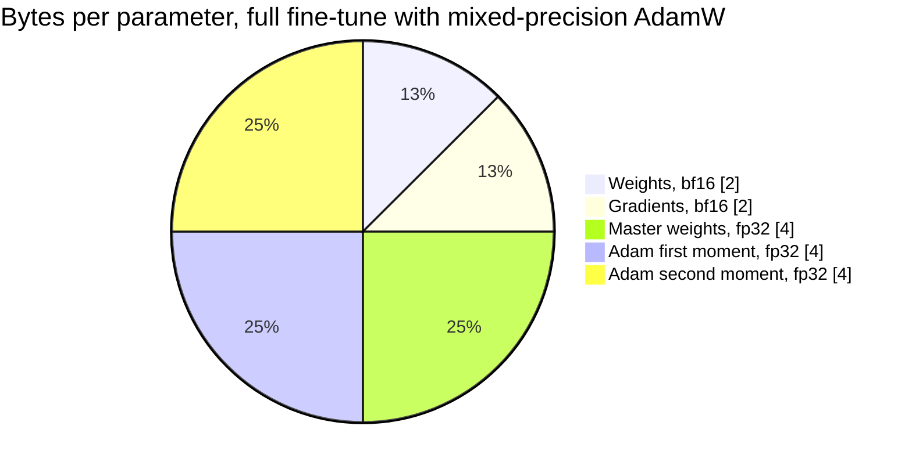
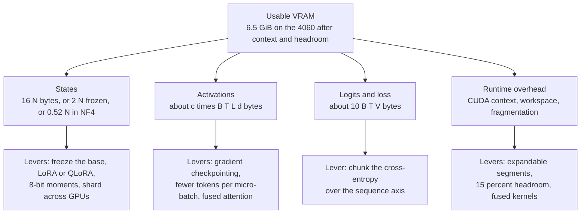
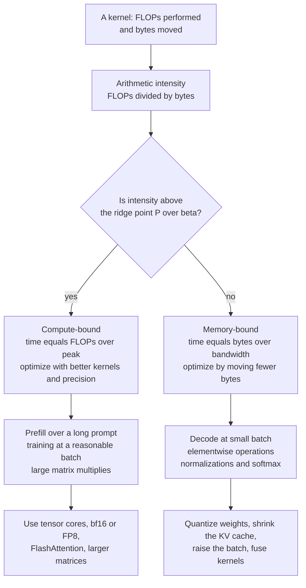
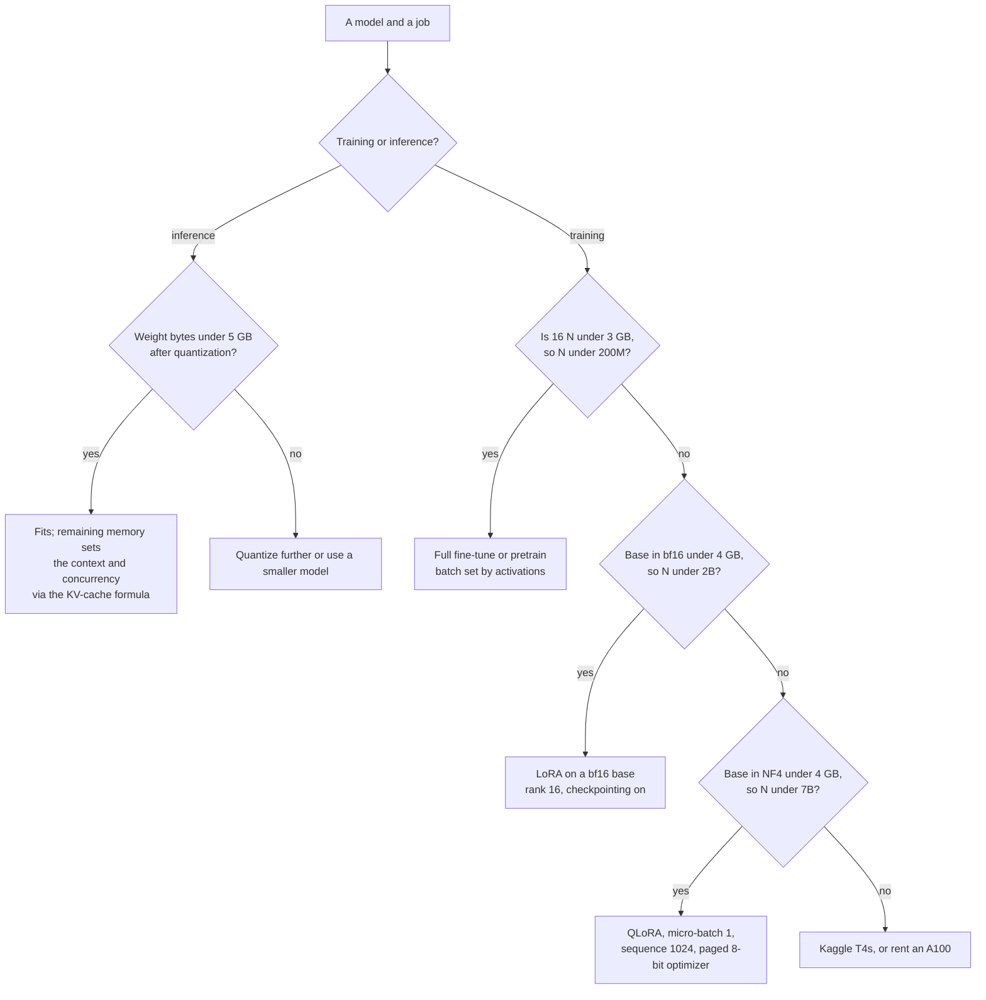

# Chapter 4: Memory, Compute, and Throughput

> **What you will be able to do.** Say whether a given model will train or serve on a given GPU, in one minute, from the configuration file and the spec sheet; derive the 16 bytes per parameter of mixed-precision AdamW and every reduction of it; compute activation memory, KV-cache memory, and the cost of gradient checkpointing; estimate a run's wall-clock time from $6ND$ before renting the GPU; compute the decode tokens-per-second ceiling from memory bandwidth and explain why prefill and decode sit on opposite sides of the roofline; report model FLOPs utilization honestly.
>
> **Where it is used.** Every training and serving project. P1.1 sizes its pretraining run here, P1.2 and P1.3 size LoRA and QLoRA here, P2.1 and P2.2 use the KV-cache and roofline results, and Chapters 6, 7, 12, and 13 refer back to this chapter rather than repeating its arithmetic.
>
> **Prerequisites.** Chapter 2 for parameter counts and the KV-cache mechanism, Chapter 3 for the optimizer states and mixed precision whose bytes this chapter counts.

## 4.0 The problem this chapter solves

A customer has two NVIDIA L4 cards and wants to know whether a 7B model can be fine-tuned on their data and then served to forty concurrent analysts. Your answer is due in the meeting, not after an experiment. A second customer asks why their inference bill did not fall when they moved from a 70B model to a 13B one. A third wants to know whether it is cheaper to train a small model for a week or to call an API forever.

All three are arithmetic. Bytes per parameter answers the first half of the first question, the KV-cache formula answers the second half, the roofline answers the second question, and $6ND$ against an hourly rate answers the third. None of them need a benchmark, and all of them need the numbers to be right, because being wrong by a factor of two in a customer meeting is the difference between a project and a postmortem.

This chapter is the sizing reference for the whole handbook. It has four parts. Memory: what occupies the card during training and during serving, derived rather than asserted. Compute: FLOPs per token, forward and backward, and what fraction of the GPU's peak a real run achieves. Throughput: the roofline, which decides whether an operation is limited by arithmetic or by memory traffic, and the tokens-per-second ceilings that follow. Fit: the decision procedure for the 8 GB of an RTX 4060 Laptop GPU, the 16 GB of a Kaggle T4, and the 80 GB of a rented A100.

Every formula below gets a worked example on all three machines. Where a GPU's peak arithmetic rate or memory bandwidth is quoted, the figure is round and should be checked: vendor pages differentiate by power limit, by sparsity, and by accumulation precision, and a laptop part's sustained numbers depend on the chassis.

## 4.1 Bytes per parameter

Start with the largest and most predictable term. Let $N$ be the number of parameters. Chapter 3's optimizer keeps, for each one:

| Tensor | Precision | Bytes per parameter |
|---|---|---|
| Weights used in the forward and backward passes | bf16 or fp16 | 2 |
| Gradients | bf16 or fp16 | 2 |
| Master copy of the weights, which the optimizer updates | fp32 | 4 |
| AdamW first moment $m$ | fp32 | 4 |
| AdamW second moment $v$ | fp32 | 4 |
| **Total** | | **16** |

$$
M_{\text{states}} \approx 16 N \ \text{bytes for full fine-tuning or pretraining with mixed-precision AdamW.}
$$

Two implementations arrive at the same total by different routes. The Apex and DeepSpeed accounting is the table above: 16-bit weights and gradients plus an fp32 master copy plus two fp32 moments. PyTorch's `autocast` path keeps the parameters and gradients in fp32 and casts to 16-bit per operation, so it is $4 + 4 + 4 + 4 = 16$ with transient 16-bit copies that the allocator reuses. Either way, budget 16 bytes.

Worked examples.

| Model | $N$ | $16N$ | Fits where |
|---|---|---|---|
| P0.2 model | 12.6M | 202 MB | Anywhere |
| P1.1 model | 120M | 1.92 GB | The 4060, with room for activations |
| Qwen2.5-0.5B | 0.49B | 7.9 GB | Not on the 4060; a T4 with a small batch |
| Qwen2.5-1.5B | 1.54B | 24.7 GB | An A100; not a T4 |
| Llama-3-8B | 8.03B | 129 GB | No single GPU; needs sharding (Chapter 6) |

**Reductions.** Each one removes a row from the table.

- **8-bit Adam** (Dettmers et al. 2022) quantizes each moment blockwise to 8 bits: the two moments cost 2 bytes instead of 8, giving $2 + 2 + 4 + 2 = 10$ bytes per parameter. For Qwen2.5-0.5B that is 4.9 GB instead of 7.9 GB, which is the difference between fitting on the 4060 and not.
- **Paged optimizers** do not change the byte count. They allocate the moments in unified memory so the driver can evict blocks to host RAM when VRAM is exhausted, converting an out-of-memory crash at a memory spike into a slowdown. Use them whenever a run is within 10 percent of the ceiling.
- **Adafactor** factorizes $v$ into row and column statistics: for a matrix of shape $d_{in} \times d_{out}$ it stores $d_{in} + d_{out}$ numbers instead of $d_{in} d_{out}$, so the second moment becomes negligible. It costs some fidelity and is the answer only when 8-bit moments still do not fit.
- **Freezing** the base model removes weights' gradients, master copies, and moments entirely: a frozen bf16 base costs 2 bytes per parameter and nothing else. This is LoRA (section 4.7).
- **Inference only** costs 2 bytes per parameter in bf16, 1 in int8, and about 0.5 in 4-bit.



*Figure 4.1: the sixteen bytes; three quarters of them belong to the optimizer and the master copy, which is why freezing the base model is the single largest memory lever.*

## 4.2 Activation memory

Activations are the intermediate tensors the backward pass needs. Unlike the states of section 4.1 they scale with the batch and the sequence length, which is why the same model trains at sequence 512 and dies at 4,096.

**The formula.** For a Llama-style block with a fused attention kernel, count the tensors saved per token per layer, in elements of width $d$: the block input, the two normalization outputs, the query, key, and value projections, the attention output, and the three MLP tensors that the SwiGLU backward pass needs. With grouped-query attention at $n_{kv}/h$ and $d_{ff} = 8d/3$, that is about $5d + 2d \cdot (n_{kv}/h) + 3 d_{ff} \approx 13.5 d$ elements, so about $27d$ bytes in bf16. Add the softmax statistics FlashAttention keeps and the copies that a given implementation does not free, and the practical range is

$$
M_{\text{act}} \approx c \cdot B \cdot T \cdot L \cdot d \ \text{bytes}, \qquad c \approx 25 \ \text{to} \ 45 \ \text{bytes},
$$

with $B$ the micro-batch in sequences, $T$ the sequence length, $L$ the number of layers, and $d$ the model width. Use $c = 36$ for planning, which is the value Chapter 6 uses for its 120M configuration, and measure your own with `torch.cuda.max_memory_allocated()`.

Worked example, the 120M model ($L = 12$, $d = 768$) at $B = 4$, $T = 1024$: $36 \times 4 \times 1024 \times 12 \times 768 = 1.36 \times 10^{9}$ bytes, about 1.3 GB. Double the micro-batch to 8 and it is 2.7 GB. Double the sequence to 2,048 instead and it is also 2.7 GB: the formula is symmetric in $B$ and $T$, and only tokens per micro-batch matter.

**The logits term, which is usually forgotten.** The language-model head produces a $B \times T \times V$ tensor. During the loss computation it exists in bf16, in fp32, and as an fp32 gradient, roughly 10 bytes per element. Worked example, the same 120M model with $V = 49{,}152$ at $B = 8$, $T = 1024$: $8 \times 1024 \times 49{,}152 \times 10 = 4.0 \times 10^{9}$ bytes, 3.8 GB, which is larger than everything else combined. For small models with large vocabularies the logits are the binding constraint, and the fix is to compute the cross-entropy in chunks over the sequence axis, which brings it to a few hundred megabytes.

**The quadratic term, if attention is not fused.** A hand-written attention that materializes the $T \times T$ score and probability matrices adds $2 \cdot B \cdot h \cdot T^2 \cdot 2$ bytes per layer. For $B = 4$, $h = 12$, $T = 1024$, $L = 12$: $2 \times 4 \times 12 \times 1024^2 \times 2 \times 12 = 2.4 \times 10^{9}$ bytes, 2.3 GB, and at $T = 4096$ it is 37 GB. Use `F.scaled_dot_product_attention` and this term disappears (Chapter 2, section 2.11).

**Why long sequences dominate.** States are $16N$ and do not move. Activations are $c \, B T L d$ and grow linearly with tokens per micro-batch. For the 120M model the crossover is at $36 \times (BT) \times 12 \times 768 = 1.92 \times 10^{9}$, so $BT \approx 5{,}800$ tokens: beyond about six sequences of 1,024, activations exceed the entire optimizer state. For a 7B model under LoRA, where the state term is small, activations dominate from the first sequence.

## 4.3 Gradient checkpointing

Gradient checkpointing, also called activation checkpointing, stores only the input to each transformer block during the forward pass and recomputes everything inside the block during the backward pass.

Memory becomes the block inputs plus the working set of the one block currently being recomputed:

$$
M_{\text{act, ckpt}} \approx 2 \cdot B \cdot T \cdot L \cdot d + c \cdot B \cdot T \cdot d \ \text{bytes,}
$$

the first term being one bf16 tensor of width $d$ per token per layer and the second the full activations of a single block. The coefficient falls from $c \approx 36$ to 2 for the dominant term, a reduction of about 18 times.

Worked example, the 120M model at $B = 4$, $T = 1024$: without checkpointing 1.36 GB, with checkpointing $2 \times 4 \times 1024 \times 12 \times 768 = 75$ MB plus a one-block working set of $36 \times 4 \times 1024 \times 768 = 113$ MB, about 188 MB. The saving is 1.17 GB, which on an 8 GB card buys roughly four times the micro-batch.

**The compute cost.** Section 4.6 derives forward at $2N$ FLOPs per token and backward at $4N$, total $6N$. Recomputing the forward pass adds $2N$, so the total becomes $8N$:

$$
\text{overhead} = \frac{8N - 6N}{6N} = \frac{1}{3} \approx 33 \ \text{percent more compute.}
$$

A 4-hour run becomes 5.3 hours. In practice the measured overhead is 20 to 30 percent, because the recomputation is a forward pass with high arithmetic intensity that runs closer to peak than the backward pass it is interleaved with.

**Selective checkpointing** applies the trade to every $k$-th block instead of all of them, interpolating between the two extremes; PyTorch and Hugging Face both expose it. On 8 GB, checkpoint everything and stop thinking about it: the roadmap's fine-tunes are memory-bound, not compute-bound, and the 33 percent buys a batch size that more than repays it.

## 4.4 Where the bytes go, in one picture

Four buckets occupy the card during a training step, and each has its own lever. Sizing a job means computing all four and adding them, and debugging an out-of-memory error means identifying which one you underestimated.



*Figure 4.2: the four memory buckets of a training step and the lever that shrinks each; an out-of-memory error is always one of these four, mis-estimated.*

The buckets behave differently as you scale. States are fixed once the model and the method are chosen. Activations and logits scale with tokens per micro-batch, so accumulation reduces them at no FLOP cost. Overhead is roughly constant but grows with fragmentation over a long run. The usual mistake is to compute the first bucket carefully, forget the third entirely, and discover at step one that a small model with a 152,000-token vocabulary spends more memory on logits than on weights.

## 4.5 The KV cache

Chapter 2, section 2.12 derived the cache size. Restating the result, with $n_{kv}$ the number of key-value heads, $d_{head}$ the head dimension, and $b$ the bytes per element:

$$
m_{kv} = 2 \cdot L \cdot n_{kv} \cdot d_{head} \cdot b \ \text{bytes per token,}
$$

the leading 2 counting one key vector and one value vector. Memory for a workload is $m_{kv}$ times the total number of tokens resident across all sequences.

| Model | $L$ | $n_{kv}$ | $d_{head}$ | bf16 bytes per token | Per 8k sequence | 64 such sequences |
|---|---|---|---|---|---|---|
| Llama-3-8B | 32 | 8 | 128 | 131,072, so 128 KB | 1.0 GB | 64 GB |
| Llama-3-8B under MHA (hypothetical) | 32 | 32 | 128 | 524,288, so 512 KB | 4.0 GB | 256 GB |
| Qwen2.5-1.5B | 28 | 2 | 128 | 28,672, so 28 KB | 224 MB | 14 GB |
| P0.2 model | 6 | 2 | 64 | 3,072, so 3 KB | 24 MB | 1.5 GB |

**Capacity, the number a customer actually asks for.** The tokens a GPU can hold is

$$
T_{\text{total}} = \frac{M_{\text{GPU}} - M_{\text{weights}} - M_{\text{overhead}}}{m_{kv}} ,
$$

where $M_{\text{overhead}}$ covers the CUDA context, the engine's workspace, and the activation memory of the largest prefill batch, typically 1 to 2 GB for vLLM and 0.4 to 0.6 GB for a plain PyTorch loop.

Worked examples, all in bf16 weights.

- **RTX 4060, 8 GB, Qwen2.5-1.5B.** The card's 8 GB is $8 \times 10^{9}$ bytes on the spec sheet, which is 7.45 GiB; WSL2 and the CUDA context take 0.4 to 0.6 GiB, so budget 6.9 GiB usable. Weights are $1.54 \times 10^{9} \times 2 = 3.08 \times 10^{9}$ bytes, 2.87 GiB. Free for cache: about 4.0 GiB, which at 28 KB per token is 153,000 tokens: 18 concurrent sequences of 8k, or 4 of 32k. Chapter 2's quicker estimate of 4.4 GB free assumed the full 8 GB was addressable; this is the careful version, and the difference is about 10 percent.
- **Kaggle T4, 16 GB, Llama-3-8B in fp16.** Weights $8.03 \times 10^{9} \times 2 = 16.1 \times 10^{9}$ bytes, which exceeds the card. The model does not fit at 16-bit on one T4 at all, which is why P2.1 quantizes before benchmarking. At 4-bit the weights are about 4.1 GB, leaving roughly 10 GB for cache: 82,000 tokens, 10 sequences of 8k.
- **A100 80 GB, Llama-3-8B in bf16.** Weights 16.1 GB, engine overhead 2 GB, free about 62 GB: 495,000 tokens at 128 KB each, so 60 concurrent sequences of 8k, 15 of 32k, or 3 of 128k. This is the calculation behind every "how many users per GPU" question.

**KV-cache quantization** to int8 halves $m_{kv}$ and to FP8 does the same on Ada and Hopper; Chapter 12, section 12.11 covers the accuracy cost. Doubling the concurrent users is usually worth more than the small quality change, which is why every serving stack now offers it.

## 4.6 FLOPs: training and inference

**Forward.** Nearly all of a transformer's arithmetic is in matrix multiplies whose operands are the weights. Each weight participates in one multiply and one add per token, so the forward pass costs about

$$
C_{\text{fwd}} \approx 2 N \ \text{FLOPs per token,}
$$

with $N$ the parameter count including the language-model head, whose $d \times V$ matrix is a matmul like any other. For a tied model the embedding lookup itself is an index, not a matmul, but the head that shares its weights is a matmul, so counting $N$ once is right.

**Backward.** The backward pass computes two gradients per weight matrix: with respect to the layer's input, which is a matmul of the same shape, and with respect to the weights, another. Each costs about $2N$, so backward is about $4N$ and

$$
C_{\text{train}} \approx 6 N D \ \text{FLOPs for } D \text{ training tokens.}
$$

**What $6ND$ leaves out.** The attention score and value products cost about $4 T d$ FLOPs per token per layer in the forward pass and three times that overall, which relative to $6N \approx 72 L d^2$ is a fraction $T/(6d)$. For $T = 1024$ and $d = 768$ that is 22 percent; for $T = 8192$ and $d = 4096$ it is 33 percent; for $T = 131{,}072$ and $d = 4096$ it is 5.3 times, and the estimate is useless. Use $6ND$ up to sequence lengths of a few thousand, and add the attention term explicitly beyond that. Normalizations, activations, and softmax are a few percent and are ignored.

**Inference.** One decode step does a forward pass over one new token per sequence, so

$$
C_{\text{decode}} \approx 2 N \ \text{FLOPs per token per sequence,}
$$

and a prefill over a prompt of $T$ tokens costs $2NT$. This is why serving a 13B model is not four times cheaper than serving a 70B one in practice: as section 4.9 shows, decode is not limited by these FLOPs at all.

Worked examples.

- **P1.1, 125M parameters over 300M tokens:** $6 \times 1.25 \times 10^{8} \times 3 \times 10^{8} = 2.25 \times 10^{17}$ FLOPs.
- **Llama-3-8B over 15T tokens** (the published pretraining budget order): $6 \times 8 \times 10^{9} \times 1.5 \times 10^{13} = 7.2 \times 10^{23}$ FLOPs. On one A100 at 150 TFLOPS achieved that is 152,000 years, which is the arithmetic behind "you are not pretraining an 8B model."
- **A LoRA fine-tune of Qwen2.5-1.5B on 50M tokens:** the frozen base still does the full forward and backward, so $6 \times 1.54 \times 10^{9} \times 5 \times 10^{7} = 4.6 \times 10^{17}$ FLOPs. LoRA saves memory, not compute; it saves about one third of the backward pass because no weight gradients are computed for frozen matrices, so use $4ND$ to $5ND$ for LoRA rather than $6ND$.

## 4.7 LoRA and QLoRA memory

LoRA (Chapter 7) freezes the base and trains a low-rank update per target matrix. For a linear layer of shape $d_{in} \times d_{out}$ at rank $r$ the adapter adds $r(d_{in} + d_{out})$ parameters.

$$
M_{\text{LoRA}} \approx b_{\text{base}} N + 16 N_{\text{adapter}} + M_{\text{act}} ,
$$

with $b_{\text{base}}$ the bytes per parameter of the frozen base (2 for bf16, about 0.52 for NF4) and $N_{\text{adapter}}$ the trainable parameter count.

**Worked example, Qwen2.5-1.5B at rank 16 on all linear modules.** Shapes per layer: $W_Q$ and $W_O$ are $1536 \times 1536$, $W_K$ and $W_V$ are $1536 \times 256$, $W_{gate}$ and $W_{up}$ are $1536 \times 8960$, $W_{down}$ is $8960 \times 1536$. Adapter parameters per layer:

$$
16(1536{+}1536) \cdot 2 + 16(1536{+}256) \cdot 2 + 16(1536{+}8960) \cdot 2 + 16(8960{+}1536) = 659{,}456 .
$$

Across 28 layers, 18.5M trainable parameters, 1.2 percent of the model. Optimizer and master states at 16 bytes are 296 MB. Base in bf16 is 2.87 GiB. Total before activations: 3.15 GiB.

**QLoRA** replaces the frozen base with a 4-bit NormalFloat quantization (Chapter 12, section 12.7). The storage is 4 bits per weight plus the block constants: with block size 64 and double quantization the overhead is about 0.127 bits, so about 4.13 bits, **0.52 bytes per parameter**. Modules that are not `nn.Linear`, principally the embedding table and the normalization gains, stay in 16-bit.

Worked example, the same 1.5B model: the embedding is $151{,}936 \times 1536 = 233$M parameters at 2 bytes, 466 MB; the remaining 1.31B at 0.52 bytes is 682 MB. Base total 1.12 GiB against 2.87 GiB in bf16. With the same 18.5M adapters at 16 bytes, 296 MB. Total before activations: 1.41 GiB.

**The 8 GB table.** Activations assume gradient checkpointing on, micro-batch 1, and chunked cross-entropy, so $M_{\text{act}} \approx 2 T L d + c T d$ plus a few hundred megabytes of allocator slack.

| Configuration | Base | Adapter states | Activations at $T$ | Total | On the 4060 |
|---|---|---|---|---|---|
| LoRA r16, 1.5B bf16, $T = 1024$ | 2.87 GB | 0.30 GB | 0.13 GB | 3.7 GB | Comfortable, micro-batch 4 |
| LoRA r16, 1.5B bf16, $T = 4096$ | 2.87 GB | 0.30 GB | 0.51 GB | 4.1 GB | Fits at micro-batch 1 to 2 |
| QLoRA r16, 3B, $T = 2048$ | 2.1 GB | 0.45 GB | 0.45 GB | 3.4 GB | Comfortable |
| QLoRA r16, 7B, $T = 1024$ | 3.5 GB | 0.67 GB | 0.42 GB | 5.0 GB computed | Borderline; measured 6.5 to 8 GB |
| QLoRA r16, 7B, $T = 2048$ | 3.5 GB | 0.67 GB | 0.84 GB | 5.4 GB computed | Needs a T4 or better |
| LoRA r16, 7B bf16, $T = 1024$ | 13.4 GB | 0.67 GB | 0.42 GB | 14.9 GB | No; rent an A100 |

The gap between the computed 5.0 GB and the measured 6.5 to 8 GB for 7B QLoRA is real and is worth understanding, because it is the difference between a plan that works and one that dies at step 40. It comes from three places: the bitsandbytes dequantization workspace, which materializes a 16-bit copy of each weight matrix as it is used; allocator fragmentation, which on a card this small routinely costs 10 percent; and the transient peak when the largest matrix, $W_{down}$ at $14{,}336 \times 4096$, is dequantized. Unsloth's fused kernels reduce the first of these, which is why the roadmap specifies it for this configuration. Always size with headroom of at least 15 percent on 8 GB.

## 4.8 Reading a GPU spec sheet

Three numbers decide everything: memory capacity, memory bandwidth, and peak arithmetic rate in the precision you will use.

| GPU | Memory | Bandwidth | Dense 16-bit tensor peak | Ridge point | Notes |
|---|---|---|---|---|---|
| RTX 4060 Laptop, Ada, cc 8.9 | 8 GB GDDR6 | about 256 GB/s | about 45 TFLOPS bf16 | about 176 | FP8 supported; the laptop power limit moves the peak |
| Tesla T4, Turing, cc 7.5 | 16 GB GDDR6 | about 320 GB/s | about 65 TFLOPS fp16 | about 203 | No bf16, no FP8 |
| A100 80 GB, Ampere, cc 8.0 | 80 GB HBM2e | about 2.0 TB/s | about 312 TFLOPS bf16 | about 156 | No FP8; NVLink between cards |

All figures are approximate; verify on the spec sheet. Three traps in reading one. First, marketing tables often quote the **sparse** tensor rate, which is double the dense rate and applies only to weights pruned in a 2:4 pattern that none of your models use: halve any number labeled "with sparsity". Second, GeForce parts can run 16-bit tensor operations with fp32 accumulation at a reduced rate compared to 16-bit accumulation, and training requires fp32 accumulation, so the achievable peak on a consumer card is often below the headline. Third, a laptop GPU's sustained rate is set by the chassis power limit and by thermals, not by the silicon; measure it (section 4.12) rather than quoting it.

**Compute capability** determines features, not speed. 7.5 (Turing, T4) has fp16 tensor cores and no bf16, so Chapter 3's loss scaler is mandatory. 8.0 (Ampere, A100) and 8.9 (Ada, the 4060) have bf16 and FlashAttention-2 kernels. 8.9 and 9.0 add FP8 tensor cores.

## 4.9 The roofline: why prefill and decode differ

Define **arithmetic intensity** $I$ as the floating-point operations a kernel performs per byte it moves between GPU memory (HBM or GDDR) and the compute units. Let $P$ be the peak arithmetic rate in FLOPS and $\beta$ the memory bandwidth in bytes per second. A kernel's time is bounded below by both limits:

$$
t \ge \max\left(\frac{\text{FLOPs}}{P}, \ \frac{\text{bytes}}{\beta}\right), \qquad \text{achievable rate} = \min\left(P, \ I \beta\right).
$$

The two limits cross at the **ridge point**

$$
I^{*} = \frac{P}{\beta} ,
$$

which for the three GPUs above is about 176, 203, and 156 FLOPs per byte. Below $I^*$ a kernel is memory-bound and its time is bytes over bandwidth; above it the kernel is compute-bound.



*Figure 4.3: the roofline as a decision, with the optimization that follows from each side.*

**Prefill.** Processing a prompt of $T$ tokens performs $2NT$ FLOPs while reading the weights once, $2N$ bytes in bf16. So

$$
I_{\text{prefill}} \approx \frac{2NT}{2N} = T \ \text{FLOPs per byte.}
$$

Prefill becomes compute-bound as soon as the prompt exceeds the ridge point in tokens, about 156 on an A100 and 176 on the 4060. Every realistic prompt is longer than that, so prefill is compute-bound, and the way to make it faster is better kernels and lower precision.

**Decode.** One step with batch $B$ performs $2NB$ FLOPs while reading $2N$ bytes of weights plus the resident KV cache, $B \bar{T} m_{kv}$ bytes for a mean context $\bar{T}$:

$$
I_{\text{decode}} = \frac{2NB}{2N + B \bar{T} m_{kv}} .
$$

Ignoring the cache, $I \approx B$: decode is memory-bound until the batch reaches the ridge point, about 156 sequences on an A100. Including the cache, the intensity saturates at $2N / (\bar{T} m_{kv})$ however large $B$ grows. For Llama-3-8B at $\bar{T} = 4096$ that ceiling is $1.6 \times 10^{10} / (4096 \times 131{,}072) = 30$ FLOPs per byte, below every ridge point, so decode with multi-kilobyte contexts never becomes compute-bound. This single result explains why weight quantization, GQA, and KV-cache quantization dominate serving performance while faster tensor cores do not (Chapters 12 and 13).

## 4.10 Decode speed from bandwidth

Because decode is memory-bound, the tokens per second of a single sequence has a hard ceiling set by bandwidth:

$$
\text{tokens per second} \le \frac{\beta}{M_{\text{weights}} + \bar{T} \, m_{kv}} ,
$$

the denominator being the bytes that must cross the memory bus once per step. Real systems reach 60 to 85 percent of this because of kernel launch overhead, sampling, and imperfect memory access patterns.

Worked examples on the RTX 4060 at $\beta \approx 256$ GB/s.

| Model and format | Weight bytes | Cache at 2k context | Bytes per step | Ceiling | Expect |
|---|---|---|---|---|---|
| Qwen2.5-1.5B, bf16 | 3.08 GB | 57 MB | 3.14 GB | 82 tok/s | 55 to 70 |
| Qwen2.5-1.5B, int8 | 1.54 GB | 57 MB | 1.60 GB | 160 tok/s | 100 to 135 |
| 7B, 4-bit NF4 or Q4_K_M | 3.6 GB | 268 MB | 3.87 GB | 66 tok/s | 40 to 55 |
| 7B, 4-bit, 8k context | 3.6 GB | 1.07 GB | 4.67 GB | 55 tok/s | 35 to 45 |

The same 7B 4-bit model on a **T4** at 320 GB/s has a ceiling of 83 tokens per second, but Turing has no fast int4 path, so the dequantization runs on general-purpose units and the measured rate is usually lower than the 4060's despite the higher bandwidth. On an **A100 80 GB** at 2.0 TB/s, Llama-3-8B in bf16 reads 16.1 GB of weights plus 0.27 GB of cache at 2k, giving a ceiling of 122 tokens per second for one sequence. A ninety-times-larger card is fifteen times faster at single-stream decode, and the gap is entirely bandwidth. Throughput per dollar on the A100 comes from batching, which reads those 16.1 GB once for all sequences in the batch.

**The customer-facing version of this result:** the latency a single user feels is set by memory bandwidth and model size, and the throughput the finance team pays for is set by batch size. They are different numbers with different levers, and conflating them is the most common error in serving conversations.

## 4.11 Model FLOPs utilization

$$
\text{MFU} = \frac{6 N \cdot (\text{tokens per second})}{P} ,
$$

the ratio of the useful arithmetic the model requires to the GPU's peak rate. It is the honest way to report throughput, because tokens per second alone conflates model size, hardware, and efficiency.

Worked examples.

- **P0.2, 12.6M parameters on the 4060 at 100,000 tokens per second:** $6 \times 1.26 \times 10^{7} \times 10^{5} = 7.6 \times 10^{12}$, so 7.6 TFLOPS achieved, MFU $= 7.6/45 = 17$ percent.
- **P1.1, 120M on the 4060 at 21,000 tokens per second:** $6 \times 1.2 \times 10^{8} \times 2.1 \times 10^{4} = 1.5 \times 10^{13}$, 15 TFLOPS, MFU 33 percent.
- **A 7B model on an A100 at 3,000 tokens per second:** $6 \times 7 \times 10^{9} \times 3 \times 10^{3} = 1.26 \times 10^{14}$, 126 TFLOPS, MFU 40 percent.

Realistic ranges: 15 to 30 percent for models under about 500M, where the matrices are small enough that the GPU spends its time on launch overhead and memory traffic rather than arithmetic; 35 to 55 percent for well-tuned multi-billion-parameter runs on datacenter GPUs with fused kernels, large batches, and FlashAttention. Above 55 percent, check the arithmetic before celebrating.

Two cautions. Report the achieved TFLOPS alongside the MFU, because the denominator is a vendor figure you did not measure and, on a laptop part, is not even constant. And distinguish MFU from hardware FLOPs utilization, which counts recomputation: with gradient checkpointing the hardware does $8N$ per token while the model requires $6N$, so hardware utilization is 33 percent higher than MFU and the two should not be compared across runs with different checkpointing settings.

## 4.12 Implementation notes

Four listings. They assume `import torch`, `import time`, and a `cfg` dictionary holding the keys used below.

**Listing 4.1: parameter counting from a configuration.**

```python
def count_params(cfg) -> dict:
    d, L, V = cfg["d"], cfg["n_layers"], cfg["vocab"]
    h, n_kv, d_ff = cfg["n_heads"], cfg["n_kv_heads"], cfg["d_ff"]
    d_head = d // h
    attn = 2 * d * d + 2 * d * (n_kv * d_head)      # Wq and Wo, then Wk and Wv
    mlp = 3 * d * d_ff                              # SwiGLU: gate, up, down
    norms = 2 * d                                   # two RMSNorm gains per block
    per_layer = attn + mlp + norms
    embed = V * d if cfg.get("tied", True) else 2 * V * d
    total = L * per_layer + embed + d               # plus the final norm
    return {"per_layer": per_layer, "non_embed": L * per_layer,
            "embed": embed, "total": total}
```

The function is the arithmetic of Chapter 2, section 2.10 in code, and its only subtlety is the tied flag: a tied model counts the shared matrix once, so a count that is off by exactly $V d$ against the framework's report means the tying convention differs. Run it against `sum(p.numel() for p in model.parameters())` as a test; for Qwen2.5-1.5B it returns 1.544B and for Llama-3-8B 8.03B.

**Listing 4.2: the training memory estimate.**

```python
def train_memory_gb(cfg, batch, seq, mode="full", rank=16, ckpt=True, c=36):
    N = count_params(cfg)["total"]
    d, L, V = cfg["d"], cfg["n_layers"], cfg["vocab"]
    if mode == "full":
        state = 16 * N
    elif mode == "lora":
        n_ad = rank * lora_fanin_fanout(cfg)        # sum of (d_in + d_out) over targets
        state = 2 * N + 16 * n_ad
    elif mode == "qlora":
        n_ad = rank * lora_fanin_fanout(cfg)
        state = int(0.52 * (N - V * d)) + 2 * V * d + 16 * n_ad
    tokens = batch * seq
    act = (2 * tokens * L * d + c * tokens * d) if ckpt else (c * tokens * L * d)
    logits = 10 * tokens * V                        # bf16 plus fp32 plus fp32 grad
    overhead = 0.6 * 1024 ** 3                      # CUDA context and allocator slack
    return (state + act + logits + overhead) / 1024 ** 3
```

The three modes differ only in the `state` line, which is section 4.1 and section 4.7. The activation branch is section 4.3: with checkpointing, one bf16 tensor per layer plus a single block's working set; without it, the full $c \, B T L d$. The `logits` term is the one that surprises people and the one to attack first with chunked cross-entropy on small models with large vocabularies; setting its coefficient to 10 assumes the naive path. Compare the result against `torch.cuda.max_memory_allocated()` after fifty real steps; agreement within 20 percent means the model is understood, and a large gap means an unfused attention path or a retained tensor.

**Listing 4.3: the KV cache and decode ceiling.**

```python
def kv_bytes_per_token(cfg, bits=16):
    d_head = cfg["d"] // cfg["n_heads"]
    return 2 * cfg["n_layers"] * cfg["n_kv_heads"] * d_head * (bits // 8)

def serving_capacity(cfg, gpu_gb, weight_bits=16, kv_bits=16, overhead_gb=2.0):
    N = count_params(cfg)["total"]
    weights = N * weight_bits / 8
    free = gpu_gb * 1024 ** 3 - weights - overhead_gb * 1024 ** 3
    per_token = kv_bytes_per_token(cfg, kv_bits)
    return {"weight_gb": weights / 1024 ** 3, "kv_per_token": per_token,
            "total_tokens": max(0, int(free // per_token))}

def decode_ceiling_tps(cfg, bandwidth_gbs, ctx, weight_bits=16, kv_bits=16):
    N = count_params(cfg)["total"]
    per_step = N * weight_bits / 8 + ctx * kv_bytes_per_token(cfg, kv_bits)
    return bandwidth_gbs * 1e9 / per_step          # single-sequence upper bound
```

`serving_capacity` is the "how many users fit" calculation of section 4.5 and returns tokens, not sequences, because sequences have different lengths and a paged engine (Chapter 13) allocates by block, not by sequence. `decode_ceiling_tps` uses decimal gigabytes per second because that is the unit bandwidth is quoted in, while the memory functions use binary gigabytes because that is what the allocator reports: mixing the two silently is a 7 percent error. The returned ceiling is an upper bound; multiply by 0.6 to 0.85 for a realistic expectation.

**Listing 4.4: the benchmark that replaces the estimate.**

```python
@torch.no_grad()
def _sync():
    torch.cuda.synchronize()

def bench_train_step(model, opt, batch_fn, steps=50, warmup=10, dtype=torch.bfloat16):
    torch.cuda.reset_peak_memory_stats()
    for i in range(warmup + steps):
        if i == warmup:
            _sync(); t0 = time.perf_counter(); tokens = 0
        x, y = batch_fn()
        with torch.autocast("cuda", dtype=dtype):
            _, loss, _ = model(x, targets=y)
        loss.backward()
        torch.nn.utils.clip_grad_norm_(model.parameters(), 1.0)
        opt.step(); opt.zero_grad(set_to_none=True)
        if i >= warmup:
            tokens += x.numel()
    _sync()
    dt = time.perf_counter() - t0
    N = sum(p.numel() for p in model.parameters())
    tps = tokens / dt
    return {"tokens_per_s": tps, "achieved_tflops": 6 * N * tps / 1e12,
            "peak_gb": torch.cuda.max_memory_allocated() / 1024 ** 3}
```

The warmup steps exist because the first iterations pay for CUDA context creation, kernel autotuning, and allocator growth, and including them understates throughput by a factor of two on a short run. `torch.cuda.synchronize()` before both timestamps is mandatory: CUDA calls are asynchronous, and timing without it measures how fast Python can enqueue work. `max_memory_allocated` reports tensor memory, not the reserved pool, so it is the number to compare against Listing 4.2; `max_memory_reserved` is typically 10 to 20 percent higher and is what `nvidia-smi` shows. Run this as the mandatory 50-step smoke test at full sequence length and batch size before any long job, and record the three returned numbers in the roadmap log.

## 4.13 Failure modes

| Symptom | Likely cause | How to confirm | Fix |
|---|---|---|---|
| Out of memory at step 1 with a model that "should fit" | Optimizer states counted at 8 bytes instead of 16, or activations ignored | Print `max_memory_allocated` after the first backward and compare to Listing 4.2 | Re-size with the full 16 bytes plus activations plus logits |
| Out of memory at step 40, not step 1 | Allocator fragmentation, or a long example in the data hitting the maximum sequence length | Peak memory creeps up across steps | Sort or bucket by length; set `PYTORCH_CUDA_ALLOC_CONF=expandable_segments:True`; leave 15 percent headroom |
| Memory scales with $T^2$ | Attention not fused; the score matrix is materialized | Double $T$ and watch memory quadruple | Use `scaled_dot_product_attention` or FlashAttention |
| Memory dominated by an unexplained multi-gigabyte tensor on a small model | The logits, at $10 B T V$ bytes | $B T V$ times 10 matches the gap | Chunk the cross-entropy over the sequence axis |
| Throughput far below the $6ND$ estimate on a small model | Small matrices; the GPU is launch-bound, not compute-bound | MFU under 15 percent with high GPU utilization | Larger micro-batch, fused optimizer, `torch.compile`; accept a low MFU at small scale |
| Estimated hours are half the measured hours | Gradient checkpointing counted at $6N$ instead of $8N$ | The ratio is close to 1.33 | Use $8ND$ when checkpointing is on |
| Decode is slower than the bandwidth ceiling by 3 times or more | Per-step Python overhead, no CUDA graphs, or an unbatched sampler | Time one forward with a fixed input and compare | Use a serving engine (Chapter 13), not a Python generation loop |
| Decode does not speed up after quantizing weights | The KV cache now dominates the bytes read per step | Recompute $M_{\text{weights}} + \bar{T} m_{kv}$; the second term is larger | Quantize the KV cache, shorten the context, or use a model with fewer KV heads |
| Serving fits one user and fails at ten | Capacity sized on weights only, ignoring $m_{kv}$ per concurrent token | Multiply $m_{kv}$ by the total resident tokens | Size with Listing 4.3; cap `max_model_len` and concurrency |
| MFU above 60 percent on a small model | Tokens counted including padding, or peak TFLOPS taken from a sparse figure | Recount real tokens; halve any "with sparsity" peak | Fix the denominator and the token count |
| A T4 run reports half the 4060's throughput on the same script | fp16 with a loss scaler plus no FlashAttention-2 on compute capability 7.5 | Compare kernel selection and skipped-step counts | Expected; report both numbers rather than reconciling them |

## 4.14 On your machine

**The 8 GB decision procedure.** The card reports about 8,188 MiB; WSL2 and the CUDA context take 400 to 600 MiB; leave 15 percent headroom for fragmentation. Budget **6.5 GiB of usable working memory** and size everything against that number, not against 8.



*Figure 4.4: the decision that turns a model size into a training method on 8 GB; every threshold in it comes from sections 4.1, 4.2, and 4.7.*

**Concrete budgets on the RTX 4060.**

- **P0.2, 12.6M parameters.** States 202 MB, activations at batch 32 and $T = 512$ about 163 MB with fused attention, logits $32 \times 512 \times 8192 \times 10 = 1.34$ GB. Total under 2 GB. The logits are the largest single term, which is a useful early lesson. Batch 64 fits.
- **P1.1, 120M parameters.** States 1.92 GB, activations at micro-batch 4 and $T = 1024$ about 1.36 GB, logits at $V = 49{,}152$ about 2.0 GB, overhead 0.6 GB: 5.9 GB, which fits. At micro-batch 8 the logits alone are 4.0 GB and the total is 9.2 GB, which does not, unless the cross-entropy is chunked. Use micro-batch 4 with accumulation 16 for 65,536 tokens per step.
- **Run time for P1.1.** $2.25 \times 10^{17}$ FLOPs at 12 to 20 TFLOPS achieved is 3.1 to 5.2 hours, an overnight job. Measure tokens per second in the 50-step smoke test and multiply rather than trusting this range; thermal throttling over four hours can cost 20 percent (Chapter 5, section 5.9).
- **Serving Qwen2.5-1.5B in bf16.** Weights 2.87 GiB, free for cache about 4.0 GiB, 153,000 tokens of KV at 28 KB each. Single-stream decode ceiling 82 tokens per second, expect 55 to 70.
- **Serving a 7B at 4-bit.** Weights 3.6 GB, free for cache about 2.9 GiB with a plain runtime, 23,000 tokens at 128 KB each: two concurrent 8k sequences, or one at 16k. Decode ceiling 66 tokens per second at 2k context, 55 at 8k.

**Kaggle T4, 16 GB, fp16 only.** Double the memory of the 4060 and a lower arithmetic peak for training after the loss scaler and the absence of FlashAttention-2 are accounted for. The same $2.25 \times 10^{17}$ FLOPs at 10 to 16 TFLOPS achieved is 3.9 to 6.3 hours on one T4, and roughly half that on both under DistributedDataParallel, minus communication (Chapter 6, section 6.6). The 16 GB is what makes 7B quantization calibration possible at all, since GPTQ and AWQ load 16-bit weights (P2.1). Sessions end at 12 hours and the working directory is wiped, so checkpoint off the machine.

**A rented A100 80 GB** (about $1.39 per hour on RunPod Community Cloud as of September 2026; verify). $2.25 \times 10^{17}$ FLOPs at 60 to 110 TFLOPS achieved is 34 to 62 minutes, so P1.1's optional comparison run costs $0.80 to $1.45 plus start-up time. Full fine-tuning becomes possible up to about 4B parameters at $16N = 64$ GB before activations, and Llama-3-8B in bf16 serves 60 concurrent 8k sequences. The discipline that matters here is the one from Chapter 3: run the smoke test locally at zero marginal cost, confirm the first fifty steps match, then start the pod.

## Exercises

### Exercise 4.1: full fine-tuning memory

Compute the training-state memory for Qwen2.5-1.5B (1.54B parameters) under mixed-precision AdamW, then under 8-bit Adam, then under LoRA at rank 16 with 18.5M adapter parameters on a bf16 base. Which of the three fit in 6.5 GiB of usable VRAM before activations?

<details><summary>Solution</summary>

Full: $16 \times 1.54 \times 10^{9} = 24.6 \times 10^{9}$ bytes, 22.9 GiB. 8-bit Adam: $10 \times 1.54 \times 10^{9} = 15.4 \times 10^{9}$ bytes, 14.3 GiB. LoRA: base $2 \times 1.54 \times 10^{9} = 3.08 \times 10^{9}$ bytes (2.87 GiB) plus adapter states $16 \times 1.85 \times 10^{7} = 2.96 \times 10^{8}$ bytes (0.28 GiB), total 3.15 GiB. Only LoRA fits, with about 3.3 GiB left for activations and logits, which at sequence 1,024 with checkpointing is comfortable. Note that the 8-bit variant is still six times too large: reducing the optimizer does not rescue a model whose weights and gradients alone are 6.2 GB.

</details>

### Exercise 4.2: activation memory and the crossover

For a model with $L = 24$, $d = 2048$, compute activation memory at $c = 36$ for micro-batch 2 at sequence 2,048, with and without gradient checkpointing. At what number of tokens per micro-batch do activations without checkpointing equal the $16N$ state term, given $N = 1.2$B?

<details><summary>Solution</summary>

Tokens per micro-batch $BT = 2 \times 2048 = 4096$. Without checkpointing: $36 \times 4096 \times 24 \times 2048 = 7.25 \times 10^{9}$ bytes, 6.75 GiB. With checkpointing: $2 \times 4096 \times 24 \times 2048 = 4.03 \times 10^{8}$ bytes (0.38 GiB) plus a one-block working set of $36 \times 4096 \times 2048 = 3.02 \times 10^{8}$ bytes (0.28 GiB), about 0.66 GiB, a reduction of ten times. Crossover: $16 \times 1.2 \times 10^{9} = 1.92 \times 10^{10}$ bytes, and $36 \times (BT) \times 24 \times 2048 = 1.769 \times 10^{6} (BT)$, so $BT = 10{,}850$ tokens, about five sequences of 2,048. Beyond that, activations exceed the entire optimizer state and checkpointing is not optional.

</details>

### Exercise 4.3: KV cache for a described deployment

A customer serves Llama-3-8B in bf16 on one A100 80 GB and wants 40 concurrent users at an average of 6,000 tokens of context. Does it fit? What is the maximum average context at 40 users, and what does int8 KV-cache quantization change?

<details><summary>Solution</summary>

$m_{kv} = 2 \times 32 \times 8 \times 128 \times 2 = 131{,}072$ bytes, 128 KB per token. Resident tokens: $40 \times 6000 = 240{,}000$, so cache is $240{,}000 \times 131{,}072 = 3.15 \times 10^{10}$ bytes, 29.3 GiB. Weights $8.03 \times 10^{9} \times 2 = 16.1 \times 10^{9}$ bytes, 15.0 GiB. Engine overhead about 2 GiB. Total 46.3 GiB against 80 GB, which is 74.5 GiB, so it fits with 28 GiB to spare. Maximum average context at 40 users: free memory $74.5 - 15.0 - 2 = 57.5$ GiB is $6.17 \times 10^{10}$ bytes, divided by 128 KB gives 471,000 tokens, divided by 40 users is 11,800 tokens each. With int8 KV cache, $m_{kv}$ halves to 64 KB, so the same memory holds 942,000 tokens, 23,600 per user, or the same 6,000-token workload supports about 78 users. The lever is twice as strong as anything available on the weight side, because the weights are already only 15 GiB.

</details>

### Exercise 4.4: run time and cost

Estimate the wall-clock time and dollar cost of training a 350M-parameter model on 7B tokens on a rented A100 80 GB at an achieved 130 TFLOPS, with and without gradient checkpointing, at $1.39 per hour (verify the price).

<details><summary>Solution</summary>

$C = 6 N D = 6 \times 3.5 \times 10^{8} \times 7 \times 10^{9} = 1.47 \times 10^{19}$ FLOPs. At $1.3 \times 10^{14}$ FLOPS: $1.13 \times 10^{5}$ seconds, 31.4 hours, $43.7 at $1.39 per hour. With gradient checkpointing the hardware does $8ND$ instead of $6ND$, so 41.9 hours and $58.2, an extra $14.5 to buy a larger batch. Two practical notes. First, the estimate ignores the attention term, which at a sequence length of 2,048 and $d = 1024$ adds $T/(6d) = 33$ percent, so budget closer to 42 hours without checkpointing. Second, a 31-hour job on Community Cloud will be interrupted, so the checkpoint-and-resume discipline of Chapter 3 is what determines whether the money buys a model.

</details>

### Exercise 4.5: decode ceiling and what to optimize

A 13B model in bf16 serves one user at 8k context on an A100 80 GB. Its architecture has $L = 40$, $n_{kv} = 40$, $d_{head} = 128$ (no grouped-query attention). Compute the bytes read per decode step and the tokens-per-second ceiling. Then recompute with $n_{kv} = 8$ and with 4-bit weights, and say which change helps more.

<details><summary>Solution</summary>

Weights: $13 \times 10^{9} \times 2 = 2.6 \times 10^{10}$ bytes, 26 GB. Cache per token: $2 \times 40 \times 40 \times 128 \times 2 = 819{,}200$ bytes, 800 KB. At 8,192 tokens: $6.71 \times 10^{9}$ bytes, 6.7 GB. Bytes per step: 32.7 GB. Ceiling at 2.0 TB/s: 61 tokens per second. With $n_{kv} = 8$: cache per token 160 KB, at 8k is 1.34 GB, total 27.3 GB, ceiling 73 tokens per second, a 20 percent gain. With 4-bit weights and $n_{kv} = 40$: weights 6.5 GB, total 13.2 GB, ceiling 151 tokens per second, a 148 percent gain. At this context length the weights are four times the cache, so quantizing weights helps far more; the answer inverts at 64k context, where the cache would be 53.7 GB and would dominate. The general rule: compare $M_{\text{weights}}$ against $\bar{T} m_{kv}$ and attack the larger one.

</details>

### Exercise 4.6: MFU from a measurement

A 1.5B-parameter LoRA fine-tune on the RTX 4060 reports 2,400 tokens per second with gradient checkpointing on. Compute the achieved TFLOPS, the MFU against a 45 TFLOPS peak, and the hardware FLOPs utilization. Comment on whether the number is reasonable.

<details><summary>Solution</summary>

The base is frozen, so no weight gradients are computed for it and the model FLOPs are about $4N$ to $5N$ per token rather than $6N$; take $5N$. Model FLOPs: $5 \times 1.54 \times 10^{9} \times 2400 = 1.85 \times 10^{13}$, so 18.5 TFLOPS, MFU $= 18.5/45 = 41$ percent. With checkpointing the hardware also recomputes the forward pass, adding $2N$ per token, so hardware FLOPs are $7N$: $2.59 \times 10^{13}$, 25.9 TFLOPS, hardware utilization 58 percent. The MFU is on the high side for a laptop part and the hardware figure of 58 percent is suspicious, which points at two things to check: whether the 45 TFLOPS peak is the dense fp32-accumulate figure or a sparse marketing one, and whether the token count includes padding. Report 18.5 TFLOPS achieved alongside the percentage, which is the number that does not depend on a contested denominator.

</details>

### Exercise 4.7: the roofline for a specific batch

On an A100 80 GB serving Llama-3-8B in bf16 with an average context of 1,024 tokens, compute the arithmetic intensity of a decode step at batch 1, 16, and 256, and say which are memory-bound.

<details><summary>Solution</summary>

$I = 2NB / (2N + B \bar{T} m_{kv})$ with $2N = 1.61 \times 10^{10}$ bytes of weights, $\bar{T} m_{kv} = 1024 \times 131{,}072 = 1.34 \times 10^{8}$ bytes per sequence. Batch 1: $I = 1.61 \times 10^{10} / (1.61 \times 10^{10} + 1.34 \times 10^{8}) \approx 0.99$ FLOPs per byte. Batch 16: numerator $2.58 \times 10^{11}$, denominator $1.61 \times 10^{10} + 2.15 \times 10^{9} = 1.83 \times 10^{10}$, $I = 14.1$. Batch 256: numerator $4.12 \times 10^{12}$, denominator $1.61 \times 10^{10} + 3.44 \times 10^{10} = 5.05 \times 10^{10}$, $I = 81.6$. The ridge point is about 156, so all three are memory-bound, and the asymptote as $B$ grows is $2N/(\bar{T} m_{kv}) = 120$, still below the ridge. Decode on this model never becomes compute-bound at 1k context on an A100, which is the justification for continuous batching: throughput keeps rising with batch because the fixed 16.1 GB of weight traffic is amortized over more sequences.

</details>

### Exercise 4.8: size a QLoRA run that does not fit

A colleague reports that QLoRA on a 7B model at sequence 4,096 and micro-batch 2 fails with an out-of-memory error on the 4060. Compute the expected memory and identify the two terms to attack first.

<details><summary>Solution</summary>

Base at 0.52 bytes per parameter for the linear layers plus bf16 embeddings: about 3.5 GB. Adapters at rank 16 on a Llama-3-8B-shaped model are 41.9M parameters, 0.67 GB at 16 bytes. Activations with checkpointing at $BT = 8192$ tokens, $L = 32$, $d = 4096$: $2 \times 8192 \times 32 \times 4096 = 2.15 \times 10^{9}$ bytes (2.0 GiB) plus a one-block working set of $36 \times 8192 \times 4096 = 1.21 \times 10^{9}$ bytes (1.1 GiB), about 3.1 GiB. Logits at $V = 32{,}000$: $10 \times 8192 \times 32{,}000 = 2.62 \times 10^{9}$ bytes, 2.4 GiB. Total about 9.7 GiB against 6.5 GiB usable: it cannot fit. The two terms to attack are the logits, by chunking the cross-entropy, which removes about 2 GiB, and the tokens per micro-batch, by dropping to micro-batch 1 at sequence 2,048, which quarters both the activation and the logit terms. That gives roughly $3.5 + 0.67 + 0.8 + 0.6 + 0.6 = 6.2$ GiB, which fits, and accumulation restores the effective batch at no FLOP cost (Chapter 3, section 3.6).

</details>

### Exercise 4.9: comparing three machines on one job

A 500M-parameter model is to be pretrained on 10B tokens. Compute the FLOPs and the wall-clock time on the 4060 at 18 TFLOPS achieved, on two T4s at 12 TFLOPS each, and on one A100 at 140 TFLOPS. Which is cheapest, given that the first two are free and the A100 is $1.39 per hour?

<details><summary>Solution</summary>

$C = 6 \times 5 \times 10^{8} \times 10^{10} = 3.0 \times 10^{19}$ FLOPs. The 4060: $3.0 \times 10^{19} / 1.8 \times 10^{13} = 1.67 \times 10^{6}$ seconds, 463 hours, 19 days of continuous running. Two T4s at a combined 24 TFLOPS, less about 10 percent for gradient all-reduce, so 21.6 TFLOPS: $1.39 \times 10^{6}$ seconds, 386 hours, and Kaggle allows about 30 GPU hours per week in 12-hour sessions, so roughly 26 weeks of calendar time. The A100: $2.14 \times 10^{5}$ seconds, 59.5 hours, $82.7. The A100 is the only option that finishes inside a roadmap phase, and $83 buys 19 days of laptop time. This is the calculation that justifies renting, and it is also why P1.1 trains a 120M model on 300M tokens rather than this one: at 100 times less compute the same experiment runs overnight for free.

</details>

### Exercise 4.10: why the bill did not fall

A customer moved from a 70B model to a 13B model, both in bf16 on the same A100 80 GB fleet, and their cost per million output tokens fell by only 30 percent rather than the 80 percent they expected. Give the arithmetic that explains it, assuming an average context of 16k and $n_{kv} = 8$, $d_{head} = 128$, $L = 80$ for the 70B and $L = 40$ for the 13B.

<details><summary>Solution</summary>

Decode throughput per GPU is set by bytes moved per step, not by parameters. 70B weights: 140 GB, which needs two A100s, and its cache is $2 \times 80 \times 8 \times 128 \times 2 = 327{,}680$ bytes, 320 KB per token, so 5.0 GB per 16k sequence. 13B weights: 26 GB on one GPU, cache $2 \times 40 \times 8 \times 128 \times 2 = 163{,}840$ bytes, 160 KB per token, 2.5 GB per 16k sequence. The weight traffic fell by 5.4 times, but the per-sequence cache traffic only halved, and at a batch large enough to use the GPU the cache is what dominates: at batch 20 the 13B reads 26 GB of weights and 50 GB of cache per step, so cache is two thirds of the traffic and the weight reduction only touches the other third. Add that the smaller model is served on one GPU instead of two, which halves the fixed cost but also halves the KV capacity per replica and therefore the achievable batch. The fix is to attack the term that now dominates: quantize the KV cache to int8, shorten the context, or choose a model with fewer key-value heads. This is the same rule as Exercise 4.5, applied to a bill.

</details>

## Summary

- Mixed-precision AdamW costs about 16 bytes per parameter: 2 for 16-bit weights, 2 for 16-bit gradients, 4 for the fp32 master copy, and 8 for the two fp32 moments. 8-bit Adam brings it to 10, a frozen bf16 base to 2, and NF4 to about 0.52.
- Activation memory is about $c \, B T L d$ bytes with $c$ between 25 and 45, so it depends on tokens per micro-batch, not on batch and sequence separately. The logits add about $10 B T V$ bytes and dominate for small models with large vocabularies.
- Gradient checkpointing replaces $c \approx 36$ with 2 for the per-layer term, cutting activation memory by roughly ten to eighteen times, and costs about one third more compute because the forward pass is recomputed.
- The KV cache is $2 L n_{kv} d_{head} b$ bytes per token: 128 KB for Llama-3-8B in bf16, 28 KB for Qwen2.5-1.5B. Capacity is free memory divided by that number, and it is what sets concurrent users.
- Training compute is about $6ND$ FLOPs and a forward pass about $2N$ per token, valid until the sequence length approaches $6d$, beyond which the attention term must be added.
- LoRA saves memory, not compute: the frozen base still runs the full forward and most of the backward, so budget $4ND$ to $5ND$.
- Arithmetic intensity is FLOPs per byte moved, and the ridge point $P/\beta$ is about 156 on an A100, 176 on the 4060, and 203 on a T4. Prefill has intensity about $T$ and is compute-bound; decode has intensity about $B$ and is memory-bound at every realistic batch.
- Single-sequence decode speed has a hard ceiling of bandwidth divided by weight bytes plus cache bytes read per step: about 82 tokens per second for Qwen2.5-1.5B in bf16 on the 4060 and about 66 for a 7B at 4-bit.
- MFU is $6N$ times tokens per second divided by peak FLOPS: 15 to 30 percent is normal below 500M parameters and 35 to 55 percent for tuned multi-billion-parameter runs. Report achieved TFLOPS alongside it.
- Halve any peak "with sparsity", and treat a laptop GPU's peak as a measurement, not a specification.
- On the 4060, budget 6.5 GiB of usable memory, not 8 GB, and leave 15 percent headroom for fragmentation.
- The three questions that size any deployment are: does $16N$ or its reduction fit, does $c B T L d$ fit at the batch you need, and does free memory divided by $m_{kv}$ hold the concurrency you promised.

## Further reading

- Rajbhandari, Rasley, Ruwase, and He (2020). ZeRO: Memory Optimizations Toward Training Trillion Parameter Models. The bytes-per-parameter accounting and its sharding.
- Chen, Xu, Zhang, and Guestrin (2016). Training Deep Nets with Sublinear Memory Cost. Gradient checkpointing.
- Korthikanti, Casper, Lym, McAfee, Andersch, Shoeybi, and Catanzaro (2022). Reducing Activation Recomputation in Large Transformer Models. The detailed activation-memory accounting per block.
- Kaplan, McCandlish, Henighan, Brown, Chess, Child, Gray, Radford, Wu, and Amodei (2020). Scaling Laws for Neural Language Models. Appendix B for the $6ND$ derivation.
- Hoffmann et al. (2022). Training Compute-Optimal Large Language Models. Used in Chapter 6; its compute accounting is this chapter's.
- Chowdhery et al. (2022). PaLM: Scaling Language Modeling with Pathways. Section 4 defines model FLOPs utilization and distinguishes it from hardware utilization.
- Williams, Waterman, and Patterson (2009). Roofline: An Insightful Visual Performance Model for Multicore Architectures.
- Dettmers, Lewis, Shleifer, and Zettlemoyer (2022). 8-bit Optimizers via Block-wise Quantization.
- Dettmers, Pagnoni, Holtzman, and Zettlemoyer (2023). QLoRA: Efficient Finetuning of Quantized LLMs. Section 3 for the NF4 storage accounting and paged optimizers.
- Hu, Shen, Wallis, Allen-Zhu, Li, Wang, Wang, and Chen (2021). LoRA: Low-Rank Adaptation of Large Language Models.
- Kwon, Li, Zhuang, Sheng, Zheng, Yu, Gonzalez, Zhang, and Stoica (2023). Efficient Memory Management for Large Language Model Serving with PagedAttention. The KV cache as the binding constraint.
- Pope, Douglas, Chowdhery, Devlin, Bradbury, Levskaya, Heek, Xiao, Agrawal, and Dean (2022). Efficiently Scaling Transformer Inference. The prefill and decode roofline analysis.
- NVIDIA product documentation for the Ada, Turing, and Ampere architectures. The authority on peak rates, bandwidth, and which of them assume sparsity.
