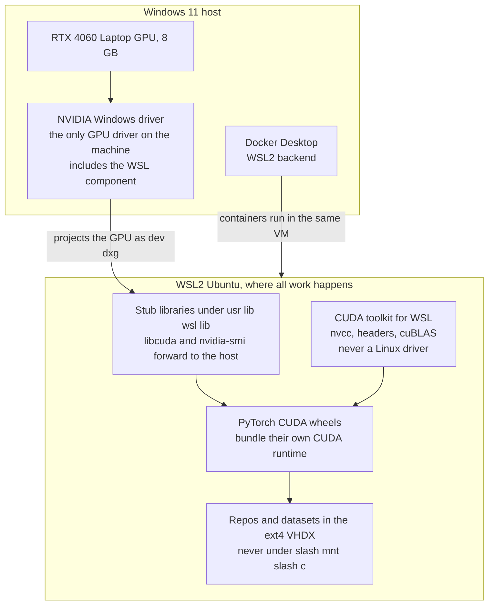
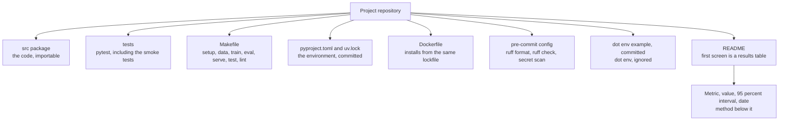
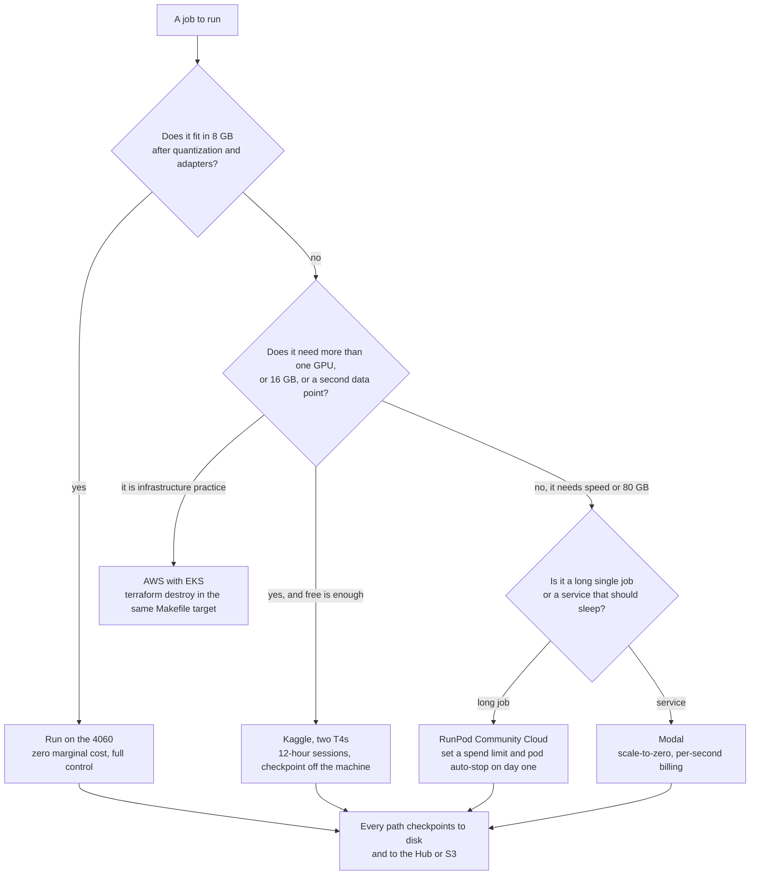
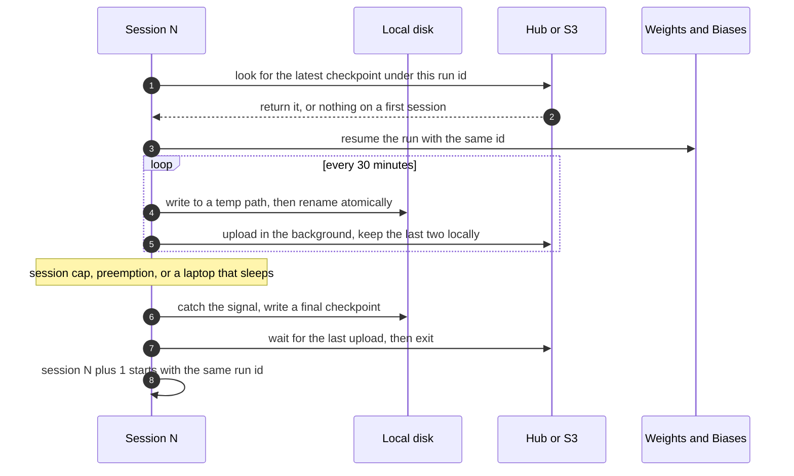

# Chapter 5: The Working Environment

> **What you will be able to do.** Explain how a Windows GPU reaches a Linux process and why installing a Linux driver inside WSL2 breaks it; build every project from a lockfile that reproduces months later, on your laptop and inside a container; choose between the 4060, Kaggle, Modal, RunPod, and AWS for a given job by cost and constraint, and set the spend limits before you need them; keep a laptop GPU from losing twenty percent of its throughput to heat; write a project template whose README's first screen is a results table.
>
> **Where it is used.** P0.1 sets all of this up, and every project after it inherits the template, the secrets discipline, the checkpoint-off-the-machine habit, and the provider choice. Chapter 14 deploys the container this chapter builds, and Chapter 15 replaces its manual steps with continuous integration.
>
> **Prerequisites.** None. Chapter 4 is useful for the sizing that drives the provider choice, but this chapter states the numbers it needs.

## 5.0 The problem this chapter solves

Two failures cost more days than any bug in a model. The first is an environment that cannot be rebuilt: a virtual environment assembled by hand over a month, a CUDA version nobody recorded, and a result that cannot be reproduced when a customer asks for it in March. The second is an environment that quietly runs at half speed: a repository on the Windows drive read through a network protocol, a data loader starved by it, a GPU heat-soaked at hour two, and a benchmark you then publish.

There is a third, more expensive failure. A pod left running over a weekend on a provider that bills by the second is a line in the spend ledger that buys nothing. Every provider in this chapter has a specific way of surprising you, and every one of them can be defused in the first ten minutes of using it.

This chapter builds the workshop once. It covers the stack from the Windows NVIDIA driver to a rented A100, the template every repository in the roadmap starts from, the secrets rules, the provider table, and the thermal reality of training on a laptop. Read it once before P0.1 and return to section 5.8 whenever a job does not fit on the 4060.

## 5.1 WSL2 and how the GPU gets into it

Windows Subsystem for Linux version 2 runs a real Linux kernel in a lightweight virtual machine managed by Hyper-V. It is not an emulation layer: system calls are handled by an actual kernel, so anything that works on Ubuntu works here, which is the point. The ecosystem you need (bitsandbytes, Unsloth, flash-attn, vLLM, the llama.cpp build tooling, the NVIDIA container toolkit) is Linux-first, and the Windows builds either do not exist or lag by months.

The GPU reaches that VM through a paravirtualization path. The NVIDIA driver you install on **Windows** includes a WSL-aware component that projects the physical GPU into the Linux guest as `/dev/dxg`, and the guest gets a set of stub libraries under `/usr/lib/wsl/lib` (`libcuda.so`, `libnvidia-ml.so`, and the `nvidia-smi` binary) that forward to the host driver. Inside Ubuntu you install only the CUDA **toolkit**: the compiler, headers, and libraries. You never install a Linux display driver.



*Figure 5.1: the only driver is on Windows; everything inside Ubuntu is libraries, and the one-line rule is that `apt install nvidia-driver-...` inside WSL breaks the passthrough.*

Two consequences follow. First, when the GPU is invisible inside Ubuntu, the cause is almost always the Windows driver (out of date, or the discrete GPU asleep under hybrid graphics) or a Linux driver installed by mistake. Reinstall the Windows driver and remove any `nvidia-driver` package from the distro before debugging anything else. Second, PyTorch's CUDA wheels bundle the CUDA runtime libraries they need, so the toolkit inside Ubuntu matters only when you compile a custom kernel, build llama.cpp, or install a package that compiles against CUDA headers. Keep the toolkit's major version aligned with the wheel's (a `cu12x` wheel with a 12.x toolkit) and do not chase exact matches.

Check the passthrough with two commands, in this order.

```bash
nvidia-smi
```

```bash
python -c "import torch; print(torch.cuda.is_available(), torch.cuda.get_device_capability())"
```

The first must list the RTX 4060 Laptop GPU with about 8,188 MiB. The second must print `True (8, 9)`. Compute capability 8.9 is Ada, which means bf16 and FP8 tensor cores, FlashAttention-2 kernels, and no need for the fp16 loss scaler of Chapter 3.

**The install order, which matters.** Update Windows and the NVIDIA Windows driver first, through the vendor's utility or the NVIDIA app. Confirm the discrete GPU is awake in Device Manager; on a hybrid-graphics laptop a dGPU in an unknown state is a common cause of the failure below. Then, inside Ubuntu, add NVIDIA's WSL-specific CUDA repository and install the toolkit package meant for WSL, not the generic Linux one. Then install `uv`, Python 3.11, and PyTorch from the CUDA wheel index. Then Docker Desktop's WSL2 backend and the container check. Doing these out of order mostly works and occasionally produces an hour of confusion, because a PyTorch wheel installed before the toolkit will still import and will still find the stub `libcuda`, so the failure surfaces later at the first custom kernel build.

**Resource limits.** WSL2 takes a fraction of host RAM by default and returns it lazily, which on a 32 GB laptop can leave Windows short during a long training run. Control it with a `.wslconfig` file in your Windows user profile, setting `memory`, `processors`, and `swap`. On this machine, 24 GB to the VM and 8 GB left to Windows is a reasonable split; the exact keys and the automatic memory reclaim behavior are version-dependent, so check the documentation for your WSL version.

## 5.2 Filesystems across the boundary

WSL2 stores the Linux filesystem in a virtual disk image and mounts it as ext4. Access to it is native speed. Windows drives are mounted under `/mnt/c` and reached through a network file protocol across the VM boundary, which costs a large constant per operation. The effect is not a few percent: a `git status` on a large repository, a tokenizer build over thousands of files, or a data loader opening many small files can be ten times slower or worse on `/mnt/c` than in the home directory.

The rule, which the project CLAUDE.md also states: **repositories, datasets, model caches, and the Hugging Face cache live inside the Linux home directory.** Treat the Windows drive as a place to export a finished artifact. Connect your editor into WSL rather than opening files across the boundary.

Two follow-on decisions. First, decide where the Hugging Face cache lives (`HF_HOME`) and put it on the filesystem with the most space; every downloaded revision is kept, a 7B model in 16-bit is about 14 GB, and the cache reaches tens of gigabytes within a phase. Prune it monthly. Second, the WSL virtual disk grows and does not shrink on its own when files are deleted; if the disk fills, compacting it is a manual operation on the Windows side, and newer WSL versions offer a sparse-disk mode that reclaims space automatically. Check your version before assuming either behavior.

## 5.3 Python environments with uv

`uv` handles Python versions, virtual environments, dependency resolution, and lockfiles in one tool. The workflow per project is four verbs: install a Python version, initialize a project, add dependencies, and sync from the lock.

```bash
uv python install 3.11
```

```bash
uv sync --frozen
```

The second command is the one that matters. `uv sync --frozen` builds the environment from `uv.lock` exactly and fails rather than re-resolving, which is the behavior you want in continuous integration, in the Dockerfile, and on a rented machine. `uv lock` updates the lockfile deliberately, `uv add` adds a dependency and updates it, and `uv run` executes inside the environment without activating it.

**Python 3.11** is the version for this roadmap: the whole training and serving ecosystem supports it, and the newest releases of TRL, vLLM, and Unsloth are available for it. Pin it in `pyproject.toml` with `requires-python` so that a machine with a different default does not silently build a different environment.

**PyTorch CUDA wheels** come from an index other than PyPI, and the way uv expresses that in `pyproject.toml` (an `[[tool.uv.index]]` entry plus a `[tool.uv.sources]` mapping for the `torch` package) has changed across uv releases. Write it once, commit the lockfile, and check the syntax against the uv documentation for your installed version rather than copying an older example.

**Workspaces** let several packages share one lockfile: a `[tool.uv.workspace]` members list in the root `pyproject.toml`. Use it when a project has a library and a service that must not drift apart, such as the `evalkit` library of P1.6 being consumed by a later project. Do not use it to join unrelated projects; each project in this roadmap is its own repository with its own lock.

**Why not conda here.** Conda solves a problem you do not have: non-Python system libraries that are not on PyPI. PyTorch's wheels bundle their CUDA runtime, and every other dependency in this roadmap is a wheel. What conda adds is a second resolver, a second set of channels, and the classic failure of mixing `conda install` and `pip install` in one environment until the ABI breaks. Aman has Anaconda installed from earlier coursework; leave it alone and never mix the two in one project.

## 5.4 Docker with the WSL2 backend

A Dockerfile is the most honest description of what a project needs, because it starts from nothing. Every project in the roadmap ships one, the serving projects in Phase 2 deploy from it, and the rule that makes it useful is that the container installs from the same lockfile the laptop uses. If the image resolves its own dependencies, it is a different environment wearing the same name.

Docker Desktop with the WSL2 backend runs the Docker daemon inside the same Linux VM, so containers share the filesystem and the GPU passthrough. GPU access uses the NVIDIA Container Toolkit, which injects the host driver's libraries and devices into the container; recent Docker Desktop versions bundle the integration, and a plain Docker Engine installed inside the distro needs the toolkit package installed explicitly. Verify with one command.

```bash
docker run --rm --gpus all nvidia/cuda:12.4.1-base-ubuntu22.04 nvidia-smi
```

That must print the same GPU listing as the host. Pin the base image to an exact tag, never `latest`: a base that moves under you is a reproducibility hole and a security one (Chapter 15, section 15.9).

Two practices carry through to Phase 2. Build the image in stages, with a builder stage that resolves and installs dependencies and a slim runtime stage that copies the environment, which keeps the shipped image small and free of compilers. And keep model weights **out** of the image: they are gigabytes, they change on a different schedule than the code, and they belong on a volume or a registry pull at startup.

## 5.5 Local inference: Ollama and llama.cpp

Two local runtimes matter on the 4060, and they share a lineage: Ollama wraps a llama.cpp-derived engine and the GGUF weight format with a model registry and an HTTP API.

**Ollama** is the fast path for using a model. `ollama pull` fetches a quantized GGUF, `ollama run` chats with it, and an OpenAI-compatible HTTP endpoint makes it a drop-in for a gateway (Chapter 16). The number to check is whether the model is on the GPU: `ollama ps` reports the split, and a 7B at Q4_K_M is about 4.4 GB and should show 100 percent GPU on an 8 GB card. Falling back to the CPU is the difference between 30-plus tokens per second and 3, and the usual causes are a model too large for the free VRAM, another process holding memory, or a context length set high enough that the KV cache no longer fits (Chapter 4, section 4.5).

**llama.cpp** is the layer underneath, and you want it directly for three jobs: converting a Hugging Face checkpoint to GGUF, quantizing to a specific k-quant level, and benchmarking with control over every flag (P2.1). Build it with CUDA support enabled; the CMake flag name changed at least once in the project's history, so read the repository's build instructions rather than copying a command from a blog. The tools you will use are the conversion script, the quantizer, and the server.

**Modelfiles** are Ollama's way of packaging a model with a system prompt, a chat template, and default sampling parameters under a name. Two uses in this roadmap: publishing a fine-tune you converted to GGUF so that it runs with one command (P1.2's export step), and pinning the exact template so that the model sees at inference what it saw in training, which is the contract Chapter 1, section 1.8 describes and the most common silent quality bug in a local deployment.

| Job | Runtime | Why |
|---|---|---|
| Prove the GPU works and demo a 7B locally | Ollama | One command, GGUF from a registry, an OpenAI-compatible endpoint |
| Convert a fine-tuned checkpoint to GGUF and quantize it | llama.cpp | The conversion script and the quantizer are the tools; Ollama consumes the output |
| Benchmark the Q2 to Q8 ladder with controlled flags | llama.cpp | You need every flag reproducible and recorded (P2.1) |
| Serve concurrent users with continuous batching | vLLM | PagedAttention and continuous batching; Chapter 13 |
| CPU-only inference on a customer laptop | llama.cpp | The only one of the three designed for it |

The practical division: Ollama for demos, for the P0.1 definition of done, and for anything where convenience wins; llama.cpp for the quantization lab, where you need the exact format ladder and reproducible benchmark flags; vLLM (Chapter 13) for anything serving concurrent users.

## 5.6 The project template

Every repository in the roadmap starts from the same skeleton, so that muscle memory transfers and so that a reader of your GitHub profile sees one engineer rather than twelve.



*Figure 5.2: the template; the two opinionated parts are that the Makefile verbs are the same in every project and that the README leads with numbers.*

**Makefile verbs.** `setup`, `data`, `train`, `eval`, `serve`, plus `test` and `lint`. The value is not the automation, which is thin, but the uniformity: six months later you do not need to read a README to run the evaluation of any project in the portfolio.

**Tests.** Three kinds, all fast enough for continuous integration on a CPU: unit tests for the data and metric code, the correctness gates of Chapter 3 (initial loss, overfit one batch, kill and resume) at a two-layer configuration, and a contract test for any external interface. Anything that needs a GPU runs behind a marker and is skipped in CI.

**Pre-commit.** Ruff for formatting and linting, and a secret scanner. Hooks run on commit, not on push, so a secret never enters a commit object in the first place.

**The README's first screen.** A table with the metric, the value, the 95 percent confidence interval, and the date, then the method below it. This is the FDE habit made mechanical: customers and hiring managers read the first screen, and a result without an interval and a date is not a result (Chapter 11).

The anatomy of that first screen, in order: a one-sentence statement of what the project does and for whom; the results table; a one-line statement of what hardware produced the numbers and how long it took; then the method, the reproduction commands, and the limitations. Concretely, the table has a row per claim and four columns, and a baseline row so the number means something:

| Metric | Value | 95 percent interval | Date |
|---|---|---|---|
| Execution accuracy, held-out set, n equals 500 | 0.72 | 0.68 to 0.76 | 2026-10-11 |
| Execution accuracy, base model, same items | 0.54 | 0.50 to 0.58 | 2026-10-11 |
| Paired difference, fine-tuned minus base | plus 0.18 | 0.14 to 0.22 | 2026-10-11 |

Three things make this table honest and most published tables not. The comparison is **paired** on the same items, so the interval on the difference is narrower and correct (Chapter 11, section 11.4). The sample size is stated, so a reader can judge whether the interval is believable. And the date is there, because the evaluation set, the base model, and the judge all change, and a number without a date cannot be reproduced.

Write the limitations section too, and write it before anyone asks. What the evaluation does not cover, which slices are thin, what would change the result. An engineer who states the limits of a number is trusted with the next one.

## 5.7 Secrets

You will accumulate a Hugging Face write token, a W&B key, Langfuse public and secret keys, Anthropic and other model API keys, RunPod and Modal tokens, and eventually cloud credentials. Four rules cover the roadmap.

1. **Secrets live in a `.env` that Git ignores**, and the repository commits a `.env.example` listing the variable names with empty or obviously fake values. The example file is documentation: a reader learns what the project needs without learning your keys.
2. **Never in code, never in a prompt, never in a log.** A key pasted into a prompt reaches the model provider's logs and, if the trace is stored, Langfuse. Redact before storage (Chapter 19, section 19.5).
3. **Scoped and short-lived beats broad and permanent.** A Hugging Face token with write access to one repository, not to the account. A RunPod key that you rotate at the end of a phase.
4. **In continuous integration, no long-lived keys at all.** GitHub Actions federates to a cloud role through OpenID Connect, exchanging a short-lived token scoped to a repository and branch. Chapter 15, section 15.6 builds this; adopt rules one to three today and that one in Phase 2.

One habit that catches the mistake everyone makes once: run the secret scanner as a pre-commit hook **and** in CI. The hook stops the commit on your machine; the CI check catches the case where the hook was skipped.

## 5.8 Compute providers and when to use each

The 4060 does the small-model work. Everything else is a decision about constraint and cost.

| Provider | Good for | The way it surprises people | Price, September 2026, verify |
|---|---|---|---|
| RTX 4060, 8 GB | Everything under about 3B with adapters, all development, all smoke tests | Thermal throttling over hours; 8 GB is a hard wall | Electricity, a few cents per hour |
| Kaggle | Two T4s for free, the only free place to practice multi-GPU training; 16 GB each is where 7B quantization calibration fits | 12-hour session cap; the working directory is wiped between sessions; phone verification needed for GPUs | Free, about 30 GPU hours per week |
| Colab | Convenient notebooks; Pro unlocks L4 and A100 time | Free-tier GPUs vanish under load; idle runtimes disconnect; an A100 burns units about five times faster than a T4 | Pro about $9.99 per month for 100 compute units |
| Modal | Serverless GPUs with scale-to-zero; training triggered from CI; hosting a demo that sleeps | You pay per second while a container is warm; a warm pool left on drains the free credits | $30 of free credits per month on the Starter plan |
| RunPod | The cheapest on-demand A100 and H100 hours; persistent network volumes; reusable templates | Pods bill until you stop them; Community Cloud is about half the price of Secure Cloud and can be reclaimed | A100 80 GB about $1.39 per hour on Community Cloud |
| AWS with EKS | The customer-shaped environment: Kubernetes, IAM, Terraform | The cluster costs money when idle: control plane, NAT gateway, load balancers, and EBS volumes all bill hourly | About $0.60 to $0.70 per cluster hour with a g5.xlarge spot node |
| Hugging Face Hub | Free hosting for models, datasets, and Spaces; revisions give versioning | Repositories over a few gigabytes need Git LFS; private repos count against storage | Free tier |



*Figure 5.3: the provider decision; the branch that matters most is the first, because anything that fits locally costs nothing and iterates fastest.*

**The rule that prevents the expensive mistake.** Set the spend limit and the auto-stop **before** the first job, not after the first surprise. On RunPod, a spend limit and pod auto-stop. On Modal, watch the credit balance and never leave a warm pool configured. On AWS, a budget alarm in the same Terraform module as the cluster, and `terraform destroy` wired into a Makefile target so that tearing down is as easy as standing up (Chapter 15, section 15.11). The roadmap's single largest cost risk is a forgotten instance, and every mitigation for it is a five-minute setup.

### Kaggle and Colab

Kaggle's unit is a **notebook session** attached to an accelerator, either two T4s or one P100, capped at 12 hours, with a weekly GPU quota of about 30 hours that resets on a fixed schedule. Two properties shape how you use it. The working directory is ephemeral, so outputs must be written as a Kaggle dataset or pushed to the Hub before the session ends. And GPU access requires phone verification on the account, which takes minutes and cannot be done at the moment you need it. Kaggle is the only free source of two GPUs, which makes it the right place to learn ranks, all-reduce, distributed samplers, and the difference between DistributedDataParallel and FSDP (Chapter 6) without spending anything.

Colab's unit is the **compute unit**, consumed at a rate that depends on the accelerator, so an A100 drains a monthly allocation roughly five times faster than a T4. Free-tier GPUs are best-effort and disappear under load, and idle runtimes disconnect. Use Colab for a notebook a reader will open, not for a job whose completion you depend on.

### Modal

Modal's unit is a **function**: a Python function decorated with its image, its GPU type, and its timeout, invoked remotely and billed by the second while a container is running. Cold start pulls the image and initializes the GPU, which for a serving function is seconds to tens of seconds; a **warm pool** keeps containers alive to remove that latency and bills for every second they are alive, which is the mechanism that silently drains free credits. **Volumes** provide persistent storage that survives between invocations, which is where model weights and datasets belong so they are not pulled on every cold start.

Modal's fit in this roadmap is exactly the shape of two jobs: a training run triggered by continuous integration, where the container exists only for the duration of the job (Chapter 15, section 15.10), and a demo or remote MCP server that must be reachable but is used a handful of times a week (P4.2, P4.4), where scale-to-zero means it costs nothing between uses.

### RunPod

RunPod's unit is a **pod**: a container on a rented GPU, started from a **template** that names the image, the exposed ports, and the volume mounts. Pods bill from start to stop, including time spent idle at an SSH prompt, which is the single behavior to internalize. **Network volumes** are persistent storage attached to a pod, priced per gigabyte-month and far cheaper than keeping a pod alive; put the dataset and the checkpoints there so a new pod resumes rather than re-downloads. **Community Cloud** rents capacity from independent hosts at roughly half the Secure Cloud price and can be reclaimed, which is acceptable for a job that checkpoints every thirty minutes and unacceptable for one that does not.

The operational sequence that keeps the bill honest: create a network volume once, save a template that mounts it, set an account spend limit and pod auto-stop, start the pod, run the job, confirm the checkpoint is on the volume and on the Hub, stop the pod, and check the dashboard shows it stopped. The last step is on the project CLAUDE.md's list of things to do without asking, and it is there because it is the step people skip.

### EKS basics

Amazon's Elastic Kubernetes Service gives you a managed Kubernetes control plane and node groups of your own instances. Chapter 14 covers the objects and Chapter 15 the Terraform, but the cost model belongs here because it decides how you use it. Four things bill hourly whether or not anything is serving: the managed control plane, the NAT gateway that private subnets use to reach the internet, any load balancer an Ingress creates, and the EBS volumes attached to nodes. Added to a GPU node, that is roughly $0.60 to $0.70 per cluster hour with a `g5.xlarge` spot instance (September 2026; verify), and the fixed part continues after the GPU node scales to zero.

The consequence for the roadmap: EKS sessions are short and deliberate. Stand the cluster up, do the work, capture the evidence, destroy it. `kind` on the laptop covers everything about Kubernetes objects, probes, rolling updates, and Helm that does not require a real cloud, at zero cost, and is where you should spend most of Phase 2's Kubernetes hours.

## 5.9 Thermal and power management on a laptop GPU

The RTX 4060 Laptop GPU is a different part from the desktop card of the same name: a lower power limit, and a cooling system shared with a Core i9-13950HX that is also under load. Over a multi-hour run, the package heat-soaks, clocks drop, and throughput falls. This is not a defect; it is the design point of a laptop, and it changes the numbers you report.

**What to expect.** Sustained throughput on the order of 60 to 80 percent of what a short burst suggests, with the gap opening over the first thirty to sixty minutes of a run. A benchmark taken in the first five minutes and published as a sustained figure is wrong by that margin, which is why Chapter 4's benchmark harness runs after a warmup and why the roadmap asks for a 50-step smoke test at full sequence length and batch before any long job.

**How to detect it.** Query the card once a second in CSV form and keep the series next to the loss.

```bash
nvidia-smi --query-gpu=timestamp,clocks.sm,temperature.gpu,power.draw,utilization.gpu --format=csv -l 1
```

Read the five columns together, because each pathology has a distinct signature.

| Clock | Temperature | Power | Utilization | Reading |
|---|---|---|---|---|
| High and steady | Well below the limit | Below the cap | Above 95 percent | Healthy; the GPU is the bottleneck, as it should be |
| Falling over minutes | Pinned at the limit | At the cap | Above 95 percent | Thermal or power throttling; airflow and a power cap are the levers |
| High and steady | Moderate | Below the cap | Gaps below 60 percent | Data loader or Python overhead, not heat (Chapter 3, section 3.9) |
| Oscillating | Near the limit | Bouncing off the cap | Above 95 percent | Clock instability; a small power cap usually raises the sustained average |

Log the GPU's clock, temperature, and throttle reasons alongside the training metrics. `nvidia-smi` inside WSL reports clocks, temperature, power draw, and a performance-state field, and it can be queried in a loop in CSV form for a plot. The signature of throttling is clocks falling while temperature sits flat at the limit and power draw sits at the cap; the signature of a data-loader problem, which looks similar in tokens per second, is clocks staying high with utilization gaps (Chapter 3, section 3.9). Distinguishing the two from the loss curve alone is impossible, which is why both series get logged.

**What to do about it.** Airflow first: a hard surface, clear vents, and a cooling pad if you have one. Then consider capping the GPU power limit slightly below maximum. This sounds backwards and usually is not: a cap that removes the highest, least efficient part of the voltage-frequency curve often gives nearly the same sustained throughput with a lower temperature, less fan noise, and fewer throttle events, because the card spends its time at a steady clock instead of oscillating. Measure both configurations over thirty minutes and keep the one with the higher sustained tokens per second. Note that on many laptop parts the power limit is managed by the vendor's firmware and may not be settable from `nvidia-smi`; if it refuses, the levers are airflow and the vendor's own performance profile.

**The reporting consequence.** Any throughput number from the laptop gets a duration attached: "21,000 tokens per second sustained over a 30-minute window at batch 4, sequence 1,024, RTX 4060 Laptop GPU" is a claim you can defend. "21,000 tokens per second" is not.

## 5.10 Checkpointing off the machine

Chapter 3, section 3.8 specified what a checkpoint contains. This section is about where it goes, and the rule is that **a checkpoint that exists only on the machine running the job does not exist**. Kaggle wipes the working directory between sessions. A RunPod Community Cloud pod can be reclaimed. A laptop sleeps. An overnight run that produced nothing because the process died at hour three and the only checkpoint was in `/tmp` is a lost day.

Two destinations.

**The Hugging Face Hub** for models and adapters. A repository per project, private until you decide otherwise, with each checkpoint pushed as a revision so the history is a real history. The upload is incremental per file, so pushing every thirty minutes costs seconds for an adapter and minutes for a full model. Push the config and the metrics with the weights; a checkpoint without the hyperparameters that produced it is an artifact you cannot explain.

**Object storage (S3 or a provider volume)** for the things the Hub is wrong for: optimizer states, which are large and of no interest to anyone else, and intermediate data shards. RunPod network volumes persist across pods and are the cheapest way to keep a dataset near the GPU between sessions.

The operational pattern is the same in both cases: write locally with the atomic rename of Chapter 3, Listing 3.4, then upload in the background, then delete all but the last two local copies plus the best. Do not make the training loop wait on the network.

**Resume must be the default path, not a flag.** A script whose entry point checks for a checkpoint and continues from it, and starts fresh only when there is none, is a script that survives a 12-hour session cap without a human awake. This is the single habit that makes Kaggle and Community Cloud usable.



*Figure 5.4: one run spread across several sessions; the run id is what makes the checkpoints, the uploads, and the W&B curve refer to the same thing.*

## 5.11 Observability accounts: W&B and Langfuse

Two services, two different jobs, both set up in Phase 0 because retrofitting them is worse.

**Weights and Biases** tracks training runs. The model is: a **project** holds **runs**; a run has a **config** (every hyperparameter, logged once at the start), a stream of **metrics** logged against a step, **system metrics** collected automatically (GPU utilization, memory, temperature, power), and optionally **artifacts** (datasets, checkpoints) with lineage between them. Three practices. Log the config as a flat dictionary so that runs are comparable and filterable. Log metrics every N steps rather than every step; at high throughput, logging every step costs real time and adds nothing. And use `WANDB_MODE=offline` on a machine without reliable network, syncing the run directory afterward, which is the Kaggle and pod pattern.

**Langfuse** traces LLM application behavior, not training. Its model is: a **trace** is one request; it contains **observations**, which are spans or **generations** (a model call with its inputs, outputs, token counts, and cost); traces carry **scores** (from a judge, a user, or a heuristic), **tags**, and **sessions** grouping multi-turn conversations. It uses a public key and a secret key, and it is the substrate for the flywheel of Chapter 17 and the evaluation platform of Chapter 18. Create the account in Phase 0 and wire it in Phase 2; what matters now is understanding the vocabulary, because the curation and gating designs later assume it.

**What to name things, decided once.** One W&B project per roadmap project, named to match the repository (`fde-01-pretrain`, `fde-02-sft`), so that the dashboard and the GitHub profile tell the same story. Run names that encode the variables you vary and nothing else: model size, token count, and seed, not a timestamp. A stable run id per logical run, so a killed and resumed run is one curve. Tags for the things you will filter by later: the machine (`4060`, `t4x2`, `a100`), the precision, and the phase. Five minutes of naming discipline in Phase 0 is what makes a Phase 3 comparison across fifteen runs possible at all.

**What to log beyond the loss.** The five per-step series of Chapter 3, section 3.10, plus the three hardware series of section 5.9, plus the dataset revision and the git commit as config fields. The last two are what let you answer "which data produced this checkpoint" six weeks later, and they cost one line each.

Both services have free tiers sufficient for this roadmap. Both are also places where a secret can leak: W&B stores the config you hand it, so never put a key in the config, and Langfuse stores request inputs and outputs, so redact before they are stored (Chapter 19, section 19.5).

## 5.12 The roadmap log habit

`ROADMAP_LOG.md` carries the status board, milestones, decisions, the cloud spend ledger, and one entry per week. The habit is small and the payoff compounds.

Write the entry even when it is unflattering. "Installed CUDA, fought the driver for an hour, fixed by reinstalling the Windows driver" is the entry that saves the hour the second time. Record every result with its confidence interval and date, in the format the log specifies, and every paid session as a line in the spend ledger with the running total. Update the status board on Fridays: hours this week and cumulative, spend this week and cumulative, last public artifact, next milestone.

The structure the log carries, and why each part is there. A **status board**, updated Fridays, so that one table answers "where is this" without reading eleven entries. **Milestones**, so that a week's work can be checked against the plan rather than against how it felt. A **decision log** with the reason, so that a choice made in Week 3 under constraints you have since forgotten can be re-examined rather than re-litigated; the roadmap schedules one such decision, the track choice, for the end of Week 6. A **cloud spend ledger** with a running total, one line per paid session, because a total you recompute weekly is a total you notice. And one **entry per week** with goals, results with intervals and dates, GPU hours and cost, and blockers.

One rule about editing it: never overwrite a past week's entry after the following Monday. Add a dated correction line instead. A log you rewrite is a log you cannot trust, and its whole value is that it is a record rather than a summary.

Three uses. The log is the evidence when you update a resume or write a talk. It is the raw material for the write-ups that make the portfolio legible. And it is the fastest way to notice that a project is running over its hour budget while there is still time to trim, which is a decision the roadmap schedules at the end of Week 6.

## 5.13 Implementation notes

Four listings: the Makefile, the training image, the W&B pattern, and the checkpoint uploader.

**Listing 5.1: the Makefile skeleton every project starts from.**

```makefile
.PHONY: setup data train eval serve test lint clean
UV ?= uv

setup:                       ## build the environment from the lockfile, no re-resolution
	$(UV) sync --frozen
	$(UV) run pre-commit install

data:                        ## download and shard; idempotent, safe to re-run
	$(UV) run python -m src.data.prepare --out data/shards

train:                       ## resumes automatically if a checkpoint exists
	$(UV) run python -m src.train --config configs/base.yaml --resume auto

eval:                        ## writes results.json with metrics and bootstrap intervals
	$(UV) run python -m src.eval --checkpoint runs/latest --out results.json

serve:
	$(UV) run python -m src.serve --checkpoint runs/latest --port 8000

test:
	$(UV) run pytest -q -m "not gpu"

lint:
	$(UV) run ruff check . && $(UV) run ruff format --check .
```

The verbs are identical across projects, which is the whole point. `setup` uses `--frozen` so that a stale lockfile fails loudly instead of silently producing a different environment. `data` is idempotent, because you will re-run it after a failed shard. `train` defaults to resuming, which is section 5.10's rule expressed in the interface. `test` excludes the `gpu` marker so the same target runs in continuous integration on a CPU runner. Recipe lines are tab-indented, which is a Makefile requirement and the most common reason a copied skeleton does not run.

**Listing 5.2: a two-stage Dockerfile for a GPU training image.**

```dockerfile
FROM nvidia/cuda:12.4.1-cudnn-devel-ubuntu22.04 AS builder
ENV UV_LINK_MODE=copy UV_PYTHON_INSTALL_DIR=/opt/python
COPY --from=ghcr.io/astral-sh/uv:0.5.11 /uv /usr/local/bin/uv
WORKDIR /app
COPY pyproject.toml uv.lock ./
RUN uv sync --frozen --no-dev --no-install-project

FROM nvidia/cuda:12.4.1-cudnn-runtime-ubuntu22.04
ENV PATH="/app/.venv/bin:$PATH" PYTHONUNBUFFERED=1 HF_HOME=/cache/hf
RUN useradd -m -u 1000 runner && mkdir -p /cache/hf && chown -R runner /cache
COPY --from=builder /opt/python /opt/python
COPY --from=builder /app/.venv /app/.venv
WORKDIR /app
COPY --chown=runner src/ ./src/
USER runner
ENTRYPOINT ["python", "-m", "src.train"]
```

The builder stage installs from the lockfile against a `devel` base that has the compilers some packages need; the runtime stage starts from the smaller `runtime` base and copies only the virtual environment and the source, so no compiler ships to production. `--no-install-project` installs the dependencies without the project itself, so a code change does not invalidate the dependency layer and rebuilds stay fast. Both base tags are pinned exactly, as is the uv image; `latest` anywhere in this file is a reproducibility hole. `HF_HOME` points at a directory intended to be a mounted volume, so weights are not baked into the image. The container runs as a non-root user, which Chapter 14 requires and which costs nothing to do from the start. Base image and uv versions are examples: use the current ones and pin whatever you choose.

**Listing 5.3: the minimal Weights and Biases pattern.**

```python
run = wandb.init(
    project="fde-01-pretrain",
    name=f"{cfg.model_size}-{cfg.tokens}-seed{cfg.seed}",
    config=dataclasses.asdict(cfg),      # every hyperparameter, flat, logged once
    resume="allow", id=cfg.run_id,        # same id after a kill: one continuous run
)
wandb.define_metric("train/loss", step_metric="step", summary="min")

for step in range(start_step, total_steps):
    metrics = train_step()                # loss, lr, grad_norm, tokens_per_s, peak_gb
    if step % cfg.log_every == 0:         # not every step: logging is not free
        wandb.log({f"train/{k}": v for k, v in metrics.items()} | {"step": step})
    if step % cfg.eval_every == 0:
        wandb.log({"val/loss": validate(), "step": step})
run.finish()
```

`config` is the flat hyperparameter dictionary, which is what makes runs sortable and comparable in the interface; a nested config is far less useful six weeks later. `resume="allow"` with a stable `id` means a killed and resumed run appears as one curve rather than two, which is what you want when the resume test of Chapter 3 says there is no seam. `define_metric` with `summary="min"` makes the run table show the best loss rather than the last. Logging every `log_every` steps rather than every step matters at high throughput: a synchronous log call per step can cost several percent of wall clock. On a machine without reliable network, set the environment variable for offline mode and sync the run directory afterward.

**Listing 5.4: checkpoint locally, then push, without blocking the loop.**

```python
def checkpoint_and_push(state, step, local_dir, repo_id, keep=2, pool=None):
    path = local_dir / f"ckpt-{step:07d}.pt"
    torch.save(state, path.with_suffix(".tmp"))
    os.replace(path.with_suffix(".tmp"), path)          # atomic; see Chapter 3, Listing 3.4
    def _push():
        HfApi().upload_file(path_or_fileobj=str(path), path_in_repo=path.name,
                            repo_id=repo_id, commit_message=f"step {step}")
    pool.submit(_push)                                   # a single-worker ThreadPoolExecutor
    old = sorted(local_dir.glob("ckpt-*.pt"))[:-keep]
    for p in old:
        p.unlink()
```

The local write is atomic and synchronous, because it is the copy that must exist. The upload runs on a background thread from a single-worker pool, so uploads serialize and the training loop never waits on the network; a failed upload leaves the local copy intact, which is why the local write comes first. Pruning keeps the last `keep` checkpoints, and a real implementation also keeps the best by validation loss, which this sketch omits. The Hugging Face API signature is that of the `huggingface_hub` package; check the argument names for your installed version. For object storage, replace the `_push` body with an S3 client call and nothing else changes.

## 5.14 Failure modes

| Symptom | Likely cause | How to confirm | Fix |
|---|---|---|---|
| `nvidia-smi` works on Windows, fails inside Ubuntu | A Linux GPU driver was installed inside WSL, or the Windows driver is old | Check for `nvidia-driver` packages in the distro; check the Windows driver date | Remove the Linux driver packages; reinstall the current Windows driver |
| `torch.cuda.is_available()` is False with a working `nvidia-smi` | A CPU-only PyTorch wheel was installed | Print `torch.version.cuda`; `None` means CPU-only | Reinstall from the CUDA wheel index and re-lock |
| Everything is slow: git, tokenizing, the data loader | The repository lives under `/mnt/c` | `pwd` starts with `/mnt/` | Move the repository into the Linux home directory |
| Docker cannot see the GPU | WSL2 backend off, or the NVIDIA container toolkit missing on a plain Docker Engine | The `--gpus all` test container fails | Enable the WSL2 backend, or install the container toolkit |
| bitsandbytes or Unsloth fails on import | CUDA version mismatch between the wheel and the compiled extension | The error names a missing CUDA symbol or library | Follow the package's compatibility matrix and pin both |
| Windows becomes unusable during training | WSL2 has taken most of the host RAM | Task Manager shows the VM process holding 28 GB | Set a `memory` cap in `.wslconfig` and restart WSL |
| The environment cannot be rebuilt on another machine | Packages installed ad hoc; the lockfile is stale | `uv sync --frozen` fails or produces different versions | Re-lock deliberately, commit, and always install with `--frozen` |
| Throughput drops 20 percent over two hours | Thermal throttling | Clocks fall while temperature is pinned and power is at the cap | Airflow, a cooling pad, possibly a small power cap; report sustained numbers |
| Throughput is low from the start with cool clocks | Data loader, not thermals | Utilization has gaps; clocks are high | Chapter 3, section 3.9 |
| A Kaggle run produced nothing after 12 hours | Checkpoints written only to the wiped working directory | The output is empty after the session ends | Push to the Hub or save as a Kaggle dataset; make resume the default path |
| A RunPod bill for a day nobody worked | A pod left running | The pod's uptime exceeds the job's | Spend limit and auto-stop on day one; check after every job |
| A secret appears in a public repository | No pre-commit scanner, or the hook was skipped | The scanner flags it in CI, or a provider emails you | Rotate the key immediately, then add the hook and the CI check |
| A result cannot be reproduced for a customer | The run's config and data version were not recorded | The W&B run has metrics but no config | Log the full config and the dataset revision with every run |

## 5.15 On your machine

**The MSI Raider GE68 HX 13V, concretely.** Core i9-13950HX with 24 cores, 32 GB of RAM, an RTX 4060 Laptop GPU with 8 GB, Windows 11 with WSL2 Ubuntu, Docker Desktop, `kubectl`, Ollama, and `uv` already installed. What P0.1 adds in its three-hour budget is the CUDA toolkit inside WSL, the PyTorch check, the accounts with their spend limits, and the template.

**The numbers that constrain you.** 8 GB of VRAM, of which about 6.5 GiB is usable after the CUDA context and a sensible fragmentation margin (Chapter 4, section 4.14). 32 GB of system RAM, shared with Windows, so cap the WSL VM near 24 GB and run four data-loader workers rather than eight. A GPU that sustains roughly 60 to 80 percent of a short burst's throughput over hours. A CPU that shares the cooling system with the GPU, so a heavy tokenization job during training slows both.

**The five checks that close P0.1.** `nvidia-smi` inside WSL lists the 4060 with about 8,188 MiB. PyTorch reports CUDA available and compute capability (8, 9). A CUDA container run with `--gpus all` prints the same GPU. A Kaggle notebook shows two T4s. Ollama answers with a 7B coder model at 30 or more tokens per second, which Chapter 4, section 4.10 shows is the bandwidth bound for a 4-bit 7B on this card and therefore proof that the model is on the GPU rather than the CPU.

**Where each project runs.** P0.2 and P1.2 on the 4060. P1.1's baseline on the 4060 overnight, its multi-GPU run on Kaggle's two T4s, and optionally one A100 hour on RunPod for the datacenter comparison. P1.3's GRPO at 0.5B locally and at 1.5B on a rented A100. P2.1 quantizes 1.5B and 3B locally and sends the 7B calibration to Kaggle, because it loads 16-bit weights. P2.2 learns the vLLM flags locally where mistakes are free, then benchmarks on an A100 because that is what a customer would buy. Phase 3 and Phase 4 are mostly API and infrastructure work with Modal's free credits and short AWS sessions.

**The first ten minutes of every provider.** RunPod: spend limit, pod auto-stop, and a network volume. Modal: check the credit balance and confirm no warm pool. Kaggle: phone verification and a notebook that checkpoints to the Hub. AWS: a budget alarm in the Terraform module and `terraform destroy` in a Makefile target. Hugging Face: a token scoped to write, and a decision about where `HF_HOME` lives. Weights and Biases: a project per roadmap project, named to match the repository.

## Exercises

### Exercise 5.1: why no Linux driver

Explain, in terms of the mechanism rather than the instruction, why installing an NVIDIA Linux display driver inside WSL2 Ubuntu breaks GPU access, and what the guest is actually loading when `torch.cuda.is_available()` returns True.

<details><summary>Solution</summary>

The physical GPU is owned by the Windows kernel driver. WSL2 does not give the Linux guest direct hardware access; the Windows driver projects a paravirtual device into the guest, exposed as `/dev/dxg`, and the guest is supplied with stub libraries (a `libcuda.so`, a management library, and an `nvidia-smi` binary under `/usr/lib/wsl/lib`) that marshal calls across that boundary to the host driver. When PyTorch reports CUDA is available, it has loaded those stubs, not a native driver. Installing a Linux display driver places a real `libcuda.so` and kernel modules in the guest, and those either shadow the stubs on the library search path or fail to bind to hardware they cannot see, because the hardware is not present in the VM. The result is a `libcuda` that cannot initialize. The correct guest installation is libraries only: the CUDA toolkit for WSL, which ships headers, `nvcc`, and math libraries and deliberately excludes the driver.

</details>

### Exercise 5.2: where the repository lives

A tokenizer build over 40,000 small files takes 3 minutes in the Linux home directory and 28 minutes from `/mnt/c`. Explain the mechanism, and name two other operations in this roadmap that would show the same ratio.

<details><summary>Solution</summary>

The Linux home directory is ext4 inside a virtual disk attached to the VM, so file operations are handled by the guest kernel at native speed. `/mnt/c` is a Windows drive reached over a file-sharing protocol across the VM boundary, so every open, stat, read, and close is a round trip with a fixed cost measured in tens of microseconds or more. Workloads dominated by per-file overhead, rather than by bytes transferred, pay that cost 40,000 times. Two others with the same profile: Git operations on a repository with many files, where `git status` stats every path; and a data loader that opens individual example files per batch, which is exactly the loader-starvation case of Chapter 3, section 3.9. Note the corollary: a single large sequential read, such as streaming one 4 GB shard, is far less affected, because the per-operation cost is amortized. The rule is still to keep everything in the Linux filesystem, because the exceptions are hard to predict.

</details>

### Exercise 5.3: choose a provider for four jobs

For each, name the provider and one sentence of justification. (a) A 50-step smoke test of a new QLoRA configuration for a 7B model. (b) A DistributedDataParallel run to see multi-GPU training work, on a 120M model. (c) A vLLM benchmark whose numbers will go in a customer-facing write-up. (d) A Streamlit demo that a customer will open twice next week.

<details><summary>Solution</summary>

(a) The 4060. It is a smoke test, it fits in 8 GB with a paged 8-bit optimizer at sequence 1,024, and the whole point is a fast iteration loop at zero marginal cost; confirming it locally before renting is the discipline that keeps the bill small. (b) Kaggle's two T4s. It is free, it is the only free place to get two GPUs, and a 120M model fits easily in 16 GB, so the exercise is about the mechanics of ranks, all-reduce, and distributed samplers rather than about capacity. (c) A rented A100 80 GB on RunPod Community Cloud. The number must be defensible, and a benchmark from an 8 GB laptop part answers a question no customer asked; run it on the hardware a customer would buy, and note the exact GPU, engine version, and load pattern in the write-up. (d) Modal, or a Hugging Face Space. The load is two requests next week, so scale-to-zero means the cost is near zero between them, whereas a RunPod pod would bill for the entire week to serve two requests.

</details>

### Exercise 5.4: lockfile discipline

Your Dockerfile runs `uv sync` rather than `uv sync --frozen`, and the image built in March produces different numbers from the one built in January, with no code change. Explain what happened and give the two-line fix.

<details><summary>Solution</summary>

Without `--frozen`, uv is permitted to re-resolve the dependency graph rather than install exactly what `uv.lock` records. Any dependency whose constraint is a range will pick up a newer release published between January and March, and in this ecosystem a minor version of `transformers`, `trl`, or `torch` can change a default (a generation parameter, a tokenizer behavior, a kernel selection) enough to move a benchmark. The environment is therefore not the same environment, even though the code and the Dockerfile are byte-identical. The fix is two lines: `uv sync --frozen` in the Dockerfile and in the Makefile's `setup` target, so that an out-of-date lockfile fails the build loudly instead of silently producing a different environment; and a pinned base image tag, since the same argument applies to the operating system and CUDA libraries underneath. Deliberate upgrades then happen through `uv lock`, in a commit, reviewed like any other change.

</details>

### Exercise 5.5: detect throttling versus a starved loader

Both problems show tokens per second falling below the estimate. Design the measurement that distinguishes them, naming the exact series to collect and the signature of each.

<details><summary>Solution</summary>

Collect four series at one-second resolution for ten minutes of steady-state training: GPU utilization percentage, graphics clock in MHz, temperature in degrees, and power draw in watts, from `nvidia-smi` in CSV query mode, plus tokens per second from the training loop. Thermal throttling: utilization stays high and continuous, temperature rises to a ceiling and stays flat, power sits at the cap, and the clock falls, dragging tokens per second with it. The fall is gradual over tens of minutes and recovers if you pause the run and let the machine cool, which is the confirming experiment. Starved loader: the clock stays high, temperature is well below the ceiling, and utilization shows regular gaps as the GPU waits for data; tokens per second is low from the first step and does not change with temperature. The decisive test for the second case is the substitution from Chapter 3, section 3.9: replace the loader with one cached batch on the GPU and re-time, which changes nothing under throttling and collapses the step time under starvation.

</details>

### Exercise 5.6: design the resume-by-default entry point

Kaggle sessions end at 12 hours and wipe the working directory. Write, in prose, the entry-point logic for a training script that survives this without a human awake, and name what it must do at start, during, and at the end of a session.

<details><summary>Solution</summary>

At start: read a stable run identifier from the config, not from a timestamp. Look for the latest checkpoint, first in the local working directory and then in the remote repository, downloading it if only the remote copy exists. If one is found, load model, optimizer, scheduler step, scaler, data position, and RNG states, and resume the W&B run with the same identifier so the curve is continuous. If none is found, initialize fresh and run the three correctness checks of Chapter 3 first. During: checkpoint on a wall-clock interval, not only a step interval, so the interval is predictable regardless of throughput; write locally with an atomic rename, upload in the background, and keep the last two plus the best. Log the step and the elapsed session time so the next session knows where it stopped. At the end, or on a signal: catch the termination signal, write a final checkpoint, wait for the upload to complete, and exit cleanly. Chain the sessions by launching the same script again with the same run identifier, which is why the identifier must be stable and the resume path must be the default rather than a flag someone remembers to pass.

</details>

### Exercise 5.7: what belongs in `.env.example`

List what a `.env.example` should contain for a project that fine-tunes on the 4060, pushes to the Hugging Face Hub, logs to W&B, and calls a frontier API for a judge. State what must never appear in it.

<details><summary>Solution</summary>

Variable names with empty or obviously fake values, plus a comment per line saying what it is for and where to get it: the Hub write token, the Hub repository identifier (a real default is fine, it is not a secret), the W&B API key and the project name, the judge API key, `HF_HOME` pointing at a cache directory, and any non-secret configuration the code reads from the environment such as a device index or an output directory. What must never appear: any real key, any token fragment, any internal hostname or account identifier, and any customer name. The file is committed and therefore public if the repository is; treat it as documentation. Two additions that pay for themselves: a comment naming the scope each token needs, so a reader creates a write-scoped Hub token rather than an account-wide one; and a startup assertion in the code that every required variable is set, which turns a confusing failure at hour two into a clear one at second one.

</details>

### Exercise 5.8: budget a phase

Phase 1 needs: one optional A100 hour for a pretraining comparison, four A100 hours for GRPO at 1.5B, and roughly $40 of frontier API calls for synthetic data and judging. Compute the GPU cost at the September 2026 Community Cloud rate, the total, and name the single largest risk to the estimate.

<details><summary>Solution</summary>

Five A100 hours at $1.39 per hour (RunPod Community Cloud, September 2026; verify) is $6.95. With $40 of API calls the phase is about $47. The largest risk is not any line in that estimate: it is a pod left running. A forgotten A100 costs $1.39 per hour, so a single weekend, 60 hours, is $83, nearly twice the entire planned phase. Every other variance is small by comparison: a re-run doubles four hours to eight and adds $5.56, and API spend is bounded by prompt caching and the Batch API. The mitigations are therefore all aimed at the same thing: a spend limit on the account, pod auto-stop configured before the first job, and a habit of checking that the pod is stopped as the last step of every session, which the project CLAUDE.md lists among the things to do without asking.

</details>

### Exercise 5.9: the container that behaves differently from the laptop

A training script produces a loss of 2.31 at step 500 on the laptop and 2.47 in the container, from the same commit and the same seed. List the four most likely causes in order, and the check that distinguishes each.

<details><summary>Solution</summary>

First, a different environment: the container resolved dependencies rather than installing from the lockfile, so a library version differs. Check by printing `torch.__version__`, `transformers.__version__`, and the CUDA version in both, or by diffing `uv pip freeze`. Second, a different precision path: the container's base image or a different GPU visible to it changed the autocast dtype, for instance bf16 on the laptop and fp16 elsewhere, which changes the numerics and adds a loss scaler. Check by logging the selected `amp_dtype` and whether the scaler is enabled. Third, a different data order: the data position or the shuffle seed is derived from something environment-dependent, such as the worker count, which differs between four workers on the laptop and eight in the container. Check by hashing the first ten batches' token ids in both. Fourth, a different effective batch: an environment variable or a default in the container changed the micro-batch or the accumulation count, which changes the learning rate's meaning (Chapter 3, section 3.6). Check by logging tokens per step. The ordering is by frequency in practice, and the first cause is by far the most common, which is why `--frozen` is not optional.

</details>

### Exercise 5.10: what the hourly rate does not include

You budget four A100 hours at $1.39 for a fine-tune. List four costs or delays that the hourly rate does not cover, and say how each is reduced.

<details><summary>Solution</summary>

Setup time inside the billed hour: pulling the image, installing dependencies, and downloading the dataset and base weights can be fifteen to thirty minutes of paid GPU time doing no training. Reduce it with a saved template and a network volume that already holds the weights and the shards. Failed starts: a configuration error discovered at step one, billed at the same rate. Reduce it by running the 50-step smoke test on the 4060 first, at zero marginal cost, which is the discipline Chapter 4, section 4.14 states. Interruption on Community Cloud: a reclaimed pod costs the work since the last checkpoint. Reduce it by checkpointing every thirty minutes and making resume the default path. And the cost that is not money: the delay between deciding to run and having a result, which for a rented GPU includes queueing for capacity in the region you want. Reduce it by preferring a smaller experiment that runs locally tonight over a larger one that runs on rented hardware next week, which is the argument behind P1.1 training a 120M model rather than a 500M one.

</details>

## Summary

- The only GPU driver on the machine is the NVIDIA driver on Windows; inside WSL2 Ubuntu you install the CUDA toolkit and never a Linux display driver, because the guest reaches the GPU through stub libraries that forward to the host.
- Compute capability (8, 9) is the check that the 4060 is visible and that bf16, FP8, and FlashAttention-2 are available, which removes the fp16 loss scaler from local runs.
- Repositories, datasets, and the Hugging Face cache live in the Linux filesystem; `/mnt/c` crosses a protocol boundary and costs a large constant per file operation.
- `uv sync --frozen` everywhere (laptop, Dockerfile, CI) is what makes an environment reproducible; `uv lock` is the only place a version changes, and it happens in a commit.
- Do not mix conda and uv in one project; PyTorch wheels bundle their CUDA runtime, so conda solves a problem this roadmap does not have.
- The Dockerfile installs from the same lockfile, pins its base image exactly, builds in two stages, runs as a non-root user, and keeps model weights out of the image.
- Ollama is the fast path for local inference and the P0.1 proof; llama.cpp is the layer underneath and the tool for GGUF conversion, quantization, and controlled benchmarks.
- Every project has the same Makefile verbs, the same test layers, a pre-commit secret scan, a `.env.example`, and a README whose first screen is a results table with intervals and dates.
- The provider decision is: the 4060 if it fits, Kaggle for free multi-GPU and 16 GB, RunPod for a long job on an A100, Modal for anything that should sleep, AWS for infrastructure practice. Set the spend limit and auto-stop in the first ten minutes, every time.
- A laptop GPU sustains roughly 60 to 80 percent of a short burst's throughput; log clocks, temperature, and power alongside the loss, and attach a duration to every throughput claim.
- A checkpoint that exists only on the machine running the job does not exist. Write locally with an atomic rename, upload in the background, and make resume the default entry point rather than a flag.
- Weights and Biases tracks runs with a flat config, metrics every N steps, and system metrics; Langfuse traces requests as traces, observations, generations, and scores, and is the substrate for Chapters 17 and 18.
- The roadmap log is written weekly whether or not the week went well; it is the evidence, the material for write-ups, and the early warning that a project is over budget.

## Further reading

- Microsoft documentation, Windows Subsystem for Linux. The authority on `.wslconfig`, filesystem behavior, and the version-specific memory and disk features.
- NVIDIA documentation, CUDA on WSL User Guide. The definitive statement of the driver-on-Windows, toolkit-in-Linux rule and the stub library layout.
- NVIDIA documentation, NVIDIA Container Toolkit. GPU access from containers.
- Astral documentation, uv. Projects, lockfiles, workspaces, Python version management, and the index and source configuration for PyTorch wheels, which is version-dependent.
- Docker documentation, Multi-stage builds and Best practices for writing Dockerfiles.
- ggml-org, llama.cpp repository documentation. Build flags, GGUF conversion, the quantizer, and the server.
- Ollama documentation. Modelfiles, the OpenAI-compatible endpoint, and GPU offload reporting.
- Hugging Face documentation, `huggingface_hub` and the Hub repository model. Revisions, LFS, and upload APIs.
- Weights and Biases documentation, Experiment Tracking. Runs, config, `define_metric`, offline mode, and artifacts.
- Langfuse documentation. The trace, observation, generation, and score data model used throughout Part IV.
- Kaggle, Modal, and RunPod product documentation for session limits, volumes, templates, and spend controls. Prices and quotas as of September 2026; verify before each phase.
