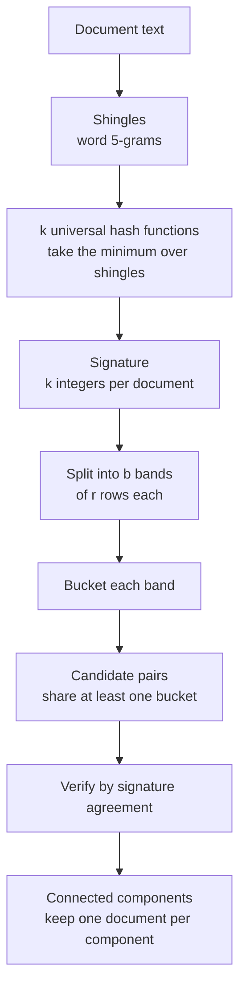
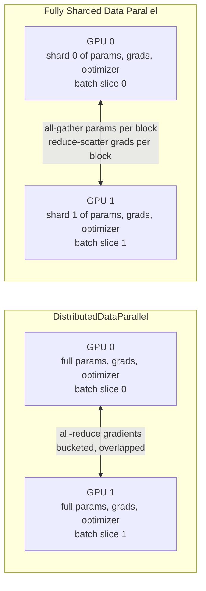
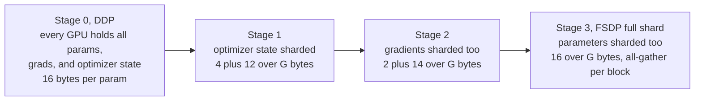
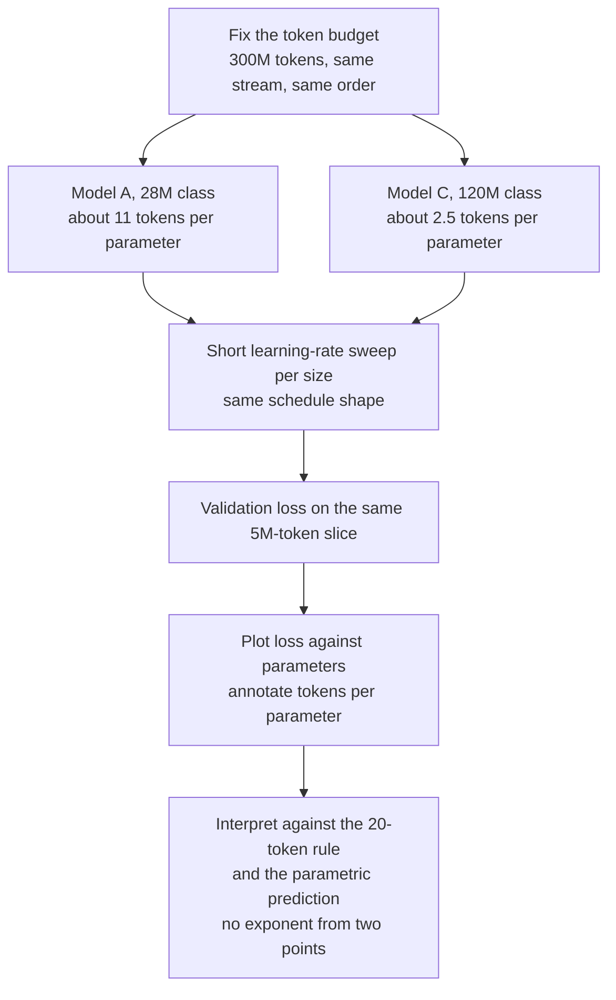

# Chapter 6: Pretraining at Small Scale

> **What you will be able to do:** build a deduplicated, packed, memory-mapped pretraining corpus from a web dataset; choose a Llama-style configuration at 30M to 125M parameters and count its parameters by hand; run the same training script under DDP and FSDP on two GPUs and predict the memory and communication of each; place a training run on the Chinchilla map and explain why the industry over-trains small models; evaluate a small pretrained model honestly and write its model card.
> **Where it is used:** P1.1 directly; the memory and parallelism reasoning returns in P1.2, P1.3, and every sizing conversation in Phases 2 and 5.
> **Prerequisites:** Chapter 2 (the transformer block and parameter counting), Chapter 3 (AdamW, schedules, mixed precision, checkpoints), Chapter 4 (bytes per parameter, activation memory, FLOPs, MFU).

## 6.0 The problem this chapter solves

A customer's platform team asks whether they should pretrain a domain model on their 40 GB of internal documents. Another asks why a vendor's 3B model trained on 6 trillion tokens beats a 7B model trained on 1 trillion. A third wants to know whether the fine-tuning job you proposed can run on the two 24 GB GPUs they already own or whether they must rent an eight-GPU node. All three questions are answered by the same body of knowledge: how pretraining data is built, how training is split across GPUs, and how loss depends on parameters and tokens.

You will never pretrain a frontier model for a customer. You will pretrain a 120M-parameter model once, in P1.1, so that every later estimate you make about memory, throughput, and scale is grounded in a run you watched. The run is small enough for an RTX 4060 and a free pair of Kaggle T4s and complete enough to exercise deduplication, packing, DDP, FSDP, fp16 loss scaling, checkpoint resume, and a scaling plot.

This chapter covers the mechanisms in the order the project meets them: corpus, sharding of data, architecture, sharding of the model across GPUs, precision, scaling laws, evaluation. Each mechanism comes with the formula and a worked number for the 120M model on the hardware you have.

## 6.1 From Common Crawl to FineWeb-Edu

Common Crawl publishes monthly snapshots of the public web as WARC archives. Raw crawl is mostly boilerplate, navigation text, spam, and duplicated pages. Every serious pretraining corpus is Common Crawl passed through a filtering pipeline, and the pipeline is where the quality comes from.

FineWeb (Penedo et al. 2024, "The FineWeb Datasets: Decanting the Web for the Finest Text Data at Scale") documents one such pipeline in detail. The stages, in order: URL filtering against blocklists, text extraction from HTML with trafilatura, language identification with a fastText classifier keeping documents scored as English above a threshold, quality heuristics inherited from Gopher (Rae et al. 2021) and C4 (Raffel et al. 2020) such as repetition ratios, symbol-to-word ratios, and minimum document length, MinHash deduplication within each snapshot, and anonymization of email addresses and IP addresses. The exact thresholds are in the paper and matter less than the shape: each stage is a design decision that was validated by training small models on the filtered and unfiltered variants and comparing benchmark scores.

FineWeb-Edu adds one more stage. A frontier model scored about 460 thousand FineWeb documents for educational value on a 0 to 5 scale. Those scores trained a small regression head on top of a sentence-embedding model. The trained classifier then scored every FineWeb document, and documents at 3 or above form FineWeb-Edu (about 1.3 trillion tokens as reported; a looser threshold of 2 gives a larger set). Small models trained on FineWeb-Edu outperform the same models trained on unfiltered FineWeb on knowledge-heavy benchmarks by a margin that older filtering never achieved. The recipe is reusable in any engagement: label a few thousand examples with a strong model, distill the labels into a cheap classifier, score everything, and validate the threshold by its downstream effect.

The consequence for practice is that filtering is a hyperparameter of the whole system. A stricter classifier threshold gives fewer, better tokens. For a fixed compute budget you trade quantity against quality, and the only honest way to settle the trade is to train on both and measure. In P1.1 you consume a 100M to 300M token slice of a corpus that has already been through this pipeline. Read the dataset card so that you can say what was removed.

```mermaid
flowchart LR
    CC["Common Crawl<br/>WARC snapshots"] --> EX["Text extraction<br/>URL blocklists"]
    EX --> LID["Language ID<br/>keep English above threshold"]
    LID --> QF["Quality heuristics<br/>Gopher and C4 rules"]
    QF --> DD["MinHash dedup<br/>within each snapshot"]
    DD --> EDU["Educational classifier<br/>keep score 3 and above"]
    EDU --> TOK["Tokenize<br/>SmolLM tokenizer"]
    TOK --> PACK["Pack with EOS separators<br/>uint16 shards"]
    PACK --> VAL["Hold out a validation shard"]
```



*Figure 6.1: the corpus pipeline from raw crawl to the shards a training loop reads; the first five stages are the dataset's, the last three are yours.*

## 6.2 Deduplication: exact hashing, MinHash, and LSH

### Why deduplicate

Duplicated documents are memorized instead of learned from, they distort perplexity on any held-out slice that shares a duplicate with training, and they waste compute. Lee et al. 2022 ("Deduplicating Training Data Makes Language Models Better") showed that removing near-duplicates lets models reach the same loss in fewer steps and cuts the rate at which they emit memorized training text. Two levels of deduplication are standard. Exact deduplication removes byte-identical documents. Near-deduplication removes documents that share most of their content, such as the same article with different boilerplate.

### Exact deduplication

Normalize each document (strip whitespace, lowercase if you accept that loss), hash it with a 128-bit hash, sort the hashes, and drop repeats. Cost is one pass and a sort. This catches identical pages but not the page with a new date stamp. A stronger exact method, from the same Lee et al. paper, removes repeated substrings above a fixed length (they used 50 tokens) using a suffix array over the whole corpus. It is the right tool when boilerplate repeats inside otherwise distinct documents.

### Jaccard similarity and MinHash

Near-duplicate detection needs a similarity measure over documents. Represent each document as a set of shingles: overlapping word n-grams, with $n = 5$ a common choice. For two shingle sets $A$ and $B$ the Jaccard similarity is

$$
J(A, B) = \frac{|A \cap B|}{|A \cup B|}
$$

Computing $J$ for every pair of documents in a corpus of $M$ documents costs $O(M^2)$ set intersections, which is impossible at web scale. MinHash (Broder 1997, "On the resemblance and containment of documents") replaces each set by a short signature such that signature agreement estimates $J$.

Take a random permutation $\pi$ of the universe of all shingles. Define the min-hash of a set as $h_\pi(A) = \min_{a \in A} \pi(a)$, the smallest permuted value among its shingles. The key fact:

$$
P\left[h_\pi(A) = h_\pi(B)\right] = J(A, B)
$$

The proof is short. Consider the union $A \cup B$. Under a random permutation, the element of the union with the smallest $\pi$ value is uniformly distributed over the union. The two min-hashes agree exactly when that element lies in $A \cap B$, which happens with probability $|A \cap B| / |A \cup B|$.

Now use $k$ independent permutations $\pi_1, \ldots, \pi_k$ and estimate

$$
\hat{J} = \frac{1}{k} \sum_{i=1}^{k} \mathbf{1}\left[h_{\pi_i}(A) = h_{\pi_i}(B)\right]
$$

where $\mathbf{1}[\cdot]$ is the indicator function. Each term is a Bernoulli trial with success probability $J$, so $\hat{J}$ is unbiased with variance $J(1 - J)/k$ and standard error $\sqrt{J(1-J)/k}$. The signature is $k$ integers per document regardless of document length.

In practice a random permutation of a 64-bit universe is replaced by a universal hash $h_i(x) = (a_i x + b_i) \bmod p$ with $p$ a prime larger than any shingle hash and $a_i, b_i$ drawn at random per hash function. Listing 6.1 does this.

**Worked example.** Document A is "the cat sat on the mat" and document B is "the cat sat on a mat". Using word bigrams as shingles, $A = \{$the cat, cat sat, sat on, on the, the mat$\}$ and $B = \{$the cat, cat sat, sat on, on a, a mat$\}$. The intersection has 3 shingles and the union has 7, so $J = 3/7 \approx 0.43$. With $k = 128$ hash functions, the expected number of agreeing signature positions is $128 \times 3/7 \approx 55$, and the standard error of $\hat{J}$ is $\sqrt{0.43 \times 0.57 / 128} \approx 0.044$. To separate documents at $J = 0.8$ from documents at $J = 0.6$ you want a standard error near 0.04 or below, which is why $k$ in the 100 to 256 range is the norm.

### Locality-sensitive hashing with bands

Signatures still leave $O(M^2)$ pairs to compare. Locality-sensitive hashing (LSH) avoids the pairwise pass. Split the $k$ signature entries into $b$ bands of $r$ rows each, with $k = b r$. Hash each band of each document into a bucket. Two documents become a candidate pair if they land in the same bucket in at least one band. Since a band matches only if all $r$ of its entries agree, and each entry agrees with probability $s = J$,

$$
P[\text{candidate}] = 1 - \left(1 - s^r\right)^b
$$

This is an S-shaped function of $s$ with its steep part near the threshold $s^* \approx (1/b)^{1/r}$. Choosing $b$ and $r$ chooses the similarity at which documents start to be treated as duplicates.

**Worked example.** FineWeb reports 112 hash functions in 14 bands of 8. The threshold is $s^* \approx (1/14)^{1/8} \approx 0.72$. At $s = 0.5$ the candidate probability is $1 - (1 - 0.5^8)^{14} \approx 0.053$. At $s = 0.7$ it is $1 - (1 - 0.7^8)^{14} \approx 0.56$. At $s = 0.8$ it is $1 - (1 - 0.8^8)^{14} \approx 0.92$. At $s = 0.9$ it is above 0.999. So pairs at 80 percent overlap are caught nine times out of ten, and pairs at 50 percent overlap are almost never flagged. After candidates are found, the pipeline verifies them by full signature comparison, builds connected components of near-duplicates, and keeps one document per component.



*Figure 6.2: MinHash reduces each document to a fixed-size signature and LSH banding finds near-duplicate candidates without comparing every pair.*

The consequence for practice: deduplication is cheap to run on a 300M-token slice and the same code deduplicates synthetic datasets in Chapter 10. Keep the shingle size, $k$, $b$, and $r$ in the dataset card, because they define what "duplicate" meant.

## 6.3 Shuffling, packing, and memory-mapped shards

### Shuffling

Web corpora arrive grouped by source and crawl date. A model that sees all of one source and then all of another drifts toward the most recent source, and its loss curve shows steps at source boundaries. Shuffle at the document level across the whole slice before packing, and again at the window level in the sampler each epoch with a seeded permutation. Both shuffles are cheap; skipping either shows up as a bumpy loss curve.

### Packing

Documents vary from 50 to 50,000 tokens. Padding every document to a fixed length wastes most of the batch. Packing concatenates all documents into one token stream with an end-of-sequence (EOS) token between them, then cuts the stream into fixed windows of $T + 1$ tokens, where $T$ is the training sequence length and the extra token provides the shifted target. A window may start in the middle of one document and end in the middle of another. At pretraining scale this is accepted: the model learns that EOS resets context, and the attention across the boundary is a small amount of noise. Chapter 7 covers the stricter packing that instruction tuning needs.

**Worked example.** Three documents of 600, 300, and 900 tokens, with $T = 1024$. The stream is 600 tokens, EOS, 300 tokens, EOS, 900 tokens, EOS: 1,803 tokens. Window 0 covers stream positions 0 to 1024 and contains the whole first document, its EOS, the whole second document, its EOS, and the first 122 tokens of the third. Window 1 covers positions 1024 to 2048 and runs off the end of the stream, so the last 778 tokens of this tiny corpus are dropped or carried into the next shard. Every token in window 0 is a training target; there is no padding. Padding each document to 1024 instead would have produced three windows with 41 percent of positions wasted. The waste from packing is only the partial window at the end of each shard, under 0.001 percent for a 100M-token shard.

### Memory-mapped shards

Store the packed stream as one or more binary files of unsigned 16-bit integers. The SmolLM tokenizer's vocabulary of 49,152 fits in 16 bits (a 151k-token vocabulary would need 32 bits). A 300M-token corpus is 600 MB. Cut it into shards of about 100M tokens so that a shard downloads and verifies independently. The data loader opens each shard with a memory map and slices windows out of it. The operating system pages in only the bytes touched, so the loader uses almost no RAM and a random window read costs one page fault. Listing 6.2 shows the sampler, including the per-rank partition that multi-GPU training needs.

**Worked example.** With $T = 1024$ and a 300M-token stream there are about 293,000 windows. A micro-batch of 8 windows is 8,192 tokens and 16 KB of uint16 data per window read. At 30,000 tokens per second the loader must deliver about four windows per second, which a memory map serves without worker processes. If you instead tokenize on the fly from text, the tokenizer becomes the bottleneck at exactly this throughput. Tokenize once, ahead of time.

## 6.4 Tokenizer: reuse or train

Reusing the SmolLM tokenizer removes a variable from the experiment, and its vocabulary was trained on data close to FineWeb-Edu. Training your own byte-level BPE (Chapter 1) teaches the trade-off directly: a 16k vocabulary compresses English slightly worse than a 49k one, but the embedding table shrinks by a factor of three.

The compressed plan spends thirty minutes on this, so measure rather than experiment. Take 10 MB of held-out text, tokenize it with both tokenizers, and compute bytes per token. Expect the 49k tokenizer near 4.3 bytes per token on English web text and a 16k tokenizer near 3.8, with the exact figures depending on your sample. The difference means the 16k model processes about 12 percent more tokens for the same text and its loss per token is not comparable to the 49k model's; section 6.12 gives the bits-per-byte conversion that restores comparability. At 30M parameters the embedding table is two thirds of the model, so the choice of vocabulary is the choice of model shape.

## 6.5 Architecture at 30M to 125M parameters

A Llama-style block has RMSNorm before attention and before the MLP, rotary position embeddings, grouped-query attention, and a SwiGLU MLP with three matrices (Chapter 2). The configuration is depth $L$, hidden width $d$, number of query heads $n_h$, number of key-value heads $n_{kv}$, head dimension $d_h = d / n_h$, MLP intermediate width $d_{ff}$, and vocabulary $V$.

Non-embedding parameters per block are

$$
P_{\text{block}} = \underbrace{d^2 + 2\, d\, n_{kv} d_h + d^2}_{\text{attention: q, k, v, o}} + \underbrace{3\, d\, d_{ff}}_{\text{SwiGLU}} + \underbrace{2d}_{\text{two RMSNorms}}
$$

and the embedding table is $V d$, counted once when input and output embeddings are tied. Three configurations for P1.1, all with $d_h = 64$, $V = 49{,}152$, and tied embeddings:

| Target | $L$ | $d$ | $n_h$ | $n_{kv}$ | $d_{ff}$ | Block params, all layers | Embedding | Total |
|---|---|---|---|---|---|---|---|---|
| 30M class | 6 | 384 | 6 | 2 | 1024 | 9.4M | 18.9M | 28.3M |
| 60M class | 12 | 512 | 8 | 2 | 1536 | 36.2M | 25.2M | 61.3M |
| 125M class | 12 | 768 | 12 | 4 | 2304 | 82.6M | 37.7M | 120.3M |

**Worked count for the 125M class.** Attention: $d^2 = 589{,}824$ for q, the same for o, and $d \cdot n_{kv} d_h = 768 \times 256 = 196{,}608$ each for k and v, total $1{,}572{,}864$. SwiGLU: $3 \times 768 \times 2304 = 5{,}308{,}416$. Norms: $1{,}536$. Per block $6{,}882{,}816$, times 12 blocks is $82{,}593{,}792$. Embedding $49{,}152 \times 768 = 37{,}748{,}736$. Total about 120.3M, of which 31 percent is the embedding table. For the 30M class the embedding is 67 percent of the model, which is why tying is not optional at this scale and why the 16k-vocabulary option in section 6.4 changes the model so much.

Three consequences for practice. First, for a fixed parameter budget, deeper and narrower is slightly better per parameter and slower per token, because depth serializes; 6 to 12 layers at widths 384 to 768 is the well-trodden region. Second, use grouped-query attention even here, because you want the KV-cache arithmetic of Chapter 4 to be true of a model you trained. Third, the language-model head is a matrix multiply of $d \times V$ per token, so its forward cost is $2 V d$ FLOPs per token, which for the 30M class is $2 \times 49{,}152 \times 384 \approx 38$ MFLOPs against $2 \times 9.4\text{M} \approx 19$ MFLOPs for all six blocks combined. Two thirds of the compute of the smallest model is spent on the output projection. With tied embeddings, the common estimate $C \approx 6 N D$ with $N$ the total parameter count (including the embedding table) is therefore about right, because the head costs what the embedding table would cost if it were a matmul.

## 6.6 Data parallelism with DDP

### Mechanics

Distributed data parallel (DDP) runs one process per GPU. Every process holds a full copy of the model and the optimizer state, receives a different slice of each batch, computes its own forward and backward, and then averages gradients across all processes with an all-reduce before every process applies the identical optimizer step. Because the initial weights are identical (same seed on every rank) and the averaged gradients are identical, the copies stay in lockstep without ever exchanging weights.

PyTorch's `DistributedDataParallel` (Li et al. 2020, "PyTorch Distributed: Experiences on Accelerating Data Parallel Training") adds two efficiencies. Gradients are grouped into buckets of about 25 MB, and each bucket's all-reduce starts as soon as all its gradients are ready, so communication overlaps with the rest of the backward pass. Parameters are bucketed in reverse registration order because the backward pass produces gradients for the last layers first. With gradient accumulation, the all-reduce should run only on the final micro-batch; the `no_sync` context manager suppresses it on the others.

The data side needs a distributed sampler: each rank must see a disjoint slice of the data each epoch, with the permutation seeded by the epoch so that ranks agree on the ordering. The effective batch is micro-batch times accumulation steps times world size, and the learning rate is set for that effective batch (Chapter 3).

**Worked example.** On the 4060 you trained the 61M model with micro-batch 8, accumulation 8, one GPU: $8 \times 8 \times 1 = 64$ windows of 1,024 tokens, or 65,536 tokens per optimizer step, at a peak learning rate you tuned for that batch. Moving to two T4s with the same micro-batch, keep the tokens per step by halving the accumulation: $8 \times 4 \times 2 = 64$ windows. The learning rate, warmup, and total step count stay the same, and the two loss curves are directly comparable. Keeping accumulation at 8 instead would double the tokens per step to 131,072, halve the number of steps for the same token budget, and call for a different learning rate, which would make the single-GPU and two-GPU runs incomparable. Count tokens per step, not micro-batches, when you port a recipe across GPU counts.

### Communication volume

A ring all-reduce of $D$ bytes across $G$ GPUs is a reduce-scatter followed by an all-gather. In each phase every GPU sends $(G-1)/G$ of the data, so each GPU sends and receives

$$
V_{\text{all-reduce}} = 2\,\frac{G-1}{G}\, D
$$

per step, where $D = N \cdot b_g$ with $N$ the parameter count and $b_g$ the bytes per gradient element. For large $G$ this approaches $2D$; for $G = 2$ it is exactly $D$.

**Worked example.** The 60M-class model on Kaggle's two T4s with fp32 gradients: $D = 61.3\text{M} \times 4 = 245$ MB, so each GPU sends 245 MB and receives 245 MB per optimizer step. The two T4s communicate over PCIe. PCIe 3.0 x16 delivers about 12 GB/s in one direction in practice, and on a shared cloud machine peer-to-peer may route through host memory and achieve less, so measure it with a timed all-reduce before trusting the estimate. At 10 GB/s the transfer takes about 25 ms. The compute per step for a per-GPU micro-batch of $8 \times 1024 = 8{,}192$ tokens is about $6 \times 61.3\text{M} \times 8{,}192 \approx 3.0 \times 10^{12}$ FLOPs, which at 15 TFLOPS achieved on a T4 is 200 ms. Communication is 12 percent of compute if nothing overlaps and mostly hidden with bucketing. For eight GPUs the factor $2(G-1)/G$ rises to 1.75, and on a node without NVLink the all-reduce of a 7B model's 28 GB of fp32 gradients would take seconds per step, which is why large data-parallel jobs need fast interconnects or gradient compression.

### What DDP does not do

Memory per GPU under DDP equals memory for a single-GPU run. Every GPU holds the full 16 bytes per parameter of mixed-precision AdamW state (Chapter 4). DDP scales throughput, not model size. For the 120M model that is 1.92 GB of state per GPU, which fits everywhere; for a 7B model it is 112 GB, which fits on no single GPU. Sharding solves that.



*Figure 6.3: DDP replicates everything and exchanges gradients; FSDP keeps one shard of everything and exchanges parameters on the way forward and gradients on the way back.*

## 6.7 Sharding: FSDP and the ZeRO stages

### What is sharded

ZeRO (Rajbhandari et al. 2020, "ZeRO: Memory Optimizations Toward Training Trillion Parameter Models") observed that the three replicated tensors in DDP, optimizer state, gradients, and parameters, can each be partitioned across the $G$ data-parallel GPUs, because each GPU only needs its own partition of the optimizer state to update its own partition of the parameters. The three partitions are the three stages.

Let $\Psi$ be the parameter count and let mixed-precision AdamW hold 2 bytes of low-precision weights, 2 bytes of low-precision gradients, and $K = 12$ bytes of optimizer state per parameter (fp32 master weight, first moment, second moment). Memory per GPU:

$$
\begin{aligned}
M_{\text{DDP}} &= (2 + 2 + K)\,\Psi = 16\,\Psi \\
M_{\text{stage 1}} &= 2\Psi + 2\Psi + \frac{K \Psi}{G} \\
M_{\text{stage 2}} &= 2\Psi + \frac{(2 + K)\,\Psi}{G} \\
M_{\text{stage 3}} &= \frac{(2 + 2 + K)\,\Psi}{G} = \frac{16\,\Psi}{G}
\end{aligned}
$$

If you train with fp32 parameters under autocast instead of a separate low-precision copy, the accounting is 4 bytes of weights, 4 of gradients, and 8 of moments; the total is still 16 bytes and the formulas hold with the terms relabeled.

**Worked example, 120M model on two T4s.** $\Psi = 120\text{M}$, $G = 2$. DDP: 1.92 GB. Stage 1: $0.48 + 0.24 + 0.72 = 1.44$ GB. Stage 2: $0.24 + 0.84 = 1.08$ GB. Stage 3: 0.96 GB. Sharding saves about 1 GB per GPU. The saving is real but small next to activations, which section 6.15 shows are 2 to 6 GB at this batch size. That is why the guide says the peak-memory difference is "visible" rather than large. **Worked example, 7B model on eight A100s.** DDP would need 112 GB per GPU. Stage 1: $28 + 10.5 = 38.5$ GB. Stage 2: $14 + 12.25 = 26.25$ GB. Stage 3: 14 GB. Stage 3 is what makes full fine-tuning of a 7B model fit with room for activations.

### How stage 3 moves data

Under stage 3 no GPU holds a full parameter tensor at rest. Before a block's forward pass, its parameters are all-gathered from all shards into a temporary full copy; after the forward, the copy is freed. During backward the block's parameters are all-gathered again, gradients are computed, and then reduce-scattered so that each GPU keeps only the gradient shard matching its parameter shard. Each GPU then runs the optimizer on its shard alone. PyTorch's FSDP (Zhao et al. 2023, "PyTorch FSDP: Experiences on Scaling Fully Sharded Data Parallel") implements this with a wrapping unit: the parameters inside one wrapped module are gathered together. Wrapping per transformer block means the peak transient memory is one block's parameters, and the next block's all-gather is prefetched during the current block's compute.

Communication per step, in elements moved by each GPU for large $G$: DDP all-reduces gradients, about $2\Psi$. Stages 1 and 2 replace the all-reduce with a reduce-scatter of gradients ($\Psi$) and an all-gather of updated parameters ($\Psi$), also $2\Psi$. Stage 3 all-gathers parameters in forward ($\Psi$), again in backward ($\Psi$), and reduce-scatters gradients ($\Psi$), about $3\Psi$, or 1.5 times DDP. Exactly, each collective moves $(G-1)/G$ of its tensor per GPU.

**Worked example.** The 120M model with bf16 or fp16 communication on two GPUs: DDP moves $2 \times \frac{1}{2} \times 120\text{M} \times 2$ bytes $= 240$ MB per GPU per step; stage 3 moves $3 \times \frac{1}{2} \times 120\text{M} \times 2 = 360$ MB. At 10 GB/s that is 24 ms versus 36 ms against roughly 200 ms of compute, so both are affordable here. On a slow interconnect with a large model, the extra all-gathers are why stage 3 is used only when memory forces it.



*Figure 6.4: each ZeRO stage partitions one more of the three replicated tensors; memory per GPU falls and communication rises only at stage 3.*

### Which to use

DDP when the full state fits with room for activations and you want the simplest failure modes. Stage 1 or 2 (FSDP `SHARD_GRAD_OP`) when optimizer state is the problem, as it is for full fine-tuning of 1B to 3B models on 24 GB GPUs. Stage 3 (FSDP `FULL_SHARD`) when parameters themselves do not fit, as for 7B and above. Never for the 120M model, except to see it work. Activation memory is not sharded by any stage; it scales with the per-GPU batch, and gradient checkpointing (Chapter 4) is the lever for it. DeepSpeed's ZeRO and PyTorch's FSDP implement the same ideas; the terminology in this chapter maps `NO_SHARD` to DDP, `SHARD_GRAD_OP` to stage 2, and `FULL_SHARD` to stage 3.

## 6.8 Launchers, ranks, and checkpointing

`torchrun` starts one process per GPU and sets the environment variables `RANK`, `LOCAL_RANK`, `WORLD_SIZE`, `MASTER_ADDR`, and `MASTER_PORT`. Each process calls `init_process_group` with the NCCL backend, pins itself to `cuda:LOCAL_RANK`, and from then on every collective is implicit in DDP or FSDP. On a single node with two GPUs:

```bash
torchrun --standalone --nproc_per_node=2 train.py --config configs/60m.yaml
```

Rank 0 is the only process that writes checkpoints, logs to W&B, and prints. Every rank must reach the same collectives in the same order, so a checkpoint save is bracketed by barriers: all ranks wait, rank 0 writes, all ranks wait again. Under DDP rank 0 saves `model.module.state_dict()`, the optimizer state, the scheduler state, the gradient scaler state, the step, the data position, and the RNG state (Chapter 3). Under FSDP the full state dictionary must be gathered from all shards first; every rank participates in the gather even though only rank 0 receives the tensors. The API for that gather has changed across PyTorch versions, so Listing 6.4 marks it.

Resume must be tested by killing the job. The P1.1 definition of done requires a DDP run that resumes after a forced kill, and the check is that the loss curve after resume continues the curve before it, with no step repeated and no step skipped. On Kaggle, sessions end after 12 hours and the weekly GPU quota is finite, so checkpoint to the Hugging Face Hub or to a Kaggle dataset well inside the limit.

## 6.9 Mixed precision across the T4, the A100, and the 4060

The three GPUs you will use differ in one fact that changes the training loop. The T4 (Turing) has fp16 tensor cores and no bf16. The A100 (Ampere) and the RTX 4060 (Ada) have both. Chapter 3 derives the loss-scaling algorithm; here are the consequences for the same script on three machines.

fp16 has 5 exponent bits, a largest finite value of 65,504, a smallest normal of about $6.1 \times 10^{-5}$, and subnormals down to about $6.0 \times 10^{-8}$. Gradients of a small language model are often between $10^{-3}$ and $10^{-7}$, so unscaled fp16 gradients underflow to zero in the tail. The `GradScaler` multiplies the loss by a scale (starting at $2^{16}$), checks the unscaled gradients for infinities, skips the step and halves the scale on overflow, and doubles the scale after a run of clean steps. On the T4 you will see the scale drop a few times in the first hundred steps and then settle. Log `scaler.get_scale()` alongside the loss; a scale that keeps falling means the model is producing infinities faster than the scaler can adapt, and the fix is a lower learning rate or a longer warmup, not a smaller initial scale.

bf16 has 8 exponent bits, the same range as fp32, and 7 mantissa bits, about three significant decimal digits. It needs no scaler. Its coarse mantissa is why master weights stay in fp32: a learning-rate-times-gradient update of $10^{-5}$ relative size vanishes when added to a bf16 weight. Under autocast with fp32 parameters this is automatic.

Write the script so that the precision path is a single flag decided by `torch.cuda.is_bf16_supported()`, and record for each machine the throughput in tokens per second, the peak memory, and the number of skipped steps. Peak dense throughput for reference: the T4 is rated at about 65 TFLOPS fp16 with tensor cores, the A100 at about 312 TFLOPS bf16, and the RTX 4060 Laptop GPU's achieved rate is best measured rather than quoted, because GeForce parts run fp16 with fp32 accumulation at a reduced rate and the laptop's power limit varies. A 120M model achieves 15 to 30 percent of any of these peaks; the small matrices are bandwidth-bound (Chapter 4).

## 6.10 Scaling laws

### Kaplan power laws

Kaplan et al. 2020 ("Scaling Laws for Neural Language Models") fit test loss as a power law in each of non-embedding parameters $N$, dataset tokens $D$, and compute $C$, when the other two are not the bottleneck:

$$
L(N) = \left(\frac{N_c}{N}\right)^{\alpha_N}, \quad L(D) = \left(\frac{D_c}{D}\right)^{\alpha_D}
$$

with reported exponents of about $\alpha_N \approx 0.076$ and $\alpha_D \approx 0.095$ (approximate, in their tokenizer and data). Their conclusion for a fixed compute budget was to grow parameters much faster than data, roughly $N_{\text{opt}} \propto C^{0.73}$. Hoffmann et al. later argued that this came partly from holding the learning-rate schedule fixed at a long horizon for every run, which penalizes runs that stop early.

### The Chinchilla parametric fit

Hoffmann et al. 2022 ("Training Compute-Optimal Large Language Models") trained over 400 models from 70M to 16B parameters on 5B to 500B tokens and fit

$$
L(N, D) = E + \frac{A}{N^{\alpha}} + \frac{B}{D^{\beta}}
$$

where $L$ is the loss in nats per token, $E$ is the irreducible loss of the data under a perfect model, the $A$ term is the penalty for finite parameters, and the $B$ term is the penalty for finite data. The reported constants (their third approach; treat as approximate and specific to their tokenizer and their MassiveText corpus) are

$$
E \approx 1.69, \quad A \approx 406.4, \quad B \approx 410.7, \quad \alpha \approx 0.34, \quad \beta \approx 0.28
$$

Minimizing $L$ subject to the compute constraint $C = 6 N D$ gives the compute-optimal allocation. Substitute $D = C / (6N)$, differentiate with respect to $N$, and set the derivative to zero:

$$
\alpha A N^{-\alpha} = \beta B D^{-\beta}
$$

which says the two penalty terms must have marginal rates in the ratio $\beta/\alpha$ at the optimum. Solving with the constraint,

$$
N_{\text{opt}} = G\left(\frac{C}{6}\right)^{a}, \quad D_{\text{opt}} = \frac{1}{G}\left(\frac{C}{6}\right)^{b}, \quad a = \frac{\beta}{\alpha + \beta}, \quad b = \frac{\alpha}{\alpha + \beta}, \quad G = \left(\frac{\alpha A}{\beta B}\right)^{\frac{1}{\alpha + \beta}}
$$

With the constants above, $a \approx 0.45$ and $b \approx 0.55$ (the paper reports 0.46 and 0.54), meaning parameters and tokens should grow at nearly the same rate with compute. That is the result that overturned Kaplan's recommendation.

The paper's first two approaches, which fit the empirical minima directly, gave $a \approx b \approx 0.5$ and the summary rule that the compute-optimal token count is about 20 tokens per parameter. Plugging the reported parametric constants into the closed form instead gives a ratio $D/N$ that rises slowly with compute and sits near 30 tokens per parameter around the 100M scale. Besiroglu et al. 2024 ("Chinchilla Scaling: A replication attempt") showed that the reported third-approach constants are not fully consistent with the paper's other two approaches and re-fit them; the re-fit is closer to the 20-token rule. Use 20 tokens per parameter as the working rule and treat the constants as a shape, not a table of truths.

**Worked example, the 20-token rule.** With $D = 20N$ the compute is $C = 6 N \cdot 20 N = 120 N^2$, so $N_{\text{opt}} = \sqrt{C / 120}$. For $C = 10^{18}$ FLOPs, $N_{\text{opt}} = \sqrt{8.3 \times 10^{15}} \approx 91\text{M}$ parameters and $D_{\text{opt}} \approx 1.8\text{B}$ tokens. For the P1.1 overnight run, $N = 120\text{M}$ and $D = 300\text{M}$ tokens give $C = 6 \times 1.2 \times 10^8 \times 3 \times 10^8 \approx 2.2 \times 10^{17}$ FLOPs. The compute-optimal model for that budget is $N_{\text{opt}} = \sqrt{2.2 \times 10^{17} / 120} \approx 42\text{M}$ parameters on about 850M tokens. The 120M model sees 2.5 tokens per parameter and is far short of compute-optimal; the 28M model on the same tokens sees about 11 tokens per parameter and is closer.

**Worked example, the parametric loss.** Using the reported constants to compare shapes only, since the absolute values are for a different tokenizer and corpus, and noting that 28M is below the range of models they fit:

- $L(28\text{M}, 300\text{M}) \approx 1.69 + 406.4 \times (2.8 \times 10^7)^{-0.34} + 410.7 \times (3 \times 10^8)^{-0.28} \approx 1.69 + 1.19 + 1.74 = 4.62$
- $L(61\text{M}, 300\text{M}) \approx 1.69 + 0.92 + 1.74 = 4.35$
- $L(120\text{M}, 300\text{M}) \approx 1.69 + 0.73 + 1.74 = 4.16$

The data term dominates all three, as it must at 2 to 11 tokens per parameter. Doubling the tokens from 300M to 600M lowers the data term from 1.74 to about 1.43, a gain of 0.31 nats; doubling the parameters from 61M to 120M lowers the parameter term by 0.19 nats. Both cost twice the compute, so at this budget an extra FLOP spent on tokens buys more than an extra FLOP spent on parameters. That is what "undertrained" means, in numbers.

### Over-training and the inference argument

Compute-optimal minimizes training compute for a target loss. It ignores that a model is trained once and served for its lifetime. Inference costs about $2N$ FLOPs per token (Chapter 4), so a smaller model is cheaper to serve at every request, and the lifetime bill is $6 N D_{\text{train}} + 2 N D_{\text{inf}}$ where $D_{\text{inf}}$ is the total tokens served. Sardana and Frankle 2023 ("Beyond Chinchilla-Optimal: Accounting for Inference in Language Model Scaling Laws") formalize this: as $D_{\text{inf}}$ grows, the cost-optimal model is smaller than compute-optimal and trained on more tokens.

**Worked example.** Suppose a target loss is reachable either with $(N_1, D_1)$ or with a model half the size trained on five times the data, $(N_1/2, 5 D_1)$. Training costs $6 N_1 D_1$ versus $15 N_1 D_1$, so the small model costs 2.5 times as much to train. Inference costs $2 N_1 D_{\text{inf}}$ versus $N_1 D_{\text{inf}}$. Total costs are equal when $9 N_1 D_1 = N_1 D_{\text{inf}}$, that is, when $D_{\text{inf}} = 9 D_1$. If $D_1$ is 1T tokens, any deployment that will serve more than 9T tokens over the model's life is cheaper with the small over-trained model, and the saving grows without bound after that.

This is why Llama 3 8B was trained on about 15T tokens (Grattafiori et al. 2024, "The Llama 3 Herd of Models"), roughly 1,900 tokens per parameter, and why SmolLM2's 1.7B model was trained on about 11T tokens (Allal et al. 2025, "SmolLM2: When Smol Goes Big"), roughly 6,500 tokens per parameter. When a customer asks whether a 3B model on 6T tokens is "undertrained," the answer is that it is heavily over-trained by the compute-optimal rule and that this is deliberate, because the customer will pay for inference, not for the vendor's training run.

## 6.11 Designing the two-point experiment honestly

The compressed plan trains two sizes (the 28M and the 120M class; the 61M class is optional) on the same 300M tokens and plots validation loss against parameters. Two points do not determine a power law. What they do show, if the experiment is controlled, is the direction and rough size of the parameter effect at a fixed token budget, and where both points sit relative to the 20-token rule.

Hold fixed: the tokenizer, the exact token stream and its order (same seed), the validation slice, the sequence length, the tokens per optimizer step, the schedule shape (warmup then cosine to the end of the fixed budget), and the evaluation code. Tune per size only the peak learning rate, because larger models want smaller learning rates; the GPT-3 paper (Brown et al. 2020) lists about $6 \times 10^{-4}$ for a 125M model and higher for smaller ones, which is a starting point for your own short sweep. Report the tokens-per-parameter ratio next to each point.

Report the loss with its uncertainty. Over a held-out slice of 5M tokens the standard error of the mean per-token loss is about $\sigma / \sqrt{n}$ with $\sigma \approx 2.5$ nats per token, so about 0.001 nats: negligible next to a gap of 0.3 to 0.5 nats. The uncertainty that matters is between runs with different seeds and learning rates, and you will not afford repeats. Say so in the paragraph.

Interpret against two references. Against the 20-token rule, both runs are undertrained and the larger one more so, so a larger gap between them would appear at a larger token budget. Against the parametric fit, the predicted gap is about 0.4 to 0.5 nats in favor of the larger model even at 2.5 tokens per parameter, so if your larger model does not win, the first suspects are its learning rate and its warmup, not the scaling law. Do not fit a line through two points and quote an exponent.



*Figure 6.5: the two-point experiment controls everything except size and the per-size learning rate, and its output is a paragraph, not a law.*

## 6.12 Evaluating a pretrained model and writing the card

### Perplexity and its comparability

Perplexity is $\exp$ of the mean per-token cross-entropy on held-out text. It is comparable between two runs only when they share the tokenizer and the held-out text, because a tokenizer that produces more tokens per byte spreads the same uncertainty over more, easier predictions. To compare across tokenizers, convert to bits per byte:

$$
\text{BPB} = \frac{\ell \cdot n_{\text{tok}}}{n_{\text{bytes}} \cdot \ln 2}
$$

where $\ell$ is the mean loss in nats per token, $n_{\text{tok}}$ is the number of tokens in the held-out text, and $n_{\text{bytes}}$ is its length in UTF-8 bytes.

**Worked example.** A model with mean loss 3.20 nats per token on a tokenizer averaging 4.1 bytes per token has $\text{BPB} = 3.20 / (4.1 \times 0.693) \approx 1.13$ bits per byte. A model on a 16k tokenizer with 3.8 bytes per token and loss 3.05 has $\text{BPB} = 3.05 / (3.8 \times 0.693) \approx 1.16$. The second model has lower perplexity and is slightly worse.

### lm-eval and the noise floor

The lm-evaluation-harness (Gao et al., EleutherAI) runs standardized tasks. Multiple-choice tasks like HellaSwag and ARC-Easy score by log-likelihood of each option, which works for a base model with no instruction tuning. One command runs both:

```bash
lm_eval --model hf --model_args pretrained=./checkpoints/120m-final --tasks hellaswag,arc_easy --num_fewshot 0 --batch_size 16
```

Flag names are stable in recent versions but check yours. At 120M parameters and 300M tokens, expect scores within a few points of chance, which for four-way multiple choice is 25 percent. The lesson is the noise floor. The standard error of an accuracy $p$ on $n$ items is $\sqrt{p(1-p)/n}$. HellaSwag's validation set has about 10,000 items, so at $p = 0.28$ the standard error is about 0.0045, or 0.9 points at 95 percent confidence. ARC-Easy's test set has about 2,400 items, giving about 1.8 points. A difference of one point between two checkpoints on ARC-Easy is noise. Chapter 11 gives the bootstrap procedure that replaces this normal approximation and the paired test that compares two models on the same items.

### Contamination at pretraining scale

A benchmark score means nothing if the benchmark's items were in the training stream. FineWeb-Edu is web text and HellaSwag's and ARC's source material is on the web, so some overlap is possible even in a 300M-token slice. The standard check is n-gram overlap: for each evaluation item, test whether any 13-gram of its text appears in the training shards, using a hash set of training 13-grams or the MinHash machinery of section 6.2 at the item level. Report the fraction of items flagged. For a 300M-token slice expect a small fraction; for the base model's original multi-trillion-token pretraining you cannot check and should say so. Chapter 11 gives the full protocol and the reporting format.

### The model card

Mitchell et al. 2019 ("Model Cards for Model Reporting") defined the form. For the P1.1 card state: the architecture and its exact configuration; the tokenizer and its source; the data (dataset name, slice, token count, deduplication parameters, held-out split); the training recipe (steps, tokens per step, learning rate, schedule, precision, hardware, wall-clock hours, cost); evaluation (validation loss, bits per byte, lm-eval scores with intervals and the date); intended use (research and teaching); limitations (English only, tiny, no instruction tuning, may reproduce web text); and the contamination check you did or did not run. A card for a toy model is the rehearsal for the card a customer's compliance team will demand.

## 6.13 Implementation notes

**Listing 6.1: MinHash signatures with universal hashing and LSH bucket keys.**

```python
import hashlib
import numpy as np

P = (1 << 31) - 1  # Mersenne prime; keeps a*x + b below 2**64 in uint64 arithmetic


def shingles(text: str, n: int = 5) -> set[str]:
    toks = text.lower().split()
    return {" ".join(toks[i:i + n]) for i in range(max(1, len(toks) - n + 1))}


def shingle_hash(s: str) -> int:
    return int.from_bytes(hashlib.sha1(s.encode()).digest()[:4], "little") % P


class MinHasher:
    def __init__(self, k: int = 112, seed: int = 0):
        rng = np.random.default_rng(seed)
        self.a = rng.integers(1, P, size=k, dtype=np.uint64)  # k random slopes
        self.b = rng.integers(0, P, size=k, dtype=np.uint64)  # k random offsets

    def signature(self, doc_shingles: set[str]) -> np.ndarray:
        x = np.fromiter((shingle_hash(s) for s in doc_shingles), dtype=np.uint64)
        h = (np.outer(self.a, x) + self.b[:, None]) % np.uint64(P)  # shape (k, m)
        return h.min(axis=1)  # one minimum per hash function, shape (k,)


def band_keys(sig: np.ndarray, b: int = 14, r: int = 8) -> list[bytes]:
    return [sig[i * r:(i + 1) * r].tobytes() for i in range(b)]


def estimate_jaccard(sig_a: np.ndarray, sig_b: np.ndarray) -> float:
    return float((sig_a == sig_b).mean())
```

The prime $2^{31} - 1$ is chosen so that $a x + b$ with $a, x, b < 2^{31}$ stays below $2^{62} + 2^{31}$ and fits in unsigned 64-bit arithmetic without wrapping; a larger prime would need Python integers and be far slower. `np.outer` evaluates all $k$ hash functions on all $m$ shingles at once, and the row-wise minimum is the signature. `band_keys` returns the raw bytes of each band as a dictionary key; using Python's built-in `hash` here would be wrong because it is randomized per process. Deduplication is then: bucket every document's band keys, collect pairs that share a key, verify each pair with `estimate_jaccard` against your threshold, and union-find the survivors into components.

**Listing 6.2: memory-mapped shard sampler with a per-rank partition and resumable order.**

```python
import numpy as np
import torch


class ShardSampler:
    def __init__(self, paths, seq_len, rank, world, seed):
        self.arrs = [np.memmap(p, dtype=np.uint16, mode="r") for p in paths]
        self.seq_len, self.rank, self.world, self.seed = seq_len, rank, world, seed
        # window i of shard j starts at i * seq_len; the extra token is the shifted target
        self.index = [(j, i) for j, a in enumerate(self.arrs)
                      for i in range((len(a) - 1) // seq_len)]

    def windows(self, epoch: int, skip: int = 0):
        order = np.random.default_rng(self.seed + epoch).permutation(len(self.index))
        mine = order[self.rank::self.world]  # disjoint, equal-size slice per rank
        for pos in range(skip, len(mine)):
            j, i = self.index[mine[pos]]
            s = i * self.seq_len
            chunk = self.arrs[j][s:s + self.seq_len + 1].astype(np.int64)
            x, y = torch.from_numpy(chunk[:-1]), torch.from_numpy(chunk[1:])
            yield x, y, pos + 1  # pos + 1 is the resume cursor for this epoch

    def batches(self, epoch, micro_batch, skip=0):
        xs, ys, cursor = [], [], skip
        for x, y, cursor in self.windows(epoch, skip):
            xs.append(x); ys.append(y)
            if len(xs) == micro_batch:
                yield torch.stack(xs), torch.stack(ys), cursor
                xs, ys = [], []
```

The permutation is seeded by epoch, so every rank computes the same order and takes a disjoint stride of it; no communication is needed to partition the data. The `skip` argument and the returned cursor are what make resume exact: the checkpoint stores `(epoch, cursor)` and the restarted job continues from the next unseen window. Casting `uint16` to `int64` happens per window, so the memory map itself stays read-only and shared across processes.

**Listing 6.3: DDP training skeleton with torchrun conventions, accumulation, and rank-0 checkpoints.**

```python
import contextlib, os
import torch, torch.distributed as dist
from torch.nn.parallel import DistributedDataParallel as DDP


def main(cfg):
    dist.init_process_group(backend="nccl")
    rank, world = dist.get_rank(), dist.get_world_size()
    local_rank = int(os.environ["LOCAL_RANK"])
    torch.cuda.set_device(local_rank)
    device = torch.device("cuda", local_rank)

    torch.manual_seed(cfg.seed)  # identical initialization on every rank
    model = DDP(build_model(cfg).to(device), device_ids=[local_rank])
    opt = torch.optim.AdamW(model.parameters(), lr=cfg.lr, betas=(0.9, 0.95), weight_decay=0.1)
    sched = build_warmup_cosine(opt, cfg.warmup_steps, cfg.total_steps)
    use_fp16 = not torch.cuda.is_bf16_supported()  # T4 path
    amp_dtype = torch.float16 if use_fp16 else torch.bfloat16
    scaler = torch.amp.GradScaler("cuda", enabled=use_fp16)  # older versions: torch.cuda.amp.GradScaler

    sampler = ShardSampler(cfg.shards, cfg.seq_len, rank, world, cfg.seed)
    step, epoch, cursor = 0, 0, 0
    if cfg.resume:
        step, epoch, cursor = load_checkpoint(cfg.resume, model.module, opt, sched, scaler, device)
    batches = sampler.batches(epoch, cfg.micro_batch, skip=cursor)

    while step < cfg.total_steps:
        for micro in range(cfg.accum):
            x, y, cursor = next(batches)
            sync = micro == cfg.accum - 1  # all-reduce only on the last micro-batch
            with (contextlib.nullcontext() if sync else model.no_sync()):
                with torch.autocast("cuda", dtype=amp_dtype):
                    loss = model(x.to(device), y.to(device)) / cfg.accum
                scaler.scale(loss).backward()
        scaler.unscale_(opt)
        torch.nn.utils.clip_grad_norm_(model.parameters(), 1.0)
        scaler.step(opt); scaler.update(); sched.step()
        opt.zero_grad(set_to_none=True)
        step += 1
        if step % cfg.ckpt_every == 0:
            dist.barrier()
            if rank == 0:
                save_checkpoint(cfg.out, model.module, opt, sched, scaler, step, epoch, cursor)
            dist.barrier()
    dist.destroy_process_group()
```

Everything distributed happens in four places: `init_process_group`, the `DDP` wrapper, the per-rank sampler, and the barriers around the save. `no_sync` on all but the last micro-batch avoids paying the all-reduce `accum` times per step. The loss is divided by `accum` so that accumulated gradients equal the gradient of the mean over the effective batch. Saving `model.module` strips the DDP wrapper so the checkpoint loads into a plain model. The scaler is a no-op when bf16 is available, so one script serves the T4 and the 4060.

**Listing 6.4: FSDP wrapping per transformer block and a rank-0 full state dictionary. PyTorch 2.x FSDP1 API; the newer `fully_shard` API and `torch.distributed.checkpoint` differ, check your version.**

```python
import functools
import torch
from torch.distributed.fsdp import (FullyShardedDataParallel as FSDP, MixedPrecision,
                                    ShardingStrategy, StateDictType, FullStateDictConfig)
from torch.distributed.fsdp.wrap import transformer_auto_wrap_policy


def wrap_fsdp(model, block_cls, local_rank, use_fp16):
    dtype = torch.float16 if use_fp16 else torch.bfloat16
    policy = functools.partial(transformer_auto_wrap_policy, transformer_layer_cls={block_cls})
    mp = MixedPrecision(param_dtype=dtype, reduce_dtype=torch.float32, buffer_dtype=dtype)
    return FSDP(model, auto_wrap_policy=policy, sharding_strategy=ShardingStrategy.FULL_SHARD,
                mixed_precision=mp, device_id=local_rank, use_orig_params=True)


def full_state_dict_on_rank0(fsdp_model):
    cfg = FullStateDictConfig(offload_to_cpu=True, rank0_only=True)
    with FSDP.state_dict_type(fsdp_model, StateDictType.FULL_STATE_DICT, cfg):
        return fsdp_model.state_dict()  # every rank must call this; only rank 0 gets tensors
```

`transformer_auto_wrap_policy` makes each transformer block one FSDP unit, so the all-gather granularity is one block and peak transient memory is one block's parameters in the compute dtype. Wrapping the whole model as one unit gathers everything at once and gives no memory benefit, which is the most common FSDP mistake. `reduce_dtype=torch.float32` keeps the gradient reduce-scatter in fp32 for numerical safety at the cost of double the gradient traffic; set it to the compute dtype if bandwidth is the constraint. `SHARD_GRAD_OP` in place of `FULL_SHARD` gives ZeRO stage 2 behavior. The state-dictionary call is a collective, so it must run on all ranks, and only rank 0 should then write the result.

**Listing 6.5: chunked cross-entropy over the sequence, so the full logits tensor is never materialized.**

```python
import torch
import torch.nn.functional as F


def chunked_lm_loss(hidden, lm_head_weight, targets, chunk_tokens=2048):
    """hidden: (B, T, d) final hidden states; lm_head_weight: (V, d); targets: (B, T) int64.
    Returns mean cross-entropy over all B*T positions without a (B*T, V) tensor alive at once."""
    h = hidden.reshape(-1, hidden.shape[-1])  # (B*T, d)
    y = targets.reshape(-1)  # (B*T,)
    total = torch.zeros((), device=h.device, dtype=torch.float32)
    for start in range(0, h.shape[0], chunk_tokens):
        hc, yc = h[start:start + chunk_tokens], y[start:start + chunk_tokens]
        logits = hc @ lm_head_weight.T  # (chunk, V) in the compute dtype
        total = total + F.cross_entropy(logits.float(), yc, reduction="sum")
    return total / h.shape[0]
```

The forward computes the head projection one chunk at a time and adds the summed loss, so only one `(chunk, V)` block of logits exists at any moment. Autograd still saves what it needs for each chunk's backward, which for `cross_entropy` is the fp32 log-softmax output of that chunk, so peak memory falls from about 10 bytes per position per vocabulary entry to that figure times `chunk_tokens / (B*T)`. With $B T = 8{,}192$ and a chunk of 2,048 the logits cost at the 120M model's 49k vocabulary drops from about 4 GB to about 1 GB. Wrapping the chunk body in `torch.utils.checkpoint.checkpoint` drops it further by recomputing the chunk's logits in backward. Libraries such as Liger Kernel fuse the projection and the loss into one kernel to the same end; this listing shows the mechanism they optimize.

## 6.14 Failure modes

| Symptom | Likely cause | How to confirm | Fix |
|---|---|---|---|
| GPU utilization below 70 percent, loss fine | Data loader bottleneck | `nvidia-smi dmon` shows idle gaps; profile shows `next(batches)` dominating | Tokenize ahead of time to shards; memory map; avoid per-step Python work |
| Loss steps down sharply at regular intervals | Corpus not shuffled at document level, sources in blocks | Decode windows at the step boundaries and check the source | Shuffle documents before packing, and windows per epoch |
| Validation loss far below training loss | Validation slice shares duplicates with training | Run the MinHash check between the two slices | Deduplicate across the split, not only within training |
| Loss to near zero in a few hundred steps | Broken causal mask or target not shifted | Check that `y[t] == x[t+1]` and inspect the mask on a tiny batch | Fix the shift or the mask (Chapter 2) |
| fp16 run shows NaN or the scale keeps halving | Overflow faster than the scaler adapts, or learning rate too high | Log `scaler.get_scale()`; count skipped steps | Lower the learning rate, lengthen warmup, keep fp32 master weights |
| FSDP peak memory equals DDP peak memory | Whole model wrapped as one unit, or micro-batch so large that activations dominate | Print the wrapped module tree; compare with `torch.cuda.max_memory_allocated` at micro-batch 1 | Wrap per block; reduce micro-batch and accumulate |
| Two-GPU run is barely faster than one | Communication not overlapped, or one rank waiting on the loader | Time the all-reduce alone; check per-rank loader timing | Bucketed overlap is default; make sure `no_sync` is used under accumulation; balance the sampler |
| Ranks hang at a barrier or collective | One rank took a different code path (an `if rank == 0` around a collective) | Attach `py-spy` to each process; look for the collective only some ranks reached | Every rank runs every collective; only the write is conditional |
| Resume gives a loss spike then recovers | Optimizer or scheduler state not restored, or data cursor reset to zero | Compare the first 20 losses after resume with the pre-kill curve; check the restored step count | Save and restore optimizer, scheduler, scaler, step, epoch, and cursor together |
| Perplexity improves after switching tokenizer | Comparing losses across tokenizers | Compute bits per byte for both | Report bits per byte whenever tokenizers differ |
| lm-eval scores differ between two runs of the same checkpoint | Different few-shot samples or batch-dependent padding | Fix `--num_fewshot` and seed; rerun | Pin the harness version, seed, and flags in the card |
| Out of memory at the loss computation | Full logits tensor in fp32 for a 49k vocabulary at a large micro-batch | Memory jumps at the cross-entropy call in the profiler | Reduce micro-batch, or compute the loss in chunks over the sequence (Listing 6.5) |
| Two-GPU loss curve sits above the single-GPU curve at the same step | Tokens per step doubled when accumulation was not halved, so the learning rate is now wrong for the batch | Compare tokens per step in the two run configs | Hold tokens per step fixed across GPU counts (section 6.6) |
| Kaggle session ends and the last hours are lost | Checkpoint interval longer than the remaining session time, or checkpoints written only to session disk | Check the timestamp of the last checkpoint against the session cap | Checkpoint every 30 minutes to the Hub or a Kaggle dataset, not only to local disk |

## 6.15 On your machine

**The memory budget at 120M.** Optimizer and weights are 1.92 GB regardless of batch. Activations without recomputation are roughly 36 bytes per token per layer per hidden unit in bf16 for a SwiGLU block with fused attention (Chapter 4 gives the derivation), so at micro-batch 4 and sequence 1024 they are about $4{,}096 \times 12 \times 36 \times 768 \approx 1.4$ GB; at micro-batch 8, 2.7 GB. The logits are the surprise: $8{,}192$ tokens times a 49,152 vocabulary is 403M elements, and the loss step transiently holds them in bf16, fp32, and an fp32 gradient, about 10 bytes each, so about 4 GB at micro-batch 8 and 2 GB at micro-batch 4. Add about 0.4 GB for the CUDA context.

**RTX 4060, 8 GB, bf16.** The 120M model at micro-batch 4 and sequence 1024 needs about $1.9 + 1.4 + 2.0 + 0.4 \approx 5.7$ GB and fits. Micro-batch 8 needs about 9 GB and does not, unless the cross-entropy is computed in chunks, which brings it to about 6 GB. Use micro-batch 4 with accumulation 16 for 65,536 tokens per step, 4,600 steps for 300M tokens. Total compute is $6 \times 1.2 \times 10^8 \times 3 \times 10^8 \approx 2.2 \times 10^{17}$ FLOPs. At an achieved 12 to 20 TFLOPS that is 3 to 5 hours, so the overnight rule applies. Measure tokens per second in the mandatory 50-step smoke test at full micro-batch and multiply. Checkpoint every 30 minutes to disk and to the Hub. The 28M model runs the same budget in $6 \times 2.8 \times 10^7 \times 3 \times 10^8 \approx 5 \times 10^{16}$ FLOPs, about an hour, with a lower achieved throughput because its matrices are smaller; the language-model head is two thirds of its compute. Watch GPU temperature and clocks (Chapter 5); a laptop that throttles at hour two changes the tokens-per-second number you report.

**Kaggle, two T4s, fp16 with a scaler.** Run the 61M model under DDP with per-GPU micro-batch 8 and sequence 1024: per GPU about 1.0 GB of state, 1.8 GB of activations, 4 GB of logits at peak, 0.5 GB of context, about 7 GB of the 16 GB available. Per-GPU gradient traffic is 245 MB per step in fp32; measure the all-reduce time once and report it. Then run the same configuration under FSDP `FULL_SHARD` and record the peak memory difference, which should be about 0.5 GB per GPU for the 61M model and about 1 GB for the 120M model. Kill the DDP run with a keyboard interrupt in the middle, restart with `--resume`, and confirm the loss curve joins. Budget the 12-hour session cap: the 61M model on 300M tokens is about $1.1 \times 10^{17}$ FLOPs, roughly 1.5 hours on two T4s at 10 TFLOPS achieved each, leaving room for the FSDP run and the kill test. Kaggle's weekly GPU quota was 30 hours as of mid-2026; verify.

**A rented A100 80 GB, optional.** The 120M model in bf16 at micro-batch 64 and sequence 1024 uses about 2 GB of state, 22 GB of activations, and 32 GB of logits at peak, about 56 GB, and fits. At 25 to 40 percent MFU (80 to 120 TFLOPS) the 300M-token run takes 30 to 45 minutes. At about $1.39 per hour on RunPod Community Cloud as of September 2026, the run costs about one dollar plus setup time. Its purpose is one row in your throughput table: tokens per second on the 4060, on a T4, and on an A100, for the same model and batch, which is the datacenter reference you will quote for years. Stop the pod when the job ends and log the spend in the ledger.

## Exercises

**Exercise 6.1.** Two documents have word 5-gram shingle sets of sizes 400 and 500 with 300 shingles in common. Compute the Jaccard similarity. With $k = 128$ hash functions, compute the expected number of agreeing signature positions and the standard error of the MinHash estimate.

<details><summary>Solution</summary>

The union has $400 + 500 - 300 = 600$ shingles, so $J = 300 / 600 = 0.5$. Expected agreements are $128 \times 0.5 = 64$. Standard error is $\sqrt{0.5 \times 0.5 / 128} = \sqrt{0.00195} \approx 0.044$. A 95 percent interval on the estimate is about $0.5 \pm 0.09$.

</details>

**Exercise 6.2.** You have $k = 128$ signature entries and want the LSH threshold near 0.8. Choose $b$ and $r$ with $b r = 128$ and compute the candidate probability at $s = 0.6$ and $s = 0.9$.

<details><summary>Solution</summary>

Try $b = 16$, $r = 8$: threshold $(1/16)^{1/8} = 2^{-4/8} \approx 0.71$. Try $b = 8$, $r = 16$: threshold $(1/8)^{1/16} = 2^{-3/16} \approx 0.88$. Neither is exactly 0.8; $b = 16$, $r = 8$ is the safer choice because missing true duplicates is worse than verifying extra candidates. At $s = 0.6$: $1 - (1 - 0.6^8)^{16} = 1 - (1 - 0.0168)^{16} \approx 1 - 0.763 = 0.24$. At $s = 0.9$: $1 - (1 - 0.9^8)^{16} = 1 - (1 - 0.430)^{16} \approx 1 - 0.00012 \approx 0.9999$. The verification step removes most of the 24 percent of false candidates at $s = 0.6$.

</details>

**Exercise 6.3.** A 350M-parameter model trains under DDP on four GPUs with fp32 gradients. Compute the bytes each GPU sends per step. If the interconnect delivers 25 GB/s per GPU, how long does the all-reduce take, and what fraction of a 600 ms step is that if nothing overlaps?

<details><summary>Solution</summary>

$D = 350 \times 10^6 \times 4 = 1.4$ GB. Each GPU sends $2 \times (3/4) \times 1.4 = 2.1$ GB per step. At 25 GB/s that is 84 ms, or 14 percent of a 600 ms step without overlap. With bucketed overlap most of it hides behind the backward pass, which is why DDP holds up well at this size on a single node.

</details>

**Exercise 6.4.** Compute the per-GPU memory for parameters, gradients, and optimizer state of a 1.3B model under mixed-precision AdamW on 4 GPUs at ZeRO stages 0 through 3.

<details><summary>Solution</summary>

$\Psi = 1.3 \times 10^9$. Stage 0: $16 \Psi = 20.8$ GB. Stage 1: $4\Psi + 12\Psi/4 = 5.2 + 3.9 = 9.1$ GB. Stage 2: $2\Psi + 14\Psi/4 = 2.6 + 4.55 = 7.15$ GB. Stage 3: $16\Psi/4 = 5.2$ GB. Stage 2 already fits comfortably on a 24 GB GPU with activations; stage 3 buys 2 GB more for 1.5 times the communication.

</details>

**Exercise 6.5.** A compute budget of $C = 10^{19}$ FLOPs is available. Compute the compute-optimal $N$ and $D$ under the 20-tokens-per-parameter rule. Then compute $N_{\text{opt}}$ from the parametric closed form with $a = 0.45$ and $G = 1.34$ and compare.

<details><summary>Solution</summary>

Rule of thumb: $N = \sqrt{10^{19} / 120} = \sqrt{8.33 \times 10^{16}} \approx 2.9 \times 10^8$, so about 290M parameters on $D = 20 N \approx 5.8$B tokens. Closed form: $N_{\text{opt}} = 1.34 \times (10^{19}/6)^{0.45}$. $\ln(1.67 \times 10^{18}) \approx 41.96$; times 0.45 is 18.88; $e^{18.88} \approx 1.58 \times 10^8$; times 1.34 gives about 210M parameters, and $D = C/(6N) \approx 7.9$B tokens, about 37 tokens per parameter. The parametric constants favor a smaller model on more data than the 20-token rule at this scale, which is the inconsistency section 6.10 flags. Either answer is defensible; state which rule you used.

</details>

**Exercise 6.6.** Two runs on the same 300M tokens give validation losses of 4.31 nats (28M model) and 4.02 nats (120M model). Write three sentences interpreting the plot for the P1.1 write-up.

<details><summary>Solution</summary>

The larger model is better by 0.29 nats at a fixed 300M tokens, in the direction and rough size the Chinchilla parametric shape predicts (about 0.4 to 0.5 nats), with the shortfall plausibly explained by a learning rate tuned less well for the larger model. Both runs are far below 20 tokens per parameter (11 and 2.5), so both are undertrained by the compute-optimal rule and the gap would likely widen with more tokens, because the data term dominates the loss for both. Two points do not determine an exponent, so no power law is fit; the plot is a sanity check on the pipeline and a placement on the map, not a scaling law.

</details>

**Exercise 6.7.** A model reaches mean loss 2.95 nats per token on held-out text that tokenizes to 4.35 bytes per token. Compute perplexity and bits per byte. A second model with a different tokenizer reaches loss 2.80 at 3.70 bytes per token. Which is better?

<details><summary>Solution</summary>

First model: perplexity $e^{2.95} \approx 19.1$; $\text{BPB} = 2.95 / (4.35 \times 0.693) \approx 0.979$. Second model: perplexity $e^{2.80} \approx 16.4$; $\text{BPB} = 2.80 / (3.70 \times 0.693) \approx 1.092$. The second model has lower perplexity and higher bits per byte, so the first model is better. Perplexity misled because the second tokenizer spreads the text over 18 percent more tokens.

</details>

**Exercise 6.8.** Your 120M model scores 27.1 percent on ARC-Easy (about 2,400 items) and a checkpoint 1,000 steps earlier scored 25.9 percent. Is the improvement meaningful?

<details><summary>Solution</summary>

Standard error at $p \approx 0.265$ is $\sqrt{0.265 \times 0.735 / 2400} \approx 0.009$, or 0.9 points. The difference of 1.2 points is about 1.3 standard errors of a single score, and the two scores are correlated because they share items, so a paired analysis (Chapter 11) would be needed even to get that far. Report both numbers with intervals and do not claim the improvement.

</details>

**Exercise 6.9.** Explain in three sentences why wrapping the whole model as a single FSDP unit gives no memory benefit, and what the right granularity is.

<details><summary>Solution</summary>

FSDP gathers the full parameters of a wrapped unit before that unit's forward pass and frees them after; if the unit is the whole model, all parameters are gathered at once and the peak equals the unsharded model plus the shard, which is worse than DDP. Wrapping per transformer block makes the transient full copy one block's parameters (about 7M for the 120M model) while the other eleven blocks stay sharded. Per-block wrapping is also what allows prefetching the next block's all-gather during the current block's compute.

</details>

**Exercise 6.10.** A vendor offers two models that reach the same quality target: an 8B model trained on 1.5T tokens and a 3B model trained on 12T tokens. Compute the training FLOPs of each. If the customer expects to serve 40T tokens over three years, compute the total FLOPs (training plus inference) for each and state which is cheaper.

<details><summary>Solution</summary>

Training: $6 \times 8 \times 10^9 \times 1.5 \times 10^{12} = 7.2 \times 10^{22}$ FLOPs for the 8B model and $6 \times 3 \times 10^9 \times 1.2 \times 10^{13} = 2.16 \times 10^{23}$ FLOPs for the 3B model, three times more. Inference at $2N$ per token: $2 \times 8 \times 10^9 \times 4 \times 10^{13} = 6.4 \times 10^{23}$ for the 8B model and $2.4 \times 10^{23}$ for the 3B model. Totals: $7.1 \times 10^{23}$ versus $4.6 \times 10^{23}$. The 3B model is about 35 percent cheaper over the deployment even though it cost three times as much to train, and the training cost is the vendor's, not the customer's. Break-even is at $D_{\text{inf}} = (2.16 - 0.72) \times 10^{23} / (10 \times 10^9) \approx 14$T served tokens; above that the smaller model wins.

</details>

## Summary

- Pretraining corpora are Common Crawl passed through extraction, language ID, heuristic quality filters, MinHash deduplication, and, for FineWeb-Edu, a distilled educational classifier; every stage is a validated design choice, and the classifier recipe reuses in any engagement.
- The probability that two MinHash values agree equals the Jaccard similarity; $k$ hash functions give an unbiased estimate with standard error $\sqrt{J(1-J)/k}$, and LSH banding with $b$ bands of $r$ rows flags pairs at a threshold near $(1/b)^{1/r}$ without comparing every pair.
- Pack documents with EOS separators into uint16 memory-mapped shards and sample windows with an epoch-seeded permutation partitioned by rank; store the cursor in the checkpoint so resume is exact.
- At 30M to 125M parameters the embedding table is 30 to 70 percent of the model and the language-model head is a large share of the compute; tie the embeddings and use grouped-query attention anyway.
- DDP replicates the full model and all-reduces gradients, moving $2(G-1)/G$ times the gradient bytes per GPU per step; it scales throughput and leaves memory per GPU unchanged at about 16 bytes per parameter for mixed-precision AdamW.
- ZeRO stages 1, 2, and 3 shard optimizer state, then gradients, then parameters, taking per-GPU state from $16\Psi$ toward $16\Psi/G$; stage 3 costs about 1.5 times DDP's communication and needs per-block wrapping to deliver its memory saving.
- The T4 needs fp16 with a gradient scaler; the A100 and the RTX 4060 use bf16 without one; the same script should switch on hardware support and log skipped steps.
- Chinchilla's fit $L = E + A N^{-\alpha} + B D^{-\beta}$ with reported constants near $E = 1.69$, $A = 406$, $B = 411$, $\alpha = 0.34$, $\beta = 0.28$ predicts that parameters and tokens should scale together; the working rule is about 20 tokens per parameter, and the constants are approximate.
- Production models are over-trained far past compute-optimal because inference dominates lifetime cost; a smaller model trained on more tokens wins once served tokens exceed a multiple of training tokens.
- A two-point experiment at fixed tokens shows direction and rough size of the parameter effect, and its honest output is a paragraph with tokens per parameter annotated, never a fitted exponent.
- At small scale with a 49k vocabulary the logits tensor at the loss step, about 10 bytes per position per vocabulary entry, can exceed the model's entire optimizer state; compute the loss in chunks before reaching for a smaller batch.
- Compare losses across tokenizers in bits per byte, and treat lm-eval scores within one to two points of each other on 2,000 to 10,000 items as noise.

## Further reading

- Penedo et al. 2024, "The FineWeb Datasets: Decanting the Web for the Finest Text Data at Scale."
- Rae et al. 2021, "Scaling Language Models: Methods, Analysis and Insights from Training Gopher" (the quality heuristics).
- Lee et al. 2022, "Deduplicating Training Data Makes Language Models Better."
- Broder 1997, "On the resemblance and containment of documents."
- Leskovec, Rajaraman, and Ullman, *Mining of Massive Datasets*, the chapter on finding similar items (LSH banding).
- Li et al. 2020, "PyTorch Distributed: Experiences on Accelerating Data Parallel Training."
- Rajbhandari et al. 2020, "ZeRO: Memory Optimizations Toward Training Trillion Parameter Models."
- Zhao et al. 2023, "PyTorch FSDP: Experiences on Scaling Fully Sharded Data Parallel."
- Micikevicius et al. 2018, "Mixed Precision Training."
- Kaplan et al. 2020, "Scaling Laws for Neural Language Models."
- Hoffmann et al. 2022, "Training Compute-Optimal Large Language Models."
- Besiroglu et al. 2024, "Chinchilla Scaling: A replication attempt."
- Sardana and Frankle 2023, "Beyond Chinchilla-Optimal: Accounting for Inference in Language Model Scaling Laws."
- Grattafiori et al. 2024, "The Llama 3 Herd of Models."
- Allal et al. 2025, "SmolLM2: When Smol Goes Big."
- Brown et al. 2020, "Language Models are Few-Shot Learners" (the model-size and learning-rate table).
- Mitchell et al. 2019, "Model Cards for Model Reporting."
- The lm-evaluation-harness documentation (EleutherAI) and the PyTorch distributed documentation, official roots only.
