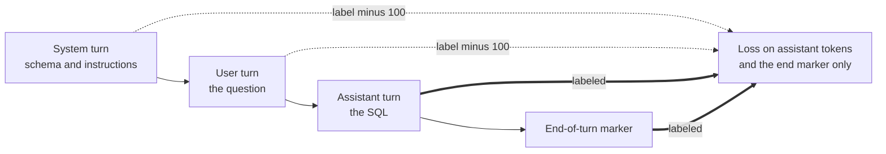
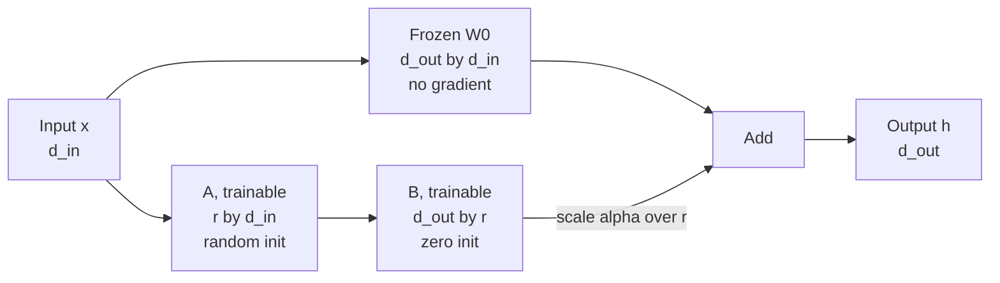
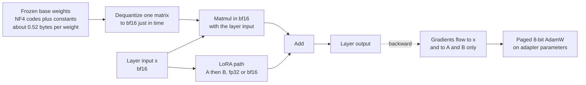

# Chapter 7: Supervised Fine-Tuning, LoRA, and QLoRA

> **What you will be able to do:** decide what supervised fine-tuning can and cannot change in a model and say why; build a chat-templated, completion-masked, correctly packed training set and prove the mask is right by decoding it; derive the LoRA update, count its trainable parameters for any architecture, and choose rank, alpha, and target modules with reasons; explain the NF4 data type from the normal quantiles and compute QLoRA memory for a given model, sequence length, and GPU; fine-tune a 1.5B, 3B, and 7B model on 8 GB and export the result as a GGUF file that runs in Ollama.
> **Where it is used:** P1.2 directly; the recipe is reused in P1.5 (distilling into a student) and P4.3 (fine-tuning the language side of a small vision-language model).
> **Prerequisites:** Chapter 1 (tokenization and chat templates), Chapter 3 (AdamW, schedules, mixed precision), Chapter 4 (bytes per parameter, activation memory), Chapter 6 (packing, the memory of full training).

## 7.0 The problem this chapter solves

A customer runs an analytics product where users ask questions in English and a frontier model writes SQL against a warehouse with 300 tables. It works, and it costs more per query than the customer's margin allows at their projected volume. They ask whether a small open-weight model can do the same job. Answering honestly requires knowing what fine-tuning changes (format, dialect, schema conventions, the habit of answering in SQL) and what it does not (knowledge of the customer's business, reasoning on ambiguous questions), how much memory and time the job takes on the hardware they have, and how to measure the result in a way their data team will accept.

Supervised fine-tuning (SFT) is the most requested fine-tuning pattern in enterprise engagements and the one with the most silent failures. The model trains, the loss falls, and the result is worse than the base model because the chat template at inference does not match the one at training, or because the loss was computed on the schema instead of the SQL, or because packed examples attended to each other. This chapter makes each of those mechanisms explicit so that you can check them before training rather than debug them after.

Low-rank adaptation (LoRA) and its 4-bit variant QLoRA are what make the job fit on an RTX 4060 with 8 GB. They are also what a customer means when they ask "can we fine-tune on our own hardware." The chapter derives both, with the memory arithmetic for the three model sizes in P1.2, and ends with the export path that turns a trained adapter into a file a customer can run offline.

## 7.1 What SFT changes and what it does not

SFT continues next-token training on curated demonstrations: a prompt and the response you want, with the loss computed on the response. The mechanism is unchanged from pretraining; only the data and the mask differ. What changes in the model is therefore whatever the demonstrations consistently exhibit and the base model can already represent.

Reliably changed: output format (always a fenced SQL block, always valid JSON), behavior (ask a clarifying question when the schema is ambiguous, refuse questions outside the schema), dialect and style (PostgreSQL conventions, explicit aliases, no `SELECT *`), and narrow skill (mapping this family of questions to this family of query shapes). Weakly or unreliably changed: factual knowledge. A few thousand examples cannot install facts that the base model did not see during pretraining; the model learns the form of a confident answer in the new domain and fills it with plausible content. Retrieval delivers facts; fine-tuning delivers the habit of using them.

The evidence usually cited is Zhou et al. 2023 ("LIMA: Less Is More for Alignment"). They fine-tuned a 65B base model on 1,000 carefully selected prompts and responses, with no preference training, and reported that human raters found its responses equivalent or preferable to GPT-4's in 43 percent of comparisons, and that adding more examples of lower quality did not help while adding diversity did. Their framing is the superficial alignment hypothesis: nearly all capability is learned in pretraining, and alignment teaches the model which subdistribution of formats to use. Two qualifications matter for P1.2. LIMA's base model was large; small models benefit more from more SFT data because they have less to expose. And LIMA measured general helpfulness; a narrow skill like text-to-SQL improves with thousands of examples in a way that open-ended chat does not.

The consequence for the customer conversation: when someone says "fine-tune it on our documents so it knows our products," the correct answer is that fine-tuning teaches behavior and retrieval supplies knowledge, and the proposal is RAG for the facts and, if the outputs need a consistent shape or a narrow skill, SFT on top.

## 7.2 Base versus instruct

A base model completes text and has no notion of turns. An instruct model has been fine-tuned (SFT, usually followed by preference optimization) on conversations and knows a chat template, a system role, and when to stop. For a chat-style task, start from the instruct variant: it already produces well-formed turns and stops at end-of-turn, so your data only needs to teach the skill. Start from the base model only when you want to define the format yourself, when the instruct model's safety training interferes with the task, or when you are about to do your own preference training and want a clean starting point.

The instruct model comes with its template baked in. Your training examples must use that exact template, which is the subject of the next section.

## 7.3 Chat templates and completion-only loss

### The template as a contract

A chat template is the exact string layout of roles and turns the model saw during its own instruction tuning: which special tokens open and close a turn, how the role name is written, where the assistant's reply begins, and what follows it. Every model family has its own. The Qwen2.5 family uses a ChatML-style layout: a start-of-turn marker, the role name on the same line, a newline, the content, an end-of-turn marker, and a newline, repeated per turn. The tokenizer ships the template as a Jinja string, and `apply_chat_template` renders it (Chapter 1 shows one structure abstractly).

The template is a contract between training and inference. If training renders the system prompt one way and the inference server renders it another, the model sees a prompt distribution at inference that it never saw in training. The loss falls during training and quality at inference is poor, with no error anywhere. Always render training examples with the tokenizer's own template, and always confirm that the serving stack (vLLM, Ollama, your harness) renders the same bytes, by comparing token ids for one example end to end.

### Completion-only loss

By default a causal language model is trained on every token in the window, including the prompt. For instruction tuning the prompt is masked so that the loss is computed only on the response. The mask is a label of $-100$ (the ignore index of PyTorch's cross-entropy) at every prompt position.

The reason is proportion. A text-to-SQL example has a system prompt with `CREATE TABLE` statements, a question, and a query. The schema is often 500 to 1,500 tokens and the query 30 to 80. Without the mask, 95 percent of the gradient teaches the model to reproduce table definitions, which it can already do, and the SQL is a rounding error. With the mask, all of the gradient goes to the skill.

Which tokens carry labels for a single-turn example under a ChatML-style template:

| Segment | Example content | Label |
|---|---|---|
| Start-of-turn marker, role `system`, newline | marker tokens | masked |
| System content | schema, instructions | masked |
| End-of-turn marker, newline | marker tokens | masked |
| Start-of-turn marker, role `user`, newline | marker tokens | masked |
| User content | the question | masked |
| End-of-turn marker, newline | marker tokens | masked |
| Start-of-turn marker, role `assistant`, newline | marker tokens | masked |
| Assistant content | the SQL | **labeled** |
| End-of-turn marker | marker token | **labeled** |

The end-of-turn marker after the assistant content is labeled so that the model learns to stop. Multi-turn examples label every assistant turn and mask every user turn. Listing 7.2 builds this mask and prints the decoded labeled tokens, which is the check that catches template mistakes before training.



*Figure 7.1: the template lays out the turns and the mask decides which of them the loss sees; everything before the assistant's content is context, not target.*

## 7.4 Packing without cross-contamination

Section 6.3 packed pretraining documents into windows and accepted attention across document boundaries as noise. Instruction tuning cannot accept it. If example 2 follows example 1 in a window and attention is unrestricted, the model learns that a question about a `customers` table is answered with help from an unrelated schema that happened to precede it. That dependence never exists at inference, so the model has learned a spurious feature.

Two mechanisms fix this. Position ids restart at zero for each example inside the window, so RoPE sees each example as starting fresh. Attention is restricted to a block-diagonal mask, so tokens attend only within their own example. With FlashAttention's variable-length interface the mask is never materialized: the kernel receives cumulative sequence lengths and processes each example as its own sequence. With scaled dot-product attention the block-diagonal boolean mask is built explicitly, which costs $O(T^2)$ memory per window and is acceptable at $T = 2048$.

For two packed examples of lengths 3 and 2 in a window of 5, the allowed attention (row attends to column) is:

| From | to 0 | to 1 | to 2 | to 3 | to 4 |
|---|---|---|---|---|---|
| 0 | yes | no | no | no | no |
| 1 | yes | yes | no | no | no |
| 2 | yes | yes | yes | no | no |
| 3 | no | no | no | yes | no |
| 4 | no | no | no | yes | yes |

Causal within each block, nothing across. Position ids are 0, 1, 2, 0, 1. Trainers call this padding-free or example-isolated packing, and whether it is on by default depends on the version and on whether the model's attention implementation supports it. The check is empirical: pack two unrelated examples, run a forward pass, and confirm that the logits for example 2 are identical to the logits when example 2 is run alone. If they differ, your packing leaks.

Packing raises throughput by two to four times on datasets with short examples. Turn it on, verify the isolation once, and keep the verification script in the repository.

## 7.5 Hyperparameters and their effects

The knobs, in rough order of impact for LoRA SFT on a narrow task:

| Knob | Typical for LoRA | Typical for full fine-tuning | Effect when too high | Effect when too low |
|---|---|---|---|---|
| Peak learning rate | $1 \times 10^{-4}$ to $3 \times 10^{-4}$ | $1 \times 10^{-5}$ to $2 \times 10^{-5}$ | Loss spikes, forgetting, degenerate outputs | Model barely moves; SFT looks like it did nothing |
| Epochs | 1 to 3 | 1 to 2 | Memorization, validation loss rises after epoch 1 | Underfitting on small sets |
| Effective batch (examples) | 16 to 64 | 32 to 128 | Fewer steps, needs higher LR | Noisy gradients |
| Sequence length | Enough for schema plus answer | Same | Wasted memory on padding or truncation of the answer | Truncated answers, mask misaligned |
| Warmup | 3 to 5 percent of steps | Same | Slow start | Early instability with AdamW's empty moments |
| Schedule | Cosine to about 10 percent of peak | Same | | |
| Weight decay | 0 to 0.1 on adapters | 0.1 | | |
| LoRA rank | 8 to 64 | not applicable | Slower, more memory, rarely better past 64 | Underfits hard tasks |
| NEFTune noise | 5 | 5 | Loss stays high | No effect |

The learning-rate gap of about ten times between LoRA and full fine-tuning has a mechanical reason. In LoRA the update to the effective weight is $\frac{\alpha}{r} B A$, and $B$ starts at zero (section 7.8), so the first steps move $B$ from zero and the effective weight change is the product of two small matrices. Full fine-tuning moves every weight directly and a learning rate of $2 \times 10^{-4}$ would destroy pretrained structure. Using a full-fine-tuning learning rate for LoRA is a common mistake and its symptom is a fine-tune that does not beat the base model.

NEFTune (Jain et al. 2023, "NEFTune: Noisy Embeddings Improve Instruction Finetuning") adds uniform noise to the input embeddings during training with magnitude $\alpha_{\text{neft}} / \sqrt{L d}$, where $L$ is the sequence length and $d$ the embedding width. It is a regularizer that helps most on small, conversational datasets and costs nothing to try; on a task with an exact correctness check its effect is usually within noise.

**Worked example.** Ten thousand examples, effective batch 32, two epochs: 625 steps. Warmup at 3 percent is about 19 steps. With a per-device micro-batch of 2 on the 4060, gradient accumulation is 16. If evaluation runs every 100 steps and each evaluation on 500 held-out prompts takes four minutes with generation, evaluation is a quarter of the wall-clock; evaluate loss every 100 steps and execution accuracy only at epoch ends.

Overfitting shows as training loss well below validation loss, as validation loss rising after the first epoch, and as memorized answers to paraphrased questions. The fix is fewer epochs or more diverse data, not more regularization.

## 7.6 Catastrophic forgetting and regression suites

Fine-tuning on one distribution degrades others. The effect is small with LoRA at low learning rates and large with full fine-tuning at high ones; Biderman et al. 2024 ("LoRA Learns Less and Forgets Less") measured both sides of the trade on code and math and found LoRA below full fine-tuning on the target task at large data scale and above it on retained general capability. For a narrow skill on a few thousand examples, LoRA is the right side of that trade.

Measure it rather than assume it. Before training, run a small regression suite on the base model: a few lm-eval tasks (Chapter 6, section 6.12) plus a handful of general prompts you care about. After training, run the same suite on the fine-tuned model and compare with a paired test (Chapter 11). A drop beyond noise is a bug in the recipe: learning rate too high, too many epochs, or a dataset so narrow that the model has lost the ability to answer anything else. Mixing 5 to 10 percent general instruction data into the training set (replay) is the standard mitigation when a drop appears.

## 7.7 Full fine-tuning memory, recapped

Chapter 4 derived about 16 bytes per parameter for mixed-precision AdamW: 2 for bf16 weights, 2 for bf16 gradients, 4 for the fp32 master copy, 8 for two fp32 moments. For Qwen2.5-1.5B (1.54B parameters) that is 24.7 GB before activations. For Qwen2.5-0.5B (0.49B parameters) it is 7.9 GB, still over budget on 8 GB once activations arrive. With 8-bit Adam (Dettmers et al. 2022, "8-bit Optimizers via Block-wise Quantization") the moments cost 2 bytes instead of 8, and with fp32 weights and gradients under autocast the total is 10 bytes per parameter: 4.9 GB for the 0.5B model, leaving room for a sequence of 1,024 at batch 1 if the loss is computed in chunks (Chapter 6, Listing 6.5). That is how the P1.2 ablation "full fine-tune of 0.5B versus LoRA on 1.5B" fits on the 4060. Everything larger needs adapters.

## 7.8 LoRA

### The update

Hu et al. 2021 ("LoRA: Low-Rank Adaptation of Large Language Models") freeze the pretrained weight $W_0 \in \mathbb{R}^{d_{\text{out}} \times d_{\text{in}}}$ and train a low-rank correction:

$$
h = W_0 x + \Delta W x = W_0 x + \frac{\alpha}{r}\, B A\, x
$$

where $x \in \mathbb{R}^{d_{\text{in}}}$ is the layer input, $A \in \mathbb{R}^{r \times d_{\text{in}}}$ and $B \in \mathbb{R}^{d_{\text{out}} \times r}$ are the trainable matrices, $r \ll \min(d_{\text{in}}, d_{\text{out}})$ is the rank, and $\alpha$ is a scaling constant. Only $A$ and $B$ receive gradients and optimizer state. The forward computes $A x$ first, an $r$-dimensional vector, then $B (A x)$, so the extra cost is $2 r (d_{\text{in}} + d_{\text{out}})$ FLOPs per token, negligible against the $2 d_{\text{in}} d_{\text{out}}$ of the frozen matmul.

### Initialization

$A$ is initialized at random (the paper uses a Gaussian; PEFT's default is Kaiming-uniform) and $B$ is initialized to zero. At step zero $\Delta W = 0$ and the model is exactly the base model. The gradients at initialization are

$$
\frac{\partial \mathcal{L}}{\partial B} = \frac{\alpha}{r}\, \frac{\partial \mathcal{L}}{\partial h}\, (A x)^{\top}, \qquad \frac{\partial \mathcal{L}}{\partial A} = \frac{\alpha}{r}\, B^{\top} \frac{\partial \mathcal{L}}{\partial h}\, x^{\top}
$$

The second is zero when $B = 0$, so $B$ moves first and $A$ starts learning once $B$ is nonzero. If both were zero, both gradients would be zero forever. If both were random, $\Delta W$ would be a random perturbation of the base model at step zero, and the first steps would spend their budget undoing it. Zero for $B$, random for $A$ is the only choice that starts at the base model and has a nonzero gradient.

### Why it works

Aghajanyan et al. 2020 ("Intrinsic Dimensionality Explains the Effectiveness of Language Model Fine-Tuning") showed that fine-tuning a large pretrained model can be done in a random subspace of a few hundred to a few thousand dimensions with little loss. The change a fine-tune needs to make has low intrinsic dimension: most of $\Delta W$ lives in a small subspace, and a rank of 8 to 64 captures the useful part. Hu et al. confirmed this directly by measuring that the learned $\Delta W$ has a small effective rank and that its top singular directions overlap little with those of $W_0$: the adapter amplifies directions the base model had but did not emphasize.

### Rank, alpha, dropout, targets

Rank $r$ sets capacity. 16 is the default; 64 for harder tasks or larger datasets; above 64 rarely helps and the memory and time grow linearly. Alpha $\alpha$ is a scale on the update; with the $\alpha / r$ convention, keeping $\alpha = 2r$ (16 and 32, or 64 and 128) keeps the effective update scale roughly constant when you change rank, which is why the ablation in P1.2 varies $r$ with $\alpha = 2r$. Dropout on the adapter path (0.05 typical) regularizes small datasets.

Target modules decide which matrices get adapters. The original paper adapted only the attention projections. Dettmers et al. 2023 (the QLoRA paper) found that adapting all linear layers, attention and MLP, matters more than rank and is needed to match full fine-tuning quality. Default to all seven projections in a Llama-style block: `q_proj`, `k_proj`, `v_proj`, `o_proj`, `gate_proj`, `up_proj`, `down_proj`. Leave the embedding table and the language-model head frozen unless you are adding vocabulary.



*Figure 7.2: the frozen path and the low-rank path are summed; at initialization the low-rank path contributes nothing and the model equals the base.*

### Trainable parameter count

Each adapted matrix of shape $d_{\text{out}} \times d_{\text{in}}$ adds

$$
P_{\text{LoRA}} = r\,(d_{\text{in}} + d_{\text{out}})
$$

parameters. Summing over the adapted matrices in one block and multiplying by the number of blocks gives the total.

**Worked example, Qwen2.5-1.5B shapes at rank 16, all linear layers.** Assume hidden width $d = 1536$, 28 layers, 12 query heads and 2 key-value heads with head dimension 128 (so the k and v projections output $2 \times 128 = 256$), MLP intermediate width 8960, vocabulary 151,936 with tied embeddings; these are the published shapes for the Qwen2.5-1.5B family, and the Coder variant shares them, but verify against the model's configuration file. Per block:

- `q_proj`, $1536 \to 1536$: $16 \times (1536 + 1536) = 49{,}152$
- `k_proj`, $1536 \to 256$: $16 \times (1536 + 256) = 28{,}672$
- `v_proj`, $1536 \to 256$: $28{,}672$
- `o_proj`, $1536 \to 1536$: $49{,}152$
- `gate_proj`, $1536 \to 8960$: $16 \times (1536 + 8960) = 167{,}936$
- `up_proj`, $1536 \to 8960$: $167{,}936$
- `down_proj`, $8960 \to 1536$: $167{,}936$

Per block $659{,}456$; times 28 blocks is $18{,}464{,}768$, about 18.5M trainable parameters, or 1.2 percent of the 1.54B total. Attention-only adapters would be $155{,}648 \times 28 \approx 4.4$M, a quarter as many, and the MLP projections are where three quarters of the adapter capacity goes. At rank 64 the count is four times larger, about 73.9M. Optimizer state for the adapters at 16 bytes per parameter is $18.5\text{M} \times 16 \approx 295$ MB at rank 16: trivial next to the 3.1 GB of frozen bf16 base weights.

### Merging and multiple adapters

After training you either keep the adapter as a separate file of a few tens of megabytes or merge it: $W = W_0 + \frac{\alpha}{r} B A$, computed in fp32 and cast back to the base dtype. The merged model is a standard checkpoint with no extra latency and is what you quantize and export. The unmerged adapter is what you serve when several tasks share one base model: serving systems load the base once and apply per-request adapters (Chapter 13), which is how P2.2 serves the P1.2 and P1.3 adapters side by side. Keep both; the adapter is small enough to version alongside the dataset that produced it.

## 7.9 LoRA variants

**rsLoRA.** Kalajdzievski 2023 ("A Rank Stabilization Scaling Factor for Fine-Tuning with LoRA") shows that with the $\alpha / r$ scaling, the update's magnitude shrinks as rank grows, so higher ranks learn more slowly and the benefit of rank saturates early. Scaling by $\alpha / \sqrt{r}$ instead keeps the update magnitude stable across ranks and lets rank 64 and above actually use their capacity. It is a one-line change and the right default when you sweep rank.

**DoRA.** Liu et al. 2024 ("DoRA: Weight-Decomposed Low-Rank Adaptation") decompose each weight into a magnitude vector (one scalar per output column) and a direction matrix, apply LoRA to the direction only, and train the magnitude directly. The argument is that full fine-tuning changes direction and magnitude in a pattern LoRA cannot reproduce, and separating them recovers it. It costs a little extra compute and consistently gains a point or two on their benchmarks; worth a run in an ablation, not a default.

**LoRA+.** Hayou et al. 2024 ("LoRA+: Efficient Low Rank Adaptation of Large Models") show from a width-scaling analysis that $A$ and $B$ should not share a learning rate: $B$ should learn faster, by a factor they set around 16. The gain is in training speed and final loss at fixed steps. It needs optimizer parameter groups and is available in some trainers; if yours does not support it, the default single learning rate is fine.

## 7.10 QLoRA

Dettmers et al. 2023 ("QLoRA: Efficient Finetuning of Quantized LLMs") keep the frozen base weights in 4 bits and the adapters in 16 or 32 bits. Three components make this work with almost no quality loss: the NF4 data type, double quantization of the scaling constants, and paged optimizer states. The adapters see a base model whose weights are dequantized on the fly, so training proceeds exactly as LoRA except that each frozen matrix is expanded from 4-bit codes to bf16 just before use.

### Blockwise absmax quantization

Take a weight tensor, flatten it, and cut it into blocks of $b = 64$ consecutive values. For each block compute the absolute maximum $c = \max_i |w_i|$, called the absmax. Normalize the block to $[-1, 1]$ by dividing by $c$, snap each normalized value to the nearest of $2^4 = 16$ representable levels, and store the 4-bit index of that level. Dequantization is the level value times $c$. The block structure confines the damage of one large weight to its own 64 neighbors instead of the whole tensor (Chapter 12 develops this for inference quantization).

The cost of the constants: one fp32 absmax per 64 weights is $32 / 64 = 0.5$ extra bits per weight, so blockwise 4-bit storage costs 4.5 bits per weight.

### NF4 from the normal quantiles

Trained weights are approximately normally distributed with mean zero. The 16 levels should therefore be placed where normal-distributed values are, not uniformly. The information-theoretic argument is that each level should carry equal probability mass: choose levels $q_i$ so that the standard normal puts equal mass in each of the 16 bins. Concretely, with $Q(\cdot)$ the standard normal quantile function, place the level for bin $i$ at the midpoint of the quantiles that bound the bin, then divide all levels by the largest so that the range is exactly $[-1, 1]$.

A symmetric 16-level grid has no exact zero, and weights near zero are common, so the implementation is asymmetric: 8 positive levels from quantiles at equally spaced probabilities between 0.5 and about 0.968, 7 negative levels from a slightly different spacing, and an exact zero, 16 in total. The resulting levels, as implemented in bitsandbytes and rounded to four decimals:

$$
\begin{aligned}
&-1.0000,\ -0.6962,\ -0.5251,\ -0.3949,\ -0.2844,\ -0.1848,\ -0.0911,\ 0.0000, \\
&\ 0.0796,\ 0.1609,\ 0.2461,\ 0.3379,\ 0.4407,\ 0.5626,\ 0.7230,\ 1.0000
\end{aligned}
$$

The levels crowd near zero and thin out toward $\pm 1$, matching the density of a normal. Because each block is normalized by its own absmax, the largest weight in every block maps exactly to $\pm 1$ and the rest of the block is spread across the interior levels. Listing 7.3 constructs the levels and quantizes a block.

**Worked example.** A block of 8 weights (64 in practice): $0.12, -0.35, 0.02, 0.61, -0.08, 0.27, -0.50, 0.04$. The absmax is $c = 0.61$. Normalized: $0.197, -0.574, 0.033, 1.000, -0.131, 0.443, -0.820, 0.066$. Nearest levels: $0.1609, -0.5251, 0.0, 1.0, -0.0911, 0.4407, -0.6962, 0.0796$, with indices $9, 2, 7, 15, 6, 12, 1, 8$. Dequantized: $0.098, -0.320, 0.000, 0.610, -0.056, 0.269, -0.425, 0.049$. Absolute errors: $0.022, 0.030, 0.020, 0.000, 0.024, 0.001, 0.075, 0.009$; root-mean-square error about $0.032$ against a root-mean-square weight of about $0.32$, or roughly 10 percent relative error per weight. That is typical for 4-bit storage, and it is tolerable because the adapters are trained against the quantized weights and absorb part of the error.

### Double quantization

The 0.5 bits per weight of fp32 absmax constants add up: 0.4 GB for a 6.5B-parameter set of linear layers. Double quantization quantizes the constants themselves. The fp32 absmax values are grouped into blocks of 256, their mean is subtracted, and they are quantized to 8-bit with one fp32 scale per block of 256. The overhead per weight becomes

$$
\frac{8}{64} + \frac{32}{64 \times 256} = 0.125 + 0.002 \approx 0.127 \text{ bits}
$$

instead of 0.5, a saving of about 0.37 bits per weight, as the paper reports. Storage is then about 4.13 bits per quantized weight, or about 0.52 bytes.

### Dequantize on the fly and the compute dtype

In the forward pass of each frozen linear layer, the 4-bit codes and their constants are expanded into a bf16 matrix (the compute dtype), the matmul runs in bf16, and the expanded matrix is freed. In the backward pass the same dequantization happens again to compute the gradient with respect to the layer input, which is needed to propagate to earlier layers and to the adapters, while the gradient with respect to the frozen weight is never computed. The transient bf16 copy is one matrix at a time, at most $d_{\text{ff}} \times d$ elements: about 136 MB for the largest matrix of a 7B model. The dequantization is why QLoRA steps take roughly 20 to 40 percent longer than bf16 LoRA on the same model; measure it on your run.

Which modules are quantized: every `nn.Linear` in the transformer blocks. The embedding table is an `nn.Embedding` and is never quantized, and the language-model head is excluded by default. Both stay in bf16, and for a model with a 150k vocabulary they are large; section 7.16 shows that this decides whether a 7B model fits on 8 GB.

### Paged optimizers

Optimizer states are allocated in unified memory, which the CUDA driver can page between GPU and CPU memory on demand. When a memory spike (a long sequence, a large logits tensor) would otherwise cause an out-of-memory error, optimizer pages are evicted to CPU RAM and brought back when the optimizer step needs them. For adapter training the states are small, so paging is insurance against spikes rather than a memory saving; for full fine-tuning under QLoRA-style setups it is what keeps a run alive. bitsandbytes' paged 8-bit AdamW combines paging with 8-bit moments: about 2 bytes of state per trainable parameter instead of 8.



*Figure 7.3: QLoRA stores the base in 4 bits, expands each matrix to bf16 for the moment it is used, and trains only the adapters, whose optimizer state can page to CPU under pressure.*

### Memory arithmetic

Total training memory is the sum of five parts: frozen base weights, adapter parameters with their gradients and optimizer state, activations, the logits at the loss step, and fixed overhead (CUDA context, allocator slack, dequantization buffers). Section 7.16 tabulates it for the three P1.2 models; the parts are computed as follows.

Base weights: bf16 LoRA costs 2 bytes per parameter. QLoRA costs about 0.52 bytes per quantized linear-layer parameter plus 2 bytes per embedding and head parameter.

Adapters: 16 bytes per trainable parameter with fp32 weights and AdamW, or 10 with 8-bit moments.

Activations with gradient checkpointing: one bf16 hidden tensor per layer, $T \times d \times 2$ bytes times the layer count for batch 1, plus the recompute peak of one layer, roughly $T \times (4 d + 3 d_{\text{ff}}) \times 2$ bytes.

Logits: the head projects $T$ positions to $V$ logits, and the loss step transiently holds about 10 bytes per position per vocabulary entry (bf16 logits, an fp32 copy, and its fp32 gradient) unless the loss is chunked (Chapter 6, Listing 6.5), in which case about 1 to 2 bytes.

**Worked example, 7B QLoRA at $T = 1024$, batch 1.** Qwen2.5-7B shapes: $d = 3584$, 28 layers, $d_{\text{ff}} = 18{,}944$, 4 key-value heads of dimension 128, vocabulary 152,064, untied embeddings; 7.62B parameters of which about 6.53B are in the linear layers of the blocks and about 1.09B in the embedding and head. Base: $6.53\text{B} \times 0.52 \approx 3.4$ GB plus $1.09\text{B} \times 2 \approx 2.2$ GB, total 5.6 GB. Adapters at rank 16 on all linear layers: per block $16 \times (3584 + 3584) \times 2 + 16 \times (3584 + 512) \times 2 + 16 \times (3584 + 18944) \times 3 = 1{,}441{,}792$, times 28 is 40.4M, so 0.65 GB at 16 bytes or 0.40 GB with 8-bit moments. Activations: $1024 \times 3584 \times 2 \times 28 \approx 0.21$ GB stored plus about 0.15 GB recompute. Logits: $1024 \times 152{,}064 \times 10 \approx 1.56$ GB unchunked, about 0.3 GB chunked. Overhead about 0.5 GB plus a 0.14 GB dequantization buffer. Total unchunked with 16-byte adapters: $5.6 + 0.65 + 0.36 + 1.56 + 0.64 \approx 8.8$ GB, which does not fit. Chunked with 8-bit moments: $5.6 + 0.40 + 0.36 + 0.3 + 0.64 \approx 7.3$ GB, which fits with a few hundred megabytes to spare. That is why the P1.2 walkthrough specifies sequence 1024, batch 1, paged 8-bit AdamW, and Unsloth for the 7B run, and calls it borderline.

The same arithmetic for a Llama-2-7B or Mistral-7B shape with a 32k vocabulary gives an embedding-plus-head of about 0.5 GB instead of 2.2 GB and logits of 0.33 GB instead of 1.56 GB at $T = 1024$, for a total near 5.3 GB even unchunked. Vocabulary size, not parameter count, is what decides whether a 7B model fits on 8 GB.

## 7.11 Why Unsloth is faster

Unsloth is a library that patches the model classes of supported architectures at load time with hand-written kernels and manual backward passes. Its speedups come from four sources. Fused Triton kernels for RoPE, RMSNorm, and the SwiGLU activation replace chains of small PyTorch operations that each read and write memory. A chunked, fused cross-entropy avoids the full logits tensor described above. Hand-derived backward passes for the attention and MLP blocks skip saving intermediate tensors that autograd would keep, and recompute the cheap ones. Careful dtype handling avoids the silent fp32 upcasts that stock code introduces. The project claims about two times the throughput and substantially lower memory than stock Hugging Face code on a single GPU with identical numerics; treat the exact factors as claims to verify on your own run, and note that the open-source version targets a single GPU, which is what P1.2 uses. On 8 GB the memory reduction is the difference between the 7B QLoRA run fitting and not fitting.

## 7.12 Text-to-SQL as the task

The prompt carries the schema as `CREATE TABLE` statements, optionally a few sample rows per table, and the question. The response is one SQL query. The evaluation is execution accuracy: run the predicted query and the gold query against the actual database and compare the result sets. Exact match on the SQL string is a poor metric because many different queries are correct; execution accuracy is the oracle that makes the task suitable for both SFT evaluation and the verifiable rewards of Chapter 8.

Comparison semantics are yours to specify and Claude Code's to implement: result sets compared as multisets of rows, order-insensitive unless the question implies an order, numeric values compared with a tolerance, a timeout of a few seconds per query scored as failure, and any exception scored as failure. Zhong et al. 2020 ("Semantic Evaluation for Text-to-SQL with Distilled Test Suites") show that a single database can make wrong queries look right by coincidence and propose executing against several perturbed databases; the Spider evaluation scripts implement this as test-suite accuracy.

Spider (Yu et al. 2018, "Spider: A Large-Scale Human-Labeled Dataset for Complex and Cross-Domain Semantic Parsing and Text-to-SQL Task") has about 200 databases and a clean development set of about 1,000 questions across databases not seen in training, which is why it is the held-out evaluation in P1.2. BIRD (Li et al. 2023, "Can LLM Already Serve as A Database Interface? A BIg Bench for Large-Scale Database Grounded Text-to-SQLs") uses larger, dirtier databases with external knowledge and is closer to enterprise schemas.

Leakage risks. Training data from other public text-to-SQL sets can describe the same databases as Spider's development set; check by database name and by schema overlap, not only by question text. Sample rows in the prompt can leak answers for aggregate questions. And the base model may have seen Spider during pretraining, which you cannot fix but must state in the model card. Chapter 11 gives the n-gram contamination check.

```mermaid
flowchart LR
    DS["Public text-to-SQL sets<br/>schema plus question plus SQL"] --> TPL["Render with the model's<br/>chat template"]
    TPL --> MASK["Mask prompt tokens<br/>label the SQL and end marker"]
    MASK --> PACK["Pack with per-example<br/>position ids and block mask"]
    PACK --> TRAIN["LoRA or QLoRA SFT<br/>on the 4060"]
    TRAIN --> EVAL["Execution accuracy<br/>on Spider dev with intervals"]
    EVAL --> REG["Regression suite<br/>against the base model"]
    REG --> EXP["Merge, GGUF, Ollama"]
```



*Figure 7.4: the SFT pipeline for P1.2; the template, mask, and packing steps are where silent failures live, and the two evaluation steps are what make the result a claim.*

## 7.13 Exporting: merge, GGUF, Ollama

Merging folds the adapter into the base weights (section 7.8). For a QLoRA adapter, merge into the bf16 base weights, not into the dequantized 4-bit weights: the adapter was trained against the quantized base, so merging into full precision introduces a small mismatch, but the alternative bakes 4-bit error into a model you are about to quantize again. Evaluate the merged model; a drop of more than a point relative to the adapter-on-quantized-base configuration means the mismatch matters for your task, and the fix is to evaluate and serve the adapter unmerged on the same 4-bit base.

GGUF is llama.cpp's single-file format carrying weights, tokenizer, and metadata. Conversion is a script in the llama.cpp repository that reads a Hugging Face checkpoint and writes a GGUF file at f16 or bf16; a second tool then quantizes to a chosen level. Script and tool names have changed across llama.cpp versions; check the repository's current documentation. The common levels and their approximate bits per weight: Q8_0 about 8.5, Q6_K about 6.6, Q5_K_M about 5.7, Q4_K_M about 4.8, Q3_K_M about 3.9. Q4_K_M is the usual quality-size compromise; Chapter 12 explains the k-quant scheme and how to measure the quality cost. Evaluate the GGUF model's execution accuracy too, because the quantization can cost a point or two and the number you publish should be for the artifact you ship.

An Ollama model file wraps the GGUF with the chat template and default sampling parameters. The template must reproduce the model's own template byte for byte; Ollama ships templates for common families, and for a fine-tuned model you should compare a rendered prompt against your training renderer. The result is a model anyone with Ollama can pull and run with one command, offline, on a CPU laptop. That demonstration, your fine-tune answering a schema question with no network, is a P1.2 milestone and a durable customer story.

## 7.14 Implementation notes

**Listing 7.1: a LoRA linear layer from scratch, with merge.**

```python
import math
import torch
import torch.nn as nn


class LoRALinear(nn.Module):
    def __init__(self, base: nn.Linear, r: int = 16, alpha: int = 32, dropout: float = 0.05):
        super().__init__()
        self.base = base
        for p in self.base.parameters():
            p.requires_grad_(False)  # the frozen path
        self.r, self.scaling = r, alpha / r
        self.A = nn.Parameter(torch.empty(r, base.in_features))
        self.B = nn.Parameter(torch.zeros(base.out_features, r))  # zero: starts at the base model
        nn.init.kaiming_uniform_(self.A, a=math.sqrt(5))  # random, as in PEFT's default
        self.dropout = nn.Dropout(dropout)
        self.merged = False

    def forward(self, x: torch.Tensor) -> torch.Tensor:
        y = self.base(x)
        if self.merged or self.r == 0:
            return y
        h = self.dropout(x).to(self.A.dtype) @ self.A.T  # (..., r): the cheap projection first
        return y + (self.scaling * (h @ self.B.T)).to(y.dtype)

    @torch.no_grad()
    def merge(self) -> None:
        delta = (self.B.float() @ self.A.float()) * self.scaling
        self.base.weight += delta.to(self.base.weight.dtype)
        self.merged = True


def add_lora(model: nn.Module, targets=("q_proj", "k_proj", "v_proj", "o_proj",
                                        "gate_proj", "up_proj", "down_proj"), **kw) -> nn.Module:
    for module in list(model.modules()):
        for name, child in list(module.named_children()):
            if isinstance(child, nn.Linear) and name in targets:
                setattr(module, name, LoRALinear(child, **kw))
    return model
```

The forward multiplies by $A$ first so that the intermediate is $r$-dimensional, never $d_{\text{out}} \times d_{\text{in}}$. The cast to `A.dtype` matters when the base is bf16 and the adapters are fp32, which is PEFT's default and the numerically safer choice; the result is cast back to the base output dtype. `merge` computes $\Delta W$ in fp32 and adds it into the frozen weight in place; after merging, the forward returns the base path only, and the layer behaves as a plain `nn.Linear` with updated weights. `add_lora` replaces children by name, which is how PEFT's `target_modules` works underneath; count `sum(p.numel() for p in model.parameters() if p.requires_grad)` afterwards and compare it with the hand count from section 7.8.

**Listing 7.2: chat-template application with a label mask, and the check that prints what the loss will see. The `apply_chat_template` return type varies by transformers version; check yours.**

```python
IGNORE = -100


def build_example(tok, system: str, user: str, assistant: str, max_len: int = 2048) -> dict:
    prompt_msgs = [{"role": "system", "content": system}, {"role": "user", "content": user}]
    full_msgs = prompt_msgs + [{"role": "assistant", "content": assistant}]
    prompt_ids = tok.apply_chat_template(prompt_msgs, add_generation_prompt=True, tokenize=True)
    full_ids = tok.apply_chat_template(full_msgs, add_generation_prompt=False, tokenize=True)
    assert full_ids[:len(prompt_ids)] == prompt_ids, "template is not prefix-stable; mask by search instead"
    labels = [IGNORE] * len(prompt_ids) + full_ids[len(prompt_ids):]
    return {"input_ids": full_ids[:max_len], "labels": labels[:max_len],
            "attention_mask": [1] * min(len(full_ids), max_len)}


def show_mask(tok, ex: dict) -> None:
    kept = [t for t, l in zip(ex["input_ids"], ex["labels"]) if l != IGNORE]
    print("LABELED TEXT:", repr(tok.decode(kept)))
    print("labeled fraction: %.3f" % (len(kept) / len(ex["input_ids"])))
    assert kept, "no labeled tokens: the assistant turn was truncated or the mask is wrong"
```

Rendering the prompt with `add_generation_prompt=True` produces exactly the bytes the model will see at inference up to the point where it starts writing, and the full conversation rendered without it produces the training window. The prefix assertion catches templates that render the last turn differently from earlier turns, in which case the mask must be found by searching for the assistant marker instead. `show_mask` is the check the Phase 1 guide insists on: the printed text must be the SQL and the end-of-turn marker and nothing else, and the labeled fraction for a schema-heavy prompt should be small, often under 10 percent. Run it on five examples before every training run.

**Listing 7.3: NF4 levels from the normal quantiles, and blockwise quantize and dequantize.**

```python
import torch


def nf4_levels(offset: float = 0.9677083) -> torch.Tensor:
    normal = torch.distributions.Normal(0.0, 1.0)
    pos = normal.icdf(torch.linspace(offset, 0.5, 9)[:-1])  # 8 positive quantiles
    neg = -normal.icdf(torch.linspace(offset, 0.5, 8)[:-1])  # 7 negative quantiles
    levels = torch.cat([pos, neg, torch.zeros(1)]).sort().values  # 16 values with an exact zero
    return levels / levels.max()  # normalize so the range is exactly [-1, 1]


def quantize_nf4(w: torch.Tensor, levels: torch.Tensor, block: int = 64):
    w = w.float().reshape(-1, block)  # (n_blocks, 64)
    absmax = w.abs().amax(dim=1, keepdim=True)  # one fp32 constant per block
    normalized = w / absmax
    codes = (normalized[..., None] - levels).abs().argmin(dim=-1)  # nearest level, (n_blocks, 64)
    packed = (codes[:, 0::2] << 4 | codes[:, 1::2]).to(torch.uint8)  # two 4-bit codes per byte
    return packed, absmax.squeeze(1)


def dequantize_nf4(packed: torch.Tensor, absmax: torch.Tensor, levels: torch.Tensor):
    hi, lo = packed >> 4, packed & 0xF
    codes = torch.stack([hi, lo], dim=-1).reshape(packed.shape[0], -1)  # (n_blocks, 64)
    return levels[codes.long()] * absmax[:, None]
```

The `offset` and the 9-versus-8 split reproduce the asymmetric construction in bitsandbytes: eight positive levels, seven negative levels, and zero. `argmin` over the distance to every level is the nearest-level rule; the production kernel uses a binary search over the same levels and is equivalent. Packing two 4-bit codes per byte is what makes the storage 4 bits; `absmax` in fp32 is the 0.5 bits per weight that double quantization then compresses. Run `dequantize_nf4(*quantize_nf4(w, L), L)` on a real weight matrix and compute the relative root-mean-square error; expect roughly 8 to 12 percent for normally distributed weights, and much more for a tensor with heavy outliers, which is the motivation for the outlier handling in Chapter 12.

**Listing 7.4: TRL and PEFT configuration, highlighting the settings that matter. Argument names change across TRL versions; every name marked below should be checked against your installed version's documentation.**

```python
from peft import LoraConfig
from trl import SFTConfig, SFTTrainer

peft_config = LoraConfig(
    r=16, lora_alpha=32, lora_dropout=0.05, bias="none", task_type="CAUSAL_LM",
    target_modules=["q_proj", "k_proj", "v_proj", "o_proj", "gate_proj", "up_proj", "down_proj"],
    # use_rslora=True,           # alpha over sqrt(r) scaling; check your PEFT version
)

args = SFTConfig(
    output_dir="runs/qwen15b-r16",
    learning_rate=2e-4, lr_scheduler_type="cosine", warmup_ratio=0.03, weight_decay=0.0,
    num_train_epochs=2, per_device_train_batch_size=2, gradient_accumulation_steps=16,
    max_length=2048,             # named max_seq_length in older TRL versions; check your version
    packing=True,                # confirm your version isolates packed examples (section 7.4)
    assistant_only_loss=True,    # or completion_only_loss, or a completion collator; check your version
    bf16=True, gradient_checkpointing=True,
    logging_steps=10, eval_strategy="steps", eval_steps=100, save_steps=100,
    report_to="wandb", seed=1234,
)

trainer = SFTTrainer(
    model=model, args=args, peft_config=peft_config,
    train_dataset=ds["train"], eval_dataset=ds["validation"],
    processing_class=tokenizer,  # named tokenizer in older versions
)
trainer.train()
trainer.model.save_pretrained("runs/qwen15b-r16/adapter")
```

Three settings decide whether the run is correct rather than merely running: the completion-only option, the packing isolation, and the sequence length being long enough that the assistant turn is never truncated (Listing 7.2's assertion catches truncation). The learning rate, epochs, and effective batch (here $2 \times 16 = 32$) are the values from the P1.2 walkthrough and are Aman's to change. For QLoRA, load the model with a 4-bit quantization configuration (NF4, double quantization on, bf16 compute dtype) before passing it to the trainer, and prepare it for k-bit training so that layer norms are kept in fp32 and gradient checkpointing works with frozen inputs; PEFT provides a helper for this whose name you should check. With Unsloth, the model and tokenizer come from its own loader and the LoRA wrapping from its own helper, and the `SFTConfig` above is passed through unchanged.

**Listing 7.5: merge an adapter into bf16 base weights and save a standalone checkpoint.**

```python
import torch
from peft import PeftModel
from transformers import AutoModelForCausalLM, AutoTokenizer

base = AutoModelForCausalLM.from_pretrained(base_id, torch_dtype=torch.bfloat16, device_map="cpu")
tokenizer = AutoTokenizer.from_pretrained(base_id)
model = PeftModel.from_pretrained(base, adapter_dir)
merged = model.merge_and_unload()  # W = W0 + (alpha / r) B A, computed per adapted layer
merged.save_pretrained(out_dir, safe_serialization=True)
tokenizer.save_pretrained(out_dir)  # the GGUF converter needs the tokenizer alongside the weights
```

Load the base in bf16 on the CPU, not in 4-bit: merging into a quantized model is either refused or bakes in dequantization error. `merge_and_unload` returns a plain model with no adapter modules, which is what the GGUF converter and vLLM expect. Save the tokenizer next to it so the converter can embed it. Before converting, run the merged model on twenty held-out prompts and compare with the unmerged adapter's outputs; they should match closely, and any systematic difference points at a dtype or scaling mismatch in the merge.

## 7.15 Failure modes

| Symptom | Likely cause | How to confirm | Fix |
|---|---|---|---|
| Loss falls, execution accuracy at or below the base model | Chat-template mismatch between training and inference | Compare token ids of one rendered prompt from the trainer and from the serving stack | Render both with the tokenizer's template; fix the serving template |
| Training loss very low from step one, poor generations | Loss computed on prompt tokens, which the model already predicts well | Run Listing 7.2's `show_mask`; labeled fraction near 1.0 | Turn on completion-only loss and re-check the mask |
| Model produces schema fragments or repeats the question | Same as above, or assistant turn truncated by `max_length` | `show_mask` prints no SQL or an empty labeled list | Increase sequence length or shorten the schema in the prompt |
| Model answers with reference to tables not in the prompt | Packed examples attended to each other | Compare logits of an example alone versus packed after another | Enable per-example position ids and block-diagonal masking, or disable packing |
| Fine-tune barely differs from base | Learning rate from a full-fine-tuning recipe, or adapters on attention only | Check `learning_rate` and the trainable parameter count against the hand count | $2 \times 10^{-4}$ for LoRA; all seven projections |
| Loss spikes then plateaus high | Learning rate too high for the rank, or no warmup | Look at the first 50 steps; spikes coincide with warmup end | Lower LR or lengthen warmup; try rsLoRA if rank is 64 or more |
| Validation loss rises after epoch 1 | Overfitting a small set | Plot train and validation loss together | One epoch, or more diverse data |
| Regression suite drops several points | Forgetting from too high an LR or too many epochs | Paired comparison against the base on lm-eval tasks | Lower LR, fewer epochs, mix in 5 to 10 percent general data |
| Out of memory at the first step of a 7B QLoRA run | Unchunked logits with a 150k vocabulary, or fp32 adapter states | Profile memory at the loss call; compare with the section 7.16 table | Unsloth or a chunked loss, 8-bit paged AdamW, sequence 1024, batch 1 |
| Out of memory intermittently mid-run | Length spikes in the data | Plot example lengths; check the longest batch | Cap sequence length; sort or bucket by length; paged optimizer |
| Merged model worse than adapter on 4-bit base | Merge into dequantized weights, or dtype mismatch in the merge | Compare outputs of merged and unmerged on 20 prompts | Merge into bf16 base; evaluate the merged artifact separately |
| GGUF model quality below merged bf16 by more than two points | Quantization level too aggressive for the model size | Evaluate Q8_0, Q5_K_M, Q4_K_M on the same items | Ship the level that meets the accuracy target; report all three |
| Ollama output stops early or includes role markers | Ollama template differs from the training template | Render one prompt in both and diff | Write the model file's template to match the tokenizer's exactly |
| Evaluation accuracy implausibly high | Training data describes Spider dev databases | Check database names and schema overlap between sets | Remove overlapping databases; report the check on the model card |

## 7.16 On your machine

The table below applies the memory arithmetic of section 7.10 to the three P1.2 models on the RTX 4060 (8 GB), assuming rank 16 adapters on all linear layers, gradient checkpointing, batch 1, fp32 adapter weights with AdamW unless stated, about 0.5 GB of fixed overhead, and Qwen2.5 shapes (verify against each model's configuration file). "Stock" means the full logits tensor is materialized at the loss; "chunked" means a chunked or fused cross-entropy as in Unsloth or Chapter 6, Listing 6.5.

| Run | Base weights | Adapter states | Activations | Logits stock / chunked | Total stock / chunked | Fits 8 GB |
|---|---|---|---|---|---|---|
| 1.5B LoRA bf16, $T = 1024$ | 3.1 GB | 0.30 GB | 0.16 GB | 1.6 / 0.3 GB | 5.7 / 4.4 GB | yes / yes |
| 1.5B LoRA bf16, $T = 2048$ | 3.1 GB | 0.30 GB | 0.31 GB | 3.1 / 0.6 GB | 7.3 / 4.8 GB | borderline / yes |
| 1.5B LoRA bf16, $T = 2048$, batch 2 | 3.1 GB | 0.30 GB | 0.62 GB | 6.2 / 1.2 GB | 10.7 / 5.7 GB | no / yes |
| 3B QLoRA, $T = 1024$ | 2.1 GB | 0.48 GB | 0.23 GB | 1.6 / 0.3 GB | 4.9 / 3.6 GB | yes / yes |
| 3B QLoRA, $T = 2048$ | 2.1 GB | 0.48 GB | 0.47 GB | 3.1 / 0.6 GB | 6.7 / 4.2 GB | yes / yes |
| 7B QLoRA, $T = 1024$, 8-bit AdamW | 5.6 GB | 0.40 GB | 0.36 GB | 1.6 / 0.3 GB | 8.6 / 7.3 GB | no / borderline |
| 7B QLoRA, $T = 2048$, 8-bit AdamW | 5.6 GB | 0.40 GB | 0.71 GB | 3.1 / 0.6 GB | 10.5 / 8.0 GB | no / no |

Shapes used: 1.5B has $d = 1536$, 28 layers, $d_{\text{ff}} = 8960$, vocabulary 151,936, tied embeddings (1.54B parameters); 3B has $d = 2048$, 36 layers, $d_{\text{ff}} = 11{,}008$, vocabulary 151,936, tied (3.09B); 7B has $d = 3584$, 28 layers, $d_{\text{ff}} = 18{,}944$, vocabulary 152,064, untied (7.62B). The 3B QLoRA base is 2.78B quantized parameters at 0.52 bytes plus a 0.31B tied embedding at 2 bytes. These totals agree with the sizing table in the roadmap for P1.2 and with the walkthrough's instruction to run the 7B at sequence 1024, batch 1, with Unsloth and a paged 8-bit optimizer, and to fall back to a Kaggle T4 if it does not fit.

**Time per step and per run.** With frozen base weights the backward pass skips the weight-gradient matmuls, so the cost per token is about $2N$ forward, $2N$ backward for input gradients, and $2N$ for the checkpoint recompute, about $6N$ FLOPs per token in total; QLoRA adds 20 to 40 percent for dequantization. For the 1.5B model, $6 \times 1.54 \times 10^9 \approx 9.2$ GFLOPs per token; at an achieved 12 to 18 TFLOPS on the 4060 that is 1,300 to 2,000 tokens per second. A training set of 10,000 examples averaging 600 tokens over two epochs is 12M tokens: about 1.7 to 2.6 hours. The 3B QLoRA run at about 600 to 900 tokens per second takes 4 to 6 hours. The 7B QLoRA run at about 200 to 300 tokens per second takes 11 to 17 hours for the same data, so cut the dataset to 3,000 examples or run it overnight on Kaggle. Measure tokens per second in the 50-step smoke test at full sequence length and batch before believing any of these.

**Kaggle T4, 16 GB, fp16.** The T4 has no bf16, so the compute dtype is fp16 with a gradient scaler, and QLoRA's NF4 dequantization to fp16 works. The 7B QLoRA run at $T = 2048$, batch 1, fits with room, at roughly half the 4060's throughput per token. Use it for the 7B run if the 4060 attempt fails and for the ablation runs while the 4060 is busy.

**Rented A100 80 GB, optional.** The 7B model in bf16 LoRA (no quantization) needs 15.2 GB of base weights, about 0.65 GB of adapter state, and a few gigabytes of activations at batch 8 and $T = 2048$: about 25 GB, comfortably inside 80 GB and roughly 5 to 8 times the 4060's throughput. At about $1.39 per hour it is the right place for the "7B bf16 LoRA versus 7B QLoRA" quality comparison if you decide to run it, and the roadmap's cost model budgets 0 to 6 hours for P1.2. Stop the pod after the run and log the spend.

## Exercises

**Exercise 7.1.** Count the trainable parameters for rank 8 LoRA on all seven linear projections of Qwen2.5-7B, using the shapes in section 7.16 (query and output projections $3584 \to 3584$, key and value $3584 \to 512$, gate and up $3584 \to 18{,}944$, down $18{,}944 \to 3584$, 28 layers). What fraction of the 7.62B total is that?

<details><summary>Solution</summary>

Per block: q and o each $8 \times (3584 + 3584) = 57{,}344$; k and v each $8 \times (3584 + 512) = 32{,}768$; gate, up, and down each $8 \times (3584 + 18{,}944) = 180{,}224$. Sum: $2 \times 57{,}344 + 2 \times 32{,}768 + 3 \times 180{,}224 = 720{,}896$. Times 28 blocks: $20{,}185{,}088$, about 20.2M parameters, or 0.26 percent of 7.62B. At 16 bytes each the adapter states are 323 MB.

</details>

**Exercise 7.2.** Recompute the 7B QLoRA memory at $T = 1024$, batch 1, for a hypothetical model with the same block shapes but a 32,000-token untied vocabulary. Use 0.52 bytes per quantized parameter, 2 bytes for embedding and head, 8-bit AdamW adapters (0.40 GB), activations 0.36 GB, unchunked logits at 10 bytes per position per vocabulary entry, and 0.64 GB overhead.

<details><summary>Solution</summary>

Embedding and head: $2 \times 32{,}000 \times 3584 \times 2$ bytes $\approx 0.46$ GB. Quantized blocks: $6.53\text{B} \times 0.52 \approx 3.4$ GB. Base total about 3.9 GB. Logits: $1024 \times 32{,}000 \times 10 \approx 0.33$ GB. Total: $3.9 + 0.40 + 0.36 + 0.33 + 0.64 \approx 5.6$ GB, which fits on 8 GB with 2.4 GB spare even without a chunked loss. The difference from the 7.3 to 8.6 GB of the 152k-vocabulary model is entirely the embedding, head, and logits.

</details>

**Exercise 7.3.** Explain in four sentences why $B$ is initialized to zero and $A$ at random, and what would go wrong with each of the other three combinations.

<details><summary>Solution</summary>

With $B = 0$ and $A$ random, $\Delta W = 0$ at initialization so the model starts exactly at the base, and the gradient with respect to $B$ is $\frac{\alpha}{r} \frac{\partial \mathcal{L}}{\partial h} (Ax)^\top$, which is nonzero because $Ax$ is nonzero. With both zero, both gradients vanish (each depends on the other matrix) and nothing ever trains. With both random, $\Delta W$ is a random perturbation of every adapted weight at step zero, so the model starts worse than the base and spends its first steps undoing the damage. With $A = 0$ and $B$ random the model also starts at the base, and the gradient with respect to $A$ is $\frac{\alpha}{r} B^\top \frac{\partial \mathcal{L}}{\partial h} x^\top$, nonzero, so this combination also works; the convention of zeroing $B$ rather than $A$ is the paper's choice and keeps the random matrix on the input side.

</details>

**Exercise 7.4.** Design the rank ablation for P1.2 (ranks 8, 16, 64) so that its conclusion is defensible. State what is held fixed, what changes with rank, how many evaluation items you need to detect a 3-point difference in execution accuracy, and how you will compare.

<details><summary>Solution</summary>

Hold fixed: base model, training data and its order (same seed), sequence length, epochs, effective batch, warmup, schedule, target modules, dropout, evaluation set, and decoding parameters. Change with rank: $\alpha = 2r$ so the update scale is comparable (or use rsLoRA and hold $\alpha$ fixed), and nothing else; if a higher rank looks worse, that is a finding, not a reason to retune its learning rate mid-ablation. Sample size: with accuracy near 0.6, the standard error of a single accuracy on $n$ items is $\sqrt{0.24/n}$; a 3-point difference between two independent estimates needs a standard error of the difference near 1.5 points, so $\sqrt{2 \times 0.24 / n} \le 0.015$, giving $n \ge 2{,}100$. Spider dev has about 1,000 items, so use a paired bootstrap on the same items (Chapter 11), which reduces the variance because the systems share item difficulty, and report the interval of the difference honestly even if it includes zero. Report all three ranks with intervals, training time, and adapter size in one table.

</details>

**Exercise 7.5.** Quantize the block $0.31, -0.07, 0.55, -0.44, 0.02, 0.19, -0.90, 0.12$ to NF4 by hand using the levels in section 7.10. Give the absmax, the codes, the dequantized values, and the largest absolute error.

<details><summary>Solution</summary>

Absmax $c = 0.90$. Normalized: $0.344, -0.078, 0.611, -0.489, 0.022, 0.211, -1.000, 0.133$. Nearest levels: $0.3379$ (index 11), $-0.0911$ (6), $0.5626$ (13), $-0.5251$ (2), $0.0$ (7), $0.2461$ (10), $-1.0$ (0), $0.1609$ (9). Dequantized (level times 0.90): $0.304, -0.082, 0.506, -0.473, 0.000, 0.221, -0.900, 0.145$. Errors: $0.006, 0.012, 0.044, 0.033, 0.020, 0.031, 0.000, 0.025$. Largest error is $0.044$ on the value $0.55$, which fell between the levels $0.4407$ and $0.5626$ where the grid is coarsest. The outlier $-0.90$ is represented exactly, at the price of stretching the grid for the other seven.

</details>

**Exercise 7.6.** Compute the storage overhead in bits per weight of the quantization constants for (a) fp32 absmax with block size 64, (b) double quantization with block size 64 and 8-bit constants in groups of 256, and (c) fp32 absmax with block size 32. Then compute the total bytes for the 6.53B quantized parameters of the 7B model under each.

<details><summary>Solution</summary>

(a) $32 / 64 = 0.5$ bits per weight; total $6.53\text{B} \times 4.5 / 8 \approx 3.67$ GB. (b) $8/64 + 32/(64 \times 256) = 0.125 + 0.00195 \approx 0.127$ bits; total $6.53\text{B} \times 4.127 / 8 \approx 3.37$ GB, saving about 0.3 GB. (c) $32 / 32 = 1.0$ bit; total $6.53\text{B} \times 5 / 8 \approx 4.08$ GB. Smaller blocks track outliers better at a real cost in bytes, which is why double quantization exists and why block size is a tunable in Chapter 12.

</details>

**Exercise 7.7.** A colleague trains a LoRA adapter with learning rate $2 \times 10^{-5}$, one epoch, rank 16, attention projections only, and reports that the fine-tuned model scores the same as the base model on Spider dev. Name the three most likely causes in order and the one-line check for each.

<details><summary>Solution</summary>

First, the learning rate is ten times too low for LoRA: check the adapter weights' norm after training, which will be tiny, and rerun at $2 \times 10^{-4}$. Second, attention-only adapters with a quarter of the capacity of all-linear adapters: check the trainable parameter count (about 4.4M on the 1.5B model versus 18.5M) and add the MLP projections. Third, a template or mask problem that makes the training signal irrelevant to inference: run Listing 7.2's `show_mask` and compare a rendered prompt against the harness's. Only after those three are ruled out is one epoch on a small set worth questioning.

</details>

**Exercise 7.8.** A training set has 12,000 examples with a mean length of 700 tokens. With effective batch 32 and two epochs, how many optimizer steps are there, how many warmup steps at 3 percent, and how many tokens are processed? If packing raises throughput from 1,500 to 3,500 tokens per second on the 4060, how long does the run take with and without packing?

<details><summary>Solution</summary>

Steps: $12{,}000 / 32 = 375$ per epoch, 750 total. Warmup: about 22 steps. Tokens: $12{,}000 \times 700 \times 2 = 16.8$M. Without packing, padding to the longest example in each batch inflates the processed tokens, but taking the stated throughput as measured end to end, $16.8\text{M} / 1{,}500 \approx 3.1$ hours. With packing, $16.8\text{M} / 3{,}500 \approx 1.3$ hours. The saving is the padding that packing removed plus larger effective matmuls; verify packing isolation once (section 7.4) before taking the faster number.

</details>

## Summary

- SFT teaches format, behavior, dialect, and a narrow skill; it does not install knowledge, and the customer proposal is retrieval for facts plus SFT for shape.
- Start from the instruct model for chat-style tasks and render every example with the tokenizer's own chat template; a template mismatch between training and serving is the most common silent failure and is caught by comparing token ids end to end.
- Completion-only loss masks prompt tokens with label $-100$ so that all gradient goes to the response; for schema-heavy prompts the labeled fraction is often under 10 percent, and Listing 7.2's decoded check must show only the response and the end marker.
- Packed examples need per-example position ids and a block-diagonal attention mask; verify isolation by comparing logits of an example alone and packed.
- LoRA learning rates are about ten times full fine-tuning rates ($2 \times 10^{-4}$ versus $2 \times 10^{-5}$) because the update is the product of a zero-initialized $B$ and a random $A$ scaled by $\alpha / r$.
- LoRA adds $r (d_{\text{in}} + d_{\text{out}})$ parameters per adapted matrix; on Qwen2.5-1.5B shapes at rank 16 on all seven projections that is about 18.5M parameters, 1.2 percent of the model, three quarters of them in the MLP projections.
- $B = 0$ and $A$ random starts the model exactly at the base with a nonzero gradient; all-linear targets beat attention-only; keep $\alpha = 2r$ when sweeping rank, or use rsLoRA's $\alpha / \sqrt{r}$.
- NF4 places 16 levels at equal-probability quantiles of the standard normal with an exact zero, normalized to $[-1, 1]$; blocks of 64 weights share one absmax, and double quantization cuts the constants' overhead from 0.5 to about 0.127 bits per weight, for about 4.13 bits per quantized weight.
- QLoRA dequantizes one matrix at a time to bf16 for the matmul and trains only the adapters, at roughly 20 to 40 percent more time per step than bf16 LoRA; the embedding table and head stay in bf16 and, with a 150k vocabulary, together with the logits decide whether a 7B model fits on 8 GB.
- On the RTX 4060: 1.5B LoRA in bf16 at sequence 2048 fits with a chunked loss; 3B QLoRA at 2048 fits; 7B QLoRA fits only at sequence 1024, batch 1, with 8-bit paged AdamW and a chunked loss, at about 7.3 GB.
- Execution accuracy against real databases is the metric for text-to-SQL; specify the comparison semantics yourself, hold Spider dev out by database, and check for leakage by schema as well as by question.
- Merge into bf16 base weights, evaluate the merged model, convert to GGUF, quantize to Q4_K_M and evaluate again, and ship an Ollama model file whose template matches the tokenizer's byte for byte.

## Further reading

- Hu et al. 2021, "LoRA: Low-Rank Adaptation of Large Language Models."
- Dettmers et al. 2023, "QLoRA: Efficient Finetuning of Quantized LLMs."
- Dettmers et al. 2022, "8-bit Optimizers via Block-wise Quantization."
- Zhou et al. 2023, "LIMA: Less Is More for Alignment."
- Aghajanyan et al. 2020, "Intrinsic Dimensionality Explains the Effectiveness of Language Model Fine-Tuning."
- Kalajdzievski 2023, "A Rank Stabilization Scaling Factor for Fine-Tuning with LoRA."
- Liu et al. 2024, "DoRA: Weight-Decomposed Low-Rank Adaptation."
- Hayou et al. 2024, "LoRA+: Efficient Low Rank Adaptation of Large Models."
- Jain et al. 2023, "NEFTune: Noisy Embeddings Improve Instruction Finetuning."
- Biderman et al. 2024, "LoRA Learns Less and Forgets Less."
- Ouyang et al. 2022, "Training language models to follow instructions with human feedback" (the SFT stage of the InstructGPT recipe).
- Yu et al. 2018, "Spider: A Large-Scale Human-Labeled Dataset for Complex and Cross-Domain Semantic Parsing and Text-to-SQL Task."
- Li et al. 2023, "Can LLM Already Serve as A Database Interface? A BIg Bench for Large-Scale Database Grounded Text-to-SQLs."
- Zhong et al. 2020, "Semantic Evaluation for Text-to-SQL with Distilled Test Suites."
- Qwen Team 2024, "Qwen2.5 Technical Report" (the shapes assumed in this chapter).
- The TRL, PEFT, bitsandbytes, Unsloth, llama.cpp, and Ollama documentation, official roots only; argument names in this chapter are illustrative and version-dependent.
