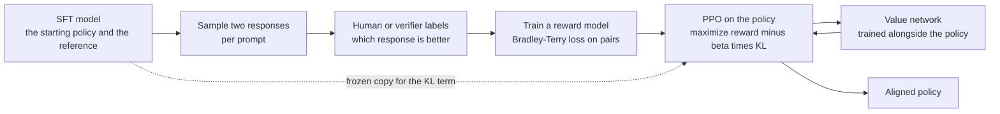
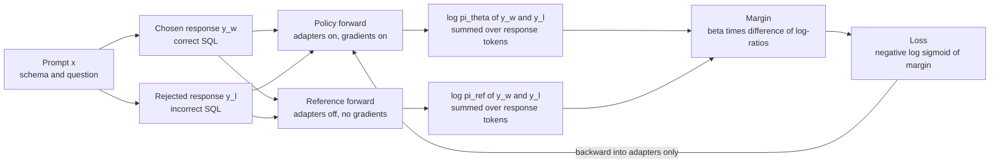
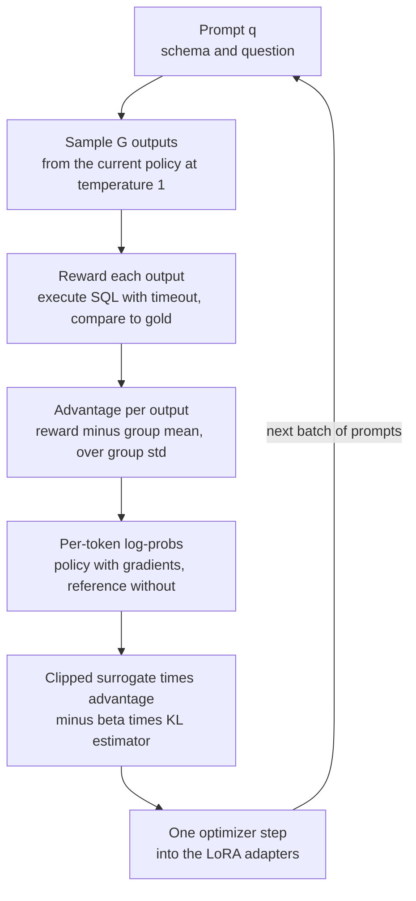
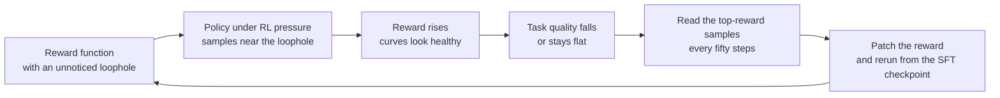
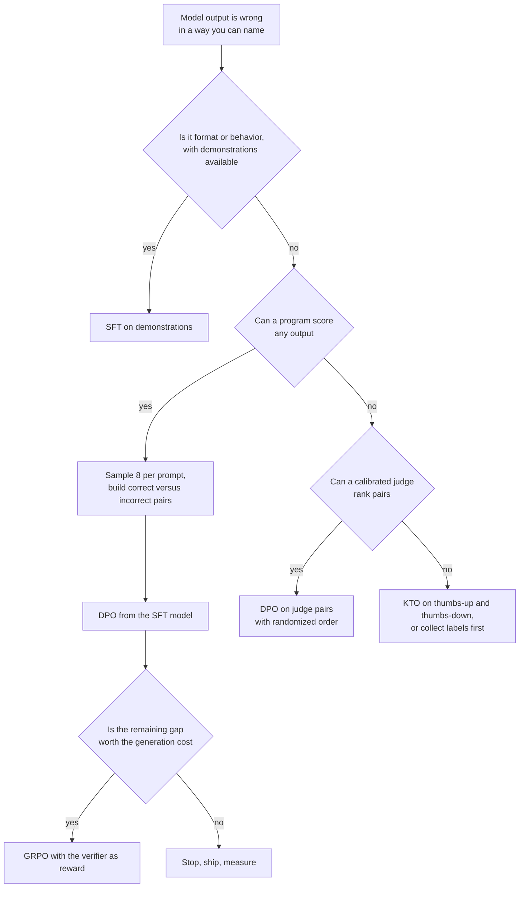

# Chapter 8: Preference Optimization and Reinforcement Learning

> **What you will be able to do:** derive the DPO loss from the KL-regularized RLHF objective and explain every symbol in it; build an on-policy preference dataset for text-to-SQL and train DPO under QLoRA on 8 GB; compute GRPO advantages by hand and implement the clipped objective with its KL penalty; design a verifiable SQL reward, predict how a policy will exploit it, and close the loophole; read reward, KL, length, and entropy curves and decide whether a run is healthy.
> **Where it is used:** P1.3 directly. The reward-design and curve-reading skills return in P3.1 (the data flywheel) and P4.1 (agent evaluation).
> **Prerequisites:** Chapter 3 (training dynamics, AdamW, mixed precision), Chapter 7 (SFT, LoRA, QLoRA, chat templates, completion-only loss).

## 8.0 The problem this chapter solves

You have finished P1.2. A Qwen2.5-1.5B model fine-tuned with LoRA on synthetic text-to-SQL data reaches, say, 62 percent execution accuracy on Spider dev, up from 45 percent for the base. You read two hundred failures. The mistakes are consistent: a join on the wrong key, a missing GROUP BY when the question says "for each", a column chosen because its name resembles a word in the question. Adding more SFT data helps less each round, because SFT only ever shows the model a right answer. It never tells the model that the query it would have written is wrong.

You also have something most fine-tuning tasks lack: a verifier. For every training prompt there is a database and a gold result set, so any candidate query can be executed and checked in milliseconds. The question this chapter answers is how to turn that verifier into a training signal.

Two families do it. Preference optimization samples candidates from the model, labels pairs (a correct query beats an incorrect one), and trains on the comparisons. Direct Preference Optimization (DPO) does this with a classification-style loss and no reward model. Reinforcement learning with verifiable rewards samples a group of candidates per prompt, scores each with the verifier, and raises the probability of the above-average ones. Group Relative Policy Optimization (GRPO) does this without a value network, which is what makes it fit on a laptop GPU.

The chapter aims at three things. The mathematics, well enough that you can defend a choice of beta or group size to a customer's data scientist. The implementation, well enough that both methods run on the RTX 4060 under PEFT. And the reward-hacking catalog, well enough that you recognize a hack in the first fifty samples rather than after an overnight run.

## 8.1 Why SFT is not enough

SFT maximizes the log-likelihood of demonstrated responses. Write a prompt as $x$, a response as $y = (y_1, \dots, y_T)$, and the model's distribution as $\pi_\theta$. The SFT loss is $-\sum_t \log \pi_\theta(y_t \mid x, y_{<t})$, averaged over a dataset of pairs $(x, y)$. Three properties of this objective limit what it can teach.

First, it carries no negative signal. The gradient raises the probability of the demonstrated tokens and, through the softmax, lowers everything else uniformly. The model never learns that a specific plausible alternative is wrong. For text-to-SQL, the difference between `JOIN orders ON orders.customer_id = customers.id` and `JOIN orders ON orders.id = customers.id` is one token, and SFT has no mechanism to single out the second as an error the model actually makes.

Second, it trains on gold prefixes and never on the model's own. Every step conditions on the demonstration's first $t-1$ tokens. At inference the model conditions on its own earlier tokens, some of which are wrong, and it has never practiced recovering from them. This is exposure bias, and it is why a model that scores well on teacher-forced perplexity can still compound small errors into wrong queries.

Third, it rewards one form. A question usually has many correct queries. SFT pushes probability toward the single demonstrated string and away from equally correct alternatives, which wastes capacity and can lower the total probability of being correct.

Preference methods close the first gap: the loss compares two responses and pushes them apart. RL closes all three: the samples come from the current policy, so the model practices on its own prefixes, and any correct form earns the full reward. Both methods assume a decent starting point. If the SFT model produces zero correct queries out of eight for most prompts, no comparison and no group has any signal, so the ladder in the Phase 1 guide is the right order: SFT first, then preference or RL.

## 8.2 The RLHF pipeline

Reinforcement learning from human feedback (RLHF) is the pipeline that DPO and GRPO simplify. You need its objective and its optimum, because DPO is derived from them, and its cost, because that cost is the reason the simplifications exist.

### 8.2.1 Preference data and the Bradley-Terry model

The raw material is a set of triples $(x, y_w, y_l)$: a prompt, a preferred (winning) response $y_w$, and a dispreferred (losing) response $y_l$. The label says only which of the two is better. It does not say by how much.

The Bradley-Terry model (Bradley and Terry, 1952) turns a scalar score into a probability of preference. Assume each response has a latent reward $r(x, y)$. The model states

$$P(y_w \succ y_l \mid x) = \frac{\exp r(x, y_w)}{\exp r(x, y_w) + \exp r(x, y_l)} = \sigma\big(r(x, y_w) - r(x, y_l)\big),$$

where $\sigma(z) = 1 / (1 + e^{-z})$ is the logistic function and $y_w \succ y_l$ reads "$y_w$ is preferred to $y_l$". Dividing numerator and denominator by $\exp r(x, y_w)$ gives the second form. Only the difference of rewards matters, so adding any function of $x$ alone to $r$ leaves every preference probability unchanged. Keep that fact in mind. It is what lets the partition function cancel in the DPO derivation.

Worked example: if $r(x, y_w) = 2.3$ and $r(x, y_l) = 1.1$, the difference is 1.2 and $P(y_w \succ y_l) = \sigma(1.2) = 0.769$. A reward gap of 1 nat corresponds to about a 73 percent preference, a gap of 3 to about 95 percent.

### 8.2.2 The reward model loss

A reward model $r_\phi(x, y)$ with parameters $\phi$ is usually the SFT model with its language-model head replaced by a scalar head on the final token. It is trained by maximum likelihood under Bradley-Terry:

$$\mathcal{L}_{\mathrm{RM}}(\phi) = -\mathbb{E}_{(x, y_w, y_l) \sim \mathcal{D}} \Big[ \log \sigma\big(r_\phi(x, y_w) - r_\phi(x, y_l)\big) \Big].$$

This is binary cross-entropy on the reward difference. At initialization the difference is about zero and the loss is $\ln 2 \approx 0.693$. A reward model that separates every pair by 3 nats has loss about 0.049.

### 8.2.3 The KL-regularized objective and its closed-form optimum

The policy $\pi_\theta$ is then trained to maximize expected reward while staying close to a reference policy $\pi_{\mathrm{ref}}$, which is the SFT model:

$$\max_{\pi} \; \mathbb{E}_{x \sim \mathcal{D}, \, y \sim \pi(\cdot \mid x)} \big[ r(x, y) \big] - \beta \, \mathbb{D}_{\mathrm{KL}}\big[\pi(\cdot \mid x) \,\|\, \pi_{\mathrm{ref}}(\cdot \mid x)\big].$$

Here $\beta > 0$ is the KL coefficient and $\mathbb{D}_{\mathrm{KL}}[\pi \| \pi_{\mathrm{ref}}] = \sum_y \pi(y \mid x) \log \frac{\pi(y \mid x)}{\pi_{\mathrm{ref}}(y \mid x)}$. The penalty exists because a learned reward is only accurate near the data it was trained on. A policy that drifts far from $\pi_{\mathrm{ref}}$ finds inputs where the reward model is wrong and exploits them.

This objective has a closed-form optimum, and the derivation is short enough to do in full. Fix one prompt $x$ and treat $\pi(\cdot \mid x)$ as a distribution over all possible responses. The objective for that prompt is

$$J(\pi) = \sum_y \pi(y \mid x) \, r(x, y) - \beta \sum_y \pi(y \mid x) \log \frac{\pi(y \mid x)}{\pi_{\mathrm{ref}}(y \mid x)}.$$

Define the partition function and a candidate distribution:

$$Z(x) = \sum_y \pi_{\mathrm{ref}}(y \mid x) \exp\!\big(r(x, y) / \beta\big), \qquad \pi^*(y \mid x) = \frac{1}{Z(x)} \, \pi_{\mathrm{ref}}(y \mid x) \exp\!\big(r(x, y) / \beta\big).$$

$Z(x)$ is the normalizer that makes $\pi^*$ sum to one. Taking logarithms of the definition of $\pi^*$ and rearranging gives an expression for the reward:

$$r(x, y) = \beta \log \frac{\pi^*(y \mid x)}{\pi_{\mathrm{ref}}(y \mid x)} + \beta \log Z(x).$$

Substitute this into $J(\pi)$. The $\beta \log Z(x)$ term does not depend on $y$, so it comes out of the sum as $\beta \log Z(x)$ times $\sum_y \pi(y \mid x) = 1$:

$$J(\pi) = \beta \log Z(x) + \beta \sum_y \pi(y \mid x) \log \frac{\pi^*(y \mid x)}{\pi_{\mathrm{ref}}(y \mid x)} - \beta \sum_y \pi(y \mid x) \log \frac{\pi(y \mid x)}{\pi_{\mathrm{ref}}(y \mid x)}.$$

The two sums share the $\pi_{\mathrm{ref}}$ denominator, which cancels when they are combined:

$$J(\pi) = \beta \log Z(x) - \beta \sum_y \pi(y \mid x) \log \frac{\pi(y \mid x)}{\pi^*(y \mid x)} = \beta \log Z(x) - \beta \, \mathbb{D}_{\mathrm{KL}}\big[\pi \,\|\, \pi^*\big].$$

$Z(x)$ does not depend on $\pi$, and KL divergence is non-negative with equality only when the two distributions are identical. So $J$ is maximized exactly when $\pi = \pi^*$:

$$\pi^*(y \mid x) \propto \pi_{\mathrm{ref}}(y \mid x) \exp\!\big(r(x, y) / \beta\big).$$

The optimal policy reweights the reference by an exponential of the reward. Small $\beta$ sharpens the reweighting, large $\beta$ keeps the policy close to the reference. The practical problem is that $Z(x)$ sums over every possible response, so $\pi^*$ cannot be evaluated directly. RLHF approaches it with policy-gradient RL. DPO avoids evaluating $Z(x)$ altogether.

### 8.2.4 PPO in outline, and why it is heavy

Proximal Policy Optimization (PPO, Schulman et al., 2017) is the RL algorithm used by the original RLHF work. It treats each generated token as an action, each prefix as a state, and optimizes a clipped surrogate objective:

$$L^{\mathrm{CLIP}}(\theta) = \mathbb{E}_t \Big[ \min\big( \rho_t(\theta) \hat{A}_t, \; \mathrm{clip}(\rho_t(\theta), 1 - \epsilon, 1 + \epsilon) \, \hat{A}_t \big) \Big], \qquad \rho_t(\theta) = \frac{\pi_\theta(a_t \mid s_t)}{\pi_{\theta_{\mathrm{old}}}(a_t \mid s_t)}.$$

Here $\rho_t$ is the probability ratio between the current policy and the policy that generated the sample, $\hat{A}_t$ is an estimate of the advantage of token $a_t$ (how much better it was than expected), and $\epsilon$ (typically 0.2) bounds how far one update can move the ratio. The advantage is estimated with a value network $V_\psi(s_t)$ and generalized advantage estimation (GAE): $\hat{A}_t = \sum_{l \ge 0} (\gamma \lambda)^l \delta_{t+l}$ with $\delta_t = r_t + \gamma V_\psi(s_{t+1}) - V_\psi(s_t)$, where $\gamma$ and $\lambda$ are discount factors. In RLHF the per-token reward $r_t$ is the negative KL term $-\beta(\log \pi_\theta(a_t \mid s_t) - \log \pi_{\mathrm{ref}}(a_t \mid s_t))$ at every position, plus the reward model's score added at the final token.

The cost is four models: the policy (trained), the reference (frozen, for the KL), the reward model (frozen, scores samples), and the value network (trained, usually the same size as the policy). For a 7B policy in bf16 that is about 56 GB of weights before optimizer states and activations. Add the sensitivity of PPO to the learning rate, the clip range, the value loss coefficient, and the GAE parameters, and you have a method that is rarely worth running for a customer project. Everything in the rest of this chapter keeps the objective of section 8.2.3 and removes machinery.



*Figure 8.1: The classical RLHF pipeline holds four models in memory during PPO: policy, reference, reward model, and value network.*

## 8.3 DPO, derived

Direct Preference Optimization (Rafailov et al., 2023) observes that the optimum in section 8.2.3 can be inverted: given any policy, there is a reward for which that policy is optimal. Training the policy on preference pairs with the Bradley-Terry likelihood then trains the reward implicitly. The reward model and the RL loop disappear.

### 8.3.1 Solving the optimum for the reward

From section 8.2.3, at the optimum,

$$r(x, y) = \beta \log \frac{\pi^*(y \mid x)}{\pi_{\mathrm{ref}}(y \mid x)} + \beta \log Z(x).$$

This holds for every response $y$ of the same prompt $x$, with the same $Z(x)$.

### 8.3.2 Substituting into Bradley-Terry so the partition function cancels

The Bradley-Terry probability depends on the reward difference of two responses to the same prompt:

$$P(y_w \succ y_l \mid x) = \sigma\big(r(x, y_w) - r(x, y_l)\big).$$

Substitute the reward expression for both responses. The $\beta \log Z(x)$ terms are identical and subtract to zero:

$$r(x, y_w) - r(x, y_l) = \beta \log \frac{\pi^*(y_w \mid x)}{\pi_{\mathrm{ref}}(y_w \mid x)} - \beta \log \frac{\pi^*(y_l \mid x)}{\pi_{\mathrm{ref}}(y_l \mid x)}.$$

The intractable normalizer is gone. Every remaining quantity is a log-probability of a specific response under a specific model, which a single forward pass computes.

### 8.3.3 The loss and the implicit reward

Replace the unknown optimal policy $\pi^*$ with the parameterized policy $\pi_\theta$ and maximize the likelihood of the observed preferences. The DPO loss is

$$\mathcal{L}_{\mathrm{DPO}}(\theta) = -\mathbb{E}_{(x, y_w, y_l) \sim \mathcal{D}} \left[ \log \sigma\!\left( \beta \log \frac{\pi_\theta(y_w \mid x)}{\pi_{\mathrm{ref}}(y_w \mid x)} - \beta \log \frac{\pi_\theta(y_l \mid x)}{\pi_{\mathrm{ref}}(y_l \mid x)} \right) \right].$$

Each $\log \pi(y \mid x)$ is the sum of per-token log-probabilities over the response tokens only, exactly the quantity completion-only SFT computes (Chapter 7). The quantity

$$\hat{r}_\theta(x, y) = \beta \log \frac{\pi_\theta(y \mid x)}{\pi_{\mathrm{ref}}(y \mid x)}$$

is the implicit reward: how much more probable the policy finds $y$ than the reference does, scaled by $\beta$. The loss is the reward-model loss of section 8.2.2 with $\hat{r}_\theta$ in place of $r_\phi$. Training the policy is training a reward model whose optimal policy is the policy itself. The title of the DPO paper says this: the language model is secretly a reward model.

### 8.3.4 Worked example

Take one pair with $\beta = 0.1$. Suppose the summed response log-probabilities are:

| Quantity | Chosen $y_w$ | Rejected $y_l$ |
|---|---|---|
| $\log \pi_\theta(y \mid x)$ | $-42.0$ | $-50.0$ |
| $\log \pi_{\mathrm{ref}}(y \mid x)$ | $-45.0$ | $-48.0$ |
| Log-ratio $\log \pi_\theta - \log \pi_{\mathrm{ref}}$ | $+3.0$ | $-2.0$ |
| Implicit reward $\hat{r}_\theta = \beta \times$ log-ratio | $+0.30$ | $-0.20$ |

The margin is $\hat{r}_\theta(x, y_w) - \hat{r}_\theta(x, y_l) = 0.50$. The loss is $-\log \sigma(0.50) = -\log(0.6225) = 0.474$. At initialization, when $\pi_\theta = \pi_{\mathrm{ref}}$, every log-ratio is zero, the margin is zero, and the loss is $-\log \sigma(0) = \ln 2 = 0.693$. A run whose loss starts noticeably away from 0.693 has a reference-model mismatch (section 8.3.7).

Two diagnostics come from the same numbers. The reward accuracy is the fraction of pairs where $\hat{r}_\theta(x, y_w) > \hat{r}_\theta(x, y_l)$, here 1 for this pair. The reward margin is the mean of the difference, here 0.50. Both are logged by TRL's DPO trainer under names like `rewards/accuracies` and `rewards/margins` (names vary by version).

### 8.3.5 The gradient and what it means

Write $u = \hat{r}_\theta(x, y_w) - \hat{r}_\theta(x, y_l)$ for the margin. Since $\frac{d}{du}[-\log \sigma(u)] = -(1 - \sigma(u)) = -\sigma(-u)$, and the reference terms are constant in $\theta$,

$$\nabla_\theta \mathcal{L}_{\mathrm{DPO}} = -\beta \, \mathbb{E} \Big[ \underbrace{\sigma\big(\hat{r}_\theta(x, y_l) - \hat{r}_\theta(x, y_w)\big)}_{\text{weight}} \Big( \nabla_\theta \log \pi_\theta(y_w \mid x) - \nabla_\theta \log \pi_\theta(y_l \mid x) \Big) \Big].$$

Read it in three parts. The direction raises the log-probability of the chosen response and lowers that of the rejected one, as an SFT step on $y_w$ paired with an "anti-SFT" step on $y_l$. The weight $\sigma(\hat{r}_l - \hat{r}_w)$ is large when the implicit reward model currently ranks the pair wrongly and shrinks toward zero once the pair is separated by a comfortable margin. In the worked example the weight is $\sigma(-0.50) = 0.378$. A pair the model already gets right by a margin of 3 has weight $\sigma(-3) = 0.047$ and contributes little. The factor $\beta$ scales the whole gradient, which is one reason DPO learning rates are ten to fifty times smaller than SFT learning rates for the same model (around 5e-6 for a LoRA DPO run versus 2e-4 for LoRA SFT).

The weighting is what distinguishes DPO from the naive alternative of maximizing $\log \pi_\theta(y_w) - \log \pi_\theta(y_l)$ without a sigmoid. The naive objective is unbounded and keeps pushing already-separated pairs, which degenerates the model. The DPO weight self-limits.

### 8.3.6 The role of beta

$\beta$ converts log-probability ratios into rewards. For the loss to fall from 0.693 to 0.1, the margin $u$ must reach $\sigma^{-1}(e^{-0.1}) = \sigma^{-1}(0.905) \approx 2.25$. With $\beta = 0.1$ that requires the log-ratio difference between chosen and rejected to reach 22.5 nats. With $\beta = 0.5$ it requires only 4.5 nats. So a smaller $\beta$ demands a larger movement of the policy away from the reference to achieve the same loss, which is why smaller $\beta$ means more drift and larger $\beta$ means a more conservative update. The usual starting point is 0.1. Values from 0.01 to 0.5 appear in practice. Lower it if the policy barely changes after an epoch (reward margins stay below about 0.5). Raise it if the model's outputs degrade in ways the pairs do not measure, such as longer or repetitive responses, which is drift the KL term should have prevented.

### 8.3.7 The reference model under PEFT

Under LoRA or QLoRA the reference is obtained for free: run the same model with the adapters disabled. No second copy of the weights is needed, and the reference log-probabilities can either be computed on the fly in a no-gradient forward pass or precomputed once for the whole dataset. This is why DPO on the 4060 costs little more than SFT.

One trap. "Adapters disabled" gives the frozen weights, whatever they are. If you load the base model, attach the SFT adapter from P1.2, and add a second adapter for DPO, then disabling all adapters yields the base model, not the SFT model, and the reference is wrong: the initial loss will not be $\ln 2$ and the KL anchor pulls toward a model that does not know the task. Merge the SFT adapter into the weights first (Chapter 7's merge routine), quantize if you need QLoRA, then attach a fresh adapter for DPO. Now the frozen weights are the SFT model, and adapters-disabled is the right reference.



*Figure 8.2: One DPO step runs the chosen and rejected responses through the policy with gradients and through the adapters-disabled reference without, then forms the margin.*

## 8.4 DPO's cousins: ORPO, SimPO, KTO, IPO

Which preference method is best is contested and evolving. Results depend on the base model, the data, and how carefully each method's hyperparameters were tuned. The practical default is DPO with $\beta = 0.1$ on on-policy pairs. The variants below each drop something and help in specific situations.

**ORPO** (Hong et al., 2024, "ORPO: Monolithic Preference Optimization without Reference Model") drops the reference model and the separate SFT stage. Its loss is the SFT negative log-likelihood on the chosen response plus a weighted odds-ratio term $-\lambda \log \sigma\big(\log \frac{\mathrm{odds}_\theta(y_w \mid x)}{\mathrm{odds}_\theta(y_l \mid x)}\big)$, where $\mathrm{odds}_\theta(y \mid x) = \frac{P_\theta(y \mid x)}{1 - P_\theta(y \mid x)}$ and $P_\theta$ is the length-normalized (per-token geometric mean) probability. The SFT term keeps the chosen response likely while the odds term separates the pair. It helps when you want one training stage from the base model and when memory forbids a reference forward pass. Its weakness is that without a reference anchor, drift is controlled only by the SFT term.

**SimPO** (Meng et al., 2024, "SimPO: Simple Preference Optimization with a Reference-Free Reward") replaces the implicit reward with the length-normalized policy log-probability, $\frac{\beta}{|y|} \log \pi_\theta(y \mid x)$, and adds a target margin $\gamma$: the loss is $-\log \sigma\big(\frac{\beta}{|y_w|} \log \pi_\theta(y_w \mid x) - \frac{\beta}{|y_l|} \log \pi_\theta(y_l \mid x) - \gamma\big)$. No reference model. The length normalization directly counters the tendency of DPO to favor longer responses when chosen responses happen to be longer. It helps when your pairs have a length imbalance and memory is tight. It is more sensitive to the learning rate than DPO, because nothing anchors it.

**KTO** (Ethayarajh et al., 2024, "KTO: Model Alignment as Prospect Theoretic Optimization") drops the requirement for pairs. Each example is a prompt, a response, and a binary label, desirable or undesirable. The loss applies a prospect-theory value function to the implicit reward relative to a reference point $z_0$, which is an estimate of the current KL between policy and reference computed over the batch: desirable examples contribute $\lambda_D \big(1 - \sigma(\beta(\hat{r}_\theta - z_0))\big)$ and undesirable ones $\lambda_U \big(1 - \sigma(\beta(z_0 - \hat{r}_\theta))\big)$, with $\lambda_D, \lambda_U$ balancing the two classes. It helps when your production logs have thumbs-up and thumbs-down on single responses but no comparisons, which is the common case in P3.1.

**IPO** (Azar et al., 2023, "A General Theoretical Paradigm to Understand Learning from Human Preferences") drops the Bradley-Terry assumption and replaces the log-sigmoid with a squared loss toward a fixed margin: $\big(h_\theta(y_w, y_l) - \frac{1}{2\tau}\big)^2$ with $h_\theta = \log \frac{\pi_\theta(y_w \mid x) \, \pi_{\mathrm{ref}}(y_l \mid x)}{\pi_\theta(y_l \mid x) \, \pi_{\mathrm{ref}}(y_w \mid x)}$ and $\tau$ a regularization strength. When preferences are deterministic (the chosen response is always correct and the rejected always wrong, as in verifier-labeled text-to-SQL pairs), DPO's loss keeps pushing the margin toward infinity, since the Bradley-Terry likelihood is maximized only in the limit. IPO targets a finite margin, so it overfits less on deterministic data. It helps when your pairs are clean and your dataset is small.

For P1.3 the guide asks for DPO plus one of ORPO or SimPO. Run the second one on the same pairs, record peak memory (no reference forward) and the Spider dev accuracy with a paired interval, and you have a first-hand comparison to quote.

## 8.5 Building preference data

The pairs decide what DPO learns. Four rules, each with a reason.

Sample on-policy. Generate candidates from the model you are about to train, not from a different model. Off-policy pairs from a stronger model teach the policy to imitate text it does not produce, which moves it far from the reference and inflates the KL for little gain. The P1.3 recipe is eight candidates per prompt from the SFT model at temperature 0.8, for about two thousand prompts, giving sixteen thousand candidates.

Score with the verifier first. Execute every candidate against the prompt's database with a timeout and compare the result set to the gold result set. This gives a binary correct label that is free of judge bias. Pairs of the form correct versus incorrect are the highest-value pairs. Build them first, one or two per prompt, choosing the incorrect candidate that executed without error when possible, because it is the closer and more informative negative.

Use a judge only for ties, with randomized order. When several candidates are correct, a judge can rank them on secondary qualities such as readability or unnecessary complexity. Present the two candidates in random order and record the position, because judges prefer the first position at measurable rates (Chapter 11). Calibrate the judge against your own labels before trusting its pairs. Pairs where both responses are correct and the judge's preference is noise teach the model the judge's biases, not the task.

Discard uninformative prompts. If all eight candidates are correct, the model already knows this prompt and a pair teaches nothing except whatever noise separates the two chosen strings. If all eight are incorrect, there is no positive to learn from. Both cases go into the log as counts (they measure how hard the prompt set is for the model) and out of the training set.

A worked count. Suppose that of 2,000 prompts, 350 have all eight candidates correct, 600 have none correct, and 1,050 have between one and seven correct. The 350 and the 600 are discarded, and both counts go in the log as the difficulty profile of the prompt set against this model. The 1,050 mixed prompts each yield at least one correct-versus-incorrect pair. Taking two per prompt where possible, with two different incorrect candidates against the same chosen one, gives about 2,000 verifier-labeled pairs. Among prompts with two or more correct candidates, a judge tie-break adds at most one pair per prompt, perhaps 400 more. Keep those in a separate split so that you can train with and without them and measure the difference on Spider dev. The result is a pair set of about 2,000 to 2,400 for one epoch of DPO, which is the size the P1.3 budget assumes.

Two checks before training. Compare the length distributions of chosen and rejected responses. If chosen responses are systematically longer, DPO will learn length, and you should either balance the pairs or use SimPO. And confirm that no prompt's database appears in Spider dev, the same leakage check as Chapter 7.

## 8.6 Reinforcement learning with verifiable rewards

When a program can score a response, the reward model is unnecessary. This setting is called reinforcement learning with verifiable rewards (RLVR, the term used by Lambert et al., 2024, in the Tülu 3 report). Text-to-SQL, code with unit tests, mathematics with a checkable final answer, structured extraction against a schema, and tool-call generation against an executable API all qualify. DeepSeek's R1 report (DeepSeek-AI, 2025) showed that rule-based rewards on such tasks, with GRPO, are enough to train reasoning behavior into a base model.

The advantages over a learned reward: no reward-model training data, no reward-model errors to exploit, and no drift in what the reward means over training. The remaining risk is that the verifier itself has loopholes, and a policy under RL pressure will find them. Section 8.8 catalogs the loopholes for SQL.

The reward is a function $r(x, o)$ from a prompt and a sampled output to a scalar. For SQL it will combine correctness, partial credit for a query that executes with the right shape, a small format term, a length penalty, and a hard rule that timeouts and errors score zero. The exact weights are yours to set. Section 8.8 gives the reasoning and Listing 8.3 gives one concrete function.

## 8.7 GRPO

Group Relative Policy Optimization (Shao et al., 2024, "DeepSeekMath: Pushing the Limits of Mathematical Reasoning in Open Language Models") removes PPO's value network by estimating the baseline from a group of samples for the same prompt. Since every sample in the group shares the prompt, the group mean reward is an estimate of the expected reward of the current policy on that prompt, which is exactly what the value network was for.

### 8.7.1 Group sampling and the group-normalized advantage

For each prompt $q$, sample $G$ outputs $o_1, \dots, o_G$ from the current policy $\pi_{\theta_{\mathrm{old}}}$ and score each with the reward function to get $r_1, \dots, r_G$. The advantage of output $i$ is its reward standardized within the group:

$$\hat{A}_i = \frac{r_i - \mathrm{mean}(r_1, \dots, r_G)}{\mathrm{std}(r_1, \dots, r_G)}.$$

Under outcome supervision (one reward per output, the case for SQL) the same $\hat{A}_i$ is assigned to every token $t$ of output $i$: $\hat{A}_{i,t} = \hat{A}_i$. The advantages within a group sum to zero, so a group always produces both positive and negative signals when the rewards differ. Standardizing by the group's standard deviation puts every group on the same scale regardless of whether its rewards were spread over 0 to 1 or 0.3 to 0.4. Implementations add a small $\epsilon$ (TRL uses $10^{-4}$) to the standard deviation so that a group with identical rewards produces zero advantages rather than a division by zero.

Whether the standard deviation uses $G$ or $G - 1$ in its denominator varies by implementation. The DeepSeekMath paper writes "std" without specifying. PyTorch's `torch.std` defaults to the unbiased $G - 1$ form, which is what TRL inherits. The difference is a constant factor of $\sqrt{G / (G-1)}$, about 1.07 for $G = 8$, and is absorbed by the learning rate. Later work (Liu et al., circa 2025, "Understanding R1-Zero-Like Training: A Critical Perspective", the Dr. GRPO variant) argues for dropping the standard deviation altogether, because dividing by a small standard deviation amplifies the update on prompts where the group is nearly unanimous. Both forms are in use. Start with the standardized form the paper used and know the option exists.

### 8.7.2 Worked advantage computation for a group of 8

Take a text-to-SQL reward that gives 1.0 for a correct result, 0.3 for a query that executed with the right column count but the wrong rows, 0.0 for an error or timeout, plus 0.1 for a clean fenced SQL block. Suppose a group of $G = 8$ samples for one prompt scores:

$$r = (1.1, \; 0.4, \; 0.1, \; 1.1, \; 0.0, \; 0.4, \; 0.1, \; 0.1).$$

Two samples are correct with clean format, two executed with the wrong rows, three failed but were well formatted, one failed with no clean block.

Mean: $\sum r_i = 3.3$, so $\bar{r} = 3.3 / 8 = 0.4125$.

Deviations $r_i - \bar{r}$: $(0.6875, -0.0125, -0.3125, 0.6875, -0.4125, -0.0125, -0.3125, -0.3125)$.

Squared deviations: $(0.4727, 0.0002, 0.0977, 0.4727, 0.1702, 0.0002, 0.0977, 0.0977)$, summing to $1.4088$.

Standard deviation with the $G - 1 = 7$ denominator: $\sqrt{1.4088 / 7} = \sqrt{0.2013} = 0.4486$. (With $G = 8$: $\sqrt{0.1761} = 0.4196$.)

Advantages $\hat{A}_i = (r_i - \bar{r}) / 0.4486$:

| Sample | Reward | Deviation | Advantage |
|---|---|---|---|
| 1 | 1.1 | +0.6875 | +1.53 |
| 2 | 0.4 | $-0.0125$ | $-0.03$ |
| 3 | 0.1 | $-0.3125$ | $-0.70$ |
| 4 | 1.1 | +0.6875 | +1.53 |
| 5 | 0.0 | $-0.4125$ | $-0.92$ |
| 6 | 0.4 | $-0.0125$ | $-0.03$ |
| 7 | 0.1 | $-0.3125$ | $-0.70$ |
| 8 | 0.1 | $-0.3125$ | $-0.70$ |

The sum of advantages is zero to rounding. Read the table as the policy will. The two correct queries are pushed up hard. The two executes-but-wrong queries sit almost exactly at the group mean and are left nearly alone, because in this group "executes with the right shape" is average behavior. The three formatted failures are pushed down, and the unformatted failure is pushed down hardest. The same 0.4 reward in a group where everything else scored 1.1 would receive a strongly negative advantage. Advantages are relative to the group, never absolute.

### 8.7.3 The clipped surrogate with the KL penalty

The GRPO objective, in the form DeepSeekMath states it, is

$$\mathcal{J}_{\mathrm{GRPO}}(\theta) = \mathbb{E}_{q, \{o_i\}} \left[ \frac{1}{G} \sum_{i=1}^{G} \frac{1}{|o_i|} \sum_{t=1}^{|o_i|} \Big( \min\big( \rho_{i,t} \hat{A}_{i,t}, \; \mathrm{clip}(\rho_{i,t}, 1 - \epsilon, 1 + \epsilon) \hat{A}_{i,t} \big) - \beta \, \mathbb{D}_{i,t} \Big) \right],$$

with the per-token probability ratio

$$\rho_{i,t} = \frac{\pi_\theta(o_{i,t} \mid q, o_{i,<t})}{\pi_{\theta_{\mathrm{old}}}(o_{i,t} \mid q, o_{i,<t})}$$

and the per-token KL penalty $\mathbb{D}_{i,t}$ defined in the next subsection. The symbols: $q$ is the prompt, $o_i$ the $i$-th sampled output of length $|o_i|$ tokens, $o_{i,t}$ its $t$-th token, $\pi_{\theta_{\mathrm{old}}}$ the policy that generated the samples, $\epsilon$ the clip range (0.2 in the paper), and $\beta$ the KL coefficient (0.04 in the paper). The objective is maximized, so the loss is its negative.

The clipped minimum is PPO's trust region: if the ratio has already moved past $1 \pm \epsilon$ in the direction the advantage favors, the gradient is cut off for that token. When each batch of samples is used for exactly one gradient step (TRL's default `num_iterations = 1`), $\pi_\theta = \pi_{\theta_{\mathrm{old}}}$ at the time of the update, every ratio equals one, the clip never activates, and the gradient of the surrogate reduces to the plain policy gradient $\hat{A}_i \nabla_\theta \log \pi_\theta(o_{i,t} \mid \cdot)$. The clipping matters when the same samples are reused for several steps to amortize the cost of generation.

The $1 / |o_i|$ factor averages over tokens within each output before averaging over the group. It has a side effect worth knowing. A wrong output with negative advantage is penalized by $\hat{A}_i$ in total, spread over its tokens. A longer wrong output spreads the same total penalty thinner per token, so the gradient signal against each of its tokens is weaker. This is a length bias toward long incorrect responses, one of the points the Dr. GRPO paper raises. If you see wrong responses growing longer while correct ones do not, this normalization is a candidate cause.

### 8.7.4 The KL estimator

PPO's RLHF variant put the KL into the per-token reward. GRPO instead adds it directly to the loss, using an unbiased per-token estimator rather than the plain log-ratio:

$$\mathbb{D}_{i,t} = \frac{\pi_{\mathrm{ref}}(o_{i,t} \mid q, o_{i,<t})}{\pi_\theta(o_{i,t} \mid q, o_{i,<t})} - \log \frac{\pi_{\mathrm{ref}}(o_{i,t} \mid q, o_{i,<t})}{\pi_\theta(o_{i,t} \mid q, o_{i,<t})} - 1.$$

Write $\rho = \pi_{\mathrm{ref}} / \pi_\theta$. The estimator is $\rho - \log \rho - 1$, which is non-negative for all $\rho > 0$ and zero only at $\rho = 1$, so a single token's estimate is never negative, unlike the plain $-\log \rho$. Its expectation under $\pi_\theta$ is $\mathbb{E}_{\pi_\theta}[\rho] - \mathbb{E}_{\pi_\theta}[\log \rho] - 1 = 1 + \mathbb{D}_{\mathrm{KL}}[\pi_\theta \| \pi_{\mathrm{ref}}] - 1$, so it is unbiased. This is the estimator John Schulman described in a 2020 blog post on approximating KL divergence, often labeled "k3".

Worked example: a token where $\log \pi_\theta = -1.2$ and $\log \pi_{\mathrm{ref}} = -1.5$. Then $\log \rho = -0.3$, $\rho = 0.7408$, and $\mathbb{D} = 0.7408 + 0.3 - 1 = 0.0408$. A token where the two agree exactly contributes zero. Over a response of 200 tokens with such disagreements, the summed KL is about 8 nats, and with $\beta = 0.04$ the penalty term is about 0.33, comparable to a typical advantage magnitude. That is the intended regime: the KL term should be visible but not dominant.

TRL's default $\beta$ for GRPO has changed between versions (the DeepSeekMath value of 0.04 in early releases, later a default of 0 with the reference model skipped entirely). Set it explicitly and check your version. With $\beta = 0$ there is no reference forward pass, which saves time and memory, and drift is controlled only by the clip range and the learning rate.

### 8.7.5 Why no value network, and what the group costs instead

The value network in PPO predicts the expected return from each prefix. In language generation with a single terminal reward, that prediction is hard to learn and adds a model the size of the policy. GRPO replaces it with the empirical mean of $G$ samples for the same prompt, which is an unbiased estimate of the same quantity at the prompt level. The memory saving is one full model plus its optimizer state, and the training loop loses a second loss and its hyperparameters.

The cost moves to generation. Each step needs $G$ complete samples per prompt, produced autoregressively. For $G = 8$ and 256-token responses that is 2048 generated tokens per prompt, and generation on a training framework's `generate` is far slower than a serving engine's. In practice generation is 50 to 80 percent of a GRPO step's wall time, which is why TRL supports offloading generation to a vLLM instance (colocated on the same GPU or on a separate one). Section 8.14 gives numbers for the 4060.

### 8.7.6 Sampling settings, sample reuse, and outcome versus process supervision

Samples are drawn at temperature 1.0 by default, because the group needs diversity for its rewards to differ, and a lower temperature narrows the group toward the policy's mode and raises the fraction of unanimous groups. The number of prompts per step times $G$ is the effective batch of completions, and it sets the variance of the gradient. Four prompts times eight samples is 32 completions per step, which is noisy but workable at 0.5B. DeepSeekMath used batches two orders of magnitude larger. The `num_iterations` setting ($\mu$ in the paper) reuses one generation batch for several optimizer steps. With $\mu > 1$ the ratio departs from one, the clip activates, and the clip fraction becomes a series worth logging. Reuse amortizes the generation cost at the price of a slightly off-policy update, which is what the clipping exists to make safe.

DeepSeekMath also describes process supervision, where a process reward model scores each reasoning step and a token's advantage is the sum of the normalized step rewards from its step onward. For text-to-SQL there is no natural step boundary inside a query and no process reward model, so outcome supervision with a single reward per completion is the right choice, and every token of a completion shares its advantage. The same holds for most verifier-scored tasks an FDE meets: the verifier judges the end state, not the path.



*Figure 8.3: One GRPO step. Generation and reward scoring happen before any gradient computation, and the group mean replaces the value network.*

## 8.8 Reward design for text-to-SQL and the reward-hacking catalog

A reward function is a specification, and the policy is an adversary that reads it more carefully than you did. Under RL pressure, any behavior that raises the reward without doing the task will be found if it is reachable from the current policy with a few tokens' change. This is reward hacking (Skalse et al., 2022, "Defining and Characterizing Reward Hacking" give a formal treatment). The reward design principle from the Phase 1 guide applies: dense enough to learn from, dominated by what you actually want.

### 8.8.1 The components

A text-to-SQL reward typically has five parts. Correctness: 1.0 if the executed result set matches the gold result set under your comparison semantics (set equality by default, list equality when the gold query has ORDER BY). Partial credit: a small value, 0.2 to 0.3, if the query executed and returned the right number of columns but the wrong rows, so that a policy that produces errors gets a gradient toward well-formed queries. Format: a small value, about 0.1, for exactly one fenced SQL block and nothing else, so that parsing at inference is reliable. Length: a penalty growing past a token budget, so the response does not fill with commentary. Hard failures: a timeout or an execution error scores zero, with no partial credit and no format credit.

The ordering of magnitudes matters more than the exact values. Correctness must dominate the sum of every other term, or the policy will optimize the other terms. A format term of 0.1 against a correctness term of 1.0 is safe. A format term of 0.5 will train a model that writes beautiful fences around wrong queries.

Worked example with the weights above (correct 1.0, right-shape partial 0.3, format 0.1, a length penalty of 0.2 per budget beyond 256 tokens, zero on any failure). Four completions to the same question. (a) A correct query in a clean block, 40 tokens: 1.0. (b) A clean block whose query executes and returns the right two columns but filters on the wrong year, 45 tokens: 0.3. (c) A clean block whose query references a column that does not exist, so execution fails: 0.0, with no format credit despite the clean block. (d) A correct query followed by three paragraphs explaining it, 420 tokens: the anchored regex fails because text follows the closing fence, so 0.0, not 1.0 minus a penalty. Case (d) is deliberate. Making the format rule a hard gate rather than a soft term keeps the parser at inference time simple. A soft version would score $1.0 - 0.2 \times (420 - 256) / 256 = 0.87$, which rewards the padding almost fully, and that is why the hard gate is the better default.

### 8.8.2 The catalog

| Hack | What the policy does | How it shows up | Fix |
|---|---|---|---|
| Partial-credit farming | Emits a query that always executes with a plausible shape, such as `SELECT id, name FROM customers LIMIT 5`, regardless of the question | Mean reward plateaus near the partial-credit value, correctness rate flat or falling | Partial credit only when the column count matches the gold and the result is non-empty, and keep it small, 0.2 or less |
| Empty-result matching | Learns that many gold results are empty on the dev database and emits a query with an impossible predicate | Correctness rises on prompts with empty gold results only | Drop or down-weight prompts whose gold result is empty, or evaluate on a second database instance with different data (test-suite accuracy, Zhong et al., 2020) |
| Format farming | Perfect fenced blocks around garbage, if the format term is too large | Format rate hits 100 percent early, correctness does not move | Format term at most a tenth of correctness, and no format credit on execution failure |
| Length games | Appends explanations, alternative queries, or restated schemas | Mean completion length climbs steadily while reward is flat | Penalty beyond a token budget, and a strict block regex that gives zero to anything after the closing fence |
| Multi-statement smuggling | Puts several candidate queries in one block, hoping the harness runs the one that matches | Blocks contain multiple semicolons | Reject more than one statement before executing, and use a driver that refuses multi-statement strings |
| Timeout stalling | Emits a query with a cross join that hangs the checker when a negative score would otherwise result | Reward step time explodes, some samples never return | A hard per-query timeout that scores zero, enforced by interrupting the connection from a timer, not by hoping the query finishes |
| Destructive SQL | Emits `DROP TABLE` or `DELETE` that changes the database so later gold results differ | Gold queries start failing on later steps | Read-only connection, statement allowlist, fresh database copy per step if any writes are possible |
| Order-insensitivity abuse | Adds `DISTINCT` or reorders rows because the comparator ignores order and duplicates | Correctness on ORDER BY questions rises without the ORDER BY clause | Compare as lists when the gold query orders, and count duplicates |
| Non-deterministic queries | Uses `RANDOM()` or unspecified ordering with LIMIT so the result sometimes matches | Reward for the same completion varies across runs | Execute twice and require identical results, or reject functions from a denylist |
| Group collapse | All G samples converge to one template, entropy falls, groups have zero variance | Fraction of groups with zero reward standard deviation climbs, advantages all zero | Raise the KL coefficient or lower the learning rate, sample at a higher temperature, increase G, mix in harder prompts |

Every row is something a policy has found or will find within a few hundred steps if the loophole exists. The P1.3 definition of done requires you to observe one and fix it. The fastest way to observe one is to read the twenty highest-reward completions every fifty steps. Curves tell you that something changed. Samples tell you what.



*Figure 8.4: The reward-hacking loop. The only reliable detector is reading samples, because the reward curve is the thing being gamed.*

## 8.9 Reading RL curves

Log at least five series every step: mean reward, mean KL to the reference, mean completion length, policy entropy over completion tokens (if the framework exposes it), and the fraction of groups whose reward standard deviation is zero. Add the correctness rate separately from the total reward, so that a rising total can be attributed to correctness or to the auxiliary terms. Add the clip fraction when `num_iterations` exceeds one.

A healthy run: reward rises, fastest in the first hundred steps and then more slowly. KL rises from zero, slows, and settles at a value that depends on $\beta$ and the learning rate (single digits of nats per response is typical with $\beta$ around 0.04). Length stays within a band, or shrinks slightly as the model stops explaining. Entropy falls gradually but not to near zero. The zero-variance fraction falls as the model learns prompts it used to fail uniformly, then rises again as it solves prompts uniformly.

The pathologies, each with its distinguishing signature:

| Signature | Meaning | Action |
|---|---|---|
| Reward rises, length explodes | Length or format hack | Read samples, add the length penalty, anchor the block regex |
| Reward rises, correctness flat | An auxiliary term is being farmed | Shrink the term, tighten its condition |
| KL rises without bound, reward flat or falling | Learning rate too high or $\beta$ too low, drifting into text the reference finds improbable | Lower the learning rate first, then raise $\beta$ |
| Reward flat, KL near zero | Learning rate too low, or the zero-variance fraction is near one because prompts are all too easy or all too hard | Check the zero-variance fraction, then rebalance prompt difficulty or raise the learning rate |
| Entropy near zero within 100 steps | Group collapse to one template | Higher temperature, higher $\beta$, lower learning rate, larger $G$ |
| Reward oscillates with large amplitude | Too few completions per step, noisy gradient | More prompts per step or more accumulation |
| Step time spikes, some steps stall | Queries hanging the checker | Verify the timeout is enforced by interrupting the connection |
| Correctness rises only on prompts with empty gold results | Empty-result matching | Filter those prompts or score on a second database instance |

Lower the learning rate before raising $\beta$ in the KL case, because a too-high learning rate also destabilizes the clipped update, and raising $\beta$ on top of it hides the symptom without fixing the cause.

For DPO, the analogous series are the loss, reward accuracy, reward margin, and the chosen and rejected implicit rewards separately. Healthy: loss falls from 0.693, accuracy climbs to 0.7 to 0.9 on a held-out pair set, margins grow. One pattern that alarms people and is usually benign: both the chosen and the rejected implicit rewards go negative, meaning the policy assigns lower probability to both responses than the reference does, with the margin still growing. This likelihood displacement is documented (Pal et al., 2024, "Smaug: Fixing Failure Modes of Preference Optimisation with DPO-Positive" propose a corrective term). It becomes a problem when generation quality drops. Check with a sample of generations and the execution-accuracy evaluation, not with the training series alone.

## 8.10 SFT versus DPO versus GRPO

| Dimension | SFT | DPO | GRPO |
|---|---|---|---|
| Data needed | Demonstrations, thousands | Preference pairs, hundreds to thousands, ideally on-policy | Prompts with a verifier, hundreds to thousands, no responses |
| Signal | Positive only | Comparative, offline | Scalar reward on the policy's own samples, online |
| Models in memory under PEFT | Policy | Policy, plus reference as adapters-off (no extra weights) | Policy, plus reference as adapters-off if $\beta > 0$ |
| Cost per example | One forward and backward on one sequence | Two forwards and one backward, on two sequences | G generations plus G forwards and backwards plus G reference forwards |
| Wall time dominated by | Training | Training | Generation |
| What it changes | Format, behavior, narrow skill | Which of two plausible outputs is preferred | Correctness on the verifier, at the margin |
| Main failure mode | Template mismatch, overfitting | Length bias, judge-noise pairs, wrong reference | Reward hacking, collapse, zero-variance groups |
| Use it when | Starting from a base or instruct model that lacks the format | A judge or verifier can rank pairs and you have a good SFT model | A program can score any output and you want the last points of correctness |



*Figure 8.5: Choosing among SFT, DPO, GRPO, and KTO from the signal that is available.*

The order for a text-to-SQL engagement is SFT, then DPO if the pairs are cheap (they are, with a verifier), then GRPO if the remaining gap is worth the generation cost. Evaluate each stage on the same held-out set with a paired bootstrap interval (Chapter 11). A gain that does not clear the interval is not a gain.

## 8.11 Compute and memory under PEFT

Both methods add to SFT's memory in specific places, and knowing which lets you predict what fits.

**DPO.** The policy forward runs on the chosen and rejected sequences concatenated, so the activation memory is that of an SFT step with twice the batch. The reference forward runs without gradients on the same sequences, and its peak is the no-grad forward of the same batch, which is smaller than the policy's peak and does not add to it because they happen sequentially. Under QLoRA the reference weights are the same quantized weights, so there is no second copy. The dominant term at long sequence lengths is the logits tensor: batch times sequence length times vocabulary, in fp32 for the log-softmax. For Qwen2.5-1.5B with its 151,936-token vocabulary, one pair at sequence length 1024 produces logits of $2 \times 1024 \times 151936 \times 4$ bytes, about 1.24 GB, and the log-softmax makes a second copy of the same size. That 2.5 GB is more than the quantized model weights. Frameworks avoid it by computing log-probabilities in chunks along the sequence, or by using a fused cross-entropy kernel that never materializes the full log-softmax (Unsloth and recent TRL versions do this). If you write your own loop, chunk.

**GRPO.** Generation holds the policy weights and a KV cache for $B \times G$ sequences, where $B$ is prompts per step. For Qwen2.5-0.5B (24 layers, 2 KV heads, head dimension 64) the KV cache is $2 \times 24 \times 2 \times 64 \times 2$ bytes, about 12 KB per token in bf16 (Chapter 4). For $B = 4$, $G = 8$, and 768 tokens of prompt plus completion, that is 32 sequences times 768 tokens times 12 KB, about 300 MB. The training forward then runs on those 32 sequences. If it runs them all at once, the logits are $32 \times 768 \times 151936 \times 4$ bytes, about 15 GB, which is impossible on any laptop. Frameworks micro-batch the training pass over completions (TRL's `per_device_train_batch_size` counts completions, not prompts) and compute logits only for the completion positions (`logits_to_keep`), so one micro-batch of 8 completions with 256 completion tokens has logits of $8 \times 256 \times 151936 \times 4$ bytes, about 1.24 GB. The reference forward, when $\beta > 0$, repeats the same micro-batch without gradients.

The LoRA adapters themselves are small in both cases. For Qwen2.5-1.5B with rank 16 on every linear projection (Chapter 7's count), about 18.5 million trainable parameters, which at about 16 bytes per parameter for weights, gradients, and two Adam moments is about 300 MB. For Qwen2.5-0.5B (hidden 896, 24 layers, intermediate 4,864, 2 KV heads) the same recipe gives about 8.8 million trainable parameters, about 150 MB. Weights dominate at 0.5B in bf16 (about 1 GB) and at 1.5B in NF4 (about 1.2 GB including the bf16 embedding and head), and activations and logits dominate everything else.

| Item | DPO, Qwen2.5-1.5B NF4, one pair at 1,024 tokens | GRPO, Qwen2.5-0.5B bf16, 8 completions per micro-batch |
|---|---|---|
| Frozen weights | about 1.2 GB | about 1.0 GB |
| Adapter weights, gradients, Adam moments | about 0.3 GB | about 0.15 GB |
| Checkpointed activations | under 0.3 GB | under 0.3 GB |
| Logits at the loss, fp32 | 1.24 GB unchunked, under 0.5 GB chunked | 1.24 GB for 256 completion positions |
| KV cache during generation | none | about 0.3 GB for 32 sequences of 768 tokens |
| CUDA context and allocator slack | 0.5 to 1 GB | 0.5 to 1 GB |
| Expected peak | 3 to 4 GB chunked, 5 to 6 GB unchunked | 4 to 5 GB |

Every entry is an estimate. The first fifty steps of a run, with peak memory logged, replace the table with a measurement.

## 8.12 Implementation notes

**Listing 8.1: The DPO loss and one training step in PyTorch.**

```python
import torch
import torch.nn.functional as F

def sequence_logps(logits, labels, mask):
    """Sum of log-probs of `labels` over positions where mask is 1.
    logits: [B, T, V] at positions that predict labels; labels, mask: [B, T]."""
    logp = torch.log_softmax(logits.float(), dim=-1)          # chunk this in production
    tok = torch.gather(logp, 2, labels.unsqueeze(-1)).squeeze(-1)
    return (tok * mask).sum(dim=-1)

def dpo_loss(pi_w, pi_l, ref_w, ref_l, beta=0.1):
    """pi_*, ref_*: sequence log-probs [B] under policy and reference."""
    chosen_reward = beta * (pi_w - ref_w)                      # implicit rewards
    rejected_reward = beta * (pi_l - ref_l)
    margin = chosen_reward - rejected_reward
    loss = -F.logsigmoid(margin).mean()
    accuracy = (margin > 0).float().mean()
    return loss, margin.detach().mean(), accuracy

def dpo_step(model, batch, beta=0.1):
    """model is a PEFT model. Reference = same model with adapters disabled."""
    ids = torch.cat([batch["chosen_ids"], batch["rejected_ids"]])       # [2B, T]
    resp = torch.cat([batch["chosen_resp_mask"], batch["rejected_resp_mask"]])
    labels, mask = ids[:, 1:], resp[:, 1:]                              # shift by one
    logits = model(input_ids=ids).logits[:, :-1]
    lp = sequence_logps(logits, labels, mask)
    with torch.no_grad(), model.disable_adapter():
        ref_logits = model(input_ids=ids).logits[:, :-1]
        rlp = sequence_logps(ref_logits, labels, mask)
    B = ids.shape[0] // 2
    return dpo_loss(lp[:B], lp[B:], rlp[:B], rlp[B:], beta)
```

The response mask is 1 on response tokens and 0 on prompt and padding tokens, the same mask completion-only SFT uses. It is shifted with the labels so that position $t$ of the logits is scored against token $t+1$. Concatenating chosen and rejected into one batch halves the number of forward passes and keeps their statistics identical for any normalization layer. The `disable_adapter` context is PEFT's mechanism for the adapters-off reference, and it only gives the right reference if the frozen weights are the SFT model (section 8.3.7). The `log_softmax` over the full vocabulary is the memory peak (section 8.11). A production version computes `F.cross_entropy(logits.view(-1, V), labels.view(-1), reduction="none")` in chunks of a few hundred positions, or uses a fused kernel.

**Listing 8.2: GRPO group advantages and the clipped loss with the KL estimator.**

```python
def group_advantages(rewards, G, eps=1e-4):
    """rewards: [B*G], samples of the same prompt contiguous. Returns [B*G]."""
    r = rewards.view(-1, G)
    mean = r.mean(dim=1, keepdim=True)
    std = r.std(dim=1, keepdim=True)                      # unbiased, G-1 denominator
    return ((r - mean) / (std + eps)).view(-1)            # all zero when the group agrees

def grpo_loss(logp, old_logp, ref_logp, adv, mask, eps_clip=0.2, beta=0.04):
    """Per-token log-probs [N, T] over completion positions (mask 1); adv: [N].
    With one optimizer step per generation batch, pass old_logp = logp.detach()."""
    ratio = torch.exp(logp - old_logp)                    # pi_theta / pi_old per token
    a = adv.unsqueeze(1)
    surrogate = torch.min(ratio * a,
                          torch.clamp(ratio, 1 - eps_clip, 1 + eps_clip) * a)
    log_rho = ref_logp - logp                             # log(pi_ref / pi_theta)
    kl = torch.exp(log_rho) - log_rho - 1                 # k3 estimator, >= 0
    per_token = -(surrogate - beta * kl)                  # maximize objective = minimize negative
    per_seq = (per_token * mask).sum(1) / mask.sum(1).clamp(min=1)   # 1/|o_i|
    return per_seq.mean()
```

`group_advantages` implements section 8.7.1 exactly, including the $\epsilon$ that makes unanimous groups contribute zero rather than NaN. In `grpo_loss`, when `old_logp` is `logp.detach()`, the ratio is one in value but still carries the gradient of `logp`, so the surrogate's gradient is $\hat{A}_i \nabla \log \pi_\theta$ and the clamp is inert. The KL term is the estimator of section 8.7.4 applied per token. The per-sequence mean followed by the batch mean reproduces the paper's normalization. To try the Dr. GRPO variant, drop the division by `std` and replace the per-sequence mean by a sum divided by a constant maximum length.

**Listing 8.3: A SQL execution reward with a hard timeout and a read-only connection.**

```python
import re, sqlite3, threading

SQL_BLOCK = re.compile(r"^\s*```sql\s*\n(.*?)\n```\s*$", re.DOTALL)
FORBIDDEN = re.compile(r"\b(INSERT|UPDATE|DELETE|DROP|ALTER|CREATE|ATTACH|PRAGMA|REPLACE)\b", re.I)

def run_sql(db_path, sql, timeout_s=2.0):
    conn = sqlite3.connect(f"file:{db_path}?mode=ro", uri=True)
    timer = threading.Timer(timeout_s, conn.interrupt)   # interrupt() is thread-safe
    timer.start()
    try:
        return "ok", conn.execute(sql).fetchall()
    except sqlite3.OperationalError as e:
        return ("timeout" if "interrupted" in str(e) else "error"), None
    except sqlite3.DatabaseError:
        return "error", None
    finally:
        timer.cancel()
        conn.close()

def sql_reward(completion, db_path, gold_rows, n_tokens, max_tokens=256):
    m = SQL_BLOCK.match(completion)
    if m is None:
        return 0.0                                       # no clean block, no credit at all
    sql = m.group(1).strip().rstrip(";")
    if ";" in sql or FORBIDDEN.search(sql) or not gold_rows:
        return 0.0                                       # multi-statement, write, or empty gold
    status, rows = run_sql(db_path, sql)
    if status != "ok":
        return 0.0                                       # timeouts and errors are failures
    reward = 0.1                                         # format term, deliberately small
    if rows and len(rows[0]) == len(gold_rows[0]):
        reward = 0.3                                     # executed with the right shape
    key = lambda r: repr(r)
    if sorted(map(tuple, rows), key=key) == sorted(map(tuple, gold_rows), key=key):
        reward = 1.0                                     # correctness dominates
    if n_tokens > max_tokens:
        reward -= 0.2 * (n_tokens - max_tokens) / max_tokens
    return max(reward, 0.0)
```

The regex anchors at both ends, so any text before the opening fence or after the closing fence yields zero, which closes the length and multi-answer hacks at the parser. The read-only URI and the statement denylist close the destructive-SQL hack. The timer calls `interrupt()` on the connection from another thread, which the `sqlite3` module documents as the supported way to abort a running query. A hung query raises an `OperationalError` mentioning "interrupted" and scores zero. Comparing sorted tuples gives set semantics with duplicates counted. Sorting by `repr` avoids Python's refusal to compare `None` with numbers. The comparison rule for ordered questions, the partial-credit value, and the length slope are the decisions that are yours. This function shows one defensible set of them.

## 8.13 Failure modes

| Symptom | Likely cause | How to confirm | Fix |
|---|---|---|---|
| DPO loss starts far from 0.693 | Reference is not the SFT model (adapters-off gives the raw base) | Compute the margin on the first batch before any step, it should be about zero | Merge the SFT adapter into the weights before attaching the DPO adapter |
| DPO accuracy climbs on training pairs, execution accuracy on Spider dev does not | Pairs carry judge noise or length bias, not correctness | Compare chosen and rejected length distributions, check judge kappa | Use only verifier-labeled pairs, or switch to SimPO, or balance lengths |
| DPO responses get longer and wordier | Chosen responses were longer on average | Length statistics of the pair set | Balance lengths, switch to SimPO, or raise $\beta$ to limit drift |
| Both implicit rewards go strongly negative and generations degrade | Likelihood displacement with a learning rate too high | Sample twenty generations at each checkpoint | Halve the learning rate, add an SFT term on the chosen response |
| GRPO reward flat, KL near zero | Learning rate too low, or nearly all groups have zero reward variance | Log the zero-variance fraction | Mix easier and harder prompts so groups disagree, raise G, raise the learning rate |
| GRPO reward rises, correctness flat | An auxiliary term is being farmed | Log correctness separately from total reward, read top samples | Shrink the farmed term, tighten its condition |
| GRPO completion length climbs steadily | Length hack, or the $1/\lvert o_i\rvert$ length bias on wrong answers | Plot length separately for correct and incorrect samples | Add the length penalty, tighten the block regex, consider the Dr. GRPO normalization |
| KL grows without bound | Learning rate too high or $\beta$ too low | KL series against step | Lower the learning rate first, then raise $\beta$ |
| Entropy collapses within 100 steps, one template everywhere | Group collapse | Zero-variance fraction near one, samples identical | Higher sampling temperature, higher $\beta$, lower learning rate |
| Step time varies wildly, some steps never finish | Queries hanging the checker | Time each reward call | Enforce the interrupt-based timeout of Listing 8.3 |
| Out of memory on the first GRPO training pass | Logits for all completions materialized at once | Peak memory versus $B G T V \times 4$ bytes | Reduce completions per micro-batch, keep logits only for completion positions |
| Gold queries start failing mid-run | A sampled query wrote to the database | Check the database file's modification time | Read-only connection and statement denylist |

## 8.14 On your machine

**DPO on the RTX 4060 (8 GB).** Target: Qwen2.5-1.5B with the P1.2 SFT adapter merged, quantized to NF4, a fresh rank-16 adapter on all linear projections, $\beta = 0.1$, learning rate about 5e-6, one epoch over about 2,000 verifier-labeled pairs, sequence length 1024, one pair per micro-step, gradient accumulation 16 for an effective batch of 16 pairs. Memory: about 1.2 GB for the NF4 weights with bf16 embeddings and head, about 0.3 GB for adapter weights, gradients, and optimizer state, under 0.3 GB of checkpointed activations with gradient checkpointing, and the logits. With chunked log-probabilities the logits stay under 0.5 GB and the run peaks around 3 to 4 GB. With an unchunked fp32 log-softmax the logits add about 2.5 GB and the run peaks around 5 to 6 GB, which still fits at sequence length 1024 but not at 2048. Time: each pair costs roughly a policy forward and backward plus a reference forward over 2,048 tokens. Using the 4060's bf16 tensor peak from Chapter 4 and an achieved utilization around 20 percent (QLoRA dequantization lowers it), expect on the order of 2 seconds per pair, so about an hour for the epoch. Treat that as an estimate to verify with a 50-step smoke test at full sequence length, which is the rule for any local run.

**GRPO at 0.5B on the RTX 4060.** Target: Qwen2.5-0.5B-Instruct (or your SFT of it) in bf16 with a rank-16 LoRA, $G = 8$, 4 prompts per step, 256 max completion tokens, prompts of about 512 tokens with the schema, learning rate 2e-6, $\beta = 0.04$, temperature 1.0, a few hundred steps. Memory: about 1 GB for weights, about 0.3 GB of KV cache during generation of 32 sequences, about 1.2 GB of logits per micro-batch of 8 completions if only completion positions are kept, plus activations. The run peaks around 4 to 5 GB. Time per step is dominated by generation: 256 sequential decode steps for a batch of 32 sequences on a 0.5B model, with the training framework's `generate`, take roughly 5 to 10 seconds. The training pass over 32 completions of about 768 total tokens is roughly 5 seconds, plus a reference pass when $\beta > 0$, plus 32 SQL executions that take milliseconds unless something hangs against the 2-second timeout. Expect 15 to 25 seconds per step, so 300 steps in about 1.5 to 2 hours, matching the guide's "a few hours". Start it before bed, and check the zero-variance fraction and the first fifty completions before you do.

**Colocated vLLM generation.** TRL can hand generation to a vLLM engine on the same GPU (`use_vllm=True` with colocate mode, check your version). vLLM reserves a fixed fraction of GPU memory for its weights and KV cache. On 8 GB with a 0.5B model, a fraction around 0.3 (about 2.4 GB) leaves about 5 GB for training and speeds generation several times. It is worth trying after the plain run works, not before, because it adds a second failure surface.

**Kaggle T4 (16 GB, fp16 only).** DPO on the 1.5B QLoRA configuration fits with room for sequence length 2048 or two pairs per micro-step. GRPO at 0.5B fits with $G = 16$. Both need fp16 with loss scaling (Chapter 3), and the KL and ratio computations must stay in fp32, which Listing 8.2 ensures by construction when `logp` is computed from `logits.float()`. The T4's lower memory bandwidth makes generation about twice as slow as on the 4060.

**Rented A100 (80 GB).** The optional 1.5B GRPO run: bf16 weights, LoRA or full fine-tuning, $G = 8$ to 16, 16 prompts per step, sequence length 1024 plus 512 completion tokens, vLLM colocated for generation. Steps of 10 to 20 seconds are realistic, so 500 steps in about 2 to 3 hours, at about $1.39 per hour as of September 2026 (verify), around $3 to $4 plus setup time. Checkpoint the adapter to the Hub every 50 steps and confirm the pod is stopped when the run ends.

## Exercises

**Exercise 8.1.** Starting from $\pi^*(y \mid x) = \frac{1}{Z(x)} \pi_{\mathrm{ref}}(y \mid x) \exp(r(x, y) / \beta)$, derive the DPO loss. State at which step the partition function disappears and why that step requires both responses to share the prompt.

<details><summary>Solution</summary>

Take logarithms: $\log \pi^*(y \mid x) = \log \pi_{\mathrm{ref}}(y \mid x) + r(x, y) / \beta - \log Z(x)$. Rearrange: $r(x, y) = \beta \log \frac{\pi^*(y \mid x)}{\pi_{\mathrm{ref}}(y \mid x)} + \beta \log Z(x)$. The Bradley-Terry model gives $P(y_w \succ y_l \mid x) = \sigma(r(x, y_w) - r(x, y_l))$. Substituting the reward for both responses, the difference is $\beta \log \frac{\pi^*(y_w \mid x)}{\pi_{\mathrm{ref}}(y_w \mid x)} - \beta \log \frac{\pi^*(y_l \mid x)}{\pi_{\mathrm{ref}}(y_l \mid x)} + \beta \log Z(x) - \beta \log Z(x)$. The partition function disappears at this subtraction, and only because $Z$ depends on $x$ alone: both responses answer the same prompt, so they share the same $Z(x)$. If the two responses had different prompts the terms would not cancel. Replacing $\pi^*$ with $\pi_\theta$ and taking the negative log-likelihood over the dataset gives $\mathcal{L}_{\mathrm{DPO}} = -\mathbb{E}[\log \sigma(\beta \log \frac{\pi_\theta(y_w \mid x)}{\pi_{\mathrm{ref}}(y_w \mid x)} - \beta \log \frac{\pi_\theta(y_l \mid x)}{\pi_{\mathrm{ref}}(y_l \mid x)})]$.
</details>

**Exercise 8.2.** A group of $G = 8$ samples scores $r = (1.0, 0.0, 0.0, 1.0, 0.0, 0.5, 0.0, 1.0)$. Compute the advantages using the $G - 1$ standard deviation. Which sample is treated as roughly average, and why does that make sense?

<details><summary>Solution</summary>

Sum 3.5, mean 0.4375. Deviations: $(0.5625, -0.4375, -0.4375, 0.5625, -0.4375, 0.0625, -0.4375, 0.5625)$. Squared: $(0.3164, 0.1914, 0.1914, 0.3164, 0.1914, 0.0039, 0.1914, 0.3164)$, sum $1.7188$. Variance $1.7188 / 7 = 0.2455$, standard deviation $0.4955$. Advantages: the three correct samples get $0.5625 / 0.4955 = +1.14$, the four failures get $-0.4375 / 0.4955 = -0.88$, and the partial-credit sample gets $0.0625 / 0.4955 = +0.13$. The partial-credit sample is near zero because 0.5 is close to the group mean of 0.4375. In a group where nearly half the samples are correct, "executed but wrong" is unremarkable, so the policy is barely nudged on it. The same sample in a group of seven failures would have a large positive advantage.
</details>

**Exercise 8.3.** Every sample in a group receives the same reward. What happens to the advantages, the gradient from that group, and the run if this is true for most groups? Give two causes and a fix for each.

<details><summary>Solution</summary>

The deviations are all zero, so the advantages are all zero (with the $\epsilon$ in the denominator) or undefined (without it). The surrogate term contributes no gradient from that group. Only the KL term contributes, and it pulls the policy toward the reference. If most groups are unanimous, the run makes no progress on the task and the KL stays near zero. Cause one: the prompts are too easy or too hard for the current policy, so every sample is correct or every sample fails. Fix: mix prompts of intermediate difficulty, measured by the SFT model's pass rate at eight samples, so that groups disagree. Cause two: the sampling temperature is too low or the policy has collapsed, so all eight samples are the same string. Fix: raise the temperature, raise $\beta$, lower the learning rate, and increase $G$. Log the fraction of zero-variance groups so that you can tell these apart: it is high from the first step in the first case and rises over training in the second.
</details>

**Exercise 8.4.** A policy trained with the reward of Listing 8.3 learns to emit `SELECT name, id FROM customers LIMIT 3` for every question with a two-column gold result. Explain why this earns reward and change the reward to block it without removing partial credit entirely.

<details><summary>Solution</summary>

The query always executes, and whenever the gold has two columns it earns the 0.3 partial credit for the right shape. Across a prompt set where many gold results have two columns, this is a reliable 0.3 that beats the expected reward of attempting the real query when the policy's correctness rate is below about 30 percent. Three fixes keep partial credit useful. Require that the returned column names, or the tables referenced in the FROM clause, overlap with those of the gold query, by parsing both with a SQL parser and comparing table sets. Give partial credit only when at least one returned row appears in the gold result. Reduce the partial credit to 0.15 so it never exceeds the expected value of trying. Any one of these breaks the constant-query strategy, and the first two make the partial credit measure progress toward the right query rather than well-formedness alone.
</details>

**Exercise 8.5.** With $\beta = 0.1$, a pair has policy log-probabilities $-30.0$ (chosen) and $-28.0$ (rejected) and reference log-probabilities $-31.0$ and $-27.0$. Compute the implicit rewards, the margin, the loss, and the gradient weight. Is the model currently right about this pair?

<details><summary>Solution</summary>

Log-ratios: chosen $-30.0 - (-31.0) = +1.0$, rejected $-28.0 - (-27.0) = -1.0$. Implicit rewards: $+0.10$ and $-0.10$. Margin $0.20$. Loss $-\log \sigma(0.20) = -\log(0.5498) = 0.598$. Gradient weight $\sigma(-0.20) = 0.450$. The model ranks the pair correctly (the margin is positive) but barely, so the weight is close to its maximum of 0.5 and the pair still contributes strongly. Note that the rejected response is more probable in absolute terms ($-28$ versus $-30$) under both models. DPO does not care about absolute probability, only about how each model's view of a response has moved relative to the reference.
</details>

**Exercise 8.6.** For the DPO loss to reach 0.05 on a pair, what margin is needed, and what log-ratio difference does that require at $\beta = 0.05$, $0.1$, and $0.5$? What does the answer say about drift?

<details><summary>Solution</summary>

$-\log \sigma(u) = 0.05$ gives $\sigma(u) = e^{-0.05} = 0.9512$, so $u = \log(0.9512 / 0.0488) = 2.97$. The log-ratio difference must be $u / \beta$: $59.4$ nats at $\beta = 0.05$, $29.7$ nats at $\beta = 0.1$, and $5.9$ nats at $\beta = 0.5$. A smaller $\beta$ requires the policy to move much further from the reference, in log-probability, to drive the loss down by the same amount. Since the loss is what the optimizer minimizes, small $\beta$ produces large drift and large $\beta$ produces conservative updates. This is the same direction as the RLHF objective, where $\beta$ weights the KL penalty.
</details>

**Exercise 8.7.** For GRPO on Qwen2.5-1.5B (vocabulary 151,936) with $G = 8$, 8 prompts per step, and 512 completion tokens, compute the fp32 logits memory if all completions are processed at once, and then for a micro-batch of 4 completions. What is the largest micro-batch that keeps logits under 2 GB, and what changes if the log-softmax makes a second copy?

<details><summary>Solution</summary>

All at once: $64$ completions $\times 512$ positions $\times 151{,}936$ vocabulary $\times 4$ bytes $= 1.99 \times 10^{10}$ bytes, about 19.9 GB, which no single consumer GPU holds. One completion costs $512 \times 151{,}936 \times 4$ bytes, about 311 MB. A micro-batch of 4 costs about 1.24 GB. The largest micro-batch under 2 GB is 6 (about 1.87 GB), since 7 would be about 2.18 GB. If the log-softmax materializes a second tensor of the same shape, the per-completion cost doubles to about 622 MB and the largest micro-batch under 2 GB is 3. This is why implementations keep logits only for completion positions, micro-batch over completions, and use a fused log-probability kernel where available. The prompt tokens, which are the majority of the sequence for a schema-heavy text-to-SQL prompt, should never have their logits materialized during the loss.
</details>

**Exercise 8.8.** A completion token has $\log \pi_\theta = -0.5$ and $\log \pi_{\mathrm{ref}} = -2.0$. Compute the k3 KL estimate. Then compute it for the reverse case, $\log \pi_\theta = -2.0$ and $\log \pi_{\mathrm{ref}} = -0.5$. Compare with the plain log-ratio estimator $\log \pi_\theta - \log \pi_{\mathrm{ref}}$ in both cases and explain which property makes k3 preferable per token.

<details><summary>Solution</summary>

First case: $\log \rho = \log \pi_{\mathrm{ref}} - \log \pi_\theta = -1.5$, $\rho = 0.2231$, so $\mathbb{D} = 0.2231 - (-1.5) - 1 = 0.7231$. The plain estimator gives $\log \pi_\theta - \log \pi_{\mathrm{ref}} = 1.5$. Second case: $\log \rho = +1.5$, $\rho = 4.4817$, $\mathbb{D} = 4.4817 - 1.5 - 1 = 1.9817$. The plain estimator gives $-1.5$, a negative number. Both estimators are unbiased for the KL in expectation over $\pi_\theta$, but the plain one can be negative on individual tokens, so a policy can lower its penalty on some tokens by making the reference more probable than itself, and the per-token variance is higher. k3 is non-negative for every token and zero only when the two policies agree, so the penalty per token is always a penalty, and it is also lower variance when the policies are close. The asymmetry in the numbers (0.72 versus 1.98 for the same magnitude of log-ratio) reflects that k3 penalizes the policy more heavily for putting mass where the reference had much more mass than for the reverse.
</details>

**Exercise 8.9.** You compare SFT, SFT plus DPO, and SFT plus GRPO on 1,034 Spider dev items. Execution accuracies are 62.1, 64.3, and 66.8 percent. A colleague says GRPO wins. What statistic do you need before agreeing, and roughly how wide is the 95 percent interval on a single accuracy at this sample size?

<details><summary>Solution</summary>

You need the paired bootstrap interval on the per-item difference between each pair of systems, computed on the same 1,034 items (Chapter 11). The single-accuracy interval at $p = 0.65$ and $n = 1{,}034$ has standard error $\sqrt{0.65 \times 0.35 / 1034} = 0.0148$, so a 95 percent interval of about $\pm 2.9$ points. Two of the three gaps here are smaller than that. The paired interval is narrower than the difference of two independent intervals because both systems saw the same items and their errors are correlated, but a 2.2-point gap between SFT and DPO may still not clear zero. Report each gap with its paired interval and claim only the ones that exclude zero. The GRPO-over-SFT gap of 4.7 points is the most likely to clear, and even it should be stated with its interval and the date.
</details>

**Exercise 8.10.** Your DPO run uses $\beta = 0.1$, learning rate 5e-6, and 2,000 pairs. After one epoch the reward margin on held-out pairs is 0.15 and reward accuracy is 0.58. Execution accuracy on Spider dev is unchanged. Name three candidate causes in order of likelihood and the one-line check for each.

<details><summary>Solution</summary>

First, the pairs are uninformative or noisy: many pairs are judge tie-breaks between two correct queries, or the chosen and rejected differ mainly in length. Check: the fraction of pairs that are correct-versus-incorrect by the verifier, and the judge's kappa against your labels. Second, the policy barely moved: at $\beta = 0.1$ a margin of 0.15 corresponds to a log-ratio difference of only 1.5 nats, which is small. Check: the mean absolute log-ratio of chosen responses; if it is under 1 nat, raise the learning rate to 1e-5 or run a second epoch before lowering $\beta$. Third, the reference is wrong (raw base instead of SFT model), so the loss started away from 0.693 and the gradient is pulling toward the base. Check: the loss on the first logged step. The order reflects frequency in practice: data problems first, optimization second, plumbing third, though the plumbing check is the cheapest and should be run first.
</details>

## Summary

- SFT provides only positive signal on gold prefixes and rewards a single form. Preference methods add comparisons. RL adds on-policy samples and rewards any correct form.
- The Bradley-Terry model turns rewards into preference probabilities, $P(y_w \succ y_l) = \sigma(r_w - r_l)$, and depends only on reward differences.
- The KL-regularized RLHF objective has the closed-form optimum $\pi^* \propto \pi_{\mathrm{ref}} \exp(r / \beta)$, with a partition function $Z(x)$ that cannot be computed directly.
- DPO inverts the optimum to express the reward as $\beta \log(\pi / \pi_{\mathrm{ref}})$ plus $\beta \log Z(x)$, substitutes into Bradley-Terry so that $Z(x)$ cancels, and trains the policy with a logistic loss on pairs. The loss at initialization is $\ln 2$.
- The DPO gradient is an SFT step on the chosen response and an anti-SFT step on the rejected one, weighted by how wrong the implicit reward currently is on the pair. Smaller $\beta$ means more drift.
- Under PEFT the reference is the model with adapters disabled, which is only correct if the frozen weights are the SFT model. Merge the SFT adapter first.
- ORPO and SimPO drop the reference model, KTO drops the need for pairs, IPO drops Bradley-Terry in favor of a finite target margin. DPO at $\beta = 0.1$ on on-policy verifier-labeled pairs is the default.
- GRPO estimates the baseline from a group of $G$ samples per prompt, $\hat{A}_i = (r_i - \bar{r}) / \mathrm{std}(r)$, and needs no value network. Unanimous groups give zero advantage.
- The GRPO objective is PPO's clipped surrogate per token plus a per-token KL penalty using the non-negative k3 estimator $\rho - \log \rho - 1$, with $\epsilon = 0.2$ and $\beta = 0.04$ in DeepSeekMath.
- Correctness must dominate the reward. Every auxiliary term is a hack surface. Timeouts and errors score zero, connections are read-only, and the block regex is anchored at both ends.
- Read the twenty highest-reward samples every fifty steps. The reward curve cannot detect a reward hack because the curve is the thing being hacked.
- On the 4060, DPO on a 1.5B QLoRA model runs in about an hour for 2,000 pairs, and GRPO at 0.5B runs a few hundred steps in a few hours, with generation as the bottleneck and logits as the memory peak.

## Further reading

- Bradley and Terry, 1952, "Rank Analysis of Incomplete Block Designs: I. The Method of Paired Comparisons".
- Christiano et al., 2017, "Deep Reinforcement Learning from Human Preferences".
- Ouyang et al., 2022, "Training language models to follow instructions with human feedback".
- Schulman et al., 2017, "Proximal Policy Optimization Algorithms".
- Schulman et al., 2016, "High-Dimensional Continuous Control Using Generalized Advantage Estimation".
- Schulman, 2020, blog post "Approximating KL Divergence", source of the k3 estimator.
- Rafailov et al., 2023, "Direct Preference Optimization: Your Language Model is Secretly a Reward Model".
- Azar et al., 2023, "A General Theoretical Paradigm to Understand Learning from Human Preferences" (IPO).
- Ethayarajh et al., 2024, "KTO: Model Alignment as Prospect Theoretic Optimization".
- Hong et al., 2024, "ORPO: Monolithic Preference Optimization without Reference Model".
- Meng et al., 2024, "SimPO: Simple Preference Optimization with a Reference-Free Reward".
- Pal et al., 2024, "Smaug: Fixing Failure Modes of Preference Optimisation with DPO-Positive".
- Shao et al., 2024, "DeepSeekMath: Pushing the Limits of Mathematical Reasoning in Open Language Models" (GRPO).
- DeepSeek-AI, 2025, "DeepSeek-R1: Incentivizing Reasoning Capability in LLMs via Reinforcement Learning".
- Lambert et al., 2024, "Tülu 3: Pushing Frontiers in Open Language Model Post-Training" (the RLVR term).
- Liu et al., circa 2025, "Understanding R1-Zero-Like Training: A Critical Perspective" (Dr. GRPO).
- Gao, Schulman, and Hilton, 2022, "Scaling Laws for Reward Model Overoptimization".
- Skalse et al., 2022, "Defining and Characterizing Reward Hacking".
- Zhong et al., 2020, "Semantic Evaluation for Text-to-SQL with Distilled Test Suites".
- The TRL documentation for `DPOTrainer` and `GRPOTrainer`, for the current argument names and defaults, which change between versions.