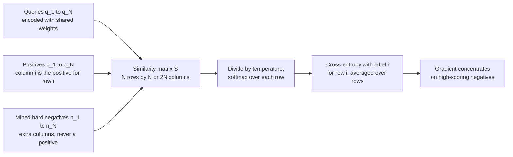
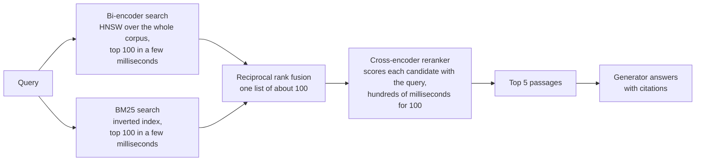
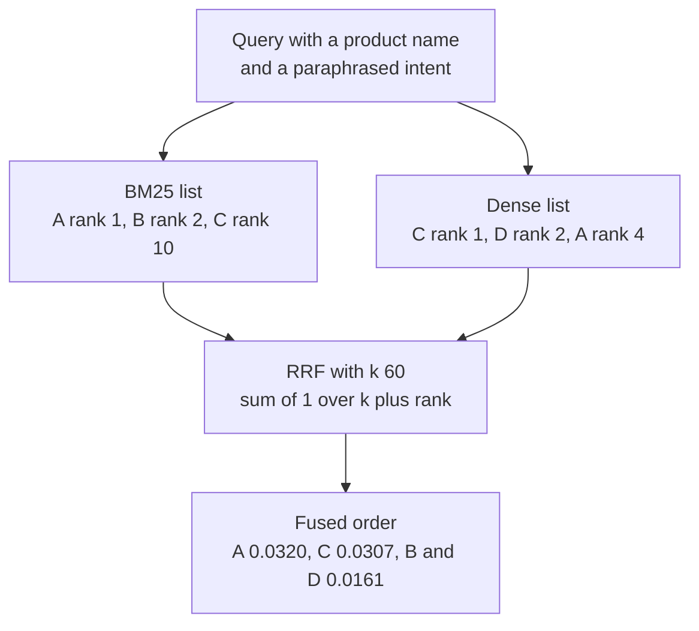
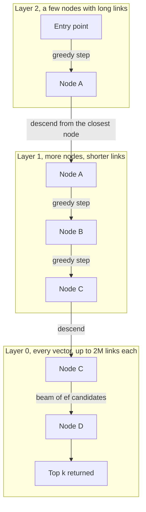

# Chapter 9: Embeddings, Retrieval, and Rerankers

> **What you will be able to do:** write the InfoNCE and Multiple Negatives Ranking losses from memory and explain why batch size and temperature matter; train an embedding model with gradient caching and a Matryoshka loss on 8 GB; mine hard negatives and filter false negatives with a cross-encoder; build hybrid retrieval with BM25 and reciprocal rank fusion; size a vector index for ten million passages in fp32, int8, binary, and product-quantized form; compute recall@k, MRR, and nDCG@k by hand and report them with intervals.
> **Where it is used:** P1.4 directly. Every RAG system in P2.5, P3.1, P4.1, P4.4, and P5.2 depends on the retrieval quality this chapter teaches you to measure and improve.
> **Prerequisites:** Chapter 2 (attention, pooling of a transformer's hidden states), Chapter 3 (training loop), Chapter 4 (memory arithmetic). Chapter 11 for the bootstrap intervals you will attach to every metric here.

## 9.0 The problem this chapter solves

A customer has 40,000 pages of product documentation and a support team that answers the same 300 questions in different words every week. The obvious system is retrieval-augmented generation: embed the documentation in chunks, embed each question, fetch the nearest chunks, and have a language model answer from them. You build it with an off-the-shelf embedding model in an afternoon. It answers well when the question uses the documentation's vocabulary and badly when it does not. "How do I stop a campaign from spending" does not land near the paragraph titled "Pausing an ad group", and the model, given the wrong chunks, answers confidently and wrong.

The fix is not a bigger language model. The retrieved chunks are the ceiling on the answer, so the work is in retrieval: an embedding model that knows this domain's vocabulary, a reranker that reads the query and each candidate together, a lexical index alongside the dense one for exact product names and error codes, and a metric that tells you whether any of it helped. Aman did this once for biomedical text with BioBERT. The tooling has changed since. The concepts have mostly not, but three of them are newer and matter on a laptop GPU: gradient-cached contrastive training, Matryoshka embeddings, and quantized vector indexes.

This chapter gives the mechanisms with their math, the numbers for the RTX 4060, and the measurement discipline. P1.4 has eight hours, so the emphasis is on doing the right things once rather than surveying the field.

## 9.1 Bi-encoders and the embedding space

A bi-encoder is a model $f_\theta$ that maps a text to a vector $e \in \mathbb{R}^d$ independently of any other text. Queries and passages are encoded separately, and relevance is a similarity between their vectors, almost always cosine similarity:

$$s(q, p) = \frac{f_\theta(q)^\top f_\theta(p)}{\lVert f_\theta(q) \rVert \, \lVert f_\theta(p) \rVert}.$$

Independence is the whole point. A corpus of $M$ passages is encoded once and stored. At query time one forward pass produces $f_\theta(q)$, and search is $M$ dot products, or far fewer with an approximate index (section 9.9). A model that reads query and passage together (a cross-encoder, section 9.7) cannot precompute anything and needs $M$ forward passes per query.

The encoder is usually a BERT-sized transformer (bge-base-en-v1.5 has about 110 million parameters and produces 768 dimensions from up to 512 tokens; nomic-embed-text-v1 has about 137 million and handles 8,192 tokens) or, more recently, a decoder-only model of 1 to 7 billion parameters with a pooling rule on the final hidden states. For P1.4 the BERT-sized models are the right choice: they train in minutes on the 4060, encode tens of thousands of chunks in under a minute, and their quality on a narrow domain after fine-tuning is competitive with much larger general models.

Training teaches the geometry. Before fine-tuning, the space reflects general semantic similarity. After contrastive fine-tuning on domain query-passage pairs, it reflects relevance for your queries: "stop spending" and "pause" end up close because the training pairs said so. The rest of the chapter is about how that is done and how it is measured.

## 9.2 Contrastive objectives: InfoNCE and Multiple Negatives Ranking Loss

### 9.2.1 InfoNCE with temperature

Given a query $q$, one positive passage $p^+$, and a set of $K$ negative passages $\{p^-_1, \dots, p^-_K\}$, the InfoNCE loss (van den Oord et al., 2018, "Representation Learning with Contrastive Predictive Coding") is the cross-entropy of picking the positive out of the $K + 1$ candidates:

$$\mathcal{L}_{\mathrm{InfoNCE}} = -\log \frac{\exp\big(s(q, p^+) / \tau\big)}{\exp\big(s(q, p^+) / \tau\big) + \sum_{j=1}^{K} \exp\big(s(q, p^-_j) / \tau\big)}.$$

Here $\tau > 0$ is the temperature. Cosine similarities lie in $[-1, 1]$, and a softmax over numbers in that range is nearly flat. Dividing by $\tau = 0.05$ stretches them to $[-20, 20]$, so that a 0.1 difference in cosine becomes a 2-nat difference in logit. Libraries often write $1 / \tau$ as a scale, and sentence-transformers' default scale of 20 corresponds to $\tau = 0.05$.

The gradient with respect to a similarity is the softmax residual scaled by $1 / \tau$:

$$\frac{\partial \mathcal{L}}{\partial s(q, p_j)} = \frac{1}{\tau} \big( P_j - \mathbb{1}[p_j = p^+] \big), \qquad P_j = \frac{\exp(s(q, p_j) / \tau)}{\sum_{j'} \exp(s(q, p_{j'}) / \tau)}.$$

Negatives with high similarity get a large share of the push. Negatives already far away get almost none. This is why negatives matter: a batch of easy negatives has $P_j \approx 0$ for every negative and a positive with $P^+ \approx 1$, so the loss is near zero and the gradient vanishes.

InfoNCE also bounds mutual information: $I(q; p) \ge \log(K + 1) - \mathcal{L}$. With $K + 1 = 32$ candidates the bound cannot exceed 3.47 nats however low the loss goes. With 4,096 it can reach 8.3 nats. This is one formal reason more negatives help.

### 9.2.2 Multiple Negatives Ranking Loss as in-batch InfoNCE

Multiple Negatives Ranking Loss (MNRL, the name sentence-transformers uses, following Henderson et al., 2017, "Efficient Natural Language Response Suggestion for Smart Reply") is InfoNCE where the negatives for query $i$ are the positives of every other query in the batch. A batch of $N$ pairs $(q_i, p_i)$ gives an $N \times N$ similarity matrix $S_{ij} = s(q_i, p_j)$, and the loss is cross-entropy over each row with the diagonal as the label:

$$\mathcal{L}_{\mathrm{MNRL}} = -\frac{1}{N} \sum_{i=1}^{N} \log \frac{\exp(S_{ii} / \tau)}{\sum_{j=1}^{N} \exp(S_{ij} / \tau)}.$$

No negatives need to be collected. Every batch of $N$ pairs yields $N(N - 1)$ negative comparisons for free. Adding one mined hard negative $n_i$ per pair extends each row to $2N$ columns, the second half being similarities to the hard negatives of every pair, and the label stays at column $i$. A symmetric variant adds the column-wise loss (each passage picks its query), which helps when the same passage answers several queries.

Worked example with $N = 4$ and $\tau = 0.05$. Row 1 of the similarity matrix, positive first, is $(0.82, 0.61, 0.45, 0.70)$. Divided by $\tau$: $(16.4, 12.2, 9.0, 14.0)$. Exponentials: about $1.326 \times 10^7$, $1.99 \times 10^5$, $8.1 \times 10^3$, $1.20 \times 10^6$, summing to about $1.467 \times 10^7$. The softmax probabilities are $(0.904, 0.014, 0.001, 0.082)$, and the row's loss is $-\log 0.904 = 0.101$. The gradients on the four similarities are $\frac{1}{0.05}(P_j - \mathbb{1}[j = 1])$: $(-1.92, +0.27, +0.01, +1.64)$. The negative at 0.70 receives 85 percent of the total push away, the one at 0.45 receives almost none.

The same row at $\tau = 1$: exponentials $(2.27, 1.84, 1.57, 2.01)$, sum 7.69, positive probability 0.295, loss 1.22, and gradients $(-0.705, +0.239, +0.204, +0.262)$, nearly uniform across the negatives. Without the temperature the loss cannot distinguish a hard negative from an easy one, and the model receives no signal about which mistake to fix first.

### 9.2.3 Why batch size matters

Three effects compound. First, more in-batch negatives raise the mutual-information ceiling above. Second, the hardest negative in a batch gets harder as the batch grows, so the gradient stays informative longer into training. If a random passage has a 0.5 percent chance of scoring above 0.70 with a given query, the chance that at least one of 31 in-batch negatives does is $1 - 0.995^{31} \approx 14$ percent, while for 1,023 negatives it is $1 - 0.995^{1023} \approx 99.4$ percent. Third, the softmax normalizer is a better estimate of the full-corpus normalizer when it sums over more candidates, so the loss approximates the retrieval task more faithfully.

The consequence for practice is that published embedding models train with batches of thousands of pairs, and a batch of 32 on a laptop GPU trains a visibly worse model on the same data. The plain implementation needs the activations of all $2N$ sequences in memory for the backward pass, which on 8 GB caps $N$ around 64 for a BERT-base encoder at 256-token passages (section 9.15). The next mechanism removes the cap.

### 9.2.4 The gradient-cached variant

Gradient caching (Gao et al., 2021, "Scaling Deep Contrastive Learning Batch Size under Memory Limited Setup") separates the contrastive loss from the encoder. The loss depends on the parameters only through the $2N$ embeddings, and the embeddings are small ($2N \times d$ floats). So:

1. Encode all $2N$ texts in chunks with no gradient graph, keeping only the embeddings. Memory: one chunk's activations plus $2N \times d \times 4$ bytes.
2. Compute the loss on the embeddings, which now require gradients, and backpropagate to get $\partial \mathcal{L} / \partial e_i$ for every embedding. This is a tiny graph over an $N \times N$ matrix.
3. Re-encode each chunk with the gradient graph on, and call `backward` on that chunk's embeddings with the cached gradient as the upstream gradient. Parameter gradients accumulate across chunks exactly as they would have in a single large backward pass.
4. Step the optimizer.

The result is mathematically identical to the large-batch gradient, at the cost of one extra forward pass (step 1) and the requirement that dropout, if any, produce the same mask in steps 1 and 3. Most embedding fine-tuning disables dropout, and the GradCache library saves and restores the random state per chunk. For $N = 4{,}096$ pairs and $d = 768$, the cached embeddings and their gradients occupy $2 \times 4096 \times 768 \times 4 \times 2$ bytes, about 50 MB. sentence-transformers exposes this as `CachedMultipleNegativesRankingLoss` with a `mini_batch_size` argument (sentence-transformers 3.x, check your version). Listing 9.2 shows the mechanism in about thirty lines.



*Figure 9.1: One MNRL batch. Every off-diagonal entry is a free negative, and the temperature decides how sharply the hardest ones dominate the gradient.*

## 9.3 Positives, negatives, hard negatives, and false negatives

A positive is a passage that answers the query. In P1.4 the positives are the chunks from which synthetic queries were generated (section 9.4). Random negatives are any other chunk. After a few hundred steps of training they are all easy and contribute nothing, as the gradient analysis in section 9.2.1 predicts.

A hard negative is a passage that scores high with the query under some retriever but does not answer it. The standard sources are the two retrievers you will deploy anyway: BM25 (section 9.8), which finds passages that share rare words with the query, and the base embedding model before fine-tuning, which finds passages that are semantically near. For each query, retrieve the top 30 from each, remove the positive, and sample two or three negatives from the remaining ranks. Dense Passage Retrieval (Karpukhin et al., 2020) established the recipe of one BM25 hard negative per pair in addition to in-batch negatives.

The false-negative problem is that the top ranks of either retriever often contain passages that do answer the query but were never labeled as positives, because the labels came from generating one query per chunk. Two chunks that both describe how to pause a campaign will both rank high for a pause question, and only one is the labeled positive. Training on the other as a negative teaches the model that a relevant passage is irrelevant, and recall goes down after fine-tuning rather than up. This is the single most common way P1.4 goes wrong.

Two defenses, used together. Skip the top few ranks (three to five) when sampling negatives, because false negatives concentrate at the top. And score every candidate negative together with the query using a cross-encoder (section 9.7), dropping any candidate whose score is not clearly below the positive's score. A relative margin of about 0.05 in cross-encoder probability, or an absolute cap on the negative's score, are the usual rules. The cross-encoder is slower than the bi-encoder but runs once, offline, over a few tens of thousands of pairs, which takes minutes on the 4060. sentence-transformers ships a `mine_hard_negatives` utility with range, margin, and cross-encoder options (3.x, argument names have changed across releases). Listing 9.3 shows the logic so that you can implement or verify it.

The mined set is a training artifact that deserves inspection. Read fifty query, positive, negative triples. If more than a handful of negatives are actually answers, tighten the margin.

## 9.4 Synthetic query generation

Domain corpora rarely come with queries, and the queries you can collect from a customer are too few and too skewed toward what the current system handles. Generation fills the gap. For each chunk, prompt a frontier model for three questions that a user would plausibly ask and that this chunk answers, varying specificity (a keyword-style query, a full question, a question with a wrong assumption to correct) and asking for the user's vocabulary rather than the document's. Filter with a judge prompt that checks the chunk actually answers the question. Discard chunks that generate nothing answerable, such as tables of contents.

Three rules from Chapter 10 apply. Diversity by construction: sample phrasing styles and personas explicitly rather than hoping the model varies. Validity by filtering: the judge pass removes about 10 to 20 percent of generated queries in practice. Held-out by design: split the chunks into training and evaluation sets before generating, and generate the evaluation queries from held-out chunks only, so that no evaluation query's answer was seen during training. For 10,000 chunks and three queries each, generation costs a few dollars at mid-2026 frontier prices (verify against Appendix D of the roadmap) and an hour of wall time with the Batch API.

## 9.5 Matryoshka representation learning

A standard embedding model is trained so that the full $d$-dimensional vector is good and the first $m < d$ dimensions are meaningless on their own. Matryoshka representation learning (Kusupati et al., 2022) trains the model so that every prefix of the vector, for a chosen set of lengths, is itself a good embedding. The loss is a sum of the base loss applied to each prefix:

$$\mathcal{L}_{\mathrm{MRL}} = \sum_{m \in \mathcal{M}} c_m \, \mathcal{L}\big(\tilde{e}_{1:m}\big), \qquad \tilde{e}_{1:m} = \frac{e_{1:m}}{\lVert e_{1:m} \rVert},$$

where $\mathcal{M}$ is the set of prefix lengths (for a 768-dimensional model, typically $\{768, 512, 256, 128, 64\}$), $e_{1:m}$ is the first $m$ components of the embedding, renormalized, and $c_m$ are weights, usually all 1. Each term is a full MNRL loss on the truncated and renormalized vectors. The model learns to put the most discriminative information in the leading dimensions, because those dimensions are scored in every term of the sum, and the trailing dimensions add refinement.

At query time you truncate stored and query vectors to the same $m$ and renormalize. Storage and search cost fall by $d / m$. The quality cost is small and task-dependent: published results for 768-dimensional models truncated to 256 show a drop of about one to two points of nDCG@10 on retrieval benchmarks, and truncating a model that was not trained with the Matryoshka loss costs far more. Measure on your own held-out set. For P1.4 the recipe is the Matryoshka wrapper around the cached MNRL loss with dimensions 768, 512, and 256, and a results table with recall@5 and nDCG@10 at each dimension.

Storage arithmetic: ten million 768-dimensional fp32 vectors take about 30.7 GB. At 256 dimensions they take about 10.2 GB. Combined with int8 storage (section 9.9.5) that is 2.6 GB, which fits in the RAM of a modest server or the laptop.

## 9.6 Pooling and normalization

A transformer produces one hidden vector per token. The embedding is a pooling of them, and the pooling rule is part of the model's contract: use the one it was trained with. Three rules are common.

CLS pooling takes the final hidden state of the first token, which BERT-style models train as a sequence summary. The BGE family uses it. Mean pooling averages the final hidden states over real tokens, using the attention mask to exclude padding:

$$e = \frac{\sum_{t=1}^{T} a_t \, h_t}{\sum_{t=1}^{T} a_t},$$

where $h_t$ is the final hidden state at position $t$ and $a_t \in \{0, 1\}$ is the attention mask. The e5 and nomic families and most sentence-transformers models use it. Last-token pooling takes the final hidden state of the last real token, which suits decoder-only models where causal attention means only the last position has seen the whole text. Embedding models built on Mistral or Qwen backbones use it.

Normalization follows pooling. Dividing by the L2 norm makes the dot product equal the cosine, which is what MNRL with cosine similarity assumes and what vector databases expect when configured for cosine distance. A model trained with an unnormalized dot product should not be normalized at inference, since the norm carries information for it. Many models also expect an instruction or prefix, such as "query: " and "passage: " for e5 or "search_query: " and "search_document: " for nomic, because the model was trained with asymmetric prefixes that tell it which side of the pair it is encoding. Omitting the prefix costs several points of recall silently. Check the model card and encode the evaluation set both ways once to confirm.

## 9.7 Cross-encoders, two-stage retrieval, and late interaction

A cross-encoder reads the query and one passage as a single sequence, `[CLS] query [SEP] passage [SEP]`, and outputs a scalar relevance score from the CLS position. Every attention layer sees both texts, so the model can align "stop spending" with "pause" token by token. It is trained with binary cross-entropy on labeled pairs, or with a listwise loss over a query's candidates. bge-reranker-base is about 278 million parameters on an XLM-RoBERTa backbone, and MiniLM-based rerankers of about 22 million parameters exist for latency-critical paths.

The cost is that nothing can be precomputed. Scoring $M$ passages needs $M$ forward passes over query-plus-passage sequences. For $M$ in the millions that is impossible per query, and for $M = 100$ it is a few hundred milliseconds on the 4060 for a 278-million-parameter model at 256 tokens per pair, or a few tens of milliseconds for a MiniLM-sized one.

Two-stage retrieval gets the accuracy of the cross-encoder at the cost of the bi-encoder. The bi-encoder (with or without BM25, section 9.8) retrieves the top 100 candidates in single-digit milliseconds from an index. The cross-encoder rescores those 100 and returns the top 5 to the generator. Recall@100 of the first stage is the ceiling, so measure it separately from nDCG@10 of the reranked list. If recall@100 is 0.85, no reranker can lift answer accuracy above what 85 percent coverage allows, and the fix is in the first stage.

Late interaction sits between the two. ColBERT (Khattab and Zaharia, 2020) stores one vector per token of each passage and scores a query by MaxSim: for each query token, the maximum dot product against the passage's token vectors, summed over query tokens:

$$s(q, p) = \sum_{i \in q} \max_{j \in p} \, \tilde{q}_i^\top \tilde{p}_j.$$

Passage vectors are precomputed, so the interaction is cheap at query time, and token-level matching gives much of the cross-encoder's precision. The price is storage: a 100-token passage stores 100 vectors of 128 dimensions instead of one of 768, about 17 times more floats, which ColBERTv2 (Santhanam et al., 2022) reduces with aggressive residual compression to about 2 bits per dimension. For P1.4 and most customer systems, the bi-encoder plus cross-encoder pair is what you deploy, and late interaction is what you mention when a customer asks about it.



*Figure 9.2: Two-stage hybrid retrieval. The first stage sets the recall ceiling, the reranker sets the precision of what the generator sees.*

## 9.8 Hybrid retrieval: BM25 and reciprocal rank fusion

### 9.8.1 BM25

Dense retrieval matches meaning and misses exact strings: a part number, an error code, a product name the embedding model has never seen. Lexical retrieval matches strings and misses paraphrase. BM25 (Robertson and Zaragoza, 2009, "The Probabilistic Relevance Framework: BM25 and Beyond") is the standard lexical scorer. For a query $q$ of terms $t$ and a document $d$:

$$\mathrm{BM25}(q, d) = \sum_{t \in q} \mathrm{IDF}(t) \cdot \frac{f(t, d) \, (k_1 + 1)}{f(t, d) + k_1 \left( 1 - b + b \, \frac{\lvert d \rvert}{\mathrm{avgdl}} \right)},$$

with

$$\mathrm{IDF}(t) = \ln \frac{N - n_t + 0.5}{n_t + 0.5} + 1.$$

The symbols: $f(t, d)$ is the count of term $t$ in $d$, $\lvert d \rvert$ the length of $d$ in terms, $\mathrm{avgdl}$ the average document length in the collection, $N$ the number of documents, $n_t$ the number of documents containing $t$, $k_1$ the term-frequency saturation parameter, and $b$ the length-normalization strength. The $+1$ in the IDF is the Lucene convention that keeps the weight positive for very common terms. Typical values are $k_1 = 1.2$ (Lucene's default) or 1.5, and $b = 0.75$.

$k_1$ controls how quickly repeated occurrences stop adding score. As $f \to \infty$ the term-frequency factor approaches $k_1 + 1$, so no single term can dominate through repetition. $b = 0$ turns off length normalization, $b = 1$ normalizes fully, so that a term occurring three times in a document three times the average length counts like one occurrence in an average one.

Worked example: $N = 10{,}000$ chunks, a term in $n_t = 100$ of them, occurring $f = 3$ times in a chunk of length 300 when $\mathrm{avgdl} = 200$, with $k_1 = 1.2$ and $b = 0.75$. The IDF is $\ln(9900.5 / 100.5) + 1 = \ln 98.51 + 1 = 4.590 + 1 = 5.590$. The length factor is $1 - 0.75 + 0.75 \times 1.5 = 1.375$. The term-frequency factor is $3 \times 2.2 / (3 + 1.2 \times 1.375) = 6.6 / 4.65 = 1.419$. The term contributes $5.590 \times 1.419 = 7.93$ to the score. Holding everything else fixed and varying $f$: at $f = 1$ the factor is 0.830, at $f = 3$ it is 1.419, at $f = 10$ it is 1.888, at $f = 100$ it is 2.164, approaching the limit of 2.2. Three occurrences already earn 65 percent of the maximum.

Tokenization decides what a term is. Lowercasing, splitting on non-alphanumerics, and keeping digits and hyphens intact so that `ERR-4031` survives as one term are the choices that matter for technical corpora. Stemming helps English prose and hurts identifiers. For P1.4, a simple lowercase whitespace tokenizer with punctuation stripping is enough, and `rank_bm25` handles corpora up to about 100,000 chunks in pure Python. Beyond that use `bm25s` or an Elasticsearch or OpenSearch index.

### 9.8.2 Reciprocal rank fusion

BM25 scores and cosine similarities live on different scales, so adding them is meaningless without calibration. Reciprocal rank fusion (Cormack, Clarke, and Buettcher, 2009) ignores scores and uses ranks:

$$\mathrm{RRF}(d) = \sum_{r \in R} \frac{1}{k + \mathrm{rank}_r(d)},$$

where $R$ is the set of ranked lists, $\mathrm{rank}_r(d)$ is the 1-based rank of $d$ in list $r$ (documents absent from a list contribute nothing), and $k$ is a constant, 60 in the original paper. The large $k$ flattens the difference between adjacent ranks (rank 1 scores $1/61 = 0.0164$, rank 2 scores $1/62 = 0.0161$), so that appearing in both lists matters more than being first in one.

Worked example with two lists, BM25 and dense, $k = 60$. Document A is rank 1 in BM25 and rank 4 in dense: $1/61 + 1/64 = 0.01639 + 0.01563 = 0.03202$. Document C is rank 10 in BM25 and rank 1 in dense: $1/70 + 1/61 = 0.01429 + 0.01639 = 0.03068$. Document B is rank 2 in BM25 and absent from the dense top 100: $1/62 = 0.01613$. Fused order: A, C, B. C's first place in dense retrieval did not beat A's presence in both lists. This is the intended behavior: agreement between two different retrievers is strong evidence.

Fusion typically adds a few points of recall@k over the better single retriever on corpora with identifiers and product names, and roughly nothing on corpora of pure prose. Measure both retrievers alone and fused on the held-out queries and keep the configuration the numbers support. Weighted variants (a per-list multiplier inside the sum) exist and are tuned on a development set. Qdrant, Weaviate, and Elasticsearch offer RRF as a query option (check your version).



*Figure 9.3: Reciprocal rank fusion rewards documents found by both retrievers over documents ranked first by only one.*

## 9.9 Vector indexes

### 9.9.1 Exact search

Exact nearest-neighbor search computes the similarity of the query against every stored vector. For $M$ vectors of $d$ dimensions that is $M \times d$ multiply-adds. Ten million 768-dimensional vectors is 7.7 billion multiply-adds per query, about 30 GB of memory read in fp32, which takes about 100 milliseconds on a fast CPU with good BLAS and about 10 milliseconds on a GPU that holds the matrix. Exact search is the right choice up to about a million vectors and the correct baseline for measuring the recall loss of every approximate method. FAISS calls it `IndexFlatIP` (inner product) or `Flat`.

### 9.9.2 HNSW

Hierarchical Navigable Small World graphs (Malkov and Yashunin, 2018) are the default approximate index in Qdrant, Weaviate, pgvector, Elasticsearch, and FAISS's `HNSW` indexes. Each vector is a node in a layered graph. Every node is in layer 0. A node is also in layer $\ell$ with probability decreasing geometrically in $\ell$: its maximum layer is drawn as $\lfloor -\ln(u) \cdot m_L \rfloor$ with $u$ uniform on $(0, 1)$ and $m_L = 1 / \ln M$, so the expected fraction of nodes at layer $\ell$ or above is about $M^{-\ell}$. Within a layer, each node keeps links to up to $M$ near neighbors (up to $2M$ at layer 0), chosen during insertion by a heuristic that prefers neighbors that are diverse in direction rather than merely closest, which is what keeps the graph navigable.

Search starts at the entry point on the top layer and greedily moves to the linked neighbor closest to the query until no neighbor is closer. It then descends one layer, starting from that node, and repeats. Upper layers have few nodes and long-range links, so the descent covers the space in a logarithmic number of hops. At layer 0 the search widens to a beam: it maintains a candidate set of size `ef` (the search-time parameter, `ef_search`), expanding the closest unexpanded candidate and keeping the best `ef` seen. It returns the top $k$ of the final candidate set. Construction uses the same search with a larger beam, `ef_construction`, to find each new node's neighbors.

Three parameters, three effects. $M$ (commonly 16 to 32) trades memory and build time for recall at a given `ef`. `ef_construction` (commonly 100 to 400) trades build time for graph quality. `ef_search` (must be at least $k$, commonly 64 to 256) trades query latency for recall at query time and can be changed per query. Recall@10 above 0.95 with single-digit-millisecond latency on ten million vectors is typical with $M = 16$ and `ef_search` around 128, and the way to know your number is to compare against exact search on a thousand held-out queries.

Memory beyond the vectors is the links. At layer 0 each node stores up to $2M$ neighbor identifiers, 4 bytes each, plus a count, about $8M + 4$ bytes. Upper layers add about $1 / (M - 1)$ extra layers per node on average, each of about $4M + 4$ bytes. For $M = 16$ that is about $132 + 68 / 15 \approx 137$ bytes per vector, so about 1.4 GB of links for ten million vectors, on top of whatever the vectors themselves cost. Inserting a vector is cheap, deleting requires tombstones and periodic rebuilds in most implementations, and the whole graph must be in RAM for search to be fast.



*Figure 9.4: HNSW search descends through sparse upper layers with greedy steps and finishes with a beam search on the full bottom layer.*

### 9.9.3 IVF

An inverted-file index partitions the vectors into $n_{\mathrm{list}}$ clusters by k-means on a training sample. Each vector is stored in the list of its nearest centroid. A query is compared against the centroids, the closest $n_{\mathrm{probe}}$ lists are scanned exhaustively, and the rest are ignored. With $n_{\mathrm{list}}$ on the order of a few times $\sqrt{M}$ (FAISS suggests roughly $4\sqrt{M}$ to $16\sqrt{M}$, so 12,000 to 50,000 lists for ten million vectors) and $n_{\mathrm{probe}}$ of 16 to 128, the query scans a fraction of a percent of the data. IVF has almost no memory overhead beyond the centroids, builds faster than HNSW, and combines naturally with product quantization. Its recall at equal latency is usually below HNSW's for high-dimensional embeddings, and vectors near cluster boundaries are missed unless $n_{\mathrm{probe}}$ is generous. FAISS index strings such as `IVF16384,Flat` and `IVF16384,PQ96` name the two variants.

### 9.9.4 Product quantization

Product quantization (Jégou, Douze, and Schmid, 2011) compresses each vector to a few bytes by splitting it into $m$ subvectors and quantizing each with its own small codebook. A 768-dimensional vector split into $m = 96$ subvectors of 8 dimensions, each quantized to one of $k^* = 256$ centroids learned by k-means on that subspace, is stored as 96 bytes: one centroid index per subvector. Compression is $3072 / 96 = 32$ times relative to fp32.

The codebooks are small: $m \times k^* \times (d / m) \times 4$ bytes $= 96 \times 256 \times 8 \times 4$, about 786 KB, regardless of how many vectors are indexed. Distance computation is asymmetric: the query stays in full precision, and for each of the $m$ subspaces a table of the query subvector's distances to the 256 centroids is computed once, $m \times k^* = 24{,}576$ entries. The distance to any stored vector is then $m$ table lookups and additions instead of $d$ multiply-adds, which is what makes scanning millions of compressed codes fast.

The cost is accuracy. Every vector is replaced by the nearest point on a grid of $256^{96}$ cells, and nearest neighbors under the approximate distance are not always the true ones. Recall@10 for IVF-PQ on 768-dimensional text embeddings without refinement is often 0.7 to 0.9 against exact search, and the standard remedy is to retrieve a larger candidate set (say 200) with the compressed codes and rerank it with the full-precision vectors, which are kept on disk. Product quantization is the right choice when ten million or more vectors must fit in a few gigabytes and a rescoring pass is acceptable. Qdrant exposes it as a quantization option (check your version).

### 9.9.5 int8 and binary embeddings

Two simpler compressions have become standard because they need no codebook training and cost little recall.

Scalar int8 quantization maps each dimension independently to an 8-bit integer: $x_q = \mathrm{round}\big((x - x_{\min}) / (x_{\max} - x_{\min}) \times 255\big)$ with the range taken per dimension from a calibration sample (Qdrant uses a quantile, commonly 0.99, to clip outliers). A 768-dimensional vector becomes 768 bytes, 4 times smaller than fp32, and dot products run in int8 arithmetic that CPUs execute at several times fp32 throughput. Published measurements (the Hugging Face blog post on binary and scalar embedding quantization, 2024) report about 99 percent of fp32 retrieval quality on MTEB retrieval tasks. Treat that as a prior and measure on your held-out set.

Binary quantization keeps one bit per dimension, the sign: $x_b = \mathbb{1}[x > 0]$. A 768-dimensional vector becomes 96 bytes, 32 times smaller than fp32, and similarity is computed as a Hamming distance with a popcount instruction, which is extremely fast. Alone it retains roughly 90 to 95 percent of retrieval quality on the same measurements. With rescoring, where the top few hundred binary candidates are rescored with int8 or fp32 vectors kept on disk, most of the remaining gap closes. Binary quantization works well only for high-dimensional embeddings (768 and up) whose dimensions are roughly zero-centered, which is why some models are trained with binary retrieval in mind.

Memory arithmetic for ten million vectors at 768 dimensions (GB means $10^9$ bytes):

| Representation | Bytes per vector | Total for 10 million | Notes |
|---|---|---|---|
| fp32 | 3,072 | 30.7 GB | Exact baseline, does not fit in 32 GB RAM with anything else |
| fp16 or bf16 | 1,536 | 15.4 GB | Halves memory, negligible quality change |
| int8 scalar | 768 | 7.7 GB | About 99 percent of fp32 quality, fast integer dot products |
| Binary | 96 | 0.96 GB | Popcount search, rescore the top candidates |
| Product quantization, 96 bytes | 96 | 0.96 GB | Plus a 0.8 MB codebook, rescore the top candidates |
| Matryoshka 256 dimensions, fp32 | 1,024 | 10.2 GB | Truncate and renormalize |
| Matryoshka 256 dimensions, int8 | 256 | 2.6 GB | Fits comfortably in laptop RAM |
| Matryoshka 256 dimensions, binary | 32 | 0.32 GB | Aggressive, rescoring mandatory |
| HNSW links, $M = 16$ | about 137 | about 1.4 GB | Added to whichever vector representation is indexed |

Each row also needs an identifier and payload per vector, typically tens of bytes. A practical production layout for ten million passages is binary or int8 vectors in RAM inside an HNSW graph, fp32 or int8 originals on disk for rescoring, and payload in the database's storage. Qdrant supports this layout with `on_disk` vectors and `always_ram` quantized vectors (configuration names as of 2026, check your version).

## 9.10 Metrics: recall@k, MRR, and nDCG@k

Each metric is computed per query and averaged over the evaluation set, and every average gets a bootstrap interval over queries (Chapter 11). Let $\mathrm{Rel}(q)$ be the set of passages relevant to query $q$, and let the system return a ranked list whose $i$-th element is $d_i$.

**Recall@k** is the fraction of relevant passages that appear in the top $k$:

$$\mathrm{Recall@}k = \frac{\lvert \mathrm{Rel}(q) \cap \{d_1, \dots, d_k\} \rvert}{\lvert \mathrm{Rel}(q) \rvert}.$$

When each query has exactly one relevant passage, as with generated queries, recall@k equals the hit rate: 1 if the positive is in the top $k$, else 0. Report recall@5 and recall@20 for the first stage, and recall@100 as the reranker's ceiling.

**Mean reciprocal rank** rewards putting a relevant passage early:

$$\mathrm{MRR} = \frac{1}{\lvert Q \rvert} \sum_{q \in Q} \frac{1}{\mathrm{rank}_q},$$

where $\mathrm{rank}_q$ is the position of the first relevant passage for $q$, and the term is 0 if none appears in the list. It is the natural metric when one good passage is enough.

**nDCG@k** handles graded relevance and discounts by position. The discounted cumulative gain is

$$\mathrm{DCG@}k = \sum_{i=1}^{k} \frac{g(\mathrm{rel}_i)}{\log_2(i + 1)},$$

where $\mathrm{rel}_i$ is the relevance grade of the passage at rank $i$ and $g$ is a gain function, either linear $g(r) = r$ (the trec_eval and BEIR convention) or exponential $g(r) = 2^r - 1$ (common in learning-to-rank). The ideal DCG, $\mathrm{IDCG@}k$, is the DCG of the relevant passages sorted by grade descending, and

$$\mathrm{nDCG@}k = \frac{\mathrm{DCG@}k}{\mathrm{IDCG@}k} \in [0, 1].$$

State which gain you use. The two conventions give different numbers for the same ranking.

Worked example. A query has four relevant passages with grades 3, 2, 2, 1 (everything else is grade 0). The system's top 5 has grades $(3, 0, 2, 1, 0)$: the grade-3 passage first, a non-relevant passage second, a grade-2 passage third, the grade-1 passage fourth, a non-relevant fifth. The second grade-2 passage is not in the top 5.

Recall@5 is $3 / 4 = 0.75$ (three of four relevant passages retrieved). Recall@3 is $2 / 4 = 0.5$. The reciprocal rank is $1 / 1 = 1.0$.

With exponential gain, $g(3) = 7$, $g(2) = 3$, $g(1) = 1$. Discounts: $\log_2 2 = 1$, $\log_2 3 = 1.585$, $\log_2 4 = 2$, $\log_2 5 = 2.322$, $\log_2 6 = 2.585$. DCG@5 $= 7/1 + 0/1.585 + 3/2 + 1/2.322 + 0/2.585 = 7 + 1.5 + 0.431 = 8.931$. The ideal ranking is grades $(3, 2, 2, 1, 0)$, so IDCG@5 $= 7 + 3/1.585 + 3/2 + 1/2.322 = 7 + 1.893 + 1.5 + 0.431 = 10.824$. nDCG@5 $= 8.931 / 10.824 = 0.825$.

With linear gain: DCG@5 $= 3 + 0 + 2/2 + 1/2.322 = 4.431$, IDCG@5 $= 3 + 2/1.585 + 2/2 + 1/2.322 = 5.693$, nDCG@5 $= 0.778$. Same ranking, a different number, which is why the convention must be stated.

For a second query whose first relevant passage is at rank 3, the reciprocal rank is $1/3$, and the MRR over the two queries is $(1.0 + 0.333) / 2 = 0.667$.

Which to report: recall@k for the first stage because it is the ceiling, nDCG@10 for the reranked list because position matters to the generator, and MRR when a single passage answers the question. Then the number that matters to the customer: end-to-end answer accuracy of the RAG system with and without your fine-tuned components, on the same questions, with a paired interval.

## 9.11 Evaluation hygiene

Retrieval evaluations leak more easily than most, because the training and evaluation data are drawn from the same corpus.

Split by chunk, before generating queries. Every evaluation query must come from a chunk that no training query was generated from. If chunks are split after generation, a training query and an evaluation query can point at the same chunk, and recall is inflated by memorization.

Deduplicate chunks first. Two near-identical chunks (a paragraph repeated in two documents, a boilerplate section) with one in training and one in evaluation is the same leak in a thinner disguise. Run MinHash near-duplicate detection (Chapter 6) over the chunks and keep one of each pair before splitting.

Freeze and version. The held-out queries, their positives, and the corpus snapshot are one versioned artifact. Tune nothing on it. If you need a development set for the margin in hard-negative mining or the RRF weight, carve it from the training chunks.

Regress on a general benchmark. A model fine-tuned on one domain drifts on everything else. Pick three to five small retrieval tasks from MTEB (Muennighoff et al., 2022) or BEIR (Thakur et al., 2021), run them before and after, and report the deltas with intervals. The P1.4 definition of done allows at most a 2-point regression. If the drop is larger, lower the learning rate, train fewer epochs, or mix a slice of general pairs into the training data.

Judge the generated queries, not just the retrieval. A held-out set of unanswerable or malformed queries makes every retriever look bad in the same way and hides differences. The judge filter of section 9.4 applies to the evaluation set with a stricter threshold.

## 9.12 Chunking

The chunk is the unit of retrieval and the unit the generator reads, and the two roles pull in different directions. Small chunks produce precise embeddings and precise retrieval but strip the context the generator needs. Large chunks carry context but dilute the embedding across several topics and, past the encoder's maximum length (512 tokens for BERT-based models), are silently truncated, so that anything after the cutoff is unretrievable.

Section-aware chunking splits on the document's own structure, headings and paragraphs, and prefixes each chunk with its heading path ("Campaign management > Pausing > Ad groups") so that the chunk carries its context into the embedding. It is the right default for documentation and reports. Fixed-size chunking with overlap (256 to 512 tokens, 10 to 20 percent overlap) is the fallback for unstructured text, and the overlap keeps sentences that straddle a boundary retrievable from at least one chunk. Parent-child chunking retrieves on small chunks (a paragraph) and returns the parent (the section) to the generator, which resolves the tension directly at the cost of a lookup.

The effects are measurable. Halving chunk size typically raises recall@5 for specific questions and lowers it for questions whose answer spans paragraphs. Adding heading prefixes usually adds a few points of recall on documentation corpora at no cost. Run the held-out queries against two or three chunking configurations of the same corpus before training anything, because chunking changes the positives, and pick the configuration before mining negatives.

## 9.13 Implementation notes

**Listing 9.1: In-batch MNRL from scratch with optional hard negatives, and the sentence-transformers equivalent.**

```python
import torch
import torch.nn.functional as F

def mean_pool(hidden, attention_mask):
    m = attention_mask.unsqueeze(-1).to(hidden.dtype)
    return (hidden * m).sum(dim=1) / m.sum(dim=1).clamp(min=1e-9)

def encode(model, batch):
    hidden = model(**batch).last_hidden_state
    return F.normalize(mean_pool(hidden, batch["attention_mask"]), dim=-1)

def mnrl_loss(q, p, hard=None, scale=20.0):
    """q, p: [N, d] normalized, row i of p is the positive for row i of q.
    hard: optional [N, d] mined negatives. scale = 1 / temperature."""
    cands = p if hard is None else torch.cat([p, hard], dim=0)      # [N, d] or [2N, d]
    scores = scale * q @ cands.T                                     # [N, N] or [N, 2N]
    labels = torch.arange(q.shape[0], device=q.device)               # positive is column i
    return F.cross_entropy(scores, labels)

def train_step(model, tok, queries, passages, hard_negs=None, scale=20.0):
    enc = lambda texts, L: tok(texts, padding=True, truncation=True,
                               max_length=L, return_tensors="pt").to(model.device)
    q = encode(model, enc(queries, 64))
    p = encode(model, enc(passages, 256))
    h = encode(model, enc(hard_negs, 256)) if hard_negs is not None else None
    return mnrl_loss(q, p, h, scale)

# sentence-transformers 3.x equivalent (check your version for argument names):
# from sentence_transformers import SentenceTransformer, SentenceTransformerTrainer
# from sentence_transformers.losses import CachedMultipleNegativesRankingLoss, MatryoshkaLoss
# from sentence_transformers.training_args import SentenceTransformerTrainingArguments, BatchSamplers
# model = SentenceTransformer("BAAI/bge-base-en-v1.5")
# base = CachedMultipleNegativesRankingLoss(model, scale=20.0, mini_batch_size=32)
# loss = MatryoshkaLoss(model, base, matryoshka_dims=[768, 512, 256])
# args = SentenceTransformerTrainingArguments(output_dir="out", per_device_train_batch_size=1024,
#     num_train_epochs=3, learning_rate=2e-5, warmup_ratio=0.05, bf16=True,
#     batch_sampler=BatchSamplers.NO_DUPLICATES)
# SentenceTransformerTrainer(model=model, args=args, train_dataset=ds, loss=loss).train()
```

`mnrl_loss` is the whole objective: a scaled similarity matrix and a cross-entropy whose labels are the diagonal. When hard negatives are present the matrix has $2N$ columns and the labels still point at the first $N$, so each hard negative is a negative for every query in the batch, not only its own. The `NO_DUPLICATES` sampler matters: if the same passage appears twice in a batch, the duplicate is a false in-batch negative for the other query. `mean_pool` is the masked mean of section 9.6. For a CLS-pooled model such as bge, replace it with `hidden[:, 0]`. The `ds` dataset needs columns named for the loss's expectations, typically anchor, positive, and negative.

**Listing 9.2: A gradient-cached MNRL step.**

```python
def gradcache_step(model, tok, queries, passages, optimizer, chunk=32, scale=20.0):
    enc = lambda texts, L: tok(texts, padding=True, truncation=True,
                               max_length=L, return_tensors="pt").to(model.device)
    N = len(queries)
    # Pass 1: embeddings without a graph, one chunk of activations at a time.
    with torch.no_grad():
        q = torch.cat([encode(model, enc(queries[i:i + chunk], 64)) for i in range(0, N, chunk)])
        p = torch.cat([encode(model, enc(passages[i:i + chunk], 256)) for i in range(0, N, chunk)])
    # Pass 2: loss on the embeddings alone. Gradients land on q and p, [N, d] each.
    q.requires_grad_(True)
    p.requires_grad_(True)
    loss = mnrl_loss(q, p, scale=scale)
    loss.backward()
    gq, gp = q.grad.detach(), p.grad.detach()          # the cached gradients
    # Pass 3: re-encode each chunk with a graph and inject the cached gradient.
    optimizer.zero_grad()
    for i in range(0, N, chunk):
        e = encode(model, enc(queries[i:i + chunk], 64))
        e.backward(gq[i:i + chunk])                      # accumulates into model.grad
        e = encode(model, enc(passages[i:i + chunk], 256))
        e.backward(gp[i:i + chunk])
    optimizer.step()
    return loss.item()
```

The three passes are the three steps of section 9.2.4. Pass 1 costs one forward per chunk with no stored activations. Pass 2 builds a graph over only the $N \times N$ similarity matrix, so its memory is negligible. Pass 3 is a normal forward and backward per chunk, but instead of a loss, `backward` receives the cached upstream gradient for that chunk's embeddings, and the parameter gradients sum across chunks to exactly what one giant batch would have produced. Peak memory is one chunk's activations plus the model, regardless of $N$. The listing assumes dropout is disabled (`model.eval()` for the encoder's dropout layers while keeping gradients on, or a config with zero dropout); with dropout active, pass 1 and pass 3 would see different masks, and the cached gradients would be slightly wrong.

**Listing 9.3: Hard-negative mining with BM25, the base embedder, and a cross-encoder filter.**

```python
import numpy as np
from rank_bm25 import BM25Okapi

def mine_hard_negatives(queries, pos_idx, corpus, embed, cross_score,
                        k=30, skip=3, n_neg=3, margin=0.05):
    """pos_idx[i] is the index in corpus of query i's positive.
    embed: list[str] -> normalized np.ndarray [n, d].
    cross_score: list[(query, text)] -> np.ndarray of relevance probabilities."""
    bm25 = BM25Okapi([c.lower().split() for c in corpus])
    C = embed(corpus)                                        # [M, d], compute once and cache
    Q = embed(queries)                                       # [n, d]
    dense_top = np.argsort(-(Q @ C.T), axis=1)[:, :k]        # [n, k]
    negatives = []
    for i, (q, pos) in enumerate(zip(queries, pos_idx)):
        lex_top = np.argsort(-bm25.get_scores(q.lower().split()))[:k]
        cands = [c for c in list(dense_top[i][skip:]) + list(lex_top[skip:]) if c != pos]
        cands = list(dict.fromkeys(cands))                   # dedupe, keep rank order
        scores = cross_score([(q, corpus[c]) for c in cands] + [(q, corpus[pos])])
        pos_score, cand_scores = scores[-1], scores[:-1]
        keep = [c for c, s in zip(cands, cand_scores) if s < pos_score - margin]
        negatives.append(keep[:n_neg])
    return negatives
```

Two retrievers, two candidate lists, each with its top `skip` ranks removed because that is where false negatives live. The cross-encoder scores every remaining candidate and the positive in one call, and a candidate survives only if it scores at least `margin` below the positive. Candidates that score close to or above the positive are the false negatives, and dropping them is the point of the routine. The dense scores use the full matrix product `Q @ C.T`, which for 30,000 queries and 10,000 chunks is 300 million multiply-adds and runs in well under a second on the GPU. For corpora beyond about 100,000 chunks, replace the matrix product with an index search and `rank_bm25` with `bm25s` or an Elasticsearch query. Inspect fifty triples before training on the output.

**Listing 9.4: nDCG@k, MRR, and recall@k.**

```python
import math

def dcg(gains):
    return sum(g / math.log2(i + 2) for i, g in enumerate(gains))     # rank i+1, discount log2(rank+1)

def ndcg_at_k(ranked, rels, k, exponential=False):
    """ranked: list of doc ids in system order. rels: dict doc id -> grade (0 = not relevant)."""
    gain = (lambda r: 2 ** r - 1) if exponential else (lambda r: r)
    got = [gain(rels.get(d, 0)) for d in ranked[:k]]
    ideal = sorted((gain(r) for r in rels.values() if r > 0), reverse=True)[:k]
    denom = dcg(ideal)
    return dcg(got) / denom if denom > 0 else 0.0

def reciprocal_rank(ranked, rels, k=None):
    for i, d in enumerate(ranked[:k]):
        if rels.get(d, 0) > 0:
            return 1.0 / (i + 1)
    return 0.0

def recall_at_k(ranked, rels, k):
    relevant = {d for d, r in rels.items() if r > 0}
    return len(relevant & set(ranked[:k])) / len(relevant) if relevant else 0.0
```

`dcg` takes the gains in rank order and applies the $\log_2(i + 1)$ discount for 1-based rank $i$, which is `math.log2(i + 2)` for 0-based enumeration. `ndcg_at_k` computes the ideal ranking from the full relevance dictionary, not from what the system retrieved, so a system that misses relevant passages is penalized. Applying these to the worked example of section 9.10 reproduces 0.825 with `exponential=True` and 0.778 without. Average each function over queries and wrap the average in a bootstrap over queries for the interval.

## 9.14 Failure modes

| Symptom | Likely cause | How to confirm | Fix |
|---|---|---|---|
| Recall@5 drops after fine-tuning | False negatives in the mined set | Read fifty triples, check cross-encoder scores of negatives against positives | Skip more top ranks, tighten the margin, filter with the cross-encoder |
| Loss falls to near zero in the first epoch, recall barely moves | Batch too small, in-batch negatives too easy | Log the mean maximum negative similarity per batch | Gradient caching with a batch of 1,024 or more, add mined hard negatives |
| Evaluation recall is implausibly high, near 1.0 | Leakage: evaluation queries point at training chunks, or duplicate chunks | Check chunk ids across splits, run MinHash over chunks | Split by chunk before generating queries, deduplicate first |
| Big lift on the domain, MTEB drops more than 2 points | Catastrophic drift from a high learning rate or too many epochs | MTEB subset before and after | Lower the learning rate to 1e-5, one to two epochs, mix in general pairs |
| Recall differs by several points between two runs with the same config | Evaluation set too small, noise | Bootstrap interval width over queries | Use at least 1,000 held-out queries, report intervals |
| Fine-tuned model is worse than the base on every metric | Wrong pooling, missing prefix, or normalization mismatch at inference | Encode the same text with the library and your code, compare vectors | Use the model card's pooling and prefixes, normalize consistently |
| Dense retrieval misses exact identifiers and codes | Embeddings do not preserve rare strings | Check recall on queries containing identifiers | Add BM25 with identifier-preserving tokenization and fuse with RRF |
| Reranker makes results worse | Reranker not trained for the domain, or scoring truncated pairs | Compare nDCG@10 before and after reranking, check input lengths | Fine-tune the reranker on the same pairs, raise its max length |
| HNSW recall well below exact search | `ef_search` too low or `M` too small for the dimension | Compare top-10 against `Flat` on 1,000 queries | Raise `ef_search` to 128 or 256, rebuild with `M = 32` |
| Binary or PQ recall too low | No rescoring pass | Compare with and without rescoring | Retrieve 5 to 10 times $k$ candidates and rescore with full-precision vectors |
| Query latency spikes under load | Reranking too many candidates, or index paged out of RAM | Profile stage latencies, check resident memory | Rerank 20 to 30 instead of 100, quantize vectors so the index fits |
| Duplicate passages in a batch | Corpus duplicates or the same passage for several queries | Count passage ids per batch | Deduplicate, use a no-duplicates batch sampler |

## 9.15 On your machine

**Fine-tuning a bi-encoder on the RTX 4060 (8 GB).** bge-base-en-v1.5 has about 110 million parameters. Weights, gradients, and AdamW states in mixed precision cost about 16 bytes per parameter (Chapter 4), about 1.8 GB. Activations for a BERT-base encoder with gradients cost about 34 bytes per token per layer in bf16 with a fused attention kernel (Chapter 4's estimate), so a 256-token passage costs about $34 \times 256 \times 768 \times 12$ bytes, about 80 MB, and a 64-token query about 20 MB. A plain MNRL batch of $N$ pairs holds $2N$ sequences, so with about 5.5 GB available for activations after weights and the CUDA context, $N$ tops out near 55 to 64 pairs. That is the cap gradient caching removes. With `mini_batch_size=32` and a batch of 2,048 or 4,096 pairs, peak memory is the model plus 32 sequences of activations plus 50 MB of cached embeddings, about 4.5 GB, and the batch is limited by data, not memory.

Compute is small. Training FLOPs are about $6 N_{\mathrm{params}} D$ (Chapter 4): for 30,000 pairs of about 320 tokens each, $D$ is about 9.6 million tokens per epoch, so $6 \times 1.1 \times 10^8 \times 9.6 \times 10^6 \approx 6.3 \times 10^{15}$ FLOPs per epoch. The extra no-gradient forward of gradient caching adds about a third. At an achieved rate around 15 TFLOPS on the 4060, an epoch takes about seven to nine minutes, and three epochs under half an hour. Encoding the 10,000-chunk corpus for evaluation is $2 \times 1.1 \times 10^8 \times 2.56 \times 10^6 \approx 5.6 \times 10^{14}$ FLOPs, under a minute. The time in P1.4 goes to query generation, mining, and evaluation, not to training.

**Fine-tuning the reranker.** bge-reranker-base at about 278 million parameters costs about 4.5 GB in weights and optimizer states, and each training pair is one sequence of about 320 tokens. A batch of 16 pairs with gradient checkpointing fits in the remaining memory. Fine-tuning on the same 30,000 triples (query with positive, query with each negative) for one epoch is a few times the bi-encoder's cost per token because of the larger model, roughly 20 to 30 minutes. Inference: reranking 100 candidates at 256 tokens is about $2 \times 2.78 \times 10^8 \times 25{,}600 \approx 1.4 \times 10^{13}$ FLOPs, a few hundred milliseconds at realistic utilization. Rerank 20 to 30 candidates when a demo needs sub-second answers.

**Indexing and serving.** The P1.4 corpus of about 10,000 chunks at 768 dimensions is 31 MB in fp32, which any index holds in RAM with room to spare, and exact search runs in a few milliseconds on the CPU. The point of using Qdrant with int8 quantization at this scale is to exercise the configuration you will need at ten million, where the table in section 9.9.5 decides what fits: int8 vectors plus HNSW links total about 9.1 GB, which fits in the laptop's 32 GB alongside a small model, while fp32 does not.

**Kaggle T4 (16 GB, fp16 only).** Plain MNRL can use batches about twice the 4060's, and gradient caching removes the difference. The T4 lacks bf16, so training runs in fp16 with loss scaling (Chapter 3). The cross-encoder filter over 100,000 pairs runs in about ten minutes.

**Rented A100 (80 GB).** Unnecessary for P1.4. It becomes relevant when fine-tuning a 1B to 7B decoder-based embedding model with LoRA, where plain batches of 256 pairs at 512 tokens fit and gradient caching lifts them further. At about $1.39 per hour as of September 2026 (verify), an hour covers such a run for a corpus of this size.

## Exercises

**Exercise 9.1.** A query has relevant passages with grades 3, 3, 1 and the system returns grades $(0, 3, 1, 0, 3)$ in its top 5. Compute recall@3, recall@5, the reciprocal rank, and nDCG@5 with linear gain.

<details><summary>Solution</summary>

Recall@3: relevant passages in the top 3 are at ranks 2 and 3, so $2 / 3 = 0.667$. Recall@5: all three relevant passages appear, $3 / 3 = 1.0$. Reciprocal rank: the first relevant passage is at rank 2, so $0.5$. DCG@5 with linear gain: $0 / 1 + 3 / \log_2 3 + 1 / \log_2 4 + 0 / \log_2 5 + 3 / \log_2 6 = 0 + 3 / 1.585 + 1 / 2 + 0 + 3 / 2.585 = 1.893 + 0.5 + 1.161 = 3.554$. Ideal order is grades $(3, 3, 1)$: IDCG@5 $= 3 / 1 + 3 / 1.585 + 1 / 2 = 3 + 1.893 + 0.5 = 5.393$. nDCG@5 $= 3.554 / 5.393 = 0.659$. The system found everything (recall 1.0) but placed a non-relevant passage first and a grade-3 passage fifth, which nDCG penalizes and recall does not.
</details>

**Exercise 9.2.** Explain why in-batch negatives require large batches. Use the gradient of InfoNCE and a probability argument with numbers.

<details><summary>Solution</summary>

The gradient on a negative's similarity is $(1 / \tau)(P_j - 0)$, where $P_j$ is its softmax probability. A negative far from the query has $P_j \approx 0$ and contributes no gradient. After a few hundred steps, a random passage is far from almost every query, so a batch of random in-batch negatives produces a positive with $P^+ \approx 1$, a loss near zero, and no learning signal. Larger batches help because the hardest of $N - 1$ random negatives gets harder as $N$ grows. If a random passage exceeds similarity 0.70 with a given query with probability 0.005, then among 31 negatives the chance of at least one such passage is $1 - 0.995^{31} \approx 0.14$, while among 1,023 it is $1 - 0.995^{1023} \approx 0.994$. The large batch almost always contains an informative negative and the small batch usually does not. Two further reasons: the InfoNCE bound on mutual information is capped at $\log N$, and the in-batch softmax normalizer approximates the full-corpus normalizer better with more terms. Gradient caching provides the large batch on small memory, and mined hard negatives provide informative negatives regardless of batch size.
</details>

**Exercise 9.3.** Estimate the index memory for 10 million 768-dimensional vectors in fp32, int8, and binary, each inside an HNSW graph with $M = 16$. Which configurations fit in 32 GB of RAM with 8 GB reserved for other processes?

<details><summary>Solution</summary>

Vectors: fp32 is $10^7 \times 768 \times 4 = 30.7$ GB, int8 is $10^7 \times 768 = 7.7$ GB, binary is $10^7 \times 96 = 0.96$ GB. HNSW links at $M = 16$ are about 137 bytes per vector, about 1.4 GB, in every case. Totals: fp32 about 32.1 GB, int8 about 9.1 GB, binary about 2.3 GB, before identifiers and payload. With 24 GB available, fp32 does not fit at all, int8 fits with about 15 GB to spare, and binary fits easily with room for the int8 or fp32 originals of a rescoring pass to live on disk with a page cache. The practical answer for a laptop or a small server is binary or int8 in RAM with full-precision vectors on disk for rescoring.
</details>

**Exercise 9.4.** Compute the BM25 contribution of a term with $n_t = 2{,}000$ in a collection of $N = 50{,}000$ chunks, occurring $f = 2$ times in a chunk of length 120 with $\mathrm{avgdl} = 240$, using $k_1 = 1.2$ and $b = 0.75$. Then recompute with $b = 0$ and explain the difference.

<details><summary>Solution</summary>

IDF: $\ln((50000 - 2000 + 0.5) / (2000 + 0.5)) + 1 = \ln(48000.5 / 2000.5) + 1 = \ln 23.99 + 1 = 3.178 + 1 = 4.178$. Length factor with $b = 0.75$: $1 - 0.75 + 0.75 \times (120 / 240) = 0.25 + 0.375 = 0.625$. Term-frequency factor: $2 \times 2.2 / (2 + 1.2 \times 0.625) = 4.4 / 2.75 = 1.6$. Contribution: $4.178 \times 1.6 = 6.68$. With $b = 0$ the length factor is 1: $4.4 / (2 + 1.2) = 4.4 / 3.2 = 1.375$, contribution $4.178 \times 1.375 = 5.74$. The chunk is half the average length, so with $b = 0.75$ its two occurrences count for more than they would in an average chunk (a short chunk that mentions the term twice is more about the term). With $b = 0$ length is ignored and the contribution falls. For chunked corpora with roughly uniform chunk sizes, $b$ matters less than for whole documents of varying length.
</details>

**Exercise 9.5.** Two retrievers return top-5 lists. BM25: $(D_1, D_2, D_3, D_4, D_5)$. Dense: $(D_3, D_6, D_1, D_7, D_8)$. Compute RRF with $k = 60$ and give the fused top 3.

<details><summary>Solution</summary>

$D_1$: rank 1 in BM25, rank 3 in dense: $1/61 + 1/63 = 0.01639 + 0.01587 = 0.03226$. $D_3$: rank 3 in BM25, rank 1 in dense: $1/63 + 1/61 = 0.03226$, a tie with $D_1$. $D_2$: $1/62 = 0.01613$. $D_6$: $1/62 = 0.01613$. $D_4$: $1/64 = 0.01563$. $D_7$: $1/64 = 0.01563$. $D_5$ and $D_8$: $1/65 = 0.01538$. Fused top 3: $D_1$ and $D_3$ tied at 0.0323 (break the tie by a fixed rule, such as the dense score), then $D_2$ and $D_6$ tied at 0.0161. The two documents found by both retrievers lead by a factor of two over any document found by one, which is the behavior RRF is designed for.
</details>

**Exercise 9.6.** With gradient caching, a batch of 4,096 pairs and a mini-batch of 32 sequences: how much memory do the cached embeddings and their gradients take at $d = 768$ in fp32, how many encoder forward passes happen per step compared with a plain step of the same batch, and what is the wall-time overhead?

<details><summary>Solution</summary>

Embeddings: $2 \times 4096$ sequences $\times 768 \times 4$ bytes $= 25.2$ MB, and their gradients the same, about 50 MB total. Plain step: one forward and one backward over all 8,192 sequences (which would not fit). Cached step: one forward without a graph over all 8,192 sequences (pass 1), then one forward and one backward over all 8,192 sequences in chunks of 32 (pass 3), so two forwards and one backward in total. Since a backward costs about twice a forward, the plain step costs about 3 forward-equivalents and the cached step about 4, an overhead of about a third in compute. The similarity-matrix pass (pass 2) is $4096 \times 4096 \times 768$ multiply-adds, about 13 GFLOP, negligible. Peak activation memory is that of 32 sequences, about 2.5 GB for 256-token passages on a BERT-base encoder, independent of the 4,096.
</details>

**Exercise 9.7.** A Matryoshka-trained 768-dimensional model is truncated to 256 dimensions for a corpus of 10 million chunks stored as int8 with HNSW. Estimate the memory and explain why the same truncation applied to a model not trained with the Matryoshka loss performs much worse.

<details><summary>Solution</summary>

Vectors: $10^7 \times 256$ bytes $= 2.56$ GB in int8. HNSW links: about 1.4 GB. Total about 4 GB, against about 9.1 GB at 768 dimensions in int8, a saving of more than half with a quality cost of typically one to two points of nDCG@10 for a Matryoshka-trained model. A model trained only on the full 768-dimensional vector spreads discriminative information across all dimensions with no preference for the leading ones, because nothing in its loss ever scored a prefix. Truncating it discards two thirds of that information at random, and the renormalized prefix is not a calibrated embedding. The Matryoshka loss includes a term that scores the first 256 dimensions on their own in every training step, which forces the encoder to concentrate the most useful directions there and to make the prefix a good embedding in its own right.
</details>

**Exercise 9.8.** During mining you notice that a query's positive is one of three near-duplicate chunks (the same paragraph appears in three documents). What happens to the mined negatives for that query, what happens to evaluation if one duplicate is in the held-out split, and what is the single fix for both?

<details><summary>Solution</summary>

The two unlabeled duplicates rank at or near the top for both BM25 and the base embedder, since they are almost identical to the positive. Without filtering, they become hard negatives, and training pushes the query away from text that is identical to its answer, which directly damages recall. The skip-top-ranks rule catches some of them and the cross-encoder margin catches the rest, because their cross-encoder scores equal the positive's. If one duplicate is in the held-out split with its own generated query, the model has effectively seen the answer during training, and recall on that query is inflated. The single fix is near-duplicate removal over the chunks with MinHash before splitting, generating, or mining. One chunk of each duplicate group survives, so there is nothing to mistake for a negative and nothing to leak across the split.
</details>

## Summary

- A bi-encoder embeds queries and passages independently, which makes the corpus precomputable and search a matrix product or an index lookup. A cross-encoder reads both together and is more accurate but cannot precompute anything.
- InfoNCE is cross-entropy over the positive and the negatives with similarities divided by a temperature $\tau$. At $\tau = 0.05$ a 0.1 cosine gap is a 2-nat logit gap, and the gradient concentrates on the highest-scoring negatives.
- MNRL is InfoNCE with the other pairs in the batch as negatives. Larger batches give harder in-batch negatives and a higher mutual-information ceiling, so batch size is a quality knob.
- Gradient caching computes the loss on cached embeddings and re-encodes in chunks with injected gradients, giving the exact large-batch gradient at the memory of one chunk and about a third more compute.
- Hard negatives come from BM25 and the base embedder with the top ranks skipped. False negatives are unlabeled relevant passages, and a cross-encoder margin filter removes them. Recall that falls after fine-tuning is the signature of false negatives.
- The Matryoshka loss sums the base loss over prefixes of the embedding, so the first 256 of 768 dimensions are a usable embedding, and storage falls by three times for a cost of about one to two points of nDCG@10.
- BM25 saturates term frequency with $k_1$ and normalizes length with $b$. Reciprocal rank fusion with $k = 60$ combines ranked lists without calibrating scores and rewards documents found by both retrievers.
- HNSW searches a layered graph with greedy descent and a bottom-layer beam of size `ef_search`. Links cost about 137 bytes per vector at $M = 16$, and the graph must sit in RAM.
- Ten million 768-dimensional vectors cost 30.7 GB in fp32, 7.7 GB in int8, and 0.96 GB in binary or product-quantized form. Compressed indexes need a rescoring pass with full-precision vectors.
- Recall@k is the first-stage ceiling, MRR rewards an early hit, and nDCG@k discounts graded relevance by log position with a stated gain convention. Every average gets a bootstrap interval over queries.
- Split by chunk before generating queries, deduplicate chunks first, freeze the held-out set, and regress on a small MTEB subset.
- On the 4060, fine-tuning bge-base with gradient caching at a batch of 2,048 pairs takes under ten minutes per epoch. Time in P1.4 goes to query generation, mining, and evaluation.

## Further reading

- van den Oord, Li, and Vinyals, 2018, "Representation Learning with Contrastive Predictive Coding" (InfoNCE).
- Henderson et al., 2017, "Efficient Natural Language Response Suggestion for Smart Reply" (in-batch negatives as a ranking loss).
- Reimers and Gurevych, 2019, "Sentence-BERT: Sentence Embeddings using Siamese BERT-Networks".
- Karpukhin et al., 2020, "Dense Passage Retrieval for Open-Domain Question Answering".
- Gao, Zhang, Han, and Callan, 2021, "Scaling Deep Contrastive Learning Batch Size under Memory Limited Setup" (gradient caching).
- Kusupati et al., 2022, "Matryoshka Representation Learning".
- Khattab and Zaharia, 2020, "ColBERT: Efficient and Effective Passage Search via Contextualized Late Interaction over BERT".
- Santhanam et al., 2022, "ColBERTv2: Effective and Efficient Retrieval via Lightweight Late Interaction".
- Robertson and Zaragoza, 2009, "The Probabilistic Relevance Framework: BM25 and Beyond".
- Cormack, Clarke, and Buettcher, 2009, "Reciprocal Rank Fusion outperforms Condorcet and individual Rank Learning Methods".
- Malkov and Yashunin, 2018, "Efficient and robust approximate nearest neighbor search using Hierarchical Navigable Small World graphs".
- Jégou, Douze, and Schmid, 2011, "Product Quantization for Nearest Neighbor Search".
- Johnson, Douze, and Jégou, 2019, "Billion-scale similarity search with GPUs" (FAISS).
- Järvelin and Kekäläinen, 2002, "Cumulated gain-based evaluation of IR techniques" (nDCG).
- Muennighoff et al., 2022, "MTEB: Massive Text Embedding Benchmark".
- Thakur et al., 2021, "BEIR: A Heterogeneous Benchmark for Zero-shot Evaluation of Information Retrieval Models".
- Xiao et al., 2023, "C-Pack: Packaged Resources To Advance General Chinese Embedding" (the BGE technical report).
- The Hugging Face blog post on binary and scalar embedding quantization, 2024, for the measured quality retention of int8 and binary vectors.
- The sentence-transformers training documentation (3.x) for the trainer, the cached losses, the Matryoshka wrapper, and hard-negative mining utilities.
- The Qdrant documentation on quantization and on-disk storage, for the configuration names current in your version.
