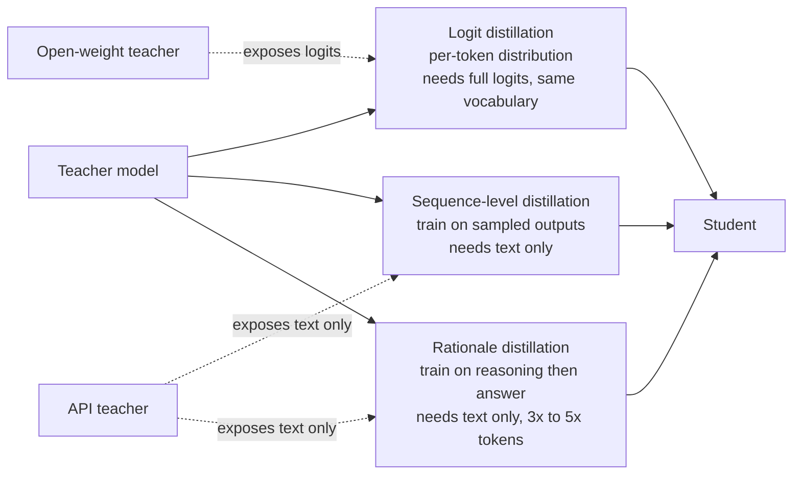
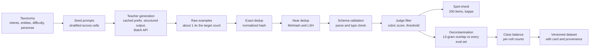
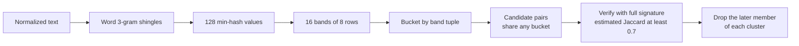
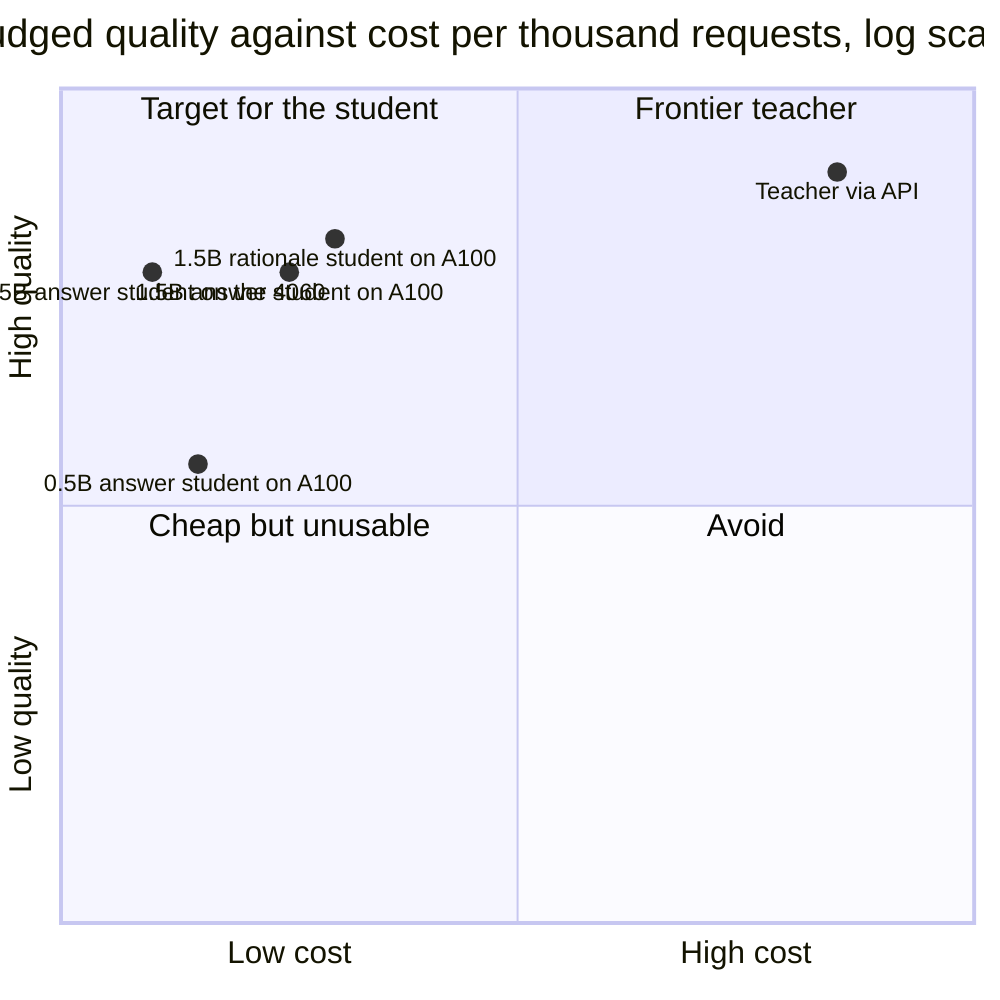
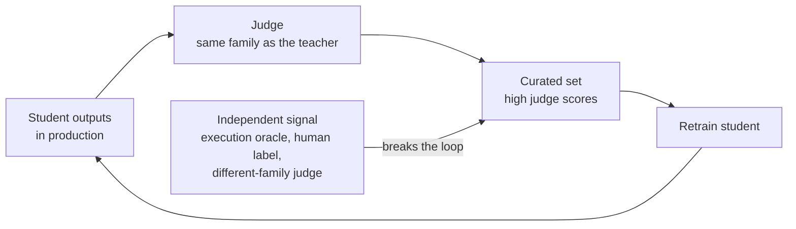

# Chapter 10: Synthetic Data and Distillation

> **What you will be able to do.** Choose between logit, sequence-level, and rationale distillation from the constraints of the teacher you have; generate a diverse synthetic dataset from a taxonomy with structured outputs, prompt caching, and the Batch API; curate it with exact and MinHash deduplication, schema validation, judge filtering with a measured spot-check, and 13-gram decontamination; write a dataset card with provenance; and defend a cost-quality chart that shows what a 1.5B student retained of a frontier teacher.
> **Where it is used.** P1.5 (synthetic data and distillation), P3.1 (the data flywheel), and every later engagement where a frontier model proves a use case and a small model has to run it.
> **Prerequisites.** Chapter 7 for the SFT recipe the student uses. Chapter 6, section on deduplication, for the MinHash derivation. Chapter 11 for the bootstrap intervals and Cohen's kappa this chapter reports.

## 10.0 The problem this chapter solves

A customer's analytics team has been using a frontier model through an API to turn plain-English questions into structured query plans. The pilot worked. The volume forecast is 400,000 requests a month, each with a 1,700-token prompt and a 300-token answer. At the prices in the roadmap's Appendix D that is about $2,600 a month before caching, the p50 latency is two seconds, and the security team has asked why customer schema names leave the network at all. The three complaints are cost, latency, and residency, and they arrive together.

The standard answer is distillation. A frontier teacher generates a large, diverse set of worked examples for the narrow task. A small student, 0.5B to 3B parameters, is fine-tuned on them with the recipe from Chapter 7. The student runs on one rented GPU or inside the customer's network at a small fraction of the cost per request. On a narrow, well-specified task the student commonly retains 90 percent or more of the teacher's judged quality. On open-ended reasoning it does not, and part of this chapter is knowing which case you are in before you promise anything.

The engineering is not the fine-tuning; that is one command by the time you reach P1.5. The engineering is the data. A synthetic dataset generated carelessly is narrow (the teacher's favorite phrasings repeated ten thousand times), contaminated (it paraphrases your evaluation set), and biased (it inherits every systematic error of the teacher). The pipeline in this chapter exists to produce diversity and validity by construction and to measure both. Every step leaves a number on the dataset card.

The chapter closes with the measurement that decides the engagement: judged quality on the vertical axis, cost per thousand requests on a logarithmic horizontal axis, one point per system with a confidence interval. A finance lead reads that chart in thirty seconds. Producing it honestly takes the statistics of Chapter 11, so the two chapters are meant to be read together.

## 10.1 Why distill: cost, latency, residency

Distillation is a trade. You spend teacher tokens once, at generation time, to remove the teacher from the request path forever. Three quantities decide whether the trade pays.

**Cost.** Define the cost per thousand requests of an API system as

$$
C_{\text{api}} = \frac{t_{\text{in}} \, p_{\text{in}} + t_{\text{cache}} \, p_{\text{cache}} + t_{\text{out}} \, p_{\text{out}}}{10^6} \times 1000
$$

where $t_{\text{in}}$, $t_{\text{cache}}$, and $t_{\text{out}}$ are the average uncached input, cached input, and output tokens per request, and $p_{\text{in}}$, $p_{\text{cache}}$, $p_{\text{out}}$ are the prices in dollars per million tokens. For a self-hosted system the cost per thousand requests is

$$
C_{\text{host}} = \frac{P_{\text{gpu}}}{R} \times 1000
$$

where $P_{\text{gpu}}$ is the GPU price per hour and $R$ is the sustained requests per hour at the utilization you actually achieve. The denominator is the trap: a GPU that serves 30 percent of its capacity costs three times as much per request as the benchmark number suggests. Chapter 13 develops the full model with utilization sensitivity; here you need the ratio.

Worked example with the assumed prices of $2 per million input tokens, $10 per million output tokens, and cache reads at one tenth of the input price (assumed, verify; these are the values the roadmap's Appendix D used in September 2026). A request with 1,500 cached prompt tokens, 200 uncached tokens, and 300 output tokens costs $(1500 \times 0.2 + 200 \times 2 + 300 \times 10)/10^6 = 0.0037$ dollars, so $C_{\text{api}} = 3.70$ dollars per thousand requests, or $6.40$ without caching. A 1.5B student on a rented A100 at $1.39 per hour (RunPod Community Cloud, September 2026, verify) that sustains an aggregate 1,500 output tokens per second at 300 tokens per request handles 18,000 requests per hour, so $C_{\text{host}} = 1.39 / 18000 \times 1000 = 0.077$ dollars per thousand requests. The ratio is about 48 to 1 against the cached teacher. The definition of done for P1.5 asks for 10 to 1, which leaves room for a GPU at 25 percent utilization.

**Latency.** A frontier API request pays network round trip, queueing, and a decode speed you do not control. A 1.5B model on a local GPU decodes at tens to low hundreds of tokens per second per stream and has no network hop. For the interactive analytics case, a 300-token answer that took two seconds from the API takes well under a second locally. For the batch case latency does not matter and cost dominates.

**Residency.** Some customers cannot send schema names, column values, or patient text to a third party. A student that runs in their VPC or on-premises removes the question. This is often the decisive argument, and it is binary: no price makes the API acceptable.

The consequence for practice: before generating a single example, write down the three numbers for the teacher (cost per thousand, p50 latency, residency status) and the targets for the student. The chart in section 10.6 is the same three numbers measured after the fact.

## 10.2 Three forms of distillation

Knowledge distillation, in the sense of Hinton, Vinyals, and Dean (2015, "Distilling the Knowledge in a Neural Network"), trains a student to match a teacher's output distribution rather than hard labels. For language models the idea splits into three forms that differ in what the teacher must expose.



*Figure 10.1: The three distillation forms and which kind of teacher can supply each.*

### 10.2.1 Logit distillation with temperature

**Intuition.** A hard label says "the next token is `SELECT`". The teacher's full distribution says "`SELECT` with probability 0.87, `WITH` with 0.11, `select` with 0.01". The second and third entries carry information about which alternatives are plausible, which Hinton and colleagues called dark knowledge. Raising the temperature flattens the distribution so the small probabilities become visible to the student.

**Precise statement.** Let $z \in \mathbb{R}^V$ be the teacher's logits at one position over a vocabulary of size $V$ and $v \in \mathbb{R}^V$ the student's logits at the same position. At temperature $T > 0$ the softened distributions are

$$
p_i^{(T)} = \frac{\exp(z_i / T)}{\sum_{j=1}^{V} \exp(z_j / T)}, \qquad q_i^{(T)} = \frac{\exp(v_i / T)}{\sum_{j=1}^{V} \exp(v_j / T)}
$$

The distillation loss at that position is the Kullback-Leibler divergence from teacher to student, scaled by $T^2$, mixed with the ordinary cross-entropy on the ground-truth token $y$:

$$
\mathcal{L} = (1 - \lambda) \, \mathrm{CE}(y, q^{(1)}) + \lambda \, T^2 \, \mathrm{KL}\!\left(p^{(T)} \,\|\, q^{(T)}\right), \qquad \mathrm{KL}(p \| q) = \sum_{i=1}^{V} p_i \log \frac{p_i}{q_i}
$$

where $\lambda \in [0, 1]$ weights the two terms. The gradient of the KL term with respect to the student's logits is

$$
\frac{\partial}{\partial v_i} \mathrm{KL}\!\left(p^{(T)} \| q^{(T)}\right) = \frac{1}{T}\left(q_i^{(T)} - p_i^{(T)}\right)
$$

In the high-temperature limit $\exp(z_i/T) \approx 1 + z_i/T$, and if the teacher and student logits have the same mean, $q_i^{(T)} - p_i^{(T)} \approx (v_i - z_i)/(V T)$, so the gradient scales as $1/T^2$. Multiplying the KL term by $T^2$ keeps its gradient comparable to the cross-entropy term as you change $T$. That is the only reason the factor is there. The sequence loss is the mean over positions.

**Worked example.** Take a three-token vocabulary with teacher logits $z = (4, 2, 0)$ and student logits $v = (3, 2, 1)$.

| $T$ | Teacher $p^{(T)}$ | Student $q^{(T)}$ | $\mathrm{KL}$ | $T^2 \, \mathrm{KL}$ | Gradient $(q - p)/T$ |
|---|---|---|---|---|---|
| 1 | (0.867, 0.117, 0.016) | (0.665, 0.245, 0.090) | 0.1156 | 0.1156 | (-0.202, 0.127, 0.074) |
| 2 | (0.665, 0.245, 0.090) | (0.507, 0.307, 0.186) | 0.0603 | 0.2411 | (-0.079, 0.031, 0.048) |
| 4 | (0.507, 0.307, 0.186) | (0.419, 0.327, 0.254) | 0.0191 | 0.3057 | (-0.022, 0.005, 0.017) |

At $T = 1$ the third token contributes 0.074 of gradient, about a third of the first token's. At $T = 2$ it contributes 0.048 against 0.079, well over half. The temperature has shifted the student's attention toward the tail, which is the point. At $T = 4$ the raw gradients have shrunk by an order of magnitude, which is why the $T^2$ factor is applied.

**Consequence for practice.** Logit distillation needs the teacher's logits at every position of every training sequence over the student's vocabulary. That means an open-weight teacher, the same tokenizer (or a vocabulary alignment step, which is a research topic in its own right), and either a teacher forward pass during every training step or stored logits. Storing full logits is out of the question: $V = 150{,}000$ tokens times 4 bytes times 6 million training tokens is 3.6 TB. Storing the top-$k$ logits with $k = 64$ cuts that to about 2.3 GB but truncates the tail you were trying to learn from. On-the-fly teacher forward passes are the norm, and they need both models in memory; section 10.10 gives the numbers for the 4060. API teachers return at most a handful of top log-probabilities per position, over their own tokenizer, which is not enough. The forward KL in the loss above is the classical choice. Gu and colleagues (2023, "MiniLLM: Knowledge Distillation of Large Language Models") argue for the reverse KL for generative models because it avoids the student spreading mass over teacher modes it cannot fit, and Agarwal and colleagues (2023, "On-Policy Distillation of Language Models: Learning from Self-Generated Mistakes") sample from the student and score with the teacher. Both are refinements of the same mechanism, and both need teacher logits.

### 10.2.2 Sequence-level distillation

**Intuition.** If you cannot see the teacher's distribution, sample from it. A teacher output is one draw from $p_{\text{teacher}}(y \mid x)$. Training the student with ordinary next-token cross-entropy on those draws is a single-sample Monte Carlo estimate of minimizing the sequence-level forward KL between teacher and student. Kim and Rush (2016, "Sequence-Level Knowledge Distillation") introduced this for machine translation, and it is what every "train on GPT-4 outputs" dataset since has done.

**Precise statement.** With teacher samples $\{(x_j, y_j)\}_{j=1}^{N}$, $y_j \sim p_{\text{teacher}}(\cdot \mid x_j)$, the loss is the SFT loss of Chapter 7:

$$
\mathcal{L}_{\text{seq}} = -\frac{1}{N} \sum_{j=1}^{N} \sum_{t=1}^{|y_j|} \log q\!\left(y_{j,t} \mid x_j, y_{j,<t}\right)
$$

with the completion-only mask so that prompt tokens carry no loss. Nothing about the loss is new. What changes is the data: the targets are teacher samples, not human labels, so their quality is the teacher's quality, filtered by whatever curation you apply.

**Worked example.** One teacher sample per prompt for 10,000 prompts at 300 output tokens is 3 million target tokens. Because the targets are samples rather than distributions, the student sees one plausible answer per prompt, not the alternatives. Sampling two or three answers per prompt at temperature 0.7 and keeping the ones that pass validation recovers some of that spread at proportionally higher generation cost.

**Consequence for practice.** This is the form available from every API teacher and the one P1.5 uses for the answer-only variant. Its quality ceiling is the teacher's; its floor is set by curation. A verifiable task (SQL that executes, JSON that validates against a schema) lets you filter teacher samples to the correct ones, which is why students on narrow verifiable tasks can match and occasionally exceed the unfiltered teacher on consistency.

### 10.2.3 Rationale distillation

**Intuition.** Ask the teacher to explain before it answers, and train the student to produce the explanation and then the answer. The explanation supplies the intermediate steps the student would otherwise have to infer from the answer alone. Hsieh and colleagues (2023, "Distilling Step-by-Step! Outperforming Larger Language Models with Less Training Data and Smaller Model Sizes") showed smaller students matching larger ones with less data when trained this way; Mukherjee and colleagues (2023, "Orca: Progressive Learning from Complex Explanation Traces of GPT-4") built a 13B model largely on explanation traces.

**Precise statement.** The target sequence becomes $y = (r, a)$, the rationale followed by the answer, and the loss is the same completion-only cross-entropy as above over both parts. A common variant weights the answer tokens higher or trains two heads; in P1.5 use the plain sequence and let the chart decide.

**Worked example.** The analytics task's answer is about 60 tokens of JSON. A rationale that names the relevant tables, states the join, and justifies the aggregation runs about 250 tokens. Inference emits 310 tokens instead of 60. At a single-stream decode rate of about 60 tokens per second for a 1.5B bf16 model on the 4060 (an approximation from the roughly 256 GB per second of memory bandwidth divided by about 3.1 GB of weights, which bounds decode at about 80 tokens per second), the answer-only student responds in about one second and the rationale student in about five. On an API at $10 per million output tokens the two requests cost $0.0006 and $0.0031. The student that reasons costs five times more per request, forever.

**Consequence for practice.** Rationale distillation buys accuracy on multi-step tasks (joins with filters, date arithmetic, nested aggregations) and costs latency and tokens on every request. Generate the rationale variant once; the answer-only dataset is the same data with the rationale stripped, so one generation pass yields both training sets. Measure the accuracy gain per taxonomy cell (section 10.3.1). If the gain concentrates in the hard cells, a routing policy that only reasons on hard inputs (Chapter 16) can capture most of the gain at a fraction of the cost.

### 10.2.4 Which form you can use

| Form | Needs from the teacher | API teacher | Data volume | Inference cost | Best for |
|---|---|---|---|---|---|
| Logit | Full logits per position, shared vocabulary | No | Teacher forward per step, or stored top-$k$ | Same as student | Open-weight teacher, maximum sample efficiency |
| Sequence-level | Sampled text | Yes | Output tokens once | Same as student | Narrow tasks, verifiable outputs |
| Rationale | Sampled reasoning plus answer | Yes | 3x to 5x output tokens | 3x to 5x student decode | Multi-step tasks where the answer-only student fails |

## 10.3 Generating diverse, valid data

Two properties decide a synthetic dataset: diversity, so the student generalizes instead of memorizing the teacher's favorite phrasings, and validity, so every example is well-formed and correct enough to train on. Each has a pipeline step that enforces it.



*Figure 10.2: The generation and curation pipeline; every stage writes its input and output counts to the dataset card.*

### 10.3.1 Taxonomy-driven generation

**Intuition.** If you ask a teacher for "10,000 analytics questions about advertising data", you get the mode of its distribution: the same forty questions in slightly different words. If you ask for one question per cell of an explicit grid of intents, entities, difficulty levels, and personas, you get coverage by construction, and you get a label on every example that you will use for balance checks, per-slice evaluation, and routing later.

**Precise statement.** A taxonomy is a set of axes $A_1, \dots, A_m$ with finite value sets; a cell is one element of the Cartesian product $A_1 \times \cdots \times A_m$ with $\prod_i |A_i|$ cells in total. A sampling plan assigns each cell a count $n_c$ with $\sum_c n_c = N$. Stratified sampling guarantees a floor $n_{\min}$ per cell and distributes the remainder by weights $w_c$ that encode which cells matter more (hard cells, cells that failed in the pilot).

**Worked example.** Eight intents (trend, comparison, top-k, anomaly, share, forecast, attribution, definition) times six entities (campaign, ad group, keyword, product, region, device) times three difficulty levels (single table, join, window function) times four personas (analyst, marketer, executive, engineer) is 576 cells. For $N = 10{,}000$, a uniform plan gives about 17 per cell. With a floor of 8 per cell (4,608 examples) and the remaining 5,392 distributed with weight 1.5 on window-function cells, the 192 window-function cells end up near 20 each and the other 384 cells near 16, with sampling noise of a few either way. Each seed prompt also carries a random nonce so that the teacher does not produce identical text for the same cell.

**Consequence for practice.** The taxonomy is the design document for the dataset. Write it before you call the API, review it with whoever knows the domain, and store the cell identifier on every example. Listing 10.1 implements the sampler. Two refinements cost little: personas change the register of the questions (an executive asks "are we wasting money on X", an engineer asks "which rows have a null cost"), and an explicit "edge case" value on the difficulty axis (empty result, ambiguous entity, out-of-range date) produces the examples that make the student robust. Persona-driven generation at scale is the idea behind Persona Hub (Ge and colleagues, 2024, circa).

### 10.3.2 Structured outputs and schema validation

Constrain the teacher to a schema. Define the output as a typed object (a Pydantic model in P1.5), pass its JSON schema to the API's structured-output mode where available, and validate every response on receipt. Validation checks three things: the response parses; every field has the declared type and allowed values; and cross-field rules hold (a `GROUP BY` plan names at least one aggregation, a date range has start before end). Anything that fails is retried at most twice with the validation error appended to the prompt, then dropped. The drop rate is a dataset-card metric; a rate above a few percent usually means the schema and the instructions disagree.

For tasks with an executable oracle, validation includes execution: run the SQL against the synthetic database with a timeout, and keep only examples that execute and return a non-empty result unless the cell is an "empty result" edge case. This is the filter that lets a student trained on teacher samples equal the teacher on correctness: the student never sees the teacher's execution failures.

### 10.3.3 Prompt caching and the Batch API

The generation prompt has a large fixed part (instructions, the schema, the rubric, three to five examples) and a small variable part (the seed prompt for this cell). Put the fixed part first, the variable part last, and the fixed part is served from the provider's prompt cache at a fraction of the input price. Check the usage fields on the first few responses: the cached-token count must be non-zero, or the prefix is not stable (a timestamp, a random example order, or a per-request identifier in the prefix silently invalidates the cache; Chapter 16 lists the invalidators).

Anything you do not need interactively goes through the provider's Batch API, which trades hours of turnaround for a discount (about 50 percent as of mid-2026; verify). Generation and judge passes are both batch work. Submit the batch before bed, curate in the morning.

**Worked cost estimate for 10,000 examples.** Assumed prices, verify before spending: $2 per million uncached input tokens, $0.20 per million cached input tokens, $10 per million output tokens, Batch API at half price. Assumed token counts, verify against your own first hundred calls: 1,500 cached prefix tokens, 200 uncached variable tokens, 300 output tokens for the answer-only format, 900 output tokens for the rationale format. Generate 14,000 raw examples to keep 10,000 after curation (an overgeneration factor of 1.4; measure yours after the first batch).

| Variant | Raw count | No cache, no batch | Cache only | Batch only | Cache and batch |
|---|---|---|---|---|---|
| Answer only | 10,000 | $64.00 | $37.00 | $32.00 | $18.50 |
| Answer only | 14,000 | $89.60 | $51.80 | $44.80 | $25.90 |
| Rationale | 10,000 | $124.00 | $97.00 | $62.00 | $48.50 |
| Rationale | 14,000 | $173.60 | $135.80 | $86.80 | $67.90 |

Arithmetic for the first cell: $10{,}000 \times (1700 \times 2 + 300 \times 10) / 10^6 = 34 + 30 = 64$ dollars. With caching, input drops to $10{,}000 \times (1500 \times 0.2 + 200 \times 2)/10^6 = 7$ dollars while output stays at $30$. Output tokens dominate as soon as caching is on, which is why the rationale variant costs 2.6 times the answer-only variant and why keeping rationales tight (a 400-token budget, stated in the prompt) matters more than any other lever. A judge pass over the 14,000 raw examples with a 600-token cached rubric, 400 uncached tokens of example, and 80 output tokens costs $24.08, or $12.04 in batch.

The roadmap's Appendix D budgets $25 to $60 of API spend for P1.5. The estimate above meets it with all four levers: cache on, Batch API on, one generation pass in the rationale format from which the answer-only set is derived by stripping the rationale, and a rationale budget near 400 to 500 tokens. At 500 output tokens, 14,000 raw examples cost about $40 to generate and $12 to judge in batch, about $52 in total; the lean path's cap of 5,000 examples brings it near $26.

### 10.3.4 The lineage

Self-Instruct (Wang and colleagues, 2022, "Self-Instruct: Aligning Language Models with Self-Generated Instructions") bootstrapped instructions from a seed set by asking the model for more, filtering by ROUGE overlap for diversity. Stanford Alpaca (Taori and colleagues, 2023) applied the recipe with a commercial teacher to produce 52,000 examples for about $500, the moment sequence-level distillation from API teachers became the default. WizardLM (Xu and colleagues, 2023, "WizardLM: Empowering Large Language Models to Follow Complex Instructions") evolved instructions toward harder variants. Orca (2023) added explanation traces and system prompts that vary the register, which is rationale distillation at scale. phi-1 (Gunasekar and colleagues, 2023, "Textbooks Are All You Need") showed that a small model trained on filtered and synthetic textbook-quality data beats larger models trained on raw web code, the strongest evidence that curation, not volume, sets the ceiling. The pipeline in this chapter is those five ideas made routine: taxonomy for diversity, structure for validity, rationales when the task needs them, filtering as the main lever.

## 10.4 Curation

Curation removes what would hurt the student: duplicates that overweight a phrasing, malformed outputs, low-quality answers, and anything that overlaps an evaluation set. Each step has a measurable effect and a number for the card.

### 10.4.1 Exact deduplication

Normalize each text (lowercase, collapse whitespace, strip trailing punctuation), hash it (BLAKE2 or SHA-256; speed does not matter at 14,000 items), and keep the first occurrence. Run it twice: once on the prompt alone, so that two different answers to the same question do not both survive unless you want them to, and once on prompt plus response. Expect 1 to 3 percent exact duplicates from a taxonomy-driven generator with nonces, and far more without nonces.

### 10.4.2 MinHash near-deduplication

**Intuition.** Two generated examples that differ in three words are the same example for the student. Exact hashing misses them. MinHash estimates the set overlap between two texts from short signatures, and locality-sensitive hashing (LSH) finds the candidate pairs without comparing every pair.

**Restated result from Chapter 6.** Represent a text as its set of shingles $A$ (here, word 3-grams over the normalized prompt and response). The Jaccard similarity of two texts is

$$
J(A, B) = \frac{|A \cap B|}{|A \cup B|}
$$

For a random hash function $h$ over shingles, the probability that the minimum hash value agrees is exactly the Jaccard similarity: $P[\min_{x \in A} h(x) = \min_{x \in B} h(x)] = J(A, B)$. With $k$ independent hash functions the signature is the vector of $k$ minima, and the fraction of agreeing positions

$$
\hat{J} = \frac{1}{k} \sum_{j=1}^{k} \mathbb{1}\!\left[\min_{x \in A} h_j(x) = \min_{x \in B} h_j(x)\right]
$$

is an unbiased estimate of $J$ with variance $J(1 - J)/k$. At $k = 128$ and $J = 0.7$ the standard error is about 0.04.

LSH splits the $k$ positions into $b$ bands of $r$ rows each ($b \, r = k$) and buckets each text by the tuple of its $r$ values in each band. Two texts become a candidate pair if they share a bucket in any band. The probability of that is

$$
P(\text{candidate}) = 1 - \left(1 - J^{r}\right)^{b}
$$

an S-shaped curve with its steepest point near the threshold $J^* \approx (1/b)^{1/r}$.

**Worked example.** With $k = 128$, $b = 16$, $r = 8$: $J^* = (1/16)^{1/8} = 0.707$. The candidate probability is 0.061 at $J = 0.5$, 0.237 at $0.6$, 0.613 at $0.7$, 0.947 at $0.8$, and 0.9999 at $0.9$. Pairs at 0.9 are essentially never missed; pairs at 0.5 are rarely proposed, and the ones that are get rejected when the full 128-position estimate is checked against the threshold. If you want to catch 0.6-similar pairs, move to $b = 32$, $r = 4$ ($J^* = 0.42$) and accept many more false candidates to verify. If you only want near-identical text, $b = 8$, $r = 16$ ($J^* = 0.88$).



*Figure 10.3: MinHash signatures and LSH banding turn all-pairs comparison into bucket lookups.*

**Consequence for practice.** For short synthetic examples (20 to 80 words), word 3-grams and a threshold of 0.7 catch paraphrase-level duplicates without merging examples that legitimately share a schema prefix. Run near-dedup on the response too, not just the prompt: a teacher that returns the same JSON plan for forty different questions is telling you the questions were not really different. Expect 3 to 10 percent removal from a taxonomy-driven set; a rate above 20 percent means the taxonomy has cells the teacher cannot distinguish. Listing 10.2 implements the pass in pure Python; at 14,000 items it runs in seconds. Lee and colleagues (2021, "Deduplicating Training Data Makes Language Models Better") measured the effect of the same procedure on pretraining data.

### 10.4.3 Schema validation as a filter

Validation already ran at generation time (section 10.3.2). Run it again over the stored dataset before training, with the final schema version, and record the drop count. Schemas drift during a project; an example that validated against version 3 of the plan schema may not validate against version 5, and the student must be trained on the schema it will serve.

### 10.4.4 Judge filtering, the rubric, and the spot-check

**Intuition.** Execution tells you the SQL ran; it does not tell you the question was natural, the plan was the simplest correct one, or the rationale was sound. A judge model scoring each example against a rubric fills that gap, at the price of inheriting the judge's biases. Chapter 11 treats the judge as a measurement instrument; here it is a filter, and the question is whether the filter agrees with you.

**Rubric.** Three to five criteria, each with anchored levels, an output format that puts the reasoning before the score, and two or three worked examples of each level. For the analytics task: naturalness of the question (1 to 5, with a level-2 anchor "grammatical but no analyst would phrase it this way"), correctness of the plan against the schema (pass or fail), minimality (no unnecessary joins or columns), and, for the rationale variant, soundness (every step justified by the schema or the question). Score absolute, not pairwise, because you are filtering single examples. Set the keep threshold from the spot-check, not by intuition.

**Spot-check protocol.** Sample 200 judged examples stratified across taxonomy cells and across the judge's score range so that borderline items are represented. Label each one yourself, blind to the judge's score, as keep or drop by your own standard. Cross-tabulate. Compute the observed agreement, Cohen's kappa (Chapter 11, section 11.7 gives the formula and bands), and the precision of the judge's keep decisions from your point of view.

**Worked example.** Of 200 items, the judge kept 170 and dropped 30. You would keep 160 and drop 40. The cross-table: both keep 150, judge keep and you drop 20, judge drop and you keep 10, both drop 20. Observed agreement is $p_o = (150 + 20)/200 = 0.85$. The chance agreement from the marginals is $p_e = 0.85 \times 0.80 + 0.15 \times 0.20 = 0.71$. Kappa is $(0.85 - 0.71)/(1 - 0.71) = 0.483$, moderate. The judge's keep precision by your standard is $150/170 = 88.2$ percent with a standard error of about $\sqrt{0.882 \times 0.118 / 170} = 0.025$, so between about 83 and 93 percent. About 12 percent of your training set is material you would have rejected.

**Consequence for practice.** Decide the acceptance rule before you look: for a filter, kappa of at least 0.6 and keep precision of at least 95 percent. The example fails both, and the fix is one of three: raise the threshold (trading yield for precision), rewrite the rubric anchors around the items you disagreed on, or change the judge. Rerun the spot-check on a fresh 200 after any change. Record the final table, kappa, precision, judge model string, rubric version, and date on the dataset card. The spot-check labels also become the calibration set for Chapter 11 when the same judge is later used to score the student.

### 10.4.5 Decontamination against every evaluation set

**Intuition.** If a training example is a paraphrase of an evaluation item, the student's score on that item measures memory, not skill. The teacher has seen the public evaluation sets, and a taxonomy cell that resembles them will reproduce them.

**The 13-gram heuristic.** Brown and colleagues (2020, "Language Models are Few-Shot Learners") flagged an evaluation item as contaminated if any 13-gram of it (after lowercasing and stripping punctuation) appeared in the training data. Thirteen was chosen to make accidental matches rare in English prose; later work has used 8 to 10 words, 50-character substrings, or token-level n-grams. The mechanism is the same: build the set of all n-grams over every evaluation item, and for each training example check whether any of its n-grams is in that set.

**Procedure.** For each evaluation set you will ever use on the student (Spider dev, your own held-out set, the calibration set, the customer replay set): normalize both sides identically; build an index from each 13-gram to the evaluation items containing it; for each training example, compute its 13-grams and look each one up; remove any training example with a hit and record which evaluation items it touched. Items shorter than 13 words are indexed as a single whole-item gram, which catches exact copies but not paraphrases; for sets of short items (questions of 8 to 12 words), lower $n$ to 8 and index question and answer separately.

**Worked example.** A 10,000-example training set with an average of 90 words per example yields about 780,000 13-grams. A 1,034-item evaluation set with an average of 15 words per question and 20 tokens per SQL yields about 24,000 grams. Building the index and checking takes under a second in Python. Typical outcomes on a taxonomy-generated set with a synthetic schema: zero hits against Spider dev, because the entity names differ; several hits against your own held-out set if you generated it with the same taxonomy, which is exactly the case where the check earns its keep. Expect the hits to concentrate in the "definition" intent, where questions are formulaic.

**Consequence for practice.** N-gram overlap misses semantic paraphrases. For the held-out set you built yourself, add an embedding check: embed every training and evaluation item with the same model, and inspect training items whose cosine similarity to any evaluation item exceeds a threshold you set by looking at the top fifty pairs. Report both checks on the dataset card and on the model card. What you cannot fix, you disclose: the base model's pretraining corpus may contain the public benchmark, and no filter on your training set changes that.

### 10.4.6 Class balance

Every filter removes examples unevenly. Judges drop hard cells more than easy ones; execution filters drop window-function cells more than single-table cells; near-dedup drops formulaic intents. After curation, count examples per taxonomy cell and per axis value. Set a floor (for example, 60 percent of the planned count) and a cap (200 percent). Regenerate for cells below the floor with the validation errors from the dropped examples fed back into the prompt, and subsample cells above the cap. Report the before-and-after cell counts on the card. A student trained on the unbalanced set will be strongest exactly where the task is easiest, and the per-slice evaluation in Chapter 11 will show it.

## 10.5 Dataset cards, provenance, and licensing

A dataset card is the document that answers, a year later, "where did this come from and can we use it". Gebru and colleagues (2018, "Datasheets for Datasets") set the pattern; the Hugging Face Hub renders a `README.md` with YAML metadata as the card. Write it as the pipeline runs, not afterward.

The card carries: the task and the output schema (with version); the teacher model's identifier string, the generation date range, and the prompt templates (verbatim or by hash); the taxonomy, the sampling plan, and the per-cell counts before and after curation; the funnel (raw count, after exact dedup, after near-dedup, after validation, after judge, after decontamination, final); every threshold (MinHash parameters, judge cutoff); the spot-check table, kappa, precision, and rater; the decontamination sets checked and the hit counts; known gaps (cells that could not be filled, edge cases not covered); the license of the dataset and the terms of the teacher's API; and a change log.

Provenance lives on each example, not only on the card. Store with every row: the taxonomy cell, the seed prompt hash, the teacher identifier, the generation timestamp, the judge score and rubric version, the dedup cluster identifier if any, and a flag for any decontamination hit that was overridden. These fields make the per-slice tables in Chapter 11 possible and make the flywheel in Chapter 17 auditable.

Licensing has two sides. Your dataset needs a license; for synthetic data over invented schemas, a permissive license is normal. The teacher's outputs are governed by the provider's terms of use, which as of mid-2026 commonly restrict using outputs to train models that compete with the provider; the exact wording differs by provider and changes, so read the current terms on the day you generate and quote the relevant clause on the card. Customers' legal teams ask this question, and the answer must not be "I think it is fine".

## 10.6 Measuring the trade

**Intuition.** The engagement question is not "is the student good" but "how much quality did we give up for how much cost". Both axes need numbers with intervals, and cost spans orders of magnitude, so the horizontal axis is logarithmic.

**Precise statement.** For each system $s$ (teacher, each student size, each distillation variant, each serving target) measure judged quality $Q_s$ with a 95 percent bootstrap interval on the same evaluation items (Chapter 11), and cost per thousand requests $C_s$ from the formulas of section 10.1 with measured tokens and measured throughput. Report retained quality $Q_s / Q_{\text{teacher}}$ and cost ratio $C_{\text{teacher}} / C_s$. The definition of done for P1.5 is retained quality of at least 0.90 at a cost ratio of at least 10.



*Figure 10.4: The cost-quality plane; the student that lands in the upper-left quadrant is the one you ship. Coordinates are illustrative positions, not measurements.*

**Worked example.** Teacher: judged quality 0.91 with interval [0.89, 0.93], $C = 3.70$ per thousand (cached). 1.5B rationale student on a rented A100: 0.85 [0.82, 0.88], $C = 0.077$; retained 0.934, ratio 48. 1.5B answer-only student: 0.81 [0.78, 0.84], $C = 0.05$; retained 0.89, ratio 74. 0.5B answer-only: 0.66 [0.62, 0.70], $C = 0.03$; retained 0.73. The 1.5B rationale student meets both criteria; the answer-only 1.5B misses retained quality by one point, and its interval overlaps 0.90, so the honest statement is "we cannot distinguish it from the threshold with this evaluation set". Listing 10.4 builds this table.

**The student-teacher gap and task narrowness.** The gap is small when the task has a closed output space, a verifiable oracle that filtered the training data, and a taxonomy that covers the deployment distribution. It grows with open-ended outputs (free-text summaries), with reasoning depth (multi-hop questions), and with distribution shift (a new schema the taxonomy never saw). Measure the gap per taxonomy cell, not just overall: a student at 0.93 retained overall and 0.60 on window-function cells is a student that needs a router.

**Consequence for practice.** The chart, the table, and one page of prose are the deliverable. State the evaluation set, its size, the judge and its calibration, the token counts and prices with the word "assumed" where they are, and the utilization assumed for the hosted cost. Every one of those is a question a customer's data scientist will ask.

## 10.7 Risks of synthetic data

**Mode collapse and diversity loss.** A student trained on samples from a teacher's distribution learns a narrower distribution than the teacher's; a second generation trained on the student's samples narrows further. Shumailov and colleagues (2024, "AI models collapse when trained on recursively generated data") showed the tails disappearing over generations. Measure diversity on every dataset version: distinct n-gram ratio, mean pairwise embedding distance, and taxonomy cell coverage. A falling number is the early signal.

**Teacher bias inheritance.** The student learns the teacher's systematic errors (a wrong date-handling convention), style tics, and refusal patterns. Filtering with an oracle removes the errors the oracle can see and none of the others. Ask what the teacher gets wrong on your task before you generate; the spot-check in section 10.4.4 is also where you find it.

**Judge and teacher from the same family.** A judge from the same model family as the teacher favors the teacher's style, and it favors a student that imitates that style. Chapter 11 measures this as self-preference bias. Use a judge from a different family for the final chart, or calibrate the judge against human labels and report the calibration.

**Feedback loops.** In the flywheel of Chapter 17 the student's own outputs are curated back into training data. Without an independent signal, this is recursive training on the student's distribution, which is the collapse setting above.



*Figure 10.5: The feedback loop that collapses a model, and the single rule that breaks it.*

The single preventive rule: never train a model on its own outputs unless each example was selected by a signal independent of the model and its judge, meaning an execution check, a human label, or a judge from a different family whose agreement with humans you have measured.

## 10.8 Implementation notes

**Listing 10.1: A taxonomy sampler that produces stratified seed prompts with cell identifiers.**

```python
import itertools, random
from dataclasses import dataclass, field

@dataclass
class Taxonomy:
    axes: dict[str, list[str]]
    weights: dict[str, dict[str, float]] = field(default_factory=dict)

    def cells(self) -> list[dict[str, str]]:
        names = list(self.axes)
        return [dict(zip(names, combo))
                for combo in itertools.product(*(self.axes[n] for n in names))]

    def cell_weight(self, cell: dict[str, str]) -> float:
        w = 1.0
        for axis, value in cell.items():
            w *= self.weights.get(axis, {}).get(value, 1.0)
        return w

def sample_seeds(tax: Taxonomy, n: int, template: str, seed: int = 0):
    rng = random.Random(seed)
    cells = tax.cells()
    weights = [tax.cell_weight(c) for c in cells]
    floor = max(1, n // (2 * len(cells)))          # guaranteed minimum per cell
    plan = {i: floor for i in range(len(cells))}
    remainder = n - floor * len(cells)
    for i in rng.choices(range(len(cells)), weights=weights, k=max(0, remainder)):
        plan[i] += 1
    for i, count in plan.items():
        cell = cells[i]
        cell_id = "/".join(f"{k}={v}" for k, v in cell.items())
        for j in range(count):
            yield {"cell_id": cell_id, "replicate": j, **cell,
                   "prompt": template.format(**cell, nonce=rng.randrange(10**6))}

tax = Taxonomy(
    axes={"intent": ["trend", "comparison", "top_k", "anomaly",
                     "share", "forecast", "attribution", "definition"],
          "entity": ["campaign", "ad_group", "keyword", "product", "region", "device"],
          "difficulty": ["single_table", "join", "window"],
          "persona": ["analyst", "marketer", "executive", "engineer"]},
    weights={"difficulty": {"window": 1.5}},
)
TEMPLATE = ("Write one {difficulty} analytics question that a {persona} would ask "
            "about {entity} data with the intent '{intent}'. Vary the phrasing. "
            "Variation seed {nonce}.")
seeds = list(sample_seeds(tax, 10_000, TEMPLATE))
```

The plan is built in two passes: a floor of $n / (2 \cdot \text{cells})$ per cell guarantees coverage, and the remainder is drawn by weight, so raising a weight shifts examples toward hard cells without emptying easy ones. The `cell_id` string is the join key for every later per-slice table. The `nonce` is the cheapest diversity lever there is: without it, a deterministic teacher at low temperature returns near-identical text for replicates of the same cell, and near-dedup removes most of them.

**Listing 10.2: A MinHash near-deduplication pass with LSH banding, pure Python.**

```python
import hashlib, random
from collections import defaultdict

P = (1 << 61) - 1                      # Mersenne prime for universal hashing

def shingles(text: str, n: int = 3) -> set[int]:
    words = text.lower().split()
    grams = {" ".join(words[i:i + n]) for i in range(max(1, len(words) - n + 1))}
    return {int.from_bytes(hashlib.blake2b(g.encode(), digest_size=8).digest(), "big")
            for g in grams}

def make_hashes(k: int, seed: int = 0) -> list[tuple[int, int]]:
    rng = random.Random(seed)
    return [(rng.randrange(1, P), rng.randrange(0, P)) for _ in range(k)]

def signature(sh: set[int], hashes: list[tuple[int, int]]) -> list[int]:
    return [min((a * x + b) % P for x in sh) for a, b in hashes]

def lsh_candidates(sigs: dict[str, list[int]], bands: int, rows: int) -> set[tuple[str, str]]:
    buckets = defaultdict(list)
    for doc_id, sig in sigs.items():
        for band in range(bands):
            buckets[(band, tuple(sig[band * rows:(band + 1) * rows]))].append(doc_id)
    pairs = set()
    for ids in buckets.values():
        for i in range(len(ids)):
            for j in range(i + 1, len(ids)):
                pairs.add(tuple(sorted((ids[i], ids[j]))))
    return pairs

def near_duplicates(texts: dict[str, str], k: int = 128, bands: int = 16,
                    threshold: float = 0.7) -> set[str]:
    rows = k // bands
    hashes = make_hashes(k)
    sigs = {i: signature(s, hashes) for i, s in
            ((i, shingles(t)) for i, t in texts.items()) if s}
    drop = set()
    for a, b in lsh_candidates(sigs, bands, rows):
        est = sum(x == y for x, y in zip(sigs[a], sigs[b])) / k
        if est >= threshold:
            drop.add(max(a, b))            # keep the smaller id, deterministic
    return drop
```

Each hash function is $h_{a,b}(x) = (a x + b) \bmod P$ with $P$ a Mersenne prime, which is the standard universal family and is why the minima behave like independent permutations for this purpose. The band key includes the band index so that identical row tuples in different bands do not collide. Candidates are verified against the full signature before dropping, which removes the LSH false positives; the threshold applies to the estimated Jaccard, and its standard error at $k = 128$ is about 0.04, so a text pair at true similarity 0.66 will sometimes be dropped and one at 0.74 sometimes kept. For 14,000 examples this runs in a few seconds; the `datasketch` library does the same with more options (check your version).

**Listing 10.3: A 13-gram decontamination check against several evaluation sets.**

```python
import re
from collections import defaultdict

def normalize(text: str) -> list[str]:
    return re.sub(r"[^a-z0-9 ]+", " ", text.lower()).split()

def ngrams(words: list[str], n: int) -> set[tuple[str, ...]]:
    if len(words) < n:
        return {tuple(words)} if words else set()      # whole short item as one gram
    return {tuple(words[i:i + n]) for i in range(len(words) - n + 1)}

def build_index(eval_items: dict[str, str], n: int) -> dict[tuple, set[str]]:
    index = defaultdict(set)
    for item_id, text in eval_items.items():
        for g in ngrams(normalize(text), n):
            index[g].add(item_id)
    return index

def decontaminate(train: dict[str, str], eval_sets: dict[str, dict[str, str]], n: int = 13):
    keep, report = dict(train), {}
    for name, items in eval_sets.items():
        index = build_index(items, n)
        flagged = {}
        for train_id, text in keep.items():
            hits = set()
            for g in ngrams(normalize(text), n):
                hits |= index.get(g, set())
            if hits:
                flagged[train_id] = hits
        touched = set().union(*flagged.values()) if flagged else set()
        report[name] = {"train_removed": len(flagged), "eval_items_touched": len(touched),
                        "eval_fraction_touched": len(touched) / max(1, len(items))}
        for train_id in flagged:
            keep.pop(train_id)
    return keep, report
```

The normalization must be identical on both sides or the check silently finds nothing; that is the most common bug. Short evaluation items become a single whole-item gram, which catches copies but not paraphrases, so for a set of 10-word questions call the function twice with `n=8` on the questions and on the answers. The report records, per evaluation set, how many training examples were removed and what fraction of evaluation items they touched; both numbers go on the dataset card and the model card. Because you control the training set, the procedure removes training examples rather than evaluation items, which is the opposite of the GPT-3 procedure and the right direction when the evaluation set is frozen.

**Listing 10.4: A cost-quality table builder for API and self-hosted systems.**

```python
from dataclasses import dataclass

@dataclass
class ApiSystem:
    name: str
    tokens_in: float; tokens_cached: float; tokens_out: float     # average per request
    price_in: float; price_cached: float; price_out: float        # dollars per million, assumed
    quality: float; ci: tuple[float, float]                       # judged score and 95 percent CI

    def cost_per_1k(self) -> float:
        per_request = (self.tokens_in * self.price_in + self.tokens_cached * self.price_cached
                       + self.tokens_out * self.price_out) / 1e6
        return per_request * 1000

@dataclass
class HostedSystem:
    name: str
    gpu_price_per_hour: float          # dollars, assumed
    requests_per_hour: float           # measured at the utilization you will run
    quality: float; ci: tuple[float, float]

    def cost_per_1k(self) -> float:
        return self.gpu_price_per_hour / self.requests_per_hour * 1000

def build_table(systems: list, teacher_name: str) -> str:
    teacher = next(s for s in systems if s.name == teacher_name)
    rows = ["| System | Judged quality | 95 percent CI | Cost per 1k requests | Retained | Cost ratio |",
            "|---|---|---|---|---|---|"]
    for s in sorted(systems, key=lambda s: s.cost_per_1k()):
        retained = s.quality / teacher.quality
        ratio = teacher.cost_per_1k() / s.cost_per_1k()
        rows.append(f"| {s.name} | {s.quality:.3f} | [{s.ci[0]:.3f}, {s.ci[1]:.3f}] | "
                    f"${s.cost_per_1k():.4f} | {retained:.1%} | {ratio:.0f}x |")
    return "\n".join(rows)

systems = [
    ApiSystem("Teacher via API", 200, 1500, 300, 2.0, 0.2, 10.0, 0.91, (0.89, 0.93)),
    HostedSystem("1.5B rationale, A100", 1.39, 18_000, 0.85, (0.82, 0.88)),
    HostedSystem("1.5B answer, A100", 1.39, 28_000, 0.81, (0.78, 0.84)),
    HostedSystem("0.5B answer, A100", 1.39, 45_000, 0.66, (0.62, 0.70)),
]
print(build_table(systems, "Teacher via API"))
```

The `requests_per_hour` field is the number to be careful with: it must be measured with the load generator of Chapter 13 at the concurrency you will actually run, not read off a throughput benchmark at saturation. The intervals come from the paired bootstrap of Chapter 11 on the same evaluation items for every system. The retained-quality column is the headline; the cost-ratio column is the second sentence of the memo.

## 10.9 Failure modes

| Symptom | Likely cause | How to confirm | Fix |
|---|---|---|---|
| Near-dedup removes over 20 percent of raw examples | Teacher cannot distinguish taxonomy cells, or no nonce in the seed prompt | Inspect dropped clusters by cell; check replicate text similarity | Add nonces, merge indistinguishable cells, raise temperature to 0.7 to 0.9 |
| Student strong on easy cells, weak on hard ones | Filters removed hard examples unevenly | Per-cell counts before and after curation | Regenerate hard cells with validation feedback; enforce the floor |
| Student quality far below teacher despite low training loss | Teacher outputs inconsistent across replicates, or student trained on unfiltered errors | Sample 50 training examples per cell and check them; measure teacher self-consistency | Filter with the oracle; raise judge threshold; check spot-check precision |
| Cached-token count is zero in usage fields | Unstable prefix (timestamp, random example order, per-request id) | Diff two consecutive prompts byte for byte | Move all variable content after the fixed prefix |
| Decontamination finds nothing against a set you built from the same taxonomy | Normalization differs between sides, or items shorter than $n$ | Run the check on an evaluation item against itself | Unify normalization; lower $n$ for short items; add the embedding check |
| Judge keeps examples you would reject | Rubric anchors too loose, or judge biased toward the teacher's style | Spot-check kappa below 0.6, keep precision below 95 percent | Rewrite anchors from disagreements, raise threshold, or change judge family |
| Diversity metrics fall between dataset versions | Recursive training without an independent signal | Distinct n-gram ratio and cell coverage over versions | Require oracle, human, or different-family judge selection for every example |
| Rationale student slower than budget in production | Rationales longer than the prompt's token budget | Histogram of rationale lengths in the training set | Cap rationale tokens in the generation prompt; route easy cells to the answer-only student |
| Structured-output drop rate above 5 percent | Schema and instructions disagree, or a field the teacher cannot fill | Group validation errors by field | Fix the schema or make the field optional; add an example that fills it |

## 10.10 On your machine

**Generation and judging** run on the API and cost minutes of your time and the dollars in section 10.3.3. Submit the batch before bed. A judge pass on the 4060 instead of the API is possible with an 8B instruct model at 4-bit in Ollama (about 5 GB of VRAM for weights, decode in the range of 30 to 40 tokens per second on this GPU, approximate): 14,000 items times 80 output tokens is 1.1 million tokens, which is about nine hours of decode plus prefill, so it is an overnight job and its agreement with your labels must be measured separately from the API judge's.

**Curation** is CPU work. Exact and MinHash dedup over 14,000 examples with 128 hashes takes seconds; the 13-gram check takes under a second; schema validation and SQL execution against a SQLite copy of the synthetic database take a few minutes with a 5-second timeout per query.

**Student training on the 4060.** Qwen2.5-1.5B-Instruct in bf16 is about 3.1 GB of weights. LoRA at rank 16 on all linear layers adds about 18 million trainable parameters (Chapter 7 gives the count), with gradients and AdamW states in fp32 about 0.3 GB. With gradient checkpointing, sequence length 1,024, micro-batch 4, and Unsloth, peak memory sits near 6 to 7 GB, inside the 8 GB with room for the evaluation pass. The answer-only dataset at 10,000 examples times about 600 tokens (prompt and answer) is 6 million tokens per epoch; at a throughput in the range of 2,500 to 4,000 tokens per second for a 1.5B LoRA run with Unsloth on this GPU (approximate; measure with a 50-step smoke test), one epoch takes 25 to 40 minutes. The rationale dataset at about 1,200 tokens per example is 12 million tokens per epoch, 50 to 80 minutes. Two epochs of both variants at both student sizes is an evening. Run the 50-step smoke test at full sequence length and batch size first.

**Logit distillation locally** needs the teacher resident. A 7B teacher in 4-bit is about 4 GB; with the 1.5B student in bf16 (3.1 GB) and the LoRA training state, the total exceeds 8 GB before activations. Options: a 3B teacher in 4-bit (about 2 GB) with a 0.5B student; or precompute top-64 teacher logits offline over the training set (6 million tokens times 64 entries times about 6 bytes per entry for a 2-byte token index and a 4-byte logit, about 2.3 GB on disk) and train the student against the truncated distribution. Neither is required in P1.5; the roadmap uses sequence-level and rationale distillation.

**Serving for the latency and cost measurement.** vLLM on the 4060 with the 1.5B student in bf16 leaves about 4 GB for the KV cache, enough for tens of concurrent 1,000-token sequences (Chapter 4 gives the per-token KV cost). Measure requests per hour at the concurrency you will run and put that number, not the saturation throughput, into Listing 10.4. On CPU with the GGUF export, expect single-digit tokens per second for the 1.5B at Q4_K_M, which is the number for the "no GPU at all" column.

**Kaggle T4s** are useful for a larger teacher forward pass (fp16 only) when generating comparison data from an open-weight teacher. A rented **A100 80 GB** at $1.39 per hour (verify) is where you measure the hosted cost column: a two-hour session covers a load test of both student sizes.

## Exercises

**Exercise 10.1.** Using the assumed prices of section 10.3.3, estimate the cost of generating 12,000 rationale-format examples with a 1,800-token cached prefix, 250 uncached input tokens, and a 600-token output, with caching on and the Batch API on. Then estimate the judge pass over the same 12,000 with a 700-token cached rubric, 500 uncached tokens, and 100 output tokens, also in batch.

<details><summary>Solution</summary>

Generation per example: $(1800 \times 0.2 + 250 \times 2 + 600 \times 10)/10^6 = (360 + 500 + 6000)/10^6 = 0.00686$ dollars; halved for batch, $0.00343$; times 12,000 is $41.16$. Judge per example: $(700 \times 0.2 + 500 \times 2 + 100 \times 10)/10^6 = (140 + 1000 + 1000)/10^6 = 0.00214$; halved, $0.00107$; times 12,000 is $12.84$. Total about $54, of which $36 is generation output tokens. All prices assumed; verify.

</details>

**Exercise 10.2.** Design a decontamination check for a text-to-SQL evaluation set whose questions average 11 words and whose SQL averages 18 tokens, where the 13-gram rule would index most items as a single whole-item gram.

<details><summary>Solution</summary>

Run the check twice with $n = 8$: once on normalized questions, once on normalized SQL with identifiers lowercased and whitespace collapsed. Flag a training example on a hit in either. Add a database-level rule: any training example whose schema names a table that appears in an evaluation database is removed regardless of n-gram overlap, because the leak in text-to-SQL is often the database, not the question. Add an embedding check on questions with a cosine threshold set by inspecting the top 50 pairs. Report hits per check on the card.

</details>

**Exercise 10.3.** A rationale student emits 280 tokens of reasoning before a 50-token answer; the answer-only student emits 50. On the 4060 at a measured 55 tokens per second single-stream, and on an API at $10 per million output tokens (assumed), compute the latency and cost per request for each, and the extra cost per month at 400,000 requests.

<details><summary>Solution</summary>

Rationale: 330 tokens, $330/55 = 6.0$ seconds, $330 \times 10 / 10^6 = 0.0033$ dollars. Answer-only: 50 tokens, 0.9 seconds, $0.0005$ dollars. Extra per request $0.0028$; at 400,000 requests, $1{,}120$ per month more on the API, and 6.6 times the decode time on the GPU, which at fixed hardware means about 6.6 times fewer requests per hour, so about 6.6 times the hosted cost per request as well.

</details>

**Exercise 10.4.** Derive the gradient of $T^2 \, \mathrm{KL}(p^{(T)} \| q^{(T)})$ with respect to a student logit $v_i$ and show that in the high-temperature limit, with matched logit means, it is approximately independent of $T$.

<details><summary>Solution</summary>

$\mathrm{KL} = \sum_j p_j \log p_j - \sum_j p_j \log q_j$; only the second term depends on $v$. With $\log q_j = v_j / T - \log \sum_k \exp(v_k / T)$, $\partial \log q_j / \partial v_i = (\delta_{ij} - q_i)/T$, so $\partial \mathrm{KL} / \partial v_i = -\sum_j p_j (\delta_{ij} - q_i)/T = (q_i - p_i)/T$. For large $T$, $\exp(z_j/T) \approx 1 + z_j/T$, giving $p_i \approx (1 + z_i/T)/(V + \sum_j z_j / T)$ and likewise for $q_i$; if $\sum_j z_j = \sum_j v_j$, then $q_i - p_i \approx (v_i - z_i)/(V T)$. The gradient is about $(v_i - z_i)/(V T^2)$, and multiplying the loss by $T^2$ gives $(v_i - z_i)/V$, independent of $T$.

</details>

**Exercise 10.5.** With $k = 120$ hash functions, choose $b$ and $r$ so that the LSH threshold is near 0.8, and compute the candidate probability at $J = 0.6$ and $J = 0.9$.

<details><summary>Solution</summary>

Try $b = 10$, $r = 12$: $J^* = (1/10)^{1/12} = 0.825$. At $J = 0.6$: $1 - (1 - 0.6^{12})^{10} = 1 - (1 - 0.00218)^{10} = 0.0216$. At $J = 0.9$: $0.9^{12} = 0.2824$, $(1 - 0.2824)^{10} = 0.0364$, so $0.964$. Alternatively $b = 12$, $r = 10$ gives $J^* = 0.78$ with $0.0705$ at 0.6 and $0.9967$ at 0.9; pick by which error you mind more.

</details>

**Exercise 10.6.** In a spot-check of 200 items, the judge kept 180 and you would keep 170; both agreed to keep 165 and to drop 15. Compute observed agreement, chance agreement, kappa, and the judge's keep precision by your standard, and state whether the filter passes a rule of kappa at least 0.6 and precision at least 95 percent.

<details><summary>Solution</summary>

Judge keep and you drop: $180 - 165 = 15$; judge drop and you keep: $170 - 165 = 5$. $p_o = (165 + 15)/200 = 0.90$. Marginals: judge keep 0.90, you keep 0.85. $p_e = 0.90 \times 0.85 + 0.10 \times 0.15 = 0.765 + 0.015 = 0.78$. $\kappa = (0.90 - 0.78)/(1 - 0.78) = 0.545$. Precision $165/180 = 91.7$ percent. Fails both; note that kappa is depressed by the high keep rate on both sides, which is why precision is reported alongside it.

</details>

**Exercise 10.7.** How many spot-check items are needed to estimate the judge's keep precision to within plus or minus 5 points at 95 percent confidence if you expect precision near 0.85? Near 0.95?

<details><summary>Solution</summary>

Using the normal approximation $n = z^2 \, p(1-p)/e^2$ with $z = 1.96$, $e = 0.05$: at $p = 0.85$, $n = 3.84 \times 0.1275 / 0.0025 = 196$; at $p = 0.95$, $n = 3.84 \times 0.0475/0.0025 = 73$. The 200-item protocol is sized for the pessimistic case. Note that only the items the judge kept count toward the precision estimate, so sample so that about 200 kept items are labeled.

</details>

**Exercise 10.8.** After curation, a taxonomy with 576 cells and a planned 17 per cell shows 41 cells below 10 examples and 12 cells above 40. Propose the regeneration and capping plan and estimate its cost with the section 10.3.3 assumptions (rationale format, cache and batch on, overgeneration 1.4).

<details><summary>Solution</summary>

Regenerate the 41 low cells to the floor of 10, which needs at most $41 \times 10 = 410$ kept examples, about $574$ raw at 1.4 overgeneration; at $0.00485$ per raw example (rationale, cache and batch), about $2.78. Feed the validation and judge failures from those cells into the prompt as negative examples. Cap the 12 high cells at 34 (twice the plan) by random subsampling with a fixed seed, recording the removed identifiers. Report the new per-cell histogram on the card.

</details>

## Summary

- Distillation trades teacher tokens spent once for a student that removes the teacher from the request path; cost, latency, and residency are the three reasons, and residency is binary.
- Logit distillation matches per-token distributions at temperature $T$ with the loss $T^2 \, \mathrm{KL}(p^{(T)} \| q^{(T)})$; the $T^2$ keeps gradients comparable across temperatures; it needs the teacher's logits over the student's vocabulary, so API teachers cannot supply it.
- Sequence-level distillation is SFT on teacher samples and is a single-sample estimate of the sequence-level forward KL; it is the form every API teacher supports.
- Rationale distillation trains on reasoning then answer, helps on multi-step tasks, and multiplies inference tokens by three to five for every request; generate once and derive the answer-only set by stripping.
- Diversity comes from an explicit taxonomy with stratified sampling and a nonce per seed; validity comes from structured outputs, schema validation, and an execution oracle where one exists.
- Prompt caching and the Batch API cut generation cost by about a factor of three to four; output tokens dominate once caching is on, so rationale length is the main cost lever.
- MinHash estimates Jaccard similarity from $k$ minima with variance $J(1-J)/k$; LSH with $b$ bands of $r$ rows proposes candidates with probability $1 - (1 - J^r)^b$ and threshold near $(1/b)^{1/r}$; $b = 16$, $r = 8$ targets 0.7.
- A judge used as a filter must be spot-checked: 200 stratified items, blind human labels, kappa and keep precision with an acceptance rule set in advance.
- Decontaminate the training set against every evaluation set with 13-gram overlap (8-grams for short items) plus an embedding check for paraphrases; remove training examples, report counts.
- The dataset card carries the funnel, thresholds, spot-check results, decontamination hits, per-cell counts, teacher identifier, and the teacher's terms of use; provenance fields live on every row.
- The deliverable is judged quality with intervals against cost per thousand requests on a log axis; retained quality and cost ratio are the two headline numbers, measured per taxonomy cell as well as overall.
- Never train a model on its own outputs without an independent selection signal; that one rule prevents collapse in every flywheel.

## Further reading

- Hinton, Vinyals, and Dean (2015). "Distilling the Knowledge in a Neural Network."
- Kim and Rush (2016). "Sequence-Level Knowledge Distillation."
- Hsieh et al. (2023). "Distilling Step-by-Step! Outperforming Larger Language Models with Less Training Data and Smaller Model Sizes."
- Gu et al. (2023). "MiniLLM: Knowledge Distillation of Large Language Models."
- Agarwal et al. (2023). "On-Policy Distillation of Language Models: Learning from Self-Generated Mistakes."
- Wang et al. (2022). "Self-Instruct: Aligning Language Models with Self-Generated Instructions."
- Taori et al. (2023). Stanford Alpaca, "Alpaca: A Strong, Replicable Instruction-Following Model."
- Xu et al. (2023). "WizardLM: Empowering Large Language Models to Follow Complex Instructions."
- Mukherjee et al. (2023). "Orca: Progressive Learning from Complex Explanation Traces of GPT-4."
- Gunasekar et al. (2023). "Textbooks Are All You Need."
- Brown et al. (2020). "Language Models are Few-Shot Learners." Appendix on benchmark contamination and the 13-gram rule.
- Broder (1997). "On the resemblance and containment of documents."
- Leskovec, Rajaraman, and Ullman. *Mining of Massive Datasets*, the chapter on finding similar items, for MinHash and LSH in full.
- Lee et al. (2021). "Deduplicating Training Data Makes Language Models Better."
- Shumailov et al. (2024). "AI models collapse when trained on recursively generated data."
- Gebru et al. (2018). "Datasheets for Datasets."
- The Hugging Face Hub documentation on dataset cards and the datasets library, for the card format and versioning by revision.
