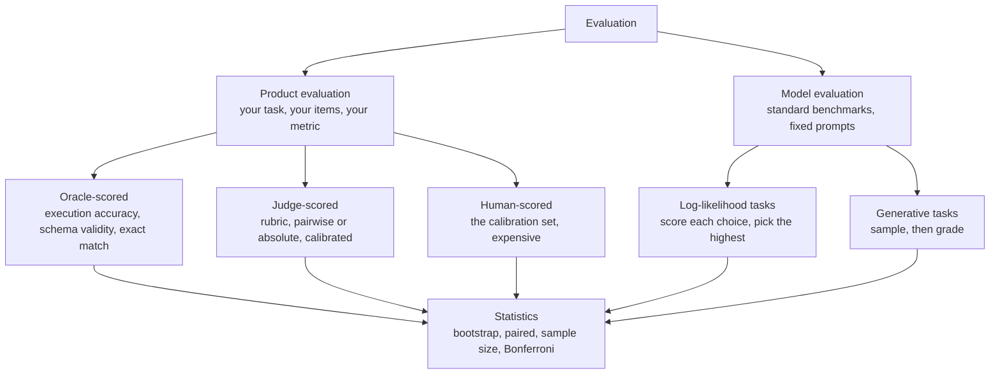
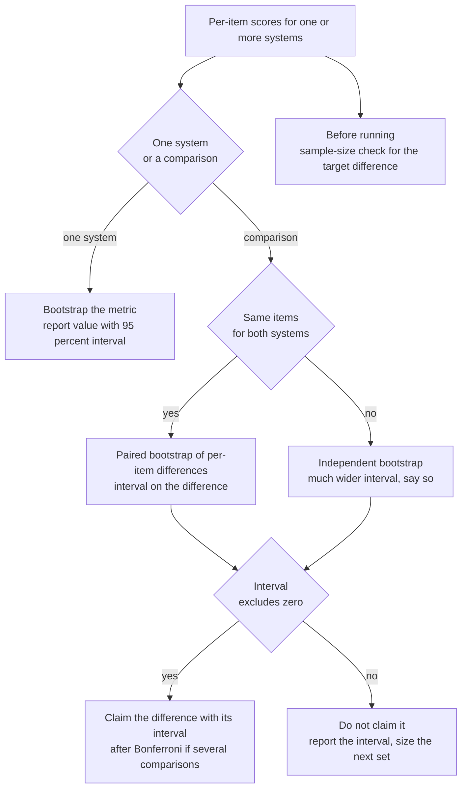
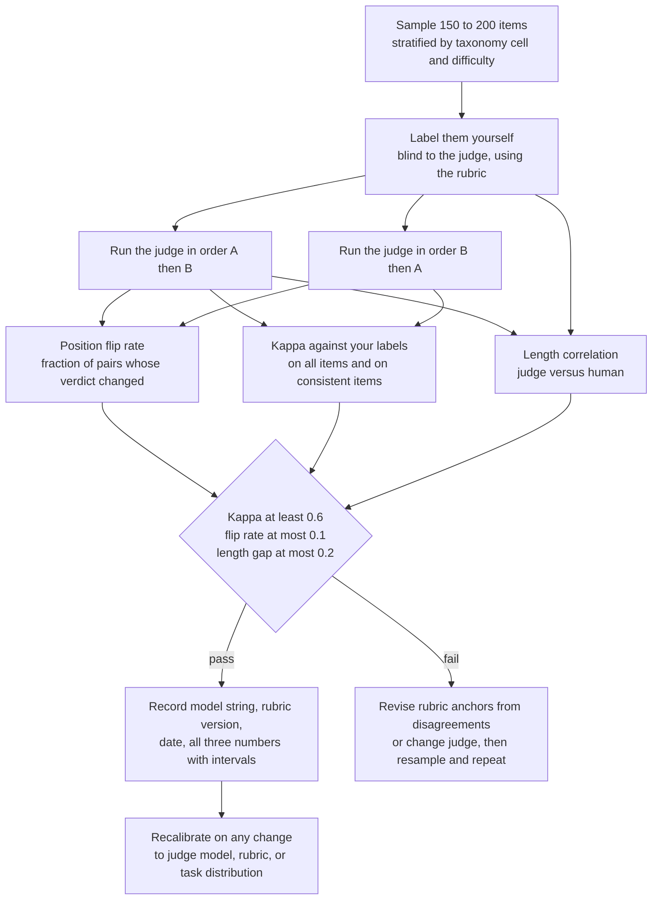
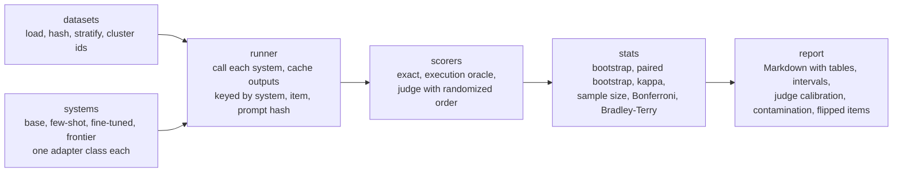

# Chapter 11: Evaluation and Statistics

> **What you will be able to do.** Put a bootstrap confidence interval on every accuracy you report and a paired interval on every comparison; compute before an experiment how many items it needs to detect the difference you care about; correct for multiple comparisons; calibrate an LLM judge against your own labels with Cohen's kappa, a position flip rate, and a length correlation; aggregate pairwise judgments with Bradley-Terry; and package all of it as a small library that writes a Markdown report.
> **Where it is used.** P1.6 (rigorous evaluation and evalkit), and every number in every later project: P1.2's comparison table, P1.3's method comparison, P1.5's cost-quality chart, P3.1's promotion gate, P3.2's evaluation platform, P4.1's agent scenarios.
> **Prerequisites.** None beyond the reader profile. Chapter 7 for the text-to-SQL task the examples use. Chapter 10, section 10.4.5, for the n-gram decontamination procedure this chapter references.

## 11.0 The problem this chapter solves

You fine-tuned a 1.5B model and it scores 71.4 percent execution accuracy on 200 held-out questions. The base model scored 68.1. Your write-up says "a 3.3-point improvement". A customer's data scientist asks what the interval is. You do not have one, and when you compute it the honest answer is that the difference is indistinguishable from zero: with 200 items and independent intervals, a gap under about 12 points cannot be detected at conventional power. The improvement may be real. You cannot show it with that evaluation set, and you should have known that before you ran it.

This chapter is the statistics an evaluation needs to survive that conversation, and nothing more. Three tools do most of the work: the bootstrap, which gives an interval for any metric without a distributional assumption; the paired comparison, which uses the fact that two systems saw the same items to shrink the interval on their difference by about half; and the sample-size calculation, which tells you before spending API money whether the set can answer the question. A fourth, the Bonferroni correction, keeps you honest when you run six ablations and report the one that looked significant.

The second half treats the LLM judge as a measurement instrument. A judge is a model with biases you can name: it prefers the first candidate, the longer candidate, and candidates written in its own style. Calibration means measuring those biases against human labels with Cohen's kappa, a position flip rate, and a length correlation, then writing the numbers down with a date and a model string so that every later use of the judge cites them. When the judge produces pairwise verdicts across many systems, Bradley-Terry turns them into a ranking with a principled scale.

Everything here ends in `evalkit`, a small library with a command-line interface that takes systems and an evaluation set and writes a report with intervals, paired differences, judge agreement, and a contamination check. Every phase after this one calls it, and the shape of its report is the shape of every results table you will show a customer.

## 11.1 Product evaluation, model evaluation, and oracles

**Product evaluation** measures your system on your task with your data: execution accuracy on your query set, judged helpfulness on your customers' questions, field-level F1 on your documents. The items are yours, the metric is the one the customer cares about, and the number is only meaningful for this system on this distribution. **Model evaluation** measures a model's general capability on standardized benchmarks (HellaSwag, ARC, MMLU, GSM8K) with fixed prompts, so that checkpoints can be compared and regressions detected. You need the second kind to catch a fine-tune that got better at SQL by getting worse at everything else. You need statistical rigor on both.



*Figure 11.1: The evaluation taxonomy; every branch ends in the same statistics.*

**Execution accuracy as an oracle.** An oracle is a scorer whose verdict you trust without a human: run the predicted SQL and the gold SQL against the database and compare result sets. The comparison semantics are a design decision you write down once: result sets are compared as multisets of rows, order-insensitive unless the question asks for an order, with floats compared at a tolerance and `NULL` treated as a value. The oracle has failure modes of its own: non-deterministic queries (`LIMIT` without `ORDER BY`), queries that time out, and gold SQL that is wrong (Spider's dev set has a small number of known errors; treat a disagreement with gold on inspection as an item to flag, not to fix silently). An oracle turns an evaluation into per-item binary scores, which is the input every statistic below consumes.

## 11.2 The lm-eval harness

The EleutherAI `lm-evaluation-harness` runs a model against hundreds of tasks with standardized prompts, few-shot formatting, and scoring. Three ideas cover its structure.

**Tasks** are YAML files that name a dataset, define how a document becomes a prompt (`doc_to_text`) and a target (`doc_to_target`), state the number of few-shot examples and where they come from, and list metrics. A task group (MMLU) is a set of tasks with a shared configuration.

**Two scoring modes.** In a **log-likelihood** task the model is never asked to generate. For each answer choice, the harness computes the log-probability of the choice's tokens given the prompt, and the prediction is the highest-scoring choice. `acc` uses the raw sum; `acc_norm` divides the sum by the byte length of the choice so that longer choices are not penalized for having more tokens. This works for base models with no chat training, and it is why small pretrained models can be evaluated at all. In a **generative** task the model samples until a stop sequence, and a filter (regex for the final number, strip whitespace) extracts the answer before an exact-match or a custom metric grades it. Generative scoring depends on the chat template and stop sequences; a mismatch shows up as zero accuracy with fluent outputs.

**A custom task.** Execution accuracy for your text-to-SQL set runs in the same harness as the standard tasks when you add a task file. The ten lines that matter (the harness is at version 0.4.x as of mid-2026; key names have changed between versions, so check yours):

```yaml
task: spider_dev_exec
dataset_path: json
dataset_kwargs: {data_files: {test: "data/spider_dev_v3.jsonl"}}
test_split: test
output_type: generate_until
doc_to_text: "{{prompt}}"
doc_to_target: "{{gold_sql}}"
generation_kwargs: {until: ["```\n", "</s>"], max_gen_toks: 256}
process_results: !function utils.execution_accuracy
metric_list: [{metric: exec_acc, aggregation: mean, higher_is_better: true}]
```

The `process_results` function receives the document and the model's generation and returns a dictionary with the metric name and a 0 or 1; that is where your oracle lives. Set `num_fewshot` in the same file when you want the few-shot condition. The harness reports a standard error per metric computed from the per-item scores; treat it as a first look and compute the bootstrap interval from the saved per-item results, which the harness writes when asked to log samples.

## 11.3 Bootstrap confidence intervals

**Intuition.** You have one evaluation set of $n$ items and one accuracy. You want to know how much that accuracy would move if you had drawn a different set of $n$ items from the same population. You do not have the population, but the evaluation set is your best estimate of it, so draw new sets of $n$ items from the evaluation set itself, with replacement, and watch the accuracy move. Efron (1979, "Bootstrap Methods: Another Look at the Jackknife") introduced the idea; it needs no assumption about the shape of the sampling distribution and works for any metric you can compute from per-item scores.

**Precise statement.** Let $s_1, \dots, s_n$ be per-item scores (0 or 1 for accuracy, real-valued for a rubric score) and $\hat{\theta} = g(s_1, \dots, s_n)$ the metric (the mean, for accuracy). For $b = 1, \dots, B$: draw indices $i_1, \dots, i_n$ uniformly with replacement from $\{1, \dots, n\}$, form the resample $s^{*}_{b} = (s_{i_1}, \dots, s_{i_n})$, and compute $\hat{\theta}^{*}_{b} = g(s^{*}_{b})$. The **percentile interval** at level $1 - \alpha$ is

$$
\left[\, \hat{\theta}^{*}_{(\alpha/2)}, \;\; \hat{\theta}^{*}_{(1 - \alpha/2)} \,\right]
$$

where $\hat{\theta}^{*}_{(q)}$ is the $q$-quantile of the $B$ resampled values. With $\alpha = 0.05$ and $B = 10{,}000$, sort the 10,000 values and read off the 250th and 9,750th. The justification is the plug-in principle: the empirical distribution of the items stands in for the population, and the distribution of $\hat{\theta}^{*}$ around $\hat{\theta}$ approximates the distribution of $\hat{\theta}$ around the true $\theta$. Nothing about normality is assumed, which is why the same code serves accuracy, F1, nDCG, a judge win rate, and a median latency.

**Worked toy example.** Ten items with scores $(1, 1, 0, 1, 1, 1, 0, 1, 0, 1)$, so $\hat{\theta} = 0.70$. Five resamples with a fixed seed:

| Resample | Indices drawn | Scores | Mean |
|---|---|---|---|
| 1 | 8, 6, 5, 2, 3, 0, 0, 0, 1, 8 | 0, 0, 1, 0, 1, 1, 1, 1, 1, 0 | 0.60 |
| 2 | 6, 9, 5, 6, 9, 7, 6, 5, 5, 9 | 0, 1, 1, 0, 1, 1, 0, 1, 1, 1 | 0.70 |
| 3 | 2, 8, 6, 0, 3, 8, 5, 0, 7, 7 | 0, 0, 0, 1, 1, 0, 1, 1, 1, 1 | 0.60 |
| 4 | 8, 1, 0, 8, 0, 5, 0, 2, 4, 4 | 0, 1, 1, 0, 1, 1, 1, 0, 1, 1 | 0.70 |
| 5 | 4, 0, 0, 1, 0, 6, 5, 6, 2, 6 | 1, 1, 1, 1, 1, 0, 1, 0, 0, 0 | 0.60 |

Item 0 appears three times in resample 1 and item 4 never; that is what sampling with replacement does, and it is the mechanism. With $B = 2{,}000$ the resampled means have standard deviation 0.144, against the normal-approximation standard error $\sqrt{0.7 \times 0.3 / 10} = 0.145$, and the 2.5th and 97.5th percentiles are 0.40 and 1.00. The upper end sits on the boundary because the probability that all ten resampled items are correct is $0.7^{10} = 0.028$, above 0.025. That is not a bug in the bootstrap; it is a warning that ten items cannot support an interval. The Wilson score interval, which is the right check for a binary metric, gives $[0.40, 0.89]$ for the same data.

**How wide intervals are.** For accuracy near $p$ on $n$ items, the 95 percent half-width is about $1.96 \sqrt{p(1-p)/n}$:

| $n$ | Half-width at $p = 0.7$ | Half-width at $p = 0.5$ |
|---|---|---|
| 100 | 9.0 points | 9.8 points |
| 200 | 6.4 | 6.9 |
| 500 | 4.0 | 4.4 |
| 1,000 | 2.8 | 3.1 |
| 2,000 | 2.0 | 2.2 |
| 5,000 | 1.3 | 1.6 |

A 200-item set reports 70 plus or minus 6 points. A claim of a 3-point improvement from two such numbers is not a claim.

**Consequence for practice.** Use $B$ of at least 2,000 for a 95 percent interval and 10,000 when the report is final; the cost is negligible (section 11.13). Bootstrap the actual metric you report, not a proxy: for a judge win rate, resample items and recompute the win rate; for nDCG@10, resample queries. When items come in clusters (Spider's 1,034 dev questions are drawn from 20 databases, about 52 per database), items in the same cluster are correlated, and resampling items understates the width; resample whole clusters instead (the cluster bootstrap), and expect the interval to widen. Report the interval next to the number, in the same table cell, every time: "0.714 [0.651, 0.774]". Miller (2024, "Adding Error Bars to Evals: A Statistical Approach to Language Model Evaluations") makes the same case with the same tools for benchmark reporting.



*Figure 11.2: The decision flow from per-item scores to a defensible claim.*

## 11.4 The paired bootstrap for a difference

**Intuition.** Two systems evaluated on the same 200 items agree on most of them: both get the easy ones right and the hard ones wrong. The difference between them lives entirely in the items where they disagree. Comparing two independent intervals throws that information away and treats every item as if it could swing either way. Pairing keeps it.

**Precise statement.** Let $a_i$ and $b_i$ be the scores of systems A and B on item $i$, and $d_i = a_i - b_i$, which for binary scores is in $\{-1, 0, +1\}$. The estimated difference is $\hat{\Delta} = \bar{d} = \bar{a} - \bar{b}$. The paired bootstrap resamples items (keeping each item's pair together), computes $\bar{d}^{*}_{b}$ for each resample, and takes the percentile interval. The variance that drives the width is

$$
\mathrm{Var}(\bar{a} - \bar{b}) = \frac{1}{n}\left[\mathrm{Var}(a) + \mathrm{Var}(b) - 2\,\mathrm{Cov}(a, b)\right]
$$

The independent comparison drops the covariance term. When both systems get the same easy items right, $\mathrm{Cov}(a, b)$ is large and positive, and the paired variance is much smaller. For binary scores, with $\pi_{10}$ the fraction of items only A gets right and $\pi_{01}$ the fraction only B gets right (the **discordant** fractions), $\mathrm{Var}(d) = \pi_{10} + \pi_{01} - (\pi_{10} - \pi_{01})^2$: the width depends on how often the systems disagree, not on their accuracies.

**Worked example.** $n = 200$. System A scores 0.70 (140 correct), system B 0.65 (130 correct). The 2 by 2 table: both correct 120, A only 20, B only 10, neither 50. Then $\hat{\Delta} = 0.05$, $\pi_{10} = 0.10$, $\pi_{01} = 0.05$, $\mathrm{Var}(d) = 0.15 - 0.0025 = 0.1475$, and the paired standard error is $\sqrt{0.1475/200} = 0.027$. The normal interval is $0.05 \pm 0.053 = [-0.003, 0.103]$; the paired bootstrap with $B = 10{,}000$ gives $[-0.005, 0.105]$. The independent standard error is $\sqrt{(0.21 + 0.2275)/200} = 0.047$, interval $[-0.042, 0.142]$; the independent bootstrap gives $[-0.040, 0.145]$. Pairing cut the width by 42 percent. Check the covariance: $E[ab] = 120/200 = 0.60$, $E[a]E[b] = 0.455$, so $\mathrm{Cov}(a,b) = 0.145$, and $0.21 + 0.2275 - 2 \times 0.145 = 0.1475$, matching $\mathrm{Var}(d)$.

Both intervals include zero, so even paired, this 5-point difference on 200 items is not a claim. It is close: the exact McNemar test on the 30 discordant items (20 versus 10) gives a two-sided p-value of 0.099. Thirty more discordant items in the same ratio would settle it, which is the sample-size question of the next section.

**Consequence for practice.** Always evaluate every system on the same items and always pair. Report the discordant counts alongside the difference, because "A wins 20, B wins 10, 170 ties" tells the reader more than the interval alone: it says the systems are nearly the same system. In P1.2 the four-system table compares each fine-tune to the base; in P1.3 it compares SFT, DPO, and GRPO to each other; in P3.1 the promotion gate compares challenger to champion. All of them are paired differences with intervals, and the gate rule is "the interval excludes zero on the golden set and the regression set shows no interval below minus the tolerance".

## 11.5 Sample size: how many items you need

**Intuition.** The interval width shrinks with $\sqrt{n}$, so detecting a difference half as large needs four times the items. Before you build or buy an evaluation set, compute the size that gives you a reasonable chance of seeing the difference you care about, and stop pretending that 200 items can show 3 points.

**Precise statement, two independent systems.** To detect a difference between accuracies $p_1$ and $p_2$ with two-sided significance $\alpha$ and power $1 - \beta$, the normal approximation gives the items per system as

$$
n = \frac{\left(z_{1-\alpha/2} + z_{1-\beta}\right)^2 \left[p_1(1-p_1) + p_2(1-p_2)\right]}{(p_1 - p_2)^2}
$$

where $z_q$ is the $q$-quantile of the standard normal: $z_{0.975} = 1.960$ and $z_{0.80} = 0.842$, so $(z_{0.975} + z_{0.80})^2 = 7.85$. Power is the probability of detecting the difference when it is real; 0.80 is the conventional floor.

**Precise statement, paired.** With discordant fractions $\pi_{10}$ and $\pi_{01}$ and $\Delta = \pi_{10} - \pi_{01}$,

$$
n = \frac{\left(z_{1-\alpha/2} + z_{1-\beta}\right)^2 \left[\pi_{10} + \pi_{01} - \Delta^2\right]}{\Delta^2}
$$

Turning the formula around gives the **minimum detectable difference** for a set you already have: $\text{MDD} = (z_{1-\alpha/2} + z_{1-\beta}) \cdot \text{SE}$, where SE is the standard error of the difference at that $n$.

**Worked example: why 200 items cannot detect 3 points.** Base at $p_1 = 0.70$, fine-tune at $p_2 = 0.73$, independent evaluation. $p_1(1-p_1) + p_2(1-p_2) = 0.21 + 0.1971 = 0.4071$. $n = 7.85 \times 0.4071 / 0.0009 = 3{,}550$ items per system. With 200 items instead, the standard error of the difference is $\sqrt{0.4071/200} = 0.0451$, the test statistic for a true 3-point gap is $0.03/0.0451 = 0.665$, and the power is $\Phi(0.665 - 1.960) = \Phi(-1.295) = 0.098$: about a one in ten chance of detecting a real 3-point improvement. The minimum detectable difference at 200 items is $2.80 \times 0.0451 = 0.126$, twelve and a half points.

Pairing helps but does not rescue it. If 15 percent of items are discordant ($\pi_{10} = 0.09$, $\pi_{01} = 0.06$, $\Delta = 0.03$), $\mathrm{Var}(d) = 0.15 - 0.0009 = 0.1491$ and $n = 7.85 \times 0.1491/0.0009 = 1{,}300$ items. At 200 paired items the minimum detectable difference is $2.80 \times \sqrt{0.1491/200} = 0.077$, about 8 points, and the power for 3 points is 19 percent.

**What the standard sets can do.** Spider dev has 1,034 items. Unpaired at $p \approx 0.7$ the minimum detectable difference is about 5.6 points; paired at 15 percent discordance, about 3.4 points. Spider dev can support a 3-point paired claim only if the systems disagree rarely and the difference is at the edge. For the P1.2 definition of done, a 15-point lift over the base, 200 items would suffice ($n = 7.85 \times [0.21 + 0.1275] / 0.0225 = 118$ per system, unpaired); the set is large enough because the effect is large.

**Consequence for practice.** Run the calculation before generating an evaluation set (Chapter 10's taxonomy sampler produces evaluation items as easily as training items) and before renting a GPU for an ablation. When the required $n$ is out of reach, change the question: compare on the hard slice where discordance is high, or accept that the two systems are equivalent for your purpose and choose the cheaper one. Listing 11.3 implements both formulas and the minimum detectable difference.

## 11.6 Multiple comparisons and Bonferroni

**Intuition.** If you run six ablations and test each against the baseline at $\alpha = 0.05$, the chance that at least one shows a significant difference by luck alone is not 5 percent. With $m$ independent tests the family-wise error rate is $1 - (1 - \alpha)^m$: 0.23 for $m = 5$, 0.26 for $m = 6$, 0.40 for $m = 10$, 0.64 for $m = 20$. Reporting the one winner from ten is how a noise result becomes a blog post.

**Precise statement.** The **Bonferroni correction** tests each of $m$ comparisons at level $\alpha' = \alpha / m$, equivalently reports each interval at confidence $1 - \alpha/m$. It guarantees a family-wise error rate of at most $\alpha$ for any dependence among the tests, at the price of power. **Holm's step-down** procedure orders the $m$ p-values, tests the smallest at $\alpha/m$, the next at $\alpha/(m-1)$, and so on, stopping at the first failure; it controls the same rate with more power and is the practical default when you have p-values.

**Worked example.** Six ablations (three ranks, three data sizes) against the base: $\alpha' = 0.05/6 = 0.0083$, $z_{1 - \alpha'/2} = 2.64$ instead of 1.96, so every interval is 35 percent wider. A difference that was significant at 95 percent with an interval $[0.01, 0.09]$ becomes $[-0.004, 0.104]$ and is no longer a claim. With $m = 10$, $z = 2.81$ (43 percent wider); with $m = 20$, $z = 3.02$.

**Consequence for practice.** Name the primary comparison before running anything (fine-tune versus base on execution accuracy) and test it at $\alpha$. Label everything else exploratory and report it with Bonferroni-adjusted intervals or with the note "not corrected for $m$ comparisons". Write $m$ in the report header; the `evalkit` report does this automatically.

## 11.7 LLM-as-judge, calibrated

**Intuition.** A judge model scores outputs quickly and cheaply and agrees with humans often enough to be useful. It also has systematic biases that a human rater does not, and it is a different instrument every time the model version or the rubric changes. Treat it as you would a new sensor: calibrate against a reference, record the calibration, recalibrate on change.

### 11.7.1 Rubric design

A rubric turns "is this good" into criteria a model can apply consistently. Three to five criteria, each with anchored levels (what a 2 looks like, what a 4 looks like, with a short example of each), an instruction to reason before deciding, and a strict output format (one JSON line after the reasoning). When a reference answer exists, include it and ask the judge to compare against it (reference-guided grading), which improves agreement on factual tasks. Avoid criteria the judge cannot check from the text ("is efficient") and vague scales ("rate 1 to 10").

### 11.7.2 Pairwise versus absolute

**Pairwise** judging shows two candidates and asks which is better (or tie). It is more consistent than absolute scoring because the judge only needs to rank, not to hold a scale in mind, and it is the right mode for comparing systems. **Absolute** scoring gives one candidate a score on a rubric scale. It is needed when there is one system (monitoring in production, filtering in Chapter 10) and it is the only mode that yields a per-item score you can track over time. Anchored absolute scoring, with the anchor examples in the prompt, closes part of the gap. Use pairwise for comparisons, anchored absolute for monitoring, and calibrate each separately.

### 11.7.3 The biases and how to measure them

Zheng and colleagues (2023, "Judging LLM-as-a-Judge with MT-Bench and Chatbot Arena") named the first three; the fourth is documented by Panickssery and colleagues (2024, "LLM Evaluators Recognize and Favor Their Own Generations").

**Position bias.** The judge prefers the candidate shown first (or, for some models, second). Wang and colleagues (2023, "Large Language Models are not Fair Evaluators") showed verdicts flipping with order on a large fraction of pairs. Measure it as the **position flip rate**: judge every pair in both orders, and compute the fraction of pairs whose verdict changes. A flip rate of 0.10 means a tenth of your verdicts are decided by order. Mitigate by randomizing the order per item (Listing 11.4) and, for the final report, judging both orders and counting a flipped pair as a tie.

**Verbosity bias.** The judge prefers longer candidates. Measure the **length correlation**: for pairwise verdicts, the Spearman correlation between the length difference (A minus B, in tokens) and the verdict coded as +1 for A, 0 for tie, and -1 for B; for absolute scores, the Spearman correlation between score and length. Compare it with the same correlation computed on your human labels: if humans also prefer longer answers on this task, the correlation is not bias. A judge correlation above about 0.3 where the human correlation is near zero is a warning; the fix is a rubric criterion for concision or a length-controlled comparison (candidates matched within a length band).

**Self-preference.** A judge from the same family as one of the systems favors that system's outputs, including a student distilled from it. Measure by comparing the judge's win rate for its own family against the human-labeled win rate on the same items. Mitigate by using a judge from a different family for any comparison involving the judge's family, or by reporting the human-labeled subset separately.

**Reasoning limits.** Judges grade multi-step answers worse than single-step ones; they can be fooled by a confident wrong derivation. Reference-guided grading and an oracle where one exists (execute the SQL) are the fixes.

### 11.7.4 Cohen's kappa

**Precise statement.** For two raters assigning each of $n$ items to one of $K$ categories, let $p_o$ be the observed fraction of items on which they agree and $p_e$ the agreement expected by chance from their marginal distributions:

$$
\kappa = \frac{p_o - p_e}{1 - p_e}, \qquad p_e = \sum_{k=1}^{K} p_{k \cdot} \, p_{\cdot k}
$$

where $p_{k \cdot}$ is the fraction of items rater 1 put in category $k$ and $p_{\cdot k}$ the fraction rater 2 put there. Kappa is 1 for perfect agreement, 0 for chance agreement, and negative when the raters agree less than chance. Cohen (1960, "A Coefficient of Agreement for Nominal Scales") introduced it; the interpretation bands in common use are from Landis and Koch (1977, "The Measurement of Observer Agreement for Categorical Data"):

| $\kappa$ | Interpretation |
|---|---|
| below 0 | Poor |
| 0.00 to 0.20 | Slight |
| 0.21 to 0.40 | Fair |
| 0.41 to 0.60 | Moderate |
| 0.61 to 0.80 | Substantial |
| 0.81 to 1.00 | Almost perfect |

For a judge used to compare systems, the Phase 1 guide's rule is: above 0.6 acceptable, above 0.8 strong. For ordinal scales (1 to 5 rubric scores), **weighted kappa** counts a disagreement of one level as less severe than a disagreement of four, with quadratic weights $w_{ij} = ((i-j)/(K-1))^2$; Listing 11.2 implements both.

**Worked example.** You labeled 150 items pass or fail; the judge labeled the same items. Both pass 90, you pass and the judge fails 15, you fail and the judge passes 10, both fail 35. Observed agreement $p_o = (90 + 35)/150 = 0.833$. Your pass rate is $105/150 = 0.700$, the judge's is $100/150 = 0.667$. Chance agreement $p_e = 0.700 \times 0.667 + 0.300 \times 0.333 = 0.467 + 0.100 = 0.567$. Kappa is $(0.833 - 0.567)/(1 - 0.567) = 0.615$, substantial, and just over the 0.6 line. The bootstrap interval (resample the 150 items, recompute kappa) runs roughly from 0.49 to 0.73, so the honest statement is "substantial, with an interval that reaches into moderate". Fifteen items you passed and the judge failed are the ones to read: they tell you which rubric criterion the judge applies more strictly than you.

**The kappa paradox.** When both raters put most items in one category, $p_e$ is high and kappa is low even at high observed agreement. Two raters who agree on 95 percent of items with a 90 percent pass rate on both sides have $p_e = 0.82$ and $\kappa = 0.72$; at a 97 percent pass rate, $p_e = 0.94$ and the same 95 percent agreement gives $\kappa$ near 0.2. Report $p_o$, the marginals, and kappa together, and when the classes are very unbalanced also report agreement on the minority class.

### 11.7.5 The calibration protocol



*Figure 11.3: The judge calibration protocol; the thresholds are the ones set in advance, and the record is what every later use cites.*

The protocol in words: sample 150 to 200 items stratified across the taxonomy and across difficulty, so that hard items are represented; label them yourself with the rubric before seeing any judge output; run the judge in both orders; compute kappa against your labels (on all items, and separately on the items where the judge was consistent across orders), the flip rate, and the length correlation for both judge and human; compare against thresholds you wrote down before starting; record the result with the judge model string, rubric version, date, and intervals; and recalibrate whenever the judge model, the rubric, or the task distribution changes. The 150 labels are the most valuable artifact in P1.6, because they are the only ground truth the judge is ever compared against. The same labels serve Chapter 10's spot-check when the judge is a filter.

## 11.8 Aggregating pairwise judgments: Bradley-Terry and Elo

**Intuition.** Pairwise verdicts across several systems form a tournament. A win rate per system ignores who each system was compared against; a system that only faced weak opponents looks strong. A latent-strength model fits one number per system such that the observed win probabilities are explained by strength differences.

### 11.8.1 Bradley-Terry

**Precise statement.** Each system $i$ has a strength $\beta_i \in \mathbb{R}$, and the probability that $i$ beats $j$ is

$$
P(i \succ j) = \frac{e^{\beta_i}}{e^{\beta_i} + e^{\beta_j}} = \sigma(\beta_i - \beta_j)
$$

where $\sigma$ is the logistic function. This is the same model Chapter 8 used for a reward model over responses, with systems in place of responses. Strengths are identified only up to a constant, so fix $\beta_1 = 0$ or constrain the sum. Given $w_{ij}$ wins of $i$ over $j$ and $n_{ij} = w_{ij} + w_{ji}$ comparisons, the maximum-likelihood strengths satisfy the fixed-point iteration (Zermelo's algorithm, analyzed as a minorization-maximization method by Hunter, 2004, "MM algorithms for generalized Bradley-Terry models") on $\pi_i = e^{\beta_i}$:

$$
\pi_i \leftarrow \frac{\sum_{j \ne i} w_{ij}}{\sum_{j \ne i} \dfrac{n_{ij}}{\pi_i + \pi_j}}
$$

followed by normalization. It converges when every system has at least one win and one loss and the comparison graph is connected. Ties are handled by adding half a win to each side. Fitting by logistic regression on indicator features (+1 for the first system, -1 for the second) gives the same estimates and, with standard software, standard errors; the bootstrap over comparisons gives intervals without that machinery. Chatbot Arena (Chiang and colleagues, 2024, "Chatbot Arena: An Open Platform for Evaluating LLMs by Human Preference") ranks models this way from crowd votes.

**Worked example.** Three systems. A beat B in 7 of 10 comparisons, A beat C in 8 of 10, B beat C in 6 of 10. Start at $\pi = (1, 1, 1)$. A has 15 wins and its denominator is $10/2 + 10/2 = 10$, so $\pi_A = 1.5$; B has 9 wins, $\pi_B = 0.9$; C has 6, $\pi_C = 0.6$; normalized, $(0.50, 0.30, 0.20)$. The next iterations give $(0.553, 0.274, 0.173)$, $(0.576, 0.259, 0.165)$, and by the tenth $(0.597, 0.245, 0.158)$, where it stays. Strengths relative to A: $\beta = (0, -0.89, -1.33)$. The fitted win probabilities are $P(A \succ B) = 0.709$, $P(A \succ C) = 0.791$, $P(B \succ C) = 0.609$, against the observed 0.70, 0.80, 0.60: close but not equal, because one parameter per system forces transitivity onto the data. With only ten comparisons per pair the intervals on $\beta$ are wide (bootstrap them by resampling comparisons); the ranking A, B, C is clear, the gap sizes are not.

### 11.8.2 Elo

**Precise statement.** Elo is an online approximation to the same model. Ratings $R_i$ update after each comparison:

$$
E_i = \frac{1}{1 + 10^{(R_j - R_i)/400}}, \qquad R_i \leftarrow R_i + K \,(S_i - E_i)
$$

where $E_i$ is the expected score of $i$, $S_i$ is the actual score (1 for a win, 0.5 for a draw, 0 for a loss), and $K$ sets the step size. The 400 makes a 400-point gap a 10 to 1 odds ratio (expected score 0.909); Elo ratings are Bradley-Terry strengths in different units, $R = 400 \, \beta / \ln 10$ plus a constant, so the fitted gaps above are 155 and 231 Elo points.

**Worked example.** $R_A = R_B = 1000$, $K = 32$. A wins: $E_A = 0.5$, so $R_A = 1016$, $R_B = 984$. B then wins: $E_A = 1/(1 + 10^{-32/400}) = 0.546$, so $R_A = 1016 + 32(0 - 0.546) = 998.5$ and $R_B = 1001.5$. If the same two results arrive in the other order, A ends at 1001.5 and B at 998.5. Same data, different ratings: Elo depends on the order of the comparisons, which is acceptable for a live leaderboard and wrong for an offline evaluation.

**Consequence for practice.** Fit Bradley-Terry on the full set of verdicts for any report; use Elo only for a streaming display, and even then, refit Bradley-Terry periodically. Both need the comparison graph to be connected: if the new challenger was only compared with the champion, its strength is estimated only relative to the champion, and that is fine as long as the report says so.

## 11.9 Contamination and evaluation set governance

**Contamination detection.** Chapter 10, section 10.4.5, gives the n-gram procedure for training data you control: 13-gram overlap (8-grams for short items) between every training set and every evaluation set, plus an embedding check for paraphrases, with counts on the model card. Two checks address the base model's pretraining data, which you cannot filter: **guided completion**, where you give the model the first half of an evaluation item and check whether it completes the second half verbatim or near-verbatim (Golchin and Surdeanu, 2023, "Time Travel in LLMs: Tracing Data Contamination in Large Language Models"), and a **recency split**, comparing accuracy on items created after the model's training cutoff with accuracy on older items of matched difficulty. Neither is conclusive; both are worth a paragraph in the report.

**Governance.** An evaluation set that changes is not an evaluation set. Freeze it: store the file with its hash in the report header and publish it as a versioned revision (Hub revision, DVC tag). Stratify it by the taxonomy so that per-slice tables are possible and the per-slice $n$ is known. Size it with section 11.5 and say what difference it can detect. Keep two sets with different roles: a development set for iterating on prompts and hyperparameters, and a held-out set that is scored only when a claim is made, so that selection on the development set does not leak into the claim. Remove personal information before storage and never put customer data in a public set; Chapter 10's taxonomy generator produces synthetic evaluation items with the same shape. Record the cluster structure (databases, documents, sessions) so that the bootstrap can resample clusters. Keep a change log; when an item is found to be wrong, mark it rather than delete it, and report results with and without the marked items until the next version.

## 11.10 evalkit: a small library and its report

`evalkit` is the P1.6 deliverable and the tool every later phase calls. It is small on purpose: five modules and a command-line entry point.



*Figure 11.4: The evalkit modules; the runner's output cache is what makes a rerun free and a report reproducible.*

**Modules.** `datasets` loads a JSONL file, computes its hash, exposes the strata and cluster identifiers, and refuses to run on a file whose hash differs from the one in the suite definition. `systems` wraps each system under test in a class with one method, `generate(prompt) -> str`, so that a local vLLM endpoint, an Ollama model, and a frontier API look the same. `runner` calls each system on each item once and caches the output keyed by system identifier, item identifier, and prompt hash, so that re-scoring never re-generates. `scorers` holds the exact-match scorer, the execution oracle with timeout and result-set semantics, and the judge scorer with randomized order and both-orders mode. `stats` holds Listings 11.1 to 11.3 and 11.5. `report` writes the Markdown.

**Command line.** One invocation runs a suite and writes a report; a second flag adds a system to an existing suite and reuses the cache.

```bash
evalkit run --suite suites/spider_dev_v3.yaml --systems base,fewshot,lora_r16 --report reports/2026-10-23-p12.md
```

**The report format.** The first screen is the results table with intervals; everything else follows. An example, abbreviated:

```markdown
# evalkit report: spider_dev_v3 (n = 1034, 20 clusters, sha256 9f3a...)
Generated 2026-10-23. Seed 0. B = 10000. alpha = 0.05.
Comparisons m = 3, Bonferroni alpha' = 0.0167. Primary: lora_r16 vs base.

## Results
| System   | Execution accuracy | 95 percent CI  | n    |
|----------|--------------------|----------------|------|
| base     | 0.412              | [0.382, 0.442] | 1034 |
| fewshot  | 0.487              | [0.456, 0.517] | 1034 |
| lora_r16 | 0.603              | [0.573, 0.633] | 1034 |

## Paired differences
| A        | B       | Delta  | 95 percent CI  | A only | B only | Bonferroni |
|----------|---------|--------|----------------|--------|--------|------------|
| lora_r16 | base    | +0.191 | [0.160, 0.222] | 238    | 41     | yes        |
| lora_r16 | fewshot | +0.116 | [0.085, 0.148] | 201    | 81     | yes        |
| fewshot  | base    | +0.075 | [0.048, 0.103] | 133    | 55     | yes        |

## Per slice (difficulty)
| Slice  | n   | base  | lora_r16 | Delta  | 95 percent CI   |
|--------|-----|-------|----------|--------|-----------------|
| easy   | 248 | 0.649 | 0.831    | +0.181 | [0.121, 0.242]  |
| hard   | 166 | 0.157 | 0.247    | +0.090 | [0.024, 0.157]  |

## Judge
Not used in this suite. (When used: model string, rubric version, calibration
date, kappa with CI, flip rate, length correlation for judge and human.)

## Contamination
13-gram check, training set v5 vs spider_dev_v3: 0 training examples removed.
Embedding check: 3 pairs above 0.92 inspected, none contaminating.

## Flipped items (sample of 10 where lora_r16 is right and base is wrong)
...
```

The header carries everything a reader needs to reproduce the run: set version and hash, seed, $B$, $\alpha$, $m$, and the primary comparison. The paired table shows discordant counts next to the interval. The per-slice table uses the taxonomy strata. The judge section is present even when empty, so that its absence is visible. The numbers in this example are illustrative.

## 11.11 Implementation notes

**Listing 11.1: Percentile bootstrap for one metric and paired bootstrap for a difference.**

```python
import numpy as np

def bootstrap_ci(scores, stat=np.mean, n_boot: int = 10_000, alpha: float = 0.05,
                 seed: int = 0, clusters=None):
    """Percentile interval for stat(scores). If clusters is given (one id per item),
    whole clusters are resampled instead of items."""
    s = np.asarray(scores, dtype=float)
    rng = np.random.default_rng(seed)
    if clusters is None:
        idx = rng.integers(0, len(s), size=(n_boot, len(s)))
        boot = np.array([stat(s[row]) for row in idx])
    else:
        c = np.asarray(clusters)
        groups = [np.flatnonzero(c == g) for g in np.unique(c)]
        boot = np.empty(n_boot)
        for b in range(n_boot):
            picked = rng.integers(0, len(groups), size=len(groups))
            boot[b] = stat(s[np.concatenate([groups[g] for g in picked])])
    lo, hi = np.percentile(boot, [100 * alpha / 2, 100 * (1 - alpha / 2)])
    return float(stat(s)), float(lo), float(hi)

def paired_bootstrap_ci(scores_a, scores_b, n_boot: int = 10_000, alpha: float = 0.05,
                        seed: int = 0):
    """Interval for mean(a) - mean(b) when both systems were scored on the same items."""
    a = np.asarray(scores_a, dtype=float)
    b = np.asarray(scores_b, dtype=float)
    assert a.shape == b.shape, "paired bootstrap needs one score per item for each system"
    d = a - b
    rng = np.random.default_rng(seed)
    idx = rng.integers(0, len(d), size=(n_boot, len(d)))    # resample items, pairs stay together
    boot = d[idx].mean(axis=1)
    lo, hi = np.percentile(boot, [100 * alpha / 2, 100 * (1 - alpha / 2)])
    a_only = int(((a == 1) & (b == 0)).sum())
    b_only = int(((a == 0) & (b == 1)).sum())
    return {"delta": float(d.mean()), "ci": (float(lo), float(hi)),
            "excludes_zero": bool(lo > 0 or hi < 0), "discordant": (a_only, b_only)}
```

The item bootstrap draws all $B \times n$ indices in one call and evaluates the statistic row by row, which is fast for the mean and general for anything else. The cluster branch resamples cluster identifiers and concatenates their items, so a resample can have more or fewer items than $n$; that is correct for the cluster bootstrap. The paired function resamples the difference vector, which keeps each item's two scores together by construction, and returns the discordant counts because the report needs them. The `excludes_zero` flag is the gate condition used in Chapter 17.

**Listing 11.2: Cohen's kappa, unweighted and weighted, with a bootstrap interval.**

```python
import numpy as np

def cohens_kappa(labels_a, labels_b, categories=None, weights=None) -> float:
    """Kappa between two raters. weights: None (nominal), 'linear', or 'quadratic' (ordinal).
    Pass categories explicitly when a resample might miss a category."""
    a, b = list(labels_a), list(labels_b)
    assert len(a) == len(b) and a, "one label per item from each rater"
    cats = list(categories) if categories is not None else sorted(set(a) | set(b))
    k = len(cats)
    pos = {c: i for i, c in enumerate(cats)}
    table = np.zeros((k, k))
    for x, y in zip(a, b):
        table[pos[x], pos[y]] += 1
    p_obs = table / table.sum()
    p_exp = np.outer(p_obs.sum(axis=1), p_obs.sum(axis=0))
    if weights is None:
        w = 1.0 - np.eye(k)                                  # every disagreement costs 1
    else:
        i, j = np.indices((k, k))
        w = np.abs(i - j) / (k - 1) if weights == "linear" else ((i - j) / (k - 1)) ** 2
    return float(1.0 - (w * p_obs).sum() / (w * p_exp).sum())

def kappa_with_ci(labels_a, labels_b, n_boot: int = 2000, seed: int = 0, weights=None):
    a, b = np.asarray(labels_a), np.asarray(labels_b)
    cats = sorted(set(a.tolist()) | set(b.tolist()))
    rng = np.random.default_rng(seed)
    boots = []
    for _ in range(n_boot):
        idx = rng.integers(0, len(a), len(a))
        boots.append(cohens_kappa(a[idx], b[idx], categories=cats, weights=weights))
    lo, hi = np.percentile(boots, [2.5, 97.5])
    return cohens_kappa(a, b, categories=cats, weights=weights), float(lo), float(hi)
```

Kappa is written in its disagreement form, $\kappa = 1 - \sum_{ij} w_{ij} p^{\text{obs}}_{ij} / \sum_{ij} w_{ij} p^{\text{exp}}_{ij}$, which reduces to $(p_o - p_e)/(1 - p_e)$ when every off-diagonal weight is 1 and gives weighted kappa when the weights grow with distance. The bootstrap resamples items and recomputes; passing `categories` keeps the table square when a resample happens to contain no items of one class. If both raters use a single category the expected disagreement is zero and kappa is undefined; the function will divide by zero, which is the right outcome to notice.

**Listing 11.3: Sample size for a difference in accuracy, and the minimum detectable difference.**

```python
import math
from statistics import NormalDist

def _z(alpha: float, power: float) -> float:
    nd = NormalDist()
    return nd.inv_cdf(1 - alpha / 2) + nd.inv_cdf(power)

def n_items_unpaired(p1: float, p2: float, alpha: float = 0.05, power: float = 0.80) -> int:
    """Items per system to detect accuracy p1 versus p2 with two independent samples."""
    z = _z(alpha, power)
    var = p1 * (1 - p1) + p2 * (1 - p2)
    return math.ceil(z * z * var / (p1 - p2) ** 2)

def n_items_paired(p_a_only: float, p_b_only: float, alpha: float = 0.05,
                   power: float = 0.80) -> int:
    """Items to detect a paired difference when p_a_only of items are solved only by A
    and p_b_only only by B. The difference being detected is p_a_only - p_b_only."""
    z = _z(alpha, power)
    delta = p_a_only - p_b_only
    var_d = p_a_only + p_b_only - delta ** 2
    return math.ceil(z * z * var_d / delta ** 2)

def minimum_detectable_difference(n: int, p: float = 0.7, discordant: float | None = None,
                                  alpha: float = 0.05, power: float = 0.80) -> float:
    """Smallest accuracy difference detectable with n items. Unpaired uses accuracy p for
    both systems; paired uses the total discordant fraction (small delta^2 term ignored)."""
    z = _z(alpha, power)
    if discordant is None:
        return z * math.sqrt(2 * p * (1 - p) / n)
    return z * math.sqrt(discordant / n)

# n_items_unpaired(0.70, 0.73) -> 3551      n_items_paired(0.09, 0.06) -> 1301
# minimum_detectable_difference(200) -> 0.126   minimum_detectable_difference(200, discordant=0.15) -> 0.077
# minimum_detectable_difference(1034) -> 0.056  minimum_detectable_difference(1034, discordant=0.15) -> 0.034
```

The paired function takes the discordant fractions rather than the accuracies because the accuracies do not determine the width; you estimate the discordance from a pilot of 50 to 100 items or from the last comparison of similar systems. The minimum detectable difference drops the $\Delta^2$ term, which changes the answer in the third decimal. All three functions use the normal approximation, which is adequate for $n$ above about 50 and accuracies away from 0 and 1.

**Listing 11.4: A pairwise judge call with randomized order, both-orders consistency, and parsing.**

```python
import json, random
from dataclasses import dataclass
from typing import Callable

JUDGE_PROMPT = """Grade two candidate answers to the same question against the rubric.
Rubric:
{rubric}
Question:
{question}
Reference answer (may be empty):
{reference}
Candidate 1:
{cand1}
Candidate 2:
{cand2}
Write two or three sentences of reasoning. Then output exactly one line of JSON:
{{"winner": "1" or "2" or "tie", "confidence": a number between 0 and 1}}"""

@dataclass
class Verdict:
    winner: str            # "A", "B", or "tie", in terms of the original systems
    swapped: bool
    raw: str

def parse_verdict(text: str) -> dict:
    json_lines = [l for l in text.strip().splitlines() if l.strip().startswith("{")]
    obj = json.loads(json_lines[-1])                       # last JSON line wins
    assert obj["winner"] in {"1", "2", "tie"}, f"bad verdict {obj!r}"
    return obj

def judge_pair(call_model: Callable[[str], str], rubric: str, question: str, reference: str,
               answer_a: str, answer_b: str, swapped: bool) -> Verdict:
    cand1, cand2 = (answer_b, answer_a) if swapped else (answer_a, answer_b)
    raw = call_model(JUDGE_PROMPT.format(rubric=rubric, question=question, reference=reference,
                                         cand1=cand1, cand2=cand2))
    obj = parse_verdict(raw)
    if obj["winner"] == "tie":
        return Verdict("tie", swapped, raw)
    first_won = obj["winner"] == "1"
    winner = ("B" if first_won else "A") if swapped else ("A" if first_won else "B")
    return Verdict(winner, swapped, raw)

def judge_randomized(call_model, rubric, question, reference, answer_a, answer_b,
                     rng: random.Random) -> Verdict:
    return judge_pair(call_model, rubric, question, reference, answer_a, answer_b,
                      swapped=rng.random() < 0.5)

def judge_both_orders(call_model, rubric, question, reference, answer_a, answer_b) -> dict:
    v1 = judge_pair(call_model, rubric, question, reference, answer_a, answer_b, swapped=False)
    v2 = judge_pair(call_model, rubric, question, reference, answer_a, answer_b, swapped=True)
    flipped = v1.winner != v2.winner
    return {"winner": "tie" if flipped else v1.winner, "flipped": flipped, "raw": [v1.raw, v2.raw]}
```

The function is model-agnostic: `call_model` is any callable from prompt string to response string (a frontier API client, an Ollama call, a vLLM endpoint). The order is decided outside the prompt and mapped back after parsing, so the judge never sees system names. `judge_both_orders` is the calibration and final-report mode: it costs two calls per item, and the flip rate is the mean of `flipped` over items. The parser takes the last JSON line so that reasoning text containing braces does not break it; a parse failure raises, and the runner records it as a scoring error rather than a tie, because silent ties hide a broken prompt.

**Listing 11.5: Bradley-Terry strengths by minorization-maximization, and one Elo update.**

```python
import numpy as np

def bradley_terry(wins: np.ndarray, iters: int = 500, tol: float = 1e-10) -> np.ndarray:
    """wins[i, j] = number of times system i beat system j (add 0.5 to both sides for a tie).
    Returns log-strengths beta with beta[0] = 0. Needs a connected comparison graph and at
    least one win and one loss per system."""
    W = np.asarray(wins, dtype=float)
    n_games = W + W.T
    total_wins = W.sum(axis=1)
    m = len(W)
    pi = np.ones(m)
    for _ in range(iters):
        denom = np.array([sum(n_games[i, j] / (pi[i] + pi[j]) for j in range(m) if j != i)
                          for i in range(m)])
        new = total_wins / denom
        new /= new.sum()
        done = np.max(np.abs(new - pi)) < tol
        pi = new
        if done:
            break
    return np.log(pi) - np.log(pi[0])

def win_probability(beta: np.ndarray, i: int, j: int) -> float:
    return float(1.0 / (1.0 + np.exp(beta[j] - beta[i])))

def elo_update(r_i: float, r_j: float, score_i: float, k: float = 32.0) -> tuple[float, float]:
    """score_i is 1 for a win by i, 0.5 for a draw, 0 for a loss."""
    expected_i = 1.0 / (1.0 + 10 ** ((r_j - r_i) / 400))
    return r_i + k * (score_i - expected_i), r_j + k * ((1 - score_i) - (1 - expected_i))

# wins = np.array([[0, 7, 8], [3, 0, 6], [2, 4, 0]]); bradley_terry(wins) -> [0, -0.89, -1.33]
```

The iteration is the one from section 11.8.1 with normalization at every step to hold the scale fixed. Convergence is fast for small tournaments (the worked example settles in about ten iterations) and slow when one system almost never loses; if a system has zero losses its strength diverges to infinity, which the tolerance check will never satisfy, so check the win matrix before calling. For intervals, resample the individual comparisons (not the aggregated counts) and refit.

## 11.12 Failure modes

| Symptom | Likely cause | How to confirm | Fix |
|---|---|---|---|
| Interval upper bound exactly 1.0 or lower bound exactly 0.0 | Too few items for the percentile interval, accuracy near a boundary | $n$ under about 30, or $p^n > \alpha/2$ | Report the Wilson interval; get more items |
| Paired and unpaired intervals nearly identical | Systems almost never both right or both wrong, or scores not actually paired | Check discordant counts and that item identifiers match | Verify alignment by item id; if genuinely low covariance, pairing simply does not help |
| Difference significant on the development set, gone on the held-out set | Selection on the development set, or multiple comparisons | Count the comparisons made during development | Pre-register the primary comparison; Bonferroni; score held-out once |
| Generative task scores near zero with fluent outputs | Chat template or stop sequence mismatch in the harness | Inspect five raw generations and the filtered answers | Fix `until`, apply the model's template, re-run |
| Judge kappa below 0.4 on a task where you expected agreement | Rubric anchors ambiguous, or judge failing on multi-step items | Read the disagreements; check kappa on easy versus hard items | Rewrite anchors from the disagreements; add reference-guided grading |
| Flip rate above 0.2 | Strong position bias in this judge or a rubric that does not discriminate | Flip rate on items with a clear human winner | Both-orders mode with flips as ties; a stronger judge; sharper rubric |
| Judge prefers the longer candidate on 80 percent of pairs, humans on 50 | Verbosity bias | Length correlation for judge versus human | Concision criterion; length-banded comparisons |
| Student from teacher X wins under judge X, loses under human labels | Self-preference | Judge win rate versus human win rate on the calibration set | Different-family judge for the final report |
| Bradley-Terry fit does not converge | A system with zero losses or a disconnected comparison graph | Check row sums and graph connectivity of the win matrix | Add comparisons; report the undefeated system's strength as a lower bound |
| Intervals much narrower than the run-to-run variation you observe | Items correlated within clusters, or sampling variance in the systems themselves | Cluster bootstrap; rerun with a second seed at temperature above zero | Resample clusters; evaluate at temperature 0 or average over seeds and say so |

## 11.13 On your machine

**The statistics are free.** A bootstrap with $B = 10{,}000$ over $n = 1{,}034$ items is ten million index draws and ten thousand means; in NumPy on the i9 it runs in well under a second. Kappa with 2,000 resamples over 150 items is a fraction of a second. The Bradley-Terry fit for ten systems converges in milliseconds. Nothing in this chapter needs the GPU except the systems under test and a local judge.

**Execution accuracy on Spider dev** runs 1,034 predicted and 1,034 gold queries against 20 SQLite databases. With a 5-second timeout per query and the databases on the WSL2 ext4 filesystem, the whole pass takes seconds to a couple of minutes depending on how many predictions time out. Cache the gold result sets; they do not change between systems.

**lm-eval on the 4060.** A 1.5B model in bf16 (about 3.1 GB) runs the log-likelihood tasks at batch size 16 or more within 8 GB. HellaSwag's validation split has 10,042 items with four choices each, about 40,000 scored continuations; expect on the order of 10 to 20 minutes for a 1.5B model on this GPU (approximate; record the actual time, which is the point of the P1.1 exercise). ARC-Easy is a few thousand items and takes a few minutes. Full MMLU (14,042 items, 5-shot) is longer; run a subset for regression checks. Generative tasks (GSM8K) are slower because they decode, and they need the chat template and stop sequences set correctly.

**A local judge.** An 8B instruct model at 4-bit in Ollama takes about 5 GB of VRAM and decodes at roughly 30 to 40 tokens per second on this GPU (approximate). Judging 300 pairs in both orders with about 100 output tokens per call is 60,000 output tokens, about 30 minutes plus prefill. Its calibration against your 150 labels is a separate measurement from the API judge's, and it usually comes out lower. **An API judge** over the 1,034 Spider dev items in both orders, with a 600-token cached rubric, 300 uncached tokens, and 100 output tokens per call at the assumed prices of Chapter 10 ($0.20 cached, $2 uncached, $10 output per million; verify) costs about $3.60, which is the roadmap's P1.6 budget.

**Kaggle T4s** run a 7B judge at 8-bit or 4-bit in fp16 compute (no bf16) for a second local opinion. A rented **A100 80 GB** at $1.39 per hour (verify) fits a 70B-class judge at 4-bit (about 40 GB of weights) when you need a strong judge from a different family than the teacher and do not want to pay per token; a two-hour session covers several thousand pairwise calls.

## Exercises

**Exercise 11.1.** Twelve items score $(1, 1, 1, 0, 1, 1, 0, 1, 1, 1, 0, 1)$. Compute the accuracy, the normal-approximation standard error, and run Listing 11.1 with $B = 10{,}000$ and seed 0. Explain the upper end of the percentile interval.

<details><summary>Solution</summary>

Accuracy $9/12 = 0.75$. Standard error $\sqrt{0.75 \times 0.25/12} = 0.125$. The percentile bootstrap returns $[0.50, 1.00]$. The upper end is 1.0 because the probability that a resample of 12 items is all correct is $0.75^{12} = 0.032$, which exceeds $\alpha/2 = 0.025$, so the 97.5th percentile of the resampled means is the boundary. The Wilson interval is $[0.47, 0.91]$. Twelve items cannot support a claim; the exercise is a reminder to size the set first.

</details>

**Exercise 11.2.** Human and judge labels on 100 items in three categories (pass, partial, fail). Rows are human, columns are judge: pass row $(40, 8, 2)$, partial row $(6, 20, 4)$, fail row $(2, 5, 13)$. Compute unweighted kappa and interpret it.

<details><summary>Solution</summary>

Observed agreement $p_o = (40 + 20 + 13)/100 = 0.73$. Human marginals $(0.50, 0.30, 0.20)$; judge marginals $(0.48, 0.33, 0.19)$. $p_e = 0.50 \times 0.48 + 0.30 \times 0.33 + 0.20 \times 0.19 = 0.240 + 0.099 + 0.038 = 0.377$. $\kappa = (0.73 - 0.377)/(1 - 0.377) = 0.567$, moderate. Most disagreement is between adjacent levels (pass versus partial), so quadratic-weighted kappa would be higher; report both and say which you used.

</details>

**Exercise 11.3.** Size an evaluation to detect a 5-point difference between accuracies of 0.70 and 0.75 at $\alpha = 0.05$ and 80 percent power, first with independent samples and then paired, assuming 15 percent of items are discordant.

<details><summary>Solution</summary>

Unpaired: $n = 7.85 \times (0.21 + 0.1875)/0.0025 = 7.85 \times 0.3975/0.0025 = 1{,}248$ items per system. Paired with $\pi_{10} = 0.10$, $\pi_{01} = 0.05$: $\mathrm{Var}(d) = 0.15 - 0.0025 = 0.1475$, $n = 7.85 \times 0.1475/0.0025 = 463$ items. Spider dev's 1,034 items suffice for the paired design and are marginal for the unpaired one; the paired design is also the one you would actually run.

</details>

**Exercise 11.4.** Starting from $\mathrm{Var}(\bar{a} - \bar{b})$, show why the paired standard error in the section 11.4 example is 0.027 while the independent one is 0.047, using only the 2 by 2 table.

<details><summary>Solution</summary>

$\mathrm{Var}(a) = 0.7 \times 0.3 = 0.21$, $\mathrm{Var}(b) = 0.65 \times 0.35 = 0.2275$. $E[ab]$ is the fraction both got right, $120/200 = 0.60$, so $\mathrm{Cov}(a,b) = 0.60 - 0.70 \times 0.65 = 0.145$. Paired: $\mathrm{Var}(d) = 0.21 + 0.2275 - 0.29 = 0.1475$, SE $= \sqrt{0.1475/200} = 0.027$. Independent: the covariance is dropped, $\mathrm{Var} = 0.4375$, SE $= \sqrt{0.4375/200} = 0.047$. The covariance is large because 120 of 200 items were solved by both systems: agreement on easy items is what pairing exploits.

</details>

**Exercise 11.5.** You ran eight ablations against the baseline. What confidence level does each interval need under Bonferroni, what is the corresponding $z$, and how much wider is each interval than at 95 percent?

<details><summary>Solution</summary>

$\alpha' = 0.05/8 = 0.00625$, so each interval is at $99.375$ percent confidence. $z_{1 - \alpha'/2} = 2.73$ against $1.96$, so intervals are $2.73/1.96 - 1 = 39.5$ percent wider. If only one of the eight was the pre-registered primary comparison, test it at 95 percent and report the other seven as exploratory with the adjusted intervals.

</details>

**Exercise 11.6.** A judge's position flip rate on your calibration set is 0.30. What does that imply for a report that used single-order randomized judging on 400 pairs, and what do you do?

<details><summary>Solution</summary>

About 120 of the 400 verdicts were decided by presentation order, so the win rate carries noise of that size on top of sampling noise, and any kappa against human labels is capped by it. Re-judge in both orders and count flipped pairs as ties, which shrinks the effective number of decisive items to about 280 and widens the interval honestly; then diagnose: if flips concentrate on pairs where humans also saw a near-tie, the judge is fine and the rubric needs a tie-breaking criterion; if flips occur on pairs with a clear human winner, change the judge or the prompt (the reasoning-before-verdict instruction and a reference answer both reduce flipping) and recalibrate.

</details>

**Exercise 11.7.** Two systems start at Elo 1000 with $K = 32$. System A wins the first comparison and B the second. Compute both ratings after each comparison, then repeat with B winning first. Explain the difference.

<details><summary>Solution</summary>

A wins first: $E_A = 0.5$, $R_A = 1016$, $R_B = 984$. B wins second: $E_A = 1/(1 + 10^{(984 - 1016)/400}) = 0.546$, $R_A = 1016 - 32 \times 0.546 = 998.5$, $R_B = 984 + 32 \times 0.546 = 1001.5$. B wins first: $R_B = 1016$, $R_A = 984$; A wins second: $E_A = 0.454$, $R_A = 984 + 32 \times 0.546 = 1001.5$, $R_B = 998.5$. Same results, opposite ratings, because the second update is scaled by an expectation that depends on the first. Bradley-Terry on the same two results gives equal strengths regardless of order.

</details>

**Exercise 11.8.** A beat B 6 times, B beat A 3 times, and one comparison was a tie. Fit Bradley-Terry with the half-win convention and report $P(A \succ B)$.

<details><summary>Solution</summary>

Wins become $w_{AB} = 6.5$, $w_{BA} = 3.5$, $n_{AB} = 10$. With two systems the maximum-likelihood solution is $\pi_A/(\pi_A + \pi_B) = w_{AB}/n_{AB} = 0.65$ exactly, so $\beta_B - \beta_A = \ln(0.35/0.65) = -0.62$ and $P(A \succ B) = 0.65$. With ten comparisons the bootstrap interval on that probability spans roughly 0.35 to 0.90; the ranking is suggestive, not established.

</details>

**Exercise 11.9.** A system scores 20 of 20 on a small golden set. What does the percentile bootstrap return, what should you report instead, and what is the rule of three?

<details><summary>Solution</summary>

Every resample is all ones, so the bootstrap returns $[1.0, 1.0]$, which is meaningless. The Wilson interval for 20 of 20 is about $[0.84, 1.00]$. The rule of three says that when zero failures are observed in $n$ trials, the 95 percent upper bound on the failure rate is about $3/n$, here 15 percent, so the accuracy lower bound is about 0.85. Report "20 of 20, lower bound about 0.84 at 95 percent" and add items.

</details>

## Summary

- Product evaluation measures your task on your items; model evaluation measures general capability on standard benchmarks; both need intervals, and an oracle such as execution accuracy turns either into per-item binary scores.
- The lm-eval harness scores log-likelihood tasks by comparing choice probabilities (`acc_norm` normalizes by byte length) and generative tasks by sampling and filtering; a custom task is a YAML file plus a `process_results` function holding your oracle.
- The percentile bootstrap resamples items with replacement $B$ times, recomputes the metric, and reads the $\alpha/2$ and $1 - \alpha/2$ quantiles; it assumes nothing about the metric's distribution and works for any per-item score.
- A 95 percent interval on accuracy near 0.7 is about plus or minus 6.4 points at 200 items, 2.8 at 1,000, 2.0 at 2,000.
- Pairing on the same items shrinks the interval on a difference by the covariance term; the width depends on the discordant fraction, not on the accuracies; always pair and report discordant counts.
- Sample size for a difference of $\Delta$ scales as $(z_{1-\alpha/2} + z_{1-\beta})^2 \, \sigma^2 / \Delta^2$; detecting 3 points at 0.7 needs about 3,550 items per system unpaired and about 1,300 paired at 15 percent discordance; 200 items have about 10 percent power.
- With $m$ comparisons, test each at $\alpha/m$ (Bonferroni) or use Holm; pre-register the primary comparison and label the rest exploratory.
- LLM judges have position, verbosity, and self-preference biases; measure them as flip rate, length correlation against the human baseline, and own-family win rate against human labels.
- Cohen's kappa is $(p_o - p_e)/(1 - p_e)$; above 0.6 is substantial and the acceptance line for a judge; report $p_o$ and marginals alongside it because unbalanced classes depress kappa.
- Bradley-Terry fits one strength per system from pairwise wins with $P(i \succ j) = \sigma(\beta_i - \beta_j)$ and is order-independent; Elo is its online approximation and depends on comparison order; use Bradley-Terry for reports.
- Evaluation sets are frozen by hash, stratified by taxonomy, versioned, free of personal data, sized by the sample-size formula, and split into a development set and a held-out set scored only for claims.
- `evalkit` is five modules and one command: load and hash, run and cache, score, compute statistics, write a Markdown report whose first screen is the results table with intervals and whose header states set version, seed, $B$, $\alpha$, and $m$.

## Further reading

- Efron (1979). "Bootstrap Methods: Another Look at the Jackknife."
- Efron and Tibshirani (1993). *An Introduction to the Bootstrap.*
- Koehn (2004). "Statistical Significance Tests for Machine Translation Evaluation." The paired bootstrap as used in NLP.
- Dror, Baumer, Shlomov, and Reichart (2018). "The Hitchhiker's Guide to Testing Statistical Significance in Natural Language Processing."
- Miller (2024). "Adding Error Bars to Evals: A Statistical Approach to Language Model Evaluations."
- Cohen (1960). "A Coefficient of Agreement for Nominal Scales."
- Landis and Koch (1977). "The Measurement of Observer Agreement for Categorical Data."
- Bradley and Terry (1952). "Rank Analysis of Incomplete Block Designs: I. The Method of Paired Comparisons."
- Hunter (2004). "MM algorithms for generalized Bradley-Terry models."
- Elo (1978). *The Rating of Chessplayers, Past and Present.*
- Zheng et al. (2023). "Judging LLM-as-a-Judge with MT-Bench and Chatbot Arena."
- Wang et al. (2023). "Large Language Models are not Fair Evaluators."
- Panickssery, Bowman, and Feng (2024). "LLM Evaluators Recognize and Favor Their Own Generations."
- Chiang et al. (2024). "Chatbot Arena: An Open Platform for Evaluating LLMs by Human Preference."
- Golchin and Surdeanu (2023). "Time Travel in LLMs: Tracing Data Contamination in Large Language Models."
- Husain (2024). "Your AI Product Needs Evals." Blog essay on product evaluation practice.
- The EleutherAI lm-evaluation-harness documentation, for task YAML fields and the `!function` hook in your installed version.
