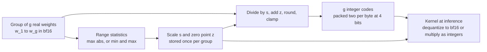
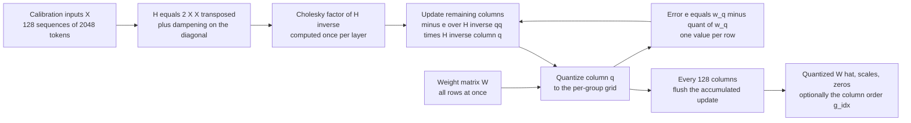
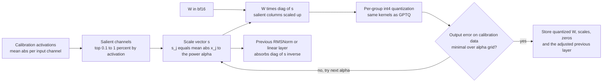
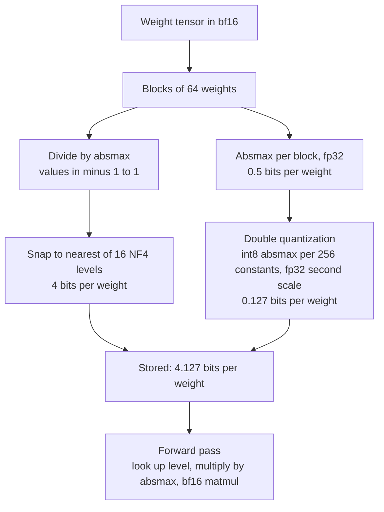
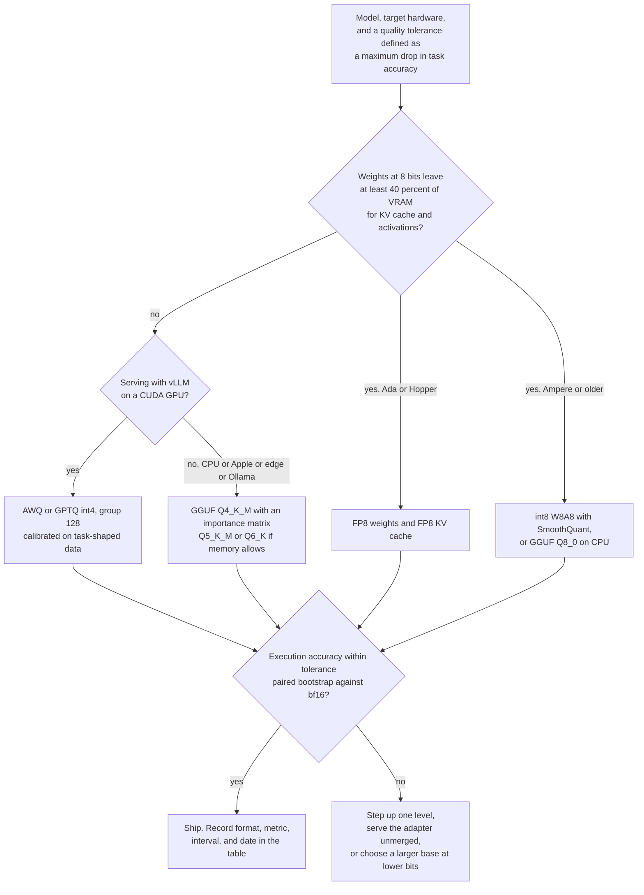

# Chapter 12: Quantization

> **What you will be able to do:** quantize a weight matrix by hand and in PyTorch with per-group scales and zero points; explain GPTQ, AWQ, LLM.int8, NF4, GGUF k-quants, and FP8 well enough to choose between them for a given GPU and quality tolerance; compute the memory of any model at any format; measure the quality cost with perplexity and task accuracy and know when the two disagree; produce the quantization decision table that P2.1 requires.
> **Where it is used:** P2.1 (quantization lab), P2.2 (serving the AWQ 7B model and an FP8 KV cache in vLLM), P1.2 and P1.5 (GGUF exports for Ollama), P4.3 (fitting a small vision-language model on 8 GB).
> **Prerequisites:** Chapter 4 (memory arithmetic and the roofline), Chapter 7 (QLoRA, which uses NF4 during training). Chapter 13 builds on this chapter.

## 12.0 The problem this chapter solves

A customer has approved your fine-tuned 7B text-to-SQL model. Their inference hardware is a single 24 GB GPU per site, and one site has only CPUs. The model's bf16 weights are about 15 GB. Three questions arrive in the same meeting: does it fit next to the KV cache, how many tokens per second will each analyst see, and what did we lose by compressing it. The answers depend on arithmetic that this chapter makes routine, and on mechanisms that decide where the compression error lands.

Decode reads every weight once per generated token, so the bytes per weight set the speed and the memory footprint at the same time. Halving the bytes roughly halves the time per decode step on a memory-bound GPU and frees memory for more concurrent users. Chapter 13 shows how serving engines spend that freed memory. This chapter is about producing the smaller weights without breaking the model.

Quantization error is not uniform in its effect. A rounding error on a weight that multiplies a large activation changes the output more than the same error on a weight that multiplies a small one. Every method below is a strategy for placing error where it costs the least: compensating it with second-order information (GPTQ), reshaping the problem so salient weights carry less of it (AWQ, SmoothQuant), or placing the representable levels where the weights actually are (NF4, k-quants with an importance matrix).

The chapter covers post-training quantization of weights, activations, and the KV cache. Quantization-aware training and pruning are out of scope, apart from one sentence where they bear on a decision.

## 12.1 Why weights dominate decode time

Chapter 4 derived the roofline. The result that matters here: one decode step reads the whole model and the whole KV cache from GPU memory and performs about $2N$ floating-point operations per sequence, where $N$ is the parameter count. At small batch this is far below the ridge point of any modern GPU, so the step time is bounded by memory traffic:

$$t_{\text{step}} \ge \frac{B_w + B_{kv}}{\beta}$$

where $B_w$ is the bytes of weights, $B_{kv}$ the bytes of KV cache read in the step, and $\beta$ the memory bandwidth in bytes per second. Tokens per second for one sequence is at most $1/t_{\text{step}}$.

Worked example on the RTX 4060 Laptop GPU (about 256 GB/s, verify against your own bandwidth test; the part is specified with a 128-bit GDDR6 bus at 16 Gbps, and the laptop power limit moves the achieved figure). A 7B model with $N = 7.0 \times 10^9$ weights:

| Format | Bits per weight | Weight bytes | Step time bound | Tokens per second bound |
|---|---|---|---|---|
| bf16 | 16 | 14.0 GB | does not fit | none |
| FP8 or int8 | 8 | 7.0 GB | 27.3 ms | 37 |
| GGUF Q4_K_S | 4.5 | 3.9 GB | 15.2 ms | 66 |
| int4, group 128 | 4.16 | 3.6 GB | 14.1 ms | 71 |

The bound ignores the KV cache read and kernel inefficiency; measured speeds are typically 50 to 70 percent of it. On an A100 80 GB (about 2.0 TB/s), the same bf16 model reads in 7 ms, so batch-1 decode tops out near 140 tokens per second, and 4-bit weights would allow near 500 if the kernels kept up, which they rarely do.

Two consequences shape the rest of the chapter. First, weight-only quantization speeds up decode and does nothing for prefill, because prefill is compute-bound and the dequantization is extra work. Second, at large batch, decode itself becomes compute-bound, and a 4-bit kernel that dequantizes to bf16 before multiplying can be slower than bf16. Kernels such as Marlin exist to keep int4 competitive at batch sizes in the tens; check what your engine version uses.

## 12.2 Integer quantization: scale, zero point, and the grid

A $b$-bit integer quantizer maps a real-valued weight $w$ to one of $2^b$ codes and back through an affine map. The intuition: pick a step size so the grid covers the range of the values, round each value to the nearest grid point, and store the grid point index plus the step size.

### Symmetric quantization

The grid is centered on zero. Define the largest positive code $q_{\max} = 2^{b-1} - 1$ (7 for int4, 127 for int8). For a vector or group of weights $w_1, \ldots, w_g$:

$$s = \frac{\max_i |w_i|}{q_{\max}}, \qquad q_i = \mathrm{clamp}\!\left(\mathrm{round}\!\left(\frac{w_i}{s}\right), -2^{b-1}, 2^{b-1}-1\right), \qquad \hat{w}_i = s \, q_i$$

Here $s$ is the scale (the real value of one grid step), $q_i$ the integer code, and $\hat{w}_i$ the dequantized weight. Only $s$ and the codes are stored. The clamp matters because $-2^{b-1}$ is representable but never produced by the scale formula; some implementations use it, some do not.

### Asymmetric quantization

The grid is shifted so that its endpoints land on the minimum and maximum of the group. Define the zero point $z$, the integer code that represents the real value zero:

$$s = \frac{w_{\max} - w_{\min}}{2^b - 1}, \qquad z = \mathrm{round}\!\left(-\frac{w_{\min}}{s}\right), \qquad q_i = \mathrm{clamp}\!\left(\mathrm{round}\!\left(\frac{w_i}{s}\right) + z, 0, 2^b - 1\right), \qquad \hat{w}_i = s\,(q_i - z)$$

Asymmetric quantization uses all $2^b$ codes when the distribution is skewed, at the cost of storing $z$ per group. Weights are roughly symmetric around zero, so symmetric quantization is common for weights; activations after a GELU or SwiGLU are skewed, so asymmetric quantization is common for activations.

### Rounding error

If the values are spread smoothly relative to the step, the rounding error is close to uniform on $[-s/2, s/2]$, and the expected squared error per weight is

$$\mathbb{E}\!\left[(\hat{w} - w)^2\right] = \frac{s^2}{12}$$

This is the formula behind every intuition about granularity: halving $s$ quarters the error. The scale is set by the largest magnitude in the group, so one large value makes $s$ large for everyone in its group.

### Worked example: eight weights to int4

Take $w = [0.12, -0.35, 0.80, 0.05, -0.22, 0.41, -0.67, 0.29]$.

Symmetric: $\max_i |w_i| = 0.80$, so $s = 0.80 / 7 = 0.1143$.

| $w_i$ | $w_i / s$ | $q_i$ | $\hat{w}_i$ | error |
|---|---|---|---|---|
| 0.12 | 1.05 | 1 | 0.1143 | -0.0057 |
| -0.35 | -3.06 | -3 | -0.3429 | +0.0071 |
| 0.80 | 7.00 | 7 | 0.8000 | 0 |
| 0.05 | 0.44 | 0 | 0.0000 | -0.0500 |
| -0.22 | -1.93 | -2 | -0.2286 | -0.0086 |
| 0.41 | 3.59 | 4 | 0.4571 | +0.0471 |
| -0.67 | -5.86 | -6 | -0.6857 | -0.0157 |
| 0.29 | 2.54 | 3 | 0.3429 | +0.0529 |

Mean squared error 0.00099, root mean squared error 0.031. The prediction $s^2/12 = 0.1143^2 / 12 = 0.00109$ is within 10 percent of the measured value even for eight numbers.

Asymmetric: $w_{\min} = -0.67$, $w_{\max} = 0.80$, $s = 1.47 / 15 = 0.098$, $z = \mathrm{round}(0.67 / 0.098) = \mathrm{round}(6.84) = 7$. The codes are $[8, 3, 15, 8, 5, 11, 0, 10]$, the dequantized values $[0.098, -0.392, 0.784, 0.098, -0.196, 0.392, -0.686, 0.294]$, and the mean squared error 0.00075, lower than the symmetric case because the range is not centered on zero and the finer step ($0.098$ against $0.114$) pays for the stored zero point. Predicted: $0.098^2 / 12 = 0.0008$.

Storage for this group at int4 with an fp16 scale: 8 codes at 4 bits (4 bytes) plus 2 bytes of scale, 6 bytes against 16 bytes in bf16.



*Figure 12.1: The quantization grid: a group of weights shares one scale and, for asymmetric schemes, one zero point; only the codes and the constants are stored.*

## 12.3 Granularity: per-tensor, per-channel, per-group

The scale can be shared by a whole weight matrix (per-tensor), by one output row (per-channel), or by a contiguous run of $g$ weights along the input dimension (per-group, also called blockwise). Smaller groups track the local range, so most groups get a smaller $s$ and a smaller error, at the cost of storing more scales and of a kernel that loads a new scale every $g$ weights.

Bits per weight for a $b$-bit format with an fp16 scale and, optionally, a $b$-bit zero point per group:

$$\text{bits per weight} = b + \frac{16}{g} \; \left(+ \frac{b}{g} \text{ with a zero point}\right)$$

| Granularity | Group size $g$ | int4, scale only | int4, scale and zero | 7B weight bytes |
|---|---|---|---|---|
| Per-group, fine | 32 | 4.500 | 4.625 | 3.9 to 4.0 GB |
| Per-group | 64 | 4.250 | 4.313 | 3.7 to 3.8 GB |
| Per-group, default | 128 | 4.125 | 4.156 | 3.6 GB |
| Per-group, coarse | 256 | 4.063 | 4.078 | 3.6 GB |
| Per-channel, $d = 4096$ | 4096 | 4.004 | 4.005 | 3.5 GB |

The default of 128 for GPTQ and AWQ is a compromise: about 3 percent storage overhead, and groups small enough that a single outlier ruins at most 127 neighbors. GGUF's legacy types use 32; NF4 uses 64; the k-quant sub-blocks use 16 or 32 inside superblocks of 256.

Per-channel quantization is adequate at 8 bits because 255 levels cover even a wide range with fine steps. At 4 bits, 15 levels across a whole row of 4096 weights cannot resolve the typical weight when one large weight sets the scale, which is why every practical int4 format is per-group.

### Worked example: why per-group beats per-tensor with an outlier

Append one weight of value 4.0 to the eight-vector above and quantize all nine symmetrically with one scale. Now $s = 4.0 / 7 = 0.571$, and the eight original weights become codes in $\{-1, 0, 1\}$: the dequantized values are $[0, -0.571, 0.571, 0, 0, 0.571, -0.571, 0.571]$, with a root mean squared error of 0.188 across those eight, six times worse than before. Every weight but the outlier has lost its information.

Put the outlier in a group of its own (or in a group with other large weights) and the first group keeps $s = 0.114$ and its error of 0.031, while the outlier is exact. Per-group quantization caps the damage of an outlier at its own group. This is the whole argument for fine granularity, and the reason the rest of this chapter treats "group size 128" as the baseline that methods improve on.

## 12.4 Outliers and the limits of round-to-nearest

Round-to-nearest (RTN) is the procedure of section 12.2 applied directly, group by group, with no calibration data and no adjustment. It is the baseline every method is compared to. At 8 bits per-channel RTN is close to lossless for transformer weights; at 4 bits per-group RTN loses a measurable amount on a 7B model and considerably more on a 1B model; at 3 bits RTN produces a model that is usually not worth serving. The exact losses depend on the model, and P2.1 measures them for yours.

Where outliers come from. Transformer weights are approximately Gaussian with heavier tails than a Gaussian. Activations are worse: Dettmers et al. (2022) found that from about 6.7B parameters upward, a small number of hidden dimensions (on the order of 0.1 percent) carry activation magnitudes 20 to 60 times larger than the rest, in the same dimensions across most layers. These dimensions are functionally important, so clipping them destroys the model, and scaling to cover them destroys the resolution of everything else. Weight outliers are milder but present, and the weights that multiply the outlier activation channels matter far more than their magnitude suggests.

Three escape routes, each a section below. Use calibration data to compensate rounding error with second-order information (GPTQ, section 12.5). Rescale channels before quantizing so that the salient weights carry less error, and fold the rescaling into an adjacent layer so it costs nothing at inference (AWQ, section 12.6; SmoothQuant, section 12.10). Place the representable levels non-uniformly where the weights actually are (NF4, section 12.7; k-quants with an importance matrix, section 12.8).

## 12.5 GPTQ: column-wise quantization with Hessian compensation

The intuition: rounding one weight changes the layer's output; the remaining unquantized weights in the same row can be nudged to cancel most of that change, and the right nudge depends on how the layer's inputs are correlated. Do this one column at a time across the whole matrix and the total output error ends far below RTN.

### The layer-wise objective

GPTQ (Frantar et al., 2022) quantizes each linear layer independently to minimize the change in that layer's output on calibration inputs. For a weight matrix $W \in \mathbb{R}^{d_{\text{out}} \times d_{\text{in}}}$ and a matrix of calibration inputs $X \in \mathbb{R}^{d_{\text{in}} \times n}$ ($n$ tokens as columns), the objective is

$$\min_{\hat{W}} \; \| W X - \hat{W} X \|_F^2$$

subject to every entry of $\hat{W}$ lying on the quantization grid. The objective separates by output row. For one row $w \in \mathbb{R}^{d_{\text{in}}}$ with quantized version $\hat{w}$, the error is

$$(\hat{w} - w) \, H \, (\hat{w} - w)^T, \qquad H = 2 X X^T$$

where $H$ is the Hessian of the row's squared error with respect to its weights. $H$ is $d_{\text{in}} \times d_{\text{in}}$, the same for every row, and it encodes the correlations between input channels: if inputs $x_i$ and $x_j$ tend to move together, an error on $w_i$ can be compensated by an opposite adjustment to $w_j$.

### The optimal brain surgeon update

Hassibi and Stork (1993) solved the following for pruning, and Frantar and Alistarh (2022) adapted it to quantization as Optimal Brain Quantization (OBQ). Fix one weight $w_q$ at its quantized value $\mathrm{quant}(w_q)$ and choose the update $\delta \in \mathbb{R}^{d_{\text{in}}}$ of the whole row that minimizes the quadratic error subject to that constraint. The Lagrangian solution is

$$\delta = -\frac{w_q - \mathrm{quant}(w_q)}{[H^{-1}]_{qq}} \; H^{-1}_{:,q}$$

In words: the rounding error on weight $q$, divided by the $q$-th diagonal entry of the inverse Hessian, scales the $q$-th column of the inverse Hessian, and the negative of that is added to the row. The $q$-th component of $\delta$ moves $w_q$ exactly onto its quantized value; the other components are the compensation. After the update, weight $q$ is frozen and removed from the problem by updating the inverse Hessian:

$$H^{-1} \leftarrow H^{-1} - \frac{H^{-1}_{:,q} \, H^{-1}_{q,:}}{[H^{-1}]_{qq}}$$

OBQ applies this greedily, always picking the weight whose quantization adds the least error, separately per row. That costs $O(d_{\text{out}} \cdot d_{\text{in}}^3)$ and is far too slow for billion-parameter layers.

### GPTQ's three changes

1. **Fixed column order.** Quantize columns in the same order for every row (the original paper uses the natural order; later implementations quantize columns with the largest $[H]_{qq}$ first, the "act-order" or `desc_act` heuristic, which improves accuracy at some kernel cost). Because $H$ is shared by all rows, the inverse-Hessian updates are computed once per column and applied to all $d_{\text{out}}$ rows at the same time. Cost falls to $O(\max(d_{\text{out}} d_{\text{in}}^2, d_{\text{in}}^3))$.
2. **Lazy batch updates.** Updates to the not-yet-quantized columns are accumulated for a block of 128 columns and applied in one matrix multiplication, which turns a memory-bound sequence of small updates into a compute-bound large one.
3. **Cholesky reformulation.** The rows of $H^{-1}$ that the algorithm needs are exactly the rows of the upper Cholesky factor of $H^{-1}$ (up to scaling), so one Cholesky decomposition replaces the repeated inverse updates and removes the numerical drift they cause. A dampening term $\lambda = 0.01 \cdot \mathrm{mean}(\mathrm{diag}(H))$ is added to the diagonal of $H$ before inversion so that layers with dead input channels remain invertible.



*Figure 12.2: The GPTQ column sweep: each column is quantized for all rows at once, its rounding error is propagated to the unquantized columns through the inverse Hessian, and updates are flushed in blocks of 128.*

### Worked example: two weights, one step

Take one row with two weights $w = [0.90, 0.78]$ and a coarse grid of multiples of 0.5, so that the effect is visible. Suppose the calibration inputs give

$$H = \begin{pmatrix} 2.0 & 1.2 \\ 1.2 & 2.0 \end{pmatrix}, \qquad H^{-1} = \begin{pmatrix} 0.781 & -0.469 \\ -0.469 & 0.781 \end{pmatrix}$$

The positive off-diagonal of $H$ says the two inputs are positively correlated; the negative off-diagonal of $H^{-1}$ says an upward error on one weight should be paid for by a downward change on the other.

RTN quantizes both to 1.0. The error vector is $\hat{w} - w = [0.10, 0.22]$ and the output error is $[0.10, 0.22] \, H \, [0.10, 0.22]^T = 0.1696$.

GPTQ quantizes column 1 first: $\mathrm{quant}(0.90) = 1.0$, rounding error $e = 0.90 - 1.0 = -0.10$. The update is

$$\delta = -\frac{-0.10}{0.781} \begin{pmatrix} 0.781 \\ -0.469 \end{pmatrix} = \begin{pmatrix} 0.10 \\ -0.06 \end{pmatrix}$$

The first component moves $w_1$ onto 1.0. The second moves $w_2$ from 0.78 to 0.72, which now rounds to 0.5 instead of 1.0. The final error vector is $[0.10, -0.28]$ and the output error is $0.1096$, 35 percent lower than RTN even though the second weight's own error is larger. GPTQ trades weight-space error for output-space error, and output space is what the next layer sees.

### Calibration data and cost

The paper uses 128 random segments of 2048 tokens from C4. Layers are processed in order; the inputs to layer $\ell$ are computed by running the already-quantized layers $1$ to $\ell - 1$, so later layers compensate for earlier errors. Calibration text that is far from your task hurts: a text-to-SQL model calibrated on web prose can lose more execution accuracy than the same model calibrated on a few hundred schema-and-query prompts. Use task-shaped public data.

Memory during quantization: the fp16 weights of the layer, $H$ in fp32 ($4096^2 \times 4$ bytes is 64 MB; $11008^2 \times 4$ bytes is 485 MB for a Llama-2-7B down projection), and the calibration activations for that layer ($128 \times 2048 \times 4096 \times 2$ bytes is about 2.1 GB). The algorithm needs only one layer at a time, but the common tools load the whole fp16 model, so a 7B needs about 14 GB plus working memory. That is why P2.1 sends the 7B calibration to a Kaggle T4 pair and keeps the 1.5B local. The paper reports about four GPU hours for a 175B model on an A100; a 7B model takes tens of minutes on one GPU.

Output: int4 codes, fp16 scales and zero points per group of 128, and a `g_idx` permutation when act-order is on. Inference kernels dequantize to fp16 inside the matmul; the exllama and Marlin kernel families are the common choices, and both AWQ and GPTQ checkpoints can be served through them by vLLM (check your version).

## 12.6 AWQ: activation-aware weight quantization

The intuition: a small fraction of weight channels multiply large activations, and rounding error there dominates the output error. Instead of storing those channels in higher precision, which makes the kernel slow, scale them up before quantizing so that the same grid step is a smaller fraction of their value, and scale the corresponding activations down so that the product is unchanged.

### The equivalent transformation

For a linear layer $y = W x$ with $W \in \mathbb{R}^{d_{\text{out}} \times d_{\text{in}}}$ and a positive per-input-channel scale vector $s \in \mathbb{R}^{d_{\text{in}}}$,

$$y = W x = \big(W \, \mathrm{diag}(s)\big) \big(\mathrm{diag}(s)^{-1} x\big)$$

Quantize $W \, \mathrm{diag}(s)$ (multiply column $j$ of $W$ by $s_j$) and fold $\mathrm{diag}(s)^{-1}$ into whatever produces $x$: the gain vector of the preceding RMSNorm, or the rows of the preceding linear layer. At inference nothing extra runs; the stored weights are ordinary group-quantized int4 and the preceding layer's parameters are slightly different. This is why AWQ is as fast as any int4 format at serving time.

### Why scaling reduces error

Lin et al. (2023) argue as follows. For weight $w$ in a group with step $\Delta$, the error contributed to the output is $\Delta \cdot \mathrm{RoundErr}(w / \Delta) \cdot x$, where $\mathrm{RoundErr}$ is the rounding error in grid units, on average 0.25 in magnitude regardless of $w$. After scaling by $s$ the same term is $\Delta' \cdot \mathrm{RoundErr}(w s / \Delta') \cdot x / s$, where $\Delta'$ is the group step after scaling. The ratio of the two is

$$\frac{\Delta'}{\Delta} \cdot \frac{1}{s}$$

If the scaled weight does not become the largest in its group, $\Delta' \approx \Delta$ and the error on that channel shrinks by a factor $s$. If $s$ is pushed too far, $\Delta'$ grows and every other weight in the group gets worse. There is a sweet spot, found by search.

### The search

AWQ measures the mean absolute activation per input channel on calibration data, $\bar{x}_j$, and parameterizes the scale as

$$s_j = \bar{x}_j^{\,\alpha}, \qquad \alpha \in [0, 1]$$

with $\alpha = 0$ giving RTN and $\alpha = 1$ giving full protection of salient channels. A grid search over about 20 values of $\alpha$ per layer picks the one that minimizes $\| Q(W \mathrm{diag}(s)) \, \mathrm{diag}(s)^{-1} X - W X \|$ on the calibration inputs. The paper also searches a clipping threshold for the group maximum. Calibration is small (the paper uses a subset of the Pile) and the method is far less sensitive to the calibration distribution than GPTQ, because it fits two scalars per layer instead of adjusting every weight.

### Worked example

A group of eight weights $w = [0.80, -0.20, 0.27, 0.05, -0.12, 0.33, -0.44, 0.15]$ multiplies an input where channel 3 (the weight 0.27) carries an activation of 10 and every other channel carries 1. The true output is $y = w \cdot x = 3.27$.

RTN with $\Delta = 0.80 / 7 = 0.1143$: channel 3 becomes $0.2286$, an error of $-0.0414$, which multiplied by $x_3 = 10$ contributes $-0.414$ to the output. Total output error $-0.527$, or 16 percent of $y$.

AWQ with $s_3 = 2$: the scaled weight is $0.54$, still below the group maximum of $0.80$, so $\Delta' = \Delta$. It quantizes to code 5, dequantizes to $0.5714$, and dividing by $s_3$ gives an effective weight of $0.2857$, an error of $+0.0157$. Every other weight is unchanged. Total output error $+0.044$, or 1.4 percent of $y$: twelve times better from one scale factor.

AWQ with $s_3 = 3$: the scaled weight $0.81$ now exceeds $0.80$, so $\Delta' = 0.81/7 = 0.1157$ and every other weight's error grows slightly. Channel 3 is now exact, but the total output error is $-0.107$, worse than $s_3 = 2$. This is the sweet spot the $\alpha$ search finds.



*Figure 12.3: AWQ's equivalent transformation: salient input channels are scaled up before quantization and the inverse scale is folded into the producing layer, so inference runs a plain int4 kernel.*

### AWQ against GPTQ in practice

At 4 bits with group size 128 the two are close on most 7B-class models, with the ordering varying by model and calibration set. GPTQ tends to win at 3 bits. AWQ quantizes in minutes with little calibration sensitivity and is the common default for vLLM serving. Both produce the same class of checkpoint, and the decision is usually settled by measurement on your task, which is P2.1's point.

## 12.7 bitsandbytes: LLM.int8 and NF4

bitsandbytes quantizes at load time, needs no calibration and no file conversion, and runs on any CUDA GPU. Its two formats serve different jobs.

### LLM.int8: vector-wise quantization with outlier decomposition

Dettmers et al. (2022) quantize a matrix multiplication $X W$ to int8 in two parts. Vector-wise scaling assigns one absmax scale per row of $X$ (per token) and one per column of $W$ (per output feature); the int8 products accumulate in int32 and are rescaled by the outer product of the two scale vectors. That alone breaks above about 6.7B parameters because of the emergent activation outliers. So the columns of $X$ whose absolute maximum exceeds a threshold (6.0 in the paper) are pulled out, together with the matching rows of $W$, and multiplied in fp16; the rest run in int8. The two partial products are summed.

The memory halves. The speed does not improve at small batch: the runtime quantization of activations and the split matmul cost more than they save. LLM.int8 is the format for "make it fit with one flag", not for throughput. In Hugging Face transformers this is `load_in_8bit=True` through a `BitsAndBytesConfig` (check your version).

### NF4: the 4-bit NormalFloat

QLoRA (Dettmers et al., 2023) introduced NF4 for frozen base weights during fine-tuning (Chapter 7). The intuition: if weights in a block are roughly Gaussian after dividing by the block's absmax, then a uniform grid wastes levels in the sparse tails and starves the dense center. Place the 16 levels at quantiles of the standard normal instead, so each level is equally likely to be used.

For a $k$-bit code the ideal construction takes $2^k + 1$ evenly spaced probabilities and sets each level at the midpoint of adjacent normal quantiles,

$$q_i = \frac{1}{2}\left( \Phi^{-1}\!\left(\frac{i}{2^k + 1}\right) + \Phi^{-1}\!\left(\frac{i+1}{2^k + 1}\right) \right), \qquad i = 1, \ldots, 2^k$$

where $\Phi^{-1}$ is the inverse cumulative distribution function of the standard normal, and the levels are then divided by the largest to lie in $[-1, 1]$. A symmetric construction has no exact zero, which matters for padding and for weights that are exactly zero, so the actual NF4 uses an asymmetric split: eight positive levels from one set of quantiles, seven negative levels from another, and zero, with the outermost probability set to 0.9677 so the largest level is exactly 1. The sixteen values, from the bitsandbytes source (verify):

$$-1.000, -0.696, -0.525, -0.395, -0.284, -0.185, -0.091, 0, 0.080, 0.161, 0.246, 0.338, 0.441, 0.563, 0.723, 1.000$$

Quantizing a block of 64 weights: divide by the block absmax, snap each value to the nearest level, store the 4-bit index and the absmax. Dequantizing: look up the level, multiply by the absmax. The lookup and multiply happen in the forward pass every time the layer runs, producing bf16 weights for an ordinary bf16 matmul. There is no int4 matmul kernel, so NF4 is slower per token than AWQ or GPTQ; its purpose is training and convenience, not serving throughput.

### Double quantization

The block absmax is stored in fp32: 32 bits per 64 weights, or 0.5 bits per weight. Double quantization quantizes the absmax values themselves to int8 in blocks of 256, with one fp32 scale per block of constants. The overhead becomes

$$\frac{8}{64} + \frac{32}{64 \times 256} = 0.125 + 0.002 = 0.127 \text{ bits per weight}$$

a saving of 0.373 bits per weight, which the QLoRA paper reports. For a 7B model that is 109 million blocks: 0.44 GB of fp32 constants against 0.11 GB after double quantization, on top of 3.5 GB of codes.



*Figure 12.4: NF4 with double quantization: blockwise absmax normalization, a 16-level normal-quantile codebook, and int8 storage of the block constants.*

### Worked example: NF4 on the eight-vector

Normalize $w$ by its absmax 0.80: $[0.15, -0.44, 1.0, 0.06, -0.28, 0.51, -0.84, 0.36]$. Snap to the nearest levels: $[0.161, -0.395, 1.0, 0.080, -0.284, 0.563, -0.696, 0.338]$. Multiply back: $[0.129, -0.316, 0.80, 0.064, -0.228, 0.450, -0.557, 0.270]$. Root mean squared error 0.045, worse than uniform int4's 0.031 on this vector. The reason is instructive: $-0.84$ normalized lies in the tail between $-0.696$ and $-1.0$, where NF4 has no level because a Gaussian rarely puts a value there, and eight numbers are not a Gaussian block. NF4 is optimal in expectation for normally distributed blocks of 64, which real weight blocks approximate well enough that the QLoRA paper measures NF4 beating int4 across model families. Do not expect it to win on every block.

## 12.8 GGUF k-quants

GGUF is llama.cpp's single-file format: metadata (architecture, tokenizer, hyperparameters) followed by tensors, each with its own quantization type. It runs on CPUs, Apple silicon, and CUDA GPUs, and it is what Ollama serves. The quantization types fall into three families.

### Legacy types

Q4_0: blocks of 32 weights, one fp16 scale, symmetric, 4.5 bits per weight. Q4_1: adds an fp16 minimum (asymmetric), 5.0 bits. Q8_0: blocks of 32 with an fp16 scale, 8.5 bits, effectively lossless. Q8_0 is the right export when memory allows, and the reference against which lower types are measured.

### k-quants

Introduced in llama.cpp in 2023 (by the contributor ikawrakow), k-quants use a superblock of 256 weights with fp16 superblock constants and sub-blocks of 16 or 32 weights whose scales (and minimums, for the asymmetric types) are themselves quantized to 4, 6, or 8 bits relative to the superblock constants. The nested scales are the trick: fine granularity (sub-blocks of 16 or 32) at close to the storage cost of coarse granularity.

Bit accounting for Q4_K: 256 weights at 4 bits, eight sub-blocks of 32 each with a 6-bit scale and a 6-bit minimum, and two fp16 superblock constants:

$$\frac{256 \times 4 + 8 \times (6 + 6) + 2 \times 16}{256} = \frac{1152}{256} = 4.5 \text{ bits per weight}$$

The tensor-level ladder: Q2_K at 2.625, Q3_K at 3.4375, Q4_K at 4.5, Q5_K at 5.5, Q6_K at 6.5625 bits per weight.

### What K_S, K_M, and K_L mean

These are model-level mixes, not tensor types. The `_S` (small) variant uses the named type for every quantizable tensor. `_M` (medium) upgrades the tensors that are most sensitive to error: in the original mix, a share of the attention value projections and the feed-forward down projections go to Q6_K in Q4_K_M and Q5_K_M, and to Q4_K in Q3_K_M. `_L` (large) upgrades more tensors, or to a higher type. Embedding and output matrices are usually kept at Q6_K or Q8_0 regardless. The exact tensor mix has changed across llama.cpp versions; read the quantize source for your build rather than trusting a table. The practical result is that Q4_K_M weighs about 4.8 bits per weight on a Llama-style 7B against 4.5 for Q4_K_S, and buys a visibly smaller perplexity loss for about 7 percent more bytes.

### The importance matrix

`llama-imatrix` runs calibration text through the fp16 model and accumulates, per linear layer, the mean squared activation of each input channel. `llama-quantize --imatrix` then chooses each block's scale (and, for some types, each weight's code) to minimize importance-weighted squared error instead of plain absmax rounding. The exact objective varies by type. The importance matrix is what makes Q2_K and the codebook-based I-quants (IQ2_XXS, IQ3_XS, and relatives, which quantize groups of weights to entries of a lattice codebook) usable at all, and it gives Q3 and Q4 a small improvement. Use it whenever you quantize below Q5, and calibrate on text shaped like your task.

### The ladder for a 7B model

Bytes for $N = 7.0 \times 10^9$ quantizable weights; quality bands are typical for 7B-class models and must be measured for yours.

| Type | Bits per weight (model level, approximate) | Weight bytes | Typical quality against fp16 |
|---|---|---|---|
| Q8_0 | 8.5 | 7.4 GB | indistinguishable |
| Q6_K | 6.56 | 5.7 GB | indistinguishable in practice |
| Q5_K_M | about 5.7 | 5.0 GB | perplexity up by hundredths |
| Q4_K_M | about 4.8 | 4.2 GB | perplexity up by a few hundredths to a tenth; the default |
| Q4_K_S | 4.5 | 3.9 GB | slightly worse than Q4_K_M |
| Q3_K_M | about 3.9 | 3.4 GB | perplexity up by several tenths; task accuracy at risk |
| Q2_K | about 2.7 | 2.4 GB | perplexity up by a point or more; needs an importance matrix; test before trusting |

## 12.9 FP8: E4M3 and E5M2

FP8 is an 8-bit floating-point family standardized by Micikevicius et al. (2022) and implemented in the tensor cores of NVIDIA Hopper and Ada GPUs, including the RTX 4060 (compute capability 8.9). Unlike integer formats it keeps a per-value exponent, so relative precision is roughly constant across magnitudes and outliers within the range cost nothing.

### The two layouts

| Format | Sign | Exponent bits | Mantissa bits | Exponent bias | Largest finite | Smallest normal | Smallest subnormal | Special values |
|---|---|---|---|---|---|---|---|---|
| E4M3 | 1 | 4 | 3 | 7 | 448 | $2^{-6} = 0.0156$ | $2^{-9} = 0.00195$ | one NaN pattern, no infinities |
| E5M2 | 1 | 5 | 2 | 15 | 57344 | $2^{-14}$ | $2^{-16}$ | infinities and NaN, like fp16 truncated |

E4M3 gives three mantissa bits, so a value is represented with relative error up to $2^{-4} = 6.25$ percent. E5M2 gives two, up to 12.5 percent, but with the dynamic range of fp16. Weights and activations use E4M3; gradients, which need range more than precision, use E5M2 in FP8 training. E4M3 gives up infinities to buy one more exponent code for finite values, which is why its maximum is 448 ($1.75 \times 2^8$) rather than 256.

Worked encoding: $3.14 = 1.57 \times 2^1$. In E4M3 the mantissa options nearest 1.57 are 1.5 (binary 1.100) and 1.625 (1.101); 1.625 is closer, so the stored value is $1.625 \times 2 = 3.25$, an error of 3.5 percent. In E5M2 the options are 1.5 and 1.75; 1.5 wins and the stored value is 3.0, an error of 4.5 percent.

### Scaling

A tensor is cast to FP8 after division by a scale so that its maximum lands near the format's maximum:

$$x_{\text{fp8}} = \mathrm{cast}\!\left(\frac{x}{s}\right), \qquad s = \frac{\max |x|}{448} \text{ for E4M3}$$

with $s$ stored in fp32 per tensor (or per channel, or per block of 128 in newer schemes). Static scaling calibrates $s$ once on sample data; dynamic scaling recomputes it from the tensor each step, which suits activations. Worked example: an activation tensor with $\max|x| = 60$ gets $s = 60 / 448 = 0.134$, so its values are spread over the full E4M3 range and a typical value of 1.0 becomes $7.46$, represented to within 6.25 percent.

### Hardware and quality

Hopper and Ada tensor cores multiply FP8 by FP8 with fp16 or fp32 accumulation, so FP8 weights and activations together (W8A8, section 12.10) halve memory traffic and roughly double the matmul rate against bf16, which speeds up prefill and large-batch decode as well as small-batch decode. Ampere GPUs (A100) have no FP8 tensor cores; vLLM can still load FP8 weights on them by dequantizing inside a weight-only kernel, which gives the memory saving without the compute saving (check your version). Blackwell adds 4-bit floating-point block formats; treat those as current and verify their support before recommending them.

FP8 weights and activations are close to lossless on 7B-class and larger models: perplexity differences typically in the second decimal place and task accuracy within noise. It is the default recommendation when the hardware supports it and the model fits at 8 bits. On the RTX 4060, a 3B model in FP8 is about 3.1 GB of weights; a 7B in FP8 does not leave room for a useful KV cache.

## 12.10 Activation quantization: W8A8 and SmoothQuant

Notation: W$b$A$c$ means $b$-bit weights and $c$-bit activations. Everything above except LLM.int8 and FP8 was W4A16 or W8A16: weight-only, with activations left in bf16 and the matmul run in bf16 after dequantization. Weight-only quantization saves bytes and therefore decode time; it does not use faster arithmetic.

W8A8 changes the arithmetic. Int8 tensor cores on an A100 deliver twice the operations per second of bf16 (about 624 against 312 TOPS, dense), and FP8 on Hopper and Ada likewise. Prefill and large-batch decode, which are compute-bound, speed up. The obstacle is the activation outliers of section 12.4: per-token int8 scaling of a token vector with one entry of 60 and the rest near 1 leaves the rest with a step of $60/127 \approx 0.47$, which is worse than useless.

SmoothQuant (Xiao et al., 2022) uses the same algebra as AWQ with the opposite intent: migrate quantization difficulty from activations to weights by a per-channel scale that flattens the activation range,

$$Y = \big(X \, \mathrm{diag}(s)^{-1}\big) \big(\mathrm{diag}(s) \, W\big), \qquad s_j = \frac{\max |X_j|^{\alpha}}{\max |W_j|^{1 - \alpha}}$$

with $\alpha = 0.5$ the default migration strength. Worked example: channel $j$ has an activation maximum of 60 and a weight maximum of 0.5. Then $s_j = \sqrt{60} / \sqrt{0.5} = 7.75 / 0.707 = 10.95$; the smoothed activation maximum is $60 / 10.95 = 5.48$ and the scaled weight maximum is $0.5 \times 10.95 = 5.48$. The difficulty is now shared equally and both sides quantize to int8 cleanly. The scale is folded into the preceding normalization, exactly as in AWQ. On Hopper and Ada, FP8 W8A8 has largely replaced int8 SmoothQuant because FP8's exponent handles moderate outliers without any smoothing; on Ampere, int8 W8A8 with SmoothQuant remains the way to get faster prefill.

## 12.11 KV-cache quantization

Chapter 4 derived the KV-cache size per token,

$$M_{kv} = 2 \cdot L \cdot n_{kv} \cdot d_h \cdot \text{bytes}$$

where $L$ is the number of layers, $n_{kv}$ the number of key-value heads, $d_h$ the head dimension, and the factor 2 counts keys and values. For Llama-3-8B ($L = 32$, $n_{kv} = 8$, $d_h = 128$) that is 128 KB per token in bf16 and 64 KB in an 8-bit format; for Qwen2.5-7B ($L = 28$, $n_{kv} = 4$, $d_h = 128$) 56 KB and 28 KB. An 8k-token sequence of Llama-3-8B costs 1.07 GB in bf16 and 0.54 GB at 8 bits.

Mechanism: keys and values are quantized as they are written to the cache, with one scale per token per head (or per tensor), and dequantized inside the attention kernel when read. FP8 E4M3 with a fixed scale of 1.0 works when the values stay within 448, which they usually do for keys and values; calibrated scales help E5M2 and int8. Keys are more sensitive than values: key vectors have a few channels with large magnitudes tied to the rotary position encoding, so per-channel key scaling (as in KIVI, Liu et al., 2024) survives lower bit widths than per-token scaling. At 8 bits either choice is usually fine.

Where to turn it on. vLLM: `--kv-cache-dtype fp8` (E4M3 on Ada and Hopper; check your version, and check the flag for supplying calibrated scales). llama.cpp: `-ctk q8_0 -ctv q8_0` for 8-bit keys and values, which requires the flash-attention path for the value type (check your version).

Effect at long context. Quantization error in the cache perturbs every attention score involving that token, and a long context has more tokens for the error to accumulate across and more near-ties in the softmax for it to flip. Retrieval-style tasks (find one fact in a long document) are the most sensitive; short prompts with short answers, like single-schema text-to-SQL, usually show no measurable change at 8 bits. P2.1 step 3 measures this on 2k and 8k prompts for your model, which is the honest way to know.

Speed. At small batch the weight read dominates and KV quantization changes little. At large batch and long context the cache read dominates: for Llama-3-8B at batch 32 with 4k tokens each, the cache is $32 \times 4096 \times 128$ KB $= 16$ GB, equal to the bf16 weights, so halving it cuts step time by about a quarter. Chapter 13 develops this.

## 12.12 Measuring quality: perplexity, task accuracy, and the cliff

### Perplexity

For a held-out token sequence $x_1, \ldots, x_T$,

$$\mathrm{PPL} = \exp\!\left( -\frac{1}{T} \sum_{t=1}^{T} \log p(x_t \mid x_{<t}) \right)$$

the exponential of the mean negative log-likelihood per token. The standard protocol for quantization papers is the WikiText-2 test split, concatenated, cut into non-overlapping windows of 2048 tokens, with the loss averaged over all predicted tokens (Listing 12.2). Two models can only be compared on perplexity if they share a tokenizer: perplexity is per token, and a tokenizer that produces fewer tokens per byte gets a higher perplexity for the same model quality. Compare the quantized model to its own fp16 parent, or convert both to bits per byte. Comparing the perplexity of a Qwen model to a Llama model is meaningless.

### Why perplexity and task accuracy diverge

Perplexity averages over every token, and most tokens in prose are easy and unaffected by quantization noise. Task accuracy depends on a few decisive tokens: a column name, a JOIN against a GROUP BY, a numeric literal. Quantization acts like a small random perturbation of the logits, so the argmax flips only where the margin between the top two logits is small. Text-to-SQL has many such positions (near-synonymous column names, optional aliases), so execution accuracy can fall by several points while WikiText perplexity moves by a few hundredths. The reverse also happens: a format that raises perplexity noticeably can leave a narrow task untouched because the affected tokens never occur in it. Measure both, with the paired bootstrap from Chapter 11, and trust the task number.

### The cliff and its model-size dependence

Across formats the pattern is consistent. Eight bits is indistinguishable from fp16. Four bits with per-group scales costs a 7B-class model a few hundredths to a few tenths of perplexity and a 1.5B model noticeably more. Three bits costs several tenths to a point and task accuracy can collapse. Two bits requires an importance matrix or a codebook and still hurts. Dettmers and Zettlemoyer (2022) measured the trade-off across scales and found 4 bits with small groups close to optimal in accuracy per byte: at a fixed memory budget, a larger model at 4 bits usually beats a smaller model at 8 bits. Smaller models have less redundancy per parameter, so each rounding error removes a larger share of what the model knows, which is why P2.1 asks you to locate the cliff separately for the 1.5B and the 7B.

Fine-tuned models add a subtlety. A LoRA update merged into the base is small relative to a 4-bit grid step, so quantization after merging can round away part of what the fine-tuning changed. Compare execution accuracy of the quantized merged model to the bf16 merged model, not to the base. If the loss is large, quantize the base and serve the adapter unmerged (Chapter 13 covers multi-LoRA serving), or fine-tune against the quantized base as QLoRA does.

## 12.13 Memory for a 7B model at each format

Total weight memory is

$$M_w = N_{\text{lin}} \cdot \frac{\text{bits per weight}}{8} + M_{\text{emb}}$$

where $N_{\text{lin}}$ counts the quantized linear weights and $M_{\text{emb}}$ the embedding and output matrices, which many formats keep at higher precision. Add the KV cache (section 12.11), activations, and a CUDA context of roughly 0.3 to 0.5 GB to get the footprint. For $N_{\text{lin}} = 7.0 \times 10^9$:

| Format | Bits per weight | Linear weights | Notes |
|---|---|---|---|
| bf16 | 16 | 14.0 GB | reference |
| FP8 E4M3, per-tensor scale | 8.0 | 7.0 GB | Ada, Hopper |
| int8 per-channel (LLM.int8) | 8.0 | 7.0 GB | load-time, slow kernels |
| GGUF Q8_0 | 8.5 | 7.4 GB | lossless in practice |
| GGUF Q6_K | 6.56 | 5.7 GB | |
| GGUF Q5_K_M | about 5.7 | 5.0 GB | |
| GGUF Q4_K_M | about 4.8 | 4.2 GB | |
| int4 group 32, scale and zero | 4.63 | 4.0 GB | |
| NF4 block 64, fp32 absmax | 4.5 | 3.9 GB | |
| int4 group 128, scale and zero (GPTQ, AWQ) | 4.16 | 3.6 GB | serving default |
| NF4 block 64, double quantization | 4.13 | 3.6 GB | training default |
| GGUF Q3_K_M | about 3.9 | 3.4 GB | |
| GGUF Q2_K | about 2.7 | 2.4 GB | |

Embeddings can dominate the residual. Qwen2.5-7B has a vocabulary of 152,064 and hidden size 3,584, untied: two matrices of 545 million parameters each, 2.2 GB in bf16. AWQ checkpoints of this model are about 5.6 GB rather than 3.6 GB for this reason, and GGUF quantizes the embedding to Q6_K or Q8_0 for the same reason. Llama-3-8B (vocabulary 128,256, hidden 4,096, untied) has two matrices of 525 million parameters. Always compute the embedding term separately.

## 12.14 A decision procedure



*Figure 12.5: The quantization decision: memory budget first, then hardware and engine, then a measured quality check with a paired interval before shipping.*

The procedure in prose. Set the memory budget: weights should leave at least 40 percent of VRAM free for the KV cache and activations, or concurrency will be one. Pick the family by hardware and engine: FP8 on Ada and Hopper when the model fits at 8 bits; AWQ or GPTQ int4 for vLLM on any CUDA GPU; GGUF for CPU, Apple silicon, edge devices, and Ollama; NF4 only for training or for a quick test where a file conversion is not worth the time. Define tolerance as a maximum drop in execution accuracy, with a paired bootstrap interval that excludes a drop larger than that. Measure the ladder (Q8_0, Q5_K_M, Q4_K_M, Q3_K_M, AWQ, GPTQ, NF4, FP8 where applicable) on perplexity, task accuracy, memory, and tokens per second. Record every number with its date; kernels and formats change every few months.

## 12.15 Implementation notes

**Listing 12.1: Per-group symmetric int4 quantization, dequantization, and packing.**

```python
import torch

def quantize_int4_groups(w: torch.Tensor, group_size: int = 128):
    """w: [out_features, in_features] in bf16 or fp32.
    Returns codes in [-8, 7] as int8 (unpacked) and fp16 scales [out, in // group_size]."""
    out_f, in_f = w.shape
    assert in_f % group_size == 0, "pad in_features to a multiple of group_size"
    g = w.reshape(out_f, in_f // group_size, group_size).float()
    scale = g.abs().amax(dim=-1, keepdim=True) / 7.0          # symmetric: q_max = 2**(4-1) - 1
    scale = scale.clamp(min=1e-8)                             # all-zero groups
    codes = torch.clamp(torch.round(g / scale), -8, 7).to(torch.int8)
    return codes.reshape(out_f, in_f), scale.squeeze(-1).to(torch.float16)

def dequantize_int4_groups(codes: torch.Tensor, scale: torch.Tensor, group_size: int = 128):
    out_f, in_f = codes.shape
    g = codes.reshape(out_f, in_f // group_size, group_size).float()
    return (g * scale.float().unsqueeze(-1)).reshape(out_f, in_f)

def pack_int4(codes: torch.Tensor) -> torch.Tensor:
    """Two 4-bit codes per byte. Shift to unsigned 0..15 first."""
    u = (codes.to(torch.int16) + 8).to(torch.uint8)
    return u[:, 0::2] | (u[:, 1::2] << 4)

def unpack_int4(packed: torch.Tensor) -> torch.Tensor:
    lo = (packed & 0x0F).to(torch.int16) - 8
    hi = (packed >> 4).to(torch.int16) - 8
    return torch.stack([lo, hi], dim=-1).reshape(packed.shape[0], -1).to(torch.int8)

def relative_error(w: torch.Tensor, group_size: int = 128) -> float:
    codes, scale = quantize_int4_groups(w, group_size)
    w_hat = dequantize_int4_groups(codes, scale, group_size)
    return ((w_hat - w.float()).norm() / w.float().norm()).item()

# Example on a real layer: compare group sizes on one down projection.
# w = model.model.layers[0].mlp.down_proj.weight.detach()
# for g in (32, 64, 128, w.shape[1]):
#     print(g, relative_error(w, g))
```

The reshape to `[out, groups, group_size]` makes the group the innermost dimension so that `amax` over `dim=-1` gives one scale per group with no loops. `torch.round` rounds half to even, matching most quantization tools; a tool that rounds half away from zero will differ on exact ties, which are rare in fp32 but can occur after scaling. The packing puts even-indexed codes in the low nibble, which is one of two conventions; a kernel expects one specific order, so match it when writing a real checkpoint. Running `relative_error` on a real layer for group sizes 32, 64, 128, and the full row is the quickest way to see section 12.3's trade-off with your own model's weights: expect the full-row error to be several times the group-32 error.

**Listing 12.2: WikiText-2 perplexity with non-overlapping 2048-token windows.**

```python
import math
import torch
from datasets import load_dataset

@torch.no_grad()
def wikitext2_perplexity(model, tokenizer, seq_len: int = 2048, device: str = "cuda") -> float:
    """Standard protocol: concatenate the test split, cut into non-overlapping windows,
    average the negative log-likelihood over all predicted tokens. Same tokenizer required
    for any comparison."""
    text = "\n\n".join(load_dataset("wikitext", "wikitext-2-raw-v1", split="test")["text"])
    ids = tokenizer(text, return_tensors="pt").input_ids          # roughly 280k to 340k tokens
    n_windows = ids.shape[1] // seq_len
    nll_sum, n_pred = 0.0, 0
    model.eval()
    for i in range(n_windows):
        chunk = ids[:, i * seq_len:(i + 1) * seq_len].to(device)
        out = model(chunk, labels=chunk)                          # HF shifts labels internally
        nll_sum += out.loss.float().item() * (seq_len - 1)        # undo the per-window mean
        n_pred += seq_len - 1
    return math.exp(nll_sum / n_pred)
```

`labels=chunk` makes the model compute the shifted cross-entropy itself; the returned `loss` is the mean over the `seq_len - 1` predicted positions in the window, so multiplying it back by `seq_len - 1` and dividing by the total at the end gives the token-weighted mean rather than a mean of window means (identical here because every window has the same length, but correct if you ever vary the window). The last partial window is dropped, as in the reference implementations. For a GGUF model use `llama-perplexity` with the same window length, and for a vLLM-served model use the completions endpoint with `logprobs` and `echo` on the same windows (check your version); the numbers are comparable only if the windows and tokenizer match.

**Listing 12.3: A comparison table builder with bootstrap intervals.**

```python
import numpy as np

def bootstrap_ci(correct: np.ndarray, n_boot: int = 2000, seed: int = 0):
    """Percentile interval for a mean of 0/1 outcomes. Chapter 11 has the paired version;
    use evalkit's implementation once it exists."""
    rng = np.random.default_rng(seed)
    n = len(correct)
    means = np.array([correct[rng.integers(0, n, n)].mean() for _ in range(n_boot)])
    return correct.mean(), np.percentile(means, 2.5), np.percentile(means, 97.5)

def comparison_table(rows: list[dict], reference: str) -> str:
    """rows: dicts with keys name, bits_per_weight, weight_gb, ppl, correct (0/1 array),
    tok_s, date. Emits Markdown sorted by bits per weight, deltas against `reference`."""
    ref = next(r for r in rows if r["name"] == reference)
    ref_acc = ref["correct"].mean()
    lines = ["| Format | bpw | Weights GB | PPL | Delta PPL | Exec acc | 95% CI | Delta acc | tok/s | Date |",
             "|---|---|---|---|---|---|---|---|---|---|"]
    for r in sorted(rows, key=lambda r: -r["bits_per_weight"]):
        acc, lo, hi = bootstrap_ci(r["correct"])
        lines.append(
            f"| {r['name']} | {r['bits_per_weight']:.2f} | {r['weight_gb']:.2f} | {r['ppl']:.3f} "
            f"| {r['ppl'] - ref['ppl']:+.3f} | {acc:.3f} | [{lo:.3f}, {hi:.3f}] "
            f"| {acc - ref_acc:+.3f} | {r['tok_s']:.1f} | {r['date']} |")
    return "\n".join(lines)
```

Each row carries the per-item correctness vector, not just the accuracy, so the table can compute intervals and so that a paired comparison (same items, difference of means resampled together) is possible later. The delta columns against the bf16 reference are what the decision table in P2.1 reads. Sorting by bits per weight puts the ladder in order and makes the cliff visible as the row where `Delta acc` jumps.

**Producing the formats.** For GGUF, three commands, each marked check your version because llama.cpp renames its binaries periodically. Convert the Hugging Face checkpoint to an fp16 GGUF:

```bash
python convert_hf_to_gguf.py /path/to/merged-model --outtype f16 --outfile model-f16.gguf
```

Compute an importance matrix on task-shaped public text:

```bash
llama-imatrix -m model-f16.gguf -f calibration.txt -o imatrix.dat
```

Quantize to a k-quant type with it:

```bash
llama-quantize --imatrix imatrix.dat model-f16.gguf model-Q4_K_M.gguf Q4_K_M
```

For AWQ and GPTQ, use AutoAWQ or the llm-compressor library (the vLLM-affiliated successor to AutoGPTQ; check your version): both take the fp16 model, a calibration dataset of a few hundred samples, and a config with bits, group size, and (for GPTQ) whether to use act-order, and both write a checkpoint that vLLM loads with `--quantization awq` or `--quantization gptq`. For NF4, pass a `BitsAndBytesConfig` with `load_in_4bit=True`, `bnb_4bit_quant_type="nf4"`, `bnb_4bit_use_double_quant=True`, and `bnb_4bit_compute_dtype=torch.bfloat16` to `from_pretrained` (check your version).

## 12.16 Failure modes

| Symptom | Likely cause | How to confirm | Fix |
|---|---|---|---|
| Perplexity fine, execution accuracy down several points at 4-bit | Decisive tokens with small logit margins flipped; fine-tuning delta partly rounded away | Compare bf16 merged against quantized merged on the same items with a paired bootstrap; inspect flipped items for near-synonym column names | Step up to Q5 or 8-bit; serve the adapter unmerged on a quantized base; calibrate on task-shaped data |
| GPTQ or AWQ model much worse than a GGUF at the same bits | Calibration data far from the task, or too few samples | Re-quantize with 256 samples of schema-and-query prompts and compare | Use task-shaped public calibration text; try the other method |
| Quantized model outputs garbage or repeats one token | Wrong dequantization convention (nibble order, zero-point offset, `g_idx` ignored), or a kernel that does not support the checkpoint's act-order | Dequantize one layer in Python and compare to the fp16 weights; check the engine log for kernel fallback warnings | Match the packing convention; disable act-order or use a kernel that supports it |
| Int4 slower than bf16 at batch 32 | Dequantize-then-matmul kernel in the compute-bound regime | Sweep batch size and watch tokens per second cross over | Use a Marlin-class kernel; use FP8 W8A8 on Ada or Hopper; accept bf16 at high batch |
| Out of memory while quantizing a 7B on the 4060 | Tool loads the full fp16 model (14 GB) | Watch memory at load, before calibration starts | Quantize on a Kaggle T4 pair or with CPU offload; quantize 1.5B and 3B locally |
| Perplexity comparison shows one model far better across families | Different tokenizers | Count tokens per byte on the same text for each tokenizer | Compare each quantized model to its own fp16 parent, or convert to bits per byte |
| KV cache at FP8 fine at 2k tokens, degraded at 8k | Error accumulation across many positions; key outlier channels | Repeat the long-context evaluation with the bf16 cache; check per-channel key magnitudes | Keep the cache at bf16 for long-context tenants; use calibrated scales; per-channel key scaling if the engine offers it |
| Q2_K or IQ2 model incoherent | No importance matrix, or a matrix computed on unrelated text | Re-quantize with an imatrix from task-shaped text | Use the imatrix; accept that 2-bit is a last resort for a 7B and unusable for a 1.5B |
| Memory footprint 2 GB above the table | Embedding and output matrices kept in bf16 | Print per-tensor dtypes and sizes of the checkpoint | Quantize the embedding to 8 bits where the format allows; budget for it |

## 12.17 On your machine

The RTX 4060 Laptop GPU has 8 GB of VRAM and about 256 GB/s of bandwidth (verify; the laptop power limit moves the achieved figure). Budget about 0.4 GB for the CUDA context and a few hundred MB for activations, so weights plus KV cache must fit in roughly 7 GB.

Quantizing. Qwen2.5-1.5B (1.54 billion parameters, 3.1 GB in bf16) and Qwen2.5-3B (3.09 billion, 6.2 GB) quantize locally with AWQ, GPTQ, and llama.cpp; the GPTQ Hessian for a hidden size of 1536 is 9 MB and the calibration activations for 128 sequences of 2048 tokens are 0.8 GB per layer. The 7B in fp16 is 15.2 GB and does not load, so its AWQ and GPTQ calibration runs on a Kaggle T4 pair (2 x 16 GB) or with CPU offload; the GGUF conversion and quantization run on your CPU with 32 GB of system RAM, streaming tensor by tensor, and take a few minutes per type. Producing Q8_0, Q5_K_M, Q4_K_M, and Q3_K_M for both models plus the importance matrix is under an hour of wall time.

Serving on the 4060, weights only. Qwen2.5-1.5B bf16: 3.1 GB, decode bound 83 tokens per second, expect 45 to 60. Qwen2.5-3B at Q4_K_M: about 2.0 GB, decode bound above 100. Qwen2.5-7B at Q4_K_M: about 4.7 GB including the Q6_K embedding, decode bound about 54, expect 28 to 40 in llama.cpp with the whole model on the GPU. Qwen2.5-7B AWQ: about 5.6 GB (2.2 GB of it the bf16 embedding and output matrices), decode bound about 46, expect 26 to 35 in vLLM with a Marlin kernel; about 1.2 GB remains for the KV cache, which at 56 KB per token in bf16 is about 20k tokens, or five concurrent 4k-token sequences, and at FP8 about 40k tokens. Qwen2.5-7B at Q3_K_M: about 3.9 GB, more room, and the format where P2.1 usually finds the cliff.

CPU inference with GGUF. Laptop DDR5 in dual channel delivers on the order of 60 to 90 GB/s (verify with a bandwidth test), so a 7B Q4_K_M has a decode bound near 15 to 20 tokens per second and delivers 8 to 12 in practice; a 1.5B Q8_0 runs at 30 to 50. This is the data point for the CPU-only customer site.

Kaggle T4 (16 GB, 320 GB/s, fp16 tensor cores, no bf16, no FP8). Quantize the 7B there; serve the 7B AWQ for a second speed data point (decode bound about 76 tokens per second at 4.2 GB, more KV room than the 4060). FP8 formats cannot be tested on a T4 or an A100; the 4060 is your FP8 test machine, and it can hold a 3B model in FP8 (3.1 GB) with an FP8 KV cache.

Rented A100 80 GB (about $1.39 per hour on RunPod Community Cloud as of September 2026, verify). Everything fits; use it in P2.2 to measure AWQ against bf16 at batch 1, 8, 32, and 128 and watch int4's advantage shrink as the batch grows. Two hours covers the sweep.

Thermals. Speed measurements on a throttled laptop are worthless. Watch the GPU clock and temperature during the run, let the machine cool between formats, and record the power limit in the table's notes.

## Exercises

1. Quantize $w = [0.3, -1.2, 0.7, 2.4]$ to int4 by hand, symmetric and asymmetric. Report scale, zero point, codes, dequantized values, and mean squared error for each.

<details><summary>Solution</summary>

Symmetric: $s = 2.4 / 7 = 0.343$. $w / s = [0.875, -3.5, 2.04, 7.0]$, codes $[1, -4, 2, 7]$ (the tie at $-3.5$ rounds to the even code $-4$). Dequantized $[0.343, -1.371, 0.686, 2.4]$, errors $[0.043, -0.171, -0.014, 0]$, mean squared error $0.0078$.

Asymmetric: $s = (2.4 + 1.2) / 15 = 0.24$, $z = \mathrm{round}(1.2 / 0.24) = 5$. $\mathrm{round}(w/s) + z = [1 + 5, -5 + 5, 3 + 5, 10 + 5] = [6, 0, 8, 15]$. Dequantized $0.24 \times (q - 5) = [0.24, -1.2, 0.72, 2.4]$, errors $[-0.06, 0, 0.02, 0]$, mean squared error $0.001$. The skewed range makes the asymmetric grid eight times better here.
</details>

2. Qwen2.5-7B has about 6.5 billion parameters in linear layers and two untied embedding matrices of $152{,}064 \times 3{,}584$. Compute the weight memory for: bf16; AWQ int4 group 128 with scale and zero, embeddings in bf16; GGUF Q4_K_M with the embeddings at Q6_K (take the linear layers at 4.8 bits per weight); NF4 with double quantization and embeddings in bf16.

<details><summary>Solution</summary>

Embeddings: $2 \times 152{,}064 \times 3{,}584 = 1.09 \times 10^9$ parameters, 2.18 GB in bf16, 0.89 GB at Q6_K (6.5625 bits).

bf16: $(6.5 + 1.09) \times 10^9 \times 2 = 15.2$ GB.
AWQ: $6.5 \times 10^9 \times 4.156 / 8 = 3.38$ GB plus 2.18 GB = 5.6 GB, matching the size of published checkpoints.
Q4_K_M: $6.5 \times 10^9 \times 4.8 / 8 = 3.9$ GB plus 0.89 GB = 4.8 GB.
NF4 double quantization: $6.5 \times 10^9 \times 4.127 / 8 = 3.35$ GB plus 2.18 GB = 5.5 GB.
</details>

3. A weight row of 4096 values is Gaussian with standard deviation 0.02, except for one value of 0.9. Compare the expected squared error per weight for per-tensor int4 against per-group int4 with $g = 128$, using $s^2/12$ and taking the group maximum of a Gaussian block of 128 as about $2.7\sigma$.

<details><summary>Solution</summary>

Per-tensor: $s = 0.9 / 7 = 0.129$, error $s^2/12 = 1.4 \times 10^{-3}$ per weight, larger than the weights' own variance of $4 \times 10^{-4}$: the quantized row is mostly zeros and carries almost no information.

Per-group: 31 of the 32 groups have maximum about $2.7 \times 0.02 = 0.054$, $s = 0.0077$, error $s^2 / 12 = 4.9 \times 10^{-6}$. The group holding the outlier has $s = 0.129$ and error $1.4 \times 10^{-3}$ on its 127 neighbors. Averaged over the row: $(31 \times 4.9 \times 10^{-6} + 1.4 \times 10^{-3}) / 32 = 4.8 \times 10^{-5}$, about 30 times better than per-tensor. The outlier's damage is confined to its group.
</details>

4. One GPTQ step. A row has $w = [1.30, 0.78]$, the grid is multiples of 0.5, and $H = \begin{pmatrix} 4 & 1 \\ 1 & 4 \end{pmatrix}$. Quantize column 1, compute the update to column 2, quantize it, and compare the output error to RTN.

<details><summary>Solution</summary>

$H^{-1} = \frac{1}{15}\begin{pmatrix} 4 & -1 \\ -1 & 4 \end{pmatrix} = \begin{pmatrix} 0.267 & -0.067 \\ -0.067 & 0.267 \end{pmatrix}$.

$\mathrm{quant}(1.30) = 1.5$, error $e = -0.20$. $\delta = -(-0.20 / 0.267) \times [0.267, -0.067] = [0.20, -0.05]$. Column 2 becomes $0.73$, which quantizes to $0.5$ (RTN would give $1.0$).

RTN error vector $[0.20, 0.22]$: $4(0.04) + 2(0.2)(0.22) + 4(0.0484) = 0.442$.
GPTQ error vector $[0.20, -0.28]$: $4(0.04) + 2(0.2)(-0.28) + 4(0.0784) = 0.362$, 18 percent lower. The negative cross term is the compensation at work.
</details>

5. Derive $\mathbb{E}[(\hat{w} - w)^2] = s^2 / 12$ for uniform rounding error, and check it against the symmetric worked example in section 12.2.

<details><summary>Solution</summary>

The rounding error $\epsilon = \hat{w} - w$ is uniform on $[-s/2, s/2]$ with density $1/s$. $\mathbb{E}[\epsilon^2] = \int_{-s/2}^{s/2} \epsilon^2 \, \frac{1}{s} \, d\epsilon = \frac{1}{s} \cdot \frac{2}{3} \left(\frac{s}{2}\right)^3 = \frac{s^2}{12}$.

Worked example: $s = 0.1143$, prediction $0.1143^2 / 12 = 0.00109$; measured $0.00099$. Eight samples give a noisy estimate; the agreement to 10 percent is as good as one can expect. With one value sitting exactly on the grid (0.80) the measured error is slightly below the prediction.
</details>

6. AWQ by hand. A group $w = [0.5, 0.1, -0.3, 0.2]$ multiplies inputs $x = [1, 8, 1, 1]$. Compute the output error under RTN int4, then with $s_2 = 4$, then with $s_2 = 6$. Which scale would the search pick?

<details><summary>Solution</summary>

$\Delta = 0.5 / 7 = 0.0714$. RTN: $0.1 / 0.0714 = 1.4 \to 1 \to 0.0714$, error $-0.0286$, output contribution $-0.229$. The other weights: $0.5$ exact; $-0.3 / 0.0714 = -4.2 \to -4 \to -0.286$, error $+0.014$; $0.2 / 0.0714 = 2.8 \to 3 \to 0.214$, error $+0.014$. Total output error $-0.229 + 0.014 + 0.014 = -0.20$ on a true output of $1.7$.

$s_2 = 4$: scaled weight $0.4 < 0.5$, so $\Delta$ unchanged. $0.4 / 0.0714 = 5.6 \to 6 \to 0.4286 / 4 = 0.1071$, error $+0.0071$, contribution $+0.057$. Total $+0.057 + 0.028 = +0.085$, less than half of RTN.

$s_2 = 6$: scaled weight $0.6$ becomes the group maximum, $\Delta' = 0.6 / 7 = 0.0857$. Channel 2: $0.6 / 0.0857 = 7 \to 7 \to 0.6 / 6 = 0.1$ exact. But $0.5 / 0.0857 = 5.83 \to 6 \to 0.514$, error $+0.014$; $-0.3 \to -3.5 \to -4 \to -0.343$, error $-0.043$; $0.2 \to 2.33 \to 2 \to 0.171$, error $-0.029$. Total $-0.057$. Slightly better than $s_2 = 4$ in this toy, but at the cost of degrading every other channel; with more non-salient channels in a real group of 128, $s_2 = 4$ wins. The search picks whichever minimizes the measured output error, which is the point of searching rather than reasoning.
</details>

7. For Qwen2.5-3B (3.09 billion parameters, tied embeddings, hidden 2048), compute the bits per weight and weight bytes for NF4 without double quantization, NF4 with it, and int4 group 128 with an fp16 scale and no zero point.

<details><summary>Solution</summary>

NF4 without double quantization: $4 + 32 / 64 = 4.5$ bits, $3.09 \times 10^9 \times 4.5 / 8 = 1.74$ GB.
NF4 with double quantization: $4.127$ bits, $1.59$ GB.
int4 group 128, scale only: $4 + 16 / 128 = 4.125$ bits, $1.59$ GB.
Tied embeddings ($151{,}936 \times 2048 = 311$ million parameters) are counted once; bitsandbytes leaves them in bf16 by default, adding 0.62 GB to each figure.
</details>

8. On the RTX 4060 with Qwen2.5-7B AWQ (5.6 GB of weights), `gpu_memory_utilization` 0.92, and 0.6 GB of overhead, how many tokens of KV cache fit in bf16 and in FP8, and how many concurrent 4k-token sequences is that?

<details><summary>Solution</summary>

Budget $8 \times 0.92 - 5.6 - 0.6 = 1.16$ GB. Per token: $2 \times 28 \times 4 \times 128 \times 2 = 57{,}344$ bytes (56 KB) in bf16, 28 KB in FP8. Tokens: $1.16 \times 10^9 / 57{,}344 = 20{,}200$ in bf16, $40{,}500$ in FP8. At 4096 tokens each: 4 sequences in bf16 (with a little left over), 9 in FP8. The FP8 cache doubles the concurrency of this configuration; the ratio is exact because the weights are unchanged.
</details>

9. A quantized 7B shows WikiText-2 perplexity up by 0.04 against bf16 and Spider execution accuracy down from 0.71 to 0.65 on 1034 items, with a paired bootstrap interval on the difference of $[-0.09, -0.03]$. A colleague says the perplexity proves the quantization is fine. Respond.

<details><summary>Solution</summary>

Perplexity averages over every token of general prose, and the change of 0.04 says most tokens are unaffected. Execution accuracy depends on a few decisive tokens per query where the top-two logit margin is small, and a paired interval that excludes zero says the 6-point drop is real, not noise. The perplexity result is consistent with the accuracy result, not in conflict with it: quantization noise flips the argmax only where margins are small, and text-to-SQL concentrates such positions. The task number governs. Next steps: inspect the flipped items, try Q5 or 8-bit, or serve the adapter unmerged on a quantized base and re-measure.
</details>

10. Encode 0.1 in E4M3 and in E5M2. Give the stored value and the relative error for each.

<details><summary>Solution</summary>

$0.1 = 1.6 \times 2^{-4}$. The exponent $-4$ is within range for both formats (E4M3 normal numbers reach $2^{-6}$).

E4M3: three mantissa bits give candidates $1.5$ and $1.625$; $1.6$ is nearer $1.625$. Stored value $1.625 \times 2^{-4} = 0.1016$, relative error 1.6 percent.

E5M2: two mantissa bits give $1.5$ and $1.75$; $1.6$ is nearer $1.5$. Stored value $1.5 \times 2^{-4} = 0.09375$, relative error 6.25 percent. E5M2 buys range with precision, which is why it is used for gradients and not for weights.
</details>

## Summary

- Decode reads every weight per token, so bytes per weight set both memory and speed: a 7B at 4.5 bits per weight is 3.9 GB and has a decode bound near 66 tokens per second on the 4060's 256 GB/s.
- Integer quantization is an affine map: symmetric $s = \max|w| / (2^{b-1} - 1)$, asymmetric adds a zero point $z = \mathrm{round}(-w_{\min} / s)$; rounding error is about $s^2 / 12$ per weight.
- One outlier sets the scale for its whole group; per-group quantization (group 128 by default) confines the damage, which is why every practical int4 format is per-group.
- GPTQ minimizes the layer's output error using the inverse Hessian $H^{-1}$ of calibration inputs, quantizing columns in a fixed order and pushing each rounding error onto the remaining columns with $\delta = -e / [H^{-1}]_{qq} \cdot H^{-1}_{:,q}$.
- AWQ scales salient input channels up before quantization and folds the inverse scale into the preceding layer; the stored weights are plain int4, so it costs nothing at inference and needs little calibration.
- NF4 places 16 levels at normal quantiles with an exact zero, quantizes blocks of 64 by absmax, and double-quantizes the absmax constants to reach 4.127 bits per weight; it dequantizes on the fly and is for training, not serving throughput.
- GGUF k-quants nest quantized sub-block scales inside superblocks of 256; K_S, K_M, and K_L are model-level mixes that spend more bits on the most sensitive tensors; the importance matrix is required below Q4.
- FP8 E4M3 has 3 mantissa bits and a maximum of 448; E5M2 has fp16's range with 2 mantissa bits; both run natively on Ada and Hopper, and FP8 weights and activations are close to lossless on 7B-class models.
- Weight-only int4 speeds decode only; W8A8 (FP8, or int8 with SmoothQuant) uses faster tensor cores and speeds prefill and large-batch decode too.
- KV-cache quantization to 8 bits halves cache bytes with little loss on short prompts and a growing, measurable loss at long context; keys are more sensitive than values.
- Perplexity and task accuracy diverge because quantization flips only small-margin tokens; measure execution accuracy with a paired bootstrap and trust it over perplexity.
- Embeddings can add 2 GB to a "4-bit" 7B; always budget them separately, and always record the date next to every measured number.

## Further reading

- Frantar, Ashkboos, Hoefler, and Alistarh (2022). GPTQ: Accurate Post-Training Quantization for Generative Pre-trained Transformers.
- Frantar and Alistarh (2022). Optimal Brain Compression: A Framework for Accurate Post-Training Quantization and Pruning.
- Hassibi and Stork (1993). Second order derivatives for network pruning: Optimal Brain Surgeon.
- Lin, Tang, Tang, Yang, Dang, Gan, and Han (2023). AWQ: Activation-aware Weight Quantization for LLM Compression and Acceleration.
- Dettmers, Lewis, Belkada, and Zettlemoyer (2022). LLM.int8(): 8-bit Matrix Multiplication for Transformers at Scale.
- Dettmers, Pagnoni, Holtzman, and Zettlemoyer (2023). QLoRA: Efficient Finetuning of Quantized LLMs.
- Dettmers and Zettlemoyer (2022). The case for 4-bit precision: k-bit Inference Scaling Laws.
- Xiao, Lin, Seznec, Wu, Demouth, and Han (2022). SmoothQuant: Accurate and Efficient Post-Training Quantization for Large Language Models.
- Micikevicius et al. (2022). FP8 Formats for Deep Learning.
- Nagel, Fournarakis, Amjad, Bondarenko, van Baalen, and Blankevoort (2021). A White Paper on Neural Network Quantization.
- Liu et al. (2024). KIVI: A Tuning-Free Asymmetric 2bit Quantization for KV Cache.
- The llama.cpp repository documentation on quantization types, the importance matrix, and the perplexity tool (the k-quant design is described in the pull request that introduced them, circa mid-2023).
- The vLLM documentation on quantization (AWQ, GPTQ, FP8, and KV-cache data types); the bitsandbytes documentation on 8-bit and 4-bit loading.
