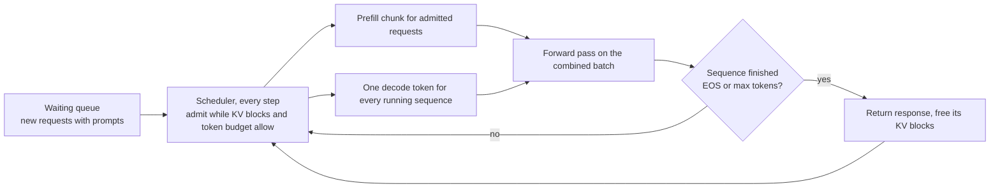
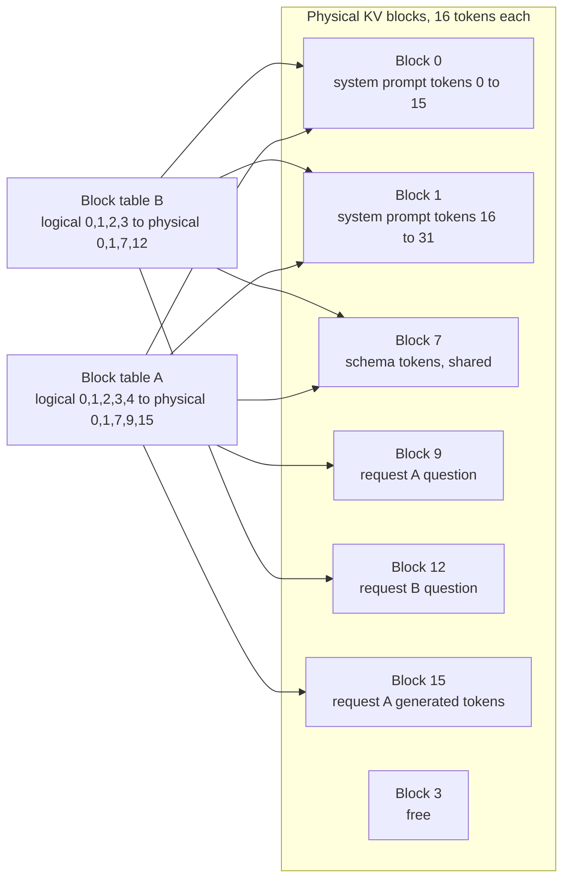
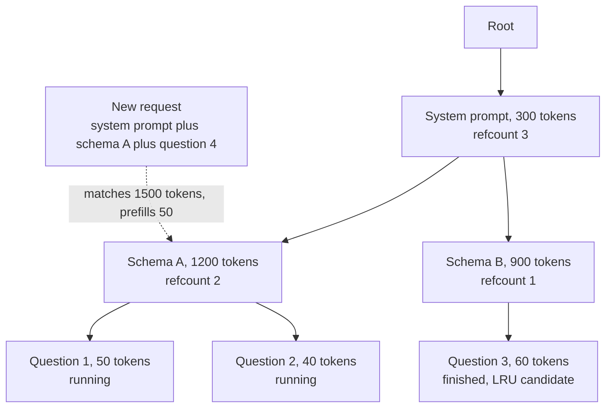
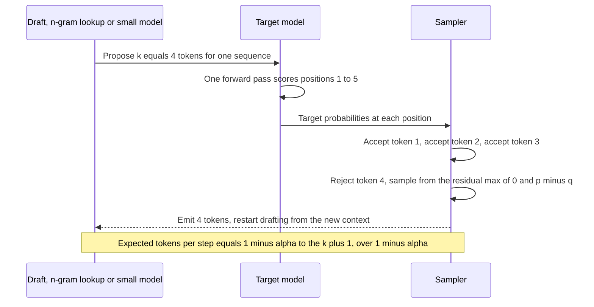
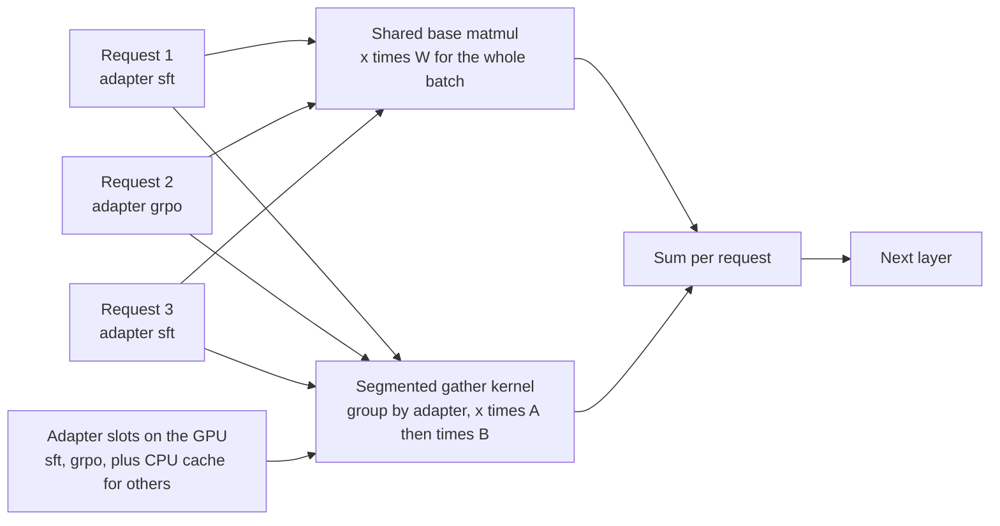
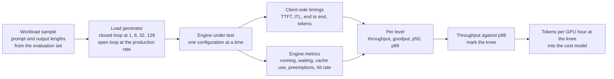

# Chapter 13: Serving Systems

> **What you will be able to do:** explain why decode stays memory-bound and what that implies for batching; trace how continuous batching, PagedAttention, prefix caching, chunked prefill, and speculative decoding each recover wasted GPU time or memory, with the arithmetic for each; size the KV-cache capacity of a GPU for a given model; serve several LoRA adapters from one base; benchmark an engine with the right metrics and find the knee of its throughput-latency curve; compute the volume at which self-hosting beats an API, with the assumptions written down.
> **Where it is used:** P2.2 (vLLM serving and benchmarks), P2.5 (the gateway routes to the engine described here), P3.1 (canary adapters hot-served), P4.3 (serving a vision-language model).
> **Prerequisites:** Chapter 4 (KV-cache formula, roofline), Chapter 12 (quantized weights and KV cache). Chapter 14 deploys what this chapter builds.

## 13.0 The problem this chapter solves

A customer's analysts send about two million text-to-SQL requests a day, each with a 1,500-token prompt (system instructions, schema, a few examples) and a 150-token answer. They have quoted the frontier API's monthly bill and asked whether a fine-tuned 7B on their own GPUs would be cheaper, and at what point. Answering needs three things: an engine that keeps a GPU busy, a benchmark that says how many tokens per second that GPU produces at an acceptable latency, and a cost model that converts the benchmark into dollars per request against the API's price.

The engine is the hard part, and the reason is the roofline. One request decoding one token at a time reads the whole model from memory to do almost no arithmetic. The GPU's tensor cores idle. Every mechanism in this chapter is a way to do more useful work per byte read: batch many requests into each weight read (continuous batching), stop wasting memory so more requests fit (PagedAttention), skip recomputing what many requests share (prefix caching), keep decode latency stable while long prompts arrive (chunked prefill), and spend idle compute to guess ahead (speculative decoding).

Benchmarking these engines is a discipline of its own. Averages hide queueing, fixed prompt lengths flatter caches, and a throughput number without a latency next to it is meaningless to a customer whose analysts wait on the answer. The chapter ends with the metric definitions, the curve to plot, and the break-even calculation that P2.2 asks for.

## 13.1 Prefill versus decode: the roofline argument

Chapter 4 defined arithmetic intensity $I$ as floating-point operations per byte moved from memory and the ridge point $I^* = P / \beta$, with $P$ the peak arithmetic rate and $\beta$ the memory bandwidth. Below the ridge a kernel is memory-bound and its time is bytes divided by bandwidth; above it the kernel is compute-bound. An A100 80 GB has $P \approx 312$ TFLOPS in dense bf16 and $\beta \approx 2.0$ TB/s, so $I^* \approx 156$ FLOPs per byte. The RTX 4060 Laptop GPU lands near the same ratio, about 176 FLOPs per byte (on the order of 45 TFLOPS dense bf16 depending on the power limit, over about 256 GB/s; verify both).

### Prefill

Processing a prompt of $T$ tokens through a model with $N$ parameters costs about $2 N T$ FLOPs and reads the weights once, $2N$ bytes in bf16, plus activations. The intensity is about $T$ FLOPs per byte. A 200-token prompt already exceeds the A100's ridge, so prefill is compute-bound for any realistic prompt. Its time is roughly $2 N T / P_{\text{achieved}}$: for a 7B model and 1,550 tokens, $21.7$ TFLOP, about 110 ms at 200 TFLOPS achieved on an A100 and about 700 ms at 30 TFLOPS achieved on the 4060.

### Decode

One decode step for a batch of $B$ sequences costs $2 N B$ FLOPs (plus attention, which is small for short contexts) and reads the weights once plus every sequence's KV cache:

$$I_{\text{decode}}(B) = \frac{2 N B}{2N + B \, \bar{T} \, m_{kv}}$$

where $\bar{T}$ is the mean context length across the batch and $m_{kv}$ the KV-cache bytes per token (128 KB for Llama-3-8B in bf16, from Chapter 4). Ignoring the cache, $I = B$: decode is memory-bound until the batch reaches the ridge point, about 156 sequences on an A100. With the cache, the intensity saturates at $2N / (\bar{T} m_{kv})$ as $B$ grows. For Llama-3-8B at $\bar{T} = 4096$: $16 \times 10^9 / (4096 \times 131{,}072) \approx 30$ FLOPs per byte, below the ridge at any batch size. Decode with kilobyte-scale contexts never becomes compute-bound on an A100; the KV cache keeps it memory-bound, which is why GQA and KV-cache quantization (Chapter 12) matter as much as weight quantization.

### The step-time model

Because decode is memory-bound, a bandwidth-only model predicts its shape well:

$$t_{\text{step}}(B) \approx \frac{2N + B \, \bar{T} \, m_{kv}}{\beta}, \qquad \text{throughput} = \frac{B}{t_{\text{step}}(B)}$$

Worked example, Llama-3-8B in bf16 (16.06 GB of weights) on an A100 at 2.0 TB/s with $\bar{T} = 2048$ (268 MB of cache per sequence). This is a model, not a measurement; real engines reach 60 to 80 percent of it.

| Batch $B$ | KV cache read | Step time | Aggregate tokens per second | Per-user tokens per second |
|---|---|---|---|---|
| 1 | 0.27 GB | 8.2 ms | 122 | 122 |
| 8 | 2.1 GB | 9.1 ms | 880 | 110 |
| 32 | 8.6 GB | 12.3 ms | 2,600 | 81 |
| 64 | 17.2 GB | 16.6 ms | 3,850 | 60 |
| 128 | 34.4 GB | 25.2 ms | 5,080 | 40 |
| 200 | 53.6 GB | 34.8 ms | 5,750 | 29 |

From 1 to 32 the step time grows 50 percent while throughput grows 21-fold: the weight read is amortized across the batch. Beyond 64 the cache read dominates and throughput flattens while per-user speed falls. At 200 the cache fills the 54 GB left after weights (section 13.3). This table is the throughput-latency curve of section 13.11 in its simplest form, and its bend is the knee.

## 13.2 Static versus continuous batching

Static batching collects $B$ requests, runs them together, and returns when the longest finishes. A short answer sits in the batch doing nothing while the long one completes, and arrivals wait for the next batch. Continuous batching, introduced as iteration-level scheduling by Orca (Yu et al., 2022), rebuilds the batch at every decode step: finished sequences leave, waiting sequences join, and a new arrival's prefill runs alongside the others' decode.

### Timeline

Four slots. Requests A, B, C, D arrive at step 1 with output lengths 3, 7, 2, and 5; E (4 tokens) arrives at step 3, F (3) at step 4, G (3) at step 6. Each cell is the request occupying that slot at that step.

| Step | 1 | 2 | 3 | 4 | 5 | 6 | 7 | 8 | 9 | 10 | 11 |
|---|---|---|---|---|---|---|---|---|---|---|---|
| Static, slot 1 | A | A | A | . | . | . | . | E | E | E | E |
| Static, slot 2 | B | B | B | B | B | B | B | F | F | F | . |
| Static, slot 3 | C | C | . | . | . | . | . | G | G | G | . |
| Static, slot 4 | D | D | D | D | D | . | . | . | . | . | . |
| Continuous, slot 1 | A | A | A | F | F | F | . | . | | | |
| Continuous, slot 2 | B | B | B | B | B | B | B | . | | | |
| Continuous, slot 3 | C | C | E | E | E | E | . | . | | | |
| Continuous, slot 4 | D | D | D | D | D | G | G | G | | | |

Static batching finishes at step 11 and uses 27 of 44 slot-steps (61 percent). Continuous batching finishes at step 8 and uses 27 of 32 (84 percent); E, F, and G start the step after they arrive instead of waiting for the batch to drain. Prefill for arrivals is folded into the step here for simplicity; section 13.5 shows how engines handle it.



*Figure 13.1: Continuous batching: the scheduler rebuilds the batch at every step, mixing prefill chunks for new arrivals with one decode token for every running sequence.*

The cost of continuous batching is a scheduler decision per step and a batch whose shape changes every step, which the attention kernel must handle without padding. Orca's selective batching and vLLM's PagedAttention kernel both solve this by treating the batch as a flat list of tokens with per-sequence metadata rather than a padded tensor.

## 13.3 PagedAttention

Continuous batching needs memory for as many sequences as possible, and the KV cache is where the memory goes. Before PagedAttention (Kwon et al., 2023), engines reserved a contiguous region per request sized for the maximum length, because attention kernels expected each sequence's keys and values contiguous. The paper measured 60 to 80 percent of cache memory wasted in such systems: reserved but never used (internal fragmentation), or free but in pieces too small to reuse (external fragmentation).

### Blocks and block tables

PagedAttention borrows virtual memory. The cache is divided into fixed-size physical blocks, each holding the keys and values of a fixed number of tokens (16 in vLLM's default; check your version). Each sequence has a block table mapping its logical block index to a physical block. Blocks are allocated when a sequence needs them, one at a time as it generates. The attention kernel reads the block table and gathers keys and values from wherever they sit.

Block bytes for Llama-3-8B: $16 \times 128$ KB $= 2$ MB. A 4k-token context is 256 blocks. Internal fragmentation is at most one partially filled block per sequence, under 0.4 percent of a 4k context; external fragmentation is zero because every block is the same size.



*Figure 13.2: Block tables map each sequence's logical blocks to physical blocks; two requests share the physical blocks of their identical prefix and diverge at their own question.*

### Worked memory example

An A100 80 GB serving Llama-3-8B in bf16 with `gpu_memory_utilization` 0.9 (check your version for the flag name): budget $72$ GB; weights $16.06$ GB; activations, CUDA graphs, and the engine's working set about $2$ GB; remaining for cache about $54$ GB. At 2 MB per block that is about 25,700 blocks, or 411k tokens: 100 concurrent sequences at 4k context, or 50 at 8k, or 400 at 1k. The pre-paging alternative reserving `max_model_len` of 8k per sequence would fit only 50 sequences of any length, and a sequence that used 500 tokens would waste 96 percent of its reservation.

### Copy-on-write

Parallel sampling ($n$ samples per prompt) and beam search share a prompt. With paging the samples share the prompt's physical blocks, and the block table records a reference count. When a sample writes into a shared block (the last, partially filled prompt block, as each sample appends its own first token), the engine copies that one block and updates the sample's table. Four samples of a 1,500-token prompt share $1{,}488$ tokens of cache: $3 \times 1{,}488 \times 128$ KB $\approx 570$ MB saved against four independent copies, and the copy-on-write costs one 2 MB block per sample.

## 13.4 Prefix caching and RadixAttention

Blocks make sharing across requests natural. If two requests begin with the same tokens, the keys and values of their identical leading blocks are identical, so one request's blocks can serve the other. This is prefix caching: the engine keeps blocks of finished requests around, indexed by content, and a new request that matches skips their prefill.

### Mechanism in vLLM

Each full block is keyed by a hash of its token ids together with the hash of the preceding block, so the key identifies the whole prefix up to and including that block. On arrival, the scheduler walks the prompt block by block, looks up each hash, and marks matched blocks as computed; prefill runs only from the first miss. Only full blocks are cacheable, so the last partial block of a shared prefix is always recomputed. Eviction is least-recently-used over blocks whose reference count has dropped to zero. The flag is `--enable-prefix-caching` (default on in recent versions; check your version).

Worked example: a 1,550-token prompt whose first 1,500 tokens (system prompt and schema) are shared with earlier requests, block size 16. $\lfloor 1500 / 16 \rfloor = 93$ full blocks, 1,488 tokens, hit the cache; the remaining 62 tokens (12 tokens of schema in the partial block plus the 50-token question) are prefilled. Prefill compute drops 25-fold. On the A100 example above, that moves time to first token from about 110 ms to about 5 ms plus scheduling and queueing; on the 4060 with a 1.5B model, from about 160 ms to about 10 ms.

### What prompt structure maximizes hits

The prefix must be byte-identical after tokenization. Put the stable content first (system prompt, schema, few-shot examples) and the request-specific content last (the question). Nothing that varies per request may appear before the variable part: no timestamps, request identifiers, user names, or randomly ordered examples. Multi-turn conversations must be append-only, so the earlier turns hash the same way each time. A chat template that inserts a date or a different whitespace pattern silently kills every hit; verify with the engine's cache-hit metric (vLLM exposes prefix-cache hit rate in its Prometheus metrics; check your version). This is the same discipline as prompt caching on frontier APIs, which Chapter 16 covers at the gateway.

### RadixAttention

SGLang (Zheng et al., 2023) keeps the shared prefixes in a radix tree over token sequences: each edge is a run of tokens, each node points at the KV blocks for its path, and a request's prompt is matched by walking from the root. The tree makes three things easy that a flat hash table makes awkward: partial matches at any token boundary, eviction of the least recently used leaves while their ancestors stay, and cache-aware scheduling that sorts waiting requests by matched prefix length so requests sharing a long prefix run back to back before the blocks are evicted. For workloads with deep sharing (few-shot prompts, multi-turn agents, tree search over candidates) the hit rate is measurably higher than first-come-first-served scheduling with a hash table. vLLM's block hashing is equivalent in what it can share; the difference is in eviction and scheduling.



*Figure 13.3: A radix tree of shared prefixes: a new request walks the tree, reuses the KV blocks along its matched path, and prefills only its own question.*

## 13.5 Chunked prefill and scheduling policies

A 6,000-token prompt arriving at a busy engine used to stall every running sequence: its prefill is one large compute-bound operation, and while it runs no decode step happens, so every user sees a pause of hundreds of milliseconds. Chunked prefill (Agrawal et al., 2023, SARATHI, and its successor Sarathi-Serve, 2024) splits the prompt into chunks of a fixed token budget and runs one chunk per step alongside the decode tokens of running sequences.

Mechanism: the scheduler has a per-step token budget (`max_num_batched_tokens`, commonly 2,048 to 8,192; check your version). Decode requests are admitted first, one token each. The remaining budget goes to prefill, taking as much of the next waiting prompt as fits. A 6,000-token prompt with a 2,048 budget and 64 running decodes gets chunks of 1,984 tokens over three steps, then a fourth step for the remainder. The running users see three slightly slower steps instead of one long stall; the long request's time to first token rises a little because its prefill is spread out. The chunk size is the knob: small chunks protect time per output token, large chunks protect time to first token and prefill throughput.

Other scheduling decisions that matter in practice. Admission is first-come-first-served by default; some engines offer priority scheduling (check your version). `max_num_seqs` caps the number of running sequences. When KV blocks run out, the engine preempts: vLLM drops a sequence's blocks and recomputes them later, or swaps them to CPU memory (check your version for which is active). Frequent preemption shows up as a jump in time per output token and a preemption counter in the metrics; the fix is fewer sequences, shorter `max_model_len`, or a quantized cache. Disaggregated serving (DistServe, Zhong et al., 2024; Splitwise, Patel et al., 2024) runs prefill and decode on separate GPU pools and ships the KV cache between them, decoupling the two latencies at the cost of interconnect traffic and operational complexity; know that it exists and that vLLM has an implementation, and do not reach for it below multi-node scale.

## 13.6 Speculative decoding

Decode leaves the tensor cores idle. Speculative decoding (Leviathan, Kalman, and Matias, 2023; Chen et al., 2023) spends that idle compute: a cheap draft proposes $k$ tokens, the target model scores all $k$ positions plus one in a single forward pass, and a rejection-sampling rule accepts a prefix of the draft while guaranteeing that the accepted tokens are distributed exactly as if the target had sampled them one by one.

### The algorithm

Let $p(\cdot \mid x)$ be the target's next-token distribution and $q(\cdot \mid x)$ the draft's.

1. The draft samples $\tilde{x}_1 \sim q(\cdot \mid x)$, then $\tilde{x}_2 \sim q(\cdot \mid x, \tilde{x}_1)$, and so on for $k$ tokens.
2. The target runs one forward pass on $x, \tilde{x}_1, \ldots, \tilde{x}_k$, producing $p(\cdot \mid x, \tilde{x}_{<i})$ for every $i = 1, \ldots, k + 1$ at once.
3. For $i = 1, \ldots, k$: accept $\tilde{x}_i$ with probability $\min\!\left(1, \frac{p(\tilde{x}_i)}{q(\tilde{x}_i)}\right)$. On the first rejection at position $i$, sample a replacement from the residual distribution $\mathrm{norm}\!\left(\max(0, p - q)\right)$ and stop.
4. If all $k$ are accepted, sample one bonus token from $p(\cdot \mid x, \tilde{x}_{1..k})$, which the forward pass already produced.

Every step emits between 1 and $k + 1$ tokens for one target forward pass.

### Why the output distribution is exactly the target's

For a single position, the probability that the emitted token is $y$ is the probability the draft proposed $y$ and it was accepted, plus the probability of a rejection followed by drawing $y$ from the residual:

$$P(y) = q(y) \min\!\left(1, \frac{p(y)}{q(y)}\right) + (1 - \alpha) \cdot \frac{\max(0, p(y) - q(y))}{\sum_{y'} \max(0, p(y') - q(y'))}$$

where $\alpha = \sum_{y} \min(p(y), q(y))$ is the acceptance probability. The first term equals $\min(p(y), q(y))$. The normalizer in the second term is $\sum_{y'} \max(0, p - q) = 1 - \sum_{y'} \min(p, q) = 1 - \alpha$, which cancels, leaving $P(y) = \min(p(y), q(y)) + \max(0, p(y) - q(y)) = p(y)$. With greedy decoding the rule reduces to accepting a draft token when it equals the target's argmax.

Toy check: $p = [0.5, 0.3, 0.2]$, $q = [0.3, 0.5, 0.2]$. Acceptance probabilities per token $[1, 0.6, 1]$, $\alpha = 0.3 + 0.3 + 0.2 = 0.8$, residual $[1, 0, 0]$. Emitted distribution: token 1 with $0.3 \times 1 + 0.2 \times 1 = 0.5$, token 2 with $0.5 \times 0.6 = 0.3$, token 3 with $0.2$. Exactly $p$.

### Expected tokens per step

Assume each draft token is accepted independently with probability $\alpha$ (the paper's simplifying assumption; in practice $\alpha$ varies by position). The number of accepted tokens before the first rejection, capped at $k$, plus the one token always emitted (the correction or the bonus), has expectation

$$\mathbb{E}[\text{tokens per step}] = \sum_{i=0}^{k} \alpha^i = \frac{1 - \alpha^{k+1}}{1 - \alpha}$$

Derivation: the step emits at least 1 token; it emits a second if the first draft is accepted (probability $\alpha$), a third if the first two are (probability $\alpha^2$), and so on up to $k + 1$ tokens with probability $\alpha^k$. Summing the indicator expectations gives the geometric series.

Worked example, $\alpha = 0.8$, $k = 4$: $(1 - 0.8^5) / 0.2 = (1 - 0.328) / 0.2 = 3.36$ tokens per target step. With $k = 8$: $(1 - 0.8^9)/0.2 = 4.33$. With $\alpha = 0.5$, $k = 4$: $1.94$.

The speedup also depends on the draft's cost. If a draft token costs a fraction $c$ of a target step, and the target's verification of $k + 1$ positions costs about one step (true while decode is memory-bound), then

$$\text{speedup} \approx \frac{\mathbb{E}[\text{tokens per step}]}{1 + k c}$$

For $\alpha = 0.8$, $c = 0.1$: $k = 4$ gives $3.36 / 1.4 = 2.4$; $k = 8$ gives $4.33 / 1.8 = 2.4$ as well; $k = 5$ or $6$ is slightly better at about $2.46$. Longer drafts stop paying because each extra position is accepted with a shrinking probability $\alpha^i$ while costing the same $c$. For $\alpha = 0.5$ and $c = 0.2$ the speedup is $1.94 / 1.8 = 1.08$: barely worth it.



*Figure 13.4: One speculative step: the draft proposes, the target verifies all positions in one pass, and the sampler accepts a prefix and repairs the first rejection.*

### Drafts

N-gram drafting (prompt lookup decoding, Saxena, 2023) needs no model: take the last $n$ generated tokens, find their most recent occurrence in the prompt plus generated text, and propose the tokens that followed. Text-to-SQL copies table and column names from the schema, so acceptance is high and the draft is free. This is the first thing P2.2 turns on. Small-model drafts need the same tokenizer as the target (Qwen2.5-0.5B drafting for Qwen2.5-7B; never a Llama draft for a Qwen target) and a cost ratio $c$ small enough to pay off; a 0.5B draft for a 7B target has $c \approx 0.07$ by parameter count. Trained draft heads attached to the target (Medusa, Cai et al., 2024; EAGLE, Li et al., 2024) reach higher acceptance at low cost and are what production systems increasingly use; they require a training step per target model.

### When it helps and when it does not

It helps at low batch on structured, low-entropy output (SQL, JSON, code, templated prose), where $\alpha$ is high and the GPU has idle compute. It stops helping when the batch is large: verifying $k + 1$ positions for each of $B$ sequences costs $B(k + 1)$ token-equivalents of compute, and once that crosses the ridge point the verification step is no longer free. On an A100 with $k = 4$, returns diminish above a batch of about 30. It also fails on high-entropy output (open-ended creative text), where $\alpha$ falls and the draft is mostly rejected, and when the draft is too slow ($c$ too large). Always measure the acceptance rate the engine reports on your own workload; a number under 0.6 means speculation is costing you.

## 13.7 Multi-LoRA serving

A LoRA adapter (Chapter 7) changes a linear layer from $y = W x$ to $y = W x + \frac{\alpha}{r} B A x$ with $A \in \mathbb{R}^{r \times d_{\text{in}}}$ and $B \in \mathbb{R}^{d_{\text{out}} \times r}$. The base $W$ is shared. A serving engine can therefore hold one copy of the base and many adapters, apply the base matmul to the whole batch as usual, and add each request's own low-rank term.

### Memory and compute

An adapter of rank 16 on every linear layer of Qwen2.5-7B has about 40 million parameters (per layer: $r(d + d)$ for the query and output projections, $r(d + d_{kv})$ for key and value with $d_{kv} = 512$, and $r(d + d_{\text{ffn}})$ for the three feed-forward matrices; 28 layers), about 80 MB in bf16. Fifty adapters are 4 GB against 15 GB for the base. The extra compute per token per module is $2 r (d_{\text{in}} + d_{\text{out}})$ FLOPs against $2 d_{\text{in}} d_{\text{out}}$ for the base, under 1 percent at rank 16.

### Kernels

The difficulty is that requests in one batch use different adapters, so the low-rank term is not a single matmul. Punica (Chen et al., 2023) introduced a segmented gather matrix-vector kernel (SGMV): requests are grouped by adapter, and one kernel launch computes $x_i A_{a(i)}$ then multiplies by $B_{a(i)}$ for every segment, reading each adapter's weights once per step. S-LoRA (Sheng et al., 2023) added unified paging, storing adapter weights in the same paged memory pool as the KV cache so thousands of adapters can be swapped between GPU and host memory on demand, and heterogeneous batching across ranks. vLLM implements this family: adapters live in a fixed number of GPU slots (`--max-loras`), overflow adapters wait in a CPU cache, and the request's `model` field names the adapter (check your version for flags and for whether adapters can be loaded at runtime through the API).



*Figure 13.5: Multi-LoRA serving: one base matmul for the batch, one segmented kernel for the per-request low-rank terms, adapters resident in GPU slots.*

The overhead is a few percent to about 20 percent of step time depending on batch composition and rank; measure it. The payoff is organizational: P2.2 serves the SFT and GRPO adapters from one 7B base and evaluates each through the same endpoint; Chapter 17 uses the same mechanism to canary a new adapter with a traffic split and no second server.

## 13.8 Tensor and pipeline parallelism

A 70B model in bf16 is 140 GB of weights and does not fit one GPU. Two ways to split it.

**Tensor parallelism (TP)** splits every layer's matrices across $n$ GPUs: attention heads are divided among GPUs, and the feed-forward's first matrix is split by columns and its second by rows, so each GPU computes a slice and the slices are summed. Every layer needs two all-reduce operations per token (after attention and after the feed-forward), each moving a vector of size $d$ in bf16. Communication bytes per GPU per token are about

$$2 \cdot L \cdot 2 d \cdot \frac{2(n - 1)}{n}$$

For Llama-3-70B ($L = 80$, $d = 8192$) at $n = 4$: about 3.9 MB per token per GPU, trivial in bandwidth (at 2,000 tokens per second that is 8 GB/s against NVLink's 600 GB/s on an A100). The cost is latency: 160 collective operations per token. At about 20 microseconds each over NVLink that is 3.2 ms, against about 17.5 ms for each GPU to read its 35 GB weight shard at 2 TB/s, an 18 percent tax. Over PCIe at 50 to 100 microseconds per operation the tax approaches 100 percent, which is why TP across PCIe-only GPUs disappoints and why a 70B deployment is quoted as a 4- or 8-GPU NVLink node. TP degree should divide the number of KV heads (8 for Llama-3-70B).

**Pipeline parallelism (PP)** places different layers on different GPUs. A token passes through the stages in sequence, so per-token latency includes every stage plus the transfers between them, and throughput depends on keeping every stage busy with different requests' micro-batches. With $p$ stages and $m$ micro-batches in flight the idle fraction is about $(p - 1) / (m + p - 1)$. PP needs little bandwidth (one activation vector per token between adjacent stages), so it is used across nodes, with TP inside each node. For inference at moderate scale the default is TP within one node; PP appears when a model spans nodes or when the interconnect is weak.

Sizing rule: weights in bf16 must fit with at least 30 to 40 percent left for the KV cache. Llama-3-70B: 140 GB of weights wants four 80 GB GPUs (TP 4, 35 GB each, 45 GB for cache each) or two at FP8 (70 GB, TP 2, tight). Chapter 12's quantization moves these thresholds.

## 13.9 Engines compared

| Engine | Batching and memory | Prefix caching | Quantization | Speculation | LoRA | API | Use it for |
|---|---|---|---|---|---|---|---|
| vLLM | continuous, PagedAttention, chunked prefill | block hashing | AWQ, GPTQ, FP8, GGUF (partial), bitsandbytes | n-gram, draft model, EAGLE-style heads | multi-LoRA with SGMV-class kernels | OpenAI-compatible | the default production engine; P2.2 |
| SGLang | continuous, paged | RadixAttention tree with cache-aware scheduling | AWQ, GPTQ, FP8 | draft model, EAGLE | yes | OpenAI-compatible | multi-turn and agentic workloads with deep prefix sharing; constrained decoding |
| TGI (Hugging Face) | continuous, paged | yes | GPTQ, AWQ, bitsandbytes, FP8 | Medusa, n-gram | yes | its own plus OpenAI-compatible messages | Hub-centric deployments; recognize it at customers |
| TensorRT-LLM | continuous, paged, compiled kernels | yes | FP8, int8 SmoothQuant, int4 AWQ | draft model, Medusa, EAGLE | yes | via Triton Inference Server, OpenAI-compatible frontend | maximum throughput on NVIDIA hardware when an engineer can own the build |
| llama.cpp | batched, contiguous per slot | slot-level prompt cache | GGUF k-quants and I-quants, KV cache types | draft model | yes, at load | OpenAI-compatible server | CPU, Apple silicon, edge, the quantization lab |
| Ollama | llama.cpp underneath | as llama.cpp | GGUF | limited | yes via Modelfile | its own plus OpenAI-compatible | local development and demos |

Feature availability shifts every few months; the table is a map as of mid-2026, verify before quoting it to a customer. The engineering choice for this roadmap is vLLM on CUDA GPUs and llama.cpp everywhere else, with SGLang run once for comparison.

## 13.10 The OpenAI-compatible API

Every engine above exposes HTTP endpoints shaped like the OpenAI API: `/v1/chat/completions` (messages in, a chat completion out), `/v1/completions` (raw prompt), `/v1/models`, and often `/v1/embeddings`. Requests carry `model`, `messages`, `max_tokens`, `temperature`, `stream`, and engine-specific extras. Streaming uses server-sent events: lines beginning `data: ` carrying JSON chunks, terminated by `data: [DONE]`. The response's `usage` object reports `prompt_tokens` and `completion_tokens`, and some engines add cached-token counts.

Three consequences. A client written against the API works against vLLM, SGLang, the frontier API, or a llama.cpp server by changing the base URL and key, which is what makes the routing in Chapter 16 a configuration change rather than a rewrite. In multi-LoRA serving the `model` field selects the adapter, so a canary is a different string in the same request. And the same benchmark harness measures every backend, which keeps comparisons honest. Constrained decoding (a JSON schema or a grammar the output must follow) is offered through engine-specific request fields such as vLLM's guided decoding parameters or the `response_format` object; the field names differ across engines and versions, so check yours.

## 13.11 Benchmarking

### Definitions

For one request with $n_{\text{out}}$ output tokens, first token at time $t_1$ and last at $t_{\text{end}}$, measured from the moment the request was sent:

- **Time to first token (TTFT)** $= t_1$. Queueing plus prefill. Moved by prompt length, prefix-cache hits, chunked-prefill budget, and load.
- **Time per output token (TPOT)** $= \dfrac{t_{\text{end}} - t_1}{n_{\text{out}} - 1}$. The mean decode interval. Moved by batch size, weight bytes, cache bytes, and speculation.
- **Inter-token latency (ITL)**: the distribution of individual decode intervals; its p99 exposes stalls that TPOT averages away (preemption, a long prefill chunk).
- **End-to-end latency** $= t_{\text{end}}$.
- **Throughput**: output tokens per second across all requests; also total tokens per second (input plus output) and requests per second. State which.
- **Goodput** (Zhong et al., 2024): requests per second that meet the service-level objective on both TTFT and TPOT (for example TTFT under 500 ms and TPOT under 50 ms). Throughput can rise while goodput falls, and goodput is what a customer buys.
- **p50 and p99**: the median and the 99th percentile over requests. The p99 of $n$ requests is the $\lceil 0.01 n \rceil$-th largest value; with 100 requests it is the single worst one. Collect at least 1,000 requests per concurrency level, or report p95 and say so.

### Load generation

Closed-loop load holds $C$ concurrent clients, each sending its next request when the previous returns; it measures the engine's capacity at a fixed batch pressure. Open-loop load sends requests at a rate $\lambda$ regardless of completions (Poisson arrivals); it reveals queueing when the engine falls behind and is closer to production. Run both: closed-loop at $C = 1, 8, 32, 128$ for the capacity curve, open-loop at the expected production rate for the latency distribution.

Prompt and output lengths must be sampled from your evaluation set, not fixed. Fixed prompts share their entire content and turn every request into a prefix-cache hit, which flatters TTFT by an order of magnitude; fixed outputs hide the long tail that dominates p99. Warm the engine (CUDA graphs, cache) with a minute of traffic before recording, run each level for several minutes, and record the engine's own metrics (running sequences, waiting queue, cache usage, preemptions, cache hit rate) alongside client-side timings. Tools: `vllm bench serve` (the successor to the `benchmark_serving.py` script; check your version), Locust for open-loop and custom metrics (Listing 13.4), and NVIDIA's GenAI-Perf.

### The throughput-latency curve and the knee

Plot aggregate throughput against p99 TPOT (or p99 end-to-end latency) with one point per concurrency level. In the memory-bound region each added sequence costs little step time, so throughput climbs steeply and latency barely moves. As the KV-cache read grows and the batch approaches the memory or compute limit, throughput flattens; when requests begin to wait for KV blocks or a slot, p99 latency climbs steeply with almost no throughput gain. The knee is the last point before that climb. Size deployments for the knee, not the maximum: beyond it you pay in latency for tokens you barely gain.

Illustrative shape from the section 13.1 model of Llama-3-8B on an A100 (a bandwidth model with a 25 percent efficiency haircut, not a measurement; your P2.2 numbers replace it):

| Concurrency | Throughput, output tokens per second | p99 TPOT | Reading |
|---|---|---|---|
| 1 | about 90 | 11 ms | idle GPU |
| 8 | about 660 | 13 ms | steep climb |
| 32 | about 1,950 | 17 ms | still cheap |
| 64 | about 2,900 | 23 ms | the knee |
| 128 | about 3,800 | 40 ms | latency doubling for 30 percent more tokens |
| 256 | about 3,900 | 120 ms and rising | KV cache full, preemption, queueing |



*Figure 13.6: The benchmark pipeline: realistic lengths, two load modes, client and engine metrics, one curve per configuration, and the knee feeding the cost model.*

## 13.12 The cost model

### Formulas

Let $c_{\text{gpu}}$ be the GPU's hourly price, $u$ the utilization (the fraction of each hour the GPU produces tokens at the knee's rate), $R_{\text{out}}$ the aggregate output tokens per second at the knee, and $n_{\text{in}}, n_{\text{out}}$ the tokens per request.

$$\text{cost per million output tokens} = \frac{c_{\text{gpu}}}{R_{\text{out}} \cdot 3600 \cdot u} \times 10^6$$

$$\text{requests per hour} = \frac{R_{\text{out}}}{n_{\text{out}}} \cdot 3600 \cdot u, \qquad \text{cost per request} = \frac{c_{\text{gpu}}}{\text{requests per hour}}$$

$$\text{API cost per request} = n_{\text{in}} \, p_{\text{in}} + n_{\text{out}} \, p_{\text{out}}$$

with $p_{\text{in}}, p_{\text{out}}$ the API prices per token. The break-even daily volume is where the GPU's fixed daily cost equals the API bill for the same requests:

$$V^* = \frac{24 \, c_{\text{gpu}} + c_{\text{ops}} / 30}{n_{\text{in}} \, p_{\text{in}} + n_{\text{out}} \, p_{\text{out}}}$$

where $c_{\text{ops}}$ is the monthly operational cost you assign (someone runs the GPU). Below $V^*$ the API is cheaper; above it the GPU is, up to the GPU's capacity of requests per hour times 24.

### Worked example

Assumptions, all to be replaced by your measurements and current prices. GPU: RunPod Community Cloud A100 80 GB at $1.39 per hour (September 2026; verify). Knee: $R_{\text{out}} = 1{,}400$ output tokens per second for a 7B AWQ model with prefix caching on the customer's 1,500-in, 150-out workload. Utilization $u = 0.6$. Operational cost zero for the first pass. API prices are placeholders marked assumed: a frontier-class model at $3.00 per million input tokens and $15.00 per million output tokens (assumed), and a small hosted model at $0.15 and $0.60 (assumed).

Self-hosted: $9.33$ requests per second at the knee; $20{,}160$ requests per hour at 60 percent utilization; cost per request $1.39 / 20{,}160 = \$0.000069$, or $\$0.069$ per thousand requests; $\$0.46$ per million output tokens. Capacity: about $484{,}000$ requests per day.

API, frontier assumed: $1{,}500 \times 3.00 / 10^6 + 150 \times 15.00 / 10^6 = \$0.00675$ per request, $\$6.75$ per thousand. Break-even: $24 \times 1.39 / 0.00675 = 4{,}942$ requests per day, about 7.4 million input tokens per day. Above that, one A100 is cheaper, and at the customer's two million requests per day the GPU route costs about $\$140$ per day against about $\$13{,}500$ for the API, assuming five GPUs to carry the volume and equal measured quality.

API, small model assumed: $\$0.000315$ per request. Break-even $105{,}900$ requests per day. The customer's volume still exceeds it, but the margin is thin enough that utilization decides.

### Sensitivity to utilization

Cost per request scales as $1 / u$:

| Utilization | Cost per thousand requests |
|---|---|
| 20 percent | $0.207 |
| 40 percent | $0.103 |
| 60 percent | $0.069 |
| 80 percent | $0.052 |
| 100 percent | $0.041 |

A GPU that is busy for eight office hours a day and idle otherwise runs near 30 percent utilization and costs twice the 60 percent figure. Bursty traffic argues for scale-to-zero serverless (Modal, in P2.2) where the fixed-cost assumption changes to per-second billing plus a cold start of minutes, or for batching offline work into the idle hours. Utilization is the assumption that moves the answer most; write it at the top of the spreadsheet.

### What the model leaves out

Quality equivalence (the comparison is only fair if the 7B matches the API on your evaluation set with a paired interval); operational cost (on-call, upgrades, monitoring, which you should price as a fraction of an engineer); failure and redundancy (a second GPU for availability doubles the fixed cost); input-heavy workloads (prefill is compute-bound and the knee shifts); and price movements (API prices have fallen repeatedly, and GPU rental prices vary by provider and week). State each as an assumption on the sheet.

## 13.13 Serving vision-language models

A vision-language model (Chapter 23) encodes each image with a vision transformer, projects the patch embeddings into the language model's embedding space, and inserts them into the prompt as image tokens. Serving differences follow from that. The image tokens land in the prefill, so a document page that becomes a thousand tokens costs as much prefill as a thousand-token text prompt plus the vision encoder's own forward pass; the workload is prefill-heavy and the knee moves toward compute. Requests carry image bytes (base64 or a URL), which raises request size and gateway timeouts. Prefix caching helps only if the same image recurs; engines cache encoder outputs for repeated images (check your version). vLLM and SGLang serve the common VLM families through the same chat endpoint, with images in the `content` array. Cost per page follows the same model as text: image tokens times prefill cost plus output tokens times decode cost.

## 13.14 Implementation notes

**Listing 13.1: vLLM launch flags that matter (vLLM 0.6 to 0.10 era; every flag is check your version).**

```bash
vllm serve Qwen/Qwen2.5-7B-Instruct-AWQ \
  --quantization awq \
  --dtype half \
  --max-model-len 4096 \
  --gpu-memory-utilization 0.90 \
  --max-num-seqs 64 \
  --max-num-batched-tokens 2048 \
  --enable-prefix-caching \
  --enable-chunked-prefill \
  --kv-cache-dtype fp8 \
  --enable-lora --max-loras 2 --max-lora-rank 16 \
  --lora-modules sft=/models/adapters/sft grpo=/models/adapters/grpo \
  --speculative-config '{"method": "ngram", "num_speculative_tokens": 4, "prompt_lookup_max": 4}' \
  --served-model-name text2sql \
  --port 8000
```

`--gpu-memory-utilization` is the fraction of VRAM the engine may claim for weights plus cache; on the 4060 set it to 0.90 or above, and lower it on a shared GPU or when a draft model needs room. `--max-model-len` caps prompt plus output and directly sets how many sequences fit: halve it and the cache holds twice as many. `--max-num-batched-tokens` is the chunked-prefill budget per step. `--kv-cache-dtype fp8` halves cache bytes on Ada and Hopper (Chapter 12). The LoRA flags pin two adapter slots and name them; the request's `model` field then selects `sft` or `grpo`. The speculative configuration's shape changed between versions (older releases used `--speculative-model [ngram] --num-speculative-tokens 4 --ngram-prompt-lookup-max 4`), which is why this listing is marked so heavily. Add `--enforce-eager` if CUDA graph capture runs out of memory on 8 GB, at a cost in decode speed.

**Listing 13.2: KV-cache capacity for a GPU and model.**

```python
def kv_bytes_per_token(n_layers: int, n_kv_heads: int, head_dim: int, dtype_bytes: int = 2) -> int:
    return 2 * n_layers * n_kv_heads * head_dim * dtype_bytes   # keys and values

def kv_capacity(gpu_bytes: float, utilization: float, weight_bytes: float,
                overhead_bytes: float, per_token: int, block_tokens: int = 16):
    budget = gpu_bytes * utilization - weight_bytes - overhead_bytes
    if budget <= 0:
        raise ValueError("weights do not fit at this utilization")
    blocks = int(budget // (per_token * block_tokens))
    return blocks, blocks * block_tokens, budget

# A100 80 GB, Llama-3-8B bf16
per_tok = kv_bytes_per_token(32, 8, 128)                      # 131072 bytes
blocks, tokens, budget = kv_capacity(80e9, 0.90, 8.03e9 * 2, 2e9, per_tok)
print(blocks, tokens, tokens // 4096)                          # about 25700, 411k, 100 sequences at 4k

# RTX 4060, Qwen2.5-7B AWQ (5.6 GB including bf16 embeddings), fp8 cache
per_tok = kv_bytes_per_token(28, 4, 128, dtype_bytes=1)       # 28672 bytes
blocks, tokens, budget = kv_capacity(8e9, 0.92, 5.6e9, 0.6e9, per_tok)
print(blocks, tokens, tokens // 4096)                          # about 2500, 40k, 9 sequences at 4k
```

The overhead term covers the CUDA context, activations for the largest batch, and CUDA graph memory; 2 GB is a reasonable first guess on an 80 GB card and 0.6 GB on the 4060, and the engine's startup log prints the true number of blocks it allocated, which you should compare against this estimate. The block count, not the token count, is what the engine allocates, so a `max_model_len` that is not a multiple of the block size wastes the remainder of one block per sequence.

**Listing 13.3: The speculative verification step for one sequence.**

```python
import torch

def verify_draft(p: torch.Tensor, q: torch.Tensor, draft: torch.Tensor):
    """p: [k+1, V] target probabilities at each drafted position (last row is the bonus position).
    q: [k, V] draft probabilities. draft: [k] drafted token ids.
    Returns the accepted tokens followed by one correction or bonus token."""
    k = draft.shape[0]
    out = []
    for i in range(k):
        t = draft[i]
        accept_prob = torch.clamp(p[i, t] / q[i, t], max=1.0)
        if torch.rand(()) < accept_prob:
            out.append(t)
            continue
        residual = torch.clamp(p[i] - q[i], min=0.0)
        residual = residual / residual.sum()
        out.append(torch.multinomial(residual, 1)[0])
        return torch.stack(out)                                 # stop at the first rejection
    out.append(torch.multinomial(p[k], 1)[0])                   # all accepted: bonus token
    return torch.stack(out)
```

The two branches implement the rule of section 13.6 exactly: acceptance with probability $\min(1, p/q)$, and on rejection a sample from the normalized positive part of $p - q$ at the same position. The bonus token comes from the target distribution at position $k + 1$, which the single verification pass computed anyway. A production kernel does this for a whole batch without a Python loop, and for greedy decoding replaces the sampling with an equality check against the argmax. Running this function a few hundred thousand times with the toy distributions from section 13.6 and histogramming the first emitted token reproduces $p$ to sampling noise, which is a useful unit test for anyone modifying a speculative decoder.

**Listing 13.4: A Locust load test measuring TTFT and TPOT from a streaming endpoint (Locust 2.x; check your version).**

```python
import json, random, time
from locust import HttpUser, task, events

SAMPLES = json.load(open("workload_sample.json"))   # list of {"prompt": str, "max_tokens": int} from the eval set

class LLMUser(HttpUser):
    @task
    def chat(self):
        s = random.choice(SAMPLES)
        body = {"model": "text2sql", "messages": [{"role": "user", "content": s["prompt"]}],
                "max_tokens": s["max_tokens"], "temperature": 0, "stream": True}
        t0 = time.perf_counter(); first = None; n_chunks = 0
        with self.client.post("/v1/chat/completions", json=body, stream=True,
                              catch_response=True, name="chat") as r:
            for line in r.iter_lines():
                if not line or not line.startswith(b"data:"):
                    continue
                if line.strip() == b"data: [DONE]":
                    break
                if first is None:
                    first = time.perf_counter()
                n_chunks += 1
        t_end = time.perf_counter()
        if first is None:
            return
        ttft_ms = (first - t0) * 1000
        tpot_ms = (t_end - first) / max(n_chunks - 1, 1) * 1000
        events.request.fire(request_type="LLM", name="ttft_ms", response_time=ttft_ms,
                            response_length=0, exception=None, context={})
        events.request.fire(request_type="LLM", name="tpot_ms", response_time=tpot_ms,
                            response_length=n_chunks, exception=None, context={})
```

Locust's built-in `response_time` for the `chat` request is end-to-end latency; the two extra `events.request.fire` calls register TTFT and TPOT as separate named metrics so Locust's percentile report shows them side by side. Counting SSE chunks approximates output tokens (a chunk normally carries one token; a first chunk with only the role and empty chunks add small errors), so read `usage.completion_tokens` from the final chunk if the engine includes it. Run closed-loop by fixing the user count and open-loop with Locust's constant-throughput wait time or a custom load shape. Keep the sample file small enough to load per user, and draw prompts from it at random so prefix-cache hits reflect the real mix.

**Listing 13.5: The cost model as a function.**

```python
from dataclasses import dataclass

@dataclass
class Serving:
    gpu_price_per_hour: float       # 1.39 for a RunPod Community A100 80 GB, September 2026; verify
    utilization: float              # fraction of each hour spent producing tokens at the knee
    out_tokens_per_s_at_knee: float # aggregate, from the benchmark
    in_tokens_per_request: float
    out_tokens_per_request: float
    ops_cost_per_month: float = 0.0 # engineer time, monitoring; state it

def requests_per_hour(s: Serving) -> float:
    return s.out_tokens_per_s_at_knee / s.out_tokens_per_request * 3600 * s.utilization

def self_hosted_cost_per_request(s: Serving) -> float:
    hourly = s.gpu_price_per_hour + s.ops_cost_per_month / (30 * 24)
    return hourly / requests_per_hour(s)

def api_cost_per_request(s: Serving, price_in_per_m: float, price_out_per_m: float) -> float:
    return (s.in_tokens_per_request * price_in_per_m + s.out_tokens_per_request * price_out_per_m) / 1e6

def break_even_requests_per_day(s: Serving, price_in_per_m: float, price_out_per_m: float) -> float:
    daily_fixed = s.gpu_price_per_hour * 24 + s.ops_cost_per_month / 30
    return daily_fixed / api_cost_per_request(s, price_in_per_m, price_out_per_m)

def cost_per_million_output_tokens(s: Serving) -> float:
    return s.gpu_price_per_hour / (s.out_tokens_per_s_at_knee * 3600 * s.utilization) * 1e6

s = Serving(1.39, 0.6, 1400, 1500, 150)
print(round(self_hosted_cost_per_request(s) * 1000, 3))        # 0.069 dollars per thousand requests
print(round(break_even_requests_per_day(s, 3.0, 15.0)))        # 4942 with the assumed frontier prices
print(round(cost_per_million_output_tokens(s), 2))             # 0.46
```

Every input is a named field so the assumptions are visible in the call, and the API prices are arguments rather than constants so the sheet can be rerun when prices move. `ops_cost_per_month` defaults to zero to reproduce the worked example; set it to a real fraction of an engineer's cost before showing a customer. The functions return dollars; multiply by a thousand for the per-thousand figures that read well in a memo.

## 13.15 Failure modes

| Symptom | Likely cause | How to confirm | Fix |
|---|---|---|---|
| Engine starts, then out of memory on the first requests | `gpu_memory_utilization` too high for activations and CUDA graphs, or a draft model sharing the GPU | Startup log shows blocks allocated; failure appears at first batch | Lower utilization by 0.05, shorten `max_model_len`, add `--enforce-eager`, give the draft its own budget |
| Throughput flat while p99 latency climbs at higher concurrency | KV cache full: preemption and queueing | Engine metrics show waiting requests and a preemption counter rising | Operate at the knee; FP8 KV cache; shorter `max_model_len`; a second replica |
| TTFT for short prompts spikes when long prompts arrive | Prefill of long prompts not chunked, or chunk budget too large | ITL p99 jumps coincide with long-prompt arrivals | Enable chunked prefill; lower `max_num_batched_tokens` |
| Prefix-cache hit rate near zero on a shared-schema workload | Prefix not byte-identical: timestamps, IDs, or a template quirk before the schema | Tokenize two prompts and diff the leading tokens; watch the hit-rate metric | Move volatile content after the schema; fix the template; verify hits |
| Speculative decoding slows the engine down | Low acceptance rate, large batch, or a draft that is too costly | Engine reports acceptance rate under 0.6; batch above about 30 | Turn it off at high concurrency; use n-gram drafting for structured output; smaller draft |
| Adapter requests return base-model quality | Wrong `model` name, adapter not loaded, or merged weights served instead of an adapter | `/v1/models` lists the adapters; evalkit run against each name | Fix the name; check `--lora-modules`; confirm rank within `--max-lora-rank` |
| Benchmark TTFT looks ten times better than production | Fixed prompts turned every request into a cache hit | Compare hit rate between benchmark and production traffic | Sample lengths and content from the evaluation set |
| p99 unstable between runs | Too few requests per level; laptop thermal throttling | p99 with 100 requests is the maximum; GPU clock drops mid-run | 1,000 or more requests per level; watch clocks; report p95 if you cannot |
| Break-even far lower than expected | Utilization assumed at 100 percent, or API price stale | Read the assumptions block | Use measured utilization; refresh prices; add operational cost |
| Multi-GPU TP model slower than expected | PCIe interconnect; TP degree not dividing KV heads | Profile shows time in all-reduce; startup warning about head divisibility | NVLink node; choose TP among 1, 2, 4, 8 that divides KV heads |

## 13.16 On your machine

The RTX 4060 Laptop GPU (8 GB, about 256 GB/s, verify) is the development machine for P2.2; the A100 is where the write-up's numbers come from.

Qwen2.5-1.5B in bf16 on the 4060: weights 3.1 GB. With `gpu_memory_utilization` 0.85 and about 0.6 GB of overhead, about 3.1 GB remains for the cache; at 28 KB per token (28 layers, 2 KV heads, head dim 128) that is about 108k tokens, or 26 concurrent 4k sequences, 13 at 8k. Decode bound 93 tokens per second at batch 1; expect 50 to 70. With 16 concurrent users, aggregate throughput near 500 to 700 tokens per second and per-user speed above 30, which is enough to see continuous batching work and to plot a small curve locally. Everything in this chapter except tensor parallelism can be exercised on this configuration.

Qwen2.5-7B AWQ on the 4060: weights 5.6 GB (2.2 GB of it the bf16 embedding and output matrices). With utilization 0.92, about 1.2 GB remains for the cache: about 20k tokens in bf16, 40k at FP8. Set `--max-model-len 4096`; that is four or five concurrent sequences in bf16 and nine at FP8. Decode bound 51 tokens per second; expect 30 to 40 with a Marlin-class kernel. This is a batch-1-to-4 machine for the 7B, which is exactly the regime where speculative decoding pays: n-gram drafting on SQL should show acceptance rates above 0.7 and a visible speedup here, and a much smaller one on the A100 at concurrency 32.

Prefix caching on the 4060: a 1,500-token schema prefix for the 1.5B costs about 4.6 TFLOP to prefill, roughly 150 to 200 ms at the achievable rate; a hit reduces it to the 62-token remainder. Chunked prefill with a 1,024-token budget keeps ITL steady for the other sessions while a new schema prefills over two steps.

Kaggle T4 (16 GB, 320 GB/s, fp16 only, no FP8): the 7B AWQ has about 8 GB of cache room, about 140k tokens in fp16 (no FP8 cache here). Useful as a second speed point for the quantization table, not as a serving benchmark.

Rented A100 80 GB (about $1.39 per hour, September 2026, verify): the P2.2 session. Llama-3-8B or Qwen2.5-7B in bf16 leaves about 54 GB of cache, 100 sequences at 4k. Run the sweep at concurrency 1, 8, 32, 128 for two configurations (with and without prefix caching, or with and without speculation), 1,000 requests per level, about 20 minutes per configuration with warm-up, plus the two-adapter evaluation and the SGLang comparison: three to four hours, about $5 to $6. Set the pod's auto-stop before starting and have Claude Code confirm the pod is stopped when the sweep ends.

## Exercises

1. Compute the expected tokens per step for $\alpha = 0.8$ with $k = 2, 4, 6, 8$. With a draft cost ratio $c = 0.1$, which $k$ gives the best speedup?

<details><summary>Solution</summary>

$\mathbb{E} = (1 - 0.8^{k+1}) / 0.2$: $k = 2$: $2.44$; $k = 4$: $3.36$; $k = 6$: $3.95$; $k = 8$: $4.33$.

Speedup $= \mathbb{E} / (1 + 0.1 k)$: $k = 2$: $2.44 / 1.2 = 2.03$; $k = 4$: $3.36 / 1.4 = 2.40$; $k = 6$: $3.95 / 1.6 = 2.47$; $k = 8$: $4.33 / 1.8 = 2.40$. The optimum is near $k = 6$; beyond it the extra positions are accepted with probability $0.8^7 \approx 0.21$ or less while still costing $c$ each. In practice engines default to 3 to 5 because $\alpha$ falls with position.
</details>

2. Break-even. An H100 rents for $2.89 per hour (RunPod Community Cloud, September 2026, verify). Your knee is 3,500 output tokens per second on a 1,000-in, 200-out workload at 60 percent utilization. The API you would replace charges (assumed) $2.50 per million input tokens and $10.00 per million output tokens. Compute cost per request, API cost per request, break-even requests per day, and the GPU's daily capacity.

<details><summary>Solution</summary>

Requests per second at the knee: $3{,}500 / 200 = 17.5$. Per hour at 60 percent: $17.5 \times 3600 \times 0.6 = 37{,}800$. Cost per request: $2.89 / 37{,}800 = \$0.0000765$, about $\$0.076$ per thousand.

API per request: $1{,}000 \times 2.5 / 10^6 + 200 \times 10 / 10^6 = 0.0025 + 0.002 = \$0.0045$.

Break-even: $24 \times 2.89 / 0.0045 = 15{,}413$ requests per day (about 15 million input tokens per day). Capacity: $37{,}800 \times 24 = 907{,}200$ requests per day. Above 15k requests per day the H100 wins by a factor that reaches $0.0045 / 0.0000765 \approx 59$ at full utilization of the knee.
</details>

3. Size the KV cache for an L4 (24 GB) serving Qwen2.5-7B AWQ (5.6 GB of weights) at utilization 0.9 with 1 GB of overhead, bf16 cache. How many blocks of 16 tokens, how many tokens, how many 4k sequences? Repeat for FP8.

<details><summary>Solution</summary>

Budget: $24 \times 0.9 - 5.6 - 1 = 15.0$ GB. Per token: $2 \times 28 \times 4 \times 128 \times 2 = 57{,}344$ bytes; per block $917{,}504$ bytes. Blocks: $15.0 \times 10^9 / 917{,}504 \approx 16{,}350$; tokens $\approx 261{,}600$; 4k sequences: 63. At FP8: 32,700 blocks, 523k tokens, 127 sequences at 4k. The L4's bandwidth (about 300 GB/s, verify) makes it a low-throughput card despite the roomy cache, so the knee will arrive from step time, not from memory.
</details>

4. Requests A, B, C, D arrive at step 1 with output lengths 2, 6, 3, 5; E (3 tokens) arrives at step 3 and F (2 tokens) at step 4. Four slots. Compute makespan and slot utilization for static and for continuous batching.

<details><summary>Solution</summary>

Static: the first batch runs steps 1 to 6 (B is longest), using $2 + 6 + 3 + 5 = 16$ of 24 slot-steps. E and F start at step 7 and finish at steps 9 and 8, using 5 of 12. Makespan 9, utilization $21 / 36 = 58$ percent.

Continuous: A finishes at step 2 and E takes its slot at step 3 (steps 3, 4, 5); C finishes at step 3 and F takes its slot at step 4 (steps 4, 5); D finishes at step 5; B finishes at step 6. Makespan 6, utilization $21 / 24 = 88$ percent. Same work, two thirds of the time, and E and F waited zero steps.
</details>

5. For Llama-3-8B in bf16 on an A100 (ridge point 156 FLOPs per byte), at what batch size does decode become compute-bound when every sequence has a 512-token context? Show that it never does at 4,096 tokens.

<details><summary>Solution</summary>

$I(B) = 2NB / (2N + B T m_{kv})$ with $2N = 16.06 \times 10^9$ (bytes and FLOPs per token both), $m_{kv} = 131{,}072$ bytes.

$T = 512$: per-sequence cache $6.71 \times 10^7$ bytes. Set $I = 156$: $16.06 \times 10^9 B = 156 (16.06 \times 10^9 + 6.71 \times 10^7 B)$, so $(16.06 \times 10^9 - 1.047 \times 10^{10}) B = 2.505 \times 10^{12}$, $B \approx 448$.

$T = 4096$: per-sequence cache $5.37 \times 10^8$ bytes. As $B \to \infty$, $I \to 2N / (T m_{kv}) = 16.06 \times 10^9 / 5.37 \times 10^8 \approx 30 < 156$. The cache read grows as fast as the compute, so the ratio never reaches the ridge. Decode at realistic contexts is memory-bound at every batch size, and the way to make it cheaper is fewer bytes per token of cache (GQA, FP8) rather than more batch.
</details>

6. A prompt has a 1,210-token stable prefix and a 45-token question; block size 16. How many tokens hit the prefix cache, how many are prefilled, and by what factor does prefill compute fall? What changes if the prefix is trimmed to 1,200 tokens?

<details><summary>Solution</summary>

$\lfloor 1210 / 16 \rfloor = 75$ full blocks, 1,200 tokens hit. Prefilled: $1{,}255 - 1{,}200 = 55$ tokens (10 leftover prefix tokens plus the question). Compute falls by $1{,}255 / 55 \approx 23$.

With a 1,200-token prefix, still 75 blocks and 1,200 tokens hit, and 45 tokens are prefilled: a factor of $1{,}245 / 45 \approx 28$. Aligning the stable prefix to a block boundary saves the partial block on every request; padding the system prompt to a multiple of 16 tokens is a cheap trick.
</details>

7. Ten requests report TTFT in ms: 120, 310, 95, 640, 200, 180, 520, 150, 260, 1100, and TPOT in ms: 22, 30, 21, 48, 25, 24, 55, 23, 28, 61. The SLO is TTFT under 500 ms and TPOT under 50 ms. The run lasted 4 seconds. Compute throughput in requests per second and goodput.

<details><summary>Solution</summary>

Throughput: $10 / 4 = 2.5$ requests per second.

Meeting both SLOs: requests 1 (120, 22), 2 (310, 30), 3 (95, 21), 5 (200, 25), 6 (180, 24), 8 (150, 23), 9 (260, 28): seven. Request 4 fails TTFT (640), request 7 fails both, request 10 fails both. Goodput $7 / 4 = 1.75$ requests per second, 70 percent of throughput. Raising concurrency might lift throughput to 3 while pushing more requests over 500 ms and lowering goodput; the knee for this customer is defined by goodput.
</details>

8. Compute the all-reduce bytes per token per GPU for Llama-3-70B ($L = 80$, $d = 8192$, bf16) at TP 4 and TP 8, and the collective count per token. If each collective costs 20 microseconds on NVLink, what fraction of the per-GPU weight-read time (at 2 TB/s) is spent in communication at each degree?

<details><summary>Solution</summary>

Bytes: $2 \times 80 \times 2 \times 8192 \times 2(n - 1)/n$. TP 4: $2.62 \times 10^6 \times 1.5 = 3.9$ MB. TP 8: $2.62 \times 10^6 \times 1.75 = 4.6$ MB. Collectives: $2 \times 80 = 160$ per token at either degree.

Communication time: $160 \times 20\,\mu\text{s} = 3.2$ ms at both degrees (the collective count, not the bytes, dominates at this size).

Weight read per GPU: 140 GB / 4 = 35 GB, 17.5 ms at TP 4; 17.5 GB, 8.75 ms at TP 8. Fraction: $3.2 / 17.5 = 18$ percent at TP 4; $3.2 / 8.75 = 37$ percent at TP 8. Doubling the GPUs halves the read time but not the synchronization, so per-token latency improves less than 2x and per-GPU efficiency falls. Over PCIe at 80 microseconds per collective, communication alone is 12.8 ms, and TP 8 would be slower than TP 4.
</details>

9. Verify by hand that speculative decoding with $p = [0.6, 0.3, 0.1]$ and $q = [0.2, 0.5, 0.3]$ emits tokens distributed as $p$. Report the acceptance probability $\alpha$.

<details><summary>Solution</summary>

Acceptance per token: $\min(1, 0.6/0.2) = 1$, $\min(1, 0.3/0.5) = 0.6$, $\min(1, 0.1/0.3) = 0.333$. $\alpha = \sum \min(p, q) = 0.2 + 0.3 + 0.1 = 0.6$. Residual $\max(0, p - q) = [0.4, 0, 0]$, normalized $[1, 0, 0]$, and its normalizer $0.4 = 1 - \alpha$.

Emitted: token 1 with $0.2 \times 1 + 0.4 \times 1 = 0.6$; token 2 with $0.5 \times 0.6 + 0 = 0.3$; token 3 with $0.3 \times 0.333 + 0 = 0.1$. Equal to $p$. With $\alpha = 0.6$ and $k = 4$ this draft would yield $(1 - 0.6^5)/0.4 = 2.31$ tokens per step: a mediocre draft, since the two distributions disagree on the mode.
</details>

## Summary

- Prefill is compute-bound at any realistic prompt length; decode is memory-bound at every batch size once the KV cache is counted, because cache bytes grow with the batch as fast as the FLOPs do.
- Step time is about $(2N + B \bar{T} m_{kv}) / \beta$: batching amortizes the weight read, and the throughput curve bends where the cache read takes over.
- Continuous batching rebuilds the batch every step; in the worked timeline it cut makespan from 11 steps to 8 and raised slot utilization from 61 to 84 percent.
- PagedAttention stores the KV cache in fixed blocks (16 tokens, 2 MB each for Llama-3-8B) with per-sequence block tables; an A100 with 54 GB of cache holds about 25,700 blocks, 100 sequences at 4k context, with under 0.4 percent fragmentation.
- Prefix caching shares full blocks whose content hashes match; a 1,500-token shared prefix cuts a 1,550-token prefill to 62 tokens, but only if the prefix is byte-identical and comes first. RadixAttention organizes the same sharing as a tree with cache-aware scheduling.
- Chunked prefill spreads a long prompt over several steps under a token budget so running users' decode intervals stay stable.
- Speculative decoding accepts draft token $\tilde{x}$ with probability $\min(1, p/q)$ and repairs the first rejection from $\mathrm{norm}(\max(0, p - q))$, which reproduces the target distribution exactly; expected tokens per step are $(1 - \alpha^{k+1}) / (1 - \alpha)$, 3.36 for $\alpha = 0.8$ and $k = 4$, and the benefit vanishes at large batch or high entropy.
- Multi-LoRA serving runs one base matmul for the batch and a segmented gather kernel for the per-request low-rank terms; an 80 MB adapter selected by the `model` field is how canaries roll out without a second server.
- Tensor parallelism costs 160 collectives per token on an 80-layer model and needs NVLink; pipeline parallelism spans nodes at the cost of per-token latency.
- Report TTFT, TPOT, throughput, goodput, p50, and p99 from at least 1,000 requests per level with lengths sampled from the evaluation set; size deployments at the knee of throughput against p99.
- Self-hosted cost per request is GPU price over requests per hour at the knee times utilization; at $1.39 per hour, 1,400 output tokens per second, and 60 percent utilization it is about $0.069 per thousand requests, and break-even against an assumed $3 and $15 per million frontier price is about 4,900 requests a day. Utilization is the assumption that moves the answer most.

## Further reading

- Kwon, Li, Zhuang, Sheng, Zheng, Yu, Gonzalez, Zhang, and Stoica (2023). Efficient Memory Management for Large Language Model Serving with PagedAttention.
- Yu, Jeong, Kim, Kim, and Chun (2022). Orca: A Distributed Serving System for Transformer-Based Generative Models.
- Leviathan, Kalman, and Matias (2023). Fast Inference from Transformers via Speculative Decoding.
- Chen, Borgeaud, Irving, Lespiau, Sifre, and Jumper (2023). Accelerating Large Language Model Decoding with Speculative Sampling.
- Zheng, Yin, Xie, Sun, Huang, Yu, Cao, Kozyrakis, Stoica, Gonzalez, Barrett, and Sheng (2023). SGLang: Efficient Execution of Structured Language Model Programs.
- Agrawal, Panwar, Mohan, Kwatra, Gulavani, and Ramjee (2023). SARATHI: Efficient LLM Inference by Piggybacking Decodes with Chunked Prefills.
- Zhong, Liu, Chen, Hu, Zhu, Liu, Jin, and Zhang (2024). DistServe: Disaggregating Prefill and Decoding for Goodput-optimized Large Language Model Serving.
- Patel, Choukse, Zhang, Shah, Goiri, Maleki, and Bianchini (2024). Splitwise: Efficient Generative LLM Inference Using Phase Splitting.
- Chen, Ye, Ceze, Krishnamurthy, and Kasikci (2023). Punica: Multi-Tenant LoRA Serving.
- Sheng, Cao, Li, Zhu, Li, Zhu, Kang, Zheng, Zhao, Kozyrakis, Stoica, Gonzalez, Barrett, and Sheng (2023). S-LoRA: Serving Thousands of Concurrent LoRA Adapters.
- Cai, Li, Geng, Peng, Lee, Chen, and Dao (2024). Medusa: Simple LLM Inference Acceleration Framework with Multiple Decoding Heads.
- Li, Wei, Zhang, and Zhang (2024). EAGLE: Speculative Sampling Requires Rethinking Feature Uncertainty.
- Dao, Fu, Ermon, Rudra, and Ré (2022). FlashAttention: Fast and Memory-Efficient Exact Attention with IO-Awareness.
- The vLLM documentation (serving flags, quantization, LoRA, speculative decoding, metrics, and the benchmark command); the SGLang documentation on RadixAttention; the llama.cpp server documentation.
- Huyen (2025). AI Engineering, the chapter on inference optimization.
