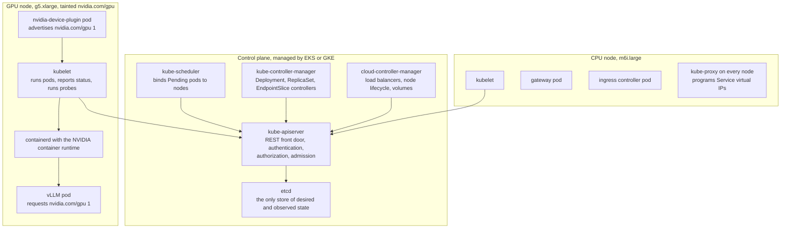
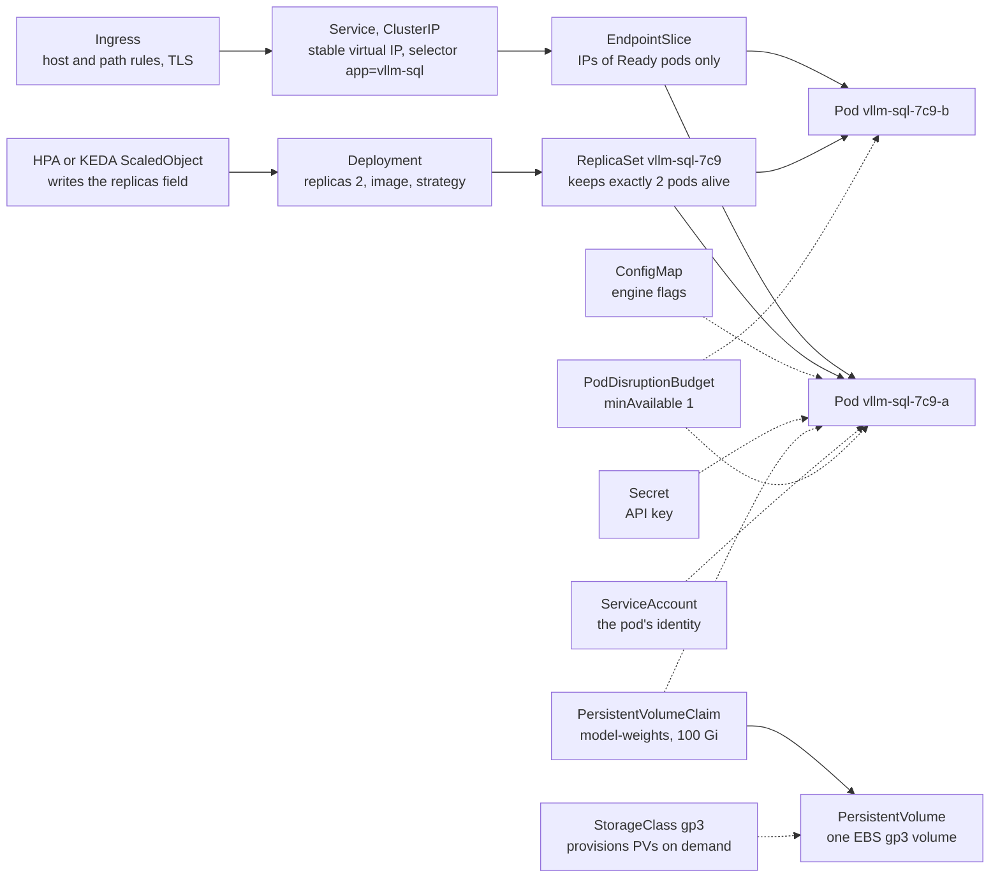
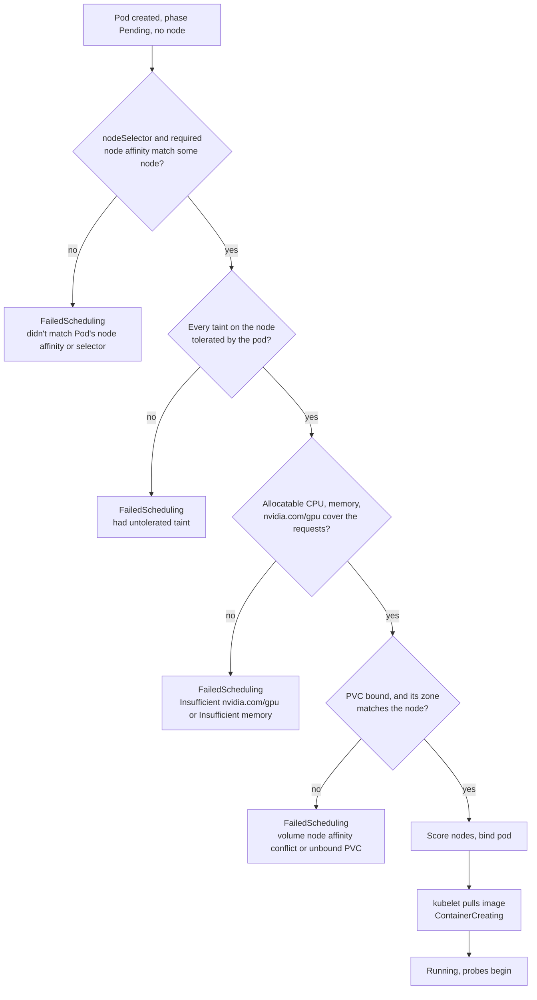
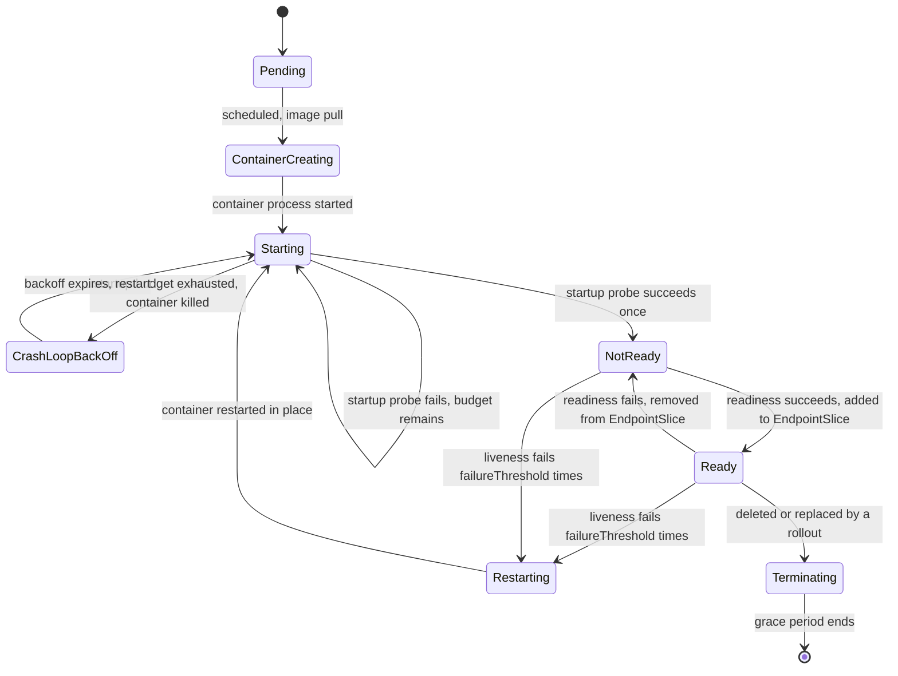
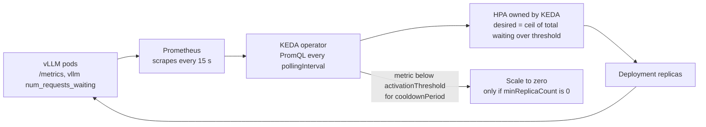

# Chapter 14: Kubernetes for Model Serving

> **What you will be able to do:** describe every Kubernetes object a model server needs and how the controllers reconcile them; schedule a pod onto a GPU node and diagnose one that stays Pending; set startup, readiness, and liveness probes for a server that loads weights for minutes; roll out a new image without losing GPU capacity or stalling; scale replicas on queue depth with KEDA and explain why CPU is the wrong signal; package all of it as a Helm chart that installs into kind and into EKS; write the runbook that ships with it.
>
> **Where it is used:** P2.3, P2.4, P5.2.
>
> **Prerequisites:** Chapter 5 (Docker, WSL2, the project template), Chapter 13 (vLLM launch flags, the health endpoint, the KV cache as the capacity limit). Chapter 4 for the memory arithmetic that sizes the pod.

## 14.0 The problem this chapter solves

A customer's platform team says: "We run everything on Kubernetes. Give us a Helm chart." You have a container that serves a fine-tuned 7B text-to-SQL model with vLLM. It runs on your laptop with one command. The customer's cluster has three GPU nodes shared with two other teams, a network policy that blocks egress to the Hugging Face Hub, an ingress controller you did not choose, and an on-call rotation that will page someone at 03:00 when your pod restarts. None of the Docker knowledge transfers directly. You need to know what a Deployment does when a node dies, why the first deploy sits in Pending for twenty minutes, and why the second deploy killed the server while it was still loading weights.

Kubernetes is the operating system of enterprise infrastructure. It is also the place where model serving differs most from ordinary web serving. A web pod starts in two seconds, uses a few hundred megabytes, and can be replaced by a spare on any node. A model pod starts in two to five minutes, needs a whole GPU that only some nodes have, holds gigabytes of weights that should not be downloaded on every restart, and cannot be duplicated during an upgrade unless a spare GPU exists. Every default in Kubernetes was tuned for the first kind of pod. This chapter is about the settings that make the second kind work.

The chapter builds the object model from the pod outward, then covers the four mechanisms that matter most for a model server: GPU scheduling, probes, rollouts, and autoscaling. It ends with Helm, the local and cloud clusters you will use, the cost components of a managed cluster, and the runbook. P2.3 asks you to deploy to kind on the laptop with a CPU llama.cpp server, break it on purpose three times, and then run one short EKS session with a spot GPU node. The capstone reuses the chart.

## 14.1 Why Kubernetes, and what it is

Kubernetes is a control system. You submit objects that describe the desired state of the world: two replicas of this image, with this much memory, reachable at this name. Controllers compare the desired state with the observed state and take actions to close the gap. When a node fails, the gap reopens and the controllers close it again. That is the whole idea. Everything else is detail about which objects exist and how the gap is closed.

### 14.1.1 Control plane and node components

The control plane holds the state and runs the controllers. The nodes run your containers. On a managed cluster (EKS on AWS, GKE on Google Cloud) the provider runs the control plane and you never see its machines. You still need to know what is in it, because every failure message names one of these components.



*Figure 14.1: A managed cluster with one GPU node pool and one CPU node pool. Every component talks only to the API server, and the API server is the only writer to etcd.*

The **kube-apiserver** is the single entry point. Every `kubectl` command, every controller, and every kubelet reads and writes through it. It authenticates the caller, checks authorization (RBAC, section 14.2.9), runs admission controllers that can mutate or reject objects, and persists the result to **etcd**, a consistent key-value store. The **kube-scheduler** watches for pods with no node assigned and picks one for each, using the filters and scores in section 14.3. The **kube-controller-manager** runs the built-in controllers: the Deployment controller creates ReplicaSets, the ReplicaSet controller creates pods, the EndpointSlice controller keeps the list of pod IPs behind each Service current, and so on. The **cloud-controller-manager** talks to the cloud API to create load balancers for Services of type LoadBalancer and to attach block volumes.

On each node, the **kubelet** is the agent that makes the pods assigned to that node real: it pulls images, asks the container runtime (**containerd** on almost every modern cluster) to start containers, mounts volumes, runs the probes, and reports status back. **kube-proxy** programs the node's networking so that a Service's virtual IP reaches a live pod. On a GPU node, the **NVIDIA container runtime** is configured as a containerd handler so that a container granted a GPU sees the device files and driver libraries, and the **NVIDIA device plugin** tells the kubelet how many GPUs the node has.

### 14.1.2 The reconciliation loop

Every controller runs the same loop: observe the current state, compare with the desired state, act, repeat. The loop is level-triggered, not edge-triggered. It does not react to the event "pod deleted". It notices "two pods desired, one observed" and creates one. This is why Kubernetes recovers from missed events and from its own restarts, and why you should never fight it by hand. If you delete a pod that a Deployment owns, the ReplicaSet controller recreates it within seconds. If you want a pod gone, you change the desired state (scale the Deployment) rather than the observed state.

The consequence for practice: your job is to describe what should be true, in enough detail that the controllers can keep it true without you. A Deployment with a GPU request, correct probes, and a disruption budget survives node failures, cluster upgrades, and spot reclamations with no human involved. A Deployment with the defaults survives none of them gracefully.

## 14.2 The object model

An object is a record in etcd with `apiVersion`, `kind`, `metadata` (name, namespace, labels, annotations), a `spec` you write, and a `status` the controllers write. Objects find each other by **labels** and **selectors**: a Service does not name the pods it fronts, it selects pods whose labels match. This indirection is what lets a new ReplicaSet's pods join a Service the moment they are Ready, and leave it the moment they are not.



*Figure 14.2: The objects a model server needs and how they reference each other. Solid arrows are ownership or routing. Dotted arrows are references by name or label.*

### 14.2.1 Pod

A pod is the unit of scheduling: one or more containers that share a network namespace (one IP, one set of ports) and can share volumes. A model server pod usually has one main container and sometimes an **init container** that runs to completion before the main one starts, for example to copy weights from S3 into a volume. Pods are disposable. They are never repaired, only replaced. A pod's IP changes on every replacement, which is why nothing should ever address a pod directly.

### 14.2.2 ReplicaSet and Deployment

A ReplicaSet keeps a fixed number of identical pods alive. You almost never create one yourself. A Deployment owns ReplicaSets and manages the transition between them: when you change the pod template (a new image tag, a new flag), the Deployment creates a new ReplicaSet and shifts replicas from old to new according to its **strategy** (section 14.5). It keeps old ReplicaSets at zero replicas as **revision history** so that a rollback is a change of desired replicas rather than a rebuild. The default history is ten revisions.

### 14.2.3 Service

A Service gives a set of pods one stable virtual IP and DNS name. The kube-proxy on every node rewrites traffic to that IP into traffic to one of the pods currently listed in the Service's EndpointSlice. Only pods that pass their readiness probe appear there, which is the mechanism that makes readiness meaningful. The four types:

| Type | What you get | Use for a model server |
|---|---|---|
| ClusterIP | A virtual IP reachable only inside the cluster, plus DNS `name.namespace.svc.cluster.local` | The default. The gateway and the Ingress reach vLLM this way. |
| NodePort | ClusterIP plus a fixed port opened on every node | Debugging on kind. Not for production. |
| LoadBalancer | NodePort plus a cloud load balancer created by the cloud-controller-manager | Exposing the gateway or the ingress controller. Each one costs money per hour (section 14.8). |
| ExternalName | A DNS alias to a name outside the cluster | Pointing an in-cluster name at a frontier API endpoint. |

A **headless** Service (`clusterIP: None`) returns the pod IPs directly in DNS instead of a virtual IP. Some client-side load balancers and StatefulSets use it.

### 14.2.4 Ingress

An Ingress is a set of HTTP routing rules (host, path, TLS certificate) that an **ingress controller** (ingress-nginx, the AWS Load Balancer Controller, Traefik) turns into a running proxy. The Ingress object is portable. The controller is not, and its behavior is set by annotations that differ per controller. For a model server two settings matter: the proxy read timeout, which must exceed your longest generation (the default of 60 seconds in ingress-nginx cuts off long completions), and the request body size limit, because a prompt with a large schema can exceed a 1 MB default. The newer **Gateway API** (GatewayClass, Gateway, HTTPRoute objects) is replacing Ingress in many clusters. The concepts carry over. Check which one your customer's cluster uses before you write the chart.

### 14.2.5 ConfigMap and Secret

Both hold key-value data that a pod consumes as environment variables or as files in a mounted volume. Use a ConfigMap for engine flags and a Secret for the API key the gateway presents to vLLM. Two facts about Secrets that surprise people: the values are base64-encoded, not encrypted, so anyone with read access to the Secret has the plaintext; and they are encrypted at rest in etcd only if the cluster enables envelope encryption with a key management service. EKS supports that with KMS and recent versions enable it by default; check your cluster version. A pod does not restart when a ConfigMap changes. Environment variables are read at start, and mounted files update after a delay of up to a minute but the process must re-read them. The common pattern is to put a hash of the ConfigMap into a pod annotation in the Helm template so that a config change rolls the Deployment.

### 14.2.6 PersistentVolume, PersistentVolumeClaim, and StorageClass

A **PersistentVolume** (PV) is a piece of storage in the cluster: an EBS volume, an EFS file system, a local disk. A **PersistentVolumeClaim** (PVC) is a pod's request for storage of a given size and **access mode**. A **StorageClass** describes how to provision PVs on demand: which driver, which volume type, which parameters. When a PVC names a StorageClass, the driver creates a PV and binds the two. The pod then mounts the PVC.

The access mode decides your architecture. `ReadWriteOnce` (RWO) means one node at a time. EBS is RWO, so two replicas on two nodes cannot share one EBS PVC. `ReadWriteMany` (RWX) means many nodes. EFS is RWX but its per-file throughput is lower and its cost per gigabyte is higher. `ReadOnlyMany` (ROX) suits weights exactly. The options for model weights, with the trade-offs:

| Option | Access | Load speed | Cost and notes |
|---|---|---|---|
| EBS gp3 PVC per replica | RWO | About 125 MB/s baseline, provisionable higher | Needs one volume per replica, so a StatefulSet with a volume claim template, or a pre-populated volume per node. 4.5 GB of AWQ weights in about 40 s at baseline. |
| EFS PVC shared | RWX | Tens to a few hundred MB/s per file, scales with parallel reads | One volume, any number of replicas. First load of a 14 GB bf16 model can take several minutes. |
| S3 with a CSI mount driver | ROX | High with parallel readers | Weights live where the training job put them. Read-only fits weights. |
| Init container copies from S3 into an emptyDir | Per pod | S3 to EC2 in region exceeds 1 GB/s with parallel downloads | Simple and fast. Costs one download per pod start and needs node disk for the emptyDir. |
| Bake weights into the image | None | Image pull, 100 to 200 MB/s per node | Simple. Slow pulls, huge registry storage, and every model change is an image rebuild. Avoid beyond 2 GB. |

Whatever you choose, never let the server download weights into the container's writable layer. That writes to the node's root disk, which is often 20 GB on a default node group, and the pod gets evicted for ephemeral storage pressure halfway through (section 14.6.4).

### 14.2.7 Namespace

A namespace is a scope for names and for policy. Put the model server in its own namespace (`model-serving`) so that RBAC, resource quotas, and network policies can be attached to it. A **ResourceQuota** on the namespace can cap `requests.nvidia.com/gpu`, which stops a mistaken `replicas: 10` from consuming the customer's whole GPU pool. A **LimitRange** supplies default requests and limits for containers that omit them.

### 14.2.8 ServiceAccount

Every pod runs as a ServiceAccount, `default` unless you say otherwise. The ServiceAccount is the pod's identity for the Kubernetes API and, on EKS through IAM Roles for Service Accounts or EKS Pod Identity, for the cloud API too. A vLLM pod that reads weights from S3 should run as a ServiceAccount bound to an IAM role that can read that one bucket and nothing else. Chapter 15 covers the IAM side. Set `automountServiceAccountToken: false` on pods that never call the Kubernetes API, which includes the model server.

### 14.2.9 RBAC basics

Role-based access control has four objects. A **Role** lists permitted verbs (`get`, `list`, `watch`, `create`, `update`, `patch`, `delete`) on resources (`pods`, `deployments`, `secrets`) within one namespace. A **ClusterRole** does the same cluster-wide or for non-namespaced resources such as nodes. A **RoleBinding** grants a Role to subjects (users, groups, ServiceAccounts) in a namespace. A **ClusterRoleBinding** grants a ClusterRole everywhere. The CI deploy identity from Chapter 15 gets a Role in `model-serving` that can manage Deployments, Services, ConfigMaps, Secrets, Ingresses, PodDisruptionBudgets, and ScaledObjects, and nothing outside the namespace. An on-call reader gets `get`, `list`, and `watch` on pods, `pods/log`, events, and deployments. On EKS, the mapping from IAM identities to Kubernetes users and groups is done with **access entries** (the older `aws-auth` ConfigMap still exists on older clusters; check your version).

## 14.3 Scheduling and the GPU

The scheduler answers one question per Pending pod: which node. It filters out nodes that cannot run the pod, scores the rest, and binds the pod to the best. Every reason a pod stays Pending is a filter that eliminated every node. Learn the filters and you can read any Pending event.

### 14.3.1 Requests, limits, and QoS classes

A container's **request** is what the scheduler reserves for it on the node. Its **limit** is what the kubelet enforces at run time. CPU beyond the limit is throttled. Memory beyond the limit gets the process killed with the `OOMKilled` reason. Requests decide placement; limits decide survival.

The pair also decides the pod's **Quality of Service class**, which decides who gets evicted first when a node runs short of memory. `Guaranteed`: every container has requests equal to limits for both CPU and memory. `Burstable`: at least one request is set, but not all equal to limits. `BestEffort`: nothing set. Eviction under node pressure removes BestEffort pods first, then Burstable pods using more than their request, and Guaranteed pods last. A model server should be Guaranteed. It is the only pod on its node worth protecting, and it has no use for burst capacity it cannot plan around.

Sizing the memory request for a vLLM pod means CPU memory, not GPU memory. The GPU has its own budget set by the engine flag for the memory fraction. CPU memory holds the process, the tokenizer, the page cache during weight loading, and the pinned swap space vLLM reserves for preempted sequences (4 GiB per GPU by default in the versions this chapter assumes; check your version). A rule that works: weights size plus swap space plus about 4 GiB of overhead. For a 7B AWQ model: about 4.5 GiB plus 4 GiB plus 4 GiB, so 12 to 13 GiB. On a g5.xlarge with 16 GiB of RAM and about 2 GiB reserved for the system, 12 Gi is the practical ceiling, and you may need to reduce the swap space to fit. On a g5.2xlarge with 32 GiB there is room. For the 1.5B model in bf16, about 3 GiB of weights, 8 Gi is comfortable.

### 14.3.2 Node selectors and affinity

A **nodeSelector** is a set of labels the node must have. `node-pool: gpu` is the usual one. **Node affinity** is the richer form: `requiredDuringSchedulingIgnoredDuringExecution` is a hard filter with operators such as `In` and `NotIn`, and `preferredDuringScheduling` is a soft score. Use required affinity when you need a specific instance family (an L4 rather than an A10G for FP8, Chapter 12). **Pod anti-affinity** spreads replicas across nodes or zones, so that one node failure does not take every replica. For GPU pods this is usually automatic, because each node has one GPU, but write it down anyway for the day a customer gives you a node with four.

### 14.3.3 Taints and tolerations

A **taint** on a node repels pods. A **toleration** on a pod lets it ignore a matching taint. The pattern for GPU nodes is a taint `nvidia.com/gpu=present:NoSchedule` on every GPU node and a matching toleration on every pod that needs a GPU. Without the taint, the cluster's ordinary pods (the ingress controller, a metrics agent, the gateway) drift onto the expensive node and consume the CPU and memory your model server needs. The taint keeps the GPU node clear. The toleration lets your pod in. Neither one places the pod on the GPU node. That is the nodeSelector's job. You need both.

The three effects: `NoSchedule` blocks new pods. `PreferNoSchedule` discourages them. `NoExecute` evicts running pods that do not tolerate it, and is what the node lifecycle controller adds when a node becomes unreachable, with a default toleration of 300 seconds on every pod. A model pod that is evicted after 300 seconds of node unreachability and then takes 4 minutes to load elsewhere is a 9-minute outage if it is the only replica. Section 14.5 is about not having only one replica.

### 14.3.4 GPU node pools and the NVIDIA device plugin

A GPU is invisible to Kubernetes until something advertises it. The **NVIDIA device plugin** is a DaemonSet (one pod per matching node) that discovers the GPUs on the node and registers an **extended resource** named `nvidia.com/gpu` with the kubelet. From then on the node's allocatable resources include `nvidia.com/gpu: 1` (or 4, or 8), and a pod can request it like CPU. The kubelet asks the plugin to allocate a specific device at container start, and the NVIDIA container runtime exposes that device and the driver libraries inside the container.

Extended resources follow stricter rules than CPU and memory. They are integers, so no half GPU. They cannot be overcommitted, so requests must equal limits (writing only the limit is allowed and the request is set equal). A node with one GPU runs exactly one pod that requests one. The two ways to share a GPU are **time-slicing**, a device plugin configuration that advertises several replicas of one GPU with no memory isolation, and **MIG** on A100 and H100 class GPUs, which partitions the hardware. Neither suits a production vLLM server, which wants the whole card.

The plugin needs three things in place: a node image with the NVIDIA driver (on EKS, the GPU-enabled Amazon Linux AMI; on GKE, automatic driver installation on GPU node pools), the NVIDIA container runtime configured in containerd, and the plugin DaemonSet itself, which must tolerate your GPU taint or it will never run on the very nodes it is for. The **NVIDIA GPU Operator** is a Helm chart that installs the driver, the runtime configuration, the device plugin, and a DCGM metrics exporter as one unit; it is the common choice on clusters you control and the wrong choice on clusters where the platform team manages drivers. On EKS the device plugin is also available as a managed add-on. Check what your cluster already has before you install anything.

### 14.3.5 Why a pod stays Pending



*Figure 14.3: The scheduler's filters in the order you should check them. Each failure writes an event on the pod that names the filter.*

The diagnostic order matches the diagram. First read the pod's events.

```bash
kubectl -n model-serving describe pod -l app=vllm-sql
```

A typical event reads: `0/4 nodes are available: 1 node(s) had untolerated taint {nvidia.com/gpu: present}, 3 Insufficient nvidia.com/gpu.` That sentence tells you the GPU node exists, the pod lacks the toleration, and the three CPU nodes have no GPU. Add the toleration. If instead every node reports `Insufficient nvidia.com/gpu` including the GPU node, the device plugin is not advertising. Check the node's allocatable resources.

```bash
kubectl describe node -l node-pool=gpu
```

If `nvidia.com/gpu` is missing from the Allocatable block, look at the device plugin DaemonSet in its namespace: no pod on the GPU node means the DaemonSet does not tolerate the taint; a crash-looping pod usually means the driver or the container runtime configuration is missing on the node image. If the events mention a volume, check the PVC's status and, for EBS, that the volume's availability zone matches the node's, because EBS volumes are zonal and a PVC created in one zone cannot mount on a node in another. Finally, a Deployment whose pods never appear at all, with no pod events, is usually blocked by a ResourceQuota; the events are on the ReplicaSet, not the pod.

## 14.4 Probes for a server that loads for minutes

The kubelet runs three kinds of probe against each container. A **startup probe** answers "has the container finished starting". While it has not succeeded, the other two probes are disabled. A **readiness probe** answers "may this pod receive traffic". Failing removes the pod from every Service's EndpointSlice without restarting it. A **liveness probe** answers "is this process beyond saving". Failing `failureThreshold` times in a row restarts the container.

Each probe has `initialDelaySeconds`, `periodSeconds` (default 10), `timeoutSeconds` (default 1), `failureThreshold` (default 3), and `successThreshold` (default 1, and must be 1 for liveness and startup). The startup budget, the longest a container may take before it is killed, is

$$
T_{\text{start}} = \text{initialDelaySeconds} + \text{failureThreshold} \times \text{periodSeconds},
$$

where $T_{\text{start}}$ is measured from container start, after the image has been pulled. Image pull time does not count against it, which is why a fresh node pulling a 10 GB vLLM image shows a long `ContainerCreating` phase rather than a probe failure.

Without a startup probe, the liveness probe runs from the beginning with its own budget. With the defaults of `initialDelaySeconds: 0`, `periodSeconds: 10`, `failureThreshold: 3`, a liveness probe kills the container 30 seconds after start. vLLM does not even bind its HTTP port until the engine has loaded, so every probe gets connection refused, the container is killed at 30 seconds, restarts, is killed again, and the pod shows `CrashLoopBackOff` with the restart count climbing and the backoff between attempts doubling to five minutes. This is the single most common way a working container fails in a cluster.

**Worked example.** A 7B AWQ model on a g5.xlarge. Weights load from an EBS gp3 volume at about 125 MB/s: 4.5 GB takes about 36 s. Then vLLM profiles memory, allocates the KV cache, and captures CUDA graphs, which takes 30 to 90 s depending on the version and the `max-model-len`. Expect 2 to 3 minutes on a warm node and up to 5 on a cold one where the page cache is empty and the volume is freshly attached. Set the startup probe to twice the worst case: `periodSeconds: 10`, `failureThreshold: 60`, so $T_{\text{start}} = 600$ s. A slow start now costs nothing but waiting. Set readiness to `periodSeconds: 10`, `timeoutSeconds: 5`, `failureThreshold: 3`, so an overloaded server that stops answering within 5 s for 30 s leaves the load balancer and returns when it recovers. Set liveness to `periodSeconds: 30`, `timeoutSeconds: 10`, `failureThreshold: 3`, so a restart requires 90 s of consecutive failure. Restarting a model server is a 3-minute outage for that replica; the liveness probe must be the last resort, not a twitch.

Which endpoint to probe. vLLM exposes `/health`, which returns 200 once the engine is up. It is fine for all three probes. In current versions the API server runs in a separate process from the engine core, so `/health` responds even while the engine is saturated; in older versions the health handler shared the event loop with request handling and could time out under load, which turned a busy server into a restarted one. Check your version, and if in doubt set the liveness timeout generously. llama.cpp's server exposes `/health` as well and returns 503 while the model is loading, which the probes treat as failure exactly as intended.



*Figure 14.4: The container's life as the probes see it. Traffic flows only in the Ready state. The startup probe gates the other two.*

Termination matters too. When a pod is deleted, the kubelet sends SIGTERM and waits `terminationGracePeriodSeconds` (default 30) before SIGKILL. At the same moment the pod leaves the EndpointSlice, but that propagation is asynchronous, so for a second or two new requests can still arrive at a pod that has been told to stop. Two settings fix this: a `preStop` hook that sleeps 5 to 10 seconds before the SIGTERM is delivered, and a grace period long enough for in-flight generations to finish, 60 to 120 s for a model server. A generation that takes 40 s does not fit in the default 30.

## 14.5 Rolling updates, the GPU surge problem, and disruption budgets

### 14.5.1 maxSurge and maxUnavailable

A Deployment's `RollingUpdate` strategy has two knobs. `maxSurge` is how many pods above the desired count may exist during the rollout. `maxUnavailable` is how many below the desired count may be unavailable. Both accept an integer or a percentage; the defaults are 25 percent each, with surge rounded up and unavailable rounded down. The controller creates new pods up to the surge, waits for them to be Ready, then removes old ones down to the unavailable floor, and repeats. For a web service this gives zero-downtime deploys for free.

### 14.5.2 The GPU surge problem

The free lunch assumes a spare node can hold the surge pod. A GPU pod's surge needs a spare GPU. **Worked example.** Two replicas on two single-GPU nodes, default strategy. `maxSurge` of 25 percent rounds up to 1, `maxUnavailable` rounds down to 0. The controller creates one new pod first. It requests a GPU. Both GPUs are held by the old pods. The new pod is Pending with `Insufficient nvidia.com/gpu`. The controller cannot remove an old pod because unavailable must stay at 0. The rollout stalls. After `progressDeadlineSeconds` (default 600) the Deployment reports `ProgressDeadlineExceeded`, but the old pods keep serving, so nothing pages and the new version never arrives. Someone notices a day later.

Four resolutions, with what each costs:

1. `maxSurge: 0, maxUnavailable: 1`. The controller deletes one old pod, its GPU frees, the new pod schedules there, loads for 3 to 4 minutes, becomes Ready, and the controller repeats for the second. Capacity is at 50 percent for about 6 to 8 minutes in total. No extra hardware. This is the right default for a small GPU pool, and Listing 14.1 uses it.
2. Keep $G \ge R + s$ GPUs, where $R$ is the replica count and $s$ is `maxSurge`. One standing spare GPU per pool. Zero capacity loss during rollouts, at the price of one idle GPU, about $290 a month for a g5.xlarge spot node at an assumed $0.40 per hour (as of September 2026; verify).
3. A cluster autoscaler or Karpenter that adds a node when a pod is Pending. The surge pod waits for node provisioning (2 to 4 minutes), image pull (1 to 2 minutes for a 10 GB image), and model load (2 to 4 minutes). Rollouts take about 10 minutes but lose no capacity, and the extra node is consolidated away afterwards. Good when the pool is already autoscaled.
4. Blue-green: a second Deployment with the new version, verified, then the Service selector flipped. Needs $2R$ GPUs briefly. The cleanest rollback and the most expensive.

With a single replica, options 1 and 4 both mean downtime unless a second GPU exists. There is no configuration that upgrades one GPU pod on one GPU with no gap. Say so to the customer before they discover it.

### 14.5.3 PodDisruptionBudgets

Rollouts are one source of disruption. **Voluntary disruptions** are the other: a node drain for a cluster upgrade, the autoscaler consolidating nodes, a spot interruption handler cordoning a node that has received its two-minute warning. A **PodDisruptionBudget** (PDB) tells the eviction API how many pods of a selector must remain: `minAvailable: 1` or `maxUnavailable: 1`. A drain that would violate the budget waits, evicting one pod, waiting for its replacement to be Ready, then the next. With two replicas and `minAvailable: 1`, a cluster upgrade never removes both.

Two cautions. A PDB with `minAvailable: 1` on a single-replica Deployment blocks every drain forever, and the platform team's upgrade tooling will either stall or force past it. Either run two replicas or write `maxUnavailable: 1` and accept the gap knowingly. And a PDB protects against nothing involuntary: a node that crashes, or a spot instance reclaimed with no handler installed, takes the pod with it regardless. Only replicas across nodes protect against that.

## 14.6 Autoscaling

### 14.6.1 The HorizontalPodAutoscaler and why CPU is the wrong signal

The **HorizontalPodAutoscaler** (HPA) adjusts a Deployment's replica count toward a metric target. Every 15 s it computes

$$
n_{\text{desired}} = \left\lceil n_{\text{current}} \cdot \frac{m_{\text{current}}}{m_{\text{target}}} \right\rceil,
$$

where $n$ is the replica count and $m$ is the metric, averaged over the pods for per-pod metrics. It ignores changes inside a 10 percent tolerance, scales up immediately, and scales down only after a stabilization window of 300 s by default. **Worked example.** Three replicas at 80 percent average CPU with a 50 percent target: $\lceil 3 \times 80/50 \rceil = \lceil 4.8 \rceil = 5$.

The `autoscaling/v2` API supports four metric sources: `Resource` (CPU, memory from the metrics server), `Pods` (a custom per-pod metric), `Object` (a metric on some other object, such as an Ingress request rate), and `External` (anything from a metrics adapter). CPU is the only one that works with no extra installation, which is why P2.3 uses it on kind and why customers have it in production.

CPU fails as a signal for a GPU server for three reasons. First, saturation happens on the GPU: a vLLM pod running a full KV cache and a full batch uses perhaps one to two CPU cores for tokenization, scheduling, and HTTP out of the four on a g5.xlarge, so CPU reads 25 to 50 percent while the server is turning requests away. Second, the relationship shifts with the workload: long prompts cost more CPU per request in tokenization but fewer requests fit, so the same CPU percentage corresponds to different GPU states. Third, the quantity users feel, queue wait, is invisible in CPU. The right signals are the engine's own: the number of requests waiting to be scheduled, and the KV cache utilization. vLLM exports both on `/metrics` in Prometheus format, as `vllm:num_requests_waiting` and a cache usage gauge whose name changed between the engine generations (`gpu_cache_usage_perc` in older versions, `kv_cache_usage_perc` in newer; check your version).

### 14.6.2 KEDA on queue depth

**KEDA** (Kubernetes Event-Driven Autoscaling) is an operator that creates and manages an HPA for you from a **ScaledObject**, fed by one of its scalers: Prometheus queries, queue lengths in SQS or Kafka, cron schedules, and about seventy others. The Prometheus scaler evaluates a PromQL query every `pollingInterval` seconds and hands the HPA a metric whose target is your `threshold`. With the default `AverageValue` semantics the HPA formula becomes $n_{\text{desired}} = \lceil m_{\text{total}} / \text{threshold} \rceil$.

**Worked example.** Threshold 4 waiting requests per replica. The query returns 14 waiting requests across two replicas: $\lceil 14/4 \rceil = 4$ replicas, capped by `maxReplicaCount`. Set `maxReplicaCount` to the number of GPUs you can actually obtain; an HPA that asks for six replicas on a four-GPU pool leaves two pods Pending and a misleading dashboard. Set the scale-down stabilization window long (10 to 15 minutes) and the scale-down policy to one pod per 5 minutes, because scaling in costs nothing to undo slowly and scaling out costs a 3-minute load to undo quickly.



*Figure 14.5: The autoscaling signal path. KEDA handles the zero-to-one transition itself, which a plain HPA cannot do without an alpha feature gate.*

### 14.6.3 Scale-to-zero trade-offs

KEDA can hold a Deployment at zero replicas when the metric is below `activationThreshold` for `cooldownPeriod` seconds, and create the first replica when it rises. The saving is the whole GPU bill during idle hours. The cost is the cold start:

$$
t_{\text{cold}} = t_{\text{node}} + t_{\text{pull}} + t_{\text{load}} + t_{\text{probe}},
$$

where $t_{\text{node}}$ is node provisioning if the node pool also scales to zero (2 to 4 minutes on EKS), $t_{\text{pull}}$ is the image pull ($S_{\text{image}} / B_{\text{net}}$, about 10 GB at 100 to 200 MB/s, so 1 to 2 minutes), $t_{\text{load}}$ is the model load (2 to 4 minutes), and $t_{\text{probe}}$ is up to one readiness period. **Worked example.** Node pool at zero: 3 + 1.5 + 3 + 0.2, about 8 minutes before the first request after a quiet hour gets an answer. Node kept warm but pod at zero: about 4 minutes, and you are paying for the node anyway, which removes most of the saving. The decision is binary: interactive traffic gets `minReplicaCount: 1` and pays for one warm GPU around the clock; batch and overnight workloads get zero and a client that tolerates minutes of latency on the first call. A warm g5.xlarge spot replica at an assumed $0.40 per hour costs about $290 a month (as of September 2026; verify).

### 14.6.4 Resource exhaustion: OOMKilled and evictions

Three ways a model pod dies of resource exhaustion, and how to tell them apart. **OOMKilled** appears in the pod's last state with exit code 137. The container exceeded its memory limit. For a model server the cause is almost always a memory limit below what weight loading needs, not a leak; raise the limit using the arithmetic in section 14.3.1 and check the swap-space flag. **Node memory pressure eviction** appears as an event `The node was low on resource: memory` and a pod status `Evicted`. Some other pod on the node used more than it requested and the kubelet evicted by QoS class; a Guaranteed model pod on a tainted node should never see this. **Ephemeral storage eviction** appears as `The node was low on resource: ephemeral-storage`. The container wrote too much to its writable layer or to an `emptyDir` without a `sizeLimit`, and the usual culprit is a weights download landing on the node's 20 GB root disk. Move weights to a volume, or set `sizeLimit` on the `emptyDir` and size the node disk in the node group.

GPU memory exhaustion is not a Kubernetes event at all. vLLM reserves its fraction at start and refuses requests beyond what the KV cache holds; a CUDA out-of-memory error at start means the fraction plus the model exceeds the card, and the fix is the flags from Chapter 13, not the manifest.

## 14.7 Helm

Helm is the package manager for Kubernetes. A **chart** is a directory with `Chart.yaml` (name, version), `values.yaml` (defaults), and `templates/` (manifests with Go template expressions). A **release** is one installation of a chart with a specific set of values, tracked as a numbered revision. The same chart installs into kind with a CPU server and into EKS with vLLM on a GPU by supplying a different values file.

The commands that matter: install or upgrade in one step, wait for readiness, and roll back automatically if the wait fails.

```bash
helm upgrade --install sql-server charts/model-server -n model-serving -f charts/model-server/values-eks.yaml --set image.tag=2026-11-04 --wait --timeout 15m --atomic
```

The `--timeout` must exceed your startup probe budget plus scheduling time, or `--atomic` rolls back a deploy that was about to succeed. Rollback to the previous revision is one command.

```bash
helm rollback sql-server -n model-serving
```

Two habits. Render the chart locally before every install and read the diff against the previous render; a Helm chart is code and its output is what actually runs.

```bash
helm template sql-server charts/model-server -f charts/model-server/values-eks.yaml > rendered.yaml
```

And keep the values files in the repository next to the chart, one per environment, with every environment-specific setting there and nothing environment-specific in the templates. Listing 14.4 shows the shape. Chapter 15 wires the same commands into the pipeline.

## 14.8 kind, managed clusters, and their cost components

### 14.8.1 kind

**kind** (Kubernetes in Docker) runs each cluster node as a Docker container. On WSL2 with Docker Desktop it gives you a real multi-node cluster in about a minute with zero cloud cost. It has no GPU in the standard setup, so you serve a GGUF model with llama.cpp on CPU and learn every object in this chapter for free. Two configuration details make it useful: `extraPortMappings` on the control-plane node so that an ingress controller's ports 80 and 443 reach the host, and `extraMounts` on the worker nodes so that a directory of model files on the WSL2 filesystem appears inside the node containers, where a `hostPath` PersistentVolume can reference it. Load your locally built images with `kind load docker-image` rather than pushing to a registry.

### 14.8.2 Managed clusters and their cost components

A managed cluster charges for things that are invisible when everything works. The components, with prices as of September 2026 (verify every one before quoting it):

| Component | Charged | Approximate price | Notes |
|---|---|---|---|
| EKS control plane | Per cluster-hour, always | About $0.10 per hour | About $73 a month with zero nodes. GKE charges a similar management fee with a free-tier credit for one small cluster per billing account. |
| GPU node | Per instance-hour while running | g5.xlarge (one A10G, 24 GB) about $1.01 on demand; spot commonly 30 to 70 percent lower | g6.xlarge (one L4, 24 GB) is similar and supports FP8. |
| NAT gateway | Per hour plus per GB processed | About $0.045 per hour and $0.045 per GB | Every image pull and Hub download from a private subnet goes through it. A 10 GB image plus 5 GB of weights is about $0.68 in data processing per fresh node. VPC endpoints for ECR and S3 avoid the per-GB charge for those two. |
| Load balancer | Per hour plus capacity units | About $0.0225 per hour for a Network Load Balancer plus usage | One per Service of type LoadBalancer. Share one ingress controller rather than one load balancer per Service. |
| EBS gp3 | Per GB-month | About $0.08 per GB-month | 100 GB is about $0.011 per hour. Volumes outlive the pods that used them; destroy the PVC or the volume stays billed. |
| Data transfer out | Per GB | Varies by destination | Small for an API serving text. |

**Worked example.** A 4-hour P2.3 session with one spot g5.xlarge at an assumed $0.40 per hour: control plane $0.40, node $1.60, NAT $0.18 plus $0.68 of data processing, load balancer $0.09, 100 GB of EBS $0.04. Total about $3.00. The same cluster forgotten overnight for 12 more hours adds about $8. Forgotten for a month, about $480, of which $125 is the fixed hourly cost of the control plane, NAT gateway, and load balancer with the node pool scaled to zero. The roadmap's budget of $5 to $15 for P2.3 assumes 6 to 12 cluster hours and a destroy at the end of each session. Chapter 15 puts the destroy in a Makefile target next to the deploy and the budget alarm in the same Terraform module as the cluster.

### 14.8.3 GKE in one paragraph

GKE Standard is the same model as EKS: you own node pools, and GPU node pools can install drivers automatically. GKE Autopilot bills per pod resource request instead of per node and manages the nodes for you, which removes the surge and Pending problems from your hands and puts a price on every request. Both charge a per-cluster management fee after the free tier. The manifests in this chapter run on either; the values that change are the StorageClass name, the ingress class, and the GPU node labels.

## 14.9 KServe and Ray Serve

**KServe** adds a model-serving layer on top of Kubernetes. Its `InferenceService` object declares a model and a runtime (including a vLLM-based runtime for LLMs) and produces the Deployment, Service, autoscaling, and optional canary traffic splitting for you, with a standard inference protocol. In its serverless mode it uses Knative for request-based autoscaling and scale-to-zero. It suits a customer who runs many models and wants one abstraction for all of them, and it costs a substantial dependency stack and a second set of concepts to debug at 03:00. **Ray Serve** is a Python-native serving framework: you write deployments as decorated classes, compose them into pipelines, and Ray schedules them across a cluster, on Kubernetes through the KubeRay operator and its `RayService` object. It suits pipelines with several models and Python preprocessing between them, and it brings the whole Ray runtime with it. The roadmap makes both optional reading. The position to hold in front of a customer: a plain Deployment with a Helm chart covers one or two models with less to learn and less to break; reach for KServe when the customer already runs it or has dozens of models, and for Ray Serve when the serving logic is a Python pipeline rather than a single engine.

## 14.10 Runbooks

A runbook is the document the on-call engineer follows without you. It has a fixed structure, and every deployment you hand to a customer ships with one. The sections:

1. **Service summary.** What it serves, the endpoint, the model and adapter versions, the owning team, the dashboards, and the SLO (Chapter 20).
2. **Deploy.** The exact Helm command with the values file, what "healthy" looks like afterwards, and how long to wait before concluding it failed.
3. **Roll back.** The Helm rollback command, how to confirm the previous revision is serving, and when rollback is the wrong answer (a data or schema change).
4. **Scale.** How to change replicas by hand and how to pause the autoscaler while you do it, plus the GPU count that caps it.
5. **Rotate a secret.** Where the Secret lives, how to update it, and the fact that the pods need a roll to pick it up.
6. **Diagnose.** One entry per failure you have seen, in the form symptom, command, what the output means, fix. Section 14.12 is the seed list. Every incident adds an entry.
7. **Escalate.** Who to page for the cluster itself, for the model, and for the data.

Write it from the commands you actually ran during P2.3, then have someone else follow it once while you watch and say nothing. Every place they hesitate is a missing sentence.

## 14.11 Implementation notes

**Listing 14.1: a vLLM Deployment with a GPU request, three probes, a weights volume, and a shared-memory volume.**

```yaml
apiVersion: apps/v1
kind: Deployment
metadata:
  name: vllm-sql
  namespace: model-serving
spec:
  replicas: 2
  strategy:
    type: RollingUpdate
    rollingUpdate:
      maxSurge: 0           # no spare GPU in the pool; see 14.5.2
      maxUnavailable: 1
  selector:
    matchLabels:
      app: vllm-sql
  template:
    metadata:
      labels:
        app: vllm-sql
    spec:
      nodeSelector:
        node-pool: gpu
      tolerations:
      - key: nvidia.com/gpu
        operator: Exists
        effect: NoSchedule
      terminationGracePeriodSeconds: 120
      automountServiceAccountToken: false
      containers:
      - name: vllm
        image: vllm/vllm-openai:PINNED_TAG   # pin a tag or digest; check your version
        args: ["--model", "/models/qwen2.5-7b-sql-awq", "--quantization", "awq",
               "--served-model-name", "sql-7b", "--max-model-len", "4096",
               "--gpu-memory-utilization", "0.90", "--enable-prefix-caching", "--port", "8000"]
        ports:
        - name: http
          containerPort: 8000
        env:
        - name: VLLM_API_KEY                 # the key the gateway presents; check your version
          valueFrom:
            secretKeyRef: {name: vllm-sql-auth, key: api-key}
        resources:
          requests: {cpu: "2", memory: 12Gi, nvidia.com/gpu: 1}
          limits:   {cpu: "2", memory: 12Gi, nvidia.com/gpu: 1}   # equal, so QoS Guaranteed
        startupProbe:
          httpGet: {path: /health, port: http}
          periodSeconds: 10
          failureThreshold: 60               # 600 s budget for the model load
        readinessProbe:
          httpGet: {path: /health, port: http}
          periodSeconds: 10
          timeoutSeconds: 5
          failureThreshold: 3
        livenessProbe:
          httpGet: {path: /health, port: http}
          periodSeconds: 30
          timeoutSeconds: 10
          failureThreshold: 3                # restart only after 90 s of failure
        lifecycle:
          preStop:
            exec: {command: ["sleep", "8"]}  # let the EndpointSlice update first
        volumeMounts:
        - {name: weights, mountPath: /models, readOnly: true}
        - {name: shm, mountPath: /dev/shm}
      volumes:
      - name: weights
        persistentVolumeClaim: {claimName: model-weights}
      - name: shm
        emptyDir: {medium: Memory, sizeLimit: 2Gi}
```

The non-obvious lines. `maxSurge: 0` with `maxUnavailable: 1` is the GPU-pool rollout from section 14.5.2; change it to `maxSurge: 1, maxUnavailable: 0` only if a spare GPU exists. The toleration uses `operator: Exists` so it matches the taint regardless of its value. Requests equal limits, which makes the pod Guaranteed and stops the scheduler from co-locating anything that could push the node into memory pressure. The weights volume is mounted read-only from a PVC that an init container or a one-off Job populated; with EBS this PVC binds to one node, so two replicas need either two PVCs (a StatefulSet) or one of the shared options from section 14.2.6. The `/dev/shm` mount matters because containerd gives containers a 64 MB shared-memory segment by default and vLLM's worker processes exchange tensors through shared memory; too little produces an opaque bus error at start. The `preStop` sleep covers the propagation gap described in section 14.4. The image tag is a placeholder because inventing a version number here would be worse than leaving the choice to you.

**Listing 14.2: the Service and the Ingress in front of it.**

```yaml
apiVersion: v1
kind: Service
metadata:
  name: vllm-sql
  namespace: model-serving
spec:
  type: ClusterIP
  selector:
    app: vllm-sql
  ports:
  - name: http
    port: 80
    targetPort: http
---
apiVersion: networking.k8s.io/v1
kind: Ingress
metadata:
  name: vllm-sql
  namespace: model-serving
  annotations:
    nginx.ingress.kubernetes.io/proxy-read-timeout: "300"   # longest generation; ingress-nginx specific
    nginx.ingress.kubernetes.io/proxy-body-size: "8m"       # large schemas in prompts
spec:
  ingressClassName: nginx
  tls:
  - hosts: [sql.example.com]
    secretName: sql-example-com-tls
  rules:
  - host: sql.example.com
    http:
      paths:
      - path: /v1
        pathType: Prefix
        backend:
          service:
            name: vllm-sql
            port:
              name: http
```

The Service listens on port 80 and forwards to the container port named `http`, so the port number lives in one place. The two annotations are the settings that break model serving on default ingress controllers: a 60 s read timeout cuts long generations, and a 1 MB body limit rejects prompts with a large schema. Their names are specific to ingress-nginx; the AWS Load Balancer Controller and Traefik have their own. The TLS Secret is created by cert-manager or by hand; the Ingress only references it. In production the Ingress fronts the gateway from Chapter 16 rather than vLLM directly, so that authentication, budgets, and routing happen before a request reaches a GPU.

**Listing 14.3: a KEDA ScaledObject scaling on vLLM's waiting-request count.**

```yaml
apiVersion: keda.sh/v1alpha1
kind: ScaledObject
metadata:
  name: vllm-sql
  namespace: model-serving
spec:
  scaleTargetRef:
    name: vllm-sql                  # the Deployment; KEDA creates and owns the HPA
  minReplicaCount: 1                # 0 for scale-to-zero; see 14.6.3
  maxReplicaCount: 4                # never more than the GPUs you can get
  pollingInterval: 30
  cooldownPeriod: 600               # seconds below activation before scaling to zero
  advanced:
    horizontalPodAutoscalerConfig:
      behavior:
        scaleDown:
          stabilizationWindowSeconds: 900
          policies:
          - type: Pods
            value: 1
            periodSeconds: 300      # remove at most one replica per 5 minutes
  triggers:
  - type: prometheus
    metadata:
      serverAddress: http://prometheus.monitoring.svc:9090
      query: sum(vllm:num_requests_waiting{job="vllm-sql"})   # metric name: check your vLLM version
      threshold: "4"                # waiting requests per replica
      activationThreshold: "1"
```

`threshold` is the per-replica target in the HPA formula of section 14.6.2, and `activationThreshold` is the level below which KEDA considers the Deployment idle. The label in the PromQL query comes from your Prometheus scrape configuration, not from vLLM. The scale-down behavior is deliberately slow because adding a replica costs a 3-minute load while removing one costs nothing; the asymmetry should be in the configuration. KEDA must be installed in the cluster (its own Helm chart) and Prometheus must be scraping the vLLM pods, usually through a `ServiceMonitor` or a `PodMonitor` if the Prometheus Operator is present.

**Listing 14.4: a Helm values file excerpt, defaults for kind and overrides for EKS.**

```yaml
# values.yaml: defaults tuned for kind with a CPU llama.cpp server
image:
  repository: ghcr.io/ggml-org/llama.cpp
  tag: server                      # pin a specific tag in your repo; check your version
model:
  path: /models/qwen2.5-1.5b-sql-q4_k_m.gguf
  servedName: sql-1.5b
server:
  port: 8080
  args: ["--ctx-size", "4096", "--parallel", "4", "--threads", "8"]
resources:
  requests: {cpu: "4", memory: 4Gi}
  limits:   {cpu: "8", memory: 6Gi}
gpu:
  enabled: false
  count: 1
  nodeSelector: {}
  tolerations: []
probes:
  path: /health
  startupSeconds: 300
persistence:
  storageClass: standard
  size: 20Gi
ingress:
  className: nginx
  host: sql.kind.test              # add to the hosts file; .test is reserved for testing
autoscaling:
  mode: hpa-cpu                    # hpa-cpu, keda, or none
  minReplicas: 1
  maxReplicas: 3
  targetCPUUtilizationPercentage: 60
pdb:
  enabled: true
  maxUnavailable: 1
---
# values-eks.yaml: only what differs on the cloud cluster
image: {repository: vllm/vllm-openai, tag: PINNED_TAG}
model: {path: /models/qwen2.5-7b-sql-awq, servedName: sql-7b}
server:
  port: 8000
  args: ["--quantization", "awq", "--max-model-len", "4096",
         "--gpu-memory-utilization", "0.90", "--enable-prefix-caching"]
resources:
  requests: {cpu: "2", memory: 12Gi}
  limits:   {cpu: "2", memory: 12Gi}
gpu:
  enabled: true
  nodeSelector: {node-pool: gpu}
  tolerations: [{key: nvidia.com/gpu, operator: Exists, effect: NoSchedule}]
probes: {startupSeconds: 600}
persistence: {storageClass: gp3, size: 100Gi}
ingress: {className: alb, host: sql.example.com}
autoscaling: {mode: keda, minReplicas: 1, maxReplicas: 2, kedaThreshold: 4}
```

The chart's templates read these values and emit the manifests of Listings 14.1 to 14.3 with the GPU-specific parts wrapped in a conditional, so the same template produces a CPU Deployment on kind and a GPU Deployment on EKS. The values that change between the two files are exactly the environment-specific facts: image, model, GPU, probe budget, storage class, ingress class, autoscaling mode. Anything that appears in both files with the same value belongs in the template.

**Listing 14.5: the template fragment that switches the GPU parts on.**

```yaml
      {{- if .Values.gpu.enabled }}
      nodeSelector:
        {{- toYaml .Values.gpu.nodeSelector | nindent 8 }}
      tolerations:
        {{- toYaml .Values.gpu.tolerations | nindent 8 }}
      {{- end }}
      containers:
      - name: server
        image: "{{ .Values.image.repository }}:{{ .Values.image.tag }}"
        resources:
          requests:
            {{- toYaml .Values.resources.requests | nindent 12 }}
            {{- if .Values.gpu.enabled }}
            nvidia.com/gpu: {{ .Values.gpu.count }}
            {{- end }}
        startupProbe:
          httpGet: {path: {{ .Values.probes.path }}, port: http}
          periodSeconds: 10
          failureThreshold: {{ div .Values.probes.startupSeconds 10 }}
```

`toYaml` with `nindent` renders a values map at the right indentation, which is where most template bugs live. The `div` turns the human-readable startup budget in seconds into the probe's failure threshold. A configuration hash annotation on the pod template (`checksum/config: {{ include (print $.Template.BasePath "/configmap.yaml") . | sha256sum }}`) is the standard way to make a ConfigMap change roll the pods; add it once you split the args into a ConfigMap.

## 14.12 Failure modes

| Symptom | Likely cause | How to confirm | Fix |
|---|---|---|---|
| Pod Pending, event `had untolerated taint` | Toleration missing or key misspelled | Compare the node's Taints block with the pod's tolerations | Add the toleration with `operator: Exists` on the exact key |
| Pod Pending, `Insufficient nvidia.com/gpu` on every node including the GPU node | Device plugin not advertising | Node Allocatable lacks `nvidia.com/gpu`; plugin DaemonSet has no pod on the node or is crash-looping | Give the DaemonSet the toleration; fix the driver or runtime on the node image |
| Pod Pending, `volume node affinity conflict` | EBS PVC in a different zone from the schedulable node | PV's zone label versus the node's zone label | Use `WaitForFirstConsumer` binding mode on the StorageClass, or a shared RWX volume |
| `CrashLoopBackOff` with restart count rising, logs show the model still loading | Liveness probe killing the server during load | Events show `Liveness probe failed` before the first `Startup probe succeeded` | Add a startup probe with a 2x worst-case budget |
| `OOMKilled`, exit code 137 | CPU memory limit below weights plus swap plus overhead | Last State in the pod description | Raise the limit per section 14.3.1 or reduce the swap-space flag |
| Pod `Evicted`, reason ephemeral-storage | Weights downloaded into the writable layer or an unbounded `emptyDir` | Node description shows disk pressure; the download path is not a volume | Mount a volume for weights; set `sizeLimit` on `emptyDir`; size the node disk |
| Rollout stuck, `ProgressDeadlineExceeded`, new pod Pending | Surge pod needs a GPU nobody has | New ReplicaSet at 1, old at N, no free `nvidia.com/gpu` | `maxSurge: 0, maxUnavailable: 1`, or a spare GPU, or an autoscaler |
| Requests fail with 504 after about a minute on long generations | Ingress proxy read timeout | Timeouts cluster near 60 s; vLLM logs show the generation completing later | Raise the proxy read timeout annotation |
| Startup fails with a bus error or a shared-memory error | 64 MB default `/dev/shm` | Error text mentions shm or bus error at engine start | Mount an `emptyDir` with `medium: Memory` at `/dev/shm` |
| Drain of a node hangs for hours | PDB `minAvailable: 1` on a single-replica Deployment | The eviction API returns 429 with the PDB name | Run two replicas or switch to `maxUnavailable: 1` |
| Autoscaler adds replicas that stay Pending | `maxReplicaCount` above the GPU count | HPA desired exceeds Ready; Pending pods with `Insufficient nvidia.com/gpu` | Cap `maxReplicaCount` at the obtainable GPUs |
| Autoscaler never scales out under load | Scaling on CPU, which stays low while the GPU saturates | CPU 30 percent, `num_requests_waiting` high | Switch to KEDA on the waiting-request metric |
| First request after idle takes 8 minutes | Scale-to-zero with node pool also at zero | KEDA logs show activation; node join and image pull in the pod events | `minReplicaCount: 1` for interactive traffic, or keep the node warm |
| `helm upgrade --atomic` rolls back a healthy deploy | `--timeout` shorter than the startup budget | Helm reports timeout; pods reach Ready seconds later | Set `--timeout` above startup budget plus scheduling time |

## 14.13 On your machine

**kind on WSL2.** Docker Desktop with the WSL2 backend gives WSL2 half the host RAM by default, 16 GB on the 32 GB laptop; raise it to 20 GB in the `.wslconfig` file if you serve the 7B GGUF. A three-node kind cluster idles at about 1.5 GB of RAM and a few percent of CPU. The llama.cpp server container with the 1.5B Q4_K_M model (about 1.1 GB on disk) needs about 2 GB of RAM and decodes at roughly 40 to 70 tokens per second with 8 threads on the i9-13950HX; the 7B Q4_K_M (about 4.4 GB) needs about 5.5 GB and decodes at roughly 8 to 14 tokens per second. These are order-of-magnitude figures; measure yours. Keep the GGUF files on the WSL2 ext4 filesystem and mount that directory into the worker nodes with `extraMounts`, then reference it from a `hostPath` PersistentVolume. Set the CPU request to 4 and the limit to 8 so the HPA on CPU has something to measure when you run a load test with 16 concurrent requests. Everything in P2.3 step 1 and step 2 (the three induced failures) runs here at zero cost.

**Listing 14.6: a kind cluster configuration with ingress ports and a models mount.**

```yaml
kind: Cluster
apiVersion: kind.x-k8s.io/v1alpha4
nodes:
- role: control-plane
  kubeadmConfigPatches:
  - |
    kind: InitConfiguration
    nodeRegistration:
      kubeletExtraArgs:
        node-labels: "ingress-ready=true"
  extraPortMappings:
  - {containerPort: 80, hostPort: 80, protocol: TCP}
  - {containerPort: 443, hostPort: 443, protocol: TCP}
- role: worker
  extraMounts:
  - {hostPath: /home/aman/models, containerPath: /models}
- role: worker
  extraMounts:
  - {hostPath: /home/aman/models, containerPath: /models}
```

The node label and port mappings are what the ingress-nginx manifest for kind expects. The mounts make the same host directory visible on both workers, so a `hostPath` volume at `/models` works wherever the pod lands.

**One short EKS session.** Create the cluster with the Terraform from Chapter 15 (or by hand the first time), with one managed node group of a single spot g5.xlarge or g6.xlarge and the GPU taint. Install the device plugin, confirm the node advertises `nvidia.com/gpu: 1`, install your chart with the EKS values file, and time the pod from creation to Ready; expect 4 to 6 minutes on the first start including the image pull. Then run the sequence from P2.3 step 4: KEDA on the waiting-request metric with a load generator at concurrency 32, a rolling update to a new image tag with `maxSurge: 0`, and a Helm rollback. Budget 3 to 4 hours of cluster time, about $3 to $5 at the prices in section 14.8.2 (as of September 2026; verify), and destroy the cluster the same day. Record the hours and the bill in `ROADMAP_LOG.md`.

**What the 4060 does not do here.** kind does not schedule GPUs in the standard setup, and vLLM's GPU path is not exercised until the EKS session. Run vLLM directly in WSL2 for the Chapter 13 work; the Kubernetes work is about the objects, which are identical whether the container inside is llama.cpp on CPU or vLLM on an A10G.

## Exercises

**Exercise 14.1.** A pod's events read: `0/5 nodes are available: 1 node(s) had untolerated taint {nvidia.com/gpu: present}, 1 node(s) had volume node affinity conflict, 3 Insufficient nvidia.com/gpu. preemption: 0/5 nodes are available: 5 Preemption is not helpful for scheduling.` The Deployment has the toleration. Diagnose.

<details><summary>Solution</summary>

Five nodes. Three CPU nodes have no GPU. One GPU node rejects the pod because of the taint, so the toleration that the Deployment "has" is not matching: check the key, value, and effect (a toleration with `operator: Equal` and a wrong value, or the effect `NoExecute` instead of `NoSchedule`, does not match). A second GPU node has a GPU and tolerates the pod but its zone differs from the zone of the EBS volume bound to the PVC, so the volume filter rejects it. Two fixes: correct the toleration (use `operator: Exists`), and either recreate the PVC with a StorageClass whose binding mode is `WaitForFirstConsumer` so the volume is created in the zone where the pod lands, or pin the node group to the volume's zone. The preemption line says evicting lower-priority pods would not help, which confirms the problem is filters, not capacity held by others.

</details>

**Exercise 14.2.** A model server takes 3 minutes to load on a warm node and 5 on a cold one. Choose startup, readiness, and liveness settings and compute the startup budget.

<details><summary>Solution</summary>

Startup: `periodSeconds: 10`, `failureThreshold: 60`, budget $T_{\text{start}} = 0 + 60 \times 10 = 600$ s, twice the cold worst case. A tighter alternative is `periodSeconds: 15`, `failureThreshold: 40`. Readiness: `periodSeconds: 10`, `timeoutSeconds: 5`, `failureThreshold: 3`, so a pod leaves the endpoints after 30 s of not answering within 5 s and returns after one success. Liveness: `periodSeconds: 30`, `timeoutSeconds: 10`, `failureThreshold: 3`, so a restart needs 90 s of consecutive failure. With the startup probe in place the liveness probe does not run until `/health` has returned 200 once, so the load time never counts against it. Without the startup probe the same liveness settings would kill the container 90 s into a 180 s load.

</details>

**Exercise 14.3.** Explain in five sentences why CPU utilization is a poor autoscaling signal for a vLLM pod and what to use instead.

<details><summary>Solution</summary>

The bottleneck of a decode-heavy server is GPU memory bandwidth and KV-cache capacity, not CPU. A saturated vLLM pod spends one to two cores on tokenization, scheduling, and HTTP, which reads as 25 to 50 percent of a four-core node while the engine is rejecting or queueing requests. The mapping from CPU to GPU load shifts with prompt length and batch composition, so no CPU threshold is stable. The user-visible quantity, queue wait, does not appear in CPU at all. Scale instead on the engine's own gauges, `num_requests_waiting` and KV-cache utilization, through KEDA's Prometheus scaler, with a per-replica threshold and a slow scale-down.

</details>

**Exercise 14.4.** Three replicas on three single-GPU nodes, default rollout strategy, `progressDeadlineSeconds` at its default. Describe what happens after you change the image tag, then propose settings and compute the capacity and duration of the rollout with a 4-minute model load.

<details><summary>Solution</summary>

Defaults: `maxSurge` 25 percent of 3 rounds up to 1; `maxUnavailable` rounds down to 0. The controller creates one new pod, which needs a fourth GPU. It stays Pending. No old pod can be removed. After 600 s the Deployment reports `ProgressDeadlineExceeded`; the three old pods keep serving the old version indefinitely. Proposal: `maxSurge: 0, maxUnavailable: 1`. The controller deletes one old pod, the new one schedules on the freed GPU and takes about 4 minutes to Ready, then the next. Capacity is 2 of 3 (67 percent) for about $3 \times 4 = 12$ minutes. If the pool had a fourth GPU, `maxSurge: 1, maxUnavailable: 0` would keep capacity at 100 percent for the same 12 minutes.

</details>

**Exercise 14.5.** A KEDA ScaledObject has `threshold: "4"` and `maxReplicaCount: 4`. Two replicas are running and the query returns 18 waiting requests. What replica count does the HPA compute, and what does the cluster actually reach if the node pool has three GPUs?

<details><summary>Solution</summary>

$n_{\text{desired}} = \lceil 18 / 4 \rceil = \lceil 4.5 \rceil = 5$, capped by `maxReplicaCount` to 4. The Deployment scales to 4. Three pods run, the fourth is Pending with `Insufficient nvidia.com/gpu` until a GPU frees or the metric drops. The dashboard shows desired 4, ready 3. Set `maxReplicaCount` to 3 to match the pool, or add a node autoscaler so the Pending pod triggers a fourth node.

</details>

**Exercise 14.6.** Size the CPU memory request for two pods: a 1.5B model in bf16 and a 7B model in AWQ 4-bit, both with vLLM's default 4 GiB swap space. State which QoS class you want and why.

<details><summary>Solution</summary>

Weights: 1.5B at 2 bytes is about 3 GiB; 7B at about 0.5 bytes plus fp16 embeddings and head is about 4.5 GiB. Rule: weights plus swap plus about 4 GiB overhead. 1.5B: $3 + 4 + 4 = 11$ GiB, round to 12 Gi, or 8 Gi with the swap space reduced to 1 GiB. 7B AWQ: $4.5 + 4 + 4 = 12.5$ GiB, 13 Gi, which does not fit a g5.xlarge after system reservation, so use 12 Gi with swap at 2 GiB or move to a g5.2xlarge. Set requests equal to limits for Guaranteed QoS: the pod is the only thing that matters on its node, it gains nothing from burst, and Guaranteed is evicted last under node pressure.

</details>

**Exercise 14.7.** Compute the cost of a 6-hour EKS session with one spot g5.xlarge at $0.40 per hour, then the cost if the cluster is forgotten for 7 days with the node still running. Use the component prices in section 14.8.2 and state that they are assumptions.

<details><summary>Solution</summary>

Assumed prices as of September 2026: control plane $0.10 per hour, NAT gateway $0.045 per hour plus $0.045 per GB, load balancer $0.0225 per hour, 100 GB EBS about $0.011 per hour, node $0.40 per hour, 15 GB of NAT data processing on the first node start. Six hours: $6 \times (0.10 + 0.045 + 0.0225 + 0.011 + 0.40) = 6 \times 0.5785 = 3.47$, plus $0.68$ of data, about $4.15. Seven days: $168 \times 0.5785 = 97.19$ plus $0.68, about $98. The fixed components without the node ($0.1785 per hour) alone would be $30 for the week. Put the destroy in the Makefile target you run at the end of the session and a budget alarm at $25 in the Terraform module.

</details>

**Exercise 14.8.** Write, in prose, the RBAC objects for an on-call engineer who must diagnose but not change the model server in the `model-serving` namespace.

<details><summary>Solution</summary>

A Role named `model-serving-reader` in namespace `model-serving` with verbs `get`, `list`, `watch` on resources `pods`, `pods/log`, `events`, `services`, `endpointslices` (API group `discovery.k8s.io`), `configmaps`, `deployments` and `replicasets` (group `apps`), `horizontalpodautoscalers` (group `autoscaling`), `poddisruptionbudgets` (group `policy`), and `scaledobjects` (group `keda.sh`). No `secrets`, because a reader should not see the API key. No `create`, `update`, `patch`, `delete`. A RoleBinding in the same namespace binding that Role to the group `oncall`, which the EKS access entry maps from the on-call IAM role. If the engineer must also read node conditions to diagnose Pending pods, add a ClusterRole with `get`, `list`, `watch` on `nodes` and a ClusterRoleBinding to the same group; nodes are not namespaced.

</details>

**Exercise 14.9.** Classify the QoS of three containers: (a) requests cpu 2, memory 12Gi, limits cpu 2, memory 12Gi, nvidia.com/gpu 1; (b) requests memory 4Gi, limits memory 8Gi; (c) only nvidia.com/gpu 1 in limits. Which is evicted first under node memory pressure?

<details><summary>Solution</summary>

(a) Guaranteed: CPU and memory requests equal limits; the GPU is an extended resource and does not affect the class. (b) Burstable: a memory request exists but differs from the limit and there is no CPU request. (c) BestEffort: no CPU or memory request or limit at all; the GPU alone does not change the class. Eviction order under memory pressure: (c) first, then (b) if it exceeds its 4Gi request, then (a) last. A model server written like (c) is the first thing killed when a sidecar leaks memory.

</details>

**Exercise 14.10.** A batch workload sends requests between 09:00 and 17:00 on weekdays and nothing otherwise. Compute the monthly saving from scale-to-zero versus one warm replica at $0.40 per hour, state the cold-start penalty, and decide.

<details><summary>Solution</summary>

Warm around the clock: $730 \times 0.40 = 292$ per month. Scaled to zero outside 40 hours a week: about $173$ hours a month, $173 \times 0.40 = 69$, plus a few minutes of load each morning. Saving about $223 a month. Cold start with the node pool also at zero: $t_{\text{cold}} \approx 3 + 1.5 + 3 + 0.2$ minutes, about 8 minutes on the first request each day. A batch client that retries with a deadline of 15 minutes tolerates this. Decide for scale-to-zero, with a KEDA cron scaler that brings one replica up at 08:50 on weekdays so the first real request finds it warm; the cron scaler costs 10 minutes of GPU a day and removes the penalty entirely.

</details>

## Summary

- Kubernetes is a reconciliation system: you write desired state into objects, controllers close the gap with observed state, and they keep doing so after failures you never see.
- A model server needs a Deployment, a Service, an Ingress, a ConfigMap, a Secret, a PVC for weights, a ServiceAccount, RBAC for whoever operates it, a PDB, and an autoscaler; Figure 14.2 is the map.
- GPUs become schedulable only through the NVIDIA device plugin, as the integer extended resource `nvidia.com/gpu` that cannot be overcommitted; a GPU node carries a taint, and the pod needs both the toleration and a node selector.
- A Pending pod is a filter that eliminated every node; the events name the filter, and the checking order is selector, taint, resources, volume.
- Set requests equal to limits for Guaranteed QoS, and size CPU memory as weights plus swap space plus about 4 GiB.
- The startup probe budget $T_{\text{start}} = \text{initialDelaySeconds} + \text{failureThreshold} \times \text{periodSeconds}$ must be about twice the cold load time; the liveness probe must be lenient; the readiness probe is what removes an overloaded pod from traffic.
- Rolling updates need a spare GPU for the surge pod; without one, use `maxSurge: 0, maxUnavailable: 1` and accept reduced capacity for the load time, or hold $G \ge R + s$ GPUs.
- A PDB protects against voluntary disruptions only, and a PDB requiring one available pod on a one-replica Deployment blocks every drain.
- CPU does not reflect GPU saturation; scale with KEDA on `num_requests_waiting` or KV-cache utilization, cap replicas at the obtainable GPUs, and scale down slowly.
- Scale-to-zero trades the idle GPU bill for a cold start of roughly 4 to 8 minutes; interactive traffic keeps one warm replica.
- A managed cluster costs about $0.18 per hour with zero nodes (control plane, NAT gateway, load balancer, as of September 2026; verify); destroy it at the end of every session.
- Helm makes one chart serve kind and EKS through values files; `--wait --timeout --atomic` with a timeout above the startup budget gives safe deploys and automatic rollback.

## Further reading

- The Kubernetes documentation: Concepts (Pods, Deployments, Services, Ingress, ConfigMaps and Secrets, Persistent Volumes), Tasks (Configure Liveness, Readiness and Startup Probes; Schedule GPUs; Assign Pods to Nodes), and the Reference for `autoscaling/v2` and `policy/v1`.
- Burns, Grant, Oppenheimer, Brewer, and Wilkes, 2016, "Borg, Omega, and Kubernetes" (ACM Queue), for the design lineage and the reconciliation model.
- Verma, Pedrosa, Korupolu, Oppenheimer, Tune, and Wilkes, 2015, "Large-scale cluster management at Google with Borg."
- Burns, Beda, Hightower, and Evenson, 2022, *Kubernetes: Up and Running*, third edition.
- Hightower, "Kubernetes the Hard Way," once, for what the managed control plane hides.
- The NVIDIA k8s-device-plugin README and the NVIDIA GPU Operator documentation, for driver, runtime, and plugin installation and for time-slicing and MIG configuration.
- The KEDA documentation, Concepts and the Prometheus scaler reference.
- The Helm documentation, Chart Template Guide and the `helm upgrade` reference.
- The kind documentation, Configuration and the Ingress guide.
- The KServe documentation (InferenceService, serving runtimes) and the Ray Serve documentation (deployments, KubeRay), for the section 14.9 comparison.
- Beyer, Jones, Petoff, and Murphy, 2016, *Site Reliability Engineering*, the chapters on managing incidents and on-call, for runbook practice; Chapter 20 of this handbook builds on them.
