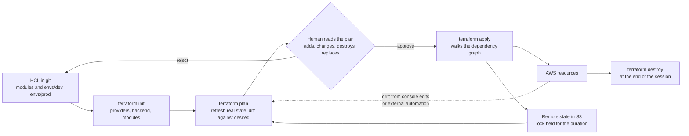
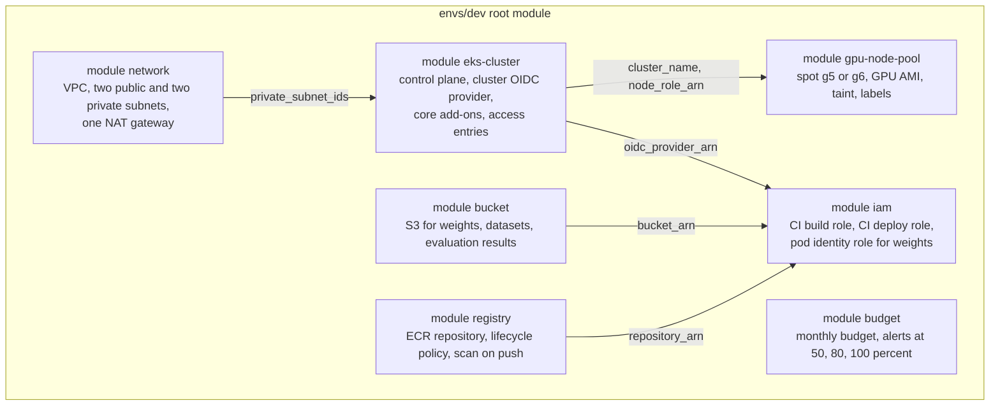
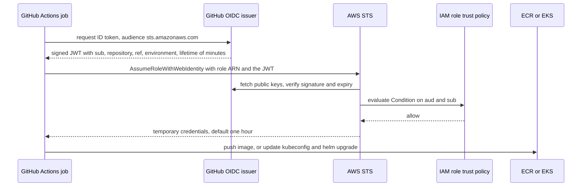
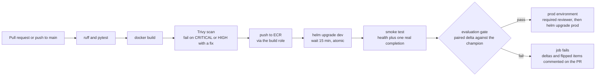

# Chapter 15: Infrastructure as Code and CI/CD

> **What you will be able to do:** describe a GPU cluster, its network, registry, storage, identities, and budget alarm as Terraform modules and create or destroy all of it with one command; explain state, locking, and drift and recover from a stuck lock; reason out a least-privilege IAM policy from what a workflow actually does; federate GitHub Actions to AWS with OpenID Connect and write the trust policy conditions that keep other repositories out; build a pipeline that lints, tests, builds, scans, pushes, deploys to dev, smoke-tests, runs an evaluation gate against the deployed endpoint, and promotes only on pass; put cost controls in the same code as the resources they protect.
>
> **Where it is used:** P2.4, P3.1, P5.2.
>
> **Prerequisites:** Chapter 14 (the objects the pipeline deploys, Helm), Chapter 11 (paired bootstrap, sample size, which the evaluation gate uses), Chapter 5 (the project template and Dockerfile).

## 15.0 The problem this chapter solves

A customer's security review asks three questions before your model server may enter their account: how is the infrastructure created, who can deploy to it, and what stops a bad model from reaching production. "I clicked through the console, I have an access key in a CI secret, and I ran the evaluation by hand" fails all three. The answers they accept are: the infrastructure is code in a repository, reviewed and applied from a plan; deployment identity is federated and short-lived, scoped to one repository and one branch; and promotion is gated by an automated evaluation whose criteria are written down.

There is a second, selfish reason. The roadmap's cost model assumes you destroy every cloud resource at the end of every session. Destroying by hand means forgetting. Destroying by code means one command, and a budget alarm created by the same code so that the alarm cannot be forgotten either. The definition of done for P2.4 is exactly this: apply and destroy both run clean from an empty account, a pull request that lowers evaluation accuracy fails visibly, and there are no static cloud credentials anywhere.

This chapter covers Terraform as the infrastructure language, IAM and OpenID Connect as the identity layer, GitHub Actions as the pipeline engine, and the evaluation gate as the step that makes the pipeline an ML pipeline. The statistics of the gate come from Chapter 11; here the question is how to turn them into a pass or fail that a runner can execute.

## 15.1 Terraform's model

Terraform describes cloud resources declaratively in HCL (HashiCorp Configuration Language), builds a dependency graph, compares the description with a recorded state and with the real cloud, and executes the difference. Five building blocks and three commands cover most of what you will write.

**Providers** are plugins that know a cloud's API: `aws`, `kubernetes`, `helm`, `github`. You pin their versions in a `required_providers` block. **Resources** are the things you create: `resource "aws_s3_bucket" "weights" { ... }` declares a bucket whose Terraform address is `aws_s3_bucket.weights`. **Data sources** read existing things you did not create: `data "aws_caller_identity" "current" {}` gives you the account ID. **Variables** are inputs (`var.cluster_name`) and **outputs** are exported values (`module.network.private_subnet_ids`). **Locals** are named expressions. **Modules** are directories of these that you call with `module "gpu_pool" { source = "../../modules/gpu-node-pool" ... }`; a module's variables are its interface and its outputs are what callers may depend on. Every `.tf` file in a directory belongs to one module; the directory you run commands in is the root module.

Terraform reads every reference (`module.cluster.name` inside the node pool call) as an edge in a graph, so it creates the cluster before the node pool without being told. When two resources have no reference between them it creates them in parallel. `depends_on` exists for the rare hidden dependency, such as an IAM policy that must exist before a node group starts.



*Figure 15.1: The Terraform loop. The plan is the review artifact. State is what Terraform believes exists, refreshed against the cloud before each plan.*

The three commands. `terraform init` downloads providers and modules and configures the backend. `terraform plan` refreshes the state from the cloud, computes the diff between desired and actual, and prints it: resources to add, change, destroy, and, most importantly, to replace, which is a destroy followed by a create. `terraform apply` executes a plan. Read every plan before applying. The line to fear is `must be replaced` on a cluster, a database, or a volume, because a replacement of an EKS cluster is a 25-minute outage and a replacement of a volume is data loss. It appears when you change an attribute the provider cannot update in place, such as a cluster's name or a node group's subnet list. The `lifecycle` block gives you `prevent_destroy = true` for resources that must never be replaced by accident, `create_before_destroy = true` for zero-gap replacement where the API allows two to coexist, and `ignore_changes` for attributes some other system owns, such as a node group's desired size when an autoscaler is adjusting it.

**Drift** is the gap between state and reality created outside Terraform: someone resized a node group in the console, or a Kubernetes controller created a load balancer. The plan shows drift as unexpected changes. Resolve it in one of two directions: apply to restore the code's version, or change the code (or run a refresh-only apply) to adopt reality. Never resolve it by editing the state file by hand. For resources created outside Terraform that should now be managed, `terraform import` brings them under management, and `moved` blocks rename addresses without destroying and recreating.

## 15.2 State, and why it is remote and locked

The state file records, for every managed resource, its Terraform address, its cloud identifier, and its last known attributes. Terraform needs it because cloud APIs cannot answer "which of these thousand security groups is the one I called `aws_security_group.gpu_nodes`". The state is the mapping. Lose it and Terraform believes nothing exists, plans to create everything again, and collides with what is there. Corrupt it and Terraform destroys the wrong thing.

Three properties follow. The state must be **shared**, because two people or a person and a pipeline must see the same mapping; a state file on one laptop makes the pipeline blind. It must be **locked** during plan and apply, because two concurrent applies against one state each read the same starting point, each write their own result, and the second write erases the first's knowledge of what it created. The orphaned resources keep billing with no record. It must be **protected and versioned**, because state contains secrets in plaintext (database passwords, generated tokens, anything a resource attribute returns), and because a versioned bucket lets you roll back a corrupted state.

The standard AWS backend is an S3 bucket with versioning and encryption. Locking used to require a DynamoDB table named in the backend block; since Terraform 1.10 the S3 backend can lock with a conditional write on a lock file next to the state (`use_lockfile = true`), and the DynamoDB option is on its way out. Check your version and use whichever your Terraform supports. The state bucket itself is the one resource you create by hand or with a tiny separate root module, because Terraform cannot store its state in a bucket it has not yet created. Restrict the bucket's IAM policy to the Terraform roles; nobody else needs to read state.

When an apply is killed mid-run the lock stays held and the next plan fails with a lock ID and the identity that holds it. Confirm that no apply is actually running, then release it with `terraform force-unlock <id>`. If an apply was interrupted, run a plan immediately afterwards and read it carefully; partial applies leave resources created and recorded, so the plan should be small.

## 15.3 Environments

Two conventions separate dev from prod. **Workspaces** keep one configuration directory and switch the state key with `terraform workspace select prod`; variables differ through `terraform.workspace` conditionals or per-workspace variable files. **Directories** keep `envs/dev/` and `envs/prod/` as separate root modules, each with its own backend key, each calling the same modules with different variables. Workspaces are lighter and tempt you to write `count = terraform.workspace == "prod" ? 3 : 1` throughout. Directories cost some duplication and give you what matters in a customer account: prod has its own state, its own backend permissions, and its own pipeline environment with approvals, and a mistake in dev cannot touch it because the dev role cannot read the prod state. The roadmap's P2.4 says "modules per environment"; directories are the interpretation this chapter uses. Terragrunt is a wrapper that reduces the duplication if it grows; you will not need it at two environments.

## 15.4 Module design for a GPU cluster

Design modules around what changes together and what someone else might reuse. Seven modules cover P2.4 and the capstone:



*Figure 15.2: Module composition for one environment. Arrows are outputs of one module consumed as variables of another; Terraform derives the creation order from them.*

**network**: a VPC with two public and two private subnets across two availability zones, an internet gateway, and one NAT gateway in dev (two, one per zone, in prod for availability). Outputs the subnet IDs. The NAT gateway is the expensive line item at idle (Chapter 14, section 14.8.2), so the dev module has a variable to skip it and use VPC endpoints for ECR and S3 instead when the nodes need nothing else from the internet.

**eks-cluster**: the control plane, its IAM role, the cluster's OIDC identity provider (which makes pod identity possible), the core add-ons (VPC CNI, CoreDNS, kube-proxy, the EBS CSI driver), and access entries mapping your IAM roles to Kubernetes groups. Outputs the cluster name, endpoint, certificate, node role ARN, and OIDC provider ARN. The community `terraform-aws-modules/eks` module does all of this well and is what most teams use; writing a thin one yourself once teaches you what it hides.

**gpu-node-pool**: a managed node group with a GPU AMI type, spot capacity, several instance types for spot availability, a taint, labels, a disk large enough for images and an `emptyDir` of weights, and `ignore_changes` on the desired size. Listing 15.1 shows it.

**registry**: an ECR repository with scan-on-push and a lifecycle policy that keeps the last ten tagged images and expires untagged ones after a day. Outputs the repository URL and ARN.

**bucket**: an S3 bucket with versioning, default encryption, public access blocked, and a lifecycle rule that moves old checkpoints to a cheaper storage class. Separate prefixes for weights, datasets, and evaluation results, because the IAM policies in the next section will be scoped to prefixes.

**iam**: the roles from section 15.5 and the GitHub OIDC provider from section 15.6. It consumes the bucket ARN, the repository ARN, and the cluster's OIDC provider ARN, which is why it depends on three other modules.

**budget**: an `aws_budgets_budget` with three notifications. It lives in the same root module as the cluster so that neither can be applied without the other. Section 15.11 shows it.

Module interfaces should be small and typed: every variable with a `type` and a `description`, defaults only where a safe one exists (`capacity_type = "SPOT"`, `min_size = 0`), and no default for anything that names a place (cluster name, subnet IDs). Outputs should be the identifiers other modules need and nothing else.

## 15.5 Least-privilege IAM and how to reason about it

An IAM policy statement has an effect (allow or deny), a list of actions (`ecr:PutImage`), a list of resource ARNs, and optional conditions. A principal (a role, a user) gets the union of its attached policies, and any explicit deny wins. Least privilege means each role can do exactly what its job requires on exactly the resources its job touches. The reasoning procedure:

1. **Enumerate the operations** the job performs, in order, as API calls. For "push an image to ECR": get an authorization token, check whether layers exist, upload layers, put the image manifest.
2. **Map operations to actions.** `ecr:GetAuthorizationToken`, `ecr:BatchCheckLayerAvailability`, `ecr:InitiateLayerUpload`, `ecr:UploadLayerPart`, `ecr:CompleteLayerUpload`, `ecr:PutImage`, `ecr:BatchGetImage`. The provider's documentation lists which actions each operation needs; when in doubt, run the job with a broad policy once against a dev account with CloudTrail on, then read the calls it actually made. IAM Access Analyzer can generate a policy from that trail.
3. **Scope every action to a resource ARN.** `arn:aws:ecr:us-east-1:123456789012:repository/fde-serving`, not `*`. A few actions have no resource-level scoping (`ecr:GetAuthorizationToken` is one) and must use `*`; list them separately so a reviewer sees why.
4. **Add conditions** where the ARN alone is too broad: `aws:RequestedRegion`, tags on the resource (`aws:ResourceTag/env`), or, for S3, a prefix in the resource ARN (`arn:aws:s3:::fde-artifacts/weights/*`).
5. **Split roles by stage.** A build role that can push images cannot deploy. A deploy role that can update a Helm release cannot push images or touch Terraform state. A Terraform role that can create infrastructure is assumed only by humans or by a separate, approval-gated workflow. If the build job is compromised through a malicious dependency, the attacker gets the ability to push an image and nothing else.
6. **Test with denial.** Run the job. If it fails with `AccessDenied`, the error names the action and the resource; add exactly that. Never respond to an access error by adding `*`.
7. **Review on a schedule.** IAM Access Analyzer reports actions a role has permission for but has not used in 90 days. Remove them.

**Worked example: the deploy role.** Its job is to update the kubeconfig and run `helm upgrade` in the `model-serving` namespace of the dev cluster. Cloud side: `eks:DescribeCluster` on the dev cluster's ARN, so it can fetch the endpoint and certificate. That is all; everything after that is Kubernetes API traffic, authorized by the cluster's access entry that maps this role to a Kubernetes group bound to a Role in `model-serving` (Chapter 14, section 14.2.9). The deploy role has no ECR write, no S3 write, no IAM, and no access to the Terraform state bucket. The trust policy (who may assume it) is the OIDC condition in the next section, restricted to the `main` branch or to the `dev` environment.

**The pod identity.** The vLLM pod that copies weights from S3 runs as a Kubernetes ServiceAccount associated with an IAM role (through IAM Roles for Service Accounts, or the newer EKS Pod Identity; check your cluster version). The role allows `s3:GetObject` and `s3:ListBucket` on the weights prefix of one bucket. Its trust policy accepts only that cluster's OIDC provider and only the subject `system:serviceaccount:model-serving:vllm-sql`. It is the same federation mechanism as GitHub's in the next section, applied to a pod instead of a workflow.

## 15.6 OpenID Connect federation for CI

A long-lived access key in a CI secret is a credential that never expires, can be copied by any workflow in the repository, appears in logs when someone echoes the environment, and is the way most cloud accounts are breached. Federation replaces it with a proof of identity minted per job.



*Figure 15.3: The OpenID Connect exchange. No secret is stored anywhere; the JWT proves which repository, branch, and environment is running, and the trust policy decides which of those may assume the role.*

The mechanics. GitHub runs an OpenID Connect identity provider. A job whose workflow grants `permissions: id-token: write` can ask it for a JSON Web Token (JWT) signed by GitHub, valid for minutes, carrying claims about the job. The `aud` (audience) claim is whatever the requester asked for; the AWS credentials action asks for `sts.amazonaws.com`. The `sub` (subject) claim encodes the identity in a fixed format: `repo:ORG/REPO:ref:refs/heads/main` for a push to main, `repo:ORG/REPO:pull_request` for a pull request, `repo:ORG/REPO:environment:prod` for a job that runs in a GitHub environment named `prod`. Other claims carry the repository, the ref, the actor, the workflow file, and the run ID.

On the AWS side you create an IAM OIDC identity provider once per account for GitHub's issuer, with the audience `sts.amazonaws.com`. Then each role's trust policy allows `sts:AssumeRoleWithWebIdentity` from that provider under conditions on the claims. STS verifies the JWT's signature against GitHub's published keys, checks expiry, evaluates the conditions, and returns temporary credentials for the role. The credentials last one hour by default (up to the role's maximum session duration), and a leaked one is useless after that.

The conditions are the whole security model. Three rules:

- Always condition on `aud` equal to `sts.amazonaws.com`. Without it a token minted for another audience could be replayed.
- Condition `sub` as narrowly as the job allows. `repo:ORG/REPO:ref:refs/heads/main` for the deploy role means only workflows running on the main branch of that one repository may deploy. `repo:ORG/REPO:environment:prod` binds the role to the GitHub environment, so a deployment must pass the environment's protection rules (required reviewers) before it can obtain credentials. A `StringLike` with `repo:ORG/REPO:*` allows any branch and any pull request, which means anyone who can open a pull request can deploy; use it only for read-only roles. `repo:ORG/*` allows every repository in the organization and is almost always a mistake.
- One role per job type. The build role's trust policy may accept pull requests (so a pull request can build and scan, but its role cannot push, or pushes to a scratch repository with a lifecycle policy). The deploy role's trust policy accepts main and the environments only.

Listing 15.2 shows the trust policy. GitHub lets an organization customize the `sub` claim to include the workflow file for reusable workflows, which lets a trust policy require that the deploy went through your shared pipeline definition rather than an ad hoc workflow in the same repository; that is the next step once several repositories share a pipeline.

## 15.7 GitHub Actions concepts

A **workflow** is a YAML file in `.github/workflows/` with triggers (`on: pull_request`, `on: push` to branches, `on: workflow_dispatch` with typed inputs for manual runs, `on: schedule` with cron, `on: workflow_call` to make it reusable). A workflow has **jobs**, which run in parallel unless one names another in `needs`. Each job runs on a **runner** (`ubuntu-latest` hosted by GitHub, or a self-hosted runner inside your network, which is how you reach a private cluster endpoint) and consists of **steps** that either `run` a shell command or `uses` an action from the marketplace pinned to a version or, better, a commit SHA. **Secrets** are encrypted values exposed as `${{ secrets.NAME }}`; **variables** are unencrypted configuration as `${{ vars.NAME }}`. With federation the only secrets left are the ones for services that lack OIDC, such as Modal or RunPod tokens and the Hugging Face token.

**Environments** are named deployment targets (`dev`, `prod`) with their own secrets and variables and with **protection rules**: required reviewers, a wait timer, and a restriction to specific branches. A job that declares `environment: prod` pauses until the rule is satisfied, and its OIDC token carries `environment:prod` in the subject, which the trust policy from section 15.6 can require. This is how "promotion to prod needs a human" is enforced by the identity layer rather than by convention.

**Reusable workflows** (`workflow_call`) let one pipeline definition serve several repositories with inputs. **Concurrency groups** prevent two deploys of the same environment from overlapping. **Artifacts** carry files between jobs (the SBOM, the evaluation report). The `permissions` block at the top of the workflow sets the default token permissions to the minimum (`contents: read`) and grants `id-token: write` only to jobs that federate and `pull-requests: write` only to the job that comments.

## 15.8 The ML pipeline with an evaluation gate



*Figure 15.4: The pipeline. Every stage before the gate is standard software delivery. The gate is what makes it an ML pipeline.*

The first six stages are ordinary and Listing 15.4 shows them. The smoke test deserves one sentence: it sends one real request with a known answer to the freshly deployed dev endpoint and checks the shape of the response, because a server that passes `/health` and returns garbage is a real failure mode after a quantization or tokenizer change.

### 15.8.1 What the gate compares

The gate runs the golden evaluation set (Chapter 11: frozen, stratified, versioned, no personal data) through the deployed dev endpoint, computes per-item correctness with the execution oracle, and compares against the **champion**: the stored per-item results of the version currently in production, produced by the same set at the time it was promoted. The comparison is paired, because the same items were answered by both systems, and the statistic is the paired difference in accuracy with its bootstrap interval (Chapter 11, section on paired bootstrap; the result is restated here, not derived).

Let $y_i^{\text{new}}$ and $y_i^{\text{champ}}$ be the correctness indicators (0 or 1) on item $i$, $N$ the number of items, $d_i = y_i^{\text{new}} - y_i^{\text{champ}} \in \{-1, 0, 1\}$, and $\bar{d}$ the mean difference, which equals the difference in accuracy. Let $\rho$ be the **discordance rate**, the fraction of items where the two systems disagree. Then

$$
\mathrm{Var}(d_i) = \rho - \bar{d}^{\,2} \approx \rho \quad\text{for small } \bar{d}, \qquad \mathrm{SE}(\bar{d}) \approx \sqrt{\rho / N}.
$$

**Worked example.** $N = 500$ items, the two systems disagree on 10 percent of them ($\rho = 0.10$). $\mathrm{SE}(\bar d) \approx \sqrt{0.10/500} = 0.0141$, about 1.4 accuracy points, so a 95 percent interval on the difference has a half-width of about 2.8 points. A gate that reads "fail if accuracy drops by more than 2 points" fires on pure noise with probability $P(Z < -2/1.41) = P(Z < -1.41) \approx 0.08$ when nothing changed, and misses a true 2-point regression about half the time. The set cannot enforce a 2-point threshold. The smallest regression it can detect with 80 percent power at the 5 percent level is $\delta \approx (1.96 + 0.84) \times 0.0141 \approx 0.040$, four points. To enforce 2 points you need $N \approx (2.80)^2 \times 0.10 / 0.02^2 \approx 1960$ items.

### 15.8.2 Pass criteria that the set can support

Write the gate as a conjunction of tests, each with its own message in the report:

1. **No detectable regression.** Fail if the upper bound of the 95 percent paired bootstrap interval for $\bar d$ is below zero. This is the test the statistics support: it fails only when the regression is distinguishable from noise at the set's size. Report the point estimate and the interval either way.
2. **Point-estimate warning.** Warn, without failing, if $\bar d < -0.01$. It appears in the comment so a reviewer sees a suspicious drift the set cannot confirm.
3. **Absolute floor.** Fail if the new accuracy is below a floor set from the customer's requirement (for example 0.70 on the golden set), independent of the champion. This catches a champion that has itself degraded.
4. **Per-slice checks.** For each stratum of the set (hard joins, aggregations, each schema), the same test as item 1 with a Bonferroni-adjusted level if there are many slices (Chapter 11). Fail only on detectable slice regressions; report all.
5. **Non-quality gates.** Fail if p95 latency at the smoke concurrency exceeds a budget, if the error rate is nonzero, or if the estimated cost per query rises by more than a set fraction.
6. **Flipped items.** List every item that the champion got right and the challenger got wrong, with the question and both outputs, in the pull request comment. Reviewers read these before the numbers.

The report is a Markdown file the gate writes and the workflow posts as a pull request comment, so a failing pull request shows the deltas where the author is looking. Store the challenger's per-item results as an artifact; when it is promoted they become the next champion file. Make the gate deterministic: temperature zero, a fixed seed where the engine honors one, cached outputs keyed by model version and prompt so that reruns do not pay twice, and a warm-up request so the first item does not measure a cold prefix cache. A gate that passes on rerun without a code change is a bug in the gate, not luck.

## 15.9 Container hygiene, Trivy, and the SBOM

Small, pinned, non-root images start faster, have fewer vulnerabilities, and pass a customer's scan. The rules:

- **Pin the base image by digest** (`FROM python:3.11-slim@sha256:...`) so that a rebuild next month produces the same layers. Update the pin deliberately, in a pull request that the scan checks.
- **Install from the lockfile** (`uv sync --frozen`) in a build stage and copy only the virtual environment into a slim runtime stage.
- **Run as a non-root user** with a fixed UID, and set the filesystem read-only except for a writable `/tmp` and the cache directories the engine needs. A container that escapes as root is a node compromise; one that escapes as UID 1000 is a nuisance.
- **Keep weights out of the image.** A 14 GB image takes 10 to 20 minutes to push and pull, fills the registry, and turns every model update into a rebuild. Mount weights from a volume or copy them at start (Chapter 14, section 14.2.6). The vLLM base image is already about 10 GB; do not double it.
- **Drop what the runtime does not need**: build tools, compilers, package caches, shells where possible.

**Trivy** scans an image's operating-system packages and language dependencies against vulnerability databases and reports findings by severity with the fixed version when one exists. In the pipeline it runs after the build and before the push, with `exit-code: 1` on CRITICAL and HIGH findings so that a vulnerable image never reaches the registry. Two settings keep it useful rather than noisy: `ignore-unfixed: true`, because a finding with no available fix cannot be acted on today (record it, revisit weekly), and a `.trivyignore` file in the repository where each accepted finding has a justification and an expiry date. When the scan fails on the base image, the right response is a slimmer or newer base, not an ignore entry. Trivy also scans Terraform and Kubernetes manifests for misconfigurations (`trivy config`), which section 15.13 uses.

A **software bill of materials** (SBOM) is a machine-readable inventory of everything in the image: packages, versions, licenses, hashes. Customers' procurement teams increasingly require one per release. Trivy emits CycloneDX or SPDX from the same scan; store it as a build artifact next to the image digest, and sign both with Sigstore's cosign once the customer asks for provenance. Listing 15.5 shows the two steps.

## 15.10 Training jobs from CI

A second workflow, triggered by `workflow_dispatch` with typed inputs (dataset revision, base model, learning rate, epochs, a run name), launches a training job on Modal or RunPod and uploads the resulting adapter to the Hugging Face Hub. In Phase 2 it looks like ceremony. In Phase 3 the flywheel calls it every week with the new dataset revision, which is why it exists now.

The shape: a job that checks out the repository, installs the launcher, and runs `modal run train.py` with the inputs as arguments, or calls RunPod's API to create a pod from a template whose start command pulls the repository at the workflow's commit, trains, uploads, and terminates itself. Modal and RunPod authenticate with API tokens (check whether your provider has added OIDC); store them as environment-scoped GitHub secrets, granted only to this workflow's environment, and rotate them on a schedule. The Hugging Face token likewise.

Three properties the workflow must have. **Idempotency**: derive the run name from a hash of the inputs and the commit, upload the adapter to a Hub revision named after it, and refuse to start if that revision exists, so a double click does not train twice. **Traceability**: log the W&B run URL, the dataset revision, the commit, and the resulting Hub revision as a job summary, so that Chapter 17's lineage graph has its edges. **Bounded cost**: pass a maximum wall-clock time to the provider (Modal's function timeout, RunPod's pod termination in the start script), so that a hung job cannot bill overnight; the roadmap's rule of asking before launching paid compute applies to this workflow's manual trigger, which is a human clicking a button with the inputs visible.

## 15.11 Cost controls in code

The controls belong in the same modules as the resources, so that no environment can exist without them.

**Budget alarms.** An `aws_budgets_budget` with a monthly limit and notifications at 50, 80, and 100 percent of it to an email address, in the same root module as the cluster. Budgets evaluate cost data a few times a day, so an alert can lag by 8 to 12 hours (as of September 2026; verify). At an assumed $1.01 per hour for an on-demand g5.xlarge, a forgotten instance spends about $24 a day; a $25 monthly budget's 80 percent alert arrives roughly a day into the mistake. The alarm is a backstop, not a control.

**Auto-shutdown** is the control. For a standalone GPU instance: a CloudWatch alarm on CPU utilization below 5 percent for six consecutive 5-minute periods with the EC2 stop action, or a hard time-to-live in the instance's user data (`shutdown -h +240` schedules a halt in four hours regardless of what is running). For a node group: `min_size = 0` and a scheduled scale-down, or the destroy discipline. For Kubernetes workloads: KEDA's cron scaler to zero outside working hours (Chapter 14).

**Spot capacity.** `capacity_type = "SPOT"` on the node group with several instance types listed so that a capacity shortage in one type does not stall the pool. Spot nodes get a two-minute warning before reclamation; a PDB and two replicas (Chapter 14) make serving survive it, and checkpointing (Chapter 3) makes training survive it. The discount is commonly 30 to 70 percent (as of September 2026; verify) and it is the difference between a $15 and a $40 phase budget.

**The destroy discipline.** A Makefile target that runs `terraform destroy` for the environment, invoked at the end of every session and by a scheduled workflow every night in dev with a confirmation input. Resources that Kubernetes created outside Terraform, a load balancer from a Service of type LoadBalancer or EBS volumes from PVCs, block the VPC's destruction because Terraform does not know about them. Uninstall the Helm releases (which deletes the Services and PVCs) before destroying, or the destroy fails on a dependency violation after twenty minutes; put the uninstall in the same Makefile target, first.

**Tags.** Every resource gets `env`, `project`, and `owner` tags through the provider's `default_tags`, so that the cost explorer can split the bill by project and the budget can filter on it.

## 15.12 Rollback strategies

Four layers roll back independently. **Application**: `helm rollback` to the previous revision, or `kubectl rollout undo`, within a minute plus the model load. This is the first response to a bad deploy. **Model**: the champion adapter's Hub revision is recorded; redeploying it is a values change, not a Helm chart change, and Chapter 17's registry aliases make it a one-line switch. **Infrastructure**: revert the Terraform commit and apply; the plan shows exactly what will change back, and most infrastructure rollbacks are small. **State**: the S3 bucket's versioning lets you restore a previous state file if an apply corrupted it, which is the last resort and should be followed by a plan and a careful read. Pin images by digest in the values files rather than by mutable tags, so that "roll back to the previous image" means the exact bytes that ran before.

## 15.13 Testing infrastructure code

Infrastructure code has the same test pyramid as application code, with slower and more expensive upper layers.

- **Static**: `terraform fmt -check` and `terraform validate` on every pull request; `tflint` for provider-specific mistakes; `trivy config` or `checkov` for security misconfigurations (a public bucket, an unencrypted volume, a security group open to the world).
- **Plan review**: a workflow that runs `terraform plan` on pull requests with a read-only role and posts the plan as a comment. The reviewer reads the plan, not the HCL.
- **Unit tests**: Terraform's native `terraform test` (1.6 and later; check your version) runs assertions against a plan or an apply of a module with test variables. Use it to assert that the GPU node group carries the taint and that the budget has three notifications.
- **Integration**: apply the dev environment from scratch, deploy the chart, run the smoke test, destroy. This is the P2.4 definition of done and costs about an hour and a few dollars per run (section 15.16). Run it on a schedule, weekly, not on every pull request.
- **Chart tests**: `helm lint`, `helm template` piped through a schema validator such as `kubeconform`, and an install into a kind cluster inside the workflow for the chart's own pull requests.

## 15.14 Implementation notes

**Listing 15.1: a Terraform module skeleton for a spot GPU node pool.**

```hcl
# modules/gpu-node-pool/variables.tf
variable "cluster_name" {
  type = string
}
variable "node_role_arn" {
  type = string
}
variable "subnet_ids" {
  type = list(string)
}
variable "instance_types" {
  type    = list(string)
  default = ["g5.xlarge", "g6.xlarge"]   # several types for spot availability
}
variable "capacity_type" {
  type    = string
  default = "SPOT"
}
variable "max_size" {
  type    = number
  default = 2
}

# modules/gpu-node-pool/main.tf
resource "aws_eks_node_group" "gpu" {
  cluster_name    = var.cluster_name
  node_group_name = "${var.cluster_name}-gpu"
  node_role_arn   = var.node_role_arn
  subnet_ids      = var.subnet_ids
  ami_type        = "AL2023_x86_64_NVIDIA"   # GPU AMI with the driver; check your version
  capacity_type   = var.capacity_type
  instance_types  = var.instance_types
  disk_size       = 100                       # images plus an emptyDir of weights

  scaling_config {
    desired_size = 1
    min_size     = 0
    max_size     = var.max_size
  }
  labels = { "node-pool" = "gpu" }
  taint {
    key    = "nvidia.com/gpu"
    value  = "present"
    effect = "NO_SCHEDULE"
  }
  update_config {
    max_unavailable = 1
  }
  lifecycle {
    ignore_changes = [scaling_config[0].desired_size]   # an autoscaler owns this
  }
}

# modules/gpu-node-pool/outputs.tf
output "node_group_id" {
  value = aws_eks_node_group.gpu.id
}
output "node_selector" {
  value = { "node-pool" = "gpu" }
}
```

The taint and label match the toleration and node selector in Chapter 14's Deployment; the module outputs the selector so the Helm values can be generated from Terraform outputs rather than typed twice. `ignore_changes` on the desired size is what lets a cluster autoscaler or KEDA-driven node scaling coexist with Terraform without every plan proposing to reset the count. `min_size = 0` is the cost control: the pool can be empty. The AMI type string is provider- and version-dependent; the two GPU-capable families at the time of writing are Amazon Linux 2023 with NVIDIA drivers and Bottlerocket with NVIDIA drivers.

**Listing 15.2: the backend block and the OIDC trust policy for the deploy role.**

```hcl
# envs/dev/backend.tf
terraform {
  required_version = ">= 1.10"
  backend "s3" {
    bucket       = "fde-terraform-state-123456789012"
    key          = "envs/dev/terraform.tfstate"
    region       = "us-east-1"
    encrypt      = true
    use_lockfile = true   # S3 native locking, Terraform 1.10 and later; older setups name a dynamodb_table
  }
}
```

```json
{
  "Version": "2012-10-17",
  "Statement": [{
    "Effect": "Allow",
    "Principal": {
      "Federated": "arn:aws:iam::123456789012:oidc-provider/token.actions.githubusercontent.com"
    },
    "Action": "sts:AssumeRoleWithWebIdentity",
    "Condition": {
      "StringEquals": {
        "token.actions.githubusercontent.com:aud": "sts.amazonaws.com",
        "token.actions.githubusercontent.com:sub": [
          "repo:aman-gupta/fde-14-serving:ref:refs/heads/main",
          "repo:aman-gupta/fde-14-serving:environment:dev"
        ]
      }
    }
  }]
}
```

The trust policy is written in JSON here because that is how IAM stores it; in Terraform you generate it with an `aws_iam_policy_document` data source and attach it as `assume_role_policy`. The `aud` condition is mandatory. The `sub` list allows exactly two identities: a workflow running on the main branch, and a job running in the `dev` environment. A pull request from a fork, a feature branch, or another repository fails the condition and receives `AccessDenied` from STS. The prod deploy role has a separate trust policy whose only subject is `environment:prod`, so credentials for production exist only inside a job that passed the environment's required reviewer.

**Listing 15.3: the GitHub Actions workflow through the evaluation gate.**

```yaml
name: serve-pipeline
on:
  pull_request:
  push:
    branches: [main]
permissions:
  contents: read
  id-token: write          # request the OIDC token
  pull-requests: write     # post the gate report
env:
  AWS_REGION: us-east-1
  IMAGE: ${{ vars.ECR_REPO }}:${{ github.sha }}
jobs:
  test:
    runs-on: ubuntu-latest
    steps:
      - uses: actions/checkout@v4
      - run: pip install uv && uv sync --frozen
      - run: uv run ruff check . && uv run pytest -q
  build-scan-push:
    needs: test
    runs-on: ubuntu-latest
    steps:
      - uses: actions/checkout@v4
      - uses: aws-actions/configure-aws-credentials@v4     # action majors: check your version
        with:
          role-to-assume: ${{ vars.AWS_BUILD_ROLE_ARN }}
          aws-region: ${{ env.AWS_REGION }}
      - uses: aws-actions/amazon-ecr-login@v2
      - run: docker build -t "$IMAGE" .
      # Trivy scan step from Listing 15.4 goes here, before the push
      - run: docker push "$IMAGE"
  deploy-dev-and-gate:
    needs: build-scan-push
    runs-on: ubuntu-latest
    environment: dev
    steps:
      - uses: actions/checkout@v4
      - uses: aws-actions/configure-aws-credentials@v4
        with:
          role-to-assume: ${{ vars.AWS_DEPLOY_ROLE_ARN }}
          aws-region: ${{ env.AWS_REGION }}
      - run: aws eks update-kubeconfig --name "${{ vars.EKS_CLUSTER }}"
      - run: >
          helm upgrade --install sql-dev charts/model-server -n model-serving
          -f charts/model-server/values-eks.yaml --set image.tag="${{ github.sha }}"
          --wait --timeout 15m --atomic
      - run: pip install uv && uv sync --frozen
      - run: uv run python scripts/smoke.py --url "${{ vars.DEV_ENDPOINT }}"
      - name: Evaluation gate
        run: >
          uv run evalkit gate --endpoint "${{ vars.DEV_ENDPOINT }}"
          --golden data/golden-v3.jsonl --champion results/champion.jsonl
          --floor 0.70 --report gate.md --results challenger.jsonl
      - if: always() && github.event_name == 'pull_request'
        run: gh pr comment "${{ github.event.pull_request.number }}" --body-file gate.md
        env:
          GH_TOKEN: ${{ github.token }}
      - uses: actions/upload-artifact@v4
        with:
          name: challenger-results
          path: challenger.jsonl
```

Three jobs chained by `needs`. The build job assumes the build role; the deploy job assumes the deploy role and runs inside the `dev` environment, which is what its OIDC subject will say. The Helm timeout of 15 minutes exceeds the 10-minute startup budget from Chapter 14 plus scheduling, and `--atomic` rolls back a failed deploy so the dev cluster is never left half-upgraded. The gate command is your `evalkit` from P1.6 with the criteria of section 15.8.2 encoded; it exits nonzero on failure, which fails the job. The comment step runs `if: always()` so that a failing gate still posts its report. A fourth job, `promote`, with `needs: deploy-dev-and-gate`, `if: github.ref == 'refs/heads/main'`, and `environment: prod`, repeats the deploy steps against the prod cluster with the prod role; it is omitted here because it is the same twelve lines with different variables and the environment's required reviewer in front of it.

**Listing 15.4: the Trivy scan and SBOM steps.**

```yaml
      - name: Scan image for vulnerabilities
        uses: aquasecurity/trivy-action@master   # pin to a release tag or commit SHA in your repo
        with:
          image-ref: ${{ env.IMAGE }}
          format: table
          exit-code: "1"              # fail the job on findings
          ignore-unfixed: true        # no fix available means nothing to act on today
          vuln-type: os,library
          severity: CRITICAL,HIGH
          trivyignores: .trivyignore  # accepted findings, each with a justification and expiry
      - name: Generate SBOM
        uses: aquasecurity/trivy-action@master
        with:
          image-ref: ${{ env.IMAGE }}
          format: cyclonedx
          output: sbom.cdx.json
      - uses: actions/upload-artifact@v4
        with:
          name: sbom
          path: sbom.cdx.json
```

The first step fails the build on any CRITICAL or HIGH finding that has a fix, which is the policy a customer's security team expects. The second step produces the SBOM from the same image in CycloneDX format and the third stores it with the run, so that every image digest in the registry has a bill of materials in the build history. The action's input names are stable across recent releases but check your version; pin the action to a release tag or SHA rather than the branch name shown here.

**Listing 15.5: the budget alarm, in the same root module as the cluster.**

```hcl
resource "aws_budgets_budget" "monthly" {
  name         = "fde-${var.environment}-monthly"
  budget_type  = "COST"
  limit_amount = var.monthly_budget_usd     # "25" for dev
  limit_unit   = "USD"
  time_unit    = "MONTHLY"

  dynamic "notification" {
    for_each = [50, 80, 100]
    content {
      comparison_operator        = "GREATER_THAN"
      threshold                  = notification.value
      threshold_type             = "PERCENTAGE"
      notification_type          = "ACTUAL"
      subscriber_email_addresses = [var.alert_email]
    }
  }
}
```

The `dynamic` block generates three notification blocks from one list. Because this resource lives in `envs/dev/main.tf` next to `module "eks_cluster"`, an apply that creates the cluster creates the budget, and a destroy removes both. If you want the budget to outlive the cluster (so that a forgotten resource still alarms), move it to the same tiny bootstrap module that creates the state bucket, and apply that once.

## 15.15 Failure modes

| Symptom | Likely cause | How to confirm | Fix |
|---|---|---|---|
| `Error acquiring the state lock` with a lock ID | A previous apply was killed | No other apply is running (check the pipeline and ask) | `terraform force-unlock <id>`, then plan and read it |
| Plan shows the EKS cluster or a volume `must be replaced` | An immutable attribute changed | The plan's `# forces replacement` marker on the attribute | Revert the attribute, or plan the outage; add `prevent_destroy` to that resource |
| Plan proposes to reset the node group desired size every run | An autoscaler owns the count | Diff shows only `desired_size` | `ignore_changes = [scaling_config[0].desired_size]` |
| Plan proposes to create everything although resources exist | State lost or wrong backend key | The backend block's key versus the bucket's contents | Point at the right key; if truly lost, `terraform import` each resource |
| `terraform destroy` fails on the VPC after 20 minutes | Load balancer or volumes created by Kubernetes, unknown to Terraform | The error names an ENI or a dependency violation | `helm uninstall` first; delete leftover load balancers and volumes; put the uninstall in the destroy target |
| `AccessDenied` on `sts:AssumeRoleWithWebIdentity` | `sub` or `aud` condition mismatch, or the job lacks `id-token: write` | Decode the job's token claims (the action can print them) and compare with the trust policy | Fix the subject string exactly; add the permission |
| Push to ECR denied | Build role's resource ARN does not match the repository, or missing `GetAuthorizationToken` | The denied action in the error | Add exactly that action on exactly that ARN |
| Trivy fails on findings in the base image with no fix | Old base image | Findings show `fixed version` empty | `ignore-unfixed: true`, and move to a newer or slimmer base |
| `helm upgrade --atomic` times out and rolls back a deploy that would have worked | Timeout below the startup budget | Pods reach Ready shortly after the rollback begins | `--timeout` above the startup budget plus scheduling |
| Gate passes and fails on alternate reruns with no code change | Nondeterminism: temperature, no seed, cold cache on the first item, flaky endpoint | Rerun the gate twice against the same deployment and diff per-item results | Temperature 0, seed, warm-up request, cached outputs keyed by version |
| Gate fails on every pull request by about 1 point | Champion results produced under different conditions (prompt version, tokenizer) | Compare the champion's metadata with the current run's | Regenerate the champion from the current production deployment |
| Budget alert arrives a day after the spend | Budgets evaluate cost a few times a day | Timestamp of the alert versus the instance launch | Auto-shutdown or TTL on instances; the budget is a backstop |
| Spot node group stays at zero with `InsufficientInstanceCapacity` | One instance type in one zone | The node group's health issues | List several instance types and both zones' subnets |
| Terraform plan in the pull request workflow shows secrets | Outputs or attributes marked non-sensitive | The plan text | Mark outputs `sensitive = true`; never print state |

## 15.16 On your machine

Terraform, the AWS CLI, `kubectl`, and Helm run in WSL2 on the CPU; nothing here touches the 4060. Authenticate the CLI with IAM Identity Center (`aws configure sso` and a browser login) rather than a stored access key, so that your laptop follows the same no-static-credentials rule as the pipeline. `terraform plan` is free and needs only read permissions; run it as often as you like.

**Cost of the definition of done.** An apply of the seven modules takes about 15 to 20 minutes (the EKS control plane alone is 10 to 15), a destroy about 10 to 15. Each cycle costs the control plane's $0.10 per hour for about half an hour, the NAT gateway for the same, and a spot GPU node for however long it runs, so roughly $0.50 to $1.50 per apply-destroy cycle when you leave the node pool at zero and about $3 when you bring up one spot node and deploy the chart (Chapter 14, section 14.8.2; prices as of September 2026; verify). The definition of done needs two clean cycles plus one full pipeline run: budget about two hours and $5. The state bucket and its lock cost fractions of a cent.

**Pipeline runs.** GitHub Actions minutes are unlimited for public repositories and limited per month for private ones under the free plan (check the current allowance). A full run with the 15-minute Helm wait and the gate takes 20 to 30 minutes of runner time. The gate against a 7B AWQ model on a g5.xlarge with 500 items at concurrency 16 and about 150 output tokens each takes 3 to 5 minutes; against your laptop's vLLM through a tunnel it is similar. For development, run the gate script locally against a kind deployment first, then against the dev cluster from the workflow; do not debug the gate's logic in the cloud at a dollar an hour.

**The deliberately regressing pull request.** Swap the adapter path in the values file for the P1.2 checkpoint from an earlier epoch with lower execution accuracy, open the pull request, and watch: the build and scan pass, the deploy to dev succeeds, the smoke test passes, and the gate fails with the flipped items listed in the comment. Take a screenshot for the write-up; it is the artifact that proves the pipeline is an ML pipeline.

**Training from CI.** Modal's free monthly credit (verify the current amount) covers several LoRA runs of the 1.5B model; a 7B QLoRA run on an A100 through Modal or RunPod costs the hourly price times the run time (about $1.39 per hour on RunPod Community Cloud as of September 2026; verify). The workflow's manual trigger is where the roadmap's rule about asking before paid compute lives.

## Exercises

**Exercise 15.1.** Write, in prose, a least-privilege policy for the deploy role: the cloud actions it needs, the resources they are scoped to, and what it must not be able to do.

<details><summary>Solution</summary>

Cloud permissions: `eks:DescribeCluster` on the ARN of the dev cluster only, so the job can write a kubeconfig. Nothing else on the cloud side: no ECR (the image was pushed by the build role), no S3 (weights are read by the pod's own identity), no IAM, no EC2, no access to the Terraform state bucket. Kubernetes permissions come from an access entry mapping the role to a group that has a Role in `model-serving` with create, get, list, watch, update, patch, and delete on deployments, replicasets, services, configmaps, secrets, ingresses, poddisruptionbudgets, horizontalpodautoscalers, serviceaccounts, and scaledobjects, plus get and list on pods and events for the wait and the smoke test. No cluster-wide permissions and no access to other namespaces. Trust policy: only `repo:ORG/REPO:ref:refs/heads/main` and `repo:ORG/REPO:environment:dev` with `aud` equal to `sts.amazonaws.com`. Session duration one hour. What it must not do: push images, read or write state, create IAM entities, reach the prod cluster, or be assumed from a pull request.

</details>

**Exercise 15.2.** Two engineers each have the state file on their laptops. Engineer A adds a second node group and applies. Engineer B, unaware, adds a bucket and applies from her copy. Describe what exists in the account, what each state file says, and what the next plan from each laptop proposes.

<details><summary>Solution</summary>

The account has the cluster, both node groups, and the bucket. A's state knows the cluster and both node groups but not the bucket. B's state knows the cluster and the bucket but not the second node group. A's next plan proposes to create the bucket (which fails on a name collision, or creates a second one if names are generated). B's next plan proposes to create the second node group, which succeeds and produces two node groups with different names, both billing, one of them unknown to A. If either engineer runs destroy, the other's resources survive with no state referring to them. Remote state with locking prevents all of this: both would read the same state, B's apply would block until A's lock released, and B's plan would then include A's node group.

</details>

**Exercise 15.3.** Design the gate's pass criteria for a golden set of 400 items on which the champion and a typical challenger disagree on about 12 percent of items. State what the set can and cannot detect.

<details><summary>Solution</summary>

$\mathrm{SE}(\bar d) \approx \sqrt{0.12/400} = 0.0173$, about 1.7 points. Minimum detectable regression at 80 percent power: $2.80 \times 0.0173 \approx 0.048$, about 5 points. Criteria: fail if the 95 percent paired bootstrap interval's upper bound is below zero; warn if $\bar d < -0.01$; fail if new accuracy is below the customer floor; per-slice detectable-regression checks with Bonferroni across, say, four slices; fail on p95 latency above budget or any errors in the smoke test; list flipped items. State in the report that the set detects regressions of about 5 points and that a 2-point threshold would need about $(2.80)^2 \times 0.12 / 0.02^2 \approx 2350$ items. Propose growing the set from production traces (Chapter 17) as the way to tighten the gate.

</details>

**Exercise 15.4.** Find the three problems in this trust policy fragment: `"StringLike": {"token.actions.githubusercontent.com:sub": "repo:aman-gupta/*"}` with no other conditions, on the prod deploy role.

<details><summary>Solution</summary>

First, no `aud` condition, so a token minted for another audience is accepted. Second, `repo:aman-gupta/*` matches every repository under that owner, any branch, any pull request, and any environment; anyone who can open a pull request in any of those repositories can assume the prod deploy role. Third, the prod role should be bound to the `prod` environment so that its protection rules apply: the subject should be exactly `repo:aman-gupta/fde-14-serving:environment:prod` under `StringEquals`, with `aud` equal to `sts.amazonaws.com`. A fourth, minor issue: `StringLike` is only needed for wildcards, and a wildcard has no place in a prod trust policy.

</details>

**Exercise 15.5.** A g5.xlarge is launched on demand at an assumed $1.01 per hour and forgotten for 9 days. Compute the cost, state when a $25 monthly budget's 50, 80, and 100 percent alerts fire, and explain what control would have limited the loss to under $5.

<details><summary>Solution</summary>

$9 \times 24 \times 1.01 = 218$ dollars. The 50 percent alert ($12.50) fires after about 12.4 hours of spend plus the evaluation lag of 8 to 12 hours, so roughly a day in; 80 percent ($20) at about 20 hours plus lag; 100 percent at about 25 hours plus lag. All three fire within the first two days and the instance runs for seven more if nobody acts. A CloudWatch alarm on CPU below 5 percent for 30 minutes with the stop action would have stopped it within an hour of the last real work, at a cost near $1; a `shutdown -h +240` in user data would have capped it at four hours, about $4.

</details>

**Exercise 15.6.** Someone increased the GPU node group's maximum size from 2 to 4 in the console during an incident. What does the next `terraform plan` show, and what are the two acceptable resolutions?

<details><summary>Solution</summary>

The refresh reads `max_size = 4` from the cloud while the code says 2, so the plan shows an in-place update of `scaling_config.max_size` from 4 back to 2. Resolution one: apply, restoring the code's value, if the incident is over and 2 is still right. Resolution two: change the code to 4 in a pull request that records why, and apply, which then shows no changes. Not acceptable: editing the state file by hand, or leaving the drift, because every future plan will carry the change and someone will eventually apply it during an unrelated deploy.

</details>

**Exercise 15.7.** Explain why the workflow in Listing 15.3 uses two different roles for the build job and the deploy job, and what an attacker who compromises a dependency in the test stage can do.

<details><summary>Solution</summary>

The build role can log in to ECR and push images; the deploy role can describe one cluster and, through Kubernetes RBAC, change one namespace. Neither can do the other's job. An attacker who runs code in the test job has no cloud credentials at all, because that job never assumes a role and has only `contents: read`. If the attacker's code runs in the build job, it can push an image to the repository, and the deploy job would then deploy that image, which is why the Trivy scan runs before the push, why the deploy uses the image digest produced by the build rather than a mutable tag, and why the evaluation gate stands between dev and prod. If the attacker's code runs in the deploy job, it can alter the dev namespace and nothing else, and cannot reach prod because the prod role trusts only the prod environment.

</details>

**Exercise 15.8.** Write the destroy target for the Makefile in prose: the ordered steps and why each is there.

<details><summary>Solution</summary>

Step one: `helm uninstall` every release in the cluster, which deletes the Services of type LoadBalancer and the PVCs, so that the cloud load balancers and EBS volumes they created are removed by Kubernetes rather than blocking Terraform. Step two: wait until the load balancers and volumes are gone (poll with the AWS CLI), because Kubernetes deletes them asynchronously. Step three: `terraform destroy` for the environment with the plan shown and a confirmation, which removes the node group, cluster, NAT gateway, and network in dependency order. Step four: verify with the AWS CLI that no EC2 instances, load balancers, NAT gateways, or unattached volumes remain in the region with the project tag. Step five: append the session's hours and cost to the log. The target refuses to run against prod without an explicit variable.

</details>

**Exercise 15.9.** The training workflow is triggered twice by accident with identical inputs. Design the behavior so that the second run costs nothing.

<details><summary>Solution</summary>

Compute a run key as the hash of the input values and the commit SHA. Before launching, query the Hub for a revision named by that key (or a marker file in the results bucket). If it exists, or if a lock object with that key was created in the last few hours, the job exits successfully with a summary saying the run already exists, before any paid compute starts. The training job itself writes the lock at start and the revision at the end, so a crash leaves a lock that expires. The job summary always links the W&B run, the dataset revision, and the adapter revision, so the second trigger's summary points at the first run's outputs.

</details>

## Summary

- Terraform builds a dependency graph from HCL, compares it with the recorded state and the real cloud, and executes the difference; the plan is the review artifact and `must be replaced` is the line to fear.
- State maps addresses to cloud identifiers and contains secrets; keep it in a versioned, encrypted S3 bucket with locking, never in the repository or on a laptop.
- Separate environments as directories with their own state and their own roles, so that dev credentials cannot touch prod.
- Seven modules cover a GPU cluster: network, cluster, GPU node pool, registry, bucket, IAM, and budget; the budget lives with the cluster so neither exists alone.
- Least privilege is a procedure: enumerate operations, map to actions, scope to ARNs, add conditions, split roles by stage, respond to denials with exactly the missing action, review unused permissions.
- OpenID Connect replaces stored keys with a per-job JWT; the trust policy's `aud` and `sub` conditions decide which repository, branch, and environment may assume the role, and a wildcard on the owner grants the whole organization.
- GitHub environments with required reviewers, combined with an `environment:prod` subject condition, make human approval a property of the identity layer.
- The evaluation gate compares per-item results against the stored champion with the paired bootstrap; with $N$ items and discordance $\rho$ the standard error is about $\sqrt{\rho/N}$, and the gate can only enforce what that lets it detect.
- Write the gate as a conjunction: no detectable regression, an absolute floor, per-slice checks, latency and error budgets, and a list of flipped items in the pull request comment.
- Pin base images by digest, run as non-root, keep weights out of the image, scan with Trivy before the push, and store an SBOM per image.
- Cost controls are code: budgets with alerts, auto-shutdown or a TTL on instances, spot capacity, `min_size = 0`, and a destroy target that uninstalls Helm releases first.
- Test infrastructure like software: format and validate, plan in pull requests, native module tests, and a scheduled apply-destroy cycle that is the definition of done.

## Further reading

- The Terraform documentation: Language (resources, modules, state, backends, workspaces, the `lifecycle` block) and the CLI reference for `plan`, `apply`, `import`, `force-unlock`, and `test`.
- Brikman, 2022, *Terraform: Up and Running*, third edition, for module design and the state discussion.
- The AWS IAM documentation: policy evaluation logic, the JSON policy reference, IAM Access Analyzer policy generation, and IAM Roles for Service Accounts and EKS Pod Identity in the EKS documentation.
- GitHub Docs, "About security hardening with OpenID Connect" and "Configuring OpenID Connect in Amazon Web Services," for the claims and the subject format.
- GitHub Docs, "Workflow syntax for GitHub Actions" and "Using environments for deployment."
- The Trivy documentation (image scanning, misconfiguration scanning, SBOM generation) and the CycloneDX and SPDX specifications.
- Humble and Farley, 2010, *Continuous Delivery*, for the deployment pipeline pattern the gate extends.
- Forsgren, Humble, and Kim, 2018, *Accelerate*, for the evidence on deployment frequency and lead time.
- Sculley et al., 2015, "Hidden Technical Debt in Machine Learning Systems," and Breck, Cai, Nielsen, Salib, and Sculley, 2017, "The ML Test Score: A Rubric for ML Production Readiness and Technical Debt Reduction," for why the gate exists.
- Beyer, Jones, Petoff, and Murphy, 2016, *Site Reliability Engineering*, the chapter on release engineering.
