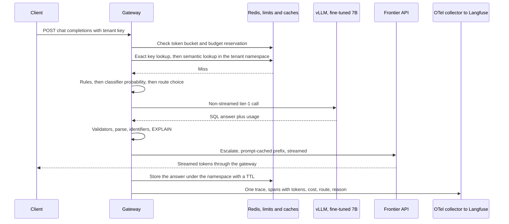
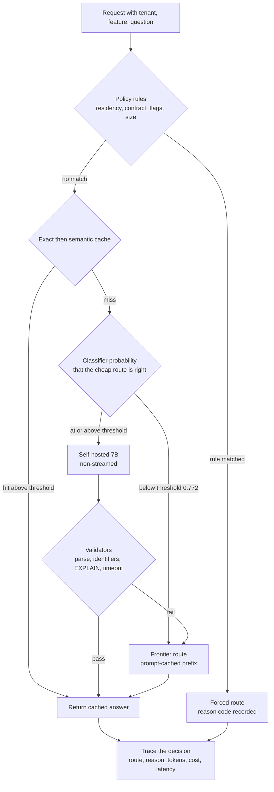
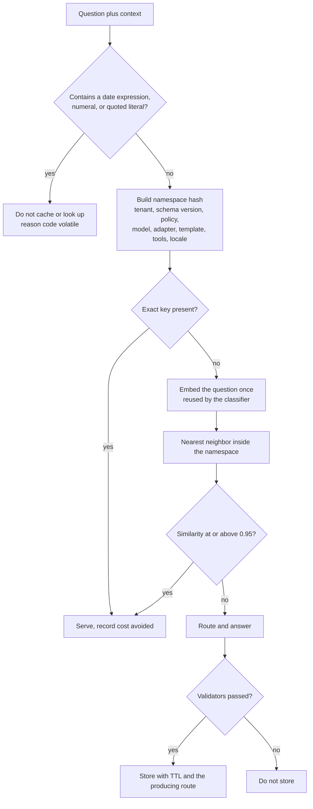
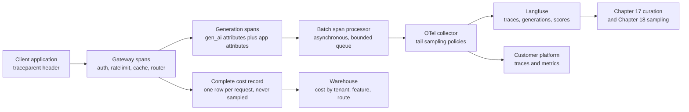
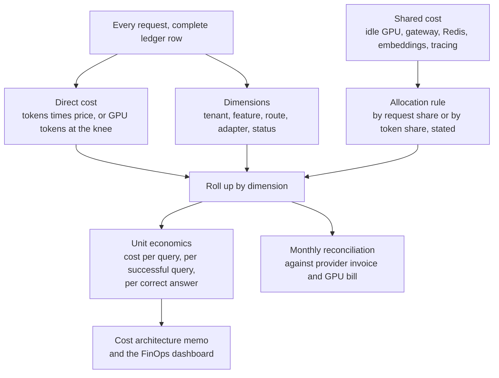

# Chapter 16: Gateways, Routing, and Cost Engineering

> **What you will be able to do:** list what a gateway owns and what it must never own; train a complexity classifier on per-item outcomes and set its threshold from the value of a correct answer; compute the expected cost and expected accuracy of a cascade and say which escalation signal earned it; choose a semantic-cache threshold from a measured false-hit curve instead of a hit-rate curve; keep a frontier prompt cache alive and name the things that silently kill it; instrument a request with OpenTelemetry attributes that make cost per tenant a query; write the one-page cost architecture memo with its assumptions.
>
> **Where it is used:** P2.5 (the gateway, router, cache, and memo), P3.1 (the flywheel curates the traces this chapter emits), P3.4 (the FinOps view is built on this attribution).
>
> **Prerequisites:** Chapter 11 (paired intervals, so that "equal quality" means something), Chapter 13 (the serving cost model and prefix caching). Chapter 17 consumes these traces. Chapter 20 takes the resilience patterns further and turns these metrics into objectives.

## 16.0 The problem this chapter solves

P2.2 left you with a fine-tuned 7B on a rented A100 that answers a text-to-SQL workload for about 0.000069 dollars per request, and a frontier API that answers the same workload for about 0.0069 dollars per request, a hundredfold difference. It also left you with a measurement you cannot ignore: on the held-out evaluation set the 7B is right 84 percent of the time and the frontier model is right 92 percent of the time. The customer will not accept 84 percent, and will not pay for 92 percent at the frontier price across two million requests a day.

The gateway is where that tension is resolved. It is one service in front of every model, and its most valuable job is choosing the cheapest route that will answer each request well enough. Around that choice sit the things that make the choice safe to operate: authentication, per-tenant budgets, rate limits, timeouts, fallbacks, and a trace for every request that records what was chosen, why, what it cost, and how good it was. Without the trace the routing is a guess; with it, the router is a model you can improve every week from production data, which is what Chapter 17 does.

Two numbers decide whether the design works, and both are easy to fake. The first is blended cost per query, which is only meaningful next to the second, quality with a confidence interval, measured paired against the baseline on the same items. P2.5's definition of done is a blended cost cut by at least half against a frontier-only baseline at equal measured quality. The honest version of that claim compares against the best baseline, which is the frontier route with prompt caching enabled, not the naive one. This chapter builds toward that comparison.

A third number is quieter and ends more engagements than either: the false-hit rate of the semantic cache. A cache that returns last week's revenue number for this week's question is not a performance optimization, it is a wrong answer delivered with full confidence. Section 16.3 measures it before tuning anything.

## 16.1 What a gateway is responsible for

A gateway is a reverse proxy that speaks the OpenAI-compatible API (Chapter 13, section 13.10) on both sides. Clients send it chat completion requests. It sends chat completion requests to vLLM, to a frontier API, or to nothing at all when a cache answers. Its responsibilities, in the order they execute:

| Responsibility | What it does | Where it lives |
|---|---|---|
| Authentication | Maps an inbound key to a tenant, a set of allowed models, and a policy record. Virtual keys per tenant, rotated on a schedule | Edge, before anything else |
| Authorization and policy | Rejects a model the tenant may not use; enforces data residency; applies feature flags | Edge |
| Quotas and budgets | Token-bucket rate limit per tenant and per key; monthly spend budget with a soft and a hard threshold | Edge, backed by Redis |
| Normalization | One request shape, model aliases resolved to a concrete route, defaults applied, prompt assembled from the template | Before routing |
| Safety hooks | Input classifier and output validators from Chapter 19 | Around the model call |
| Routing | Rules, then classifier, then cascade, with a logged reason code | Section 16.2 |
| Caching | Exact cache, then semantic cache, then the provider's prompt cache on the chosen route | Sections 16.3 and 16.4 |
| Resilience | Timeouts, retries with jitter on idempotent calls, circuit breakers, fallbacks, bulkheads, load shedding | Chapter 20, section 20.5 |
| Accounting and tracing | One trace per request with tokens, cost, route, reason, and latency attributes | Sections 16.5 and 16.6 |

Two responsibilities are commonly assumed and should not be. The gateway is not the place for business logic that belongs to the application, because every team then needs a gateway release to ship a feature. And the gateway is not a place to store prompts long term without redaction, because the trace store is a copy of everything users typed (Chapter 17, section 17.4).

### 16.1.1 Rate limits and budgets

A token bucket holds at most $B$ tokens and refills at $r$ tokens per second. A request consumes one token, or $n$ tokens if you meter by model tokens rather than requests. The bucket admits a burst of $B$ and a sustained rate of $r$. For a tenant allowed 3 requests per second with bursts to 30, set $r = 3$ and $B = 30$: after an idle minute the tenant can fire 30 requests immediately, then settles at 3 per second. A fixed-window counter of 180 per minute would allow 360 requests across a window boundary, which is why the bucket is the default.

Budgets are different from rate limits because the cost of a request is not known until it finishes. Enforce them in two steps. Before the call, reserve an estimate: $n_{\text{in}} p_{\text{in}} + n_{\max} p_{\text{out}}$, where $n_{\max}$ is the request's `max_tokens`, $p_{\text{in}}$ and $p_{\text{out}}$ are the route's per-token prices. After the call, reconcile against the actual usage and release the difference. Without the reservation, a tenant with one dollar left can start a thousand concurrent long generations. Set a soft threshold at 80 percent of the monthly budget that warns and annotates the trace, and a hard threshold at 100 percent that degrades rather than fails where the contract allows: route to the cheap model and mark the response, which is a better customer experience than a 429 and is auditable because the reason code is in the trace.

### 16.1.2 The gateway's own latency budget

Everything the gateway does sits in front of the model's time to first token. Measure each stage and keep the total under about 5 percent of the p50 time to first token, or the gateway becomes the latency. A realistic budget against a 400 ms p50 time to first token:

| Stage | Typical cost | Notes |
|---|---|---|
| Authentication and policy | 1 ms | In-process cache of the key record, refreshed asynchronously |
| Rate limit and budget reservation | 1 to 3 ms | One Redis round trip; pipeline it with the cache lookup |
| Exact cache lookup | 1 ms | Hash and a Redis GET |
| Embedding for the semantic cache | 5 to 15 ms | Local small encoder; this is the largest term |
| Vector search | 2 to 5 ms | Redis vector index over a bounded namespace |
| Classifier | 1 ms for features, 5 to 10 ms for a small encoder | Reuse the cache embedding if the encoder is the same |
| Telemetry | under 0.1 ms | Batched and asynchronous, never a blocking export |

Reusing one embedding for both the cache lookup and the classifier is the single best saving here, and it is free if you choose the same encoder for both.

### 16.1.3 Streaming changes what is possible

Once the first byte of a streamed response has reached the client, the gateway can no longer change its mind. A fallback after that point means the user watches one answer stop and another start. Three consequences. Retries are only invisible before the first token, so the retry policy is "retry on connect errors, 429, 5xx, and timeouts that occur before the first token, never after". Validators that gate the response must either run on a non-streamed answer or be tolerated as post-hoc annotations. A cascade whose escalation depends on the full tier-1 answer cannot stream tier 1 to the user, so tier 1 runs non-streamed and only the final answer streams. That last point costs time to first token on escalated requests and is the real latency price of a cascade, covered in section 16.2.



*Figure 16.1: The request lifecycle, with the escalation path and the single trace that carries every attribute later chapters query.*

## 16.2 Routing policies

Three families, applied in this order: rules, then a classifier, then a cascade. Rules are deterministic and auditable, so they come first. The classifier decides before spending anything. The cascade decides after seeing tier 1's answer, which is the most informative signal available and the most expensive to obtain.

### 16.2.1 Rules

Rules are the policy the customer signed. Typical set: a tenant whose contract forbids sending data to a third party always routes to the self-hosted model; requests classified as containing regulated data route to the in-region deployment; a feature flag pins one product surface to one model during a comparison; requests over a token threshold route to a long-context model; a deprecated model alias remaps to its successor. Each rule emits a reason code that goes on the trace, and the reason codes are a closed set, so "why did this request go to the frontier" is a group-by, not an investigation.

Rules must be evaluated before the classifier, and a rule match must short-circuit. A probabilistic router that can override a residency rule is a finding in a security review (Chapter 19, section 19.1).

### 16.2.2 A complexity classifier trained on per-item outcomes

The classifier predicts, before any model runs, the probability that the cheap route will answer this request correctly. Everything about it follows from where the labels come from.

**Labels.** Run both routes over the evaluation set. Score each item with the oracle (execution accuracy against the reference result set, Chapter 11, section 11.1). The label is $y_i = 1$ if the cheap route was correct on item $i$, and 0 otherwise. Record the cost of each route on each item too, because the threshold is an economic decision and needs the cost distribution, not just the mean. This is a per-item outcome table, and it is the artifact P2.5 asks for. Chapter 17's flywheel regenerates it every week from production traces, where the oracle is the executed query, so the classifier is retrained on the distribution it actually serves.

**Features.** Start with cheap ones, because they cost nothing at inference: question length in tokens, the number of tables and columns in the retrieved schema, counts of keyword classes in the question (aggregation, join hints, date arithmetic, window phrasing, superlatives, negation), the number of retrieved schema chunks and the retriever's top score, the tenant identifier as a categorical, and the historical accuracy of the cheap route on the question's nearest intent cluster. A logistic regression on twenty such features is a strong baseline and is interpretable enough to show a customer. Then try a small encoder: a 22M-parameter MiniLM-class sentence encoder with a classification head, fine-tuned on the questions themselves, which picks up phrasings the features miss. Report both, and keep the simpler one unless the encoder wins on the cost-quality curve, not on the area under the receiver operating characteristic curve.

**Splits.** Split by schema and by tenant, not by item. Two questions about the same schema share almost all of their features, so a random item split reports an accuracy the router will never reproduce on a new customer. When training on production data, split by time as well: train on weeks 1 to 3, evaluate on week 4. A classifier evaluated on a random split of a single tenant's traffic is the most common way this component gets shipped broken.

**Calibration.** The threshold rule below uses the predicted probability as a probability, so it must be calibrated. Check with a reliability curve: bucket predictions into ten bins and compare the mean prediction with the observed accuracy in each bin. Summarize with the Brier score $\frac{1}{n}\sum_i (\hat{p}_i - y_i)^2$, where $\hat{p}_i$ is the predicted probability and $y_i$ the outcome. If the curve bends, fit Platt scaling or isotonic regression on a held-out slice. A gradient-boosted tree is usually well calibrated out of the box; a fine-tuned encoder usually is not.

**The threshold is an economic decision.** Let $\hat{p}$ be the predicted probability that the cheap route is correct, $a_2$ the measured accuracy of the expensive route on the requests that reach it, $c_1$ and $c_2$ the costs per request of the two routes, and $V$ the value of a correct answer in dollars (equivalently, the cost of a wrong one). Escalating is worth it when the expected gain in value exceeds the extra cost:

$$(a_2 - \hat{p}) V > c_2 - c_1 \quad \Longleftrightarrow \quad \hat{p} < a_2 - \frac{c_2 - c_1}{V}$$

Worked example. $a_2 = 0.80$ on the hard requests, $c_2 = 0.00285$ dollars with prompt caching, $c_1 = 0.000069$ dollars, so $c_2 - c_1 = 0.00278$. Value of a correct answer $V = 0.10$ dollars, an assumed figure standing for the analyst minute a wrong query costs. The threshold is $0.80 - 0.0278 = 0.772$: escalate when the classifier gives the cheap route less than a 77 percent chance.

Sensitivity to $V$, which is the assumption a customer will argue about:

| Value of a correct answer $V$ | Threshold $\hat{p}^*$ | Behavior |
|---|---|---|
| 0.01 dollars | 0.522 | Cost dominates; escalate only when the cheap route is nearly a coin flip |
| 0.10 dollars | 0.772 | The worked example |
| 1.00 dollars | 0.797 | Almost "escalate whenever the frontier is more likely right" |
| 10.00 dollars | 0.7997 | Cost is noise; route on quality alone |

The table says something useful for a discovery conversation: above a value of about one dollar per correct answer, cost engineering stops changing the routing policy and starts being purely a serving problem. Below ten cents, the routing policy is the product.

### 16.2.3 The cascade and its confidence signals

A cascade runs the cheap route first and escalates when a signal says the answer is probably wrong. Four signals, in increasing order of usefulness for text-to-SQL:

- **Self-reported confidence.** Asking the model to rate its confidence is cheap and weakly informative at best. Models are poorly calibrated on their own correctness and the rating consumes output tokens. Do not use it as the only signal.
- **Token log probabilities.** For a self-hosted model you have them. The mean log probability of the generated tokens, or the minimum token probability over the query, correlates with correctness better than self-report and costs nothing. It is sensitive to length, so normalize, and it is useless for a frontier route that does not return log probabilities.
- **Sample agreement.** Draw $k$ samples at a non-zero temperature and escalate when they disagree. For SQL, compare normalized query text or, better, execution result sets. This is a strong signal and costs roughly $k$ times the tier-1 decode; with prefix caching the prompt is prefilled once, so three samples cost about twice one sample in wall-clock time, not three times.
- **Validators.** Deterministic checks: the SQL parses; every identifier exists in the schema; the statement is a single read-only `SELECT`; `EXPLAIN` succeeds against the database; execution finishes inside a timeout; the result set is not trivially empty when the question implies rows. For text-to-SQL this is the strongest signal per dollar. It costs a parse and one planner call, under 10 ms, and it catches the failure classes that matter.

Measure any signal the same way: as a binary classifier of "tier 1 was wrong". Report its true positive rate $\text{TPR} = P(\text{escalate} \mid \text{tier 1 wrong})$ and its false positive rate $\text{FPR} = P(\text{escalate} \mid \text{tier 1 right})$ on the evaluation set. Everything downstream is arithmetic on those two numbers.

### 16.2.4 Expected cost and expected accuracy of a cascade

Let $a_1^{\text{raw}}$ be the accuracy of tier 1 over all requests, $\text{TPR}$ and $\text{FPR}$ the escalation signal's rates, $c_1$ and $c_2$ the per-request costs, $c_s$ the cost of computing the signal, and $a_2$ the accuracy of tier 2 on the requests it receives. The escalation rate is

$$e = \text{TPR}\,(1 - a_1^{\text{raw}}) + \text{FPR}\, a_1^{\text{raw}}$$

Tier 1 runs on every request, so the expected cost is

$$\mathbb{E}[C] = c_1 + c_s + e\, c_2$$

and the expected accuracy is the correct answers tier 1 keeps plus the correct answers tier 2 supplies:

$$\mathbb{E}[A] = a_1^{\text{raw}}(1 - \text{FPR}) + e\, a_2$$

The first term counts requests tier 1 got right and was not escalated away from. Requests tier 1 got wrong and kept contribute nothing.

**Worked example.** The text-to-SQL workload of Chapter 13: 1,500-token stable prefix, 50-token question, 150-token answer. Measurements from P2.2 and P2.5, with API prices marked assumed at 3.00 dollars per million input tokens and 15.00 per million output tokens.

- $c_1 = 0.000069$ dollars, the self-hosted 7B at the knee at 60 percent utilization (Chapter 13, section 13.12).
- $c_s \approx 0$ in dollars: the validator suite is a parse plus an `EXPLAIN`, about 8 ms.
- $c_2 = 0.0069$ dollars uncached, or $0.00285$ with prompt caching (section 16.4).
- $a_1^{\text{raw}} = 0.84$, $a_2 = 0.80$ on escalated requests, which are the hard ones.
- Validator plus classifier together: $\text{TPR} = 0.75$, $\text{FPR} = 0.12$.

Escalation rate: $e = 0.75 \times 0.16 + 0.12 \times 0.84 = 0.120 + 0.1008 = 0.2208$, about 22 percent.

Expected cost with prompt caching on the frontier route: $\mathbb{E}[C] = 0.000069 + 0.2208 \times 0.00285 = 0.000069 + 0.000629 = 0.000698$ dollars.

Expected accuracy: $\mathbb{E}[A] = 0.84 \times 0.88 + 0.2208 \times 0.80 = 0.7392 + 0.1766 = 0.9158$.

Against the fair baseline, the frontier route alone with prompt caching at $0.00285$ dollars and accuracy 0.92, the cascade costs 4.1 times less and scores 0.4 points lower. That difference is inside the noise: on 500 paired evaluation items with a discordance rate of 0.10, the standard error of the paired difference is about $\sqrt{0.10/500} = 0.014$, so the 95 percent interval is roughly $\pm 2.8$ points (Chapter 11, section 11.4). "Equal measured quality" means non-inferior at a stated tolerance, and the tolerance belongs in the memo.

**Latency.** The 22 percent of requests that escalate pay both routes. If tier 1 takes 600 ms non-streamed and the frontier's time to first token is 500 ms, escalated requests see about 1.1 seconds to first token against 500 ms for a frontier-only system. The blended p50 barely moves, and the p90 moves a lot. Report latency by route and blended, and decide with the customer whether the p90 is acceptable before you optimize the cost further.

**Three tiers.** The formula composes. With escalation rates $e_1$ from tier 1 and $e_2$ from tier 2:

$$\mathbb{E}[C] = c_1 + e_1\left(c_2 + e_2 c_3\right)$$

Three tiers are rarely worth the complexity unless the middle tier is genuinely different in kind, for example a larger self-hosted model on the same GPU pool rather than a slightly better prompt.



*Figure 16.2: The routing decision, with rules short-circuiting everything and the validator failure as the escalation trigger.*

## 16.3 Semantic caching

### 16.3.1 Exact first

An exact cache keyed on a hash of the fully assembled request costs nothing and has no false hits. It catches retries, dashboard refreshes, duplicate submissions, and the same analyst pressing the button twice. Measure its hit rate before adding anything clever. On analyst workloads it is commonly a few percent, and every one of those hits is free and safe.

### 16.3.2 The key is a namespace, not part of the similarity

A semantic cache embeds the user's question and returns a stored answer when a previous question is close enough. The mistake that produces wrong answers is folding context into the embedding and hoping similarity handles it. It does not. Everything that changes the correct answer goes into a namespace, and similarity search happens only inside a namespace.

The namespace is a hash of: tenant identifier, schema version (a hash of the DDL), row-level security or policy context identifier, model and adapter version, prompt template version, tool or function set hash, and locale. Two requests in different namespaces can never match, whatever their embeddings say. Adding the adapter version means Chapter 17's promotion automatically invalidates the cache, which is correct: the new model may answer differently and you do not want last week's model's answers attributed to this week's.

### 16.3.3 What must never be cached

Anything time-sensitive: a question containing "today", "yesterday", "this week", "so far this year", "now", or a relative period. Anything containing an entity identifier or literal that is not in the namespace, because "revenue for account 88213" and "revenue for account 88214" embed at a cosine similarity well above any threshold you would pick and have different answers. Anything routed for a policy reason rather than a quality reason. Anything whose answer failed a validator or was a refusal, because caching a refusal makes it permanent.

The safe rule for the roadmap's workload: refuse to cache a question containing a numeral, a date expression, or a quoted literal unless that literal is lifted into the key. That refusal costs hit rate and buys the false-hit rate down by more than any threshold change.

### 16.3.4 Choosing the threshold from a measurement

Let $\tau$ be the cosine similarity threshold, $h(\tau)$ the hit rate (share of requests served from cache), and $\phi(\tau)$ the false-hit rate, defined as the fraction of hits whose returned answer is wrong for the new question. Protocol for measuring both:

1. Build a replay set of at least 2,000 questions shaped like production, including deliberate near-miss pairs: the same question with a different filter value, a different date range, a different entity. Chapter 10's taxonomy sampler generates these cheaply.
2. Replay them in time order through the cache with the candidate $\tau$, populating it as you go.
3. For every hit, judge correctness with the oracle: execute the cached SQL and the reference SQL for the new question and compare result sets. This makes $\phi$ a measurement, not an opinion.
4. Repeat for a ladder of $\tau$ and tabulate.

An illustrative result from such a replay, the shape you should expect rather than numbers to reuse:

| Threshold $\tau$ | Hit rate $h$ | False-hit rate $\phi$ | Wrong answers per 10,000 requests |
|---|---|---|---|
| 0.85 | 0.34 | 0.19 | 646 |
| 0.90 | 0.27 | 0.080 | 216 |
| 0.93 | 0.21 | 0.031 | 65 |
| 0.95 | 0.16 | 0.011 | 18 |
| 0.97 | 0.09 | 0.002 | 2 |

The last column, $10^4 h \phi$, is the one to show a customer. Tuning on hit rate alone picks 0.85 and ships 646 confidently wrong answers per 10,000 requests.

**The break-even condition.** With system accuracy $a$ on the live path, accuracy with the cache in front is

$$a_{\text{cached}} = (1 - h)\,a + h\,(1 - \phi)$$

so the cache does not hurt accuracy as long as $\phi \le 1 - a$. With $a = 0.9158$ from section 16.2, that is $\phi \le 0.084$, which the table meets comfortably at $\tau = 0.95$. At $\tau = 0.95$: $a_{\text{cached}} = 0.84 \times 0.9158 + 0.16 \times 0.989 = 0.7693 + 0.1582 = 0.9275$. The cache raises measured accuracy, which is not a paradox: repeated questions are the easy ones, and the stored answers passed a validator before they were stored.

Two honest caveats. The arithmetic treats a cache error and a model error as equal, and they are not: a wrong answer to a question the system answered correctly yesterday reads as a bug, not as model variance, and costs more trust than the numbers say. And $\phi$ measured on a replay underestimates production, because production contains question shapes the replay set does not. Set $\phi_{\max}$ well below what the accuracy arithmetic allows. A budget of 1 percent of hits is a defensible starting point, and it is yours to set, not the router's.

### 16.3.5 Lifetime, invalidation, and write policy

Time to live is short: 15 minutes to a few hours for analytical questions over data that updates during the day, longer for questions over a static reference schema. Explicit invalidation on schema version change and on adapter promotion is handled by the namespace, since the namespace hash changes. Size cap with least-recently-used eviction. Cache only answers that passed the validator, and record on each entry the route that produced it, so that a frontier answer served to a cheap route is still attributed correctly (section 16.6).

### 16.3.6 The cost effect

Let $c_{\text{cache}}$ be the marginal cost of a lookup, dominated by the amortized cost of the Redis instance and the embedding compute. Blended cost is

$$\bar{c} = (1 - h)\,\mathbb{E}[C] + h\, c_{\text{cache}}$$

With $\mathbb{E}[C] = 0.000698$, $h = 0.16$, and an assumed $c_{\text{cache}} = 0.000002$ dollars: $\bar{c} = 0.84 \times 0.000698 + 0.16 \times 0.000002 = 0.000586 + 0.0000003 = 0.000587$ dollars per query. Against the fair baseline of 0.00285 dollars, that is 4.9 times cheaper. Against the naive uncached frontier baseline of 0.0069, 11.8 times. Quote the first number.



*Figure 16.3: The cache decision. The volatility check and the namespace do more for correctness than the threshold does.*

## 16.4 Prompt caching on frontier APIs

Chapter 13, section 13.4 covered prefix caching inside a self-hosted engine: identical leading blocks of the key-value cache are reused and their prefill is skipped. Frontier APIs expose the same mechanism as a billing feature. The differences that matter operationally:

- **Explicit breakpoints.** Several providers require you to mark where the cacheable prefix ends rather than inferring it. The number of breakpoints is small, so spend them on the boundaries that change at different rates: after the system prompt and tool definitions, and after the schema and few-shot block.
- **A minimum cacheable length.** Short prefixes are not cached at all, so a small prompt sees no benefit and no penalty.
- **A lifetime.** The cached prefix expires after a few minutes of no use on most providers, with a longer option at a higher write price. Traffic with gaps longer than the lifetime pays the write premium repeatedly.
- **Separate prices for writes and reads.** This is the part that needs arithmetic.

### 16.4.1 The arithmetic

Let $p$ be the base input price per token, $m_w$ the multiplier charged for writing a prefix into the cache, and $m_r$ the multiplier for reading it. A common structure, and the one used here as an assumption, is $m_w = 1.25$ and $m_r = 0.1$; verify both against your provider's current pricing page, because they differ by provider and by cache lifetime. For a prefix of $n$ tokens used $k$ times inside one lifetime, one write and $k - 1$ reads, the cost is $n p\,(m_w + (k-1) m_r)$ against $n p k$ uncached. Caching wins when

$$m_w + (k - 1) m_r < k \quad \Longleftrightarrow \quad k > \frac{m_w - m_r}{1 - m_r}$$

With the assumed multipliers, $k^* = 1.15 / 0.9 = 1.28$. Two uses inside one lifetime pay for the write. This is why prompt caching is close to unconditional for any shared prefix on a busy route, and why it is worth nothing for a one-shot prompt.

**Worked example.** The 1,500-token stable prefix, 50-token question, 150-token answer, at the assumed 3.00 and 15.00 dollars per million tokens. Uncached input cost per request: $1{,}550 \times 3 \times 10^{-6} = 0.00465$ dollars; output $0.00225$; total $0.0069$. In steady state with the prefix cached, the billed input is $50 + 0.1 \times 1{,}500 = 200$ effective tokens, so $0.0006$ dollars, and the total is $0.00285$. Input cost falls 87 percent and the request falls 59 percent. Over 50 uses inside one lifetime the write costs $1{,}500 \times 3 \times 10^{-6} \times 1.25 = 0.0056$ dollars once, which is 2.5 percent of the 0.225 dollars that 50 uncached requests would have paid for the prefix alone.

### 16.4.2 Verify with the usage fields, do not assume

The response reports what was cached. In the Claude API the usage object carries `cache_creation_input_tokens` and `cache_read_input_tokens` alongside `input_tokens`, and `input_tokens` counts only the uncached remainder; field names and this convention differ by provider, so check yours before computing cost, or you will double-count the prefix. Put the cached-read share, $n_{\text{read}} / (n_{\text{read}} + n_{\text{new}} + n_{\text{write}})$, on the dashboard as a first-class metric. When it falls, something in the prefix started varying, and it will show up on the bill days before anyone notices it in a diff.

### 16.4.3 The silent invalidators

The prefix must be byte-identical after tokenization. These break it without any error, any log line, or any change in the answer:

1. A timestamp, a date, or a "today is" line near the top of the system prompt.
2. A request identifier, trace identifier, session identifier, or user name injected into the system prompt for logging.
3. Few-shot examples selected per request by retrieval, so their content or order changes.
4. A tool or function definition added, removed, reordered, or reworded, since tool schemas are part of the cached prefix on most providers.
5. Non-deterministic serialization: a schema rendered from a Python dictionary without `sort_keys`, a different JSON indent, or trailing whitespace from a template change.
6. Sending the system prompt as a plain string on some requests and as a list of content blocks on others.
7. A model alias that resolves to a new snapshot, since caches are per exact model.
8. A quiet period longer than the cache lifetime, so every burst pays the write again.
9. A different account, project, or region, since caches are scoped per account and model.
10. Locale-dependent number or date formatting inside the rendered schema.
11. Mid-conversation history rewriting: summarizing or trimming earlier turns changes the prefix for every later turn.

The defense is structural. Assemble the prefix in one function, snapshot its bytes in a test, and assert that two requests one second apart produce identical prefix bytes. That test catches ten of the eleven, and the eleventh shows up in the cached-read share.

## 16.5 OpenTelemetry, spans, and LLM attributes

### 16.5.1 The model

OpenTelemetry defines a **trace** as a tree of **spans**. A span has a name, a start and end time, a status, a parent, and a set of key-value **attributes**. Context propagates across process boundaries in the W3C Trace Context headers `traceparent` and `tracestate`, so a span created in the customer's application and a span created in your gateway join the same trace. A **span processor** batches finished spans and hands them to an **exporter**, which ships them over OTLP, the OpenTelemetry protocol, to a **collector** or directly to a backend. Metrics and logs use the same pipeline with their own signal types.

The rule that matters for latency: use the batching span processor and an asynchronous exporter. A synchronous exporter puts the backend's latency and availability into every user request.

### 16.5.2 Spans for this gateway

One root span per request, `gateway.request`, and children for each stage: `gateway.auth`, `gateway.ratelimit`, `cache.lookup`, `router.decide`, `gen_ai.chat` for each model call, `validator.sql`, `db.execute`. Escalation produces two `gen_ai.chat` spans under one root, which is exactly what you want: the trace shows the cascade, and the cost of the request is the sum over its generation spans.

### 16.5.3 Attributes

The OpenTelemetry GenAI semantic conventions define names for model calls: `gen_ai.system` (the provider), `gen_ai.operation.name`, `gen_ai.request.model`, `gen_ai.request.max_tokens`, `gen_ai.request.temperature`, `gen_ai.response.model`, `gen_ai.response.finish_reasons`, `gen_ai.usage.input_tokens`, and `gen_ai.usage.output_tokens`. These conventions were still evolving as of mid-2026 and some attributes have changed names between releases, so pin the semantic-conventions package version and check your version before relying on a name in a dashboard query.

Everything the conventions do not cover goes under your own prefix, which must be stable because every dashboard depends on it: `app.tenant_id`, `app.feature`, `app.route`, `app.route_reason`, `app.adapter_version`, `app.escalated`, `app.cache.hit`, `app.cache.similarity`, `app.cache.read_tokens`, `app.cache.write_tokens`, `app.cost_usd`, `app.cost_avoided_usd`, `app.quality_score`.

Two rules about content. Never put raw prompts or completions in attributes without the redaction of Chapter 17, section 17.4, because attributes flow to every backend and are not access-controlled field by field. And never put a high-cardinality value such as a tenant identifier into a **metric** label: spans tolerate high cardinality, time-series metrics do not. Keep metric labels to a bounded set (route, model, tenant tier, status class) and compute per-tenant cost from the trace store.

### 16.5.4 Sampling, and why cost must not be sampled

Head sampling, deciding at the root whether to keep a trace, is cheap and throws away exactly the traces you want. Tail sampling at the collector decides after the trace is complete, so you can keep 100 percent of errors, escalations, validator failures, and cache hits flagged for false-hit review, and 5 percent of the rest.

Cost accounting must not ride on sampled traces. Emit a separate, cheap, complete record for every request: a counter or a row with tenant, feature, route, tokens, and cost. Then traces can be sampled for debugging while the bill reconciles exactly. Systems that compute spend from sampled traces under-report by the sampling rate and nobody notices until the invoice arrives.

### 16.5.5 Langfuse ingestion

Langfuse accepts OpenTelemetry traces over OTLP HTTP on a dedicated endpoint under its public API, authenticated with the project's public and secret keys; the exact path, header names, and the mapping from spans to Langfuse generations are version-dependent, so check your version. Spans carrying the GenAI attributes become generations with model, tokens, and cost populated; other spans become observations. Scores are attached later by the oracle and judge jobs (Chapter 17, section 17.2), keyed on the trace identifier, which is why the gateway must propagate a stable trace identifier back to the application in a response header.

The alternative is Langfuse's own SDK with decorators, which is less code for a Python-only stack. Use OTLP when the customer already runs a collector, because then your traces land in their observability platform and in Langfuse from the same instrumentation.



*Figure 16.4: Telemetry with two paths. Traces are sampled for debugging; the cost ledger is complete so the bill reconciles.*

## 16.6 Cost attribution

### 16.6.1 Computing the cost of one request

**API routes.** With $p_{\text{in}}$ and $p_{\text{out}}$ the per-token prices, $n_{\text{new}}$ the uncached input tokens, $n_w$ the cache-write tokens, $n_r$ the cache-read tokens, and $n_{\text{out}}$ the output tokens:

$$c = p_{\text{in}}\left(n_{\text{new}} + m_w n_w + m_r n_r\right) + p_{\text{out}}\, n_{\text{out}}$$

**Self-hosted routes.** Marginal dollars are zero, so the GPU's hourly cost is allocated. Two defensible conventions. Per output token at the benchmarked knee: $c = \frac{c_{\text{gpu}}}{3600\, R_{\text{out}}\, u}\, n_{\text{out}}$, with $c_{\text{gpu}}$ the hourly GPU price, $R_{\text{out}}$ the aggregate output tokens per second at the knee, and $u$ the utilization (Chapter 13, section 13.12). Or per second of GPU occupancy, which charges long prefills correctly and needs the engine to report per-request GPU time. The token method understates prefill-heavy traffic; the occupancy method is harder to compute. Whichever you choose, idle GPU time is charged to nobody by both, so carry an explicit idle line and allocate it as a shared cost (Chapter 20, section 20.9).

**Cache hits.** Charge $c_{\text{cache}}$ and record `app.cost_avoided_usd` as the cost the displaced route would have incurred, so the cache's return on investment is a sum over traces rather than an estimate.

### 16.6.2 The dimensions

Attribution needs the dimensions present at the edge. Tenant comes from the key. Feature, meaning which product surface made the call, must be supplied by the caller in a header or implied by a per-feature key, and it is the dimension teams forget; without it you can tell a customer what they spent but not what they spent it on. Route, model, and adapter version come from the gateway. User identifier only where the contract requires it and privacy allows.

### 16.6.3 Reconciliation

Once a month, sum your computed spend per provider and compare it with the invoice, and sum your allocated GPU cost against the rental bill. Expect a gap. Its usual sources: requests that failed after the provider had generated tokens, streamed responses the client abandoned (billing for output generated before disconnection varies by provider), retries you did not count, and a price change you did not notice. Track the gap as a percentage and treat anything above a few percent as a bug in the accounting, not as rounding. A cost architecture memo whose numbers do not reconcile to an invoice will be taken apart by a customer's finance team in the first meeting.



*Figure 16.5: Cost attribution, from a complete per-request ledger to unit economics that reconcile against an invoice.*

## 16.7 The cost metrics and the memo

### 16.7.1 The metrics

| Metric | Definition | Why it is on the list |
|---|---|---|
| Blended cost per query | Total spend divided by requests in the window | The headline; meaningless without quality next to it |
| Cost per successful query | Total spend divided by requests that returned an answer | Charges failures and retries where they belong |
| Cost per correct answer | Blended cost divided by measured accuracy | The only cost metric that cannot be gamed by routing more traffic to a worse model |
| Route mix | Share of requests per route | Explains a cost move before anyone opens a trace |
| Escalation rate | Share escalated by the cascade | Planned spend; rises when the workload shifts |
| Fallback rate | Share rerouted by a failure rather than a policy | Unplanned spend; a reliability signal (Chapter 20) |
| Semantic cache hit rate and false-hit rate | Both, always together | Hit rate alone is how caches ship broken |
| Cached-read share | Cache-read input tokens over all input tokens | Detects a broken prompt prefix days before the invoice |
| Quality by route | Accuracy with a 95 percent interval, paired against the baseline | Turns a cost claim into a defensible one |
| Latency by route | p50 and p99 time to first token and end to end, including gateway overhead | The cascade's cost is partly paid in latency |

Cost per correct answer for the worked system: $0.000587 / 0.9275 = 0.00063$ dollars, against the frontier-only baseline with prompt caching at $0.00285 / 0.92 = 0.0031$ dollars. A 4.9-fold improvement that survives the quality adjustment.

### 16.7.2 The cost architecture memo

One page, and it is yours to write because every sentence is a claim to a customer. The structure:

1. **What the system does and at what volume**, in three sentences with the measurement window and dates.
2. **The diagram**: routes, caches, and where the money goes. One figure.
3. **The route table**: route, share of traffic, cost per query, accuracy with interval, p50 and p99 latency.
4. **The headline**: blended cost per query and cost per correct answer, before and after, against the strongest baseline, with the paired quality comparison and its interval.
5. **The assumptions**, each with a date: API prices, GPU hourly price, utilization, traffic mix, the value of a correct answer used in the routing threshold, and the allocation rule for shared cost.
6. **The risks**: what would erase the saving (traffic mix shift toward hard questions, a price change, a prompt-cache invalidation, quality drift, a cache false-hit incident) and the monitor that would catch each.
7. **The next lever** with an estimate, so the memo ends with a decision rather than a celebration.

## 16.8 LiteLLM versus a custom gateway

| Concern | LiteLLM Proxy | Custom FastAPI gateway |
|---|---|---|
| Provider coverage | Many providers behind one OpenAI-compatible shape, maintained for you | You write and maintain each adapter |
| Keys, budgets, rate limits | Virtual keys, per-key and per-tenant budgets, rate limits, an admin interface, a spend database | You build it, and you get exactly your policy |
| Caching | Exact and semantic caching with Redis, configured in YAML | Yours, including the namespace discipline of section 16.3 |
| Routing | Model groups with fallbacks, latency-based and cost-based strategies | Arbitrary: classifiers, validators, cascades tied to your oracle |
| Observability | Callbacks to Langfuse, OpenTelemetry, and others | Whatever you instrument |
| Cost of change | Configuration; upgrades can move keys between versions | Code review and a deploy |
| Latency | An extra network hop if run as a separate service | None if the logic is in your application |

The honest recommendation for this roadmap: run LiteLLM Proxy for what it does well, which is provider abstraction, virtual keys, budgets, and spend accounting, and keep the routing policy in your own service, because the routing policy is the part you change weekly and the part a customer asks you to explain. LiteLLM can also be used as a library inside your service, which removes the extra hop at the cost of owning the process. Configuration keys and callback names change often between releases; pin the version and keep a smoke test that asserts your routes, budgets, and Langfuse callback still work after an upgrade.

## 16.9 Implementation notes

**Listing 16.1: A cascade router that logs its decision.**

```python
from dataclasses import dataclass, asdict
import time

ESCALATE_BELOW = 0.772        # a_2 minus delta cost over value; section 16.2.2

@dataclass
class Decision:
    trace_id: str
    tenant: str
    feature: str
    route: str
    reason: str               # closed set of reason codes
    classifier_p: float | None
    cost_usd: float
    latency_ms: float
    escalated: bool

def route_request(req, ctx, calls, classifier, validate) -> tuple[str, Decision]:
    t0 = time.perf_counter()
    forced = policy_rule(req, ctx)                       # residency, contract, flags, size
    if forced is not None:
        answer, cost = calls[forced.route](req, stream=True)
        return answer, Decision(ctx.trace_id, ctx.tenant, ctx.feature, forced.route,
                                forced.code, None, cost,
                                (time.perf_counter() - t0) * 1000, False)

    p = float(classifier.predict_proba(features(req, ctx))[0, 1])
    if p < ESCALATE_BELOW:
        answer, cost = calls["frontier"](req, stream=True)
        return answer, Decision(ctx.trace_id, ctx.tenant, ctx.feature, "frontier",
                                "classifier_below_threshold", p, cost,
                                (time.perf_counter() - t0) * 1000, False)

    answer, cost = calls["local_7b"](req, stream=False)   # non-streamed so validators can run
    failure = validate(answer, ctx.schema)                # None, or a short failure code
    if failure is None:
        return answer, Decision(ctx.trace_id, ctx.tenant, ctx.feature, "local_7b",
                                "validated", p, cost,
                                (time.perf_counter() - t0) * 1000, False)

    answer2, cost2 = calls["frontier"](req, stream=True)
    return answer2, Decision(ctx.trace_id, ctx.tenant, ctx.feature, "frontier",
                             "validator_" + failure, p, cost + cost2,
                             (time.perf_counter() - t0) * 1000, True)
```

Three things are deliberate. The rule path short-circuits before any probability is computed, so a residency rule cannot be overridden by a model. Tier 1 runs non-streamed because a validator needs the whole answer, and only the final answer streams to the client (section 16.1.3). The escalated request's cost is the sum of both calls, which is what makes the measured blended cost match the invoice; a router that records only the winning call under-reports by the escalation rate times the cheap route's cost. `Decision` is a flat dataclass so that `asdict` can be splatted onto span attributes and onto the cost ledger row without a second mapping.

**Listing 16.2: A semantic cache lookup with key construction (redis-py 5.x with RediSearch; check your version).**

```python
import hashlib, json, re
import numpy as np
from redis.commands.search.query import Query

TAU = 0.95
TTL_SECONDS = 900
VOLATILE = re.compile(r"\b(today|yesterday|now|this (week|month|quarter|year)|ytd|last \d+)\b", re.I)
HAS_LITERAL = re.compile(r"\d|'[^']+'")

def namespace(ctx) -> str:
    material = json.dumps({"tenant": ctx.tenant, "schema": ctx.schema_version,
                           "policy": ctx.row_policy_id, "model": ctx.model,
                           "adapter": ctx.adapter_version, "template": ctx.template_version,
                           "tools": ctx.tool_set_hash, "locale": ctx.locale}, sort_keys=True)
    return hashlib.sha256(material.encode()).hexdigest()[:16]

def cacheable(question: str) -> bool:
    return not VOLATILE.search(question) and not HAS_LITERAL.search(question)

def lookup(r, ctx, question: str, embedding: np.ndarray):
    if not cacheable(question):
        return None, "volatile", None
    ns = namespace(ctx)
    exact = r.get(f"x:{ns}:{hashlib.sha256(question.encode()).hexdigest()[:16]}")
    if exact:
        return exact.decode(), "exact_hit", 1.0
    v = embedding.astype(np.float32)                      # unit normalized upstream
    q = (Query(f"@ns:{{{ns}}}=>[KNN 1 @vec $v AS dist]")
         .sort_by("dist").return_fields("answer", "dist").dialect(2))
    res = r.ft("idx:sqlcache").search(q, query_params={"v": v.tobytes()})
    if not res.docs:
        return None, "miss", None
    sim = 1.0 - float(res.docs[0].dist)                   # index built with COSINE distance
    if sim < TAU:
        return None, "below_threshold", sim
    return res.docs[0].answer, "semantic_hit", sim
```

The namespace is a hash of everything that changes the correct answer, and the vector query filters on it as a tag before the nearest-neighbor search, so an entry can never leak across tenants, schema versions, or adapter versions. The exact lookup runs first because it is one round trip and has no false hits. `cacheable` refuses anything with a relative date or a literal, which is the crude version of the rule in section 16.3.3 and is worth its lost hit rate; the refined version lifts recognized literals into the key instead. The similarity conversion assumes the index was created with cosine distance, where RediSearch returns $1 - \cos$; an index built with inner product returns a different quantity and the comparison silently inverts, which is a mistake worth writing a test against.

**Listing 16.3: An OpenTelemetry span with LLM attributes (opentelemetry-api 1.x; GenAI semantic conventions were experimental as of mid-2026, check your version).**

```python
from opentelemetry import trace
from opentelemetry.trace import Status, StatusCode

tracer = trace.get_tracer("gateway")

CACHE_WRITE_MULT, CACHE_READ_MULT = 1.25, 0.10   # assumed; verify on the pricing page

def cost_usd(u, price_in_per_m: float, price_out_per_m: float) -> float:
    new = u.input_tokens                          # uncached remainder only, in the Claude API
    w = getattr(u, "cache_creation_input_tokens", 0)
    r = getattr(u, "cache_read_input_tokens", 0)
    billed_in = new + CACHE_WRITE_MULT * w + CACHE_READ_MULT * r
    return (billed_in * price_in_per_m + u.output_tokens * price_out_per_m) / 1e6

def traced_generation(req, ctx, call_model, price_in_per_m, price_out_per_m):
    with tracer.start_as_current_span("chat") as span:
        span.set_attribute("gen_ai.system", ctx.provider)
        span.set_attribute("gen_ai.operation.name", "chat")
        span.set_attribute("gen_ai.request.model", ctx.model)
        span.set_attribute("gen_ai.request.max_tokens", req.max_tokens)
        span.set_attribute("app.tenant_id", ctx.tenant)
        span.set_attribute("app.feature", ctx.feature)
        span.set_attribute("app.route", ctx.route)
        span.set_attribute("app.route_reason", ctx.reason)
        span.set_attribute("app.adapter_version", ctx.adapter_version)
        try:
            resp = call_model(req)
        except Exception as exc:
            span.set_status(Status(StatusCode.ERROR, str(exc)))
            span.set_attribute("app.error_class", type(exc).__name__)
            raise
        u = resp.usage
        span.set_attribute("gen_ai.usage.input_tokens", u.input_tokens)
        span.set_attribute("gen_ai.usage.output_tokens", u.output_tokens)
        span.set_attribute("app.cache.read_tokens", getattr(u, "cache_read_input_tokens", 0))
        span.set_attribute("app.cache.write_tokens", getattr(u, "cache_creation_input_tokens", 0))
        span.set_attribute("app.cost_usd", cost_usd(u, price_in_per_m, price_out_per_m))
        return resp
```

The span is created with a context manager so that the escalation's second call becomes a sibling under the same root and the request's cost is the sum over generation spans. Exceptions set the span status before re-raising, which is what makes "errors by route" a query rather than a log grep. `cost_usd` assumes the provider reports uncached input tokens separately from cache creation and cache read tokens; if yours includes cached tokens in the base count, subtract them or every cached request is billed twice in your ledger. No prompt or completion text is attached: content goes to Langfuse through the redaction path of Chapter 17, not into span attributes.

**Listing 16.4: Blended cost and the cascade model, as a function of the measured rates.**

```python
from dataclasses import dataclass

@dataclass
class Cascade:
    c1: float          # cost per request, cheap route
    c2: float          # cost per request, expensive route
    cs: float          # cost of the escalation signal
    a1_raw: float      # cheap-route accuracy over all requests
    a2: float          # expensive-route accuracy on escalated requests
    tpr: float         # P(escalate | tier 1 wrong)
    fpr: float         # P(escalate | tier 1 right)

def escalation_rate(m: Cascade) -> float:
    return m.tpr * (1 - m.a1_raw) + m.fpr * m.a1_raw

def expected_cost(m: Cascade) -> float:
    return m.c1 + m.cs + escalation_rate(m) * m.c2

def expected_accuracy(m: Cascade) -> float:
    return m.a1_raw * (1 - m.fpr) + escalation_rate(m) * m.a2

def blended(m: Cascade, hit_rate: float, cache_cost: float, false_hit: float):
    c = (1 - hit_rate) * expected_cost(m) + hit_rate * cache_cost
    a = (1 - hit_rate) * expected_accuracy(m) + hit_rate * (1 - false_hit)
    return c, a, c / a

m = Cascade(c1=0.000069, c2=0.00285, cs=0.0, a1_raw=0.84, a2=0.80, tpr=0.75, fpr=0.12)
print(round(escalation_rate(m), 4))                      # 0.2208
print(round(expected_cost(m), 6), round(expected_accuracy(m), 4))   # 0.000698 0.9158
print([round(x, 6) for x in blended(m, 0.16, 0.000002, 0.011)])     # 0.000587 0.927512 0.000633
```

Every input is a measurement, not a guess, and the function names match the formulas in section 16.2.4 so that the memo and the code cannot drift apart. The third return value of `blended` is cost per correct answer, the metric to quote. Rerun it with the baseline as a degenerate cascade (`tpr=0`, `fpr=1`, `c1=0`) to produce the comparison row, and rerun it with next quarter's prices to see which conclusions survive.

## 16.10 Failure modes

| Symptom | Likely cause | How to confirm | Fix |
|---|---|---|---|
| Blended cost is half the estimate but accuracy fell several points | Escalation rate collapsed: the classifier drifted or a validator silently passes everything | Plot escalation rate by day next to route mix; unit-test the validator against known-bad SQL | Retrain the classifier on fresh per-item outcomes; add a canary bad query to the validator test suite |
| Measured cost per request is 20 percent below the provider invoice | Escalated requests recorded only the winning call, or retries uncounted | Reconcile the ledger against the invoice for one day and group by reason code | Sum cost over all generation spans in a trace; count retries as separate records |
| Cache hit rate excellent, users report stale or wrong numbers | Threshold tuned on hit rate; volatile questions cached; namespace missing a dimension | Replay with the oracle and compute the false-hit rate per threshold | Raise the threshold to the measured budget; refuse volatile questions; add schema version and policy context to the namespace |
| Cache hit rate falls to near zero after a deploy | Adapter or template version entered the namespace, which is correct, but no warm-up followed | Compare namespace hashes before and after | Expected behavior; pre-warm with the top queries after a promotion |
| Frontier bill rises with flat traffic | Prompt cache invalidated by a prefix change | Cached-read share on the dashboard dropped to zero on a specific deploy | Diff the assembled prefix bytes; add the byte-identity test; restore the stable ordering |
| Time to first token p90 doubled after enabling the cascade | Escalated requests pay both routes, and tier 1 is non-streamed | Latency histogram split by `app.escalated` | Budget the p90 with the customer; reduce the escalation rate; run validators on a partial answer where possible |
| One tenant's cost dominates and nobody predicted it | Feature dimension missing, so spend cannot be attributed to a surface | Group ledger by feature and find the null bucket | Require a feature header at the edge or issue per-feature keys |
| Gateway p50 latency is 60 ms before the model is called | Synchronous span export, or a separate embedding call per stage | Span durations for `gateway.*` stages | Batch span processor; reuse one embedding for cache and classifier |
| Dashboards time out; the metrics backend rejects writes | Tenant identifier used as a metric label | Series cardinality by label | Move tenant to spans and the ledger; keep metric labels bounded |
| A residency-restricted request reached the frontier API | Rule evaluated after the classifier, or the rule set is not short-circuiting | Replay the request through the router in a test; check the reason code | Rules first and short-circuiting, with a test per rule; treat as a security incident (Chapter 19) |
| Classifier looks excellent offline, useless in production | Random item split leaked schemas across train and evaluation | Re-evaluate with a split by schema and by time | Split by schema, tenant, and time; report the cost-quality curve, not the area under the curve |

## 16.11 On your machine

P2.5 runs entirely on the laptop except for the frontier API calls, which are the only real money in the project.

**The Docker Compose stack on WSL2.** Six services: vLLM serving the fine-tuned 1.5B in bf16 on the RTX 4060 (about 3.1 GB of weights, `--gpu-memory-utilization 0.85`, `--max-model-len 2048`, prefix caching on), the gateway (LiteLLM Proxy or your FastAPI service), Redis Stack for the token buckets, the exact cache, and the vector index, Postgres with the synthetic multi-tenant schemas, Langfuse self-hosted (its v3 line adds ClickHouse, Redis, and object storage next to Postgres; check your version; budget 4 to 6 GB of RAM), and an OpenTelemetry collector. Set the WSL2 memory cap in `.wslconfig` to 20 GB so the stack and Windows coexist in 32 GB. Keep the repository and the vector index on the ext4 filesystem, never under the mounted Windows drive.

**The embedding model.** A small sentence encoder at 384 dimensions runs in about 90 MB of VRAM alongside vLLM, or on the CPU in about 15 to 25 ms for a 40-token question. Put it on the GPU if the KV cache has room, because the CPU path is the largest term in the gateway's latency budget. Reuse the same vector for the cache lookup and the classifier.

**Capacity.** The 1.5B on the 4060 sustains roughly 300 to 500 output tokens per second aggregate at batch 8 (Chapter 13, section 13.16), so at 150 output tokens per answer the local route carries about 2 to 3 requests per second. A synthetic population of 20,000 requests a day is 0.23 requests per second, well inside that, and leaves room to run the replay harness at higher rates.

**Costs.** The local route's marginal cost is electricity: the 4060 draws roughly 100 W under load, and half a second per request is about 0.014 Wh, which at an assumed 0.15 dollars per kWh is about 0.000002 dollars per request. For the memo, keep two columns: the laptop figure, which is effectively zero, and the A100 figure from P2.2, which is what a customer would pay. The frontier route is real money: 20,000 requests a day at a 22 percent escalation rate is 4,400 calls, and at the worked 0.00285 dollars each that is about 12.50 dollars a day, so run the replay at a few thousand requests rather than a full day, or point the escalation route at a cheaper hosted model while developing.

**The false-hit measurement.** Two thousand replay questions with paraphrases and near-miss pairs, embedded and executed against Postgres, takes a few minutes locally. Run the full threshold ladder in one pass by storing every nearest-neighbor similarity and then sweeping $\tau$ offline, which turns five replays into one.

**Kaggle and a rented A100.** Neither is needed for P2.5. The tier-1 cost in the memo comes from the P2.2 benchmark on the rented A100 at about 1.39 dollars per hour (September 2026; verify), and the only reason to rent again here is to re-measure the knee after enabling a feature that changes it, which prompt and semantic caching do not, since they sit in front of the engine.

## Exercises

1. A month of traffic is 600,000 requests. 16 percent are served by the semantic cache at 0.000002 dollars, 65 percent by the self-hosted route at 0.000069 dollars, and 19 percent by the frontier route at 0.00285 dollars. Compute blended cost per query, monthly spend, and the share of spend taken by the frontier route.

<details><summary>Solution</summary>

Blended: $0.16 \times 0.000002 + 0.65 \times 0.000069 + 0.19 \times 0.00285 = 0.00000032 + 0.0000449 + 0.0005415 = 0.000587$ dollars.

Monthly: $600{,}000 \times 0.000587 = 352$ dollars.

Frontier share of spend: $0.0005415 / 0.000587 = 92$ percent, from 19 percent of the requests. The lever with any leverage is the escalation rate, not the self-hosted route's efficiency. Halving the self-hosted cost saves 13 dollars a month; cutting escalation from 19 to 15 percent saves 68 dollars.
</details>

2. From the replay table in section 16.3.4, choose a threshold if the false-hit budget is 2 percent of hits, and compute the blended cost at that threshold with the section 16.2 cascade at 0.000698 dollars and a cache cost of 0.000002 dollars. How many wrong answers per 10,000 requests does the choice imply?

<details><summary>Solution</summary>

The largest hit rate with $\phi \le 0.02$ is $\tau = 0.95$ at $h = 0.16$, $\phi = 0.011$; $\tau = 0.93$ has $\phi = 0.031$, over budget.

Blended cost: $0.84 \times 0.000698 + 0.16 \times 0.000002 = 0.000587$ dollars.

Wrong answers from the cache: $10{,}000 \times 0.16 \times 0.011 = 18$ per 10,000 requests. Compare with the live path's errors at accuracy 0.9158: about 707 per 10,000. The cache is not the dominant error source at this threshold, which is the check to run before arguing about it.
</details>

3. List five silent prompt-cache invalidators and the single engineering control that catches most of them.

<details><summary>Solution</summary>

Any five of: a date or timestamp in the system prompt; a request or trace identifier injected for logging; retrieval-selected few-shot examples whose order changes; a tool definition added, reordered, or reworded; non-deterministic JSON serialization of the schema; the system field sent as a string on some requests and as content blocks on others; a model alias resolving to a new snapshot; a gap longer than the cache lifetime; a different account or region; locale-dependent formatting; mid-conversation history rewriting.

The control: assemble the prefix in one function and assert in a test that two calls one second apart produce identical bytes, then alert on the cached-read share falling. The byte test catches the deterministic causes; the metric catches the rest.
</details>

4. A cascade has $c_1 = 0.0001$, $c_2 = 0.004$, $c_s = 0.0001$ (three samples for agreement), $a_1^{\text{raw}} = 0.80$, $a_2 = 0.85$, $\text{TPR} = 0.85$, $\text{FPR} = 0.20$. Compute the escalation rate, expected cost, and expected accuracy. Then compute them again for a validator with $\text{TPR} = 0.70$, $\text{FPR} = 0.05$ and $c_s = 0$. Which signal would you ship?

<details><summary>Solution</summary>

Agreement: $e = 0.85 \times 0.20 + 0.20 \times 0.80 = 0.17 + 0.16 = 0.33$. Cost $= 0.0001 + 0.0001 + 0.33 \times 0.004 = 0.00152$. Accuracy $= 0.80 \times 0.80 + 0.33 \times 0.85 = 0.64 + 0.2805 = 0.9205$.

Validator: $e = 0.70 \times 0.20 + 0.05 \times 0.80 = 0.14 + 0.04 = 0.18$. Cost $= 0.0001 + 0 + 0.18 \times 0.004 = 0.00082$. Accuracy $= 0.80 \times 0.95 + 0.18 \times 0.85 = 0.76 + 0.153 = 0.913$.

The validator costs 46 percent less for 0.75 points less accuracy. Whether that trade is right depends on the value of a correct answer: it is worth it when $0.0007 > 0.0075 V$, that is when $V < 0.093$ dollars. At the section 16.2 value of 0.10 dollars the two are within noise of each other, so ship the validator for its lower latency and determinism, and keep agreement sampling as an offline diagnostic. Note the false positive rate, not the true positive rate, drives cost here.
</details>

5. Your provider changes the cache read multiplier from 0.1 to 0.2 and the write multiplier from 1.25 to 1.5. Recompute the break-even reuse count and the steady-state cost of the 1,550-token request at 3.00 and 15.00 dollars per million tokens.

<details><summary>Solution</summary>

Break-even: $k^* = (1.5 - 0.2)/(1 - 0.2) = 1.3 / 0.8 = 1.625$, so two uses still pay.

Steady state: billed input $= 50 + 0.2 \times 1500 = 350$ effective tokens, $350 \times 3 \times 10^{-6} = 0.00105$ dollars; plus output $0.00225$; total $0.0033$ dollars against $0.00285$ before, a 16 percent rise on the frontier route. Through the cascade at a 22 percent escalation rate the blended cost rises from 0.000587 to about $0.84 \times (0.000069 + 0.2208 \times 0.0033) + 0.16 \times 0.000002 = 0.00067$ dollars, up 14 percent. A price change on one route moves the blended number by roughly its share of spend, which is the sensitivity line the memo should carry.
</details>

6. The classifier outputs 0.90 for a request. $a_2 = 0.80$, $c_2 - c_1 = 0.00278$ dollars. At what value of a correct answer would escalating still be worth it?

<details><summary>Solution</summary>

Escalate when $\hat{p} < a_2 - (c_2 - c_1)/V$, that is when $0.90 < 0.80 - 0.00278/V$. The right side is at most 0.80, so the inequality never holds for any positive $V$. Escalating a request the cheap route is 90 percent likely to answer correctly to a route that is 80 percent likely to answer it correctly lowers expected quality and raises cost. If in production those requests are in fact answered better by the frontier route, the classifier is miscalibrated or $a_2$ was measured on the wrong subset: $a_2$ must be the expensive route's accuracy on requests like this one, not its average over hard escalated ones.
</details>

7. Explain why tenant identifier is acceptable as a span attribute and harmful as a metric label, and how per-tenant cost is still computed.

<details><summary>Solution</summary>

A span is a discrete record; adding a high-cardinality field costs storage proportional to the number of spans. A time-series metric creates one series per unique label combination and stores a value per scrape interval forever, so 5,000 tenants times 6 routes times 4 status classes is 120,000 series from one counter, which is how metric backends fall over.

Per-tenant cost comes from the complete cost ledger, one row per request with tenant, feature, route, tokens, and cost, aggregated in a warehouse or in the trace store. Metrics keep a bounded label set (route, model, status class, tenant tier) and answer the real-time questions; the ledger answers the money questions and reconciles against the invoice.
</details>

8. A colleague reports the gateway cut costs 11.8 times against "the API baseline". What is wrong with the claim and what is the defensible number?

<details><summary>Solution</summary>

The 11.8 figure compares against the frontier route with no prompt caching, a baseline nobody competent would run. The fair baseline is the frontier route with prompt caching enabled, at 0.00285 dollars, which gives 4.9 times. The defensible claim also carries quality: cost per correct answer 0.00063 dollars against 0.0031, with the paired accuracy difference of 1.2 points in the system's favor and its 95 percent interval, and the assumption block with prices, utilization, and dates. Quoting the ratio against an unoptimized baseline is the fastest way to lose the room when the customer's engineer asks whether caching was on.
</details>

9. Traffic doubles and the mix shifts: escalation rises from 22 to 34 percent because the new questions are harder. Cache hit rate falls from 16 to 10 percent because more questions are novel. Compute the new blended cost per query and the new monthly spend at 1.2 million requests a month, with $c_1 = 0.000069$ and $c_2 = 0.00285$.

<details><summary>Solution</summary>

Cascade cost: $0.000069 + 0.34 \times 0.00285 = 0.000069 + 0.000969 = 0.001038$ dollars.

Blended: $0.90 \times 0.001038 + 0.10 \times 0.000002 = 0.000934$ dollars, up 59 percent per query.

Monthly: $1{,}200{,}000 \times 0.000934 = 1{,}121$ dollars, against 352 dollars for 600,000 requests before: 3.2 times the spend for twice the traffic. This is the risk line in the memo, and its monitor is the escalation rate and the cache hit rate plotted together, with an alert on either moving more than a few points week over week (Chapter 18, section 18.5 on routing drift).
</details>

## Summary

- A gateway owns identity, policy, budgets, normalization, routing, caching, resilience, and accounting, and it must not own application logic or unredacted prompt storage.
- Token buckets bound bursts and sustained rate; budgets need a pre-call reservation against `max_tokens` and a post-call reconciliation, or concurrency defeats them.
- Everything the gateway does before the model runs is latency; keep the total under about 5 percent of p50 time to first token, and reuse one embedding for both the cache and the classifier.
- Routing is rules first and short-circuiting, then a calibrated classifier, then a cascade; each decision carries a reason code from a closed set.
- The classifier is trained on per-item outcomes from the evaluation set and split by schema, tenant, and time, never by item.
- The escalation threshold is economic: escalate when $\hat{p} < a_2 - (c_2 - c_1)/V$, and above about one dollar per correct answer the cost term stops mattering.
- A cascade's escalation rate is $e = \text{TPR}(1 - a_1) + \text{FPR}\,a_1$, its cost is $c_1 + c_s + e c_2$, and its accuracy is $a_1(1 - \text{FPR}) + e a_2$; validators beat sample agreement and self-report for text-to-SQL.
- Semantic caches are keyed by a namespace containing everything that changes the answer, and their threshold is chosen from a measured false-hit curve, not a hit-rate curve; the cache is harmless to accuracy while $\phi \le 1 - a$, and a false hit costs more trust than the arithmetic says.
- Prompt caching pays for itself after about 1.3 uses of a prefix within its lifetime and cuts a 1,550-token request from 0.0069 to about 0.00285 dollars at the assumed prices; eleven ordinary changes kill it silently, and a byte-identity test plus the cached-read share catch them.
- OpenTelemetry spans carry the GenAI attributes plus your own prefixed ones; traces may be tail-sampled, but the cost ledger must be complete and must reconcile against the invoice each month.
- The metrics that matter are blended cost per query, cost per correct answer, route mix, escalation rate, fallback rate, cache hit and false-hit rates, cached-read share, and quality by route with intervals.
- Compare against the strongest baseline: the worked system costs 4.9 times less than a prompt-cached frontier route at statistically indistinguishable quality, not 11.8 times less than an unoptimized one.

## Further reading

- Chen, Zaharia, and Zou, 2023, "FrugalGPT: How to Use Large Language Models While Reducing Cost and Improving Performance". The cascade formulation and its cost arithmetic.
- Ding, Chen, Wang, Ruhle, Rajmohan, and others, 2024, "Hybrid LLM: Cost-Efficient and Quality-Aware Query Routing".
- Ong, Almahairi, Wu, Chiang, Wu, Gonzalez, Kadous, and Stoica, 2024, "RouteLLM: Learning to Route LLMs with Preference Data".
- Bang, 2023, "GPTCache: An Open-Source Semantic Cache for LLM Applications Enabling Faster Answers and Cost Savings".
- Zheng, Yin, Xie, and others, 2023, "SGLang: Efficient Execution of Structured Language Model Programs", for prefix sharing as a tree, the self-hosted analogue of prompt caching.
- Kwon and others, 2023, "Efficient Memory Management for Large Language Model Serving with PagedAttention", for what the engine does with a shared prefix.
- The W3C Trace Context recommendation, for `traceparent` propagation.
- Primary documentation: the OpenTelemetry specification and the GenAI semantic conventions, both version-dependent; the OpenTelemetry Collector documentation on tail sampling; the Langfuse documentation on OpenTelemetry ingestion and on cost tracking; the LiteLLM documentation on virtual keys, budgets, routing strategies, caching, and callbacks; the Redis documentation on vector similarity search; the Anthropic documentation on prompt caching, cache breakpoints, and the usage fields.
- Huyen, 2025, *AI Engineering*, the chapters on inference optimization and on the application layer.
- Nygard, 2018, *Release It!*, second edition, for the stability patterns the gateway inherits; Chapter 20 develops them for this system.
