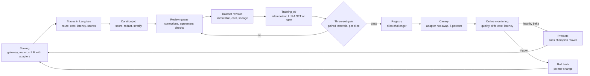
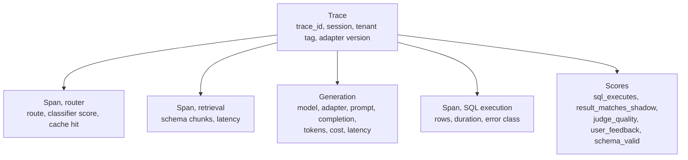
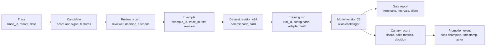
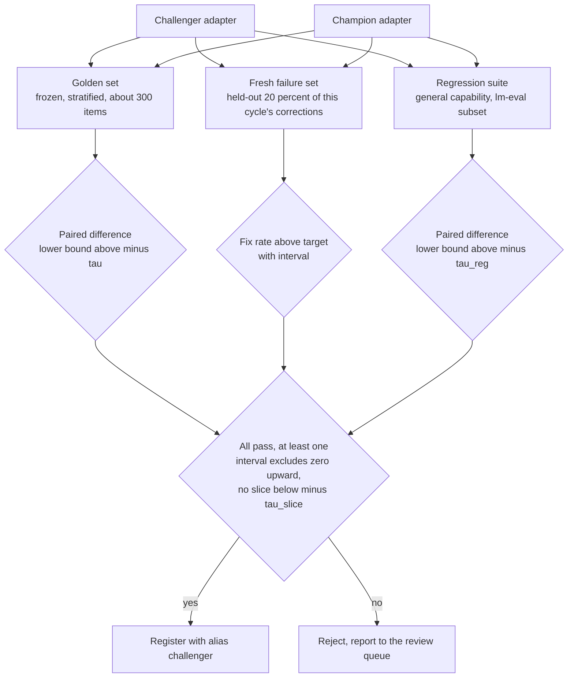
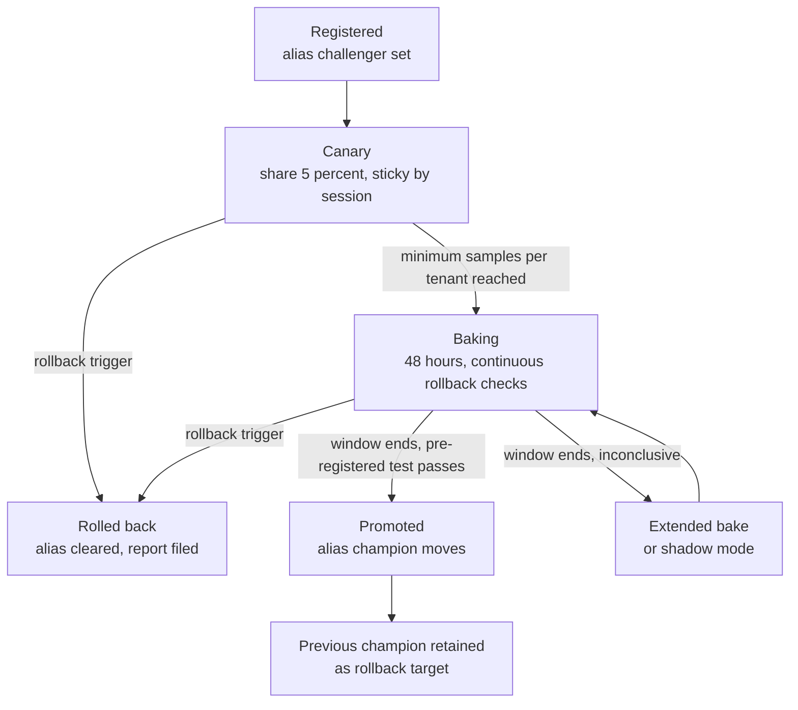

# Chapter 17: The Data Flywheel

> **What you will be able to do:** score and select production traces worth a human's time; redact them before anyone sees them; version the resulting dataset with lineage back to every trace; trigger training idempotently; gate a challenger behind three evaluation sets with paired statistics; roll it out as a stratified canary on a shared vLLM base and roll it back automatically; name each way a flywheel fails and the signal that detects it.
>
> **Where it is used:** P3.1, P5.2. Depends on the evaluation statistics of P1.6 and the serving stack of P2.2 and P2.5.
>
> **Prerequisites:** Chapter 7 (LoRA adapters), Chapter 11 (bootstrap intervals, paired comparison, Cohen's kappa), Chapter 13 (multi-LoRA serving), Chapter 16 (gateway and tracing).

## 17.0 The problem this chapter solves

A customer runs a text-to-SQL analyst you built. Every week their analysts ask a few thousand questions. A few hundred answers are wrong: the SQL errors, or it returns an empty result, or it silently joins the wrong table. Today the fix path is manual. Someone notices, someone files a ticket, you adjust a prompt or a few-shot example, and the same class of error returns three weeks later under a different column name. The customer's data (what was asked, what was answered, which answers failed) is the one asset no competitor has, and it is being thrown away.

A data flywheel turns that record into a model that fits the workload better each week. The mechanics are not new to you: you run Langfuse traces, database oracles, and canary gates at Atom11. What is new in this chapter is the closed loop with no manual step other than a review queue, and the statistical discipline that makes it safe to close the loop. A flywheel that trains on its own unreviewed outputs collapses. A gate that peeks daily at a canary promotes noise. A curation job that only collects failures teaches the model that everything is hard.

The gate is the heart of the design. Everything upstream (noisy labels, a biased judge, a bad training run) can be wrong and the system stays safe as long as the gate is honest. Everything downstream (canary, monitoring, rollback) exists because the gate cannot see everything. This chapter builds each stage with its formulas, its worked numbers, and its failure signal.

## 17.1 MLOps versus LLMOps

The MLOps loop you built with Airflow and MLflow (data to model to deployment to monitoring) still holds. Five things change when the model is a language model, and each one changes what the flywheel versions or measures.

| Dimension | Classical MLOps | LLMOps |
|---|---|---|
| The artifact you own | The model weights | Prompts, adapters, routing policies, golden sets, tool schemas; the base model is often a frontier API you do not control |
| How quality is measured | A metric against labels | Judged, by an oracle where one exists, by a calibrated LLM judge otherwise; evaluation is a system, not a number |
| The input distribution | Features with known ranges | Free text that can contain instructions; adversarial inputs are a normal operating condition |
| Cost | Fixed per inference | Variable per request by tokens and route; cost is a first-class metric next to latency |
| External change | Your data drifts | Your data drifts and the provider deprecates the base model; a flywheel must be able to re-run its whole history on a new base |

Consequences for the design: every trace carries tenant, route, model, adapter version, tokens, cost, and quality attributes (Chapter 16 insisted on this), so that every stage below is a query. Datasets are immutable once trained on. Every number that gates a promotion has an interval. Security (Chapter 19) is part of operations, not a separate review.



*Figure 17.1: The flywheel, with the gate as the only stage that must be right for the loop to be safe.*

## 17.2 Trace anatomy

Langfuse organizes observability around a small vocabulary. Use it consistently because every curation signal is a query over it.

- A **trace** is one request end to end. It carries an identifier, a user, a session, tags, and free-form metadata. Put tenant, route, and adapter version in metadata or tags at ingestion.
- An **observation** is a node inside a trace. Three kinds: a **span** for a step with a duration (routing, retrieval, SQL execution), an **event** for a point in time, and a **generation** for a model call. A generation records model name, prompt, completion, input and output token counts, cost, and latency.
- A **score** attaches a number, a category, or a boolean to a trace or an observation, with a name and an optional comment. Your oracle writes `sql_executes` and `result_matches_shadow`; your judge writes `judge_quality` in $[0, 1]$; the feedback endpoint writes `user_feedback` in $\{-1, 0, 1\}$; a validator writes `schema_valid`.
- A **session** groups traces from one conversation. Canary assignment should be sticky per session (section 17.10).
- **Tags** and **users** let you slice by tenant, feature, or route.



*Figure 17.2: One trace of the text-to-SQL analyst and the scores the flywheel reads from it.*

The data contract between serving and curation is this structure. Write it down as a table of required fields per observation type, and make the curation job fail loudly on a trace that lacks a tenant tag rather than silently dropping it.

## 17.3 Curation signals and a scoring scheme

Not every trace deserves a reviewer's minute. The curation job ranks traces by how much a correction would teach the model, then applies stratification and a success sample.

### 17.3.1 The signals

Six signals, each normalized to a feature $f_k(t) \in [0, 1]$ for trace $t$:

| Signal | Feature definition | Reliability |
|---|---|---|
| Oracle failure $f_{\text{or}}$ | 1 if the SQL errored or the result set differs from the shadow frontier answer; 0.5 if it returned no rows where the shadow returned rows; else 0 | Highest. A verified failure. |
| Explicit feedback $f_{\text{fb}}$ | 1 on thumbs-down, 0 otherwise | High precision, low recall, biased toward frustrated users |
| Low judge score $f_{\text{jd}}$ | $\max\!\left(0, \frac{\theta - j}{\theta}\right)$ where $j$ is the judge score and $\theta$ the acceptability threshold | Only as good as the judge calibration (Chapter 11) |
| Route disagreement $f_{\text{rd}}$ | 1 if the small model's and the shadowed frontier model's result sets differ materially | Excellent for the small model's blind spots |
| Novelty $f_{\text{nv}}$ | Percentile rank, within the reference distribution, of the cosine distance from the request embedding to its nearest neighbor in the training set, rescaled so the 90th percentile maps to 0 and the 100th to 1 | Finds new intents before they become failures |
| Implicit signals $f_{\text{im}}$ | 0.5 for a rephrase within 60 seconds, 0.5 for abandonment after the answer, capped at 1 | Noisy; combine with the others |

### 17.3.2 The score

The curation score is a weighted sum:

$$
s(t) = \sum_{k} w_k \, f_k(t), \qquad \sum_k w_k = 1, \quad w_k \ge 0
$$

where $w_k$ is the weight of signal $k$. The weights are a policy decision, and they are yours to set for each workload. A defensible starting point for a text-to-SQL analyst with a strong oracle and sparse feedback:

| Signal | Weight |
|---|---|
| Oracle failure | 0.35 |
| Explicit feedback | 0.15 |
| Low judge score | 0.15 |
| Route disagreement | 0.15 |
| Novelty | 0.12 |
| Implicit | 0.08 |

Worked example. Trace A: the SQL executed and matched the shadow answer ($f_{\text{or}} = 0$), no feedback, judge score $j = 0.45$ against $\theta = 0.6$ so $f_{\text{jd}} = (0.6 - 0.45)/0.6 = 0.25$, no route disagreement, novelty at the 96th percentile so $f_{\text{nv}} = 0.6$, user rephrased within 60 seconds so $f_{\text{im}} = 0.5$.

$$
s(A) = 0.35 \cdot 0 + 0.15 \cdot 0 + 0.15 \cdot 0.25 + 0.15 \cdot 0 + 0.12 \cdot 0.6 + 0.08 \cdot 0.5 = 0.0375 + 0.072 + 0.04 = 0.1495
$$

Trace B: the SQL errored ($f_{\text{or}} = 1$), thumbs-down ($f_{\text{fb}} = 1$), no judge sample, novelty at the 50th percentile ($f_{\text{nv}} = 0$), nothing else.

$$
s(B) = 0.35 + 0.15 = 0.50
$$

B is a verified, user-confirmed failure and ranks far above A, which is a soft signal cluster. Both belong in the queue if there is capacity. The ranking decides who goes first when there is not.

### 17.3.3 Stratification, diversity, and success sampling

Three adjustments sit on top of the score.

Per-tenant caps. Without them, the tenant with the most traffic fills the queue (the loud-tenant failure in section 17.14). Give each tenant a nightly quota proportional to the square root of its traffic rather than to its traffic, so a tenant with 100 times the volume gets 10 times the slots, not 100.

Diversity. Greedy selection by score picks twenty near-duplicates of the same broken join. Apply a maximal-marginal-relevance penalty: when choosing the next item, subtract $\lambda$ times its maximum cosine similarity to items already selected tonight. A $\lambda$ of about 0.3 on unit-normalized embeddings is a reasonable start.

Success sampling. Sample successes at a rate $p_s$ so that successes make up a fixed share of the queue, about 20 to 30 percent. Successes are cheap to review (accept or reject in seconds), they anchor the easy cases so the model does not forget them, and they give the reviewer a base rate against which to judge the failures. Sample them deterministically by hashing the trace identifier, so a rerun of the job selects the same items (section 17.7 on idempotency).

## 17.4 PII redaction before storage

Traces contain what users typed. Names, email addresses, account numbers, and free-text descriptions of customers appear in analyst questions. Redaction runs before the trace leaves the observability store for a review queue or a dataset, and before a human other than the original user sees it. Redacting afterwards is a breach that has already happened.

### 17.4.1 Recognizers

Microsoft Presidio is the practical default. Its analyzer runs a set of recognizers over text and returns spans with an entity type and a confidence. Built-in recognizers cover persons, email addresses, phone numbers, credit cards, national identifiers, IP addresses, locations, and dates. Custom pattern recognizers cover what is specific to the workload: account numbers, ticket identifiers, internal employee codes. The anonymizer then applies an operator per entity type: replace with a placeholder, mask, hash, or encrypt.

Design choices that matter for a text-to-SQL flywheel:

- Placeholders must preserve structure. Replace an account number with `<ACCOUNT_NUMBER>` in both the question and the SQL literal, so the training example still teaches the mapping from question to query shape. Replacing with a random string breaks the example.
- Column and table names are not PII, but a person recognizer will sometimes flag `customer_name` or a table called `Johnson_accounts`. Maintain an allowlist of schema identifiers that the redactor never touches.
- Record what was redacted: entity type counts per trace, never the original values. The dataset card reports these counts.
- Hash consistently within a trace so that two mentions of the same person redact to the same placeholder, which keeps multi-turn examples coherent. Presidio's hash operator does this; salt per dataset revision, not globally.

### 17.4.2 Minimum necessary and retention

Store the minimum that the flywheel needs: the redacted question, the redacted SQL, the schema names referenced, the scores, and the trace identifier. Do not copy the full prompt with its few-shot examples into the dataset; regenerate it from the template at training time. Define a retention period for raw traces in Langfuse (the roadmap's stack uses 30 days for raw traces and indefinite retention for redacted, reviewed examples) and enforce it with the platform's retention setting rather than a cron job you will forget.

Measure the redactor. Build a synthetic set of 200 analyst questions seeded with known PII of each type, and report recall per entity type and the false-positive rate on schema identifiers. A redactor without these two numbers is a hope, not a control. Chapter 19, section 19.5 covers the same redactor applied to logs and outputs.

## 17.5 Human review queue and inter-annotator agreement

### 17.5.1 Queue design

Argilla gives a reviewer a record with fields and questions. Design the record so a subject-matter expert clears it in under a minute:

- Show the redacted question, the schema (tables and columns the router retrieved), the model's SQL, the execution result or error, the oracle verdict, and the shadow frontier answer when one exists.
- Pre-fill the correction with the frontier model's SQL when the oracle says it was right. The reviewer accepts, edits, or marks the item unfixable (ambiguous question, missing data, out of scope).
- Three questions only: decision (accept as is, accept with edit, reject as unfixable), corrected SQL, and a reason code from a short list.
- Record reviewer identity, decision time in seconds, and the reason code. Review time is the flywheel's real cost; the roadmap's P3.1 asks you to time yourself.

Every accepted item becomes a training example with the reviewer's SQL as the target. Every rejected item becomes a negative for the golden set discussion (should the system have refused) and never enters training as a positive.

### 17.5.2 Inter-annotator agreement

If two experts disagree about the right SQL, the task definition is unclear and the training data will be too. Measure agreement periodically by routing a small overlap (about 5 percent of the queue, at least 50 items a month) to two reviewers.

For the decision label, use Cohen's kappa from Chapter 11:

$$
\kappa = \frac{p_o - p_e}{1 - p_e}
$$

where $p_o$ is the observed agreement rate and $p_e$ is the agreement expected by chance from the two reviewers' marginal label frequencies.

Worked example. Sixty overlap items, decision collapsed to "needs correction" versus "accept as is". Both say needs correction: 30. Both say accept: 18. Reviewer 1 says needs correction, reviewer 2 says accept: 7. The reverse: 5.

$p_o = (30 + 18)/60 = 0.800$. Reviewer 1's rate of "needs correction" is $37/60 = 0.617$; reviewer 2's is $35/60 = 0.583$. Their rates of "accept" are $0.383$ and $0.417$.

$$
p_e = 0.617 \cdot 0.583 + 0.383 \cdot 0.417 = 0.360 + 0.160 = 0.520
$$

$$
\kappa = \frac{0.800 - 0.520}{1 - 0.520} = \frac{0.280}{0.480} \approx 0.58
$$

That is moderate agreement. Below about 0.6, tighten the reason codes and the rubric before training on the data. Above 0.8 is strong.

For the corrected SQL itself, label agreement is the wrong measure: two correct queries can differ textually. Use execution equivalence instead. Run both reviewers' SQL against the database and count the fraction of items whose result sets match. Report both numbers. A reviewer pair with $\kappa = 0.58$ on the decision but 0.92 execution agreement on corrections tells you the disagreement is about whether to fix, not how.

## 17.6 Dataset versioning and lineage

Training data must be immutable once used. A model trained on revision 14 must be reproducible from revision 14 in a year, after the base model has been deprecated and re-training is forced.

### 17.6.1 Versioning options

- **Hugging Face Hub dataset repositories** give Git-style revisions with no extra infrastructure. Push each cycle's accepted items as a new commit and tag it (`v14`). Load by tag or by commit hash. Private repositories keep the data yours. This is the roadmap's default for P3.1.
- **DVC** versions data files with pointers committed to Git and the bytes in your own object storage. Choose it when the data cannot leave your cloud account.
- **lakeFS** puts Git semantics (branches, commits, merges) over an object store bucket. Choose it when several pipelines write to the same lake and you need atomic promotion of a data branch.

All three give you the property that matters: a revision identifier that resolves to exactly the same bytes forever. Which you choose is a residency and tooling decision, not a modeling one.

### 17.6.2 Lineage from example to trace

Every example carries its trace identifier, the review record identifier, and the revision in which it first appeared. Every training run records the dataset revision hash and the configuration hash. Every registered model version records the run. Every gate report and canary record points at the model version. Lineage is then a chain of identifiers, and two questions become queries: "which traces produced the example that taught this bad behavior" and "which model versions were trained on any example from tenant X" (which you will be asked when a tenant leaves and invokes a deletion right).



*Figure 17.3: The lineage chain; every arrow is a stored identifier, so any node can be traced in either direction.*

### 17.6.3 The dataset card

Generate the card automatically at each revision: counts by source signal, by tenant, by intent, by reviewer decision; the date range of the source traces; redaction statistics by entity type; the reviewers and the agreement statistics from section 17.5; the revision it extends; and a decontamination statement (section 17.8.5). A card written by hand goes stale by the second revision.

## 17.7 Training triggers and idempotency

Two triggers are common. A **schedule** (weekly) is predictable and matches a review cadence. A **threshold** (train when at least $N_{\min}$ new accepted examples exist, 200 in the roadmap's P3.1) responds to volume. Combine them: run weekly, skip if the new-example count is below the threshold, and record the skip as a run with outcome "skipped" so the dashboard shows the cycle happened.

The training job is the CI workflow from Chapter 15, launched with the dataset revision as an input. It must be **idempotent**: running it twice with the same inputs produces the same adapter and registers nothing new the second time. Two mechanisms:

1. An idempotency key: the hash of the dataset revision hash, the base model identifier, the training configuration, and the random seed. Before training, look the key up in the registry. If a model version with that key exists, return it and stop.
2. Deterministic training where possible: fixed seed, fixed data order, deterministic kernels where the speed cost is acceptable. Exact bitwise reproducibility across GPUs is not guaranteed; the idempotency key is what prevents duplicate registrations, and determinism is what makes re-runs comparable.

Store the key as a tag on the model version. A retry after a network failure during upload then finds the half-finished version by key and resumes the upload rather than training again.

## 17.8 The three-set evaluation gate

The gate compares the challenger adapter against the champion adapter on three sets and passes only if all three questions are answered well and no slice regresses.



*Figure 17.4: Gate logic; each set answers one question and the per-slice check guards the small tenants.*

### 17.8.1 The three sets and their questions

- The **golden set** is frozen, stratified across tenants, intents, and difficulty, verified by experts, versioned, and never trained on. It answers: is the challenger at least as good overall.
- The **fresh failure set** is the held-out share of this cycle's reviewed corrections. Split every cycle's accepted items 80 to 20 by hash of the example identifier; the 80 trains, the 20 evaluates. It answers: did this cycle fix what it set out to fix. It is biased against the champion by construction, because the items were selected as champion failures, so a positive difference here proves nothing about overall quality. That is why it is one of three sets, not the only one.
- The **regression suite** is a fixed subset of a general benchmark, scored with lm-eval (Chapter 11), plus the format and refusal checks from the security suite. It answers: did we break general capability or safety behavior.

### 17.8.2 The paired statistic

For a set of $n$ items with challenger correctness $c_i \in \{0, 1\}$ and champion correctness $m_i \in \{0, 1\}$ on the same item $i$, the estimate of the accuracy difference is

$$
\hat{\Delta} = \frac{1}{n} \sum_{i=1}^{n} (c_i - m_i)
$$

The paired bootstrap from Chapter 11 resamples items with replacement, recomputes $\hat{\Delta}$ on each resample, and takes the 2.5th and 97.5th percentiles of $B$ resamples ($B = 2000$ is plenty) as the 95 percent interval. Use the paired version, never two independent intervals: the items are the same, and the variance of the difference depends only on the items where the two systems disagree.

The normal approximation shows why. Let $p_{10}$ be the fraction of items the challenger gets right and the champion wrong, and $p_{01}$ the reverse. Then $\hat{\Delta} = p_{10} - p_{01}$ and

$$
\mathrm{Var}(\hat{\Delta}) \approx \frac{p_{10} + p_{01} - (p_{10} - p_{01})^2}{n}
$$

Only the discordant items contribute. Two systems that agree on 95 percent of items can be compared precisely with far fewer items than two independent accuracy estimates would need.

Worked example. Golden set with $n = 300$. Champion accuracy 0.82, challenger 0.85. Discordant fractions $p_{10} = 0.08$ and $p_{01} = 0.05$, so $\hat{\Delta} = 0.03$.

$$
\mathrm{Var}(\hat{\Delta}) \approx \frac{0.13 - 0.0009}{300} = 4.30 \times 10^{-4}, \qquad \mathrm{SE} \approx 0.0207
$$

The 95 percent interval is about $0.03 \pm 1.96 \cdot 0.0207 = [-0.011, 0.071]$. It includes zero. A 3-point gain on 300 items is not a demonstrated gain. To halve the interval width you need four times the items, 1200, which is why the golden set grows every quarter and why "no change" is the most common honest outcome once the model is good.

### 17.8.3 The decision rule

Two kinds of criterion, applied per set:

- **Non-inferiority**: the lower bound of the interval is above $-\tau$, where $\tau$ is a tolerance you set per set. This says "not worse by more than $\tau$, at 95 percent confidence."
- **Superiority**: the lower bound is above zero. This says "better, at 95 percent confidence."

The roadmap's P3.1 criterion is a gain with an interval that excludes zero and no regression on the general suite. Implement it as: non-inferiority on all three sets, and superiority on at least one of the golden set or the fresh failure set. With the example above, the golden set is non-inferior at $\tau = 0.02$ (lower bound $-0.011 > -0.02$) but not superior. If the fresh failure set shows superiority, the challenger passes; if not, the cycle produced no demonstrated gain and the challenger is rejected with a report. Rejection is not failure. It means the champion is already good on what this cycle collected.

For the fresh failure set the champion scores near zero by construction, so the paired difference is the fix rate. Require a fix rate whose lower bound exceeds a target such as 0.25. Worked: 120 held-out failures, challenger fixes 54, rate 0.45, standard error $\sqrt{0.45 \cdot 0.55 / 120} \approx 0.045$, interval about $[0.36, 0.54]$. Passes.

### 17.8.4 Per-slice checks

An improvement for the biggest tenant can hide a regression for a small one. Compute $\hat{\Delta}$ and its interval per slice (tenant, intent, difficulty band). Two honest facts about small slices:

First, with $S$ slices tested at 95 percent each, the chance that at least one shows a spurious regression grows. A Bonferroni correction tests each slice at level $\alpha / S$: for $S = 6$ and $\alpha = 0.05$, each slice uses a 99.2 percent interval, about $z = 2.64$ instead of 1.96.

Second, small slices cannot detect anything but catastrophes. A tenant with 60 golden items and a discordant rate of 0.15 has $\mathrm{SE} \approx \sqrt{0.15 / 60} = 0.05$, so the Bonferroni interval half-width is about $2.64 \cdot 0.05 = 0.13$. A 10-point regression on that tenant is invisible. Set the per-slice tolerance $\tau_{\text{slice}}$ accordingly (0.10 is not unreasonable for small slices), flag any slice with a point estimate below $-0.03$ for a human look regardless of significance, and grow the small tenants' golden items over time. The per-slice check is a catastrophe detector, and saying so in the promotion criteria is more honest than pretending it is a fine instrument.

### 17.8.5 Contamination

The gate refuses a challenger whose training revision overlaps the golden set. Check with the decontamination procedure from Chapter 10 (13-gram overlap between training examples and golden items, plus exact match on normalized SQL). Record the result on the dataset card. A production request that lands in the golden set and later in a training revision inflates the golden score silently; the frozen golden set and a separate, versioned "new evaluation items" set prevent it.

## 17.9 The registry

A registry is a store of model versions with named pointers and lineage. MLflow Model Registry aliases or Hub tags both work; the roadmap's P3.1 accepts either.

- **Aliases**: `champion` points at the serving version, `challenger` at the version in canary. Promotion moves `champion` to the challenger's version and clears `challenger`. Rollback moves `champion` back. Both are pointer changes, which is why the registry is what makes rollback a one-line operation rather than a scramble.
- **Lineage metadata** on each version: dataset revision hash, training run identifier, idempotency key, base model identifier, gate report identifier, and the previous champion version (the rollback target).
- **History**: who or which pipeline moved which alias when, and the gate and canary reports that justified it. This is the audit trail a customer's security team asks for (Chapter 19, section 19.9).

In MLflow, `set_registered_model_alias` and the `models:/name@champion` URI form implement this (aliases replaced the older stage mechanism in MLflow 2.x; check your version). On the Hub, a tag per alias on the adapter repository and a small JSON file in the repository root that records the lineage fields do the same.

## 17.10 Canary rollout via adapter hot-swap

### 17.10.1 Why the canary is cheap

vLLM serves several LoRA adapters on one base model (Chapter 13, multi-LoRA serving). The champion and the challenger are two adapters over the same base weights, so a canary needs no second server. The gateway routes a share $q$ of requests to the challenger by naming its adapter in the request's model field. Loading an adapter at runtime uses the engine's dynamic adapter loading endpoint (in vLLM this requires enabling runtime LoRA updating; check your version), and takes seconds because a rank-16 adapter over a 1.5B model is about 18 million parameters, about 37 MB in bf16.

### 17.10.2 Traffic split and stratification

Assign requests by hashing the session identifier into 1000 buckets and sending buckets below $1000 q$ to the challenger. Session-level hashing keeps a conversation on one adapter. Hashing rather than random draws makes the assignment reproducible in the trace.

Stratify by tenant. Random assignment at 5 percent gives every tenant 5 percent in expectation, but a tenant with 40 requests a day gets 2 canary requests, which tells you nothing. Two rules: compute the canary metrics per tenant and overall, and require a minimum canary sample per tenant (say 200 oracle-checked requests) before the bake window can close for that tenant. If a small tenant cannot reach the minimum in the window, extend the window or use shadow mode (section 17.11) for that tenant.

### 17.10.3 Bake window and what it can detect

The roadmap uses a 48-hour bake. Where volume allows, a full week covers weekday and weekend patterns. Compute what a 48-hour window can detect before you trust it.

Worked example. Traffic of 20,000 requests a day, canary share 5 percent, so 1000 canary requests a day and 2000 over the window. Two quality signals:

- **Oracle checks** on every request. A pass rate near 0.90 has $\mathrm{SE} = \sqrt{0.9 \cdot 0.1 / 2000} \approx 0.0067$. Comparing against the champion's concurrent 38,000 requests (whose standard error is negligible), a drop of 2 points is about three standard errors. Detectable.
- **Judge sampling** at 5 percent of canary responses: 100 judged answers over the window. $\mathrm{SE} = \sqrt{0.9 \cdot 0.1 / 100} = 0.03$. The 95 percent half-width is about 6 points. Only a large quality regression is detectable by the judge in 48 hours.

Consequence: the oracle is the canary's instrument where an oracle exists; the judge catches only gross regressions in a short window. Raise the judge sampling rate for the canary (20 percent of canary traffic costs 400 judge calls over the window and halves the half-width) rather than for all traffic.

Note that canary and champion serve different requests, so this comparison is unpaired, unlike the gate. It is exposed to a tenant mix shift during the window, which is one more reason to compute it per tenant.

### 17.10.4 Rollback triggers

Rollback triggers are explicit, automatic, and evaluated continuously. Typical set:

| Trigger | Rule | Why continuous evaluation is acceptable |
|---|---|---|
| Quality | Canary oracle pass rate below the champion's concurrent rate by more than $\tau_q$ with a two-proportion z-score beyond 3 | A false rollback costs a re-run, not a bad model in production |
| Latency | Canary p99 above the SLO for three consecutive five-minute windows | Same |
| Errors | Canary error rate above twice the champion's over 15 minutes, minimum 20 errors | Same |
| Validator | Structural validator failure rate (Chapter 19) above twice the champion's | Same |
| Manual | An operator pulls the alias | Always available |

### 17.10.5 The sequential-testing note

Peeking at a comparison repeatedly and stopping when it looks significant inflates the false-positive rate. If you test daily at nominal $\alpha = 0.05$ for $k$ days and the tests were independent, the chance of at least one false alarm would be $1 - (1 - \alpha)^k$: about 0.30 for $k = 7$. Real daily looks are on accumulating data and so are positively correlated, which makes the inflation smaller than that bound but still large. The classical result is that five equally spaced looks at nominal 5 percent give an overall false-positive rate of about 14 percent and ten looks give about 19 percent (Armitage, McPherson, and Rowe 1969).

The costs are asymmetric, which decides the policy:

- **Rollback** decisions may peek continuously. A false rollback costs a re-run and a report. Set the rollback thresholds conservatively (a z-score of 3 rather than 1.96, and a minimum sample) so that the noise does not thrash the pointer, but do not delay a rollback to protect a p-value.
- **Promotion** decisions get one pre-registered test at the end of the bake window, or, if you must look earlier, a fixed number $k$ of looks with each at level $\alpha / k$ (Bonferroni; for $k = 7$ daily looks at overall 5 percent, each look uses about $z = 2.69$). Group-sequential boundaries (Pocock 1977; O'Brien and Fleming 1979) and always-valid confidence sequences (Johari, Koomen, Pekelis, and Walsh 2017) spend the error budget more efficiently than Bonferroni, and are worth adopting once the simple version runs. The practical rule: decide before the canary starts how many times you will look and at what threshold, and write it in the promotion criteria.



*Figure 17.5: Canary state machine; rollback checks run continuously while the promotion test runs once.*

## 17.11 Shadow mode

In shadow mode the challenger answers every request in parallel, its answers are scored by the oracle and sampled by the judge, and no user sees them. Promotion is decided on shadow data. Three properties make it attractive:

- The comparison is paired: both adapters answered the same requests, so the gate's paired statistics apply and the interval is far tighter than the unpaired canary's.
- No user is exposed to a regression.
- Small tenants get full coverage rather than a 5 percent trickle.

The cost is double inference for the shadowed share, and a shadow answer never receives user feedback, so implicit signals are unavailable. Risk-averse customers, regulated workloads, and the first cycle of a new flywheel are the natural uses. A common pattern is shadow first, then canary for the last mile to observe latency and feedback under real serving conditions.

## 17.12 Online monitoring signals

Four families, each per route, per tenant, and side by side for champion and challenger:

- **Quality**: oracle pass rate on every request where an oracle exists; judge score on a sampled share (a few percent of all traffic, more for the canary and for new tenants); validator failure rate; feedback rate and polarity.
- **Drift**: population stability index or a two-sample test on request embeddings against the training revision's distribution, and on the routing mix (Chapter 18 gives the formulas). Drift is a leading indicator: a new intent shows up as embedding drift before it shows up as failures.
- **Cost**: cost per request by route, tenant, and adapter version; cache hit rates.
- **Latency and errors**: p50 and p99 time to first token and end-to-end latency by route; error rate by class.

The dashboard the roadmap asks for in P3.1 also plots dataset growth per revision and review throughput, because the flywheel's health is as much about the queue as about the model.

## 17.13 Implementation notes

**Listing 17.1: Curation scoring with deterministic success sampling.**

```python
import hashlib

WEIGHTS = {"oracle": 0.35, "feedback": 0.15, "judge": 0.15,
           "route_disagree": 0.15, "novelty": 0.12, "implicit": 0.08}
JUDGE_THRESHOLD = 0.6

def features(trace: dict, novelty_pct: float) -> dict:
    f = {}
    if trace.get("sql_error"):
        f["oracle"] = 1.0
    elif trace.get("rows") == 0 and trace.get("shadow_rows", 0) > 0:
        f["oracle"] = 0.5
    else:
        f["oracle"] = 0.0 if trace.get("result_matches_shadow", True) else 1.0
    f["feedback"] = 1.0 if trace.get("user_feedback") == -1 else 0.0
    j = trace.get("judge_quality")
    f["judge"] = 0.0 if j is None else max(0.0, (JUDGE_THRESHOLD - j) / JUDGE_THRESHOLD)
    f["route_disagree"] = 1.0 if trace.get("route_disagreement") else 0.0
    f["novelty"] = min(1.0, max(0.0, (novelty_pct - 0.90) / 0.10))
    f["implicit"] = min(1.0, 0.5 * trace.get("rephrased", 0) + 0.5 * trace.get("abandoned", 0))
    return f

def curation_score(trace: dict, novelty_pct: float) -> float:
    f = features(trace, novelty_pct)
    return sum(WEIGHTS[k] * f[k] for k in WEIGHTS)

def sampled_success(trace_id: str, rate: float) -> bool:
    h = int(hashlib.sha256(trace_id.encode()).hexdigest()[:8], 16)
    return (h % 10_000) < int(rate * 10_000)

def is_success(trace: dict) -> bool:
    return (not trace.get("sql_error") and trace.get("result_matches_shadow", True)
            and trace.get("user_feedback", 0) >= 0)
```

The novelty percentile is computed upstream against the current training revision's embeddings and passed in, so the scoring function stays a pure function of one trace. `sampled_success` hashes the trace identifier so that a rerun selects the same successes, which is what makes the nightly job idempotent. The weights are a module constant on purpose: they belong in a reviewed configuration file, and changing them is a decision the guide asks you to keep for yourself.

**Listing 17.2: Gate decision from paired bootstrap results.**

```python
from dataclasses import dataclass

@dataclass
class PairedResult:
    delta: float      # challenger minus champion, point estimate
    lo: float         # 2.5th percentile of the paired bootstrap
    hi: float         # 97.5th percentile

def gate_decision(golden: PairedResult, fresh: PairedResult | None, regression: PairedResult,
                  slices: dict[str, PairedResult], contaminated: bool,
                  tau_golden=0.02, tau_reg=0.02, fresh_target=0.25,
                  tau_slice=0.10, slice_flag=-0.03) -> tuple[bool, list[str]]:
    reasons = []
    if contaminated:
        return False, ["training revision overlaps the golden set"]
    if golden.lo <= -tau_golden:
        reasons.append(f"golden not non-inferior: lower bound {golden.lo:.3f}")
    if regression.lo <= -tau_reg:
        reasons.append(f"regression suite not non-inferior: lower bound {regression.lo:.3f}")
    fresh_ok = fresh is not None and fresh.lo > fresh_target
    if fresh is not None and not fresh_ok:
        reasons.append(f"fresh fix rate lower bound {fresh.lo:.3f} below {fresh_target}")
    if not (golden.lo > 0 or fresh_ok):   # superiority on at least one set
        reasons.append("no set shows a gain with an interval excluding the target")
    for name, r in slices.items():
        if r.lo <= -tau_slice:
            reasons.append(f"slice {name} regresses: lower bound {r.lo:.3f}")
        elif r.delta < slice_flag:
            reasons.append(f"WARN slice {name} point estimate {r.delta:.3f}, review by hand")
    blocking = [r for r in reasons if not r.startswith("WARN")]
    return len(blocking) == 0, reasons
```

The function consumes results, not raw items; the paired bootstrap itself lives in `evalkit` (Chapter 11) and the slice intervals are computed there at the Bonferroni-corrected level. The fresh-failure result is optional because a cycle motivated by novelty rather than failures may have no held-out failures; in that case superiority must come from the golden set. Warnings are returned alongside blocking reasons so the report shows the human-review flags even when the gate passes. Every threshold is a keyword argument with the roadmap's defaults, so the promotion criteria document and the code agree by construction.

**Listing 17.3: Canary state machine sketch.**

```python
from enum import Enum

class State(Enum):
    REGISTERED = "registered"; CANARY = "canary"; BAKING = "baking"
    PROMOTED = "promoted"; ROLLED_BACK = "rolled_back"; EXTENDED = "extended"

def rollback_triggered(m: dict) -> bool:
    z = (m["champ_pass"] - m["canary_pass"]) / max(m["pass_se"], 1e-9)
    return (z > 3.0 and m["canary_n"] >= 200
            or m["p99_over_slo_windows"] >= 3
            or (m["canary_err"] > 2 * m["champ_err"] and m["canary_errors"] >= 20)
            or m["canary_validator_fail"] > 2 * m["champ_validator_fail"])

def step(state: State, m: dict, hours: float, bake_hours=48.0) -> State:
    if state in (State.CANARY, State.BAKING) and rollback_triggered(m):
        return State.ROLLED_BACK
    if state == State.REGISTERED:
        return State.CANARY
    if state == State.CANARY:
        return State.BAKING if m["min_samples_all_tenants"] else State.CANARY
    if state == State.BAKING:
        if hours < bake_hours:
            return State.BAKING
        # one pre-registered promotion test at the end of the window
        return State.PROMOTED if m["promotion_test_passes"] else State.EXTENDED
    if state == State.EXTENDED:
        return State.BAKING if m["extension_granted"] else State.ROLLED_BACK
    return state
```

Rollback checks run on every call regardless of state, which is the asymmetric policy from section 17.10.5 in code. The promotion test is consulted once, when the window ends. The metrics dictionary is filled by a monitor job from Langfuse scores and gateway metrics; the state itself is persisted in the registry's version tags so that a restarted controller resumes rather than restarts.

**Listing 17.4: Idempotency key for the training trigger.**

```python
import hashlib, json

def idempotency_key(dataset_revision: str, base_model: str, config: dict, seed: int) -> str:
    payload = json.dumps({"rev": dataset_revision, "base": base_model,
                          "cfg": config, "seed": seed}, sort_keys=True)
    return hashlib.sha256(payload.encode()).hexdigest()[:16]

def find_or_train(client, key: str, train_fn):
    existing = [v for v in client.search_model_versions("name='sql-analyst-lora'")
                if v.tags.get("idempotency_key") == key]
    if existing:
        return existing[0]
    version = train_fn()
    client.set_model_version_tag("sql-analyst-lora", version.version, "idempotency_key", key)
    return version
```

`sort_keys=True` makes the configuration hash independent of dictionary order. The lookup runs before training, so a re-triggered workflow costs one registry query. The example uses MLflow client method names; the same pattern works with Hub repository tags.

**Listing 17.5: Presidio redaction with a schema allowlist.**

```python
from presidio_analyzer import AnalyzerEngine, PatternRecognizer, Pattern
from presidio_anonymizer import AnonymizerEngine
from presidio_anonymizer.entities import OperatorConfig

analyzer = AnalyzerEngine()
account = PatternRecognizer(supported_entity="ACCOUNT_NUMBER",
                            patterns=[Pattern("acct", r"\bACC-\d{8}\b", 0.85)])
analyzer.registry.add_recognizer(account)
anonymizer = AnonymizerEngine()

def redact(text: str, schema_identifiers: set[str]) -> tuple[str, dict]:
    results = analyzer.analyze(text=text, language="en")
    kept = [r for r in results if text[r.start:r.end] not in schema_identifiers]
    ops = {"DEFAULT": OperatorConfig("replace", {"new_value": "<PII>"}),
           "PERSON": OperatorConfig("replace", {"new_value": "<PERSON>"}),
           "ACCOUNT_NUMBER": OperatorConfig("replace", {"new_value": "<ACCOUNT_NUMBER>"})}
    out = anonymizer.anonymize(text=text, analyzer_results=kept, operators=ops)
    counts = {}
    for r in kept:
        counts[r.entity_type] = counts.get(r.entity_type, 0) + 1
    return out.text, counts
```

The allowlist filter runs between analysis and anonymization, so a table named after a person is not redacted. The counts dictionary is what the dataset card reports. Presidio's class and method names are as of the 2.x line; check your version.

## 17.14 Failure modes

| Symptom | Likely cause | How to confirm | Fix |
|---|---|---|---|
| Outputs grow uniform across cycles; rare intents disappear; golden score flat while fresh-failure fix rate looks fine | Model collapse: training on the system's own unreviewed or lightly reviewed generations | Lineage query: fraction of examples in the last three revisions whose target equals the model's original output unchanged | Every example entering training is reviewed or oracle-verified; never train on unreviewed generations; cap the share of accept-as-is items |
| Judge score rises every cycle; oracle pass rate and user feedback do not | Judge leakage: the same judge curates and gates, so the model learns the judge | Plot judge score against oracle pass rate per cycle; the divergence is the leak | Gate on the oracle wherever one exists; recalibrate the judge against humans (Chapter 11) each cycle; use different judge prompts for curation and gating |
| Model over-refuses or over-qualifies easy questions; golden accuracy on easy stratum drops | Selection bias: training data is mostly failures | Card statistics: share of successes in the last revisions | Success sampling at 20 to 30 percent of the queue |
| Golden accuracy jumps in one cycle far beyond the fresh-failure fix rate | Contamination: golden items leaked into a training revision | 13-gram and normalized-SQL overlap between revision and golden set | Gate refuses contaminated revisions; new evaluation items go to a separate versioned set |
| One tenant's intents dominate revisions; other tenants' slices flat or falling | Loud tenant: curation quota proportional to traffic | Card counts by tenant versus traffic share | Square-root quotas; per-slice gate checks; per-tenant canary minimums |
| Failure count spikes tenfold overnight, all one tenant, all one error class | Silent schema change: a renamed column or dropped table | Group failures by error message and referenced identifier | Alert on failure spikes before curating; hold that tenant's items until the schema is confirmed; do not train the model to work around a schema that changed |
| Two model versions registered from one trigger | Trigger not idempotent; retry after a network failure | Registry versions with equal dataset revision and config | Idempotency key lookup before training (Listing 17.4) |
| Canary promotes and then shows a regression the next week | Peeking: promotion decided on an early favorable look | Compare the promotion timestamp against the pre-registered window end | One pre-registered promotion test; Bonferroni for planned interim looks |
| Small tenant never contributes canary data; regression found only after promotion | Unstratified canary | Per-tenant canary sample counts | Per-tenant minimum samples; shadow mode for small tenants |
| Training examples with `<PERSON>` in SQL where a table name was | Over-redaction of schema identifiers | Redactor false-positive rate on the schema allowlist test set | Allowlist schema identifiers; measure recall and false-positive rate per entity type |
| Review queue backlog grows; training runs on three-week-old data | Queue throughput below curation rate | Review time per item and queue age on the dashboard | Reduce nightly candidates to reviewer capacity; improve pre-fill; raise the accept-as-is share for successes |

## 17.15 On your machine

The whole loop runs locally on the RTX 4060 inside WSL2 with a Docker Compose stack, and the final honest cycle's canary runs on a rented A100.

Local stack, one Compose file:

- **vLLM** on the 4060 serving a 1.5B instruct model in bf16 (about 3.1 GB of weights) with LoRA enabled, two adapter slots at rank 16, and a maximum model length of 2048. Leave about 3 GB for the KV cache and set the GPU memory utilization flag near 0.85 so that the other GPU users (Ollama, the judge if local) do not fight it. Each rank-16 adapter over a 1.5B model is about 18 million parameters, about 37 MB in bf16, so two adapters cost nothing worth measuring.
- **Gateway** from Chapter 16 (LiteLLM or your FastAPI gateway) with the hash-based split and the shadow route to a frontier API for the oracle comparison.
- **Langfuse** self-hosted with its own Compose services (the v3 line adds ClickHouse, Redis, and object storage next to Postgres; check your version). Budget 4 to 6 GB of RAM for it.
- **Argilla** with its search backend. Budget 2 to 3 GB of RAM.
- **Postgres** with the synthetic tenants' data, **Redis** for the semantic cache, and a small **MLflow** server or Hub tags for the registry.

Set the WSL2 memory cap in `.wslconfig` to 20 GB so the stack, the training job, and Windows coexist in 32 GB. Keep the repositories and datasets on the ext4 filesystem, never under the mounted Windows drive.

Traffic and training numbers:

- A synthetic population of 20,000 requests a day is 0.23 requests a second, well within a 1.5B model's batched throughput on the 4060. The judge at 5 percent of traffic is 1000 calls a day to a frontier API; at 20 percent of canary traffic it is 200 more.
- A LoRA SFT cycle on 200 to 500 new examples at sequence length 1024, batch 4 with accumulation, takes a few minutes on the 4060; the three-set gate at about 300 golden items, 120 fresh failures, and a few hundred regression items runs in well under an hour locally with vLLM serving both adapters.
- The nightly curation job over 20,000 traces is CPU work: embedding 20,000 requests with a small embedding model, nearest-neighbor distance against the training set, Presidio over each text. Minutes, not hours.

Cloud canary: the roadmap budgets 6 to 10 A100 hours for P3.1's final cycle, about $8 to $14 at RunPod Community Cloud's A100 80 GB rate of about $1.39 per hour as of September 2026 (verify). Use it to serve a 7B base with the two adapters at realistic concurrency. A full 48-hour bake is not affordable at that budget, so run a compressed bake (a few hours at elevated synthetic traffic) and state in the write-up that the window was compressed. Stop the pod when the cycle ends and record the session in the spend ledger.

## Exercises

1. A workload has a strong execution oracle, almost no explicit feedback (0.3 percent of requests), no shadow route, and a judge with kappa 0.55 against humans. Propose curation weights and justify each.

<details><summary>Solution</summary>

Oracle failure dominates because it is verified: 0.45. Route disagreement is unavailable: 0. Explicit feedback is precise but rare; keep it high per occurrence so that when it appears it ranks: 0.20. The judge is poorly calibrated (kappa 0.55 is moderate), so keep it low: 0.10. Novelty carries the load of finding new intents without a shadow route: 0.15. Implicit: 0.10. Sum 1.0. Also set the success-sampling rate at the upper end (30 percent) because without a shadow route the oracle catches only errors and empty results, not wrong-but-executing SQL, and reviewers will find those in the success sample.
</details>

2. Compute the curation score under the section 17.3 weights for a trace with a SQL error, no feedback, judge score 0.2 against threshold 0.6, novelty at the 99th percentile, and an abandonment.

<details><summary>Solution</summary>

$f_{\text{or}} = 1$, $f_{\text{fb}} = 0$, $f_{\text{jd}} = (0.6 - 0.2)/0.6 = 0.667$, $f_{\text{rd}} = 0$, $f_{\text{nv}} = (0.99 - 0.90)/0.10 = 0.9$, $f_{\text{im}} = 0.5$. Score $= 0.35 + 0.15 \cdot 0.667 + 0.12 \cdot 0.9 + 0.08 \cdot 0.5 = 0.35 + 0.100 + 0.108 + 0.040 = 0.598$.
</details>

3. Two reviewers label 80 overlap items as accept or needs correction. Both accept 22, both correct 40, reviewer 1 accepts and reviewer 2 corrects 10, the reverse 8. Compute kappa.

<details><summary>Solution</summary>

$p_o = 62/80 = 0.775$. Reviewer 1 accepts $32/80 = 0.40$, corrects $0.60$. Reviewer 2 accepts $30/80 = 0.375$, corrects $0.625$. $p_e = 0.40 \cdot 0.375 + 0.60 \cdot 0.625 = 0.15 + 0.375 = 0.525$. $\kappa = (0.775 - 0.525)/(1 - 0.525) = 0.25/0.475 \approx 0.53$. Moderate; refine the rubric before relying on the labels.
</details>

4. A golden set of 400 items gives champion 0.80, challenger 0.84, with $p_{10} = 0.09$ and $p_{01} = 0.05$. Compute the approximate 95 percent interval for the paired difference and decide non-inferiority at $\tau = 0.02$ and superiority.

<details><summary>Solution</summary>

$\hat{\Delta} = 0.04$. $\mathrm{Var} \approx (0.14 - 0.0016)/400 = 3.46 \times 10^{-4}$, $\mathrm{SE} \approx 0.0186$. Interval $0.04 \pm 0.0365 = [0.0035, 0.0765]$. Lower bound above $-0.02$: non-inferior. Lower bound above 0: superior, barely. The gate passes on the golden set alone if the regression suite is also non-inferior.
</details>

5. You plan to look at the canary comparison once a day for 7 days and promote on the first significant look. Give the upper bound on the false-positive rate at nominal 5 percent under independence, and the per-look threshold that Bonferroni would require.

<details><summary>Solution</summary>

Upper bound $1 - 0.95^7 \approx 0.30$. The true inflation on accumulating data is lower (roughly 14 to 19 percent for five to ten looks) but well above 5 percent. Bonferroni: each look at $0.05 / 7 \approx 0.0071$, two-sided $z \approx 2.69$. Better: one pre-registered look at day 7 at $z = 1.96$, with continuous rollback checks at $z = 3$.
</details>

6. Traffic is 6,000 requests a day, canary share 5 percent, judge sampling on the canary at 10 percent, bake 48 hours. How many judged canary answers do you get, and what quality drop from 0.90 can you detect at about two standard errors?

<details><summary>Solution</summary>

Canary requests: $6000 \cdot 0.05 \cdot 2 = 600$. Judged: 60. $\mathrm{SE} = \sqrt{0.9 \cdot 0.1 / 60} \approx 0.039$. Two standard errors is about 8 points. The judge can detect only a collapse. Rely on the oracle over all 600 canary requests ($\mathrm{SE} \approx 0.012$, about 2.5 points at two standard errors), or extend the bake, or use shadow mode.
</details>

7. Write promotion criteria for the text-to-SQL analyst as a numbered list a customer could sign.

<details><summary>Solution</summary>

1. The training revision has no overlap with golden set version G by the 13-gram and normalized-SQL checks. 2. On golden set G, the 95 percent paired bootstrap interval of challenger minus champion execution accuracy has a lower bound above $-0.02$. 3. On the general regression suite R, the same interval has a lower bound above $-0.02$. 4. On the held-out fresh failure set, the challenger's fix rate has a 95 percent lower bound above 0.25. 5. At least one of criteria 2 and 4 shows a gain with the interval excluding the target. 6. No tenant or intent slice has a Bonferroni-corrected interval lower bound below $-0.10$; any slice with a point estimate below $-0.03$ is reviewed by a named person before canary. 7. Canary at 5 percent, sticky by session, minimum 200 oracle-checked requests per tenant, 48-hour bake; rollback triggers as in section 17.10.4 evaluated continuously; one promotion test at window end requiring canary oracle pass rate not below the champion's by more than 0.02 at $z = 1.96$. 8. Previous champion retained for 30 days as the rollback target.
</details>

8. Explain model collapse in a flywheel and the single rule that prevents it.

<details><summary>Solution</summary>

Each cycle the model is trained on data that includes its own outputs. Outputs are samples from the model's distribution, which is narrower than the true distribution of good answers, and errors in the tails are systematically under-represented in what the model produces. Training on them narrows the distribution further; over cycles rare intents and phrasings vanish and the model converges on a small set of confident patterns (Shumailov et al. 2024 show the mechanism on language models and image models). The rule: no example enters training unless a human reviewed it or an oracle verified it. Corrections and verified successes carry information from outside the model; unreviewed generations do not.
</details>

9. Design the idempotency key for a DPO training trigger that consumes a preference dataset built from reviewer edits. What must be in the key that is not in the SFT key?

<details><summary>Solution</summary>

The dataset revision hash, base model identifier, configuration, and seed as before, plus the reference policy identifier (the adapter used as $\pi_{\text{ref}}$), because the same preference data against a different reference produces a different model, and the preference-pair construction rule version (how rejected answers were chosen), because it changes the data without changing the revision of the underlying edits if pairs are built at training time.
</details>

10. A tenant with 30 requests a day complains after a promotion that quality fell. The canary showed nothing. What went wrong and what do you change?

<details><summary>Solution</summary>

At 5 percent the tenant contributed about 3 canary requests over 48 hours; nothing could be detected. The per-tenant minimum sample rule was missing or the window closed for that tenant without reaching it. Change: enforce a per-tenant minimum before the window can close, and for tenants that cannot reach it, run shadow mode (every one of their requests answered by both adapters and scored by the oracle, so 60 paired items in 48 hours), and add their intents to the golden set so the gate itself covers them.
</details>

## Summary

- LLMOps keeps the MLOps loop and changes what is versioned (prompts, adapters, policies, golden sets), how quality is measured (judged, with intervals), and what counts as a normal input (adversarial text).
- Every curation signal is a query over Langfuse traces, observations, generations, and scores; the data contract between serving and curation is the list of required fields.
- The curation score is a weighted sum of normalized signals; the oracle carries the most weight, and per-tenant square-root quotas, a diversity penalty, and 20 to 30 percent success sampling sit on top of it.
- Redact PII before storage and before any reviewer sees the data; preserve structure with typed placeholders; allowlist schema identifiers; measure recall and false positives per entity type.
- Measure inter-annotator agreement with kappa on decisions and execution equivalence on corrected SQL; below about 0.6 kappa, fix the rubric before training.
- Datasets are immutable once trained on; lineage is a chain of stored identifiers from trace to promotion event.
- Training triggers combine a schedule and a threshold and are idempotent through a key hashed from revision, base model, configuration, and seed.
- The gate uses paired statistics; only discordant items add variance, and a 3-point gain on 300 items is not a demonstrated gain. Non-inferiority on all three sets plus superiority on one is the roadmap's rule.
- Per-slice checks are catastrophe detectors on small tenants; say so in the criteria and grow the small slices' golden items.
- The canary is cheap because two adapters share one base; stratify with per-tenant minimums, evaluate rollback triggers continuously with conservative thresholds, and run the promotion test once.
- Shadow mode gives paired comparisons with no user exposure at the cost of double inference.
- Model collapse has one preventive rule: nothing unreviewed and unverified enters training.

## Further reading

- Shumailov, Shumaylov, Zhao, Papernot, Anderson, and Gal, 2024, "AI models collapse when trained on recursively generated data" (Nature). The earlier preprint circa 2023 is titled "The Curse of Recursion: Training on Generated Data Makes Models Forget".
- Sculley et al., 2015, "Hidden Technical Debt in Machine Learning Systems".
- Breck, Cai, Nielsen, Salib, and Sculley, 2017, "The ML Test Score: A Rubric for ML Production Readiness and Technical Debt Reduction".
- Cohen, 1960, "A Coefficient of Agreement for Nominal Scales".
- Armitage, McPherson, and Rowe, 1969, "Repeated Significance Tests on Accumulating Data".
- Pocock, 1977, "Group Sequential Methods in the Design and Analysis of Clinical Trials".
- O'Brien and Fleming, 1979, "A Multiple Testing Procedure for Clinical Trials".
- Johari, Koomen, Pekelis, and Walsh, 2017, "Peeking at A/B Tests: Why It Matters, and What to Do About It".
- Kohavi, Tang, and Xu, 2020, *Trustworthy Online Controlled Experiments: A Practical Guide to A/B Testing*.
- Gebru et al., 2021, "Datasheets for Datasets". Mitchell et al., 2019, "Model Cards for Model Reporting".
- Sheng et al., 2023, "S-LoRA: Serving Thousands of Concurrent LoRA Adapters". Chen et al., 2023, "Punica: Multi-Tenant LoRA Serving".
- Huyen, 2025, *AI Engineering*, the chapters on data flywheels and monitoring; Huyen, 2022, *Designing Machine Learning Systems*, the chapters on continual learning and data distribution shifts.
- Primary documentation: Langfuse (traces, scores, datasets), Argilla (feedback datasets), Microsoft Presidio (analyzer, anonymizer, custom recognizers), Hugging Face Hub (dataset repositories and revisions), MLflow Model Registry (aliases), DVC, lakeFS, vLLM (LoRA adapters and runtime loading).
