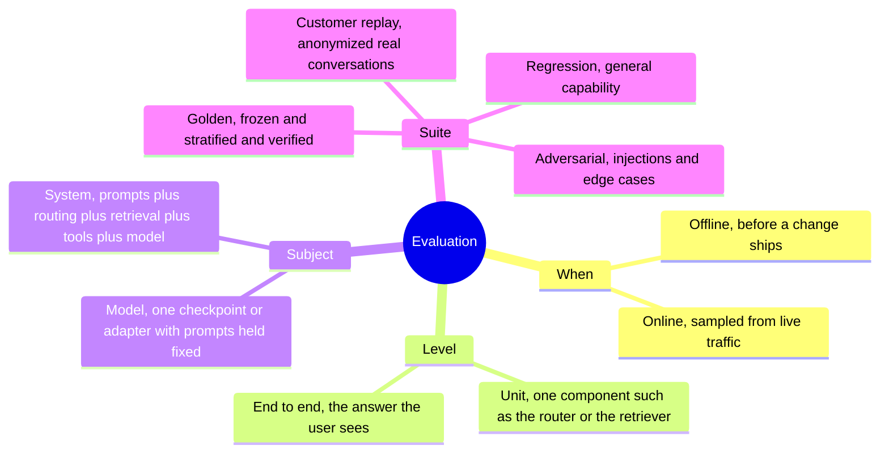
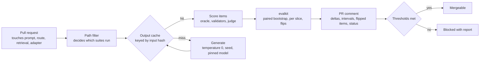
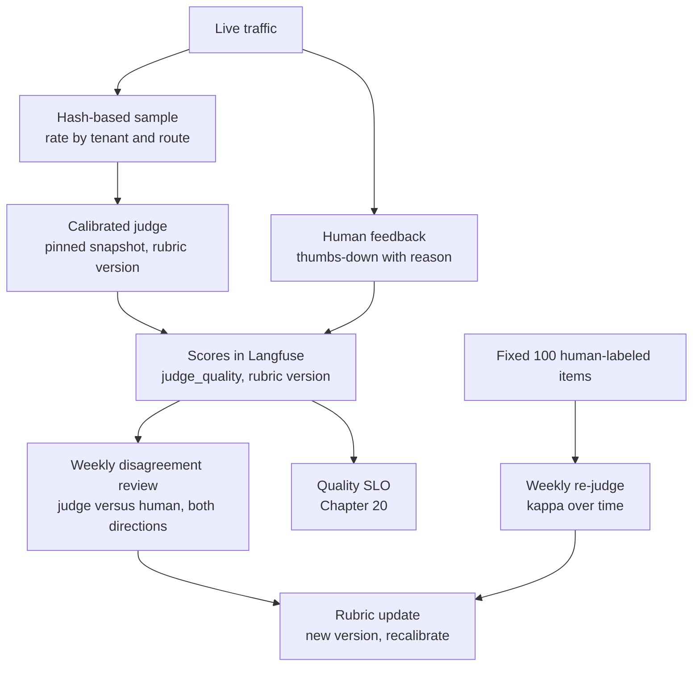
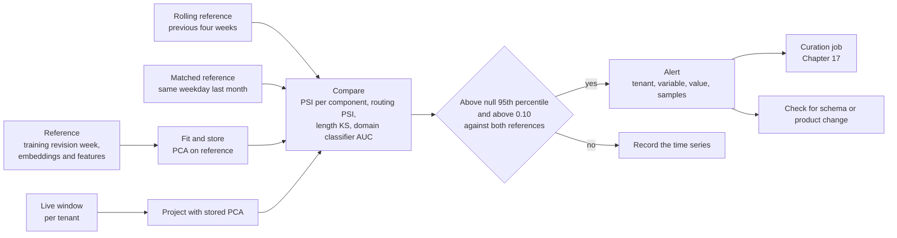

# Chapter 18: Evaluation Platforms and Monitoring

> **What you will be able to do:** classify an evaluation by what it measures and what it is allowed to conclude; build a golden set from production traffic that survives an audit; run evaluation on every pull request with deterministic outputs and intervals on every delta; choose a judge sampling rate from a target precision; compute the population stability index and a Kolmogorov-Smirnov statistic by hand and know when each is lying to you; detect drift in embeddings, outputs, routing, and concepts with seasonality-aware baselines; govern evaluation data and recognize evaluation debt.
>
> **Where it is used:** P3.2, P3.4. Feeds the gate of P3.1 and the SLOs of Chapter 20.
>
> **Prerequisites:** Chapter 11 (bootstrap intervals, paired comparison, judge calibration), Chapter 17 (traces, golden sets as gate inputs).

## 18.0 The problem this chapter solves

A pull request changes one line of the routing rule for the text-to-SQL analyst. Nobody can say whether the answer quality went up, down, or sideways until a customer complains. A second pull request changes a prompt, the golden set score rises by two points, and the team celebrates a change that is inside the noise. Meanwhile a tenant's users have started asking about a new product line, the model has never seen those column names, and the first anyone hears of it is a failure spike three weeks later.

An evaluation platform answers three questions continuously. Before a change ships: did it help, on which slice, with what confidence. While the system runs: is quality holding, sampled cheaply enough to afford and often enough to notice. Over weeks: has the world moved away from what we evaluate against. You have built the pieces (Langfuse evaluations, Kolmogorov-Smirnov and population stability index monitors at UnitedHealth, oracles at Atom11). This chapter connects them into one platform with the statistics made explicit, and gives you the one-page evaluation strategy a customer will ask for on day one.

The platform has a governance side too. Evaluation sets that contain PII, that are quietly edited, or that no longer resemble the traffic produce confident numbers about nothing. Evaluation debt is as real as technical debt, and the same machinery that detects traffic drift measures it.

## 18.1 Evaluation taxonomy

An evaluation is classified along four axes, and a report that does not state all four invites a wrong conclusion.



*Figure 18.1: The four axes of an evaluation; a report names all four.*

The distinction that causes the most confusion is **model versus system**. A customer experiences the system. A training run changes the model. A system evaluation that improves after a prompt change says nothing about the model, and a model evaluation that improves on the golden set says nothing about what the user sees if the router never sends that class of request to the model. Keep two report templates and never mix their numbers in one table.

The second is **unit versus end to end**. A retriever's recall@10 is a unit metric. Execution accuracy of the final SQL is end to end. Unit metrics localize a regression; end-to-end metrics decide whether it matters. Both are needed, and a change that raises a unit metric while lowering the end-to-end one is common enough (a retriever that returns more schema chunks and buries the right table) that the report must show both.

## 18.2 Building golden sets from production

A golden set of a few hundred stratified, verified items is worth more than ten thousand scraped ones. Building it is a protocol, not a download.

### 18.2.1 Stratified sampling

Define strata by tenant, intent, and difficulty. Sample traces from a reference period with an allocation that gives every stratum enough items to say something.

Proportional allocation puts $n_h = n \cdot N_h / N$ items in stratum $h$, where $n$ is the total size, $N_h$ the stratum's traffic, and $N$ the total traffic. It reproduces the traffic mix and gives the best precision for the overall number. It starves small strata. Add a floor: every stratum gets at least $n_{\min}$ items, and the remainder is allocated proportionally.

Worked example. Three tenants with 70, 20, and 10 percent of traffic, $n = 300$, $n_{\min} = 50$. Proportional gives 210, 60, 30. The third tenant is below the floor, so fix it at 50 and split the remaining 250 between the first two in proportion 70 to 20: 194 and 56. Final allocation 194, 56, 50. The overall estimate is now a weighted average (weights 0.7, 0.2, 0.1 on the per-stratum accuracies), not a simple mean over items. Compute it that way, and compute the interval with the stratified bootstrap (resample within each stratum).

When the strata have very different difficulty, Neyman allocation $n_h \propto N_h \sigma_h$ with $\sigma_h = \sqrt{p_h (1 - p_h)}$ gives more items to the strata with accuracy near 0.5, where the variance is highest. In practice the floor matters more than the refinement.

### 18.2.2 Anonymization, labels, freezing

Anonymize with the same redactor as the flywheel (Chapter 17, section 17.4), with the same schema allowlist, and measure the same recall and false-positive rate. Have subject-matter experts write or verify the correct SQL and the expected result set, and record the rubric they used. Route 10 percent of items to two experts and report kappa (Chapter 11). Freeze the set as version G1 with a card: provenance period, strata and counts, redaction statistics, labelers and agreement, and the rubric. Never edit G1. Append as G2. A number reported against "the golden set" without a version is not a number.

## 18.3 Eval-as-CI

Any pull request that touches a prompt, a routing rule, a retrieval setting, a tool schema, or an adapter reference triggers the offline suites against the changed system, and the result is posted as a comment on the pull request.



*Figure 18.2: Eval-as-CI; the cache makes reruns free and the statistics make the comment honest.*

### 18.3.1 Determinism

A comparison between the main branch and the pull request is only meaningful if the same input produces the same output on both sides unless the change caused the difference. Sources of nondeterminism and their fixes:

| Source | Mechanism | Fix |
|---|---|---|
| Sampling | Temperature above zero draws different tokens | Temperature 0; a fixed seed where the engine supports one |
| Batching | Continuous batching changes the floating-point reduction order; near-tied logits flip | Fixed batch composition for the suite where possible; otherwise accept and measure (below) |
| Provider model updates | An API alias points at a new snapshot | Pin snapshot identifiers; record them in the report |
| Retrieval index | The index changed between runs | Snapshot the index per suite version; record the snapshot identifier |
| Time in prompts | Today's date, "recent" filters | Freeze the clock in the suite harness |
| Tool results | Live databases return different rows | Suites run against a frozen fixture database |

The **output cache** is the load-bearing mechanism. Key every generation by the hash of the exact system prompt, the messages, the tool schemas, the model or adapter identifier and snapshot, the sampling parameters, and the retrieval snapshot identifier. A hit returns the stored completion. Reruns are free, the main-branch side of every comparison is served from cache, and the pull request side generates only for items whose inputs changed. A cache key missing one field (the tool schemas, say) silently serves stale outputs after that field changes and is the first thing to check when a comment looks wrong.

### 18.3.2 Flakiness is a bug

Run every item that flipped between main and the pull request three more times on each side. An item whose outcome is not stable across the three runs is flaky. Report flaky items separately from real flips and do not count them in the delta. Then fix the cause: a near-tie in the SQL between two equivalent formulations is fine and should be scored as equivalent by the oracle; a prompt that produces a different table choice run to run at temperature 0 indicates a batching-sensitive near-tie and a genuinely uncertain model on that item, which is information about the item, not noise to ignore. A suite with more than about 2 percent flaky items is a suite you cannot trust for 2-point decisions.

### 18.3.3 The pull request comment

The comment shows, per suite: the metric, the main-branch value, the pull request value, the paired difference with its 95 percent interval, and $n$. Below it: a per-slice table with the same columns, the list of flipped items (identifier, before, after, a link to the trace), the flaky list, the cache hit rate, the runtime, and the pinned identifiers (model snapshot, adapter, index snapshot, golden set version). The status line applies the same non-inferiority and superiority rules as the gate in Chapter 17. Listing 18.2 builds it.

Worked example. Golden set G2, $n = 320$. Main 0.812, pull request 0.828, $\hat{\Delta} = 0.016$. Discordant fractions 0.06 and 0.044, so $\mathrm{SE} \approx \sqrt{(0.104 - 0.0003)/320} \approx 0.018$ and the interval is about $[-0.019, 0.051]$. Status: non-inferior at $\tau = 0.02$, not superior. The comment says so, lists the 19 items that flipped upward and the 14 that flipped downward, and the reviewer looks at the 14. That is the value of the comment: it points at items, not at a number.

## 18.4 Online evaluation

### 18.4.1 Judge sampling rates

Sampling a share of live traffic for a calibrated LLM judge trades cost against precision. Choose the rate from the precision you need, not from a round number.

To estimate an acceptable-answer rate $p$ with a 95 percent half-width $h$, the number of judged answers per window is

$$
n = \frac{z^2 \, p (1 - p)}{h^2}, \qquad z = 1.96
$$

Worked example. $p \approx 0.90$, $h = 0.03$: $n = 3.84 \cdot 0.09 / 0.0009 \approx 384$ judged answers per window. At 20,000 requests a day:

- Daily overall estimate: rate $384 / 20{,}000 \approx 1.9$ percent.
- Weekly per-tenant estimate for five tenants of equal size: $5 \cdot 384 = 1920$ per week over $140{,}000$ requests, rate $\approx 1.4$ percent. For unequal tenants the smallest tenant sets the rate, or gets its own higher rate.
- Detecting a drop of $\delta = 0.05$ between two windows at about two standard errors needs roughly $n \approx 2 z^2 p(1-p)/\delta^2 \approx 2 \cdot 3.84 \cdot 0.09 / 0.0025 \approx 276$ per window.

A rate of 2 to 5 percent supports daily overall and weekly per-tenant estimates at this traffic. Sample new tenants and new routes at 20 percent for their first two weeks, and sample the canary (Chapter 17) at a higher rate than the champion. Sample by hashing the trace identifier so the choice is reproducible and so the same items can be re-judged after a judge update. Cost is the rate times traffic times the judge's price per call; write it in the strategy document as a line item.

### 18.4.2 Feedback capture and disagreement review

Capture human feedback with the lowest-friction control: a thumbs-down with an optional reason. Every negative is a curation candidate. Once a week, review the items where the judge and humans disagreed, in both directions. Judge said good, human said bad: the rubric is missing a criterion the user cares about. Judge said bad, human said good or said nothing: the judge is over-strict on a pattern, and the block rate of any guardrail that uses it is inflated.

### 18.4.3 Judge drift

The judge is a model too, and it drifts for two reasons: the provider updates the snapshot behind the alias, and the traffic changes so that the rubric's examples no longer resemble the items. Detect both by re-judging a fixed set of 100 human-labeled items weekly and tracking kappa against the human labels over time. A drop in kappa with no change in your rubric means the snapshot changed. A drop that coincides with input drift (section 18.5) means the rubric needs new examples. Pin the judge's snapshot identifier and treat a change as a change to the evaluation system that needs its own calibration run.



*Figure 18.3: Online evaluation; the fixed re-judged set is the instrument that detects the judge itself drifting.*

## 18.5 Drift detection

Drift is a leading indicator. A new intent shows up as a shift in the request distribution before it shows up as failures. Four kinds, one example each from the analyst:

- **Input drift**: users start asking about a product line whose tables the model has never seen.
- **Output drift**: answers get longer, refusals rise, the model starts adding caveats.
- **Routing drift**: the complexity classifier sends more traffic to the frontier route, so cost rises with no change in what users ask.
- **Concept drift**: the same question now has a different right answer, because the customer changed a business rule or a fiscal calendar.

### 18.5.1 Population stability index

The population stability index (PSI) compares a live distribution to a reference distribution over $B$ bins:

$$
\mathrm{PSI} = \sum_{i=1}^{B} (\ell_i - r_i) \ln \frac{\ell_i}{r_i}
$$

where $r_i$ is the reference proportion in bin $i$ and $\ell_i$ the live proportion. Each term is non-negative (the sign of the difference matches the sign of the log), and PSI is the sum of the two Kullback-Leibler divergences $\mathrm{KL}(\ell \| r) + \mathrm{KL}(r \| \ell)$, the symmetric Jeffreys divergence.

Binning decides everything. Use $B = 10$ bins with edges at the deciles of the **reference** distribution, so every reference bin holds 10 percent and the live histogram is read against those fixed edges. For categorical variables (route, intent, tenant) the categories are the bins. Zero proportions make the log infinite; smooth by adding a small count (0.5) to every bin before normalizing, or clamp proportions at $\epsilon = 10^{-4}$.

Worked example with two histograms. The variable is request length in tokens. Reference: 5000 requests from the training revision's week, decile bins, 500 per bin, so $r_i = 0.10$ for all $i$. Live: 1200 requests from this week with counts 48, 60, 72, 96, 120, 144, 156, 168, 168, 168 in the same bins, so $\ell = (0.04, 0.05, 0.06, 0.08, 0.10, 0.12, 0.13, 0.14, 0.14, 0.14)$. Requests have shifted longer.

| Bin | $r_i$ | $\ell_i$ | $\ell_i - r_i$ | $\ln(\ell_i / r_i)$ | Term |
|---|---|---|---|---|---|
| 1 | 0.10 | 0.04 | $-0.06$ | $-0.916$ | 0.0550 |
| 2 | 0.10 | 0.05 | $-0.05$ | $-0.693$ | 0.0347 |
| 3 | 0.10 | 0.06 | $-0.04$ | $-0.511$ | 0.0204 |
| 4 | 0.10 | 0.08 | $-0.02$ | $-0.223$ | 0.0045 |
| 5 | 0.10 | 0.10 | 0 | 0 | 0 |
| 6 | 0.10 | 0.12 | 0.02 | 0.182 | 0.0036 |
| 7 | 0.10 | 0.13 | 0.03 | 0.262 | 0.0079 |
| 8 | 0.10 | 0.14 | 0.04 | 0.336 | 0.0135 |
| 9 | 0.10 | 0.14 | 0.04 | 0.336 | 0.0135 |
| 10 | 0.10 | 0.14 | 0.04 | 0.336 | 0.0135 |

$\mathrm{PSI} \approx 0.166$.

A second live week with $\ell = (0.12, 0.11, 0.10, 0.09, 0.08, 0.08, 0.09, 0.10, 0.11, 0.12)$, a mild widening, gives $\mathrm{PSI} \approx 0.020$.

The conventional bands come from credit-risk practice, not from a derivation: below 0.10 no meaningful shift, 0.10 to 0.25 moderate shift worth investigating, above 0.25 a significant shift. The first week is moderate; the second is nothing.

Two facts keep PSI honest. First, its expected value under no drift is not zero. With $N$ reference and $M$ live samples, PSI is approximately distributed as $(1/N + 1/M)$ times a chi-square with $B - 1$ degrees of freedom (Yurdakul, circa 2018), so

$$
\mathbb{E}[\mathrm{PSI} \mid \text{no drift}] \approx (B - 1)\left(\frac{1}{N} + \frac{1}{M}\right)
$$

For $N = 5000$, $M = 1200$, $B = 10$: about $9 \cdot 0.00103 \approx 0.009$, and the 95th percentile of the null is about $16.9 \cdot 0.00103 \approx 0.017$. The mild week's 0.020 is just above the null's 95th percentile: statistically detectable, practically nothing. The conventional 0.10 band is about magnitude; the chi-square scaling is about whether the sample could have produced it by chance. Report both. Second, for a small tenant with $M = 150$ the null expectation is $9 \cdot (0.0002 + 0.0067) \approx 0.062$, so a PSI of 0.10 on that tenant is noise. Never alert on PSI for a slice without checking its null expectation, and set a minimum $M$ (about 500) below which the slice is pooled with a longer window.

### 18.5.2 The Kolmogorov-Smirnov test in outline

For a continuous variable the two-sample Kolmogorov-Smirnov (KS) statistic is the largest vertical gap between the two empirical cumulative distribution functions:

$$
D = \sup_x \left| F_{\text{ref}}(x) - F_{\text{live}}(x) \right|
$$

The null hypothesis of identical distributions is rejected at level $\alpha$ when

$$
D > c(\alpha) \sqrt{\frac{n + m}{n m}}, \qquad c(0.05) \approx 1.358, \quad c(0.01) \approx 1.628
$$

with $n$ and $m$ the two sample sizes. Worked example: $n = 5000$, $m = 1200$, observed $D = 0.06$. The critical value is $1.358 \cdot \sqrt{6200 / 6{,}000{,}000} \approx 1.358 \cdot 0.0322 \approx 0.044$. Reject. At $n = m = 100{,}000$ the critical value is $1.358 \cdot \sqrt{2 / 100{,}000} \approx 0.006$, so a $D$ of 0.01 is "significant" and meaningless. Treat $D$ as the effect size and the test as a sanity check; a $D$ below about 0.05 is rarely worth an alert regardless of the p-value. KS needs no bins and is sensitive to shifts in the center of the distribution, less so in the tails; PSI with quantile bins sees the tails. Use PSI as the default and KS as a second opinion on continuous variables such as latency and length.

### 18.5.3 Embedding drift

Requests are text. Embed them (a small sentence encoder is enough) and compare the two clouds of vectors. Two methods, both cheap.

**PSI on projected dimensions.** Fit a principal component analysis on the reference embeddings and keep the top $k$ components (10 to 20 explain most of the variance of a 384-dimensional sentence embedding on a narrow domain). Project both sets, compute PSI per component with decile bins from the reference, and report the maximum and the mean over components. The maximum catches a shift along one direction (one new intent); the mean catches a diffuse shift. Fit the projection once per reference revision and store it; refitting on live data hides the drift you are looking for. Random projections work too and need no fit, at some loss of sensitivity.

**A domain classifier.** Label reference embeddings 0 and live embeddings 1, train a logistic regression with cross-validation, and read the held-out area under the curve (AUC). With no drift the classifier cannot separate the sets and AUC is near 0.5. AUC of 0.60 is a mild shift; 0.70 and above is real. The classifier gives two things PSI cannot: a single number over the whole space, and, from the live items it scores most confidently as live, a ranked sample of the requests that moved, which is exactly what the curation job should look at. The cost is one small fit per tenant per day, seconds on a CPU. The maximum mean discrepancy (Gretton et al., 2012) is the kernel-based alternative with a permutation test; it is more principled and slower, and the classifier is the practical default (Rabanser, Günnemann, and Lipton, 2019 compare these methods empirically).

### 18.5.4 Output, routing, and concept drift

Output drift is measured on generation statistics: completion length (PSI or KS), refusal rate, the rate of hedging phrases, the fraction of SQL with a `LIMIT`, and the validator failure rate. A rise in refusals with flat inputs points at a model or prompt change; with shifted inputs it points at the new inputs.

Routing drift is PSI over the categorical route distribution per tenant, plus the classifier's score distribution. A rise in the frontier share with flat input drift means the classifier moved (a retrain or a threshold change); with input drift it means the inputs got harder. Cost per query rises either way, and the FinOps view in Chapter 20 needs the reason.

Concept drift cannot be seen in inputs or outputs. The same question now has a different right answer. Detect it with a **golden replay**: re-run a fixed slice of golden items against the live database weekly and compare the execution results with the frozen expected results. Items whose expected result changed while the SQL did not indicate the data or the business rules moved. Those items go to an expert, who either updates the expected result in a new golden version or confirms a customer-side change that needs a conversation.

### 18.5.5 Seasonality baselines

Monday traffic differs from Saturday traffic; month-end differs from mid-month. A reference fixed at the training revision's week will alert every Monday. Use two references: a **rolling** reference (the previous four weeks pooled) and a **matched** reference (the same weekday, or the same week of the prior month). Alert when the live window exceeds the threshold against both. Store the PSI time series per tenant and variable so that a recurring weekly bump is visible as a pattern rather than as seven separate alerts.

### 18.5.6 Alert thresholds

For each monitored variable and slice: a minimum live sample size (about 500), a PSI threshold of 0.10 for investigation and 0.25 for a page-level alert, both applied only if the value also exceeds the null 95th percentile computed from $N$ and $M$, both references exceeded, and a cooldown of one window per variable and slice so that a persisting shift produces one alert with a duration rather than a daily repeat. The alert carries which tenant, which variable, the PSI value against its null expectation, and twenty sample requests ranked by the domain classifier. Chapter 20 sets the paging policy.



*Figure 18.4: The drift pipeline; the projection is fit once on the reference and the alert requires both magnitude and statistical support.*

## 18.6 Evaluation governance and evaluation debt

Governance is five rules and one measurement.

1. No PII in any evaluation set. The redactor runs on every item and the card records the statistics; a spot check of 50 items per version by a human is the control on the redactor.
2. A card for every set: provenance, period, strata, labelers, agreement, rubric version, redaction statistics, and the versions it supersedes.
3. Access control. The training pipeline's service account cannot read evaluation sets; only the gate's read-only role can. Few-shot examples in prompts are drawn from a separate pool that is checked against the golden set with the same 13-gram overlap test as training data (Chapter 10). Evaluation data copied into a prompt is the quietest form of contamination.
4. Version discipline. A tag scheme such as `G2.1`: the major number changes when items are removed or corrected, the minor number when items are appended. A reported number cites the tag.
5. Retention. Customer replay sets built from real conversations carry a retention period and a deletion procedure that is tested, because a tenant will eventually invoke it.

The measurement is **evaluation debt**: the gap between what the evaluation sets contain and what the traffic contains. Compute it with the same machinery as drift: PSI on the projected embeddings of the golden set's inputs against the last month's live requests, per tenant. When the golden set's PSI against live traffic passes 0.25, the golden set is measuring last year's product. Schedule a quarterly refresh that appends a new stratified sample as a new minor version and reports the debt before and after.

## 18.7 Tools

- **promptfoo** runs declarative suites: a YAML file names providers, prompts, test cases, and assertions (exact match, contains, JSON schema, model-graded rubrics), and it has a red-team mode (Chapter 19). Good when the suite is a table of prompts and expected properties.
- **Inspect**, from the UK AI Security Institute, is a Python framework built around tasks, solvers (how the model is prompted and allowed to act), and scorers, with structured logs. Good when the evaluation involves multi-step behavior or tools.
- **DeepEval** provides metrics as pytest-style assertions, including rubric-based model grading and RAG metrics.
- **Ragas** provides retrieval-augmented-generation metrics such as faithfulness, answer relevance, and context precision and recall (Es et al., 2023).

The rule is to integrate rather than rebuild. Pick one runner for the declarative suites (promptfoo if the suites are tables, Inspect if they need Python), have it emit per-item results as JSON lines with item identifier, slice fields, and outcome, and let `evalkit` (Chapter 11) own the statistics and the report: paired bootstrap, per-slice intervals, flips, kappa. Do not report a runner's built-in aggregate as the number; it has no interval and no pairing.

## 18.8 Implementation notes

**Listing 18.1: Population stability index with reference-quantile bins and smoothing.**

```python
import numpy as np

def psi(reference: np.ndarray, live: np.ndarray, bins: int = 10,
        smoothing: float = 0.5) -> tuple[float, float]:
    """Return (psi, null_expectation) for a continuous variable."""
    edges = np.quantile(reference, np.linspace(0, 1, bins + 1))
    edges[0], edges[-1] = -np.inf, np.inf
    r_counts = np.histogram(reference, edges)[0] + smoothing
    l_counts = np.histogram(live, edges)[0] + smoothing
    r = r_counts / r_counts.sum()
    l = l_counts / l_counts.sum()
    value = float(np.sum((l - r) * np.log(l / r)))
    null = (bins - 1) * (1 / len(reference) + 1 / len(live))
    return value, null

def psi_categorical(ref_counts: dict, live_counts: dict, smoothing: float = 0.5):
    keys = sorted(set(ref_counts) | set(live_counts))
    r = np.array([ref_counts.get(k, 0) + smoothing for k in keys], float)
    l = np.array([live_counts.get(k, 0) + smoothing for k in keys], float)
    n_ref, n_live = r.sum(), l.sum()
    r, l = r / n_ref, l / n_live
    value = float(np.sum((l - r) * np.log(l / r)))
    return value, (len(keys) - 1) * (1 / n_ref + 1 / n_live)
```

The edges come from the reference quantiles and are then opened to infinity at both ends so that live values outside the reference range land in the outermost bins rather than being dropped. The smoothing count prevents infinite logs on empty bins. Returning the null expectation next to the value forces every caller to see both numbers, which is the point of section 18.5.1.

**Listing 18.2: Eval-as-CI comment builder.**

```python
def build_comment(suites: dict, slices: dict, flips: list, flaky: list,
                  pins: dict, tau: float = 0.02) -> str:
    lines = ["## Evaluation report", "",
             "| Suite | main | PR | delta | 95% CI | n | status |", "|---|---|---|---|---|---|---|"]
    overall_ok = True
    for name, r in suites.items():
        non_inferior = r["lo"] > -tau
        superior = r["lo"] > 0
        status = "superior" if superior else ("non-inferior" if non_inferior else "REGRESSION")
        overall_ok &= non_inferior
        lines.append(f"| {name} | {r['main']:.3f} | {r['pr']:.3f} | {r['delta']:+.3f} "
                     f"| [{r['lo']:+.3f}, {r['hi']:+.3f}] | {r['n']} | {status} |")
    lines += ["", "### Slices", "", "| Slice | delta | 99.2% CI | n |", "|---|---|---|---|"]
    for name, r in slices.items():
        flag = " WARN" if r["delta"] < -0.03 else ""
        lines.append(f"| {name} | {r['delta']:+.3f} | [{r['lo']:+.3f}, {r['hi']:+.3f}] | {r['n']}{flag} |")
    down = [f for f in flips if f["before"] and not f["after"]]
    up = [f for f in flips if f["after"] and not f["before"]]
    lines += ["", f"### Flipped items: {len(up)} up, {len(down)} down", ""]
    lines += [f"- {f['id']}: correct to incorrect ({f['trace_url']})" for f in down]
    lines += ["", f"Flaky items excluded: {len(flaky)}", "",
              "Pinned: " + ", ".join(f"{k}={v}" for k, v in pins.items()), "",
              f"**Status: {'PASS' if overall_ok else 'FAIL'}**"]
    return "\n".join(lines)
```

Downward flips are listed in full because they are what a reviewer reads; upward flips are counted. The slice table uses the Bonferroni-corrected interval computed upstream, and the warning flag reproduces the gate's human-review rule from Chapter 17. Everything the comment claims is traceable: pins identify the exact model snapshot, adapter, index snapshot, and golden set version.

**Listing 18.3: Drift monitor job outline.**

```python
import numpy as np
from sklearn.decomposition import PCA

CHI2_95 = {9: 16.92}   # 95th percentile of chi-square with B-1 degrees of freedom

def fit_reference(ref_emb: np.ndarray, k: int = 12) -> PCA:
    return PCA(n_components=k, random_state=0).fit(ref_emb)

def embedding_drift(pca: PCA, ref_emb, live_emb, bins=10) -> dict:
    ref_p, live_p = pca.transform(ref_emb), pca.transform(live_emb)
    values, nulls = zip(*(psi(ref_p[:, j], live_p[:, j], bins) for j in range(ref_p.shape[1])))
    scale = 1 / len(ref_emb) + 1 / len(live_emb)
    return {"psi_max": max(values), "psi_mean": float(np.mean(values)),
            "null_95": CHI2_95[bins - 1] * scale}

def check_tenant(tenant: str, live: dict, rolling: dict, matched: dict, pca: PCA,
                 min_live: int = 500, investigate: float = 0.10) -> dict | None:
    if len(live["emb"]) < min_live:
        return None                      # pool with a longer window instead
    d_roll = embedding_drift(pca, rolling["emb"], live["emb"])
    d_match = embedding_drift(pca, matched["emb"], live["emb"])
    route_psi, route_null = psi_categorical(rolling["routes"], live["routes"])
    fired = (d_roll["psi_max"] > max(investigate, d_roll["null_95"])
             and d_match["psi_max"] > max(investigate, d_match["null_95"]))
    return {"tenant": tenant, "embedding": d_roll, "routing": (route_psi, route_null),
            "alert": fired}
```

The projection is fit on the training revision's reference once and passed in; both the rolling and the matched comparisons project with it. The alert requires the maximum component PSI to exceed both the magnitude threshold and the null 95th percentile, against both references. Routing PSI is computed but alerted on separately with its own threshold, since a route mix shift has a different owner (the router) than an input shift.

**Listing 18.4: Domain classifier drift score with a ranked sample of shifted requests.**

```python
import numpy as np
from sklearn.linear_model import LogisticRegression
from sklearn.model_selection import cross_val_predict
from sklearn.metrics import roc_auc_score

def domain_classifier_drift(ref_emb, live_emb, live_texts, top_k=20):
    X = np.vstack([ref_emb, live_emb])
    y = np.r_[np.zeros(len(ref_emb)), np.ones(len(live_emb))]
    clf = LogisticRegression(max_iter=1000, class_weight="balanced")
    scores = cross_val_predict(clf, X, y, cv=5, method="predict_proba")[:, 1]
    auc = roc_auc_score(y, scores)
    live_scores = scores[len(ref_emb):]
    order = np.argsort(-live_scores)[:top_k]
    return auc, [(live_texts[i], float(live_scores[i])) for i in order]
```

Cross-validated predictions keep the AUC honest; fitting and scoring on the same points would report drift where there is none. `class_weight="balanced"` handles the usual imbalance between a large reference and a smaller live window. The returned texts are the live requests the classifier is most sure are new, which is the sample the alert should carry and the curation job should read.

## 18.9 Failure modes

| Symptom | Likely cause | How to confirm | Fix |
|---|---|---|---|
| Drift alerts every Monday on every tenant | Fixed reference with no seasonality baseline | PSI time series shows a weekly period | Rolling plus matched references; alert only when both exceed |
| Small tenant alerts constantly, large tenants never | PSI null expectation ignored; $M$ too small | Compare PSI with $(B-1)(1/N + 1/M)$ | Minimum live sample; pool small tenants into longer windows |
| KS rejects on everything | Large samples make tiny $D$ significant | $D$ below 0.05 with p-value near zero | Alert on $D$ as effect size; use the test only as a sanity check |
| Pull request comment shows no change after a prompt edit | Cache key omits a field that changed | Hash the inputs by hand and compare with the cache keys | Include every input field in the key; version the key schema |
| Same pull request gives different deltas on rerun | Flaky items counted as flips | Re-run flipped items three times | Report flaky items separately; fix near-tie scoring in the oracle |
| Judge kappa against humans drops with no rubric change | Provider snapshot changed behind the alias | Re-judge the fixed 100 items; compare with last week | Pin the snapshot; recalibrate on change; version the judge in the report |
| Golden score rises after a change to few-shot examples | Few-shot pool overlaps the golden set | 13-gram overlap check between pool and golden | Separate pool; overlap test in CI |
| Quality numbers drift up while feedback drifts down | Evaluation debt; golden set no longer resembles traffic | PSI of golden inputs against live embeddings above 0.25 | Quarterly refresh as a new minor version |
| Embedding drift alert after an embedding model upgrade | Reference and live embedded with different models | Check embedding model version in both sets | Re-embed the reference with the new model; refit the projection |
| Per-tenant judge estimates swing 10 points week to week | Sampling rate too low for the tenant's volume | Compute $n$ per tenant against the required 384 | Per-tenant rates; weekly rather than daily windows for small tenants |
| Concept drift discovered only by a customer | No golden replay | Expected results never re-executed | Weekly golden replay against the live database |

## 18.10 On your machine

The evaluation platform is CPU work except for generation, and generation is either cached or served by the local vLLM.

- **Suites**: golden 300, adversarial 150, regression 300, customer replay 250, about 1000 items. A cold run generates 1000 completions of about 200 tokens against the 1.5B model on the RTX 4060 through vLLM's batched engine, roughly 200,000 output tokens; at the batched throughput you measured in Chapter 13 for that model this is minutes, not hours. A warm run with a full cache scores in seconds. Judge calls for the model-graded items go to a frontier API; the P3.2 budget in the roadmap's cost table ($8 to $15 for the whole project) covers the judge calls if the cache does its job. Every uncached generation should be logged as a cache miss with its reason.
- **Runner**: GitHub Actions on a hosted runner for the cached path. For the uncached path, either a self-hosted runner inside WSL2 that can reach the local vLLM, or a Modal function that loads the adapter and serves the suite (Chapter 15). The hosted runner has no GPU and does not need one.
- **Drift job**: embedding 20,000 requests a day with a small sentence encoder runs on the 4060 in well under a minute, or on the CPU in a few minutes. PCA on 5000 reference embeddings at 384 dimensions and the logistic-regression domain classifier are trivial. Store the PSI time series in the same Postgres that backs the dashboards.
- **Synthetic shift for the definition of done**: inject a new intent by adding 2000 paraphrased questions about a table absent from the training revision into one tenant's synthetic traffic for a day. Expect the maximum component PSI for that tenant to cross 0.25 and the domain classifier AUC to exceed 0.7 while the other tenants stay near their null expectation. If the alert fires for every tenant, the reference is wrong; if it fires for none, the projection was refit on live data.
- **Kaggle and the A100**: not needed for this project. If the regression suite includes lm-eval tasks on a 7B model, run them on the rented A100 once per gate cycle inside the P3.1 budget rather than on the laptop.

## Exercises

1. Reference proportions over five bins are $(0.2, 0.2, 0.2, 0.2, 0.2)$ and live proportions are $(0.10, 0.15, 0.20, 0.25, 0.30)$. Compute PSI and classify the shift.

<details><summary>Solution</summary>

Terms: $(-0.10)\ln(0.5) = 0.0693$; $(-0.05)\ln(0.75) = 0.0144$; $0$; $(0.05)\ln(1.25) = 0.0112$; $(0.10)\ln(1.5) = 0.0405$. Sum $\approx 0.135$. Moderate shift (0.10 to 0.25): investigate. With $N = M = 2000$ the null expectation is $4 \cdot 0.001 = 0.004$, so the shift is far outside chance.
</details>

2. Traffic is 8,000 requests a day across three tenants with 60, 30, and 10 percent shares. You want a weekly per-tenant acceptable-rate estimate with half-width 0.03 at $p \approx 0.9$. What sampling rate per tenant, and what overall rate?

<details><summary>Solution</summary>

Each tenant needs about 384 judged items a week. Weekly traffic: 33,600, 16,800, 5,600. Rates: 1.1 percent, 2.3 percent, 6.9 percent. Overall about 1152 judged items over 56,000 requests, 2.1 percent. A single flat rate of 2.1 percent would give the small tenant only 118 items (half-width about 0.054), so use per-tenant rates.
</details>

3. Classify each scenario as input, output, routing, or concept drift and name the detector: (a) the frontier share rises from 20 to 35 percent with embedding PSI flat; (b) refusal rate doubles with embedding PSI flat; (c) a tenant's PSI on the top component reaches 0.4 and the classifier AUC is 0.8; (d) golden replay shows 12 items whose expected result changed with the SQL unchanged.

<details><summary>Solution</summary>

(a) Routing drift; categorical PSI on routes; the router changed, not the inputs. (b) Output drift; refusal rate monitor; a model or prompt change. (c) Input drift; embedding PSI and domain classifier; a new intent, curate the top-ranked live requests. (d) Concept drift; golden replay; expert review of expected results, new golden minor version or a customer conversation.
</details>

4. Reference $n = 3000$ and live $m = 800$ latency samples give $D = 0.05$. Is the KS test significant at 5 percent, and would you alert?

<details><summary>Solution</summary>

Critical value $1.358 \sqrt{3800 / 2{,}400{,}000} = 1.358 \cdot 0.0398 \approx 0.054$. $D = 0.05$ is below it: not significant. No alert either way; a $D$ of 0.05 is at the edge of practical relevance. Check PSI on the same variable as a second opinion, since KS is weak in the tails where latency shifts live.
</details>

5. A domain classifier gives cross-validated AUC 0.52 for tenant A and 0.78 for tenant B. What do you conclude and do for each?

<details><summary>Solution</summary>

Tenant A: no detectable shift; record and continue. Tenant B: a real shift; pull the top-scored live requests, read them, check for a schema or product change, and send them to the curation queue with the novelty signal set high. If the shift persists across two windows, plan a training cycle that includes the new intent and add a stratum for it to the next golden minor version.
</details>

6. With $N = M = 500$ and $B = 10$, a slice shows PSI 0.03. Is that drift?

<details><summary>Solution</summary>

Null expectation $9 \cdot (1/500 + 1/500) = 0.036$. The observed 0.03 is below what no drift would produce on average. Not drift. The slice needs a larger window before any PSI reading on it means anything.
</details>

7. List the fields that must be in the eval-as-CI cache key for the text-to-SQL analyst, and name the failure if each is omitted.

<details><summary>Solution</summary>

System prompt text (stale outputs after a prompt edit); messages including few-shot examples (same); tool and function schemas (a schema change unseen); model identifier and snapshot (provider update unseen); adapter identifier and hash (new adapter served old outputs); sampling parameters (temperature change unseen); retrieval index snapshot identifier (index change unseen); fixture database version (result changes misattributed); harness version (scoring changes misattributed).
</details>

8. Allocate a 400-item golden set over four intents with 50, 25, 15, and 10 percent of traffic and a floor of 60 per intent. Give the allocation and explain how the overall accuracy is computed.

<details><summary>Solution</summary>

Proportional: 200, 100, 60, 40. The last is below the floor; fix it at 60 and split 340 across the first three in proportion 50, 25, 15: 189, 94, 57. The third is now below 60; fix it at 60 and split 280 across the first two in proportion 50, 25: 187, 93. Final: 187, 93, 60, 60. Overall accuracy is the traffic-weighted mean $0.5 p_1 + 0.25 p_2 + 0.15 p_3 + 0.10 p_4$, with the interval from a stratified bootstrap that resamples within each intent.
</details>

## Summary

- Every evaluation report states four things: offline or online, unit or end to end, model or system, and which suite version.
- Golden sets are stratified with a per-stratum floor, anonymized with a measured redactor, labeled with recorded agreement, frozen, and versioned; the overall number is a weighted mean with a stratified bootstrap interval.
- Eval-as-CI is trustworthy because of an output cache keyed by every input field, temperature zero with pinned snapshots, and the rule that a flaky item is a bug reported separately, never noise.
- The pull request comment shows deltas with paired intervals, per-slice tables at a corrected level, and the items that flipped downward, with links.
- Judge sampling rate follows from $n = z^2 p(1-p)/h^2$: about 384 items per window for a 3-point half-width near 90 percent, so 2 to 5 percent of traffic at 20,000 requests a day, more for small tenants, new routes, and canaries.
- The judge drifts; a fixed set of 100 human-labeled items re-judged weekly, with kappa tracked, is the instrument that catches it.
- PSI is the symmetric KL divergence over reference-quantile bins; its null expectation is about $(B-1)(1/N + 1/M)$, and the 0.10 and 0.25 bands are conventions about magnitude, not tests.
- The KS statistic $D$ is an effect size; at large samples its p-value is meaningless.
- Embedding drift uses PSI on a projection fit once on the reference, or a cross-validated domain classifier whose AUC is the drift score and whose top-scored live items are the sample to curate.
- Concept drift is invisible in inputs and outputs; a weekly golden replay against the live database detects it.
- Seasonality needs two references, rolling and matched; alert only when both are exceeded and the value beats its null.
- Evaluation debt is PSI between the golden set and live traffic; refresh quarterly as a new minor version.

## Further reading

- Massey, 1951, "The Kolmogorov-Smirnov Test for Goodness of Fit".
- Yurdakul, circa 2018, "Statistical Properties of Population Stability Index" (doctoral dissertation; verify the exact title and year).
- Rabanser, Günnemann, and Lipton, 2019, "Failing Loudly: An Empirical Study of Methods for Detecting Dataset Shift".
- Gretton, Borgwardt, Rasch, Schölkopf, and Smola, 2012, "A Kernel Two-Sample Test".
- Lipton, Wang, and Smola, 2018, "Detecting and Correcting for Label Shift with Black Box Predictors".
- Gama, Žliobaitė, Bifet, Pechenizkiy, and Bouchachia, 2014, "A Survey on Concept Drift Adaptation".
- Zheng et al., 2023, "Judging LLM-as-a-Judge with MT-Bench and Chatbot Arena".
- Shankar, Zamfirescu-Pereira, Hartmann, Parameswaran, and Arawjo, 2024, "Who Validates the Validators? Aligning LLM-Assisted Evaluation of LLM Outputs with Human Preferences".
- Es, James, Espinosa-Anke, and Schockaert, 2023, "RAGAS: Automated Evaluation of Retrieval Augmented Generation".
- Breck, Cai, Nielsen, Salib, and Sculley, 2017, "The ML Test Score: A Rubric for ML Production Readiness and Technical Debt Reduction".
- Husain, 2024, "Your AI Product Needs Evals" (essay).
- Huyen, 2025, *AI Engineering*, the evaluation chapters; Huyen, 2022, *Designing Machine Learning Systems*, the chapter on data distribution shifts and monitoring.
- Primary documentation: promptfoo, Inspect (UK AI Security Institute), DeepEval, Ragas, Langfuse (scores and datasets), GitHub Actions (path filters and pull request comments).
