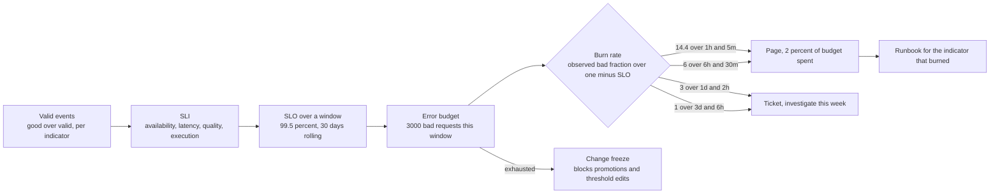
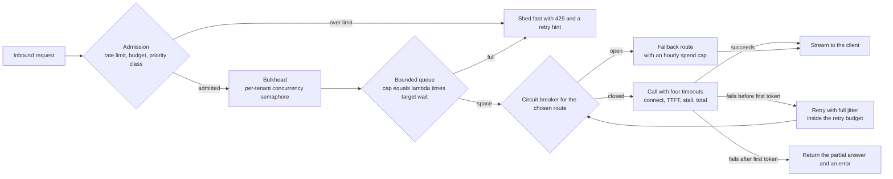
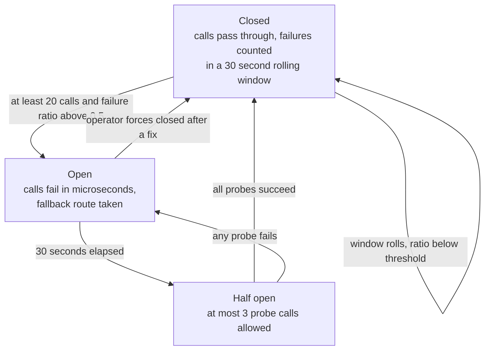
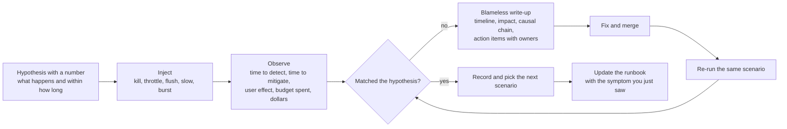
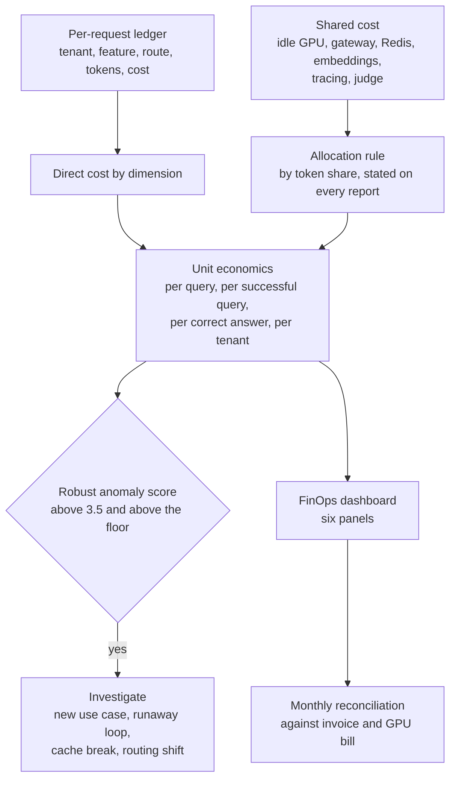

# Chapter 20: Reliability and FinOps

> **What you will be able to do:** write service level indicators as good-over-valid ratios and turn them into objectives a customer will sign; compute a quality objective from judge sampling and say how large the sample must be to detect the breach you care about; derive multi-window burn-rate alert thresholds from the budget fraction they spend and compute how fast each one detects a given failure; apply timeouts, jittered retries, circuit breakers, bulkheads, shedding, and backpressure to an LLM gateway with a frontier fallback, with the arithmetic for each; read GPU capacity signals and compute the headroom your scaling lead time demands; run a game day and write the postmortem; build unit economics that allocate every dollar to a tenant, a feature, and a route.
>
> **Where it is used:** P3.4 (SLOs, the game day, the write-ups, the FinOps view), P5.2 (the capstone ships with an on-call guide).
>
> **Prerequisites:** Chapter 11 (confidence intervals), Chapter 13 (the knee and the serving cost model), Chapter 16 (the gateway, routing, and the cost ledger). Chapter 14 supplies the Kubernetes primitives the mitigations use, and Chapter 18 supplies the drift monitors that sit beside these alerts.

## 20.0 The problem this chapter solves

The system is live. Monday morning an analyst writes "it was slow earlier". Nobody knows whether it was, how many people it affected, or whether anything is still wrong. Wednesday the finance contact asks why last month's bill was 40 percent higher than the month before, and the honest answer is that nobody can say which tenant, which feature, or which route caused it. Neither question is about machine learning. Both end engagements.

Reliability answers the first question by deciding, in advance and with the customer, what "working" means as a number, how much failure is acceptable in a window, and what happens when that allowance runs out. That is the service level objective and the error budget, and the discipline around them is fifty years old in other fields and about twenty in software. The parts that are new here are that the dominant user-visible failure of an LLM system is quality rather than availability, and that quality is measured by sampling, so the indicator itself has a confidence interval.

FinOps answers the second question by making every dollar attributable before it is spent. Chapter 16 built the ledger. This chapter turns it into unit economics, an allocation rule for shared cost, an anomaly detector, and a dashboard, and it computes the return on the caches you built so that the next architecture decision has a number next to it.

The two subjects belong in one chapter because they trade against each other constantly. Headroom costs money. A frontier fallback that preserves the experience during a GPU outage can cost hundreds of dollars an hour. Judge sampling that makes the quality objective measurable is itself a line item. Every reliability decision in this chapter is priced.

## 20.1 SLI, SLO, SLA

A **service level indicator** (SLI) is a measurement of one aspect of service quality, written as a ratio:

$$\text{SLI} = \frac{\text{good events}}{\text{valid events}}$$

A **service level objective** (SLO) is a target for an SLI over a window: "at least 99.5 percent, measured over a rolling 30 days". A **service level agreement** (SLA) is a contract with consequences, always looser than the internal objective, so that missing the objective is a warning rather than a breach.

The ratio form is not a stylistic preference. It composes with error budgets, it is insensitive to traffic volume, and it lets you define "good" precisely. Percentile targets do not compose: "p99 latency under 1.5 seconds" cannot be added across a day of five-minute windows, whereas "fraction of requests under 1.5 seconds" can.

### 20.1.1 Defining valid and good

Most disputes about an SLO are disputes about the denominator. Write it down.

- **Valid** excludes health checks and synthetic probes, excludes requests rejected by the rate limiter or the budget guard (those are the tenant's own doing and belong in a separate quota-rejection metric), and excludes requests rejected by a policy rule. It includes timeouts, 5xx responses, and requests the client abandoned after the server was already late.
- **Good** for availability means a response with a non-error status. For latency it means time to first token under the threshold. For quality it means judged acceptable by the rubric of Chapter 11, section 11.7. For side-effect correctness it means the generated SQL executed without error.

### 20.1.2 Four indicators for an LLM service

| Indicator | Good events | Valid events | Typical objective |
|---|---|---|---|
| Availability | Responses with a non-error status | All non-excluded requests | 99.5 percent over 30 days |
| Latency | Requests whose time to first token is under 1.5 seconds | All requests that produced a response | 95 percent over 30 days |
| Quality | Sampled answers judged acceptable | Sampled answers that were judged | 95 percent over 7 days |
| Execution correctness | Generated statements that executed without error | All statements generated | 99 percent over 7 days |

Two thresholds appear inside these, and both are product decisions: the 1.5 second latency threshold and the acceptability rubric. Neither belongs to the engineer alone, and both go in the objectives document with the reasoning.

### 20.1.3 Choosing the targets

Measure for four weeks first, then set the objective slightly below the achieved level, not at an aspiration. An SLO the system has never met is an alert generator, not a control. Two further rules of thumb: the internal objective is tighter than the contractual SLA, so that a miss is caught before it is a breach; and the number of nines should be justified by what the user does next, since an analyst who retries a failed query in five seconds is not hurt by 99.5 percent the way a payment path would be.

For an LLM system the honest ordering is that quality breaches hurt more than availability breaches, and they are invisible without sampling. A provider that silently swaps a model snapshot, an adapter promoted through Chapter 17's gate on a biased evaluation, or a prompt-cache invalidation that changes the assembled prompt all produce zero errors, unchanged latency, and worse answers. The quality SLO is the only symptom alert that catches them.

## 20.2 A quality SLO from judge sampling

### 20.2.1 The indicator

Sample a share $s$ of answered requests, stratified by tenant, feature, and intent. Score each sampled answer with the calibrated judge of Chapter 11, section 11.7, or with the oracle where one exists. The SLI is the fraction judged acceptable. Two rules keep it honest: the sample must be drawn before the answer is known to be good (no sampling of failures only, which Chapter 17's curation does deliberately and for a different purpose), and errored requests must not appear here, because they already count against availability.

### 20.2.2 The indicator has a confidence interval

With $n$ judged answers and observed acceptable fraction $\hat{q}$, the standard error is

$$\mathrm{SE} = \sqrt{\frac{\hat{q}(1 - \hat{q})}{n}}$$

Worked example. Traffic 20,000 requests a day, a 7-day window, so 140,000 requests. At a 1 percent sampling rate, $n = 1{,}400$. At $\hat{q} = 0.95$: $\mathrm{SE} = \sqrt{0.95 \times 0.05 / 1400} = 0.0058$, and the 95 percent interval is about $\pm 1.1$ points. An objective of 95 percent cannot be adjudicated more finely than about a point in this window, and saying so in the objectives document prevents an argument later.

### 20.2.3 How large a sample the objective needs

To detect a drop from $q_0$ to $q_1$ with power $1 - \beta$ at one-sided significance $\alpha$:

$$n \approx \frac{\left(z_\alpha \sqrt{q_0(1-q_0)} + z_\beta \sqrt{q_1(1-q_1)}\right)^2}{(q_0 - q_1)^2}$$

where $z_\alpha$ and $z_\beta$ are the standard normal quantiles. For $q_0 = 0.95$, $q_1 = 0.93$, $\alpha = 0.05$ ($z_\alpha = 1.645$), power 0.8 ($z_\beta = 0.84$):

$$n \approx \frac{(1.645 \times 0.2179 + 0.84 \times 0.2551)^2}{0.0004} = \frac{(0.3585 + 0.2143)^2}{0.0004} = \frac{0.3281}{0.0004} \approx 820$$

So about 820 judged answers per window detect a 2-point drop. The 1,400 from a 1 percent sample clears it. A tenant with 5,000 requests a week contributes 50 sampled answers at that rate, which detects nothing, so stratified over-sampling for small tenants is required if you promise them a per-tenant objective. Do not promise one you cannot measure.

### 20.2.4 The decision rule, and the cost of measuring

Use the point estimate for error-budget accounting, because it is an unbiased estimate of the shortfall. Use an interval for paging: page only when the upper bound of the 95 percent interval is below the target, which is strong evidence of a real breach, and raise a ticket when the point estimate is below the target. Without that split you page on sampling noise roughly half the time whenever true quality sits exactly at the objective.

The judge is a cost. At 1,400 calls a week with a 1,200-token judging prompt and a 150-token verdict, at the assumed prices of 3.00 dollars per million input tokens and 15.00 per million output tokens, that is $1{,}400 \times (0.0036 + 0.00225) = 8.19$ dollars a week. Put it on the FinOps dashboard as a measurement line. It is one of the cheapest controls in the system and the first one a cost-cutting exercise tries to remove.

The judge also drifts and is biased. Recalibrate against human labels monthly with Cohen's kappa (Chapter 11), and state the calibration date next to the quality number. An SLI measured by an instrument with unknown bias is a number, not a measurement.

## 20.3 Error budgets and burn-rate alerting

### 20.3.1 The budget

For an objective of $\text{SLO}$ over a window with $N$ valid events, the error budget is

$$E = (1 - \text{SLO}) \, N$$

Worked: 99.5 percent over 30 days at 20,000 requests a day gives $N = 600{,}000$ and $E = 3{,}000$ bad requests. That is the whole allowance: a single 90-minute total outage at 833 requests an hour spends 1,250 of them, 42 percent of the month's budget.

### 20.3.2 Burn rate

The **burn rate** is how fast the budget is being spent relative to the rate that would exactly exhaust it over the window:

$$b = \frac{\text{observed bad fraction}}{1 - \text{SLO}}$$

At $b = 1$ the budget lasts exactly one window. At $b = 10$ it lasts a tenth of the window. The fraction of the budget consumed by a burn rate $b$ sustained for a period $w$ inside an SLO window $T$ is

$$\text{budget consumed} = b \, \frac{w}{T}$$

### 20.3.3 Multi-window, multi-burn-rate alerts

A single threshold cannot serve both purposes. A threshold tuned to catch a total outage within minutes ignores a 2 percent error rate that quietly eats the month. A threshold tuned to catch the 2 percent takes hours to fire on a total outage and fires constantly on noise.

The standard answer is a set of rules, each with a long window that sets sensitivity and a short window (conventionally one twelfth of the long window) that must also be breaching, so that the alert clears quickly once the problem stops. Invert the budget-consumed formula to get the burn rate for a chosen budget fraction and long window: $b = \text{budget fraction} \times T / w$.

The configuration below is the common one, from Google's SRE workbook, with a 30-day window; treat the pairs as assumptions to state in the objectives document, not as physics.

| Severity | Long window $w$ | Short window | Burn rate $b$ | Budget spent when it fires | Bad-request rate at a 99.5 percent SLO |
|---|---|---|---|---|---|
| Page | 1 hour | 5 minutes | 14.4 | 2 percent | 7.2 percent |
| Page | 6 hours | 30 minutes | 6 | 5 percent | 3 percent |
| Ticket | 1 day | 2 hours | 3 | 10 percent | 1.5 percent |
| Ticket | 3 days | 6 hours | 1 | 10 percent | 0.5 percent |

Each burn rate is derived, not chosen: $14.4 = 0.02 \times 720 / 1$, $6 = 0.05 \times 720 / 6$, $3 = 0.10 \times 720 / 24$, $1 = 0.10 \times 720 / 72$. A three-rule variant drops the 1-day row. Both are common.

### 20.3.4 Detection time, worked

For a failure that starts at full strength with a bad fraction $r$ and an empty window before it, the long-window average crosses the threshold after approximately

$$t_{\text{detect}} \approx w \, \frac{b\,(1 - \text{SLO})}{r}$$

Total outage, $r = 1$, at 99.5 percent:

| Rule | Threshold | Detection time |
|---|---|---|
| 14.4 over 1 hour | 0.072 | 4.3 minutes |
| 6 over 6 hours | 0.030 | 10.8 minutes |
| 3 over 1 day | 0.015 | 21.6 minutes |
| 1 over 3 days | 0.005 | 21.6 minutes |

A sustained 5 percent error rate, $r = 0.05$, burn rate $b = 10$, budget exhausted in 72 hours:

| Rule | Fires? | Detection time |
|---|---|---|
| 14.4 over 1 hour | No, threshold 7.2 percent is above 5 percent | never |
| 6 over 6 hours | Yes | $360 \times 0.03/0.05 = 216$ minutes, 3.6 hours |
| 3 over 1 day | Yes | $1440 \times 0.015/0.05 = 432$ minutes, 7.2 hours |

The 6-hour page catches it after 3.6 hours, having spent 5 percent of the budget. The fast rule never sees it. That is the whole argument for multiple windows in two rows.

### 20.3.5 The low-traffic problem

At 20,000 requests a day the 5-minute short window contains about 69 requests, and 7.2 percent of 69 is 5 requests. Five bad requests in five minutes is well inside normal variation, so the fast page fires on noise. Two fixes, both standard: require a minimum number of bad events (20 is a reasonable floor) before a rule can fire, and widen the short window for low-traffic services. A third option is to aggregate the SLI across tenants and alert per service rather than per tenant, and to handle per-tenant degradation through tickets from the daily rollup. Listing 20.1 implements the minimum-events guard.

### 20.3.6 What the budget is for

An error budget is a spending decision, not a report. The policy, agreed before it is needed: while the budget is healthy, ship. When a burn-rate ticket fires, reliability work takes priority over features. When the budget is exhausted, freeze changes except reliability fixes until the window rolls.

For this system "change" includes the things Chapter 17 automates: an adapter promotion, a prompt template edit, a router threshold change, a cache threshold change. A depleted budget must block the flywheel's promotion step, which means the gate needs to read the budget. That link is easy to build and easy to forget, and forgetting it means the automation keeps shipping during an incident.



*Figure 20.1: From events to objectives to budget to alerts, with the freeze that also stops the flywheel's automatic promotions.*

## 20.4 Alerting on symptoms

Page on what the user experiences: availability, latency, quality, and the burn of their budgets. Everything else is a ticket, a dashboard annotation, or a graph.

A GPU at 95 percent utilization is not an incident. A KV cache at 90 percent is not an incident. Both are capacity signals that predict an incident, and they belong in the capacity review and in the autoscaler's input, not in the pager. Cause-based alerts multiply as the system grows, they go stale silently, and every one of them trains the on-call engineer to ignore pages.

Three tests for a page: is it **actionable** (there is something a human can do now), is it **novel** (it is not the third page for one incident), is it **urgent** (waiting until morning would make it worse). If any answer is no, make it a ticket.

Measure the alerting itself. Track pages per week (for a team of one to three, more than two a week is unsustainable), page precision (the fraction that led to an action), and mean time to acknowledge. A page that never leads to an action is a bug in the alert, not in the engineer.

The LLM-specific gap: a quality regression produces no errors and no latency change, so no symptom alert based on availability or latency will fire. The quality SLI is the symptom alert for it, which is why section 20.2 treats its sample size as a design parameter rather than a detail.

## 20.5 Resilience patterns for an LLM gateway

The gateway of Chapter 16 calls two backends with very different failure modes: a self-hosted vLLM that can be out of KV blocks, restarting, or gone, and a frontier API that can rate-limit, overload, or slow down. Every pattern below is applied to that specific shape.

### 20.5.1 Timeouts

A single total timeout is wrong for a streaming response. Use four:

| Timeout | Typical value | Why |
|---|---|---|
| Connect | 2 seconds | A backend that cannot accept a connection is down, not slow |
| Time to first token | 3 times the p99 TTFT, for example 5 seconds | Covers queueing and prefill; the only window in which a retry is invisible |
| Inter-token stall | 10 seconds | Catches a stream that stops mid-answer, which no total timeout catches early |
| Total | `max_tokens` times expected time per output token times 2, capped | A backstop, not the primary control |

Set every timeout below the caller's timeout, and below the load balancer's idle timeout, or you will debug a truncation that your code never sees.

### 20.5.2 Retries, only where they are safe

Retry only when the operation is idempotent in its side effects. A plain completion is: re-running it produces a different answer but changes nothing in the world. A completion whose tool calls write to a database is not, and must carry an idempotency key through to the tool (Chapter 21, section 21.4). Retry on connect errors, on 429 with a `Retry-After` honored, on 5xx, and on timeouts that occur before the first token. Never retry after tokens have been streamed to the client.

Use full jitter for the backoff:

$$\text{sleep} = \mathrm{Uniform}\left(0,\; \min\left(\text{cap},\; \text{base} \times 2^{\text{attempt}}\right)\right)$$

Without jitter, every client that failed at the same instant retries at the same instant, and the recovering backend is hit by a synchronized wave that knocks it down again. Full jitter spreads the retries uniformly over the backoff interval and is the variant AWS's analysis of backoff strategies recommends for most cases.

**Retry amplification.** If each request is retried up to $m$ times and each attempt fails independently with probability $f$, the expected number of attempts is

$$\mathbb{E}[\text{attempts}] = \sum_{i=0}^{m} f^{\,i} = \frac{1 - f^{\,m+1}}{1 - f}$$

At $f = 0.5$, $m = 2$: 1.75 attempts per request. At $f = 0.9$: 2.71. At $f = 0.99$: 2.97. Retries multiply load by up to $m + 1$ exactly when the backend is least able to absorb it. The control is a **retry budget**: allow retries only while they are under a fixed share of successful request volume, commonly 10 percent, and fail fast once the budget is spent. Envoy and gRPC both implement this idea; implement it yourself if your client library does not.

### 20.5.3 Circuit breakers

A circuit breaker stops calling a backend that is failing, so that requests fail in microseconds instead of occupying a connection for the timeout. Three states: **closed** (calls pass), **open** (calls fail immediately and take the fallback), **half-open** (a small number of probes are allowed to test recovery).

Trip condition on a rolling window with a minimum volume, for example: at least 20 calls in the last 30 seconds and a failure ratio above 0.5. The minimum volume prevents two failures at 3 a.m. from opening the breaker. Open for a fixed interval, 30 seconds, then allow 3 probes; close on success, reopen on the first failure.

One breaker per backend and per route, never one global breaker. A frontier API's overload must not stop calls to vLLM.

**Worked example.** A frontier API returns errors for 3 minutes for a customer at 2 million requests a day, 1,383 requests a minute, with a 30-second time-to-first-token timeout. Without a breaker, 4,150 requests each hold a connection for 30 seconds; steady-state concurrency is $1{,}383/60 \times 30 \approx 692$ stuck requests, which exhausts connection pools and worker slots and takes the healthy route down with it. With the breaker, about 20 requests fail, the breaker opens in roughly a second, and the remaining 4,130 fail over in under 5 milliseconds each. The breaker's value is not the errors it avoids, it is the capacity it protects.

### 20.5.4 Fallbacks, and what they cost

The fallback ladder for this gateway:

1. Self-hosted route unhealthy, so send to the frontier API. Preserves the experience, costs money.
2. Frontier route unhealthy, so send to the self-hosted model, and annotate the response as degraded if quality differs materially.
3. Both unhealthy, so serve a cached answer where one exists within a longer stale window, clearly labeled.
4. Nothing available, so shed with a clear error and a retry hint rather than a timeout.

Fallbacks need a budget guard. At 2 million requests a day, a full fallback to the frontier route at 0.00285 dollars per request costs $83{,}000 \times 0.00285 = 237$ dollars an hour. A two-hour incident on a Sunday is 474 unbudgeted dollars, which is cheap. A fallback left on for a week because nobody noticed the self-hosted route was still down is 39,800 dollars, which is an incident of its own. Cap the fallback spend per hour, alert when the cap is approached, and page when the fallback rate has been non-zero for longer than an hour.

### 20.5.5 Bulkheads

One tenant's burst must not consume the resources of the others. Give each tenant a concurrency semaphore sized at $\lceil \text{share} \times C \rceil$ of the gateway's total concurrency $C$, plus a small shared overflow pool so that idle capacity is still usable. The same idea applies inside the engine: vLLM's `max_num_seqs` bounds the running set, and a single tenant submitting 200 long-context requests will fill the KV cache and preempt everyone else (Chapter 13, section 13.5) unless the gateway limits them first.

Separate the pools by priority class as well as by tenant: interactive requests, batch jobs, and the evaluation harness must not share a queue, or a nightly evaluation run will degrade the morning peak.

### 20.5.6 Load shedding and backpressure

**Shedding** is rejecting work early, cheaply, and by priority, when accepting it would degrade everyone. Shed the lowest priority class first: background evaluation, then batch, then interactive. Return 429 with a `Retry-After`, never a slow timeout, because a fast rejection lets the client decide.

**Backpressure** is refusing to accept more work than can be completed in time. Bound every queue. Little's law gives the bound: for a mean arrival rate $\lambda$ and a target mean wait $W$, the mean number waiting is $L = \lambda W$, so a queue capped at $L_{\max} = \lambda W_{\max}$ keeps the wait near the target. Worked: $\lambda = 10$ requests per second, $W_{\max} = 2$ seconds, so cap the queue at 20.

A second bound comes from the client's patience. If the client abandons after 30 seconds and the system completes 10 requests per second at capacity, a request queued behind more than 300 others is guaranteed to be wasted work: it will complete after the client has gone. Any queue longer than that is pure loss, and the correct action is to shed.



*Figure 20.2: The resilience patterns in the order a request meets them, with the two places a request can be rejected cheaply.*



*Figure 20.3: The circuit breaker, with a minimum call volume so that two failures cannot open it and probes that test recovery without exposing users.*

## 20.6 Capacity signals for GPU serving

### 20.6.1 What not to watch

CPU utilization says nothing about a GPU server. GPU utilization as reported by `nvidia-smi` is the fraction of time at least one kernel was resident, and during decode it sits near 100 percent at a batch of 1 and at a batch of 64, so it cannot distinguish an idle server from a saturated one. Neither belongs on a capacity dashboard for this workload.

### 20.6.2 What to watch

The engine's own metrics (Chapter 13; names are version-dependent in vLLM, check yours):

| Signal | Meaning | Lead or lag |
|---|---|---|
| Running sequences against `max_num_seqs` | How full the batch is | Leading |
| Waiting queue length | Requests admitted but not yet running | Leading, the strongest one |
| KV-cache utilization | Fraction of blocks allocated | Leading |
| Preemption counter | Sequences evicted for want of blocks | Leading, and already painful |
| Prefix-cache hit rate | Whether the shared prefix is still shared | Leading, for cost and latency both |
| p99 time to first token | Queueing plus prefill | Lagging |
| p99 time per output token | Batch pressure | Lagging |

Queue depth and KV-cache utilization move before latency does. Autoscale on queue depth with KEDA (Chapter 14, section 14.6), alert on latency, and review capacity on cache utilization.

### 20.6.3 Headroom and the scaling lead time

Headroom exists for four things: traffic bursts, the canary adapter's share (Chapter 17), the rolling update's surge replica (Chapter 14, section 14.5), and the time it takes to add capacity. The last one is usually the binding constraint.

A new GPU replica costs node provisioning (2 to 5 minutes for a cloud GPU node, zero if the node pool is warm), image pull (1 to 3 minutes if the image is not cached on the node), and model load (1 to 3 minutes for a 7B from a local volume, longer from object storage). Call the total lead time $t_{\text{lead}}$, and let $g$ be the rate at which demand grows during the morning ramp, in requests per second per minute. If capacity is $\lambda_{\max}$, you must trigger scaling at

$$\lambda_{\text{trigger}} = \lambda_{\max} - g\, t_{\text{lead}}$$

Worked, using the A100 knee from Chapter 13 at $\lambda_{\max} = 9.3$ requests per second and $t_{\text{lead}} = 7$ minutes:

| Ramp rate $g$ | Trigger at | As a share of capacity |
|---|---|---|
| 0.1 requests per second per minute | 8.6 | 92 percent |
| 0.2 | 7.9 | 85 percent |
| 0.5 | 5.8 | 62 percent |
| 1.0 | 2.3 | 25 percent |
| 1.4 | 0 | autoscaling cannot keep up |

Above about 1.3 requests per second per minute of ramp, reactive autoscaling cannot help at all and the answer is scheduled pre-provisioning: bring capacity up at 08:30 because the analysts arrive at 09:00. That is a conclusion customers accept readily once they see the lead-time arithmetic, and it is the reason scale-to-zero is wrong for interactive workloads.

## 20.7 Game days

A game day is a scheduled exercise in which you break something on purpose, having written down beforehand what you expect to happen.

### 20.7.1 The loop

1. **Hypothesis**, in one sentence with a number: "when the vLLM container dies, the circuit breaker opens within 5 seconds, the gateway fails over to the frontier route, no request returns an error, and p99 time to first token rises by less than 400 ms."
2. **Injection**: the specific fault, the blast radius, and the abort condition.
3. **Observation**: time to detect (when did an alert fire, not when did you notice), time to mitigate, user-visible effect, budget consumed, dollars spent.
4. **Compare** against the hypothesis. A matched hypothesis is recorded and you move on. A mismatch is an incident write-up, even though nobody was hurt, because the write-up is the artifact that produces the fix.
5. **Fix, merge, re-run** the scenario. A game day whose action items are not re-tested has proven nothing.

Rules: announce it, have an abort switch, run against a staging stack the first time, never during a change freeze or a customer's peak, and have one person observing who is not breaking anything.

### 20.7.2 Scenarios for this stack

| Scenario | Injection | Hypothesis to test |
|---|---|---|
| Engine death | Kill the vLLM container | Breaker opens, fallback to frontier, no user errors, cost per query rises to the frontier level |
| Frontier throttling | Return 429 from a proxy in front of the API | Retries with jitter honor `Retry-After`, retry budget caps amplification, escalated requests degrade to the local answer |
| Cache loss | Flush Redis | Hit rate goes to zero, latency rises, cost per query rises by the cache's share, nothing errors |
| Slow database | Inject 5 seconds of latency into Postgres | Validator timeout fires, requests escalate rather than hang, queue does not grow without bound |
| Noisy tenant | One tenant bursts to 20 times its normal rate | Bulkhead holds, other tenants' p99 unchanged, the bursting tenant is rate-limited not errored |
| Quality regression | Serve a deliberately worse adapter to 100 percent | Quality SLI drops, the ticket rule fires within its window, rollback is one pointer change |
| Key expiry | Revoke the frontier API key | Breaker opens on 401, fallback to local, a page fires, the runbook's rotation steps work |

The quality-regression scenario is the one most teams skip and the one that most resembles what actually goes wrong in an LLM system.

### 20.7.3 The blameless postmortem

Blameless means the document explains how the system allowed the outcome, not who typed the command. "Human error" is never a root cause; the absence of a guard that would have caught the error is. The structure:

1. **Title and date**, with the severity and the duration.
2. **Summary**, three sentences a customer executive can read.
3. **Impact**: users affected, requests affected, dollars, error budget consumed, and which SLOs were breached.
4. **Timeline** with timestamps: first fault, first signal, first alert, acknowledgement, mitigation, resolution. The gap between first fault and first alert is the detection time and is usually the most valuable number in the document.
5. **Root cause and contributing factors**, as a causal chain rather than a single line.
6. **What went well**, honestly. Controls that worked should be named so they are not removed in the next refactor.
7. **What was luck**: the part that did not fail but could have.
8. **Action items** with an owner, a priority, and a due date, tracked in the same system as feature work.
9. **Supporting data**: dashboards, trace identifiers, log excerpts.

A worked skeleton from the first game-day scenario, in the format P3.4 asks you to produce three of:

**Title.** vLLM container termination, severity 2, 14 minutes, 2026-11-27.
**Summary.** The serving container was killed to test failover. The gateway failed over to the frontier route, but 41 requests errored during a 9-second window because the circuit breaker's minimum volume was not reached quickly enough at the current traffic rate. Cost rose from 0.000587 to 0.00285 dollars per query for the duration.
**Impact.** 41 failed requests of 3,120 in the window, 1.3 percent of the hour, 1.4 percent of the monthly error budget. Latency SLO not breached. Additional spend 8.90 dollars.
**Timeline.** 14:02:10 container killed. 14:02:11 first connection refused. 14:02:20 breaker opened after 20 failures. 14:02:20 fallback active. 14:06:00 fast-burn page fired. 14:16:00 container restored.
**Root cause.** The breaker's minimum volume of 20 calls takes 9 seconds at 2.2 requests per second, and connection-refused errors were counted at the same weight as timeouts.
**Contributing factors.** No health check drove the route out of rotation independently of the breaker. The page fired 3.8 minutes after the failure, as the burn-rate arithmetic predicts, which is correct behavior and felt slow.
**Action items.** Treat connection-refused as an immediate trip regardless of volume, owner and date. Add a readiness-based route removal, owner and date. Re-run the scenario after both land.



*Figure 20.4: The game-day loop. The write-up exists to produce action items, and the loop is not closed until the re-run matches.*

## 20.8 Runbooks and on-call for small teams

A **runbook** is what an engineer follows at 3 a.m. with no context. One entry per alert, not one per component:

- What the alert means, in one sentence, and what the user is experiencing.
- The dashboard to open first and the two panels to read.
- The three most likely causes and the single check that distinguishes each.
- The mitigation, as commands, with the expected output.
- How to roll back: the adapter alias (Chapter 17), the Helm release (Chapter 14), the router threshold.
- When to escalate and to whom, and what to tell the customer.

Runbook entries come from game days and from real incidents. Write the entry while the incident is fresh, and prune entries whose alert no longer exists.

**On-call for one to three people** cannot follow enterprise patterns. Be explicit instead: paging hours and what happens outside them, written into the SLA rather than implied; a single primary with a named backup; an agreed maximum of two pages a week before the alerting itself becomes the work; and a documented "nobody answered" path, because with a team of two, there will be a night when nobody does. For a customer who will operate the system themselves, the runbook plus the on-call guide is the handover artifact, and it is worth more than the code.

## 20.9 FinOps

### 20.9.1 Unit economics

Four numbers, in increasing order of usefulness:

$$\text{cost per query} = \frac{\text{spend}}{\text{requests}}, \qquad \text{cost per successful query} = \frac{\text{spend}}{\text{successful requests}}$$

$$\text{cost per correct answer} = \frac{\text{cost per query}}{\text{accuracy}}, \qquad \text{cost per tenant per month} = \sum_{\text{tenant's requests}} c$$

Cost per successful query charges failures and retries where they belong; a system that fails 10 percent of requests and retries them is 10 percent more expensive than its cost-per-query suggests. Cost per correct answer, from Chapter 16, is the only one of the four that cannot be improved by routing more traffic to a worse model.

### 20.9.2 Allocation of shared cost

Direct costs come from the ledger of Chapter 16, section 16.6. Shared costs do not: the idle share of the GPU, the gateway's own compute, Redis, the embedding service, the observability stack, and the judge. They must be allocated, and the rule must be stated wherever the numbers appear.

Two defensible rules. **By request share** is simple and penalizes tenants whose requests are small. **By token share** tracks LLM cost drivers better and is the default here. Whichever you choose, the idle GPU line is the one that decides the answer at low utilization.

Worked. An A100 at 1.39 dollars an hour is about 1,015 dollars a month. At 30 percent utilization roughly 710 dollars of that is idle capacity, so allocating only the busy fraction understates every tenant's true cost by more than a factor of three. Charge the idle line to the service and report it, or charge it pro rata and say so. Hiding it is how a per-tenant margin turns out to be negative.

### 20.9.3 Cache return on investment

$$\text{savings} = n_{\text{hits}} \left(c_{\text{avoided}} - c_{\text{lookup}}\right), \qquad \text{ROI} = \frac{\text{savings} - \text{infrastructure cost}}{\text{infrastructure cost}}$$

Worked, with the Chapter 16 numbers and an assumed 50 dollars a month for Redis plus 15 for embedding compute, 65 dollars total.

| Scenario | Hits per day | Avoided cost per hit | Monthly savings | ROI |
|---|---|---|---|---|
| 20,000 requests a day, 16 percent hit rate, cascade behind the cache | 3,200 | 0.000696 | 67 dollars | 0.03, break-even |
| 20,000 requests a day, frontier-only behind the cache | 3,200 | 0.00285 | 274 dollars | 3.2 |
| 2,000,000 requests a day, 16 percent hit rate, cascade behind the cache | 320,000 | 0.000696 | 6,684 dollars | 102 |

The first row is the useful one: a semantic cache in front of an already cheap cascade at modest volume barely pays for itself, and its real justification is latency, not cost. Say that rather than claiming a saving the arithmetic does not support. Prompt caching is different: it has no infrastructure cost at all, so its return is unconditional and the metric to report is the cached-read share.

### 20.9.4 Spend anomaly detection

Daily spend per tenant is spiky and right-skewed, so a mean-and-standard-deviation rule alerts constantly. Use a robust score against the trailing window's median:

$$z = \frac{0.6745\,(x - \tilde{x})}{\mathrm{MAD}}, \qquad \mathrm{MAD} = \mathrm{median}\left(|x_i - \tilde{x}|\right)$$

where $\tilde{x}$ is the median of the trailing window and the constant 0.6745 rescales the median absolute deviation so that $z$ is comparable to a standard normal score for normal data. Alert when $|z| > 3.5$ **and** the absolute change exceeds a floor, for example 10 dollars a day, so that a tenant going from 0.40 to 0.95 dollars does not page anyone.

Worked. A tenant's last seven daily spends in dollars: 12.10, 11.80, 12.40, 11.95, 12.30, 12.05, and today 24.60. Median of the first six is 12.075. Absolute deviations are 0.025, 0.275, 0.325, 0.125, 0.225, 0.025, whose median is 0.175. So $z = 0.6745 \times 12.525 / 0.175 = 48.3$, far beyond 3.5, and the absolute change of 12.53 dollars clears the floor. Alert. The likely causes, in order: a new use case, a runaway agent loop (Chapter 21, section 21.2), a prompt-cache invalidation, or a routing shift toward the frontier route. The trace store answers which in one group-by.

Weekly seasonality matters: compare against the same weekday of previous weeks as well as the trailing median, or every Monday pages (Chapter 18, section 18.5 on seasonality baselines).

### 20.9.5 GPU utilization targets

Define utilization precisely, or the number means nothing:

$$u = \frac{\text{output tokens produced in the window}}{R_{\text{out}} \times \text{seconds in the window}}$$

with $R_{\text{out}}$ the aggregate output tokens per second at the benchmarked knee (Chapter 13, section 13.11). This is not `nvidia-smi` utilization.

Targets: 60 to 70 percent is healthy; below 30 percent, consolidate models onto one GPU with multi-LoRA, move to serverless with its cold start, or accept that you are paying for idle silicon and say so; above 85 percent, there is no headroom for a burst, a canary, or a rolling update's surge replica, and p99 latency is about to move.

### 20.9.6 The dashboard

Six panels, and a monthly reconciliation: spend trend by tenant with the anomaly list; cost per successful query and cost per correct answer over time; route mix with the escalation and fallback rates; cache hit rates, false-hit rate, cached-read share, and cache ROI; GPU utilization against the target with the knee marked; and measurement cost, meaning the judge and the shadow route, so that the cost of knowing things is visible and defended deliberately.



*Figure 20.5: FinOps from the ledger to unit economics, with the allocation rule named and the monthly reconciliation that keeps the numbers credible.*

## 20.10 Implementation notes

**Listing 20.1: Multi-window, multi-burn-rate alert rules with a minimum-events guard.**

```python
from dataclasses import dataclass

SLO = 0.995
WINDOW_HOURS = 720            # 30 days
MIN_BAD_EVENTS = 20           # low-traffic guard, section 20.3.5

@dataclass(frozen=True)
class Rule:
    name: str
    long_hours: float
    short_hours: float
    burn: float
    severity: str             # "page" or "ticket"

RULES = [
    Rule("fast", 1, 1 / 12, 14.4, "page"),
    Rule("medium", 6, 0.5, 6.0, "page"),
    Rule("slow", 24, 2, 3.0, "ticket"),
    Rule("trickle", 72, 6, 1.0, "ticket"),
]

def threshold(rule: Rule, slo: float = SLO) -> float:
    return rule.burn * (1 - slo)

def budget_spent(rule: Rule, window_hours: float = WINDOW_HOURS) -> float:
    return rule.burn * rule.long_hours / window_hours

def evaluate(rule: Rule, counts) -> tuple[bool, str]:
    """counts(hours) returns (bad_events, valid_events) over the trailing hours."""
    thr = threshold(rule)
    bad_l, valid_l = counts(rule.long_hours)
    bad_s, valid_s = counts(rule.short_hours)
    if valid_l == 0 or valid_s == 0:
        return False, "no traffic"
    if bad_l < MIN_BAD_EVENTS:
        return False, f"below minimum events {bad_l}"
    long_rate, short_rate = bad_l / valid_l, bad_s / valid_s
    firing = long_rate >= thr and short_rate >= thr
    return firing, (f"{rule.name} {rule.severity} long {long_rate:.4f} short {short_rate:.4f} "
                    f"threshold {thr:.4f} spends {budget_spent(rule):.1%} of budget")

# print(threshold(RULES[0]), budget_spent(RULES[0]))   -> 0.072 0.02
```

The burn rates are constants because they were derived once from the budget fraction and the window, and `budget_spent` recomputes that derivation so the alert's message can state what it costs. Both windows must be breaching: the long window sets sensitivity, and the short window makes the alert clear quickly once the failure stops, which is what stops a resolved incident from paging for another hour. The minimum-events guard uses the long window's bad count rather than the short window's, so a genuine sustained failure at low traffic still fires, just later. In a Prometheus deployment this same logic is expressed as recording rules over `rate()` windows with an `and` between them; the Python version is here because the arithmetic is the point.

**Listing 20.2: A circuit breaker with a fallback.**

```python
import random, time

class CircuitOpen(Exception):
    pass

class Breaker:
    def __init__(self, window_s=30.0, min_calls=20, fail_ratio=0.5,
                 open_s=30.0, probes=3):
        self.window_s, self.min_calls, self.fail_ratio = window_s, min_calls, fail_ratio
        self.open_s, self.probes = open_s, probes
        self.events: list[tuple[float, bool]] = []      # (timestamp, ok)
        self.state, self.opened_at, self.probes_left = "closed", 0.0, 0

    def _prune(self, now):
        cutoff = now - self.window_s
        self.events = [e for e in self.events if e[0] >= cutoff]

    def allow(self) -> bool:
        now = time.monotonic()
        if self.state == "open":
            if now - self.opened_at < self.open_s:
                return False
            self.state, self.probes_left = "half_open", self.probes
        return not (self.state == "half_open" and self.probes_left <= 0)

    def record(self, ok: bool, hard_fail: bool = False):
        now = time.monotonic()
        self.events.append((now, ok))
        self._prune(now)
        if self.state == "half_open":
            self.probes_left -= 1
            if not ok:
                self.state, self.opened_at = "open", now
            elif self.probes_left <= 0:
                self.state, self.events = "closed", []
            return
        if hard_fail and not ok:                        # connection refused trips immediately
            self.state, self.opened_at = "open", now
            return
        n = len(self.events)
        if n >= self.min_calls and sum(1 for _, o in self.events if not o) / n > self.fail_ratio:
            self.state, self.opened_at = "open", now

def call_with_fallback(breaker: Breaker, primary, fallback, req, attempts=3, base=0.2, cap=5.0):
    for attempt in range(attempts):
        if not breaker.allow():
            return fallback(req), "breaker_open"
        try:
            out = primary(req)
            breaker.record(True)
            return out, "primary"
        except ConnectionRefusedError as exc:
            breaker.record(False, hard_fail=True)
        except Exception:
            breaker.record(False)
        time.sleep(random.uniform(0, min(cap, base * 2 ** attempt)))   # full jitter
    return fallback(req), "exhausted"
```

`hard_fail` is the action item from the worked postmortem in section 20.7: a refused connection is proof the backend is gone, so it should not wait for 20 calls to accumulate. Half-open probes decrement a counter rather than relying on timing, so a burst cannot send a thousand probes at a recovering backend. The sleep uses full jitter, and the retry loop only ever calls `primary`, never the fallback, so a failing primary cannot amplify load onto the fallback. In production, replace `time.sleep` with the async equivalent and add the retry budget of section 20.5.2, which is a shared counter and does not fit in a listing this size.

**Listing 20.3: Cost per query aggregated by tenant, feature, and route, with shared-cost allocation.**

```python
import pandas as pd

def unit_economics(ledger: pd.DataFrame, shared_cost: float,
                   allocate_by: str = "tokens") -> pd.DataFrame:
    """ledger: one row per request with tenant, feature, route, ok, correct,
    input_tokens, output_tokens, cost_usd."""
    df = ledger.copy()
    df["tokens"] = df["input_tokens"] + df["output_tokens"]
    weight = df["tokens"] if allocate_by == "tokens" else 1.0
    df["share"] = weight / (df["tokens"].sum() if allocate_by == "tokens" else len(df))
    df["allocated_usd"] = df["cost_usd"] + df["share"] * shared_cost

    g = df.groupby(["tenant", "feature", "route"], dropna=False)
    out = g.agg(requests=("cost_usd", "size"),
                successes=("ok", "sum"),
                correct=("correct", "sum"),
                direct_usd=("cost_usd", "sum"),
                total_usd=("allocated_usd", "sum")).reset_index()
    out["cost_per_query"] = out["total_usd"] / out["requests"]
    out["cost_per_success"] = out["total_usd"] / out["successes"].replace(0, pd.NA)
    out["accuracy"] = out["correct"] / out["successes"].replace(0, pd.NA)
    out["cost_per_correct"] = out["cost_per_query"] / out["accuracy"]
    return out.sort_values("total_usd", ascending=False)
```

The allocation weight is an argument because the choice between token share and request share is a policy that must be stated on every report, and switching it is how you show a customer that the conclusion does not depend on it. `correct` comes from the oracle or the sampled judge, so `accuracy` is a per-group estimate whose interval must be attached before it is quoted (Chapter 11); a group with four judged answers has an accuracy of 0.75 that means nothing. The shared cost passed in must include the idle GPU line, or every per-tenant margin in the output is optimistic.

**Listing 20.4: Robust spend anomaly detection with an absolute floor.**

```python
import statistics

def robust_z(series: list[float], x: float) -> float:
    med = statistics.median(series)
    mad = statistics.median([abs(v - med) for v in series])
    if mad == 0:
        mad = 1e-9
    return 0.6745 * (x - med) / mad

def spend_anomaly(history: dict[str, list[float]], today: dict[str, float],
                  z_threshold: float = 3.5, floor_usd: float = 10.0):
    alerts = []
    for tenant, x in today.items():
        series = history.get(tenant, [])
        if len(series) < 7:
            continue                                   # not enough history to judge
        z = robust_z(series, x)
        delta = x - statistics.median(series)
        if abs(z) > z_threshold and abs(delta) >= floor_usd:
            alerts.append({"tenant": tenant, "spend": x, "z": round(z, 1),
                           "delta_usd": round(delta, 2)})
    return sorted(alerts, key=lambda a: -abs(a["delta_usd"]))
```

The median absolute deviation is zero whenever more than half the history is identical, which happens for a tenant with a flat batch job, so it is floored to avoid a division by zero that would report infinite significance. The absolute floor is what keeps small tenants out of the pager: a tenant moving from 0.40 to 0.95 dollars has a huge robust score and no business impact. Seven days of history is the minimum, and comparing against the same weekday of previous weeks in addition to the trailing median is the next refinement (Chapter 18, section 18.5).

## 20.11 Failure modes

| Symptom | Likely cause | How to confirm | Fix |
|---|---|---|---|
| The fast-burn page fires several times a day and nothing is wrong | Short window too small for the traffic; no minimum-events guard | Count valid events in the 5-minute window; compare fires against incidents | Add the minimum bad-event floor; widen the short window; aggregate the SLI across tenants |
| A real 3 percent error rate ran for a day without a page | Only the fast rule is configured | Replay the window against each rule's threshold | Add the 6-hour and 1-day rules; they exist for exactly this |
| Users complain about quality; every dashboard is green | No quality SLI, or judge sampling too small to detect the drop | Compute the sample size needed for the observed drop | Raise the sampling rate for the affected slice; use the oracle where one exists |
| The quality SLI drifts up over months while user feedback does not | Judge drift or judge leakage from the flywheel | Recalibrate against human labels and compare kappa with last quarter | Monthly recalibration; different judge prompts for curation and for the SLO |
| A backend outage took the whole gateway down | No circuit breaker, or one global breaker, or timeouts longer than the worker pool can absorb | Count in-flight requests during the incident; check breaker scope | One breaker per backend and route; connection refused trips immediately; bound concurrency |
| Load doubled during a partial outage | Retry amplification with no retry budget | Attempts per request during the window against the formula | Retry budget capped at 10 percent of successful volume; full jitter; no retries after the first token |
| The frontier bill jumped by thousands and nobody opened an incident | Fallback left active after the primary recovered | Fallback rate over time; compare with the primary's health | Page when the fallback rate is non-zero for more than an hour; cap hourly fallback spend |
| Autoscaling never catches the morning peak | Scaling lead time exceeds the ramp | Compare the ramp rate with capacity divided by lead time | Pre-provision on a schedule; keep a warm node pool; pre-pull images |
| One tenant's batch job degrades everyone at 09:00 | No bulkhead and no priority classes | Per-tenant concurrency and queue occupancy during the window | Per-tenant semaphores; separate priority queues; shed batch first |
| Per-tenant margins look healthy but the account loses money | Idle GPU cost not allocated | Compare allocated cost with the GPU invoice for the month | Allocate or explicitly report the idle line; state the allocation rule |
| Spend anomaly alerts every Monday | No weekly seasonality baseline | Plot spend by weekday | Compare against the same weekday in prior weeks as well as the trailing median |
| The postmortem's action items are still open three months later | Action items not tracked with feature work | Count open items older than their due date | Track them in the same backlog; re-run the game-day scenario as the closure criterion |

## 20.12 On your machine

P3.4 is budgeted at 4 hours, which works only because everything except one capacity check runs locally for free.

**The Docker Compose stack on WSL2.** The same stack as Chapter 16: vLLM on the RTX 4060 serving the fine-tuned 1.5B in bf16 (about 3.1 GB of weights, `--gpu-memory-utilization 0.85`, `--max-model-len 2048`), the gateway, Redis, Postgres, self-hosted Langfuse (budget 4 to 6 GB of RAM), an OpenTelemetry collector, and Prometheus with Grafana for the SLO and FinOps dashboards. Cap WSL2 memory at 20 GB in `.wslconfig`. Repositories, volumes, and the vector index live on ext4, never under the mounted Windows drive.

**Capacity to expect.** The 1.5B on the 4060 sustains roughly 300 to 500 output tokens per second aggregate at batch 8, which at 150 output tokens per answer is about 2 to 3 requests per second. A synthetic population of 20,000 requests a day is 0.23 requests per second, so the steady state is quiet and a game-day burst to 20 times normal, about 4.6 requests per second, saturates the engine on purpose. That is the point: you will watch the waiting queue grow, KV-cache utilization climb, the preemption counter move, and p99 time per output token follow, in that order, which is the leading-versus-lagging lesson of section 20.6 made visible on your own hardware.

**The low-traffic problem is local.** At 0.23 requests per second a 5-minute window holds about 69 requests, so the fast-burn rule at 7.2 percent triggers on 5 bad requests. Configure `MIN_BAD_EVENTS` at 20 locally and note in the write-up that the production configuration would differ. This is not an artifact of the laptop; a real customer with 20,000 requests a day has exactly the same problem.

**Injecting the failures.** Kill the engine:

```bash
docker compose kill vllm
```

Freeze the database to test the validator timeout:

```bash
docker compose pause postgres
```

Throttle the frontier route by pointing the gateway at a local proxy that returns 429 with a `Retry-After`, which is more controllable than rate-limiting a real API and costs nothing. Flush the cache with a `FLUSHDB` against the Redis container. Burst one tenant with the Locust harness from Chapter 13, Listing 13.4, reusing the workload sample so lengths stay realistic.

**Cost of the exercise.** The local route costs electricity, roughly 0.000002 dollars per request (Chapter 16, section 16.11). The quality SLO's judge is the only real money: 1 percent of 20,000 requests a day is 200 judge calls, about 1.17 dollars a day at the assumed prices. Use a local judge model while developing the pipeline and switch to the frontier judge for the numbers that go in the write-up, and say which was used.

**Kaggle T4s.** Not useful here. Two T4s give a second serving data point, not a reliability environment, and the game day needs the whole stack on one machine.

**The rented A100 canary.** One session of 2 to 3 hours at about 1.39 dollars an hour (RunPod Community Cloud, September 2026; verify), about 3 to 5 dollars, to confirm three numbers that the laptop cannot produce: the knee from Chapter 13 under the current model and flags, the real scaling lead time from pod start to first served token (which sets the headroom arithmetic of section 20.6.3), and one failover test at production-like concurrency so the circuit breaker's minimum volume is exercised at a realistic rate rather than at 2 requests per second. Set the pod's auto-stop before starting, record the session in the spend ledger, and confirm the pod is stopped afterwards.

## Exercises

1. A service has a 99.9 percent availability SLO over 30 days and serves 3 million requests in that window. Compute the error budget in requests. A 22-minute total outage occurs at a steady 70 requests per second. What fraction of the budget does it consume, and what is the burn rate during the outage?

<details><summary>Solution</summary>

Budget: $0.001 \times 3{,}000{,}000 = 3{,}000$ bad requests.

Outage: $22 \times 60 \times 70 = 92{,}400$ requests, all bad. That is $92{,}400 / 3{,}000 = 30.8$ times the entire month's budget, spent in 22 minutes.

Burn rate during the outage: the bad fraction is 1.0, so $b = 1 / 0.001 = 1000$. At that burn rate the budget would last $720 / 1000 = 0.72$ hours of average traffic, and at the outage's actual 70 requests per second the 3,000-request budget is gone in 43 seconds. The lesson: at three nines, a single 22-minute outage is not a budget event, it is a breach, and the response is an SLA conversation, not a burn-rate ticket.
</details>

2. Write two SLOs for the text-to-SQL analyst, one latency and one quality, complete enough to sign: indicator, good, valid, target, window, measurement method, and the exclusion you would argue about.

<details><summary>Solution</summary>

**Latency.** Indicator: fraction of requests whose time to first token is under 1.5 seconds. Good: first token emitted within 1.5 seconds of the gateway receiving the request. Valid: all requests that produced a response, excluding synthetic probes and requests rejected by the rate limiter or budget guard. Target 95 percent, rolling 30 days, measured at the gateway from client-visible timestamps in the trace store. The exclusion to argue about: requests whose prompt exceeds 8,000 tokens, whose prefill alone breaks the threshold; either exclude them explicitly or set a second objective for them, but do not leave them implicit.

**Quality.** Indicator: fraction of judged answers rated acceptable by rubric version 3. Good: judged acceptable. Valid: answers drawn into the stratified 1 percent sample and successfully judged, excluding requests that errored (they count against availability). Target 95 percent, rolling 7 days, minimum 800 judged answers, judge recalibrated against human labels within the last 30 days with Cohen's kappa at or above 0.7. Breach is declared when the upper bound of the 95 percent interval falls below 0.95. The exclusion to argue about: ambiguous questions the reviewer would also fail; either keep them in and lower the target, or define an "unanswerable" verdict that leaves the denominator.
</details>

3. Traffic is 8,000 requests a day, the availability SLO is 99.5 percent over 30 days, and you use the four rules of section 20.3.3. Compute the bad-request threshold for each rule in both rate and count terms, and say which rules are unusable without a minimum-events guard.

<details><summary>Solution</summary>

8,000 a day is 333 an hour, 5.6 a minute.

| Rule | Rate threshold | Long window count | Short window requests | Short window count |
|---|---|---|---|---|
| 14.4 over 1h | 0.072 | 24 of 333 | 28 in 5 min | 2 |
| 6 over 6h | 0.030 | 60 of 2,000 | 167 in 30 min | 5 |
| 3 over 1d | 0.015 | 120 of 8,000 | 667 in 2h | 10 |
| 1 over 3d | 0.005 | 120 of 24,000 | 2,000 in 6h | 10 |

The fast rule needs 2 bad requests in a 5-minute window of 28, which fires on any transient blip, and the medium rule needs 5 in 167. Both are unusable without the guard. With a floor of 20 bad events on the long window, the fast rule needs 24 anyway, so the floor costs nothing there, and the medium rule's 60 is likewise above the floor. The floor matters most for services an order of magnitude smaller.
</details>

4. Your primary backend fails 80 percent of calls during a partial outage. Retries are capped at 2 (3 attempts total). Compute the load multiplier, and compute it again with a retry budget capped at 10 percent of successful volume, assuming the success rate is 20 percent.

<details><summary>Solution</summary>

Without a budget: $\mathbb{E}[\text{attempts}] = (1 - 0.8^3)/(1 - 0.8) = (1 - 0.512)/0.2 = 2.44$ attempts per request, so 2.44 times the load on a backend that is already failing four calls in five.

With a retry budget of 10 percent of successful volume: successes are 20 percent of first attempts, so for 1,000 inbound requests there are about 200 successes on the first attempt and the budget allows about 20 retries. Total attempts are about 1,020, a multiplier of 1.02. The budget converts a self-amplifying failure into a bounded one, at the cost of giving up on requests that a retry might have saved. That trade is correct during an outage and wrong during a blip, which is why the budget is a rate rather than a hard cap.
</details>

5. A GPU replica takes 4 minutes to become ready. Capacity is 12 requests per second. Morning traffic ramps from 2 to 11 requests per second over 20 minutes. Can reactive autoscaling keep up, and at what load must it trigger?

<details><summary>Solution</summary>

Ramp rate $g = (11 - 2)/20 = 0.45$ requests per second per minute. Trigger load $\lambda_{\text{trigger}} = 12 - 0.45 \times 4 = 10.2$ requests per second, which is 85 percent of capacity.

It can keep up, but only just: the scaler must react at 10.2, and any delay in the metric pipeline (a 30-second scrape plus a stabilization window) eats the margin. Subtract the metric delay from the lead time budget: with a 1-minute total observation delay the effective lead time is 5 minutes and the trigger falls to 9.75, 81 percent of capacity. If the ramp were 1.5 requests per second per minute, the trigger would be 6, half of capacity, and pre-provisioning at 08:30 would be cheaper than running at half utilization all day.
</details>

6. Draft the outline of a blameless postmortem for this incident: a promoted adapter passed the gate, ran a 48-hour canary, was promoted, and over the following four days the quality SLI fell from 0.96 to 0.93 while availability and latency were unchanged. Nobody noticed until a customer complained on day five.

<details><summary>Solution</summary>

**Title.** Quality regression after adapter promotion, severity 3, 5 days, dates.
**Summary.** Adapter v23 was promoted after a passing gate and canary. Quality fell by about 3 points across two tenants. Detection came from a customer, not from monitoring, because the quality burn-rate rule was configured only as a ticket and the ticket was not triaged.
**Impact.** Estimated wrong answers over 5 days from the sampled rate and traffic; error budget consumed on the quality SLO; no availability or latency breach; a named customer escalation.
**Timeline.** Promotion timestamp; first sampled day below target; ticket created and by whom; customer complaint; rollback by alias change; SLI recovery.
**Root cause.** The canary's judge sample over 48 hours had a half-width of about 6 points (Chapter 17, section 17.10.3), so a 3-point regression was undetectable in the bake window, and the gate's golden set did not cover the affected intent.
**Contributing factors.** The quality rule was a ticket rather than a page and had no owner. The affected tenants are small, so per-tenant canary minimums were not met. The regression is concentrated in one intent that entered production after the golden set was last refreshed.
**What went well.** Rollback was a single alias change and took under two minutes. The sampled SLI did capture the regression, four days before the customer did.
**What was luck.** The affected intent is low volume; at ten times the traffic this would have been a severity 1.
**Action items.** Page on the quality ticket rule for a sustained breach, with an owner. Raise canary judge sampling to 20 percent and extend the bake for low-volume tenants, or use shadow mode. Add the new intent to the golden set and re-freeze. Add a per-intent slice check to the gate. Each with an owner and a date.
</details>

7. Compute the cache return on investment for a workload of 500,000 requests a day, a 12 percent semantic hit rate, an avoided cost of 0.0021 dollars per hit, a lookup cost of 0.000002 dollars, and 65 dollars a month of infrastructure. Then state the condition under which the cache is not worth running.

<details><summary>Solution</summary>

Hits: $500{,}000 \times 0.12 = 60{,}000$ a day. Savings per hit: $0.0021 - 0.000002 = 0.002098$. Daily savings: 125.88 dollars; monthly about 3,776 dollars. ROI $= (3776 - 65)/65 = 57$.

The cache stops being worth running on cost when monthly savings fall below the infrastructure cost, that is when $n_{\text{hits/month}} \times (c_{\text{avoided}} - c_{\text{lookup}}) < 65$, here below about 31,000 hits a month, roughly 1,000 a day. At that point the remaining justifications are latency and load relief on the engine, which are real but should be argued for on their own terms rather than dressed as savings. Quality is the other side of the ledger: at a measured false-hit rate above $1 - a$ the cache is losing accuracy while saving money (Chapter 16, section 16.3.4).
</details>

8. A tenant's daily spend over eight days is 4.10, 4.35, 4.20, 4.05, 4.50, 4.25, 4.15, and today 6.80. Compute the robust z score against the first seven days and decide whether to alert with a threshold of 3.5 and a floor of 10 dollars.

<details><summary>Solution</summary>

Sorted first seven: 4.05, 4.10, 4.15, 4.20, 4.25, 4.35, 4.50; median 4.20. Absolute deviations: 0.15, 0.10, 0.05, 0.00, 0.05, 0.15, 0.30; sorted 0.00, 0.05, 0.05, 0.10, 0.15, 0.15, 0.30; MAD 0.10.

$z = 0.6745 \times (6.80 - 4.20)/0.10 = 0.6745 \times 26 = 17.5$, far above 3.5.

But the absolute change is 2.60 dollars, below the 10 dollar floor, so no alert fires. That is the intended behavior: the change is statistically obvious and financially irrelevant, and paging on it trains people to ignore the channel. It should still appear on the daily anomaly list, because a 62 percent rise for a small tenant is often a new use case worth a conversation, and conversations are not pages.
</details>

9. Your error budget for the month is 40 percent consumed on day 10, entirely from one incident. Chapter 17's flywheel wants to promote a challenger that passed its gate. What is the policy, and what is the argument against a blanket freeze?

<details><summary>Solution</summary>

Policy as stated in section 20.3.6: a burn-rate ticket prioritizes reliability work; exhaustion freezes change. At 40 percent on day 10 the budget is ahead of a linear burn (33 percent would be on pace) but not exhausted, so the freeze does not apply. The promotion may proceed, with two conditions: the incident's cause must be unrelated to the model path, and the canary's rollback triggers must be verified as armed, since a promotion during a depleted budget has less room to be wrong.

The argument against a blanket freeze is that not all change is equal. The incident consumed availability budget; the promotion affects the quality indicator and can be rolled back with a pointer change in under two minutes. A freeze that blocks a two-minute-reversible change while permitting a Terraform apply has the risk ordering backwards. Make the policy conditional on reversibility and on which indicator the change touches, and write that in the objectives document before you need it.
</details>

## Summary

- An SLI is good events over valid events; write the denominator down, because most SLO disputes are about what counts as valid.
- Percentile targets do not compose across windows; threshold ratios do, which is why latency objectives are written as "fraction under 1.5 seconds".
- An LLM service needs four indicators: availability, latency, quality, and execution correctness, and quality is the one that catches silent regressions no other alert can see.
- A quality SLI is measured by sampling and therefore has an interval: 1,400 judged answers at 95 percent give about $\pm 1.1$ points, and detecting a 2-point drop at 80 percent power needs about 820 judged answers.
- The error budget is $(1 - \text{SLO})N$; the burn rate is the observed bad fraction over $1 - \text{SLO}$; the budget fraction spent by a burn rate $b$ over a window $w$ is $b\,w/T$, and every standard burn threshold is derived from that identity.
- The common multi-window configuration is 14.4 over 1 hour, 6 over 6 hours, 3 over 1 day, and 1 over 3 days, each paired with a short window a twelfth as long; a total outage is caught in 4.3 minutes and a 5 percent error rate only by the 6-hour rule, after 3.6 hours.
- Low traffic breaks fast burn rules: require a minimum count of bad events, or widen the windows.
- Page on symptoms and budget burn, never on GPU or cache utilization; every page must be actionable, novel, and urgent, and a team of three cannot absorb more than about two a week.
- Streaming responses need four timeouts, retries are safe only before the first token and only for idempotent calls, full jitter prevents synchronized waves, and a retry budget caps amplification that otherwise reaches $(1 - f^{m+1})/(1-f)$ attempts per request.
- A circuit breaker's value is the capacity it protects, not the errors it avoids: one breaker per backend and route, a minimum call volume, and an immediate trip on connection refused.
- A frontier fallback preserves the experience and costs real money, about 237 dollars an hour at 2 million requests a day, so it needs an hourly cap and a page when it stays on.
- Queue depth and KV-cache utilization lead; latency lags. Headroom must cover the scaling lead time: trigger at $\lambda_{\max} - g\,t_{\text{lead}}$, and above about 1.3 requests per second per minute of ramp, pre-provision instead.
- Game days start with a numeric hypothesis and are not finished until the re-run matches; the postmortem is blameless because the absence of a guard, not a person, is the cause.
- Unit economics are cost per query, per successful query, and per correct answer, with shared cost including idle GPU allocated by a rule you state; a semantic cache in front of a cheap cascade at 20,000 requests a day barely pays for itself, and saying so is worth more than the claim.
- Detect spend anomalies with a robust score against the trailing median plus an absolute floor, and compare against the same weekday of prior weeks so Mondays do not page.

## Further reading

- Beyer, Jones, Petoff, and Murphy, editors, 2016, *Site Reliability Engineering: How Google Runs Production Systems*, the chapters on service level objectives, monitoring, and postmortem culture.
- Beyer, Murphy, Rensin, Kawahara, and Thorne, editors, 2018, *The Site Reliability Workbook*, the chapters on implementing SLOs and on alerting on SLOs, which is the source of the multi-window multi-burn-rate configuration used here.
- Nygard, 2018, *Release It! Design and Deploy Production-Ready Software*, second edition, for timeouts, circuit breakers, bulkheads, and the stability antipatterns.
- Brooker, 2015, "Exponential Backoff and Jitter", on the AWS Architecture Blog, for the comparison of backoff strategies including full jitter.
- Rosenthal and Jones, 2020, *Chaos Engineering: System Resiliency in Practice*, for hypothesis-driven fault injection.
- Little, 1961, "A Proof for the Queuing Formula $L = \lambda W$", for the queue bound used in section 20.5.6.
- Storment and Fuller, 2023, *Cloud FinOps*, second edition, for allocation, unit economics, and anomaly practice; the FinOps Foundation's framework documentation for the vocabulary customers use.
- Kwon and others, 2023, "Efficient Memory Management for Large Language Model Serving with PagedAttention", for what KV-cache utilization means as a capacity signal.
- Primary documentation: the Prometheus documentation on recording and alerting rules; the Grafana documentation on SLO dashboards; the vLLM documentation on its Prometheus metrics, whose names are version-dependent; the Envoy documentation on retry budgets, outlier detection, and circuit breaking; the Langfuse documentation on scores, which is where the quality SLI is computed from.
- Huyen, 2025, *AI Engineering*, the chapter on monitoring and observability; Huyen, 2022, *Designing Machine Learning Systems*, the chapter on continual learning and production monitoring.
