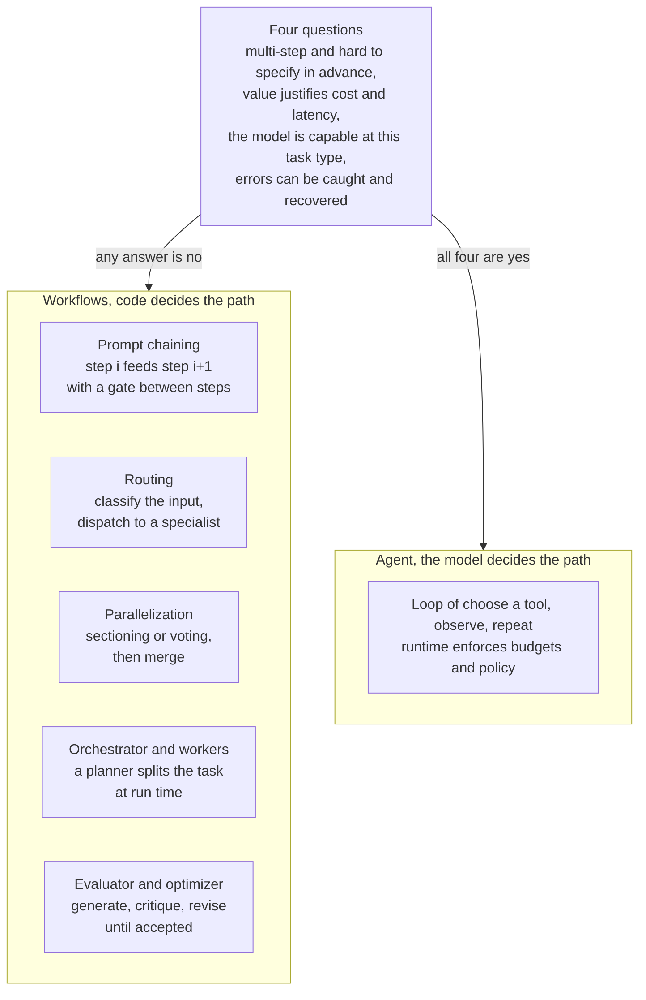
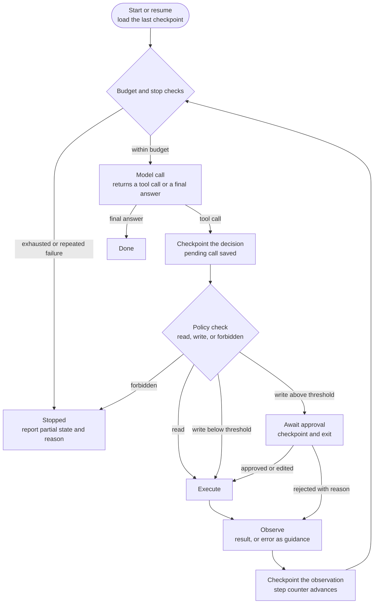
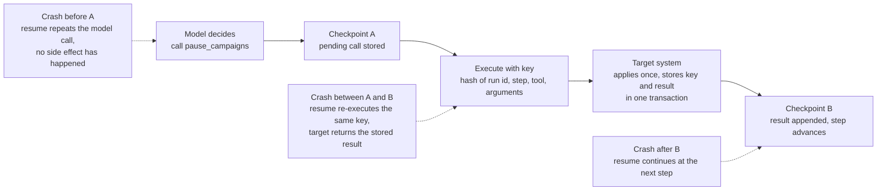
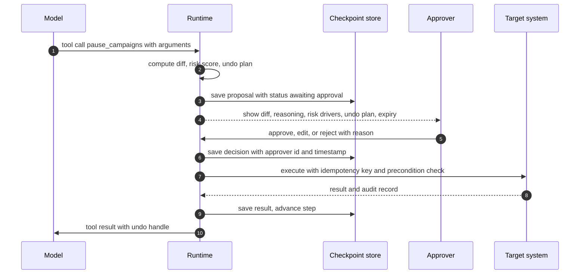
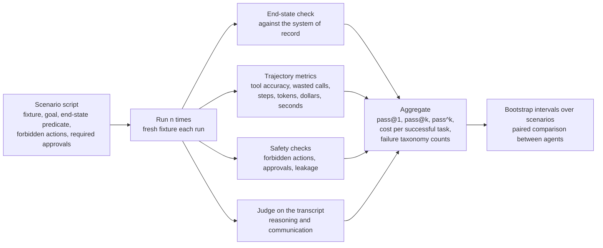

# Chapter 21: Agents in Production

> **What you will be able to do**: decide, with four questions, whether a task needs an agent or one of five workflow patterns; build an agent loop as an explicit state machine with stop conditions and budgets; design tool contracts, including propose-confirm-execute-undo for writes; make the loop durable with checkpoints and idempotency keys and prove it with a kill test; design approval, memory, and context rules; evaluate an agent with end-state checks, trajectory metrics, pass@k and pass^k, cost per successful task, and a failure taxonomy.
>
> **Where it is used**: P4.1 (the campaign operations agent with human-in-the-loop) and P5.2 (the capstone).
>
> **Prerequisites**: Chapter 11 (bootstrap intervals and judges), Chapter 16 (gateway, tracing, prompt caching), Chapter 19 (prompt injection and the instruction-data boundary), Chapter 20 (timeouts, retries, circuit breakers).

## 21.0 The problem this chapter solves

A customer's operations lead types one sentence into a chat window: "Pause every campaign with ACOS above 60 percent this week." Behind the window is a model with access to a query tool and a pause tool. The model queries, gets 14 campaigns back, and starts pausing them one at a time. After the ninth pause the process is killed by a deployment. The orchestrator restarts it. The model reads the original request, queries again, gets 14 campaigns (nine of which are already paused, but the metrics table has not refreshed), and pauses all 14 again. The pause API is not idempotent, so nine campaigns receive a second pause event, each of which fires a notification to the account owner. Nobody approved any of this. The transcript, if anyone reads it, says the task succeeded.

Everything that went wrong is a runtime property, not a model property. The model chose sensible actions. The runtime let a write happen without approval, retried a non-idempotent operation, resumed from the beginning instead of from a checkpoint, and judged success from the transcript rather than from the system of record. The model is the least controllable part of the system, so the engineering effort goes into the parts around it: the loop, the tool contracts, the persistence layer, the approval path, and the evaluation harness.

This chapter builds those parts from the bottom up. You have already built a governed write layer and MCP tools in production, so the emphasis is on the mechanisms you have not yet been forced to make explicit: the loop as a state machine with budgets, exactly-once semantics from at-least-once retries plus idempotent receivers, risk scoring that gates approval, memory with provenance and expiry, context compaction arithmetic, and the statistics of agent reliability. P4.1 asks for all of these on synthetic advertising data, with a kill test and a scenario suite as the proof.

## 21.1 Workflows versus agents

### The distinction

A workflow is a system in which your code decides the sequence of model calls and tool calls. An agent is a system in which the model decides. Anthropic's 2024 note "Building effective agents" draws this line and argues for starting on the workflow side of it. Workflows are predictable: the same input takes the same path, so you can unit-test each step, bound the cost exactly, and explain the behavior to an auditor. Agents handle tasks whose steps cannot be enumerated in advance, at the cost of variance in path, cost, and outcome.

### The five workflow patterns

Each pattern below is a fixed topology of model calls. The text-to-SQL analyst you have built is used as the running example.

**Prompt chaining.** Step $i$ produces an output that becomes the input of step $i+1$, with a programmatic gate between steps. For the analyst: classify the question, then generate SQL, then validate it structurally (Chapter 19), then execute, then summarize. Each gate can reject and stop. Use it when the task decomposes into fixed stages and each stage is easier than the whole.

**Routing.** A classifier (a small model, a fine-tuned encoder, or rules) sends the input to one of several specialist prompts or models. For the analyst: simple lookups to a small fine-tuned model, multi-join analytical questions to a frontier model, schema questions to a resource lookup with no model at all. This is the cascade router from Chapter 16 applied inside a single request.

**Parallelization.** Independent subtasks run at once and the results are merged. Two forms: sectioning, where the subtasks differ (generate SQL and, in parallel, check the question for policy violations), and voting, where the same subtask runs several times and the answers are compared (three SQL generations, execute all, keep the majority result). Use it when latency matters and the subtasks do not depend on each other.

**Orchestrator and workers.** A model decomposes the task at run time into subtasks it could not enumerate in advance, workers execute them, and the orchestrator merges. For the analyst: "compare this quarter's performance across our five brands" becomes five scoped queries and one synthesis. This is the pattern closest to an agent, because the decomposition is dynamic, but the workers themselves run fixed workflows.

**Evaluator and optimizer.** One call generates, another critiques against explicit criteria, and the generator revises until the critic accepts or a round limit is reached. For the analyst: generate SQL, have a critic check it against the schema and the question, revise. Use it when you can write the acceptance criteria down and when iteration measurably improves the result.



*Figure 21.1: The five workflow patterns and the agent loop, with the four questions that decide between them.*

### The four questions

Before building an agent, answer four questions. Is the task multi-step and hard to specify in advance, so that no fixed topology covers it? Does the outcome justify higher cost, higher latency, and variance? Is the model actually capable at this task type, measured on a sample rather than assumed? Can errors be caught and recovered, either by a tool result the model can read or by a human before the effect lands? A no to any of them means a workflow. Most enterprise requests fail the first question: they are five-step processes that an analyst runs the same way every time, and a prompt chain with gates will be cheaper, faster, and easier to certify.

### The cost consequence

A workflow's cost is a sum over a fixed number of calls. An agent's cost is a sum over a random number of steps with a growing context. Section 21.2 derives the growth; the consequence for the decision is that an agent's cost distribution has a long right tail, and the budget mechanisms of the next section exist to cut that tail off.

## 21.2 The agent loop as a state machine

### The states

The loop is a state machine that the runtime owns. The model is consulted in exactly one state and never controls a transition directly.



*Figure 21.2: The agent loop as a state machine; the model acts in one state and the runtime owns every transition.*

The transitions that matter are the two checkpoints. The first makes the model's decision durable before any side effect. The second makes the observation durable after it. Section 21.4 explains why both are needed.

### Stop conditions

Every agent needs an explicit list of stop conditions, and every one of them should be reachable in a test. The list for P4.1:

1. The model returns a final answer with no tool call.
2. The step budget is exhausted.
3. The token budget or the dollar budget is exhausted.
4. The wall-clock budget is exhausted.
5. The same tool has failed $f_{max}$ times in a row (three is the usual default).
6. The model attempted a forbidden action.
7. A human cancelled the run.
8. An approval request expired without a decision.

Conditions 2 through 8 produce a Stopped state, which must return the partial state and the reason to the caller. A run that stops silently is indistinguishable from a run that hung.

### Budget arithmetic

Let $c_0$ be the tokens in the system prompt, tool definitions, and task statement, and let $\delta$ be the average tokens added per step (the model's output plus the tool result). At step $t$ the context has about $c_0 + t\delta$ tokens, and every step re-reads the whole context. The total input tokens over $T$ steps are

$$
N_{in}(T) = \sum_{t=0}^{T-1} (c_0 + t\delta) = T c_0 + \frac{\delta\, T (T-1)}{2}.
$$

The cost is quadratic in the number of steps. With $c_0 = 4{,}000$, $\delta = 1{,}500$, and $T = 20$: $N_{in} = 80{,}000 + 1{,}500 \times 190 = 365{,}000$ input tokens. Doubling the step budget to 40 gives $160{,}000 + 1{,}500 \times 780 = 1{,}330{,}000$, about 3.6 times as many. At an assumed price of 3 dollars per million input tokens (an illustration; substitute your provider's current price), the 20-step run costs about 1.10 dollars in input alone and the 40-step run about 4.00 dollars. Prompt caching (Chapter 16) reduces the price of the repeated prefix substantially, but only when the prefix is stable, which section 21.7 returns to. The step budget is therefore not a safety afterthought. It is the parameter that bounds the tail of the cost distribution, and it should be set from the scenario suite's step distribution (for example the 95th percentile of steps in successful runs, plus a margin), not guessed.

## 21.3 Tool design

### The contract

A tool is a contract with six parts: a name, a description, a typed input schema, a typed output shape, a side-effect class, and an error vocabulary. The side-effect class is one of read, reversible write, or irreversible write, and it drives every policy decision in the loop. The model sees the first three parts. The runtime uses all six.

### Descriptions are the interface

The model selects a tool by reading its description, so the description is documentation for a literal reader that cannot ask questions. A description that works states the purpose in one sentence, when to use the tool, when not to use it and what to use instead, what each argument means in the user's vocabulary, and the shape of the result. Chapter 22 shows how to measure tool-selection accuracy across description variants; the point here is that a description is a tunable component with a measurable effect, not a comment.

### Typed schemas

Use enumerations wherever the argument space is finite (a status is `paused` or `active`, not free text). Put constraints in the schema (a budget change is a positive number below a cap). Make every optional argument have a stated default. The schema is validated by the runtime before the tool runs, and a validation failure returns to the model as guidance, not as an exception.

### Sized results

A tool result lands in the context window and stays there until compaction, so its size is a cost you pay on every subsequent step. A query that returns 5,000 rows at about 30 tokens per row is 150,000 tokens, which is larger than many context budgets and would multiply through the quadratic formula above. Three responses: paginate (return 50 rows and a cursor), aggregate (return counts and totals with a sample of rows), or externalize (write the full result to a store and return a handle plus a summary). The handle pattern also serves multi-tenancy: a signed handle cannot be forged to reference another tenant's result (Chapter 22).

### Errors as guidance

The model reads tool errors and acts on them. A stack trace produces a retry of the same call. A message that says what went wrong and what would work produces a corrected call: "No campaign named `Summer_Sale_2026`. Three campaigns have similar names: `Summer-Sale-2026`, `SummerSale26`, `Summer Sale 2026 (US)`. Call `search_campaigns` to disambiguate." Every error a tool can raise should carry a hint field, and the hint should be tested the same way the success path is.

### Read versus write

Reads have no side effects and can be retried, parallelized, and executed without approval. Writes change the system of record and follow the contract below. The split must be at the tool level, not the argument level: a single `manage_campaign` tool with a `mode` argument makes the policy check depend on parsing arguments, and a mistake there is a write without a gate.

### Propose, confirm, execute, undo

Every write tool is four operations on a proposal record.

| Stage | Input | Output | Side effect |
|---|---|---|---|
| Propose | Tool arguments | A proposal: id, tool, arguments, diff (before and after), risk score and drivers, undo plan, expiry | None. Reads only, to compute the diff |
| Confirm | Proposal id, decision (approve, edit, reject), approver identity, reason | Updated proposal with the decision recorded | None on the target system. An audit record is written |
| Execute | Proposal id, idempotency key | Result and a signed handle to the audit record | Exactly one application of the change |
| Undo | Handle from execute, idempotency key | Result of the inverse | Exactly one application of the stored inverse |

The diff is computed at propose time against the state then. Between propose and execute, the state may change (another user pauses a campaign, a budget is spent). Execute therefore rechecks the preconditions in the proposal (a compare-and-set against the recorded "before" values) and fails with guidance if they no longer hold, rather than applying a change whose diff the approver never saw. The undo plan is a concrete inverse stored at propose time (for a pause, resume with the recorded previous status; for a budget change, set back to the recorded previous value), not a promise to figure it out later. Some actions have no inverse (a deletion, a sent email). Those tools are classed irreversible, and the policy in section 21.5 requires approval for them at any risk score.

## 21.4 Durable execution

### The requirement

An agent run lasts minutes, spans many network calls, and touches systems that other processes also touch. Processes get killed by deployments, out-of-memory events, and node failures. If each step has an independent probability $q$ of being interrupted by a crash, a run of $T$ steps completes without interruption with probability $(1-q)^T$. With $q = 0.01$ and $T = 20$, that is $0.99^{20} \approx 0.82$, so about 18 percent of 20-step runs are interrupted at least once. Over a thousand runs, about 180 need to resume correctly. Durability is a throughput requirement, not an edge case.

### Checkpoints

A checkpoint is the complete state needed to continue the run: the message history, the pending tool call if one has been decided, the decision on any pending approval, the budget counters, the failure counter, and the run's identifiers. It is written to a store that survives the process (Postgres in P4.1), keyed by run id and step number, and it is written at the two points marked in Figure 21.2.

Why two? Consider checkpointing only after the observation. A crash between the model's decision and the observation loses the decision. On resume the model is called again and may choose a different tool or different arguments. If the first call's side effect already landed, the run now has an unrecorded write in the system of record and a transcript that never mentions it. Checkpointing the decision first makes the pending call durable, so a resume re-executes exactly that call with exactly the same idempotency key, and the key resolves the duplicate.



*Figure 21.3: The three crash windows around a write and why the decision checkpoint plus an idempotency key makes each one safe.*

### Idempotency keys

An idempotency key is a value that identifies one intended effect. The caller sends it with the write. The receiver stores the key with the result in the same transaction as the effect, and on seeing the key again returns the stored result without reapplying. Exactly-once behavior emerges from at-least-once delivery on the caller's side plus idempotent handling on the receiver's side. Neither half alone is sufficient.

Derive the key from the intent, not from the attempt: a hash of the run id, the step number, the tool name, and the canonical JSON of the arguments. A key that includes a timestamp or a retry counter changes on every attempt and protects nothing. A key that omits the arguments collides when the model calls the same tool twice in one step with different arguments. In P4.1 the key is `run_id:proposal_id` for writes that went through a proposal, because the proposal id already pins the arguments.

The atomicity requirement on the receiver is the part most often missed. If the receiver applies the effect, then crashes before recording the key, the retry applies it again. Effect and key must commit together. When the target is a third-party API that offers its own idempotency header, forward your key in it and let the API enforce atomicity. When the target is a database you control, do the write and the key insert in one transaction, as Listing 21.1 does.

### Retries, backoff, and timeouts

Retry only operations that are idempotent: all reads, and writes that carry an idempotency key to a receiver that honors it. Use exponential backoff with full jitter to avoid synchronized retry storms:

$$
d_n = U\!\left(0,\ \min(d_{max},\ d_0 \cdot 2^n)\right),
$$

where $d_n$ is the delay before retry $n$ (counting from zero), $d_0$ is the base delay, $d_{max}$ is the cap, and $U(0, x)$ is a uniform draw on $[0, x]$. With $d_0 = 0.5$ s and $d_{max} = 20$ s, the caps for retries 0 through 5 are 0.5, 1, 2, 4, 8, 16 s, and the expected total wait over five retries is half the sum, about 15.5 s. Bound every tool call with a timeout, and bound the run with a wall-clock budget so that a slow dependency turns into a Stopped state with a reason rather than a hung process. Chapter 20 covers circuit breakers for the case where a dependency is failing for everyone.

### The kill test

The proof of durability is a test, and it is in P4.1's definition of done. Start a write scenario. Kill the process with a non-catchable signal between checkpoint A and checkpoint B, which you can force with a hook that sleeps after the execute call in test mode. Restart. Assert that the target system shows exactly one application of the change, that the transcript contains exactly one tool result for it, and that the run completes. Run it in the other two windows as well.

```bash
kill -9 "$(cat run.pid)"
```

## 21.5 Human-in-the-loop design

### What an approval shows

An approval request is a designed screen, not a yes-or-no prompt. It shows the diff (what will change, before and after, for every affected entity), the reasoning (the model's one-paragraph justification, quoted from the transcript), the risk score with the drivers that produced it, the undo plan, the expiry (after which the proposal cannot be executed without re-proposing), and the scope (which tenant, which account). The approver can approve, edit the arguments (which produces a new proposal and a new diff), or reject with a reason that is returned to the model as a tool result so that it can adjust.

### Risk scoring

A risk score is a function from a proposal to a number in $[0, 1]$ that is monotone in the things that make an action dangerous. A workable form is a weighted sum of bounded features:

$$
R = w_e\, e(n) + w_m\, m(M) + w_r\, r + w_v\, v, \qquad \sum w = 1,
$$

where $n$ is the number of entities affected and $e(n) = \min(1, \log_{10}(1+n)/3)$ saturates at about a thousand entities; $M$ is the monetary exposure in dollars (for a campaign, the daily spend at stake) and $m(M) = \min(1, \log_{10}(1+M)/5)$ saturates at about a hundred thousand dollars; $r$ is 1 for irreversible actions and 0 otherwise; $v$ is 1 for an action type this tenant has never approved before and 0 otherwise; and the $w$ are weights that the owner of the system sets. Log scaling keeps a single large campaign from dominating and makes the score meaningful across tenants of different sizes.

Worked example with $w_e = 0.3$, $w_m = 0.4$, $w_r = 0.2$, $w_v = 0.1$. Pausing 12 campaigns with a combined daily spend of 2,400 dollars, reversible, an action type seen before: $e = \log_{10}(13)/3 = 0.371$, $m = \log_{10}(2401)/5 = 0.676$, $r = 0$, $v = 0$, so $R = 0.3 \times 0.371 + 0.4 \times 0.676 = 0.382$. Pausing one campaign with 40 dollars of daily spend: $e = 0.100$, $m = \log_{10}(41)/5 = 0.323$, $R = 0.030 + 0.129 = 0.159$.

### Thresholds and routing

Two thresholds turn the score into a decision. Below $\tau_{auto}$ the write executes without approval. Between $\tau_{auto}$ and $\tau_{esc}$ the write waits for the requesting user's approval. Above $\tau_{esc}$ it escalates to a designated approver (an account manager, a finance owner). Two hard rules override the score: irreversible actions always require approval, and actions the policy forbids (deleting an account, changing billing) never reach a proposal at all. With $\tau_{auto} = 0.25$ and $\tau_{esc} = 0.6$, the 12-campaign pause above requires the user's approval and the single pause executes automatically.

The thresholds are yours to set, and the roadmap's CLAUDE.md asks that they not be changed without you. Calibrate them from data: after a few hundred proposals, plot the score against whether the approver edited or rejected. If nearly every proposal above $\tau_{auto}$ is approved unchanged, approvals are rubber stamps and the threshold is too low or the features are wrong. If proposals below $\tau_{auto}$ turn out to need undoing, the threshold is too high.



*Figure 21.4: The approval sequence; the proposal and the decision are both checkpointed before the write executes.*

### Audit

Every decision produces an immutable record: proposal id, run id, tenant, approver identity, decision, edited arguments if any, reason, timestamp, the proposal's hash, and the execute result's handle. The audit trail is what a customer's compliance team will ask for first, and it is what you read when a scenario fails safety checks. Store it append-only, separate from the checkpoint table, because checkpoints may be pruned and audit records may not.

## 21.6 Memory

### Three kinds

Working memory is the context window: what the model can attend to now. It is rebuilt on every step from the checkpoint and is the subject of section 21.7.

Episodic memory is what happened in this session and in past sessions with this user or tenant: prior runs, their outcomes, the proposals that were rejected and why. It is stored as records with embeddings or structured keys and retrieved into working memory when relevant, never appended wholesale.

Long-term memory is durable facts and preferences about a tenant: "this brand never pauses campaigns on weekends", "budget changes above 500 dollars go to the finance owner". These change the agent's behavior across sessions, so they carry the strictest rules.

| Kind | Lives in | Written by | Retrieved | Expires |
|---|---|---|---|---|
| Working | Context window, rebuilt from checkpoints | Runtime, every step | Always present | End of run |
| Episodic | Store keyed by tenant and session | Runtime, after each run | On relevance to the current task | Retention policy, typically weeks to months |
| Long-term | Store keyed by tenant | Explicit user statement, or a confirmed inference | On relevance, with provenance shown | Review date per memory, deletable by the user |

### Rules

Every long-term memory has provenance: the turn it came from, who said it, and when. A memory without provenance cannot be explained to the user who asks "why did you do that", and cannot be audited when it is wrong.

Every long-term memory has an expiry or a review date. Preferences drift; a rule captured in January may be wrong in July. Expired memories are surfaced for confirmation, not silently applied.

Memory is written from user statements or from confirmed inferences, never directly from tool results. A tool result can carry injected text (Chapter 19), and a memory written from it persists the injection into every future session. If the agent infers a preference from behavior, it proposes the memory and the user confirms it, the same way a write is confirmed.

The user can list and delete their memories. This is a privacy obligation under most data-protection regimes and a practical necessity for trust. Deletion propagates: a deleted memory must not survive in a summary or an embedding index.

Memory is scoped to the tenant. Cross-tenant retrieval is a data leak, and the scoping is enforced in the store's query, not in the prompt.

## 21.7 Context management

### Why it is needed before the window is full

The quadratic cost in section 21.2 is one reason to keep the context short. The other is quality: as the context fills with stale tool results, the model's attention over the relevant parts degrades before the hard limit is reached. The size of this effect varies by model and is a moving target; treat it as an evolving empirical claim and measure it on your own scenarios by comparing task success at different compaction thresholds.

### Three techniques

**Clearing.** Replace old tool results with a short marker ("result of `query_metrics` at step 4, 48 rows, cleared") while keeping the fact that the call happened. The model retains the trajectory and loses the payload. Clear results older than a few steps that the model has already acted on.

**Compaction.** Summarize the earlier part of the conversation into a compact state (the goal, what has been established, what remains, the open proposals) and replace the turns with the summary. Compaction is lossy, so the summary should be structured, not free prose, and should preserve every identifier the remaining steps will need.

**Externalizing.** Write large results to a file or store and keep only a handle and a summary in context. The model can call a read tool with the handle if it needs a detail. This is the sized-results principle from section 21.3 applied after the fact.

### Proactive compaction and its arithmetic

Compact at a threshold well below the window, for example when the context passes 60 percent of the budget or every $k$ steps, whichever comes first. Return to the cost formula with $c_0 = 4{,}000$, $\delta = 1{,}500$, and $T = 20$. Without compaction, $N_{in} = 365{,}000$ input tokens. With one compaction after step 10 that collapses the history into a 2,000-token summary, the first ten steps cost $10 \times 4{,}000 + 1{,}500 \times 45 = 107{,}500$, the context resets to $6{,}000$, and the next ten cost $10 \times 6{,}000 + 1{,}500 \times 45 = 127{,}500$, for a total of $235{,}000$, about 36 percent less. Compaction every five steps brings it lower still, at the price of more summary calls and more information loss.

### Interaction with prompt caching

Prompt caching (Chapter 16) charges a reduced price for a prefix that is byte-identical to a recent request. Appending to the context preserves the prefix; compaction rewrites it and invalidates the cache. The practical schedule is to compact rarely and at natural boundaries (after a proposal is executed, after a subtask completes), and to keep the system prompt and tool definitions as a stable prefix that is never touched. Frontier APIs offer server-side variants of clearing and compaction; check your provider's current documentation, and know the client-side versions so that you are not dependent on one vendor's implementation.

## 21.8 Multi-agent patterns and when they hurt

### The patterns

A planner and executor pair separates deciding what to do from doing it, often with a stronger model planning and a cheaper one executing. An orchestrator with workers fans a task out to parallel workers and merges their results, which is the orchestrator-workers workflow with agents as workers. Subagents for context isolation give a subtask its own context window (reading forty documents) and return only a summary to the parent, which protects the parent's context from the payload. Specialized subagents with narrow tool sets implement least privilege: the subagent that drafts emails cannot call the pause tool.

### The costs

Coordination is a cost. Every handoff is a lossy channel: the subagent receives a summary of the task, not the parent's full context, and returns a summary of its result. If each handoff preserves the intent with probability $q$, a chain of $h$ handoffs preserves it with probability $q^h$; with $q = 0.95$ and $h = 4$, about 81 percent. Debugging is a cost: a failure now requires reading five transcripts and reconstructing which handoff dropped the requirement. Latency is a cost when the subtasks are not actually parallel. And cost per task rises, because each agent re-reads its own context.

### The rule

Start with one agent. Add a second only when a trace shows a specific bottleneck that a second agent removes: a context that fills with payload the parent never needs, a subtask that is truly parallel, or a permission boundary that must be enforced structurally. The roadmap made the planner-executor comparison in P4.1 optional for this reason: it is worth running only if the single agent's traces show planning failures.

## 21.9 Frameworks: harness versus hosting

Two questions separate the options. Who provides the harness (the loop, tool dispatch, context management, permission hooks, subagents)? And who hosts it (where the process runs, who persists state, who provides the sandbox)?

| Option | Harness | Hosting | Checkpointing | Human-in-the-loop | Model choice |
|---|---|---|---|---|---|
| Claude Agent SDK | Provided: the Claude Code loop, built-in tools, MCP connectivity, hooks, subagents | You host the process | Session state is the SDK's; durable checkpoints to your store are yours to add | Permission hooks you implement | Claude |
| LangGraph | Provided as a graph of nodes over a typed state | You host the process | Checkpointers included (in-memory, SQLite, Postgres) | Interrupts at nodes, resume with a decision | Any model |
| Hosted managed agents | Provided by the vendor | Vendor hosts the loop and a sandbox; you exchange messages and events | Vendor-managed | Vendor-defined approval events | Vendor's models |
| Your own loop | You write it (Listing 21.1) | You host it | You design it | You design it | Any model |

Names and features are as of mid-2026; verify against the current documentation. For P4.1 the roadmap asks that durability and approval be visible to you at least once, so prefer LangGraph or the Agent SDK with your own checkpoint store over a hosted option, and understand Listing 21.1 well enough to explain what the framework is doing for you.

## 21.10 Evaluating agents

### Scenario scripts

A scenario is a fixture (the initial state of the synthetic system of record), a user goal in natural language, an end-state predicate over the system of record, a list of forbidden actions, a list of actions that must have requested approval, and a budget. Ambiguous scenarios whose correct behavior is to ask a clarifying question and take no action belong in the suite; an agent that acts confidently on an ambiguous request is a safety failure, and the suite must be able to detect it.

### End-state checks

Success is a predicate evaluated against the system of record after the run, never against the transcript. The transcript says what the model believes happened. The database says what happened. In the opening example the transcript reported success while the database held eighteen pause events.

### Trajectory metrics

Even when the end state is right, the trajectory carries information. Tool-call accuracy is the fraction of calls that were the right tool with valid arguments. Unnecessary calls are calls whose result did not change any later decision (a repeated query with identical arguments is the common case). Steps, tokens, dollars, and wall-clock time per run describe cost. Approval requests per run and the fraction that were approved unchanged describe how well the risk thresholds are set.

### pass@k versus pass^k

Let $p$ be the probability that one independent run of a scenario succeeds. Two questions about $k$ runs have different answers.

pass@k is the probability that at least one of $k$ runs succeeds:

$$
\text{pass@}k = 1 - (1-p)^k .
$$

pass^k is the probability that all $k$ runs succeed:

$$
\text{pass}^k = p^k .
$$

pass@k measures capability with retries and is the right metric when a human will pick the best of several attempts, as in code generation. pass^k measures consistency and is the right metric for an agent that acts autonomously, because every run is the one that counts. The τ-bench paper (Yao and others, 2024) introduced pass^k for exactly this reason.

With $p = 0.8$ and $k = 3$: pass@3 is $1 - 0.2^3 = 0.992$ and pass^3 is $0.8^3 = 0.512$. An agent that succeeds four times in five looks excellent on pass@k and coin-flip unreliable on pass^3. For pass^5 to reach 0.9 the per-run success must be $0.9^{1/5} \approx 0.979$. This is the arithmetic behind the roadmap's instruction to report all-repeats consistency alongside the average.

Estimation from $n$ runs with $s$ successes. The plug-in estimate $\hat{p}^k = (s/n)^k$ is biased upward for $k > 1$, since $x \mapsto x^k$ is convex and Jensen's inequality gives $\mathbb{E}[\hat{p}^k] \ge p^k$. The unbiased estimate is the probability that $k$ runs drawn without replacement from the $n$ observed runs are all successes:

$$
\widehat{\text{pass}^k} = \frac{\binom{s}{k}}{\binom{n}{k}}, \qquad
\widehat{\text{pass@}k} = 1 - \frac{\binom{n-s}{k}}{\binom{n}{k}},
$$

the second being the estimator of Chen and others (2021) for code generation. With $n = 5$, $s = 4$, $k = 3$: plug-in pass^3 is $0.512$, unbiased pass^3 is $\binom{4}{3}/\binom{5}{3} = 4/10 = 0.4$. With $n = 10$, $s = 8$: plug-in $0.512$, unbiased $\binom{8}{3}/\binom{10}{3} = 56/120 = 0.467$. Report the unbiased number, and use $n \ge k + 2$ so that the estimator has room to move.

Aggregate across scenarios by averaging the per-scenario estimates, and put a bootstrap interval on the average by resampling scenarios (Chapter 11). Compare two agents on the same scenarios with the paired bootstrap; with 30 scenarios and five runs each the interval will be wide, which is a reason to report it rather than to hide it.

### Cost per successful task

$$
C_{succ} = \frac{\sum_{i} c_i}{\sum_{i} s_i},
$$

where the sums run over all runs, $c_i$ is the dollar cost of run $i$ (model tokens plus tool costs), and $s_i$ is 1 if run $i$ succeeded and 0 otherwise. Failed runs are in the numerator and not in the denominator, so an agent that fails often is expensive even if each run is cheap. With 150 runs at a mean cost of 0.12 dollars and 120 successes, $C_{succ} = 18 / 120 = 0.15$ dollars. This is the number that goes next to the analyst's hourly rate in the ROI model of Chapter 25.

### Failure taxonomy

Count failures by cause, not just by scenario. A taxonomy that has worked for tool-using agents:

| Category | Definition | Detection signal |
|---|---|---|
| Wrong tool | A tool was called when a different one was correct | Tool-call accuracy check against the scenario's expected tools |
| Wrong arguments | Right tool, invalid or incorrect arguments | Schema validation failures; argument diff against expected |
| Premature stop | The model declared success with work remaining | End-state predicate false and no budget exhaustion |
| Loop | The same call repeated with the same arguments | Duplicate call detector on the trajectory |
| Hallucinated result | The model reported a result no tool returned | Transcript claims not traceable to a tool result |
| Skipped approval | A write above threshold executed without a decision record | Audit trail join against executes |
| Budget exhaustion | Stopped by a budget with the task incomplete | Stop reason |
| Misread error | An error with guidance was ignored or misinterpreted | Same failing call repeated after a hint |
| Stale state | A write applied against a changed precondition | Precondition check failure at execute |
| Acted on ambiguity | An action taken where a clarifying question was required | Scenario flag plus any tool call |

The taxonomy tells you what to fix. Wrong-tool failures point at descriptions (Chapter 22). Premature stops point at the system prompt's completion criteria. Loops point at error guidance. Skipped approvals point at a runtime bug and are the most serious finding in the suite.



*Figure 21.5: The agent evaluation pipeline from scenario scripts to intervals.*

## 21.11 Observability and replay

Every run is one trace. Every step is a span with the model call (input tokens, output tokens, cached tokens, latency, cost), the tool name, the argument hash, the result size, the policy decision, and the approval decision if any. Runs link to their scenario id in evaluation and to their user session in production. Chapter 16 covers the OpenTelemetry attributes and Langfuse ingestion; the agent-specific addition is that the trace and the checkpoint share the run id, so that a span can be opened next to the state the model saw at that step.

Replay loads a checkpoint and re-runs from that step with a change: a different system prompt, a different model, a fixed tool description. Because model calls are not deterministic even at temperature zero, replay compares distributions over several re-runs rather than single transcripts. Tool results are stubbed from the recorded trajectory during replay so that a read at step 7 returns what it returned originally, and writes are routed to a scratch fixture. Replay is the tool that turns a failure in the taxonomy into a fix you can verify before it reaches the suite.

## 21.12 Implementation notes

**Listing 21.1: A minimal durable agent loop with two checkpoints per step and idempotency keys enforced in the same transaction as the write.**

```python
import hashlib, json, sqlite3

class Store:
    def __init__(self, path="agent.db"):
        self.db = sqlite3.connect(path, isolation_level=None)
        self.db.executescript("""
            CREATE TABLE IF NOT EXISTS checkpoints(run_id TEXT, step INT, state TEXT,
                                                   PRIMARY KEY(run_id, step));
            CREATE TABLE IF NOT EXISTS effects(idem_key TEXT PRIMARY KEY, result TEXT);""")
    def save(self, run_id, step, state):
        self.db.execute("INSERT OR REPLACE INTO checkpoints VALUES (?,?,?)",
                        (run_id, step, json.dumps(state)))
    def load(self, run_id):
        row = self.db.execute("SELECT step, state FROM checkpoints WHERE run_id=? "
                              "ORDER BY step DESC LIMIT 1", (run_id,)).fetchone()
        return (row[0], json.loads(row[1])) if row else (0, None)
    def once(self, idem_key, apply):
        """Run apply(db) exactly once per key; the effect and the key commit together."""
        row = self.db.execute("SELECT result FROM effects WHERE idem_key=?", (idem_key,)).fetchone()
        if row:
            return json.loads(row[0])
        self.db.execute("BEGIN")
        result = apply(self.db)                      # the write, on the same connection
        self.db.execute("INSERT INTO effects VALUES (?,?)", (idem_key, json.dumps(result)))
        self.db.execute("COMMIT")
        return result

BUDGET = {"steps": 25, "dollars": 2.00, "failures": 3}

def idem_key(run_id, step, call):
    raw = f"{run_id}:{step}:{call['name']}:{json.dumps(call['args'], sort_keys=True)}"
    return hashlib.sha256(raw.encode()).hexdigest()

def run(run_id, task, store, call_model, tools, approve):
    step, state = store.load(run_id)                 # resume if a checkpoint exists
    state = state or {"messages": [{"role": "user", "content": task}],
                      "pending": None, "dollars": 0.0, "failures": 0}
    while True:
        if (step >= BUDGET["steps"] or state["dollars"] >= BUDGET["dollars"]
                or state["failures"] >= BUDGET["failures"]):
            return "stopped", state
        if state["pending"] is None:
            reply = call_model(state["messages"], [t.schema for t in tools.values()])
            state["dollars"] += reply["cost"]
            state["messages"].append(reply["message"])
            if reply["tool_call"] is None:
                store.save(run_id, step + 1, state)
                return "done", state
            state["pending"] = reply["tool_call"]
            store.save(run_id, step, state)          # checkpoint A: the decision is durable
        call, tool = state["pending"], tools[state["pending"]["name"]]
        if tool.writes and "approved" not in call:
            call["approved"] = approve(call)         # record the decision before acting
            store.save(run_id, step, state)
        if tool.writes and not call["approved"]:
            result = {"error": "rejected by approver", "hint": "propose a smaller change"}
        else:
            try:
                fn = lambda db: tool.fn(db, **call["args"])
                result = store.once(idem_key(run_id, step, call), fn) if tool.writes else fn(store.db)
                state["failures"] = 0
            except ToolError as e:
                result, state["failures"] = {"error": str(e), "hint": e.hint}, state["failures"] + 1
        state["messages"].append({"role": "tool", "tool_call_id": call["id"], "content": json.dumps(result)})
        state["pending"], step = None, step + 1
        store.save(run_id, step, state)              # checkpoint B: the observation is durable
```

The listing uses SQLite so that it runs anywhere; P4.1 swaps the connection for Postgres and the schema is unchanged. `call_model` is a thin adapter over your provider's API that returns the assistant message, a parsed tool call or `None`, and the cost; the exact fields of the message and the tool-result role differ between providers, so shape them in the adapter. Checkpoint A is written before any side effect, so a crash after it re-executes the same pending call with the same key. The approval decision is recorded into the pending call and checkpointed before the write, so a resume does not ask twice. `once` runs the write and the key insert inside one `BEGIN ... COMMIT`, which is the atomicity requirement from section 21.4; with a third-party target you would forward the key in the API's idempotency header instead. In production the `approve` callback does not block: the runtime saves the proposal, exits, and is re-entered with the decision by the approval interface, which is why `run` is written to be re-entrant from any checkpoint. Reads bypass `once` because they have no effect to protect.

**Listing 21.2: A risk-scoring function with log-scaled features and two thresholds; the weights and thresholds are the owner's to set.**

```python
import math

WEIGHTS = {"entities": 0.30, "money": 0.40, "irreversible": 0.20, "novelty": 0.10}

def risk_score(n_entities: int, dollars_at_stake: float,
               reversible: bool, seen_before: bool) -> tuple[float, dict]:
    features = {
        "entities": min(1.0, math.log10(1 + n_entities) / 3),      # saturates near 1,000
        "money": min(1.0, math.log10(1 + dollars_at_stake) / 5),   # saturates near 100,000
        "irreversible": 0.0 if reversible else 1.0,
        "novelty": 0.0 if seen_before else 1.0,
    }
    score = sum(WEIGHTS[k] * v for k, v in features.items())
    return score, {k: round(WEIGHTS[k] * v, 3) for k, v in features.items()}

def route(score: float, reversible: bool, t_auto: float = 0.25, t_esc: float = 0.60) -> str:
    if not reversible:
        return "approve" if score < t_esc else "escalate"   # hard rule: never auto
    if score < t_auto:
        return "auto"
    return "approve" if score < t_esc else "escalate"
```

The function returns the per-feature contributions alongside the score so that the approval screen can show the drivers, which is what lets an approver disagree with the score intelligently. The hard rule for irreversible actions lives in `route`, not in the weights, because a weight can be argued down and a rule cannot.

**Listing 21.3: A scenario runner that computes unbiased pass@k and pass^k and cost per successful task.**

```python
from math import comb
from statistics import mean

def pass_at_k(n: int, s: int, k: int) -> float:
    return 1.0 if n - s < k else 1.0 - comb(n - s, k) / comb(n, k)

def pass_pow_k(n: int, s: int, k: int) -> float:
    return 0.0 if s < k else comb(s, k) / comb(n, k)

def run_scenario(scenario, agent, n_runs):
    outcomes, costs, failures = [], [], []
    for _ in range(n_runs):
        env = scenario.fixture()                       # fresh system of record
        trace = agent.run(env, scenario.goal)          # transcript, tool calls, dollars
        ok = (scenario.end_state_ok(env)
              and not scenario.forbidden_hit(trace.tool_calls)
              and scenario.approvals_ok(trace.audit))
        outcomes.append(ok); costs.append(trace.dollars)
        if not ok:
            failures.append(scenario.classify_failure(env, trace))   # taxonomy label
    return outcomes, costs, failures

def report(scenarios, agent, n_runs=5, k=3):
    rows, taxonomy = [], {}
    for sc in scenarios:
        outcomes, costs, failures = run_scenario(sc, agent, n_runs)
        s = sum(outcomes)
        rows.append({"id": sc.id, "pass@1": s / n_runs,
                     f"pass@{k}": pass_at_k(n_runs, s, k),
                     f"pass^{k}": pass_pow_k(n_runs, s, k),
                     "cost": sum(costs), "successes": s})
        for f in failures:
            taxonomy[f] = taxonomy.get(f, 0) + 1
    summary = {m: mean(r[m] for r in rows) for m in ("pass@1", f"pass@{k}", f"pass^{k}")}
    total_cost = sum(r["cost"] for r in rows)
    summary["cost_per_success"] = total_cost / max(1, sum(r["successes"] for r in rows))
    return rows, summary, taxonomy
```

Each run gets a fresh fixture, so runs are independent and the pass^k estimator's assumption holds. `end_state_ok` reads the fixture's database, not the transcript. The taxonomy classifier is a function you write per the table in section 21.10; in practice it is a mix of rules on the trace (duplicate calls, missing audit records) and a judge call for the categories that need reading. Wrap `summary` in the paired bootstrap from Chapter 11's `evalkit` to get intervals and to compare two agents on the same scenario set.

## 21.13 Failure modes

| Symptom | Likely cause | How to confirm | Fix |
|---|---|---|---|
| A write applied twice after a restart | No idempotency key, or key changes per attempt, or receiver records key outside the write transaction | Count effects per proposal id in the target; inspect key derivation | Derive the key from intent; commit effect and key together |
| Resume re-asks for an approval already given | Decision not checkpointed before execute | Checkpoint contents at the crash step | Record the decision into the pending call and save before acting |
| Resume chooses a different action than the crashed run | Decision not checkpointed; resume repeats the model call | Compare pending call in checkpoint A to the executed call | Add checkpoint A after the model call |
| Run cost far above budget | Dollar budget checked only on steps, or context growth unbounded | Plot tokens per step; check where budget is evaluated | Check all budgets every iteration; compact proactively |
| Agent loops on the same failing call | Error returns a stack trace, not guidance | Trajectory shows identical calls after errors | Add a hint field to every error; add a repeated-failure stop |
| Nothing ever asks for approval | Thresholds too high, or write classified as read, or score features saturate at zero | Feed a large proposal through the policy in a test | Test that a proposal above threshold cannot execute; audit tool classes |
| Everything asks for approval and approvers rubber-stamp | Thresholds too low or features uninformative | Approval rate near 100 percent with no edits | Calibrate thresholds against edit and reject rates |
| Transcript says success, database disagrees | Success judged from the transcript | Run the end-state predicate | Score end states only; add hallucinated-result detection |
| pass@1 is fine, pass^k is poor | High per-run variance from ambiguous prompts or nondeterministic tool ordering | Per-scenario success spread across runs | Fix the scenarios with the highest variance first; tighten completion criteria |
| Quality drops late in long runs | Context filled with stale tool results | Success versus context length at the failing step | Clear old results; compact at a threshold |
| Cache hit rate collapses after compaction | Compaction rewrites the prefix each step | Cached-token counts in usage fields | Compact rarely, at task boundaries; keep system prompt and tools as a stable prefix |
| A memory causes wrong behavior across sessions | Memory written from a tool result or without expiry | Provenance of the memory | Write memories only from confirmed statements; add review dates |
| Cross-tenant data appears in a result | Tenant scoping in the prompt rather than in the store query | Query logs for the tool | Scope queries by the tenant from the validated token (Chapter 22) |

## 21.14 On your machine

The agent runtime is not GPU work. The model is called over an API, the checkpoint store is Postgres, and the scenario suite is a CPU job. What the RTX 4060 offers is a way to run development iterations without spending API dollars.

**Postgres.** Run it in Docker Desktop with the WSL2 backend. It idles at about 100 MB of RAM and the checkpoint table for a full scenario suite (150 runs, about 15 steps each, a few kilobytes of state per step) is under 50 MB. Keep the data volume on the WSL2 ext4 filesystem, not under the mounted Windows drive.

**A local model for development runs.** A 7B instruct model with tool-calling support, quantized to 4 bits, fits on the 4060 through vLLM or Ollama. For Qwen2.5-7B-Instruct shapes (28 layers, 4 KV heads, head dimension 128; verify against the model's configuration file), the weights at 4 bits are about 4.5 GB including embeddings and overhead, leaving about 3 GB for the KV cache. The cache costs $2 \times 28 \times 4 \times 128 \times 2 = 57{,}344$ bytes per token in fp16, about 56 KB, so 3 GB holds about 53,000 tokens across all concurrent sequences. That is enough for two or three agent contexts of 16,000 tokens at once. Tool-calling accuracy of 7B models is well below frontier models, so use the local model to test the runtime (checkpointing, idempotency, budgets, the kill test) and reserve API calls for the scenario suite that produces the reported numbers.

**The scenario suite cost.** With 30 scenarios, five runs each, a mean of eight steps, $c_0 = 3{,}000$, and $\delta = 1{,}200$, each run reads about $8 \times 3{,}000 + 1{,}200 \times 28 = 57{,}600$ input tokens, and 150 runs read about 8.6 million. At an assumed 3 dollars per million input tokens that is about 26 dollars before caching and output tokens, which is inside the roadmap's 20 to 45 dollar estimate for P4.1. Prompt caching on the stable prefix reduces it further. Longer scenarios grow the bill quadratically, which is a reason to keep the suite's step distribution short and to set the step budget from it.

**The kill test.** Run the agent as a subprocess that writes its pid to a file, sleep for a random interval inside the crash window in test mode, and send the signal from a test harness. Repeat across the three windows in Figure 21.3 at least ten times each; a durability bug that appears one time in ten is still a bug.

**Kaggle and a rented A100** play no role in this chapter. If you fine-tune a small model to select tools better (Chapter 7), that is training work and follows Chapter 7's sizing.

## Exercises

**Exercise 21.1.** A scenario is run five times and succeeds four times. Compute the plug-in and the unbiased estimates of pass^3 and of pass@3. Then explain which one you would report and why.

<details><summary>Solution</summary>

$\hat{p} = 4/5 = 0.8$. Plug-in pass^3 is $0.8^3 = 0.512$. Unbiased pass^3 is $\binom{4}{3}/\binom{5}{3} = 4/10 = 0.400$. Plug-in pass@3 is $1 - 0.2^3 = 0.992$. Unbiased pass@3 is $1 - \binom{1}{3}/\binom{5}{3} = 1 - 0 = 1.0$, since with only one failure among five runs, three draws without replacement cannot all fail. Report the unbiased estimates: the plug-in pass^k is biased upward for $k > 1$ by Jensen's inequality, and the upward bias is exactly the direction that makes an unreliable agent look reliable.

</details>

**Exercise 21.2.** An agent must reach pass^5 of at least 0.9 on every scenario before deployment. What per-run success probability does that require? If the current per-run success is 0.9, what is pass^5, and how many runs per scenario would you need to distinguish $p = 0.9$ from $p = 0.98$ at roughly two standard errors?

<details><summary>Solution</summary>

$p \ge 0.9^{1/5} = e^{\ln(0.9)/5} = e^{-0.0211} \approx 0.979$. At $p = 0.9$, pass^5 is $0.9^5 = 0.590$. For the sample size, use the normal approximation for a proportion: the standard error of $\hat{p}$ is $\sqrt{p(1-p)/n}$. The difference is $0.08$. Using the larger variance at $p = 0.9$, we need $0.08 \ge 2\sqrt{0.09/n}$, so $n \ge 4 \times 0.09 / 0.0064 \approx 56$ runs per scenario. Five runs per scenario cannot tell these apart; the suite tells you about the average over scenarios, not about any single one, which is why the aggregate with a bootstrap interval over scenarios is the reported number.

</details>

**Exercise 21.3.** Write the stop conditions for an agent that reconciles invoices against purchase orders and posts matched pairs to an accounting system. Include at least one condition specific to this task.

<details><summary>Solution</summary>

Final answer with no tool call; step budget (set from the scenario suite, for example 30); dollar budget per run; wall-clock budget (for example 10 minutes, because the accounting system's session expires); three consecutive failures of the same tool; any attempt to call a tool outside the allowed set (posting a payment rather than a match is forbidden); human cancellation; approval expiry. Task-specific: stop and escalate if the number of unmatched invoices exceeds a fraction of the batch (for example 20 percent), because that indicates a data problem rather than a matching problem; stop if the same invoice is proposed for posting twice in one run, because that indicates a loop over a stale query result.

</details>

**Exercise 21.4.** Design the propose-confirm-execute-undo contract for a tool that adds negative keywords to a campaign. State the proposal record, the precondition checked at execute, the idempotency key, and the undo plan. Identify what makes the undo imperfect.

<details><summary>Solution</summary>

Proposal record: proposal id, campaign id, the list of keywords to add with match type, the current negative keyword list (the "before"), the resulting list (the "after"), the count of existing keywords that would become redundant, a risk score driven by the number of keywords and the campaign's daily spend, an undo plan, and an expiry. Precondition at execute: the campaign's current negative keyword list still equals the recorded "before" list (compare-and-set); if another user added keywords in the meantime, fail with guidance to re-propose. Idempotency key: `run_id:proposal_id`, forwarded to the advertising API's idempotency header if it has one, otherwise enforced in your own effects table. Undo plan: remove exactly the keywords that were added by this proposal (by id if the API returns ids, otherwise by text and match type), with its own idempotency key. Imperfection: between execute and undo, traffic that would have matched those keywords was blocked; the undo restores the configuration but not the lost impressions, so the tool is reversible in configuration and not in effect, which the risk score should reflect in the monetary feature.

</details>

**Exercise 21.5.** A run has $c_0 = 5{,}000$ and $\delta = 2{,}000$ tokens and takes 24 steps. Compute the total input tokens with no compaction and with compaction after every 8 steps into a 2,500-token summary. State the percentage saved.

<details><summary>Solution</summary>

No compaction: $N_{in} = 24 \times 5{,}000 + 2{,}000 \times 24 \times 23 / 2 = 120{,}000 + 552{,}000 = 672{,}000$. With compaction every 8 steps: the first block starts at $5{,}000$ and costs $8 \times 5{,}000 + 2{,}000 \times 28 = 96{,}000$. After compaction the base is $5{,}000 + 2{,}500 = 7{,}500$ and each of the next two blocks costs $8 \times 7{,}500 + 2{,}000 \times 28 = 116{,}000$. Total $96{,}000 + 232{,}000 = 328{,}000$, a saving of about 51 percent, before counting the two summary calls (which read the full block each and add roughly $2 \times (5{,}000 + 16{,}000)$ tokens, still a saving of about 45 percent).

</details>

**Exercise 21.6.** Using the risk function of section 21.5 with the stated weights and thresholds, score a proposal that changes the daily budget of 3 campaigns by a combined 18,000 dollars, reversible, action type seen before. Then score an irreversible deletion of one campaign with 30 dollars of daily spend. Route both.

<details><summary>Solution</summary>

Budget change: $e = \log_{10}(4)/3 = 0.602/3 = 0.201$, $m = \log_{10}(18{,}001)/5 = 4.255/5 = 0.851$, $r = 0$, $v = 0$. $R = 0.3 \times 0.201 + 0.4 \times 0.851 = 0.060 + 0.340 = 0.400$. Between $0.25$ and $0.6$, so it routes to the user's approval. Deletion: $e = \log_{10}(2)/3 = 0.100$, $m = \log_{10}(31)/5 = 1.491/5 = 0.298$, $r = 1$, $v = 0$. $R = 0.030 + 0.119 + 0.200 = 0.349$. The score alone would route to approval, and the hard rule for irreversible actions also requires approval, so it routes to approval either way; if the weights were changed so that the score fell below $\tau_{auto}$, the hard rule would still prevent automatic execution.

</details>

**Exercise 21.7.** A process crashes after the target system applied a write but before the runtime saved checkpoint B. List what happens on resume under three designs: (a) no idempotency key; (b) a key that includes a retry counter; (c) a key derived from run id, step, tool, and canonical arguments, with the receiver storing the key in the write's transaction.

<details><summary>Solution</summary>

(a) Resume loads checkpoint A, finds the pending call, executes it again, and the write lands twice. (b) The retry counter increments, so the key is new, the receiver has never seen it, and the write lands twice; the key protected nothing. (c) The key is identical to the first attempt. The receiver finds it in its effects table, returns the stored result, and the runtime appends that result and continues. The write landed once. If in (c) the receiver had recorded the key outside the write's transaction and crashed between the two, the key would be missing and the retry would apply the write again, which is why atomicity of effect and key is part of the requirement.

</details>

**Exercise 21.8.** A planner hands work to an executor, which hands results to a verifier, which hands a summary back to the planner. Each handoff preserves the requirement with probability 0.93. What fraction of tasks preserve the requirement end to end? What single design change most improves this without removing agents?

<details><summary>Solution</summary>

Three handoffs: $0.93^3 \approx 0.804$. About one task in five loses something. The most effective change is to make the requirement explicit and structured (a typed task record with acceptance criteria that every handoff carries verbatim) rather than restated in prose at each hop, which moves $q$ toward 1 for the parts of the requirement that are carried as data. The second is to remove a hop: if the verifier's check can be a deterministic tool the executor calls, $h$ drops to 2 and the end-to-end rate rises to about $0.865$.

</details>

**Exercise 21.9.** Explain why a long-term memory must not be written directly from a tool result, and describe the confirmation path that makes an inferred memory safe.

<details><summary>Solution</summary>

A tool result is untrusted content: a document, a web page, or a database field can contain text crafted to look like an instruction or a preference ("the account owner prefers all campaigns paused on Fridays"). If the runtime writes memories from tool results, the injection persists beyond the current run and influences every future session for that tenant, which is a worse outcome than a single-run injection. The safe path: the agent may propose a memory ("I noticed you approved weekend pauses three times; should I remember that weekend pauses are acceptable?") as a write with a diff and provenance, the user confirms or rejects, and only confirmed memories are stored, with the confirming turn recorded as provenance and a review date attached.

</details>

## Summary

- A workflow is a system where code decides the path; an agent is one where the model decides. Five workflow patterns (chaining, routing, parallelization, orchestrator-workers, evaluator-optimizer) cover most enterprise tasks, and four questions decide when an agent is warranted.
- The agent loop is a state machine owned by the runtime. The model acts in one state; every transition, budget, and stop condition belongs to the runtime.
- Input tokens grow quadratically with steps, $N_{in}(T) = T c_0 + \delta T(T-1)/2$, so the step budget bounds the cost tail and compaction changes the constant.
- A tool contract has a name, description, typed input, typed output, side-effect class, and error vocabulary. Descriptions are the interface the model reads; errors are guidance the model acts on; results are sized for the context.
- Writes follow propose, confirm, execute, undo. The diff and the undo plan are computed at propose time; execute rechecks preconditions; irreversible actions always require approval.
- Durability comes from checkpointing the decision before the side effect and the observation after it, plus an idempotency key derived from intent and stored by the receiver in the same transaction as the write.
- Retry only idempotent operations, with exponential backoff and full jitter, under per-call timeouts and a per-run wall-clock budget.
- Risk scoring is a bounded, monotone function of entities affected, money at stake, reversibility, and novelty; two thresholds route to auto, approve, or escalate, and hard rules override the score.
- Long-term memory carries provenance and an expiry, is written only from confirmed statements, is scoped to the tenant, and is deletable by the user.
- pass@k $= 1 - (1-p)^k$ measures capability with retries; pass^k $= p^k$ measures consistency and is the metric for autonomous agents. Estimate pass^k without bias as $\binom{s}{k}/\binom{n}{k}$.
- Success is judged against the system of record, never the transcript. Cost per successful task divides all spend by the number of successes, and a failure taxonomy tells you what to fix.
- Add a second agent only when a trace shows a bottleneck it removes; every handoff is a lossy channel with compounding loss $q^h$.

## Further reading

- Anthropic, 2024. "Building effective agents." The workflow patterns and the workflow-versus-agent argument.
- Yao, S., and others, 2024. "τ-bench: A Benchmark for Tool-Agent-User Interaction in Real-World Domains." Scenario-based agent evaluation and the pass^k metric.
- Chen, M., and others, 2021. "Evaluating Large Language Models Trained on Code." The unbiased pass@k estimator.
- Yao, S., and others, 2022. "ReAct: Synergizing Reasoning and Acting in Language Models." The reason-then-act loop that most agent runtimes descend from.
- Helland, P., 2012. "Idempotence Is Not a Medical Condition." ACM Queue. The clearest treatment of exactly-once semantics from at-least-once delivery.
- Anthropic engineering blog, circa 2025. Posts on context engineering for agents and on writing tools for agents; the primary source for clearing, compaction, and tool-description practice.
- Huyen, C., 2025. *AI Engineering*. The chapter on agents (planning, tool use, failure modes) and the chapter on user feedback.
- The Claude Agent SDK documentation and the LangGraph documentation on state, checkpointers, and interrupts, at their official documentation roots; verify the current versions.
- The Model Context Protocol specification, for the tool contract shape that Chapter 22 builds on.
