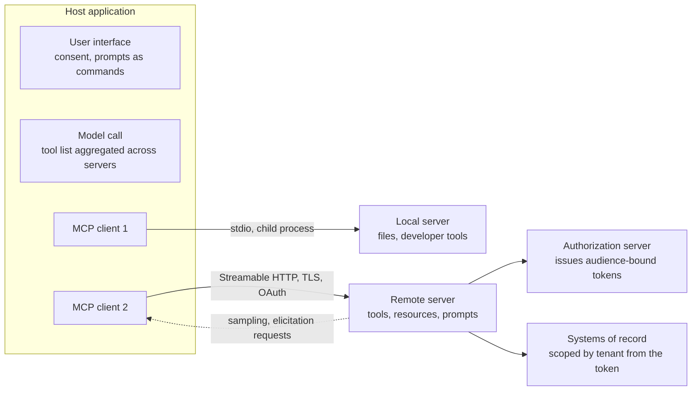
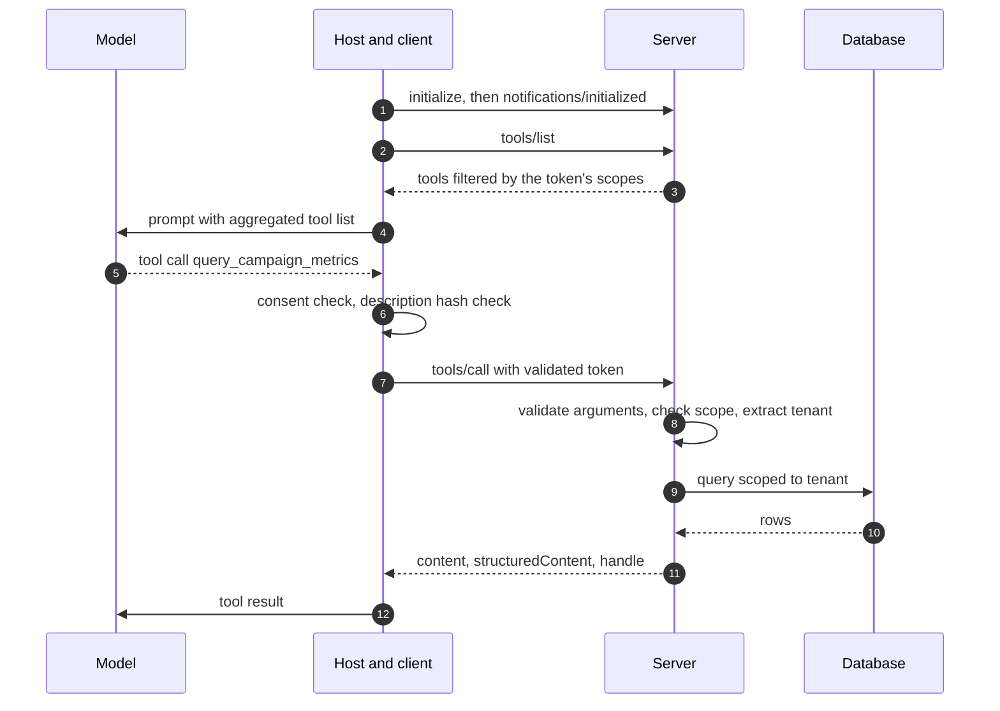
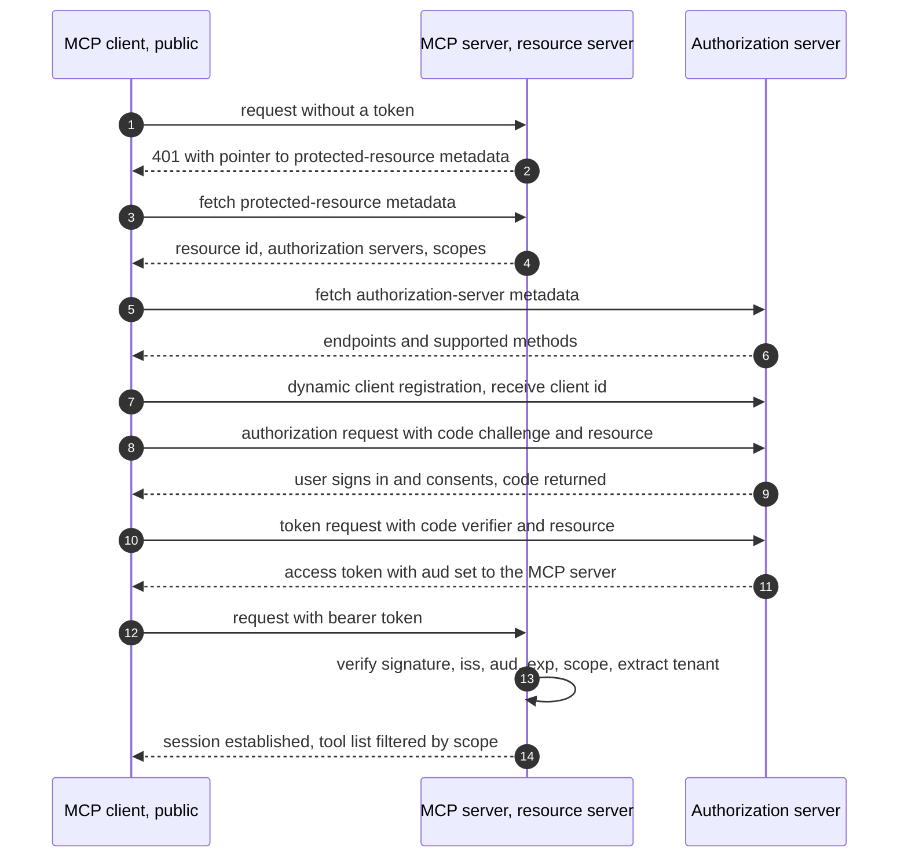
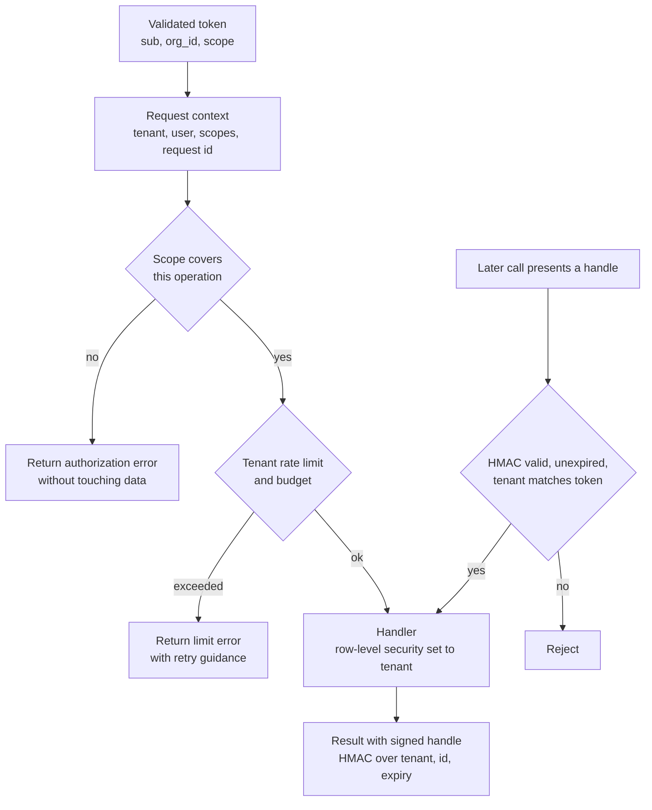
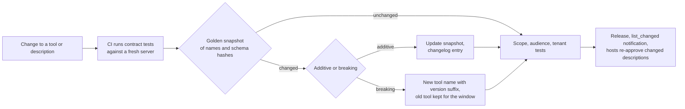

# Chapter 22: MCP in Depth

> **What you will be able to do**: explain the host, client, and server roles and the three server primitives; read and write the JSON-RPC message shapes for the lifecycle, tools, resources, and prompts; choose between stdio and Streamable HTTP and explain sessions; implement the resource-server side of OAuth 2.1 (protected-resource metadata, PKCE, dynamic client registration, resource indicators, scopes mapped to tool groups, token validation); enforce multi-tenancy from the token; measure tool-selection accuracy across description variants; version a server and prove compatibility with contract tests; deploy a remote server behind your gateway.
>
> **Where it is used**: P4.2 (the remote MCP server with authentication) and P5.2 (the capstone).
>
> **Prerequisites**: Chapter 19 (prompt injection and the MCP threat table), Chapter 21 (tool contracts), Chapter 16 (the gateway and tracing).

## 22.0 The problem this chapter solves

Your text-to-SQL MCP server runs as a local process. A developer adds it to a desktop client's configuration, the client launches it as a child process, and the two talk over standard input and output. It works for one person on one laptop with database credentials in a local environment file. Then a customer's IT lead asks three questions. How do two hundred analysts connect? Where do the database credentials live, given that no credential may sit on an analyst's laptop? How does the server know which analyst, and therefore which brand's data, a request is for?

Each question is a protocol layer you have not yet needed. Two hundred users need a network transport with sessions instead of a child process. Credentials that never leave the server need the server to authenticate its callers, which in the Model Context Protocol (MCP) means OAuth 2.1 with the server acting as a resource server. Knowing which analyst is asking means a validated token that carries identity and tenant, and a server that scopes every query by what the token says rather than by what the model puts in an argument. On top of that, the customer will ask for the tool list to be stable across upgrades, for a changelog, and for a security review.

This chapter covers the mechanisms in that order: architecture and message shapes, transports, authorization, multi-tenancy, tool ergonomics and how to measure them, resources and prompts, versioning and contract tests, security, and deployment. Protocol details are stated as of the specification revisions current in mid-2026; where a field name or header could change, the text says "per the current specification, verify", and the contract tests in section 22.9 are how you find out.

## 22.1 Architecture: host, client, server

The host is the application the user runs: a desktop chat client, your web front end (Chapter 24), or your gateway acting on behalf of an agent (Chapter 21). The host creates one MCP client per server connection, so a host connected to three servers holds three clients. The client is a protocol endpoint: it performs the handshake, sends requests, receives responses and notifications, and maintains the session. The server exposes capabilities to that one client. The host, not the server, owns the model call, the consent screens, and the aggregation of tools across servers into one tool list.

A server offers three primitives, distinguished by who decides to use them. Tools are model-controlled: the model sees their descriptions and decides to call them. Resources are application-controlled: the host decides which to read and attach to context, possibly on the user's instruction. Prompts are user-controlled: the host offers them as commands, the user picks one and fills in arguments, and the server returns the messages to send.

A client may also offer capabilities to the server. Roots tell the server which filesystem locations or URIs it may operate in. Sampling lets the server ask the host to run a model completion on its behalf, so that a server can use a model without holding its own API key. Elicitation lets the server ask the user for structured input mid-operation. These client-side capabilities are negotiated at initialization and are optional; per the current specification, verify which your host supports.



*Figure 22.1: One client per server connection; the host owns the model call and consent, the remote server owns validation and scoping.*

## 22.2 The protocol: JSON-RPC message shapes

MCP messages are JSON-RPC 2.0. A request has `jsonrpc: "2.0"`, an `id`, a `method`, and `params`. A response carries the same `id` and either a `result` or an `error` with a numeric `code`, a `message`, and optional `data`. A notification is a request without an `id` and receives no response. Both sides may send requests; the transport carries them in both directions.

### Lifecycle

The client opens with an `initialize` request whose params carry the protocol version it supports, its capabilities (roots, sampling, elicitation), and its name and version. The server answers with the protocol version it will use, its capabilities (whether it offers tools, resources, prompts, logging, and whether each list can change), its name and version, and optional instructions for the host to place in the model's context. The client then sends the `notifications/initialized` notification, and the session is live. If the versions cannot be reconciled the server responds with an error and the client disconnects. Everything else waits for this exchange.

### The method table

| Method | Direction | Essential params | Essential result |
|---|---|---|---|
| `initialize` | client to server | `protocolVersion`, `capabilities`, `clientInfo` | `protocolVersion`, `capabilities`, `serverInfo`, optional `instructions` |
| `notifications/initialized` | client to server | none | none (notification) |
| `tools/list` | client to server | optional `cursor` | `tools[]` with `name`, `description`, `inputSchema` (JSON Schema), optional `outputSchema` and `annotations`; optional `nextCursor` |
| `tools/call` | client to server | `name`, `arguments` | `content[]` of typed blocks (text, image, resource link, embedded resource), `isError`, optional `structuredContent` |
| `resources/list` | client to server | optional `cursor` | `resources[]` with `uri`, `name`, optional `description`, `mimeType` |
| `resources/templates/list` | client to server | optional `cursor` | `resourceTemplates[]` with `uriTemplate`, `name`, `mimeType` |
| `resources/read` | client to server | `uri` | `contents[]` with `uri`, `mimeType`, and `text` or base64 `blob` |
| `resources/subscribe` | client to server | `uri` | acknowledgement; later `notifications/resources/updated` |
| `prompts/list` | client to server | optional `cursor` | `prompts[]` with `name`, `description`, `arguments[]` of `name`, `description`, `required` |
| `prompts/get` | client to server | `name`, `arguments` | `description`, `messages[]` with `role` and `content` |
| `notifications/tools/list_changed` | server to client | none | none; client re-lists |
| `sampling/createMessage` | server to client | `messages`, `maxTokens`, model preferences | the completion |

Field names are per the current specification; verify against the revision your SDK implements. Lists are paginated with an opaque cursor, so a client must loop until `nextCursor` is absent. A tool that fails in a way the model should read about returns `isError: true` with the guidance in `content`, not a JSON-RPC error; JSON-RPC errors are for protocol failures (unknown method, invalid params, unauthorized).

### Errors, progress, and cancellation

JSON-RPC 2.0 reserves error codes: -32700 for a parse error, -32600 for an invalid request, -32601 for an unknown method, -32602 for invalid params, and -32603 for an internal error, with -32000 to -32099 available for server-defined errors. Use -32602 when arguments fail schema validation before the handler runs, so that a client can tell a malformed call from a tool that ran and failed. Everything after validation that the model should learn from is an `isError` result with guidance, as in Chapter 21.

Long-running tools report progress. A request may carry a progress token in its `_meta` field; the server then sends `notifications/progress` messages carrying that token, a progress value, and an optional total, and the host can render a progress indicator. Either side may send `notifications/cancelled` with the id of an in-flight request; the receiver stops work if it can and must not send a response for a cancelled request it has already answered. Servers can also emit `notifications/message` log entries at a level the client sets with `logging/setLevel`. Per the current specification, verify the method names; the design point is that a tool that takes a minute should not look like a hung connection.

**Listing 22.1: The tools/call round trip as an abstract JSON-RPC shape.**

```json
{"jsonrpc": "2.0", "id": 7, "method": "tools/call",
 "params": {"name": "query_campaign_metrics",
            "arguments": {"metric": "acos", "window_days": 7, "min_value": 0.6}}}

{"jsonrpc": "2.0", "id": 7,
 "result": {"content": [{"type": "text", "text": "14 campaigns match. Showing 14 of 14."}],
            "structuredContent": {"rows": [{"campaign_id": "c_1042", "acos": 0.71}],
                                  "handle": "h.eyJ0ZW5hbnQiOi...sig"},
            "isError": false}}
```

The request names the tool and passes arguments that the server validates against the published `inputSchema` before running anything. The result carries a human-readable text block for models that read text, a structured block that validates against the tool's `outputSchema` for hosts that want typed data, and a signed handle (section 22.6) that later calls can reference without re-sending the rows.



*Figure 22.2: The tool-call lifecycle from initialization to a scoped result; the host checks consent and the server checks scope.*

## 22.3 Tools, resources, or prompts: choosing the primitive

Expose something as a tool when the model should decide to use it at run time and the result depends on arguments: a query, an action, a search. Expose it as a resource when it is reference data that the host should attach deliberately and that changes rarely: a schema, a catalog of query families, metric definitions, a document. Expose it as a prompt when it is a multi-step workflow that a user invokes by name with a few parameters: "weekly account review for brand X".

The token arithmetic favors resources for reference data. Suppose the schema of 40 tables renders to about 6,000 tokens. If the model calls a `get_schema` tool in 60 percent of the turns of a 10-turn session, the schema enters the context six times, about 36,000 tokens, and each entry is a step the model spent deciding to fetch it. As a resource, the host attaches it once at the start of the session, 6,000 tokens, and it sits in the stable prefix where prompt caching (Chapter 16) makes it cheap to re-read. Resources also let the host show the user what the model is reading, which tools do not.

Resource URIs need a scheme and a stable identifier: `catalog://tables/orders` rather than a database-internal id. The tenant never appears in the URI; it comes from the token (section 22.6), and the same URI resolves to a different document for a different tenant. URI templates (`catalog://tables/{name}`) describe families of resources without listing every member. A prompt's messages can embed a resource by reference, so "analyze this account" can attach the account's catalog entry without the model asking for it.

## 22.4 Transports

### stdio

The host launches the server as a child process and exchanges newline-delimited JSON-RPC messages over the server's standard input and output. Standard error is for logs. There is no network, no authentication, and the server runs as the host's user with the host's environment. It is right for developer tools on one machine and wrong for anything a second person needs.

### Streamable HTTP

The server exposes one HTTP endpoint. The client sends each JSON-RPC message as an HTTP POST. The server may answer with a single JSON response, or it may answer with a Server-Sent Events (SSE) stream on which it sends the response plus any server-initiated requests and notifications, then closes. The client may also open a GET request to the same endpoint to receive a long-lived SSE stream for server-initiated messages that are not tied to a client request.

Sessions: at initialization the server may return a session identifier in a response header (named `Mcp-Session-Id` per the current specification; verify), and the client sends it on every subsequent request. The client sends the negotiated protocol version in a request header on subsequent requests as well. A client ends a session with an HTTP DELETE. A server that assigns session ids is stateful and needs either session affinity at the load balancer or a shared session store to scale horizontally; a server that assigns none is stateless and scales freely, at the cost of server-initiated messages. For a database-backed tool server, stateless is the right default and per-request state lives in the token.

Resumability: SSE events carry ids, and a client that loses the connection reconnects with the last id it saw so that the server can replay missed events. Implementing replay requires an event buffer per stream; SDKs provide an in-memory version and you supply a durable store if you need it.

A worked flow for a 40-second tool call. The client POSTs `tools/call` with a progress token. The server answers the POST with an SSE stream and, over 40 seconds, sends four `notifications/progress` events with ids 1 through 4, then the JSON-RPC response as event 5, then closes the stream. If the client's connection drops after event 2, it reconnects with a GET carrying the last event id 2, and the server replays events 3 through 5 from its buffer. Without the buffer the client would have no way to learn the result and would have to call again, which for a write tool is exactly the retry that Chapter 21's idempotency keys exist to make safe.

Origin validation: a server bound to a local port must check the `Origin` header on incoming requests and reject unexpected origins, because a malicious web page can otherwise direct a browser to a local server (a DNS rebinding attack). Bind local servers to the loopback interface. Remote servers sit behind TLS and the gateway.

An earlier HTTP transport used two endpoints (one for SSE, one for POST) and is superseded; servers may keep it for old clients during a deprecation window, and your contract tests should exercise only the transport you support.

## 22.5 Authorization

### Roles

MCP uses OAuth 2.1 with three roles. The MCP server is the resource server: it receives bearer tokens and validates them. The authorization server issues tokens after authenticating the user and obtaining consent; it is a hosted identity provider or a minimal one you run, and it is not the MCP server. The MCP client is the OAuth client, and because a desktop or browser client cannot keep a secret, it is a public client and PKCE is mandatory.

### Discovery

A client that connects without a token receives HTTP 401 with a `WWW-Authenticate` header that points to the server's protected-resource metadata document. That document (RFC 9728, "OAuth 2.0 Protected Resource Metadata") is served at a well-known path under the server's origin and lists the server's canonical resource identifier, the authorization servers it trusts, and the scopes it supports. The client then fetches the authorization server's own metadata (RFC 8414, "OAuth 2.0 Authorization Server Metadata", or OpenID Connect discovery), which gives the authorization endpoint, the token endpoint, the registration endpoint if any, and the supported PKCE methods. No URLs are hard-coded in the client; a host it has never seen can find its way to a login screen from a 401.

### Dynamic client registration

The client sends its metadata (redirect URIs, client name, grant types) to the registration endpoint (RFC 7591, "OAuth 2.0 Dynamic Client Registration Protocol") and receives a client identifier. This is what lets any conforming host connect to your server without an administrator pre-provisioning it. An authorization server may instead require pre-registered clients, in which case the host's documentation tells the administrator what to register. Per the current specification, dynamic registration is recommended rather than required; verify.

### The authorization code flow with PKCE

The client generates a random `code_verifier` of 43 to 128 characters and computes

$$
\text{code\_challenge} = \text{BASE64URL}\big(\text{SHA-256}(\text{code\_verifier})\big).
$$

It sends the user to the authorization endpoint with `response_type=code`, its `client_id`, its `redirect_uri`, the requested `scope`, a random `state`, the `code_challenge`, `code_challenge_method=S256`, and the `resource` parameter naming the MCP server (next paragraph). The user authenticates and consents to the scopes. The authorization server redirects back with an authorization `code` and the `state`. The client checks `state`, then posts to the token endpoint with `grant_type=authorization_code`, the `code`, the `redirect_uri`, the `client_id`, the `code_verifier`, and the `resource`. The authorization server recomputes the SHA-256 of the verifier, compares it with the challenge stored with the code, and only then issues an access token and, usually, a refresh token.

PKCE (RFC 7636, "Proof Key for Code Exchange by OAuth Public Clients") closes the gap that made the original code flow unsafe for public clients: an attacker who intercepts the redirect and captures the code cannot exchange it, because the exchange requires the verifier, which never left the client. A 43-character base64url verifier carries $43 \times 6 = 258$ bits, so guessing it is not a strategy, and the challenge reveals nothing about it because SHA-256 is one-way. OAuth 2.1 makes PKCE mandatory for all clients and removes the implicit and password grants.

### Token lifetimes and refresh

Access tokens are short-lived, typically minutes to an hour, so that a leaked token has a bounded window. Refresh tokens let the client obtain a new access token without sending the user back through login. OAuth 2.1 requires that refresh tokens issued to public clients be either bound to the client or rotated on every use, so that a refresh token replayed by an attacker after the legitimate client has used it is detected and the family is revoked. Your server sees only access tokens; the practical consequences are that it must tolerate a client presenting a new token mid-session without re-initializing, and that its own cache of validated tokens must expire no later than the token does.

### Resource indicators and audience binding

The `resource` parameter (RFC 8707, "Resource Indicators for OAuth 2.0") tells the authorization server which resource server the token is for. The authorization server writes that identifier into the token's audience (`aud`) claim. Your server accepts a token only if `aud` matches its own canonical identifier. Without this, a token issued for one server could be presented to another; with it, a token stolen from or leaked by any other service is useless at yours, and a token issued for your server cannot be passed downstream to impersonate the user elsewhere. Audience binding is the mechanism behind the "no token passthrough" rule in Chapter 19: a token bound to your server is, by construction, not valid at the systems your server calls.

### Scopes mapped to tool groups

Scopes are strings the user consents to and the token carries. Map them to tool groups, not to individual tools: `campaigns:read` covers the query and catalog tools, `campaigns:write` covers the propose and execute tools of Chapter 21, `admin` covers configuration. The server filters `tools/list` by the token's scopes, so a read-only user never sees a write tool, and it also checks scope on every `tools/call`, because filtering the list is a courtesy to the model and checking the call is the security control. Resources and prompts are scoped the same way; a schema resource that reveals table names is a read, and a prompt that ends in a write requires the write scope to be offered.

### Token validation on the server

For a JSON Web Token (JWT), the server fetches the authorization server's signing keys from its JWKS endpoint (found in the metadata), selects the key by the token's `kid` header, verifies the signature against an allowlist of algorithms (never trusting the token's own `alg` claim beyond that allowlist), and checks the `iss` claim against the trusted issuer, the `aud` claim against its own identifier, `exp` and `nbf` against the clock with a small leeway (about 60 seconds), and the `scope` claim against the requested operation. It then extracts the tenant and user identity from claims the authorization server was configured to include. Keys rotate, so the JWKS is cached with a short lifetime and refetched on an unknown `kid`. For an opaque token, the server calls the authorization server's introspection endpoint (RFC 7662) and caches the answer for the token's remaining lifetime.

A worked claim set for a token your server would accept: `iss` equal to the trusted authorization server's issuer URL, `aud` equal to your server's canonical URL, `sub` a stable user id, `org_id` the tenant, `scope` equal to `campaigns:read campaigns:write`, `exp` one hour after `iat`. A token with `aud` naming a different service is rejected before any claim is read further, and the rejection is logged without logging the token.

### Never forward user tokens

The server holds its own credentials to the systems it wraps: a service account for the warehouse, an API key for the advertising platform, stored in the platform's secret store. If a downstream system needs to act as the specific user, use token exchange (RFC 8693, "OAuth 2.0 Token Exchange") to obtain a new token with the downstream system as audience; never present the token the client gave you. The audience check on the downstream side would reject it anyway if that system is correctly configured, and if it is not, you have created the confused deputy of Chapter 19.



*Figure 22.3: Discovery, registration, the PKCE code flow, audience binding, and validation; the server never sees the user's password and never forwards the token.*

## 22.6 Multi-tenancy inside the server

The tenant comes from the validated token and nowhere else. A tool argument named `tenant_id` is an invitation to the model, or to an injected instruction, to read another tenant's data. The server builds a per-request context (tenant, user, scopes, request id) from the token once and threads it through every handler.

Every query is scoped. The simplest form appends a tenant predicate to every statement; the stronger form uses the database's row-level security, setting the tenant for the connection at the start of the transaction so that a handler cannot forget the predicate. Writes check the tenant's permissions for the specific entity before proposing. Logs carry the tenant and request id but never the token or the result payload.

Rate limits and budgets are per tenant, enforced with a token bucket keyed by tenant so that one tenant's burst cannot starve another. A bucket has a capacity $b$ and a refill rate $r$ tokens per second; a request consumes one token and is refused when the bucket is empty. Sustained throughput is $r$ and the largest burst is $b$. With $r = 1$ per second and $b = 20$, a tenant can send 20 calls at once and then one per second; a tenant that sends 30 in one second has 10 refused with a retry hint, and the other tenants' buckets are untouched. Budgets in dollars work the same way with a daily refill, and the refusal message should say when the budget resets.

Signed result handles let a later call reference an earlier result without re-sending it and without trusting the model's copy of the reference. A handle is a payload (tenant, result id, expiry) plus an HMAC over the payload with a server-side key (Listing 22.5). On use, the server verifies the HMAC, checks the expiry, and checks that the tenant in the handle matches the tenant in the current token. A handle from tenant A presented under tenant B's token fails the last check even though its signature is valid. The key never leaves the server, so a handle cannot be forged, and because the payload is inside the handle the server needs no lookup table to validate it.



*Figure 22.4: Every call passes scope, limit, and tenant checks derived from the token; handles are verified against the same tenant.*

## 22.7 Tool ergonomics and measuring tool-selection accuracy

### What the model reads

The model selects a tool from the aggregated list using names, descriptions, and argument schemas. Practices that consistently help: names as verb and object (`query_campaign_metrics`, not `metrics`); descriptions that state the purpose in one sentence, when to use the tool, when not to and what to use instead, and one example call; argument names in the user's vocabulary; enumerations rather than free text; a stated maximum result size; errors that name the fix. Tool annotations (hints that a tool is read-only, destructive, idempotent, or reaches outside the system; per the current specification, verify the field names) let hosts render consent appropriately and let a runtime like Chapter 21's classify side effects without parsing descriptions.

Selection accuracy falls as the tool list grows, because every tool is a distractor for every other. Twelve well-separated tools outperform thirty overlapping ones. When two tools are confused, merge them or sharpen the "when not to use" sentence in each.

### The study

Tool-selection accuracy is a measurable property of a description set. The design for P4.2: write $N$ realistic requests (40), each labeled with the correct tool and a predicate on correct arguments. Write $K$ description variants per tool (3). For each variant set, present the full tool list to the model with each request $R$ times (3, because selection is stochastic), and record whether the chosen tool is correct and whether the arguments validate against the schema and satisfy the predicate. Tool-selection accuracy is the fraction of correct tool choices over $N \times R$ trials; argument accuracy is the fraction of trials with the correct tool and correct arguments.

Two controls keep the study honest. Shuffle the order of tools in the list on every trial, because models show position effects in tool lists just as judges do in pairwise comparisons (Chapter 11), and a variant that happens to sit first would otherwise look better than it is. Include requests for which the correct behavior is to call no tool or to ask a clarifying question, and score a tool call on those as a failure, so that a description set that makes the model trigger-happy is penalized rather than rewarded.

Worked example: variant A selects correctly in 96 of 120 trials (0.80) and variant B in 108 of 120 (0.90). With 40 requests the bootstrap interval on each proportion (Chapter 11), resampling requests rather than trials because trials of the same request are correlated, is roughly plus or minus 0.10 at these accuracies. The paired bootstrap over the 40 requests is more powerful, since it asks how often B beats A on the same request, but a 10-point difference on 40 requests will often have an interval that touches zero. Report it honestly, then read the confusion table: if the 12 failures of variant B are all one pair of tools being swapped, the fix is in those two descriptions, and the next variant is targeted rather than guessed. The written outcome of the study is a set of description guidelines with the evidence behind each, which is the artifact P4.2's definition of done asks for.

## 22.8 Resources and prompts design

Resources should be sized for a context window and versioned. A catalog resource of 6,000 tokens is fine; a full-table dump is not, and belongs behind a paginated tool. Set `mimeType` correctly so that hosts render Markdown as Markdown and JSON as data. For data that changes, support `resources/subscribe` and send `notifications/resources/updated`, so the host refreshes rather than caching a stale schema. Use templates for families and give each resource a description that tells the host when attaching it helps.

Prompts encode workflows. A prompt named `weekly_account_review` takes `brand` and `week` arguments, and its `prompts/get` result is a sequence of messages: a system-style instruction, an embedded resource with the brand's catalog entry, and a user turn that states the review steps. Argument completion (a `completion/complete` method per the current specification; verify) lets the host offer valid values for `brand` while the user types. Prompts are how a server ships expertise, not just access, and they make the server feel like a product to the person using the host.

## 22.9 Versioning, deprecation, and contract tests

### Two kinds of version

The protocol version is negotiated at `initialize` and is a date-formatted string in current revisions; the SDK handles it, and your tests pin the revision you support. The tool contract version is yours. Additive changes (a new optional argument with a default, a new field in `structuredContent`) are backward compatible. Breaking changes (a renamed argument, a removed field, a changed meaning) are a new tool with a version suffix, kept alongside the old one for a stated deprecation window, announced with `notifications/tools/list_changed` and a changelog entry. Hosts re-approve tools whose description hash changes (Chapter 19), so a description edit is a visible event to users, which is one more reason to change descriptions deliberately and measure them (section 22.7).

### Contract tests

A contract test runs a real client against a running server and asserts the contract, not the implementation. The suite for P4.2:

1. `initialize` succeeds and the server's capabilities match a golden record.
2. `tools/list` with a full-scope token matches a golden snapshot of names and schema hashes; a changed hash fails the test until the snapshot is updated deliberately.
3. Every tool has an example call in the suite; each call's result validates against the tool's `outputSchema` and `isError` is false.
4. With a read-only token, `tools/list` contains no write tool, and `tools/call` on a write tool returns an authorization error without touching the database.
5. A token with the wrong audience is rejected at the transport with 401.
6. A handle from tenant A presented under tenant B's token is rejected.
7. `resources/read` on every listed resource returns content with the declared `mimeType`.
8. Every prompt's `prompts/get` returns messages for its documented arguments.

The MCP Inspector is the interactive counterpart: a client with a browser interface for connecting to a server, listing and calling tools, reading resources, and viewing raw messages. Use it while developing and to reproduce a customer's report; use the automated suite in CI (Chapter 15) so that a release cannot ship a broken contract.



*Figure 22.5: The release path; a schema hash change is either an additive update or a new versioned tool, never a silent edit.*

## 22.10 Security recap

Chapter 19 lists the MCP threats. This chapter's mechanisms are the mitigations, and the mapping should appear in P4.2's security section.

| Threat (Chapter 19) | Mitigation in this chapter |
|---|---|
| Tool poisoning | Descriptions are versioned artifacts with hashes; hosts show full descriptions at consent; the description study makes every description a reviewed change |
| Rug pull | `list_changed` plus hash comparison triggers re-approval; contract tests fail on an unannounced hash change |
| Confused deputy | Audience-bound tokens; the server acts with its own downstream credentials and scopes them per tenant |
| Cross-server shadowing | A host concern; your server's descriptions never reference other servers' tools, and your documentation tells hosts to isolate servers |
| Over-broad scopes | Scopes map to tool groups; read and write are separate tools and separate scopes; write tools follow propose-confirm-execute-undo |
| Token passthrough | Forbidden; token exchange when a downstream system needs user identity |

Add the transport controls: TLS everywhere remote, origin validation on local servers, argument validation against the schema before any handler runs, result size caps, per-tenant rate limits, and logs that carry request ids and never tokens or payloads.

## 22.11 Deploying a remote server

On Modal, the server is an ASGI application exposed as a web endpoint, with secrets in Modal's secret store and scale-to-zero when idle. Run it stateless so that any replica can serve any request; if you need sessions, keep them in a shared store. On Kubernetes (Chapter 14), the server is a Deployment behind an Ingress with TLS terminated at the edge, a readiness probe on a health endpoint that does not require a token, and your gateway (Chapter 16) in front for rate limiting, tracing, and cost attribution. Session affinity at the Ingress is needed only for a stateful server. P4.2's definition of done requires that both a desktop client and your gateway connect remotely with OAuth, which exercises discovery, registration, and audience binding end to end.

## 22.12 Implementation notes

The Python examples use the official `mcp` package's high-level server interface and the `PyJWT` library. Names are as of mid-2026; check your version.

**Listing 22.2: A minimal tool with a typed schema, scope enforcement from the request context, and a Streamable HTTP entry point.**

```python
from mcp.server.fastmcp import FastMCP, Context   # check your version

mcp = FastMCP("campaign-ops", stateless_http=True)

SCOPE_FOR_TOOL = {"query_campaign_metrics": "campaigns:read",
                  "propose_pause_campaigns": "campaigns:write"}

def require_scope(ctx: Context, tool: str) -> dict:
    claims = ctx.request_context.request.state.claims   # set by the auth middleware
    if SCOPE_FOR_TOOL[tool] not in claims["scope"].split():
        raise PermissionError(f"scope {SCOPE_FOR_TOOL[tool]} required")
    return claims

@mcp.tool(
    name="query_campaign_metrics",
    description=("Return campaigns whose metric exceeds a threshold over a window. "
                 "Use for questions like 'which campaigns have ACOS above 60 percent "
                 "this week'. Do not use to change anything; use propose_pause_campaigns. "
                 "Returns at most 200 rows and a handle for the full result."),
)
def query_campaign_metrics(metric: str, window_days: int, min_value: float,
                           ctx: Context) -> dict:
    claims = require_scope(ctx, "query_campaign_metrics")
    if metric not in {"acos", "roas", "spend", "ctr"}:
        return {"error": f"unknown metric {metric}", "hint": "one of acos, roas, spend, ctr"}
    rows = db.query_metrics(tenant=claims["org_id"], metric=metric,
                            window_days=window_days, min_value=min_value, limit=200)
    handle = sign_handle(tenant=claims["org_id"], result_id=store_result(rows))
    return {"rows": rows, "count": len(rows), "handle": handle}

if __name__ == "__main__":
    mcp.run(transport="streamable-http")
```

The tool's argument types produce the JSON Schema that `tools/list` publishes, so the schema and the handler cannot drift. The description follows the pattern from section 22.7: purpose, when, when not and what instead, result size. Scope is checked inside the handler from claims that an authentication middleware placed on the request after validating the token (Listing 22.3); the tool list filtering by scope is a separate hook and is not the security control. The metric check returns guidance as data rather than raising, so the model reads a hint. `stateless_http=True` avoids session state so that replicas are interchangeable; the exact constructor flag is version-dependent.

**Listing 22.3: Token validation for a JWT bearer token with audience, issuer, expiry, and scope checks.**

```python
import time
import jwt                                     # PyJWT; check your version
from jwt import PyJWKClient

ISSUER = "https://auth.example.test/"          # the trusted authorization server
AUDIENCE = "https://mcp.example.test/mcp"      # this server's canonical resource id
JWKS = PyJWKClient(f"{ISSUER}.well-known/jwks.json", cache_keys=True)
ALLOWED_ALGS = ["RS256", "ES256"]

class AuthError(Exception):
    pass

def validate_token(bearer: str) -> dict:
    try:
        key = JWKS.get_signing_key_from_jwt(bearer).key      # selects by kid, refetches on miss
        claims = jwt.decode(bearer, key, algorithms=ALLOWED_ALGS,
                            audience=AUDIENCE, issuer=ISSUER, leeway=60,
                            options={"require": ["exp", "iat", "sub", "aud", "iss"]})
    except jwt.PyJWTError as e:
        raise AuthError(f"invalid token: {type(e).__name__}") from None   # never log the token
    if "org_id" not in claims:
        raise AuthError("token lacks a tenant claim")
    claims.setdefault("scope", "")
    return claims

def has_scope(claims: dict, needed: str) -> bool:
    return needed in claims["scope"].split()
```

`jwt.decode` verifies the signature with the key selected by the token's `kid`, and the `algorithms` allowlist prevents an attacker from downgrading to `none` or to a symmetric algorithm keyed by the public key. `audience` and `issuer` enforce audience binding and issuer trust; `leeway` tolerates 60 seconds of clock skew on `exp` and `nbf`. The `require` option rejects tokens missing the claims the server depends on. The error message names the failure class and never includes the token. The tenant claim name (`org_id` here) is whatever the authorization server is configured to emit; agree on it with the identity team and test it in the contract suite. For opaque tokens, replace the body with a call to the introspection endpoint and cache the result until the token's expiry.

**Listing 22.4: A contract test that pins the tool list, checks scope filtering, and validates a call's structured result.**

```python
import hashlib, json, pytest
from mcp import ClientSession                                   # check your version
from mcp.client.streamable_http import streamablehttp_client

SERVER = "https://localhost:8443/mcp"
GOLDEN = json.load(open("tests/golden_tools.json"))             # name -> schema hash

def schema_hash(tool) -> str:
    return hashlib.sha256(json.dumps(tool.inputSchema, sort_keys=True).encode()).hexdigest()

async def session_with(token):
    headers = {"Authorization": f"Bearer {token}"}
    async with streamablehttp_client(SERVER, headers=headers) as (read, write, _):
        async with ClientSession(read, write) as s:
            await s.initialize()
            yield s

@pytest.mark.anyio
async def test_tool_list_matches_golden(full_scope_token):
    async for s in session_with(full_scope_token):
        tools = {t.name: schema_hash(t) for t in (await s.list_tools()).tools}
        assert tools == GOLDEN, "tool contract changed; update golden deliberately"

@pytest.mark.anyio
async def test_read_only_token_sees_no_write_tools(read_only_token):
    async for s in session_with(read_only_token):
        names = {t.name for t in (await s.list_tools()).tools}
        assert not any(n.startswith("propose_") or n.startswith("execute_") for n in names)
        result = await s.call_tool("propose_pause_campaigns", {"campaign_ids": ["c_1"]})
        assert result.isError and "scope" in result.content[0].text

@pytest.mark.anyio
async def test_query_result_shape(full_scope_token):
    async for s in session_with(full_scope_token):
        r = await s.call_tool("query_campaign_metrics",
                              {"metric": "acos", "window_days": 7, "min_value": 0.6})
        body = r.structuredContent
        assert not r.isError and body["count"] == len(body["rows"]) <= 200
        assert body["handle"].startswith("h.")
```

The golden file is a map from tool name to a hash of its input schema, so any change to a schema fails the first test until someone updates the file in the same commit as the change and the changelog. The second test covers both halves of scope enforcement: the list is filtered and the call is refused. The third validates the structured result against the contract that the handle and count promise. Fixtures that mint tokens with chosen scopes come from the authorization server's test mode or from a local signing key whose public half the server trusts in test configuration. The client API names (`streamablehttp_client`, `ClientSession`, `list_tools`, `call_tool`) are those of the Python SDK as of mid-2026; check your version.

**Listing 22.5: Minting and verifying a tenant-bound signed result handle with an HMAC.**

```python
import base64, hmac, hashlib, json, time

KEY = load_secret("handle_key")            # 32 random bytes from the secret store

def _b64(b: bytes) -> str:
    return base64.urlsafe_b64encode(b).rstrip(b"=").decode()

def sign_handle(tenant: str, result_id: str, ttl_s: int = 3600) -> str:
    payload = json.dumps({"t": tenant, "r": result_id, "e": int(time.time()) + ttl_s},
                         separators=(",", ":"), sort_keys=True).encode()
    tag = hmac.new(KEY, payload, hashlib.sha256).digest()
    return f"h.{_b64(payload)}.{_b64(tag)}"

def verify_handle(handle: str, tenant_from_token: str) -> str:
    try:
        _, p64, t64 = handle.split(".")
        payload = base64.urlsafe_b64decode(p64 + "==")
        tag = base64.urlsafe_b64decode(t64 + "==")
    except (ValueError, TypeError):
        raise ValueError("malformed handle")
    expected = hmac.new(KEY, payload, hashlib.sha256).digest()
    if not hmac.compare_digest(tag, expected):
        raise ValueError("bad signature")
    data = json.loads(payload)
    if data["e"] < time.time():
        raise ValueError("handle expired; re-run the query")
    if data["t"] != tenant_from_token:
        raise ValueError("handle does not belong to this tenant")
    return data["r"]
```

The payload is canonical JSON (sorted keys, no whitespace) so that the same fields always produce the same bytes and the same tag. `hmac.compare_digest` is a constant-time comparison, which prevents an attacker from learning the tag byte by byte through timing. The tenant check compares the tenant inside the handle with the tenant from the current request's validated token, never with anything the model supplied. The error messages are guidance for the model in the sense of Chapter 21: an expired handle tells it to re-run the query rather than retry the same call.

## 22.13 Failure modes

| Symptom | Likely cause | How to confirm | Fix |
|---|---|---|---|
| Client connects but sees an empty tool list | Token lacks the scopes, or list filtering keyed on wrong claim name | Decode the token and compare the `scope` claim with the filter | Align claim names with the authorization server; add a contract test with a full-scope token |
| Every token rejected with an audience error | Server's canonical identifier differs from the `resource` the client sent (trailing slash, port, scheme) | Compare `aud` in the token with the configured audience string | Use one canonical URL in metadata, configuration, and tests |
| Tokens accepted for a while, then all rejected | JWKS key rotation with a stale cache | Unknown `kid` errors in logs | Refetch JWKS on unknown `kid`; cache with a short lifetime |
| Client works from one machine, fails from another | Session id assigned but no affinity across replicas | Requests with a session id land on a replica that does not know it | Run stateless, or share sessions in a store, or enable affinity |
| Model calls the wrong tool consistently | Overlapping descriptions or a missing "when not to use" sentence | Confusion table from the description study | Sharpen or merge; re-run the study |
| Tool call succeeds but the host shows a raw JSON blob | Only `structuredContent` returned, no text block | Inspect the result in the MCP Inspector | Return a text summary alongside structured data |
| A user sees another tenant's rows | Tenant read from an argument or missing predicate in one handler | Query logs for the handler; search for a `tenant_id` argument | Tenant from claims only; row-level security; contract test for cross-tenant handles |
| Downstream API rejects calls with an audience error | The server forwarded the user's token | Downstream logs show your server's requests with the client's token | Use the server's own credentials or token exchange |
| Browser page can call a local server | No origin validation; bound to all interfaces | Send a request with a foreign `Origin` header | Validate origin; bind to loopback |
| Hosts show a re-approval prompt after every deploy | Descriptions change per build (timestamps, environment names) | Hash the descriptions across two builds | Make descriptions deterministic; change them only deliberately |
| Contract tests pass, customer's client fails at `initialize` | Protocol version mismatch between SDK revisions | Compare `protocolVersion` in both initialize messages | Pin and document the supported revision; test against the client versions customers use |
| Rate limit hits one tenant when another bursts | Limit keyed globally, not per tenant | Limiter keys in logs | Key the token bucket by tenant from the claims |

## 22.14 On your machine

The server is CPU-bound and the GPU is irrelevant to it. What runs locally in WSL2: the server itself, a Postgres instance for the synthetic advertising data and the result store, and an authorization server for development. A self-hosted open-source identity provider such as Keycloak runs in Docker and idles at roughly 1 GB of RAM; a minimal authorization server you write yourself, issuing RS256 tokens from a test key, is under 200 lines and enough to exercise every check in Listing 22.3. Either way, the metadata documents must be served over HTTPS for a real client, so use a local certificate authority and a `localhost` certificate, or expose the server through a tunnel for the desktop-client test.

The description study is the only paid part of P4.2. With 12 tools whose definitions render to about 1,500 tokens, 40 requests of about 150 tokens each, 3 variant sets, and 3 runs per request, the study is $3 \times 3 \times 40 = 360$ model calls of about 1,700 input tokens, about 0.6 million input tokens in total. At an assumed 3 dollars per million input tokens (substitute the current price), that is about 2 dollars, plus a small amount of output, which is inside the roadmap's 3 to 6 dollar estimate. Prompt caching on the tool list, which is identical across the 120 calls of one variant set, reduces it further.

For transport and durability smoke tests without API spend, point the host at a local model served by vLLM or Ollama on the RTX 4060 (Chapter 21, section 21.14, has the sizing for a 7B model at 4 bits). Small models select tools less accurately than frontier models, so use them to test that messages flow, sessions resume, and tokens are enforced, not to measure descriptions.

Deployment to Modal fits inside its free monthly credits for a demo server that scales to zero; a Kubernetes deployment on your kind cluster (Chapter 14) tests the manifests and the probes before any cloud spend.

## Exercises

**Exercise 22.1.** Design the scope set for an MCP server that exposes a product catalog (read), order lookup (read, contains customer names), order cancellation (write, reversible for 30 minutes), and refund issuance (write, irreversible). State which tools each scope covers and which scopes a support agent, a finance analyst, and a warehouse system account should receive.

<details><summary>Solution</summary>

Scopes: `catalog:read` (catalog tools), `orders:read` (order lookup, including customer names, so it is separate from the catalog), `orders:cancel` (propose and execute cancellation, plus its undo), `refunds:issue` (propose and execute refunds; no undo, so irreversible and always approval-gated in the runtime). A support agent receives `catalog:read orders:read orders:cancel`. A finance analyst receives `orders:read refunds:issue` and probably not `orders:cancel`. A warehouse system account receives `orders:read` only, since it never acts on the user's behalf and its writes go through a different integration. The server filters `tools/list` by these scopes and checks them again on every `tools/call`, `resources/read`, and `prompts/get`.

</details>

**Exercise 22.2.** Explain audience binding in terms of what an attacker can and cannot do with a stolen token, and give one misconfiguration that silently defeats it.

<details><summary>Solution</summary>

A token whose `aud` claim names your MCP server is accepted only by a server that checks `aud` against its own identifier. An attacker who steals it can call your server for the token's lifetime with the token's scopes (which is why lifetimes are short and scopes are narrow), but cannot present it to any other service that checks its own audience, and your server cannot successfully forward it downstream. The mechanism is defeated silently if the server skips the audience check, or if the same identifier is configured as the audience for several services (for example one shared API identifier for the MCP server and the downstream warehouse API), because a token for one is then valid at the other and the confused deputy returns.

</details>

**Exercise 22.3.** Two descriptions for the same tool. A: "Gets metrics." B: "Return campaigns whose metric exceeds a threshold over a window of days. Use for questions like 'which campaigns have ACOS above 60 percent this week'. Do not use to change anything; use propose_pause_campaigns. Returns at most 200 rows and a handle for the full result." Predict which the model selects more often when a `get_account_summary` tool is also present, and design the study that tests the prediction.

<details><summary>Solution</summary>

B is predicted to win. A gives the model no way to distinguish the tool from `get_account_summary`, which also "gets metrics", and no cue about arguments or result size. B states the purpose, the trigger phrasing, the exclusion, and the result contract. The study: 40 requests, half of which are metric-threshold questions and half account-summary or write requests; three runs each; the full tool list present; record tool choice and argument validity; compare A and B with a paired bootstrap over the 40 requests; inspect the confusion table for A to confirm the confusion is with `get_account_summary` specifically.

</details>

**Exercise 22.4.** A client posts `initialize` and receives a session id. It then posts `tools/list` and gets a 404 for the session. List three causes and how to distinguish them.

<details><summary>Solution</summary>

(1) The client omitted the session header on the second request; confirm by inspecting the request headers in the MCP Inspector or a proxy. (2) The server runs several replicas without affinity and the second request landed elsewhere; confirm by checking which replica logged each request. (3) The server expired or evicted the session (restart, memory limit); confirm by the server's session store logs. Fixes respectively: send the header; run stateless or add affinity or a shared store; persist sessions or run stateless.

</details>

**Exercise 22.5.** Compute the token cost over a 10-turn session of exposing a 6,000-token schema as a tool the model calls in 60 percent of turns, versus as a resource attached once, under an assumed cache discount of 90 percent on cached input tokens. State the assumptions.

<details><summary>Solution</summary>

As a tool: expected fetches $10 \times 0.6 = 6$, each adding 6,000 tokens to the context, which then persist and are re-read on later turns. Counting only the first read of each fetch, 36,000 tokens; counting persistence, more. As a resource attached at turn 1: 6,000 tokens read once at full price and then re-read 9 times as part of the cached prefix at 10 percent of the price, for an effective $6{,}000 + 9 \times 600 = 11{,}400$ token-equivalents. Even ignoring the model's tool-selection steps, the resource is about three times cheaper, and the gap widens with session length. Assumptions: the schema does not change during the session, the host attaches the resource at the start, and the cache discount applies to the resource's position in the prefix.

</details>

**Exercise 22.6.** Write the eight contract tests of section 22.9 as one-line assertions for a server that exposes two read tools, one write tool with an undo, one catalog resource, and one review prompt.

<details><summary>Solution</summary>

(1) `initialize` returns capabilities with tools, resources, and prompts present. (2) With full scopes, `tools/list` equals the golden set of four names and their schema hashes. (3) Each of the four tools called with its example arguments returns `isError` false and a result validating against its output schema. (4) With `read` scope only, `tools/list` contains exactly the two read tools, and calling the write tool returns an error mentioning scope. (5) A token with `aud` of another service receives HTTP 401 before any method runs. (6) A handle minted under tenant A is rejected under tenant B's token. (7) `resources/read` on the catalog URI returns Markdown content with the declared MIME type. (8) `prompts/get` for the review prompt with a valid brand argument returns at least two messages, one of which embeds the catalog resource.

</details>

**Exercise 22.7.** Your server must call a downstream advertising API that needs to act as the specific user for audit reasons. Describe the compliant design and the non-compliant shortcut.

<details><summary>Solution</summary>

Compliant: the server exchanges the client's token at the authorization server's token endpoint using the token exchange grant (RFC 8693), requesting a new token whose audience is the advertising API and whose subject is the same user, with only the scopes the downstream call needs. The server presents that token downstream, and the downstream API's audience check passes. Non-compliant: forwarding the client's token as-is. If the downstream API checks audience, the call fails; if it does not, the server has become a confused deputy and any token issued for your server now grants access to the downstream system with the user's authority.

</details>

**Exercise 22.8.** The description study gives variant A 96 of 120 and variant B 108 of 120 correct selections. Explain why the interval should be computed by resampling requests rather than trials, and estimate the interval width for the difference.

<details><summary>Solution</summary>

The three runs of one request share the request's difficulty, so the 120 trials are not independent; treating them as independent understates the variance. Resampling the 40 requests (each carrying its three outcomes) respects the dependence. For a rough width, treat each request's per-variant success as a proportion in $[0, 1]$ and the paired difference per request as having a standard deviation of about 0.3; the standard error of the mean difference over 40 requests is about $0.3/\sqrt{40} \approx 0.047$, so a 95 percent interval on the 0.10 difference is roughly $0.10 \pm 0.09$, which barely excludes zero. More requests, not more runs, narrow it.

</details>

**Exercise 22.9.** A tenant's token bucket has capacity 20 and refills at 1 token per second. An agent on that tenant's behalf issues 25 read calls in the first second, then 1 call every 2 seconds for a minute. How many calls are refused, and what should the refusal say? What changes if the same tenant runs three agents at once?

<details><summary>Solution</summary>

First second: 20 calls consume the full bucket and 5 are refused (refill during that second adds at most 1 token, so at most 21 succeed; call it 5 refused, give or take one). Afterwards the tenant draws 0.5 tokens per second against a refill of 1 per second, so the bucket recovers and no further calls are refused. The refusal should return `isError` with a hint that states the limit and the time until a token is available ("rate limit for this tenant: 1 per second with bursts of 20; retry in 1 second"), so that the model or the runtime waits instead of retrying immediately. Three agents share the tenant's bucket because the key is the tenant, not the session, so their combined rate of 1.5 per second exceeds the refill and about a third of their steady-state calls are refused; the fix is a higher per-tenant limit negotiated for that tenant, not a per-session key, because per-session keys would let one tenant multiply its share by opening sessions.

</details>

## Summary

- A host runs one client per server; the host owns the model call and consent, the server owns validation and scoping. Tools are model-controlled, resources are application-controlled, prompts are user-controlled.
- MCP messages are JSON-RPC 2.0; the lifecycle is `initialize`, `notifications/initialized`, then paginated `tools/list`, `resources/list`, `prompts/list` and their call, read, and get methods. Tool failures the model should read return `isError` with guidance, not JSON-RPC errors.
- Expose stable reference data as resources to keep it in the cached prefix and attach it once; expose actions and parameterized queries as tools; expose workflows as prompts.
- stdio is for one machine. Streamable HTTP is one endpoint, POST for messages, SSE for streamed and server-initiated messages, an optional session id header, and resumable event ids. Run stateless when you can.
- The MCP server is an OAuth 2.1 resource server. Discovery goes 401, protected-resource metadata, authorization-server metadata; dynamic client registration lets unknown hosts connect; PKCE protects the code flow for public clients.
- Resource indicators bind the token's audience to your server, which is what makes token passthrough fail by construction. Validate signature, issuer, audience, expiry, and scope on every request; never forward the user's token.
- Scopes map to tool groups; filtering the tool list is courtesy, checking scope on every call is the control. Resources and prompts are scoped too.
- The tenant comes from the token, never from an argument; every query is scoped, limits are per tenant, and result handles are HMAC-signed with the tenant inside.
- Tool-selection accuracy is measurable: $N$ requests, $K$ variants, $R$ runs, the full tool list present, intervals by resampling requests, a confusion table to target the next variant.
- Additive schema changes are compatible; breaking changes are a new versioned tool kept alongside the old one for a window. Contract tests pin the tool list by schema hash and prove scope, audience, and tenant enforcement.
- Chapter 19's threats map one-to-one onto this chapter's mechanisms; the security section of P4.2 is that table plus the transport controls.

## Further reading

- Model Context Protocol specification: architecture, lifecycle, transports, authorization, and security best practices sections, at the official specification site; verify the revision your SDK implements.
- Hardt, D., 2012. RFC 6749, "The OAuth 2.0 Authorization Framework." Hardt, Parecki, and Lodderstedt, "The OAuth 2.1 Authorization Framework," IETF draft, circa 2024 to 2025.
- Sakimura, N., Bradley, J., and Agarwal, N., 2015. RFC 7636, "Proof Key for Code Exchange by OAuth Public Clients."
- Campbell, B., Bradley, J., and Sakimura, N., 2020. RFC 8707, "Resource Indicators for OAuth 2.0."
- Jones, M., Hunt, P., and Parecki, A., 2025. RFC 9728, "OAuth 2.0 Protected Resource Metadata."
- Jones, M., Sakimura, N., and Bradley, J., 2018. RFC 8414, "OAuth 2.0 Authorization Server Metadata."
- Richer, J., Jones, M., Bradley, J., Machulak, M., and Hunt, P., 2015. RFC 7591, "OAuth 2.0 Dynamic Client Registration Protocol."
- Richer, J., 2015. RFC 7662, "OAuth 2.0 Token Introspection." Jones, M., Nadalin, A., Campbell, B., Bradley, J., and Mortimore, C., 2020. RFC 8693, "OAuth 2.0 Token Exchange."
- Jones, M., Bradley, J., and Sakimura, N., 2015. RFC 7519, "JSON Web Token (JWT)."
- JSON-RPC Working Group, 2010. "JSON-RPC 2.0 Specification."
- OWASP, current edition. "OWASP Top 10 for Large Language Model Applications." Read with Chapter 19.
- The MCP Python SDK and MCP Inspector documentation at their official repositories; check your version.
