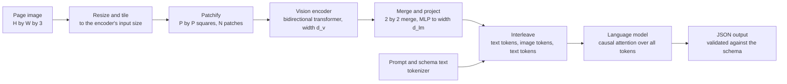
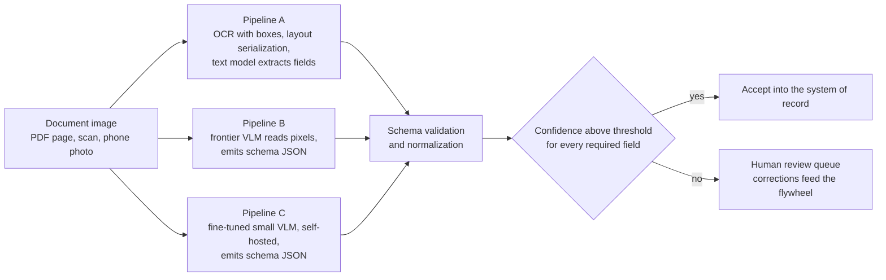
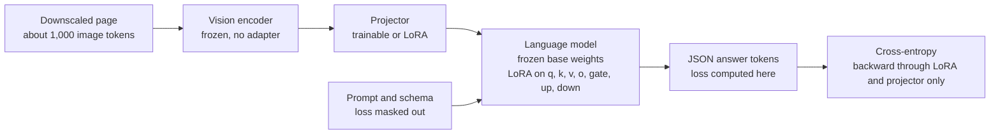
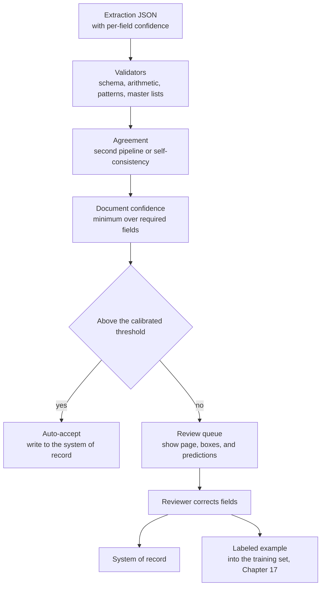

# Chapter 23: Multimodal and Document AI

> **What you will be able to do**: explain how a vision-language model turns a page image into tokens and compute the token cost of a page at a given resolution and tiling; choose among the three document pipelines with measured quality and cost per page; design a schema-first extraction with normalization rules and compute per-field precision, recall, F1, and document-level accuracy with intervals; fine-tune a small vision-language model with LoRA on the RTX 4060; serve it with vLLM and compute cost per page; handle rotated, low-resolution, handwritten, and multi-page inputs with preprocessing and confidence-based review routing; state a voice pipeline's latency budget.
>
> **Where it is used**: P4.3 (multimodal document AI) and P5.2 (the capstone).
>
> **Prerequisites**: Chapter 2 (attention and the transformer block), Chapter 4 (memory and FLOPs), Chapter 7 (LoRA and QLoRA), Chapter 11 (bootstrap intervals), Chapter 13 (serving and the prefill-decode split).

## 23.0 The problem this chapter solves

A finance team receives about four thousand supplier invoices a month as PDFs, scans, and photographs from phones. Two people key vendor, date, invoice number, line items, and total into the accounting system. The team wants the fields extracted automatically, with a number for how often the system can run unattended and a queue for the rest. Half of enterprise use cases start this way: the input is a picture of a document, not text.

Three architectures compete. An optical character recognition (OCR) engine can turn the image into text with coordinates, and a text model can extract the fields from that text. A frontier vision-language model (VLM) can read the pixels directly. A small open VLM can be fine-tuned on a few thousand labeled pages and run inside the customer's network. They differ in accuracy on clean print, on handwriting, and on messy layouts; in cost per page by two orders of magnitude; in latency; in what a reviewer can inspect when something goes wrong; and in where the data goes. The customer will ask which one, and the answer must come with per-field numbers on their document type, not a general opinion.

This chapter gives the mechanisms needed to produce that answer: how images become tokens and what a page costs, how the three pipelines work, how to define the schema and the matching rules so that the metrics mean something, how to fine-tune and serve a small VLM on 8 GB, how to handle the hard cases, and how to route uncertain extractions to a human. P4.3 runs all three pipelines on 300 held-out pages and reports the table.

## 23.1 How a vision-language model sees a page

### Patch embeddings

A Vision Transformer (ViT) treats an image as a sequence of patches. An image of height $H$, width $W$, and 3 color channels is cut into non-overlapping squares of side $P$ pixels, giving

$$
N = \frac{H}{P} \cdot \frac{W}{P}
$$

patches. Each patch is flattened to a vector of length $3P^2$ and multiplied by a learned matrix of shape $3P^2 \times d_v$, where $d_v$ is the encoder width, then a position embedding is added. The result is a sequence of $N$ vectors that a stack of transformer encoder blocks (Chapter 2's block with bidirectional attention and no causal mask) processes into $N$ contextual patch features.

Worked example with ViT-L shapes ($P = 14$, $d_v = 1024$; state your model's values from its configuration). A $224 \times 224$ image gives $16 \times 16 = 256$ patches, each a vector of $3 \times 14 \times 14 = 588$ values, projected by a $588 \times 1024$ matrix of about 602,000 parameters. A $448 \times 448$ image gives $32 \times 32 = 1{,}024$ patches. Doubling the side quadruples the patch count, and since encoder attention costs $N^2$ per layer per head, it multiplies the attention cost by sixteen. Resolution is the lever that sets both legibility and cost.

### The projector

The encoder's features live in the vision space of width $d_v$. The language model expects embeddings of width $d_{lm}$. The projector maps between them. In its simplest form it is a two-layer multilayer perceptron with a nonlinearity, of shape $d_v \to d_{lm} \to d_{lm}$; for $d_v = 1024$ and $d_{lm} = 2048$ that is about $2.1$ million plus $4.2$ million, about 6.3 million parameters, small next to the encoder and the language model. Many current models also compress the token count in the projector by merging neighboring patches: a $2 \times 2$ merge concatenates four patch features into one vector and projects it, dividing the token count by four. Others use pooling or a learned resampler that emits a fixed number of tokens regardless of input size. The exact compression is a per-model design choice; read it from the model card, because it decides the token arithmetic below.

### Image tokens in the language model

After projection, the image is a sequence of $N_{img}$ embeddings in the language model's space. They are placed in the input sequence between special marker tokens, interleaved with text tokens, and the language model attends over the whole sequence. From the language model's point of view an image token is an embedding like any other; it has no vocabulary entry and is never generated, only consumed. The KV cache cost per image token is the same as for a text token (Chapter 4), which is why a page can dominate a request's memory.



*Figure 23.1: A vision-language model; the encoder and projector turn a page into embeddings that the language model consumes alongside text.*

### Resolution, tiling, and the token cost of a page

Encoders are trained at a fixed input size, and a document page is far larger than that size. Two strategies exist. Tiling splits the page into crops at the encoder's native size, often adds a downscaled thumbnail of the whole page for global context, and concatenates all the tokens. Dynamic resolution feeds the page at or near its native size to an encoder trained to accept variable patch grids, capped by a maximum pixel budget.

Worked example, tiling. Assume an encoder with native input $448 \times 448$, patch $P = 14$, and a $2 \times 2$ merge in the projector. One tile yields $(448/14)^2 / 4 = 1{,}024 / 4 = 256$ tokens. A United States letter page scanned at 150 dots per inch is $1{,}275 \times 1{,}650$ pixels. A $3 \times 4$ grid of tiles (each tile covering about $425 \times 412$ source pixels, resized to $448 \times 448$) plus one global thumbnail is 13 tiles, so $13 \times 256 = 3{,}328$ image tokens. A $2 \times 3$ grid plus thumbnail is 7 tiles and $1{,}792$ tokens, with each tile covering about $638 \times 550$ source pixels and therefore downscaled by about 0.7 before encoding. A single tile is 256 tokens and downscales the page by about 0.27; 10-point text at 150 dots per inch is about 21 pixels tall in the source and becomes about 6 pixels, which no current model reads reliably.

Worked example, dynamic resolution. Assume a model whose effective stride is 28 pixels per token (patch 14 with a $2 \times 2$ merge; the Qwen2-VL family works this way, verify against the card). The same page gives about $(1{,}275 / 28) \times (1{,}650 / 28) \approx 45.5 \times 58.9 \approx 2{,}680$ tokens at native resolution. With a maximum pixel budget of $1{,}000 \times 28^2 = 784{,}000$ pixels, the page is scaled by about $0.61$ to $780 \times 1{,}010$ pixels and costs about 1,000 tokens; 10-point text becomes about 13 pixels tall, which is legible for most models but near the edge. The legibility floor varies by model; measure it on your own pages by extracting a known small-print field at several budgets.

The consequence: a page costs between a few hundred and a few thousand tokens depending on the budget you choose, the KV cache for those tokens is paid at serving time (Chapter 4), and downscaling to save tokens is a quality decision that must be checked on the smallest text your schema needs.

### How VLMs are trained, briefly

Most open VLMs train in stages. First the projector alone is trained on image-caption pairs with the encoder and the language model frozen, so that image features land in a region of the embedding space the language model already understands. Then the language model (and sometimes the encoder) is unfrozen for instruction tuning on visual question answering, document, and chart data. This history is why fine-tuning for a document task works with adapters on the language side: the encoder already extracts the features, and what changes is how the language model reads them and what it emits.

## 23.2 Three pipelines for documents



*Figure 23.2: The three pipelines share the schema, validation, and routing stages; they differ in how pixels become field values.*

**Pipeline A, OCR plus a text model.** An OCR engine produces words with bounding boxes and confidences. A serializer arranges them into layout-preserving text. A text model, prompted with the schema, extracts the fields. Strengths: the OCR text is inspectable, so a reviewer can see what the model saw; the text model can be small and cheap; the OCR runs on CPU. Weaknesses: every OCR error propagates; layout is flattened; handwriting and poor scans fail at the OCR stage before the model sees anything.

**Pipeline B, a frontier VLM.** The page image goes to a hosted model with the schema in the prompt. Strengths: best quality on messy inputs, handwriting, and complex layouts; no training. Weaknesses: cost per page from image tokens; latency of a large prefill; the data leaves the customer's environment; behavior changes when the provider updates the model.

**Pipeline C, a fine-tuned small VLM.** A 2-billion-parameter-class VLM with LoRA adapters trained on a few thousand labeled pages of the customer's document type, served on your own GPU. Strengths: approaches frontier quality on the narrow type; a small fraction of the cost per page; runs inside the network; deterministic version. Weaknesses: needs labeled data and a training run; generalizes poorly outside the trained document type; you operate it.

### Cost per page, worked

Assume, for illustration only, prices of 3 dollars per million input tokens and 15 dollars per million output tokens for a frontier model, and the same for a small hosted text model divided by ten; substitute current prices. Pipeline B at about 2,700 image tokens plus 500 prompt tokens in and 300 tokens out costs about $3{,}200 \times 3 \times 10^{-6} + 300 \times 15 \times 10^{-6} \approx 0.0096 + 0.0045 = 0.014$ dollars per page. Pipeline A with OCR on CPU and a frontier text model reading about 1,500 tokens of serialized text costs about $0.0045 + 0.0045 = 0.009$ dollars, or about 0.001 dollars with the small text model. Pipeline C on a rented A100 at about 1.39 dollars per hour (RunPod Community Cloud, September 2026; verify) processing on the order of 5,000 pages per hour costs about 0.0003 dollars per page, and on your RTX 4060 the marginal cost is electricity. The roadmap's target for P4.3, within 5 F1 points of the frontier model at under a tenth of the cost, is therefore about serving throughput as much as about model quality; section 23.7 measures it.

| Property | A: OCR plus text model | B: frontier VLM | C: fine-tuned small VLM |
|---|---|---|---|
| Clean printed pages | Good | Best | Good to best on the trained type |
| Handwriting, photos, skew | Poor (OCR fails first) | Best | Fair to good if trained on such samples |
| Layout and tables | Fair (flattened) | Good | Good on the trained layouts |
| Cost per page (illustrative) | 0.001 to 0.009 dollars | About 0.014 dollars | Under 0.001 dollars |
| Latency per page | 1 to 3 s | 3 to 10 s | 1 to 3 s on a GPU |
| Inspectability | High (OCR text visible) | Low (pixels to JSON) | Low, plus token confidences |
| Data residency | Depends on the text model | Leaves the network | Stays inside |
| Maintenance | OCR and prompt upkeep | Provider changes | Training, serving, monitoring |

## 23.3 OCR engines and layout analysis

Tesseract is the long-standing open-source engine. Its recognizer is a recurrent network over text lines; it outputs words with bounding boxes and per-word confidences in several formats, and offers page segmentation modes that decide whether it treats the page as a single column, a block, or a sparse layout. It is adequate for clean printed text and weak on skew, low contrast, handwriting, and multi-column layouts. PaddleOCR is a pipeline of a text detector (producing polygons around text regions), a recognizer for each region, and optional layout and table-structure models that classify regions (title, paragraph, table, figure) and reconstruct table cells. It is stronger than Tesseract on layout, tables, and multilingual text. Both run on CPU at about one to three seconds per page, faster on a GPU.

### From boxes to text the model can read

OCR gives a set of words, each with a box $(x_0, y_0, x_1, y_1)$ and a confidence. Reading order is not given. The standard reconstruction groups words into lines by vertical overlap (two words are on one line if their vertical centers differ by less than about half a line height), sorts lines by $y$, and sorts words within a line by $x$. Multi-column pages break this, because the sort interleaves columns; the fix is a recursive XY-cut that splits the page at the widest horizontal and vertical whitespace gaps until each block is a single column, then orders blocks.

A text model extracts fields better from layout-preserving text than from a flat word stream. Layout-preserving serialization emits one line per detected line and inserts spaces proportional to horizontal gaps, so that a label and its value on the same row stay adjacent and a table's columns stay aligned. Including coordinates explicitly (each line prefixed with its box) helps for key-value pairing on forms but costs tokens; test both on your pages.

### Tables

Tables are where OCR pipelines lose the most. Cell detection, row and column alignment, and merged cells each have their own failure modes, and a flattened table forces the text model to reconstruct structure from spacing. A table-structure model that emits cells with row and column indices, serialized as Markdown or as a list of rows, is the difference between reliable and unreliable line-item extraction in pipeline A. VLMs read tables from pixels and handle merged cells better, at the cost of inspectability.

## 23.4 Schema-first extraction and normalization

### Define the output first

Write the schema before running any model. For an invoice: `invoice_number` (string, required), `invoice_date` (date, required), `vendor_name` (string, required), `currency` (enumeration), `line_items` (list of `description`, `quantity`, `unit_price`, `amount`), `subtotal`, `tax`, `total` (decimal, required). Mark which fields are required for the document to be accepted unattended. Pydantic models give validation for free and generate the JSON Schema you put in the prompt or use for constrained decoding.

Every pipeline emits JSON that is validated against the schema. A validation failure (a missing required field, a string where a number belongs) is returned to the model as an error message for one bounded retry, and a second failure routes the document to review. Constrained decoding, which vLLM supports by masking tokens that would violate a JSON Schema during generation, removes the syntax failures entirely and leaves only the semantic ones.

### Normalization rules

Two values that mean the same thing must compare equal, or every metric is wrong in the pessimistic direction. Rules per field type:

- **Dates.** Parse to ISO 8601. Day-month ambiguity (`03/04/2026`) is resolved by a per-vendor or per-locale rule recorded in the schema, never guessed per document. A date that fails to parse is a missing prediction, not a wrong one.
- **Amounts.** Strip currency symbols and thousands separators, resolve the decimal separator by locale rule (`1.234,56` versus `1,234.56`), parse to a decimal, and compare at the schema's precision (two places for most currencies). Never compare as floating point.
- **Identifiers.** Uppercase, strip whitespace and separators according to the field's pattern, then compare exactly. An invoice number is either right or wrong.
- **Names.** Casefold, collapse whitespace, strip punctuation and legal suffixes (`Inc`, `Ltd`) if the schema says so, then compare with a similarity threshold.
- **Line items.** Align predicted rows to gold rows first (by description similarity and amount), then compare cell by cell.

### Match types

Exact match after normalization for identifiers and enumerations. Normalized match for dates and amounts, which is exact match on the normalized value. Fuzzy match for names and free text, using normalized edit similarity

$$
\text{sim}(a, b) = 1 - \frac{\text{lev}(a, b)}{\max(|a|, |b|)},
$$

where $\text{lev}$ is the Levenshtein distance (the minimum number of single-character insertions, deletions, and substitutions turning $a$ into $b$) and $|a|$ is the length of $a$. A threshold of about 0.9 accepts `Acme Supplies` against `Acme Suplies` (one edit in 13 characters, similarity 0.923) and rejects `Acme Supplies` against `Apex Supplies` (three edits, similarity 0.769). Set the threshold per field and record it with the schema, because it is part of the metric's definition.

## 23.5 Metrics

### Per-field precision, recall, and F1

For one field across a set of documents, each document falls into one of four cases after normalization. A true positive (TP) is a predicted value that matches the gold value. A false positive (FP) is a predicted non-empty value that is wrong, or a prediction where the gold is empty. A false negative (FN) is an empty prediction where the gold is non-empty. A wrong non-empty prediction against a non-empty gold counts as both an FP and an FN, because the system both asserted something false and missed the truth. Then

$$
P = \frac{TP}{TP + FP}, \qquad R = \frac{TP}{TP + FN}, \qquad F_1 = \frac{2PR}{P + R}.
$$

Precision answers "when the system fills this field, how often is it right", which is what unattended processing depends on. Recall answers "how often does it fill the field when it should", which is what the review queue's size depends on. Report both, not only F1.

### Document-level accuracy

A document is correct if every required field is correct. Document-level accuracy is the fraction of correct documents. It is the number the customer cares about, because a document with one wrong field still needs a human. It is always lower than the per-field numbers, and if field errors were independent it would be about their product; in practice errors correlate (a bad scan breaks several fields at once), so the measured value is usually a little higher than the product.

### Worked example

200 held-out invoices, four required fields, all present in every gold document.

| Field | Correct | Wrong value | Empty | TP | FP | FN | P | R | F1 |
|---|---|---|---|---|---|---|---|---|---|
| invoice_number (exact) | 186 | 8 | 6 | 186 | 8 | 14 | 0.959 | 0.930 | 0.944 |
| invoice_date (normalized) | 194 | 3 | 3 | 194 | 3 | 6 | 0.985 | 0.970 | 0.977 |
| total (normalized) | 190 | 6 | 4 | 190 | 6 | 10 | 0.969 | 0.950 | 0.960 |
| vendor_name (fuzzy 0.9) | 170 | 20 | 10 | 170 | 20 | 30 | 0.895 | 0.850 | 0.872 |

Macro-averaged F1 across the four fields is $(0.944 + 0.977 + 0.960 + 0.872)/4 = 0.938$. The independence estimate of document-level accuracy is $0.930 \times 0.970 \times 0.950 \times 0.850 \approx 0.729$; the measured value, counting documents with all four fields correct, is 152 of 200, which is 0.760, higher because the failures cluster on the same poor scans. The bootstrap interval (Chapter 11) on 0.760 with 200 documents has a standard error of about $\sqrt{0.76 \times 0.24 / 200} \approx 0.030$, so roughly 0.70 to 0.82. The roadmap's 300 pages narrows that to about plus or minus 0.05. The per-field table says where to work: vendor names are the weak field, and the fix is different (a vendor master list to match against) from the fix for invoice numbers (a higher resolution budget on the header region).

### Comparing systems

Three pipelines on the same 300 pages is a paired comparison. Report each pipeline's per-field F1 and document-level accuracy with bootstrap intervals, and report the differences with paired bootstrap intervals over documents (Chapter 11), because the same hard pages hurt every pipeline and pairing removes that shared variance. The roadmap's success criterion for P4.3 is a paired difference in F1 between the fine-tuned model and the frontier model whose interval lies within 5 points.

## 23.6 Fine-tuning a small VLM on 8 GB

### What to train

Freeze the vision encoder: it already extracts document features, and training it on a few thousand pages risks forgetting more than it learns. Apply LoRA (Chapter 7) to the language model's linear layers, attention and MLP, at rank 16 to 32. Optionally train the projector fully or with LoRA; it is small, and for a narrow document type it helps the language model read the layout. Compute the loss only on the answer tokens (the JSON), not on the prompt or the image tokens, exactly as in completion-only SFT.



*Figure 23.3: Fine-tuning a small VLM; the encoder is frozen, adapters sit on the language side, and the loss is on the answer tokens.*

### Memory arithmetic for a 2B-class VLM

Assume a model with about 1.5 billion language-model parameters and about 0.6 billion encoder parameters, 28 language-model layers of width 1,536 (roughly Qwen2-VL-2B shapes; verify against the configuration). In bf16 the weights are about $2.1 \times 10^9 \times 2 \approx 4.2$ GB. LoRA at rank 16 on all language-model linear layers adds on the order of 20 million trainable parameters, about 40 MB of weights and about 160 MB of fp32 optimizer state and gradients. With gradient checkpointing (Chapter 4), the saved activations are about one tensor per layer boundary: $28 \times 2{,}300 \times 1{,}536 \times 2 \approx 0.2$ GB for a 2,300-token sample (about 1,000 image tokens, 300 prompt tokens, 1,000 answer tokens), plus the recomputation peak of one layer and the encoder's forward activations, on the order of 1 to 1.5 GB in total. With the CUDA context of about 0.5 GB, the estimate is about 6.5 GB at batch 1, which fits in 8 GB with little margin. QLoRA (4-bit base weights, Chapter 7) cuts the weights to about 1.4 GB and buys room for batch 2 or a larger image budget. Use gradient accumulation of 8 to 16 to reach an effective batch of 8 to 16 samples.

### Image budget and legibility

Cap the processor's maximum pixels so that a page costs about 1,000 tokens (section 23.1's worked example) and check that the smallest field you need is still legible at that scale. For a 150 dots-per-inch scan, that is a scale of about 0.6 and 10-point text at about 13 pixels, which is borderline. Two remedies that do not cost tokens: scan or render at 200 dots per inch so the same budget yields larger glyphs relative to the page, or crop to the region of the page that holds the header fields and run line items as a second sample. Both are preprocessing decisions recorded in the pipeline, not model changes.

### Hyperparameters and data

LoRA learning rate 1e-4 to 2e-4 with cosine decay and a short warmup, 1 to 3 epochs over a few thousand examples, dropout 0.05, sequence length cap at the image budget plus the longest answer. Watch the answer-token loss and the per-field F1 on a held-out set every few hundred steps; the loss keeps falling after F1 plateaus, which is overfitting to formatting. Public datasets to practice on: CORD (receipts with hierarchical labels for menu items, subtotal, and total, about a thousand receipts), SROIE (scanned receipts with company, date, address, and total, about a thousand), FUNSD (about two hundred noisy scanned forms with question, answer, and header entities), and DocVQA (about twelve thousand document images with about fifty thousand question-answer pairs). Sizes are approximate; verify on the dataset cards.

### Training time on the RTX 4060

Per sample, the cost is roughly the encoder forward on about 1,000 patches (about $2 \times 0.6 \times 10^9 \times 1{,}000 \approx 1.2$ TFLOP), the language model forward and backward through activations for 2,300 tokens (about $4 \times 1.5 \times 10^9 \times 2{,}300 \approx 14$ TFLOP, using forward plus activation-gradient backward since base weights get no gradients), and one extra forward for checkpoint recomputation (about 7 TFLOP), about 22 TFLOP in total. At an effective 15 TFLOPS, which is roughly a quarter of the 4060's dense bf16 peak (verify the spec sheet; Appendix B), that is about 1.5 seconds per sample. Three thousand examples for two epochs is six thousand samples, about 2.5 hours, plus evaluation. The 50-step smoke test at full image budget and batch size that the roadmap asks for before any long run catches memory problems in under two minutes.

## 23.7 Serving a VLM with vLLM and cost per page

vLLM serves vision-language models through the same OpenAI-compatible API as text models (Chapter 13), accepting images in the chat message content. The launch flags that matter: the model path (the merged fine-tuned model, or the base with a LoRA adapter if your version supports multimodal LoRA serving), the maximum model length sized to the image budget plus prompt plus answer, a limit on images per prompt, GPU memory utilization, and optionally a quantization method for the base weights. Flag names are version-dependent; check your version.

```bash
vllm serve ./invoice-vlm-merged --max-model-len 4096 --limit-mm-per-prompt image=1 --gpu-memory-utilization 0.90 --dtype bfloat16
```

A document request is prefill-heavy: about 1,300 tokens in (image plus prompt) and 200 to 400 out. Prefill is compute-bound (Chapter 13), so time to first token on the 4060 for a 2B model is about $2 \times 2.1 \times 10^9 \times 1{,}300 / (15 \times 10^{12}) \approx 0.4$ seconds. Decode is memory-bound: each token reads the 4.2 GB of weights, and at roughly 250 GB per second of bandwidth (verify) that is about 17 milliseconds per token at batch 1, so 300 output tokens take about 5 seconds alone but amortize across concurrent requests. With 8 concurrent documents and the KV cache sized for them (about 1,300 plus 300 tokens each, at the per-token KV cost from Chapter 4), the 4060 processes on the order of one page per second, about 3,600 pages per hour, at electricity cost. On an A100 the same model runs several times faster; if you measure 5,000 pages per hour at about 1.39 dollars per hour, cost per page is

$$
c_{page} = \frac{c_{hour}}{\text{pages per hour}} = \frac{1.39}{5{,}000} \approx 0.0003 \text{ dollars},
$$

against about 0.014 dollars for the frontier pipeline in section 23.2's illustration, about a fiftieth. Measure the pages per hour with a load test at realistic concurrency rather than computing it; the roadmap allows one to two A100 hours for this benchmark, about 3 dollars.

## 23.8 Hard cases and preprocessing

| Hard case | Symptom | Preprocessing | Most robust pipeline |
|---|---|---|---|
| Rotation by 90 or 180 degrees | OCR returns garbage or nothing; VLM reads sideways text poorly | Detect orientation with the OCR engine's orientation script or by trying four rotations and keeping the one with the highest OCR confidence; rotate | Any, after correction |
| Skew of a few degrees | OCR lines merge or split; boxes misalign | Estimate the skew angle from the minimum-area rectangle around the text mask or a Hough transform on line edges; rotate to deskew | Any, after correction |
| Low resolution (under about 100 dots per inch) | Small print unreadable; OCR confidences low | Upscale by 2 with a bicubic filter or a super-resolution model before OCR; raise the VLM's pixel budget for that document | B, then C |
| Handwriting | OCR near-zero recall; VLM fair | None effective at the pixel level; route by field to review if confidence is low | B; C if trained with handwritten samples |
| Multi-page documents | Fields span pages; totals on the last page | Split into pages, classify each page's role, extract per page, merge at document level with page provenance per field | A or C per page, merge in code |
| Tables with merged cells | Line items misaligned; amounts attached to the wrong description | Table-structure recognition in A; explicit instruction to emit one row per line item in B and C | B, then C |
| Phone photographs | Perspective distortion, shadows, glare | Detect the page quadrilateral and apply a perspective transform; normalize contrast | B; C if trained on photos |
| Low contrast or faded print | OCR misses characters | Adaptive thresholding or contrast normalization before OCR; leave pixels untouched for VLMs, which handle it better than binarization does | B or C |

Preprocessing is measured, not assumed. Add a stratum of each hard case to the held-out set (the roadmap asks for rotated, low-resolution, and handwritten samples), report each pipeline's per-field F1 on each stratum, and keep only the preprocessing steps that raise it.

## 23.9 Confidence estimation and review routing

### Sources of confidence

A VLM emits token log-probabilities, so the confidence of a field is a function of the log-probabilities of the tokens that formed its value: the mean, or more conservatively the minimum, mapped to a probability. Agreement is a second source: run two pipelines (OCR plus text model, and the VLM) and treat fields on which they agree as high confidence. Validators are a third: the total equals the sum of line items plus tax, the date is within a plausible window, the invoice number matches the vendor's known pattern, the vendor is in the master list. OCR word confidences are a fourth for pipeline A.

### Calibration and the threshold

A confidence is useful only if it is calibrated: among fields with confidence about 0.9, about 90 percent should be correct. Measure it on the held-out set by binning confidence and computing accuracy per bin, and present it as a table. Then choose the document-level threshold from the target unattended accuracy.

Worked example. On 300 documents, sorting by the minimum field confidence and sweeping a threshold gives: at 0.95, 62 percent of documents are auto-accepted with 99.2 percent document-level accuracy among them; at 0.90, 78 percent are auto-accepted at 98.5 percent; at 0.80, 90 percent at 96.0 percent. If the customer's tolerance for unattended errors is 1.5 percent, the threshold is 0.90, and the review queue receives 22 percent of documents. Expected cost per page is then

$$
c = c_{auto} + q \cdot c_{review} + (1 - q) \cdot \epsilon \cdot c_{error},
$$

where $c_{auto}$ is the pipeline's cost per page, $q$ is the review fraction, $c_{review}$ is the cost of a human review (for example three minutes of an analyst's time), $\epsilon$ is the error rate among auto-accepted documents, and $c_{error}$ is the cost of a wrong value reaching the accounting system. With $q = 0.22$, $c_{review} = 2.50$ dollars, $\epsilon = 0.015$, and $c_{error} = 40$ dollars, the review term is 0.55 dollars and the error term is $0.78 \times 0.015 \times 40 \approx 0.47$ dollars per page, both far larger than any pipeline's $c_{auto}$. The model's cost per page is not where the money is; the review fraction and the residual error rate are, which is why a few F1 points are worth a training run.



*Figure 23.4: Extraction, validation, confidence, and routing; reviewer corrections become training data.*

### The review interface

A reviewer needs the page image, the predicted value, and the region the value came from (the OCR box in pipeline A; for VLMs, either a second call asking for the location or the box from an OCR pass run only for display). Showing the region cuts review time by more than any model improvement, because the reviewer verifies instead of searching. Corrections are stored with the document id, the field, the old and new value, and the reviewer, and flow into the training set through the flywheel of Chapter 17.

## 23.10 A voice pipeline, briefly

The roadmap dropped voice from P4.3; the mechanism is short enough to state. A voice interface is speech-to-text (STT), the agent, and text-to-speech (TTS), plus voice activity detection (VAD) to find where the user stopped speaking. The latency that matters is from the end of the user's speech to the first audio of the reply, and about one second is where a conversation stops feeling delayed. A budget that meets it: VAD end-of-turn detection about 200 to 300 milliseconds (it must wait to be sure the user has finished), streaming STT finalizing about 100 to 300 milliseconds after speech ends, the language model's time to first token about 300 to 500 milliseconds, and TTS first audio about 100 to 200 milliseconds, for a total of about 0.7 to 1.3 seconds. Every stage streams into the next; a pipeline that waits for the full transcript, then the full reply, then the full audio, is several seconds slower. Interruption (barge-in) means the VAD listens during playback, and user speech stops the TTS, cancels the pending generation, and records what was actually spoken so the transcript matches what the user heard. Speech-to-speech models collapse the three stages into one and remove the transcript as an inspectable artifact; whether that is acceptable depends on the audit requirements of the deployment.

## 23.11 Implementation notes

**Listing 23.1: Per-field metrics with normalization rules and match types.**

```python
from dataclasses import dataclass
from datetime import date
from decimal import Decimal, InvalidOperation
import re

def norm_id(s):      return re.sub(r"[\s\-_/]", "", s or "").upper() or None
def norm_name(s):    return re.sub(r"[^\w ]", "", (s or "").casefold()).split() or None
def norm_amount(s, decimal_sep="."):
    if not s: return None
    t = re.sub(r"[^\d,.\-]", "", s)
    t = t.replace(",", "") if decimal_sep == "." else t.replace(".", "").replace(",", ".")
    try: return Decimal(t).quantize(Decimal("0.01"))
    except InvalidOperation: return None
def norm_date(s, dayfirst=False):
    m = re.match(r"(\d{1,4})[-/.](\d{1,2})[-/.](\d{1,4})", s or "")
    if not m: return None
    a, b, c = (int(x) for x in m.groups())
    try:
        if a > 31: return date(a, b, c)                       # ISO order
        return date(c, a, b) if dayfirst else date(c, b, a)   # locale rule from the schema
    except ValueError: return None

def lev(a, b):
    prev = list(range(len(b) + 1))
    for i, ca in enumerate(a, 1):
        cur = [i]
        for j, cb in enumerate(b, 1):
            cur.append(min(prev[j] + 1, cur[j - 1] + 1, prev[j - 1] + (ca != cb)))
        prev = cur
    return prev[-1]

def fuzzy_equal(a, b, threshold=0.9):
    a, b = " ".join(a), " ".join(b)
    return 1 - lev(a, b) / max(len(a), len(b), 1) >= threshold

@dataclass
class FieldSpec:
    normalize: callable
    equal: callable = lambda a, b: a == b

def field_metrics(spec: FieldSpec, preds, golds):
    tp = fp = fn = 0
    for p, g in zip(preds, golds):
        p, g = spec.normalize(p), spec.normalize(g)
        if g is None and p is None: continue
        if g is None: fp += 1; continue
        if p is None: fn += 1; continue
        if spec.equal(p, g): tp += 1
        else: fp += 1; fn += 1            # a wrong value is both asserted and missed
    P = tp / (tp + fp) if tp + fp else 0.0
    R = tp / (tp + fn) if tp + fn else 0.0
    F1 = 2 * P * R / (P + R) if P + R else 0.0
    return {"tp": tp, "fp": fp, "fn": fn, "precision": P, "recall": R, "f1": F1}
```

Each field carries its own normalizer and equality, so the metric definition lives next to the schema. Amounts are `Decimal` quantized to two places, never floats. The date normalizer takes the day-first rule as a parameter that comes from the schema or the vendor profile, not from the document. A wrong value increments both `fp` and `fn`, which is the convention stated in section 23.5; if you adopt a different convention, state it in the report, because it changes F1. Document-level accuracy is computed separately as the fraction of documents where every required field's `equal` returned true.

**Listing 23.2: A LoRA configuration for the language side of a VLM and the processor's image budget (PEFT and Transformers, mid-2026 names; check your version).**

```python
from peft import LoraConfig, get_peft_model
from transformers import AutoModelForImageTextToText, AutoProcessor   # class name varies by version

MODEL = "your-org/small-vlm-2b"          # for example a Qwen2-VL or SmolVLM checkpoint
model = AutoModelForImageTextToText.from_pretrained(MODEL, torch_dtype="bfloat16", device_map="cuda")
processor = AutoProcessor.from_pretrained(MODEL, min_pixels=256 * 28 * 28, max_pixels=1000 * 28 * 28)

# Regex over module names: language-model projections only; exclude the vision tower.
# Inspect model.named_modules() for your checkpoint; names differ between families.
TARGETS = r"^(?!.*(visual|vision)).*\.(q_proj|k_proj|v_proj|o_proj|gate_proj|up_proj|down_proj)$"

lora = LoraConfig(r=16, lora_alpha=32, lora_dropout=0.05, bias="none",
                  target_modules=TARGETS, task_type="CAUSAL_LM")
model = get_peft_model(model, lora)
model.print_trainable_parameters()       # expect on the order of 1 percent of total

for name, p in model.named_parameters():  # optionally train the projector fully
    if "merger" in name or "projector" in name or "connector" in name:
        p.requires_grad = True

model.gradient_checkpointing_enable()
model.enable_input_require_grads()
```

The `target_modules` string is a regular expression matched against full module names, which is how PEFT accepts a pattern; the negative lookahead excludes any module under the vision tower so that the encoder stays frozen. The projector's module name differs by family (`merger` in one, `connector` or `projector` in others), so the loop matches the common names and you confirm with `named_modules()`. The processor's pixel bounds implement the image budget of section 23.6 for a 28-pixel-stride family; other families expose a different knob. `enable_input_require_grads` is needed for gradient checkpointing with frozen embeddings. Training itself uses the completion-only collator pattern from Chapter 7 with the image passed through the processor; the trainer class and its argument names are version-dependent.

**Listing 23.3: Image preprocessing: orientation, deskew, contrast, and resizing to a token budget.**

```python
import cv2, numpy as np
from PIL import Image

def deskew(gray: np.ndarray) -> np.ndarray:
    inv = cv2.bitwise_not(cv2.threshold(gray, 0, 255, cv2.THRESH_BINARY | cv2.THRESH_OTSU)[1])
    coords = np.column_stack(np.where(inv > 0))
    angle = cv2.minAreaRect(coords[:, ::-1].astype(np.float32))[-1]
    angle = angle - 90 if angle > 45 else angle              # minAreaRect angle convention
    if abs(angle) < 0.3:                                      # below this, rotation adds blur
        return gray
    h, w = gray.shape
    M = cv2.getRotationMatrix2D((w / 2, h / 2), angle, 1.0)
    return cv2.warpAffine(gray, M, (w, h), flags=cv2.INTER_CUBIC, borderValue=255)

def normalize_contrast(gray: np.ndarray) -> np.ndarray:
    clahe = cv2.createCLAHE(clipLimit=2.0, tileGridSize=(8, 8))
    return clahe.apply(gray)

def fit_token_budget(img: Image.Image, max_tokens=1000, stride=28) -> Image.Image:
    w, h = img.size
    scale = min(1.0, (max_tokens * stride * stride / (w * h)) ** 0.5)
    new = (max(stride, round(w * scale / stride) * stride), max(stride, round(h * scale / stride) * stride))
    return img if new == (w, h) else img.resize(new, Image.LANCZOS)

def preprocess(path: str, for_ocr: bool) -> Image.Image:
    gray = cv2.imread(path, cv2.IMREAD_GRAYSCALE)
    gray = deskew(gray)
    if for_ocr:
        gray = normalize_contrast(gray)                       # helps OCR, not VLMs
    img = Image.fromarray(gray).convert("RGB")
    return img if for_ocr else fit_token_budget(img)
```

`deskew` estimates the page's skew from the minimum-area rectangle around the ink pixels and rotates only when the angle is large enough to matter, since a sub-degree rotation costs sharpness. Ninety-degree orientation errors are handled before this step by trying the four rotations and keeping the one with the highest OCR confidence, which is a few lines around the OCR call. Contrast normalization helps OCR engines and is skipped for VLM input, where the encoder was trained on natural images and binarization removes information it uses. `fit_token_budget` computes the scale that brings the pixel count to the budget for a given stride and rounds the dimensions to multiples of the stride, so the token count is predictable; check that the smallest required field is still legible at the result.

## 23.12 Failure modes

| Symptom | Likely cause | How to confirm | Fix |
|---|---|---|---|
| Small fields (invoice number, dates) wrong, large fields right | Image budget too low for the glyph size | Extract the same field at two budgets; accuracy jumps | Raise the budget, render at higher dots per inch, or crop the header region |
| Pipeline A far below B on a stratum | OCR failing before the model sees text | OCR word confidences on that stratum | Preprocess (deskew, upscale) or route the stratum to B or C |
| F1 looks poor but reviewers say outputs are right | Normalization missing (dates, amounts, name suffixes) | Inspect false positives by hand | Add the rule to the schema; recompute |
| Total field often wrong by a factor of 100 or 1,000 | Decimal and thousands separator confusion | Compare raw string and normalized value | Locale rule per vendor; validator on total equals sum |
| Document-level accuracy far below the product of field accuracies | Not possible if fields are dependent in the usual direction; likely a bug in the all-fields check | Recompute by hand on ten documents | Fix the aggregation |
| Fine-tuned model emits invalid JSON | No constrained decoding; answer truncated by the length cap | Count validation failures; check output length distribution | Enable schema-guided decoding; raise the cap |
| Training loss falls, held-out F1 flat or falling | Overfitting to formatting or to the training vendors | F1 per vendor on held-out | Fewer epochs; more vendors; augment with rotation and noise |
| Out of memory at batch 1 on the 4060 | Image budget or answer length larger than estimated | Peak memory in the smoke test at full budget | QLoRA base; lower the budget; shorter answers; accumulation instead of batch |
| vLLM serves text fine but rejects images | Image limit per prompt not set, or model class lacks multimodal support in that version | Server logs at request time | Set the multimodal limit flag; check the supported-models list for your version |
| Time to first token several seconds at low load | Prefill of image tokens on a small GPU; no prefix caching | Profile prefill versus decode | Lower the budget; cache the prompt prefix; batch requests |
| Calibrated threshold accepts too many bad documents in production | Distribution shift from the held-out set (new vendors, new scanners) | Reliability table on a fresh production sample | Recalibrate monthly; monitor auto-accept error via sampled review (Chapter 18) |
| Reviewer time per document does not fall | Interface shows values without regions | Time reviewers with and without boxes | Show the source region for every field |
| Fine-tuned model fails on a new document type | Narrow training distribution | Per-type F1 | Route new types to B; collect labels; retrain |

## 23.13 On your machine

**Fine-tuning on the RTX 4060.** A 2B-class VLM in bf16 with LoRA on the language side, gradient checkpointing, batch 1, accumulation 16, and images capped at about 1,000 tokens fits in about 6.5 GB by the estimate in section 23.6; QLoRA brings it to about 4 GB and allows batch 2 or a 1,500-token budget. Run the 50-step smoke test at the full budget first and read peak memory. Expect about 1.5 seconds per sample and about 2.5 hours for 6,000 samples. Keep the dataset on the WSL2 ext4 filesystem; decoding thousands of images from the mounted Windows drive is several times slower.

**Pipeline A locally.** Tesseract and PaddleOCR run on CPU at one to three seconds per page; 300 pages is under 15 minutes. PaddleOCR can use the GPU and shares it with nothing else during that pass. The text model can be the local 7B model from Chapter 21's sizing or an API call; the 300-page evaluation with a frontier text model costs about 3 dollars at the illustrative prices.

**Pipeline B.** The frontier baseline on 300 pages at about 3,200 input tokens each is about a million input tokens, about 4 to 5 dollars at the illustrative prices, within the roadmap's 5 to 12 dollar estimate for P4.3 once retries and the hard-case strata are included.

**Serving on the 4060.** The merged 2B model in bf16 leaves about 3 GB for the KV cache after weights and CUDA context; at about 1,600 tokens per request and the per-token KV cost of the model's configuration (Chapter 4), that supports roughly 8 to 12 concurrent documents. Measure pages per hour with a load test at that concurrency; on the order of 3,000 per hour is a reasonable expectation for a 2B model, and the number goes in the results table as measured, not estimated.

**Kaggle T4s.** A T4 has 16 GB and no bf16, so training runs in fp16 with loss scaling (Chapter 3) and fits batch 2 at the same budget; its lower compute makes a run about twice as long as on the 4060. Useful for a second seed while the 4060 serves.

**A rented A100.** Not needed for training at this scale. One to two hours for the serving benchmark, about 3 dollars, gives the datacenter cost per page that the customer conversation needs, and the pod must be stopped when the load test ends.

## Exercises

**Exercise 23.1.** A page is scanned at 200 dots per inch, giving $1{,}700 \times 2{,}200$ pixels. Compute the image tokens for a tiling model with 448-pixel tiles, patch 14, a $2 \times 2$ merge, and a $4 \times 5$ grid plus a thumbnail; and for a dynamic-resolution model with a 28-pixel stride at native resolution and under a 1,200-token budget. State the height of 10-point text in each case.

<details><summary>Solution</summary>

Tiling: one tile is $(448/14)^2/4 = 256$ tokens; $4 \times 5 = 20$ tiles plus a thumbnail is 21 tiles, $21 \times 256 = 5{,}376$ tokens. Each tile covers $1{,}700/4 = 425$ by $2{,}200/5 = 440$ source pixels, resized to 448, so the scale is about 1.0 and 10-point text at 200 dots per inch, about 28 pixels tall, stays about 28 pixels. Dynamic at native: $(1{,}700/28) \times (2{,}200/28) \approx 60.7 \times 78.6 \approx 4{,}770$ tokens, text 28 pixels. Under 1,200 tokens: the budget is $1{,}200 \times 784 = 940{,}800$ pixels against $3{,}740{,}000$, a scale of $\sqrt{0.2515} \approx 0.50$, giving about $850 \times 1{,}100$ pixels and about 1,190 tokens; 10-point text becomes about 14 pixels tall, legible for most models.

</details>

**Exercise 23.2.** From the table below over 150 documents, compute precision, recall, and F1 for each field and the macro F1. Gold is present in every document.

| Field | Correct | Wrong value | Empty |
|---|---|---|---|
| po_number | 138 | 7 | 5 |
| due_date | 141 | 4 | 5 |
| amount_due | 144 | 3 | 3 |

<details><summary>Solution</summary>

po_number: TP 138, FP 7, FN 12; $P = 138/145 = 0.952$, $R = 138/150 = 0.920$, $F_1 = 0.936$. due_date: TP 141, FP 4, FN 9; $P = 141/145 = 0.972$, $R = 0.940$, $F_1 = 0.956$. amount_due: TP 144, FP 3, FN 6; $P = 144/147 = 0.980$, $R = 0.960$, $F_1 = 0.970$. Macro F1 $= (0.936 + 0.956 + 0.970)/3 = 0.954$. Recall is the fraction correct in every row because gold is always present; precision is higher because empty predictions are not false positives.

</details>

**Exercise 23.3.** A hospital wants to extract fields from referral letters. Constraints: patient data may not leave the premises, about 20 percent of letters contain handwritten annotations that matter, volume is 500 letters a day, and there is a small GPU server on site. Choose a pipeline and justify it; state what you would measure first.

<details><summary>Solution</summary>

Residency rules out pipeline B for production. Handwriting rules out pipeline A as the primary for the 20 percent of letters where it matters. Pipeline C, a small VLM fine-tuned on labeled referral letters including handwritten samples, served on the on-site GPU, is the fit, with pipeline A as a cheap first pass whose OCR confidences help route printed letters and flag handwritten regions. Measure first: per-field F1 of a base (not yet fine-tuned) small VLM on 200 labeled letters, stratified into printed and handwritten, to size the gap that fine-tuning must close; and the review fraction at the hospital's tolerated error rate, since 500 letters a day at a 25 percent review rate is 125 reviews, which decides staffing.

</details>

**Exercise 23.4.** Estimate the training memory for a 3B-class VLM (2.5B language model, 0.5B encoder, 36 layers of width 2,048) in bf16 with LoRA rank 16, gradient checkpointing, batch 1, and a 1,500-token image plus 800 text tokens. Does it fit on the 4060? What changes with QLoRA?

<details><summary>Solution</summary>

Weights: $3.0 \times 10^9 \times 2 = 6.0$ GB. LoRA and optimizer: about 0.3 GB. Checkpointed activations: $36 \times 2{,}300 \times 2{,}048 \times 2 \approx 0.34$ GB plus a layer's recomputation peak and the encoder's forward, about 1.5 GB. CUDA context about 0.5 GB. Total about 8.3 GB, which does not fit in 8 GB. With QLoRA the language model's weights drop to about $2.5 \times 10^9 \times 0.5 \approx 1.3$ GB plus quantization constants, the encoder stays in bf16 at 1.0 GB, and the total is about 4.5 GB, which fits with room for batch 2 or a larger image budget.

</details>

**Exercise 23.5.** A load test shows the fine-tuned model processes 2,800 pages per hour on the 4060 and 14,000 pages per hour on an A100 at 1.39 dollars per hour. The frontier pipeline costs 0.014 dollars per page at the illustrative prices. Compute the A100 cost per page and the ratio; then compute the monthly cost of each for 120,000 pages.

<details><summary>Solution</summary>

A100: $1.39 / 14{,}000 \approx 0.0000993$ dollars per page, about 0.0001. Ratio: $0.014 / 0.0001 \approx 141$, so the fine-tuned model is about a 140th of the frontier cost per page, well under the roadmap's tenth. Monthly: frontier $120{,}000 \times 0.014 = 1{,}680$ dollars; A100 $120{,}000 / 14{,}000 \approx 8.6$ hours, about 12 dollars if the pod runs only while processing, or about 1,000 dollars if it runs continuously at $1.39 \times 24 \times 30$, which is the utilization sensitivity from Chapter 13. On the 4060 the marginal cost is electricity, and 120,000 pages is about 43 hours of processing.

</details>

**Exercise 23.6.** A reliability table on 300 documents: at threshold 0.97, 55 percent auto-accepted at 99.5 percent accuracy; at 0.93, 70 percent at 98.8 percent; at 0.88, 82 percent at 97.6 percent; at 0.80, 91 percent at 95.5 percent. The customer tolerates 2 percent errors among auto-accepted documents; review costs 2.00 dollars and an error costs 60 dollars. Choose the threshold and compute expected cost per page excluding the model's cost.

<details><summary>Solution</summary>

The highest auto-accept rate with error at most 2 percent is threshold 0.88 (error 2.4 percent exceeds tolerance; 0.93 gives 1.2 percent). So 0.93: review fraction $q = 0.30$, error rate $\epsilon = 0.012$. Cost per page $= 0.30 \times 2.00 + 0.70 \times 0.012 \times 60 = 0.60 + 0.504 = 1.10$ dollars. At 0.88 the cost would be $0.18 \times 2.00 + 0.82 \times 0.024 \times 60 = 0.36 + 1.18 = 1.54$ dollars and violate the tolerance; at 0.97, $0.45 \times 2.00 + 0.55 \times 0.005 \times 60 = 0.90 + 0.165 = 1.07$ dollars, marginally cheaper but with a larger queue, so the choice between 0.93 and 0.97 is about reviewer capacity rather than cost.

</details>

**Exercise 23.7.** The gold date is `2026-03-04` and a pipeline outputs `04/03/2026`. Under what rule is this a true positive, under what rule a false positive, and what should the schema record so that the metric is reproducible?

<details><summary>Solution</summary>

Under a day-first rule (`DD/MM/YYYY`), `04/03/2026` normalizes to 4 March 2026, which matches the gold, a true positive. Under a month-first rule it normalizes to 3 April 2026, a false positive and a false negative. The schema records the date-order rule per vendor or per locale (for example, day-first for European suppliers), the normalizer applies that rule from the schema and never infers it from the document, and the report states the rule, so that anyone recomputing the metric gets the same number.

</details>

**Exercise 23.8.** Write the latency budget for a voice interface that must start replying within 900 milliseconds of the user finishing, given a language model with a 400-millisecond time to first token. Identify the stage you would optimize first if the total came in at 1,400 milliseconds.

<details><summary>Solution</summary>

VAD end-of-turn 250 ms, streaming STT finalization 150 ms, model time to first token 400 ms, TTS first audio 100 ms: 900 ms in total, with no slack. If the measured total is 1,400 ms, the first suspect is a non-streaming boundary: the STT waiting for the full utterance before emitting, or the TTS waiting for the full sentence rather than the first clause. Fix streaming between stages before touching any model, because a serial pipeline adds the full duration of each stage rather than its tail. The second lever is the VAD's silence threshold, which trades end-of-turn latency against cutting the user off.

</details>

## Summary

- A ViT cuts an image into $P \times P$ patches, giving $(H/P)(W/P)$ tokens before merging; a $2 \times 2$ merge in the projector divides that by four. A letter page at 150 dots per inch costs about 1,800 to 3,300 tokens tiled or about 2,700 at native dynamic resolution, and about 1,000 under a typical training budget.
- The projector maps encoder features into the language model's embedding space; image tokens are embeddings the language model consumes and never generates, and they cost KV cache like text tokens.
- Downscaling saves tokens and loses small print; 10-point text must stay above roughly 12 to 14 pixels tall to be read reliably, and the floor is measured per model.
- Three pipelines: OCR plus text model (inspectable, cheap, fails on handwriting), frontier VLM (best quality, highest cost, data leaves), fine-tuned small VLM (near-frontier on a narrow type, lowest cost, stays inside).
- OCR output is words with boxes; reading order needs line grouping and XY-cut; layout-preserving serialization and table-structure recognition are what make pipeline A work.
- Define the schema first, with per-field normalizers and match types (exact, normalized, fuzzy with a stated threshold); the metric is only as meaningful as the normalization.
- Per-field precision, recall, and F1 with a wrong value counted as both FP and FN; document-level accuracy is all required fields correct and is the number the customer needs. Report bootstrap intervals and compare pipelines with paired bootstrap over documents.
- Fine-tune with the encoder frozen, LoRA on the language model's linear layers, optional projector training, loss on answer tokens only. A 2B-class VLM fits the 4060 at batch 1 with about 1,000 image tokens; QLoRA adds headroom.
- vLLM serves VLMs through the same API; document requests are prefill-heavy; cost per page is GPU price per hour over measured pages per hour and lands one to two orders of magnitude below frontier pricing.
- Hard cases need measured preprocessing (orientation, deskew, upscaling, perspective) and a stratified held-out set; handwriting is where VLMs pull ahead.
- Confidence from token log-probabilities, agreement, and validators is calibrated on the held-out set, and the threshold is chosen from the tolerated unattended error rate. Review cost and residual error cost dominate model cost per page.
- A voice pipeline streams STT, the model, and TTS with a budget of about one second from end of speech to first audio, and barge-in cancels generation and playback.

## Further reading

- Dosovitskiy, A., and others, 2021. "An Image is Worth 16x16 Words: Transformers for Image Recognition at Scale." The Vision Transformer.
- Radford, A., and others, 2021. "Learning Transferable Visual Models From Natural Language Supervision." CLIP, the encoder lineage most VLMs build on.
- Liu, H., Li, C., Wu, Q., and Lee, Y. J., 2023. "Visual Instruction Tuning." LLaVA, the projector-plus-language-model recipe and its staged training.
- Alayrac, J.-B., and others, 2022. "Flamingo: a Visual Language Model for Few-Shot Learning." The resampler approach to fixed image-token counts.
- Wang, P., and others, 2024. "Qwen2-VL: Enhancing Vision-Language Model's Perception of the World at Any Resolution." Dynamic resolution and the patch-merge arithmetic.
- The SmolVLM model cards and technical report, Hugging Face, circa 2025. Small VLMs and their token compression.
- Park, S., and others, 2019. "CORD: A Consolidated Receipt Dataset for Post-OCR Parsing." Huang, Z., and others, 2019. "ICDAR2019 Competition on Scanned Receipt OCR and Information Extraction." (SROIE.) Jaume, G., Ekenel, H. K., and Thiran, J.-P., 2019. "FUNSD: A Dataset for Form Understanding in Noisy Scanned Documents." Mathew, M., Karatzas, D., and Jawahar, C. V., 2021. "DocVQA: A Dataset for VQA on Document Images."
- Xu, Y., and others, 2020. "LayoutLM: Pre-training of Text and Layout for Document Image Understanding." The text-plus-layout lineage that pipeline A's serialization approximates.
- Tesseract and PaddleOCR documentation at their official repositories; the vLLM documentation on multimodal inputs and supported models; the PEFT documentation on `target_modules` patterns. Check your version.
- Radford, A., and others, 2022. "Robust Speech Recognition via Large-Scale Weak Supervision." Whisper, for the voice section.
