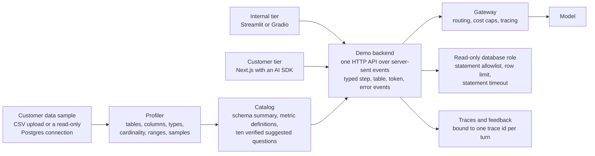
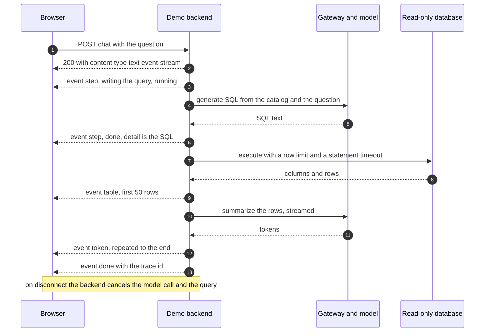
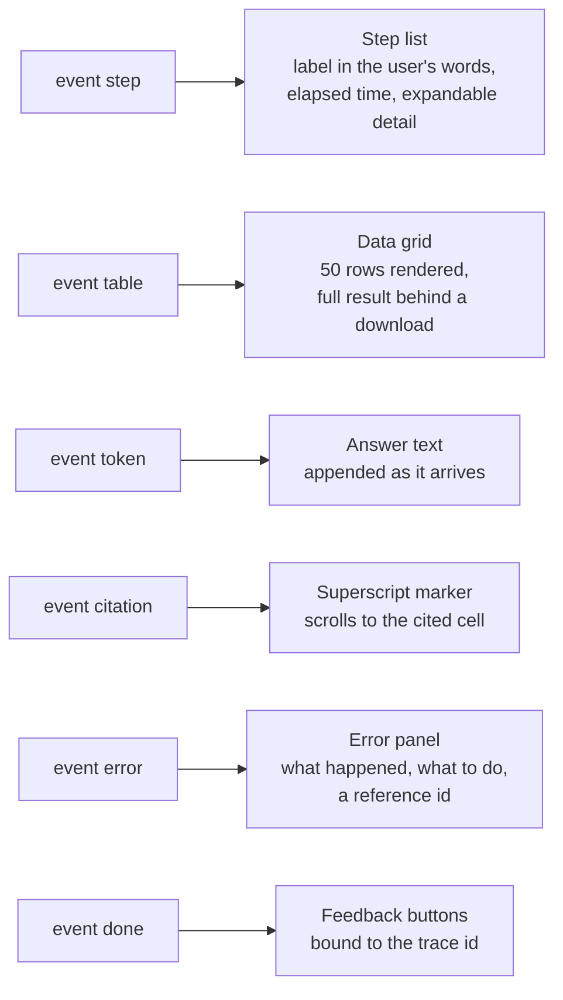
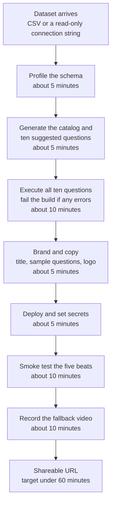
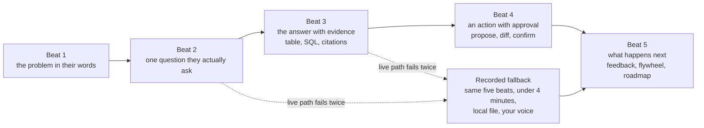

# Chapter 24: Demos and Front-Ends

> **What you will be able to do**: choose between an internal and a customer-facing demo tier and share one backend between them; stream a turn over server-sent events with typed step, table, token, and error events, and cancel the work when the browser disconnects; render tool-call steps, citations, tables, feedback, and error states that a customer trusts; profile an unfamiliar schema into a catalog and ten verified suggested questions; deploy to Vercel, a Hugging Face Space, or Modal with secrets handled correctly; run the five-beat demo narrative with a recorded fallback; and measure demo readiness as the stopwatch time from a dataset to a shareable URL.
>
> **Where it is used**: P4.4 (the demo kit and the timed dataset-to-URL run) and P5.2 (the capstone's day-one demo and readout video).
>
> **Prerequisites**: Chapter 13 (time to first token and time per output token), Chapter 16 (the gateway, cost caps, and tracing), Chapter 19 (the SQL structural validator and read-only roles), Chapter 21 (tool contracts and propose-confirm-execute). Chapter 25, section 25.12 explains where the demo sits in an engagement and can be read afterward.

## 24.0 The problem this chapter solves

You have forty minutes with a customer on Thursday. On Tuesday night they send a CSV export and a read-only connection string to a schema you have never seen, with forty tables, inconsistent naming, and one column called `flag_2`. On Thursday the room contains an operations lead who wants to see her own campaigns, a head of engineering who wants to see the SQL, and a CFO who wants to know what it costs. An architecture slide will get polite nods from all three and change nothing.

What changes the conversation is a browser tab with their data in it, answering a question the operations lead asked out loud, showing the query that produced the number, and refusing to run a write. That artifact is worth more than the deck it replaces, and it is also the thing the champion forwards to people you will never meet, which is why it has to survive being used without you in the room.

The engineering in a demo is not the model. It is everything around the model: a stream that starts producing visible output in about a second, steps the user can read in their own vocabulary, numbers that trace to cells, guardrails that stay on precisely because this is the moment security is watching hardest, and a build path short enough that Tuesday night is enough. This chapter is that engineering, plus the narrative that carries it and the number that tells you whether your kit is fast enough.

## 24.1 Why demos win engagements

A demo works because it moves the decision from a judgment about a proposal to a judgment about an artifact. A proposal invites the question "could this work", which every stakeholder answers from their own priors. An artifact invites the question "what else could it do", which is a scoping conversation and therefore progress.

Three properties decide whether a demo lands, and none of them is model quality. It uses **their data**, because a demo on a public dataset proves capability in the abstract and a demo on their campaigns proves it about them. It uses **their vocabulary**, taken from the discovery interviews (Chapter 25, section 25.2): if they say "brand", the interface says brand, not "tenant" or "account entity". And it covers **one workflow** they recognize end to end, rather than five features they have to assemble mentally.

Say what a demo is not, out loud, while you are showing it. It is not a pilot. It runs on a sample, it has not been measured on a golden set, and its latency is a laptop-to-cloud number rather than an SLO. Naming those three gaps takes fifteen seconds and prevents the most common engagement failure, which is a demo number being quoted back to you months later as a commitment (Chapter 25, section 25.13).

The readiness of the demo kit is itself a measurable property, and section 24.8 defines it: the stopwatch time from receiving a dataset to handing over a URL. P4.4's definition of done is under sixty minutes on a dataset you have not seen before.

## 24.2 Two tiers

Build two front-ends once and reuse them forever. They differ in audience and lifespan, not in backend.

| | Internal tier | Customer-facing tier |
|---|---|---|
| Framework | Streamlit or Gradio | Next.js with an AI SDK |
| Audience | You, and technical stakeholders | Executives, end users, anyone the champion forwards it to |
| Build time for a new dataset | Minutes | Minutes, because the backend is shared |
| Streaming | Supported, coarse-grained | Fine-grained, token by token, with per-step UI |
| Tool-call rendering | A status list | Designed step components with expandable detail |
| Authentication | Platform password or private Space | Provider sign-in or a platform access list |
| Deploy target | Hugging Face Space or Modal | Vercel |
| Lifespan | Disposable, rebuilt per dataset | Kept and improved across engagements |

The rule that keeps this from becoming two products: **both tiers call the same backend API**. The model call, the tool dispatch, the SQL validator, the row caps, the cost caps, and the tracing live behind one HTTP endpoint that speaks server-sent events. The tiers contain presentation only. A bug in a demo is then a rendering bug or a backend bug, never a divergence between two pipelines, and a fix to the guardrails protects both tiers at once.

The second rule: do not grow the internal tier into the customer product. Streamlit's execution model re-runs the script on every interaction, which is excellent for a disposable analyst tool and painful for a stateful multi-user application. When the internal tier starts needing session routing, per-user authorization, and custom components, that is the signal to move to the customer tier, not to keep patching.



*Figure 24.1: The demo kit; two presentation tiers over one backend, with the profiler and catalog feeding the same API and the guardrails on the backend side of the boundary.*

## 24.3 Streaming over server-sent events

### Why streaming changes the perceived system

Take a typical analyst turn: about 0.4 seconds to generate SQL, 0.6 seconds to execute it, and a 900-token summary generated at 45 tokens per second. Total wall-clock time is about 21 seconds. Without streaming the user watches a spinner for 21 seconds and concludes the system is slow. With streaming the first visible output appears at about 1.2 seconds, which is the time to first token, and the rest arrives while the user reads.

The arithmetic that makes this more than a trick: a person reads at roughly 240 words per minute, which is 4 words per second, or about 5.3 tokens per second at the usual ratio of about 0.75 words per token. Generation at 45 tokens per second is roughly eight times faster than reading. Once the first token has arrived, the model stays ahead of the reader for the rest of the answer, so the user's entire experienced wait is the time to first token. This is why the engineering effort goes into cutting time to first token and into showing something, anything truthful, before the model's first token arrives.

Jakob Nielsen's response-time limits are the design targets: about 0.1 seconds feels instantaneous, about 1 second keeps the user's flow of thought unbroken, and about 10 seconds is the limit of attention. A demo should acknowledge the click in well under a second, which is what the first `step` event is for, and should never leave the surface silent for ten seconds.

### The mechanics of server-sent events

Server-sent events are a one-way stream from server to browser over an ordinary HTTP response with the content type `text/event-stream`. The response body is a sequence of events; each event is a group of lines terminated by a blank line. A line beginning with `data:` carries the payload, `event:` names the event type, `id:` sets a resumption identifier, and a line beginning with a colon is a comment that clients ignore, which is how heartbeats are sent.

Choose server-sent events over WebSockets for a chat demo because the traffic is one-way, because they are plain HTTP and therefore pass through corporate proxies and content delivery networks that block WebSocket upgrades, and because there is no connection state to manage. Choose WebSockets when the client must send high-frequency messages mid-turn, such as live voice.

One practical trap dominates the rest. The browser's built-in `EventSource` cannot set request headers, so it cannot carry an `Authorization` bearer token. Three workable answers: put the session in a cookie, pass a short-lived signed token as a query parameter (acceptable only for a demo, and never for anything sensitive, since query strings land in logs), or abandon `EventSource` and read the stream with `fetch` and a `ReadableStream`, which can set headers and which every modern AI SDK does for exactly this reason.

A second trap is buffering. Any layer between your process and the browser that buffers the response destroys streaming without producing an error: reverse proxies (send `X-Accel-Buffering: no` and turn off `proxy_buffering` for the route), compression middleware (exclude `text/event-stream`), and some serverless platforms. The symptom is the whole answer appearing at once at the end, which looks exactly like a slow model and is not.

### Typed events, not raw text

Stream typed events rather than a single text channel, so that the interface can render steps, tables, and errors as distinct components. A working taxonomy for an analyst demo:

| Event | Payload | Rendered as |
|---|---|---|
| `step` | id, label in the user's words, state, optional detail | An entry in the step list, expandable |
| `table` | columns, first rows, truncation flag, total row count | A data grid |
| `token` | a text fragment | Appended to the answer |
| `citation` | a numeral in the answer, and the row and column it came from | A superscript marker |
| `error` | kind, a user-readable message, the trace id | An error panel |
| `done` | trace id, token and cost usage | Enables the feedback buttons |

### Heartbeats, cancellation, and limits

Idle proxies close connections that carry no bytes, so emit a comment line every ten seconds while the model thinks. When the browser disconnects, the server must stop working: cancel the model call and the running query. Without this, a user closing a tab leaves a turn that keeps generating tokens you pay for and holds a database connection. Check for disconnection inside the streaming loop and cancel the worker task, as Listing 24.1 does.

Serverless platforms impose a maximum function duration, and a stream that exceeds it is cut off mid-answer with no error the user can interpret. The tell is a cut-off that always happens at the same elapsed time. Check the platform's current limit before assuming an unbounded stream, and keep turns short.



*Figure 24.2: One turn as a sequence; the first step event reaches the browser before the model has produced anything, which is what removes the silent wait.*

## 24.4 What the chat surface must render



*Figure 24.3: Each event type maps to one component, which is what makes typed events worth the extra protocol.*

### Tool-call steps

Rendering the steps is what separates a serious demo from a chat toy. It shows the user that the system did work rather than recited, and it gives the engineer in the room something to check.

Four design rules. Label steps in the user's vocabulary, not the tool's: "Looking up campaign performance", not "calling `query_metrics`". Show state and elapsed time per step, because a step that has been running for four seconds is informative and a spinner is not. Collapse detail by default and make it expandable, because the operations lead does not want the SQL on screen and the engineer does. Expand failed steps automatically, because a failure the user has to click to see reads as a failure you tried to hide.

For a text-to-SQL answer the step list has four entries: understanding the question and choosing tables, writing the query (detail: the SQL), running it (detail: row count and elapsed milliseconds), and summarizing the result. The second and third entries are the ones customers open.

### Citations

Every number in the prose must trace to a cell in the result set. Two implementations. Ask the model to emit markers next to numerals and map them to cells, which is simple and only as reliable as the model. Or post-process: extract every numeral from the generated answer, match it against the values in the result set after normalization, and mark the ones that match. The second doubles as the grounding metric of Chapter 25, section 25.7, and it fails loudly, which is what you want: an unmatched numeral is either a hallucination or an arithmetic step the model did in its head, and both deserve the user's attention.

Never render citation chrome over numbers you have not actually verified. A false citation is worse than no citation, because it converts an ordinary error into a broken promise.

### Tables and charts

Send tables as structured rows plus a column schema, not as Markdown inside the token stream. Markdown tables inside the stream cannot be sorted, downloaded, or charted, and they cost tokens: 5,000 rows at about 30 tokens per row is 150,000 tokens, larger than most context budgets and pointless to send to a browser that will render fifty of them.

Cap what crosses each boundary. The database caps with `LIMIT`. The backend sends the first 50 rows plus the true row count and a truncation flag. The full result, if the user wants it, goes through a separate download endpoint keyed by the trace id, not through the stream.

Choose the chart from the column types rather than asking the model to draw one: one categorical column and one numeric column suggests a bar chart, a date column and a numeric column suggests a line, two numeric columns suggest a scatter, and anything else defaults to no chart. Let the user override. The chart must read the same rows as the table so that the picture and the numbers cannot disagree.

### Feedback capture

One click, always visible after `done`, bound to the trace id so that a rating joins to the trace, the SQL, the rows, and the cost (Chapter 16 and Chapter 17). Offer an optional reason, and make the reason list match your failure taxonomy: wrong numbers, wrong question understood, too slow, missing context, other. Free text alone produces sentences nobody can aggregate; a taxonomy plus optional free text produces both a count and a quote.

Log which questions were asked, including the ones a user typed and abandoned. In a demo the abandoned questions are the most valuable data in the room, because they are the workflow you did not hear about in discovery.

### Error states

Five states, each with a message a non-engineer can act on, and none of them a stack trace.

| State | What the user sees | What is logged |
|---|---|---|
| No rows | "That query returned no rows. Try a wider date range." Not an error | The SQL and the filters applied |
| Query timeout | "This question needs more data than the demo allows. Here is a narrower version." | The SQL, the timeout value, the plan if available |
| Guardrail block | "This demo is read-only, so I cannot change anything." | The blocked statement and the rule that fired |
| Model or provider error | "Something went wrong on our side. Reference 7c41." | The provider error and the trace id |
| Session expired | "Please sign in again." | The session id, not the token |

Every message carries a short reference derived from the trace id, so that when the champion emails you "it broke", you have the trace.

### Authentication

Put sign-in on the demo even though it is a demo. Three reasons: a URL shared once is shared forever, an open endpoint is an open budget, and attributable feedback is worth more than anonymous feedback. Use what the platform gives you: a Space that is private or password-protected, provider sign-in on Vercel, or a platform access list. Do not build an identity provider for a demo, and do not roll a password check into the application code.

## 24.5 Data-agnostic design

The kit's value is that it points at a dataset it has never seen and produces a working analyst. Four parts make that true.

### Schema profiling

A profiler answers what a text-to-SQL system needs to know and a schema dump does not tell it. From a Postgres database it must extract:

- Tables and views in the target schemas, with a row-count estimate.
- Columns in ordinal order, with data type, nullability, and default.
- Primary keys, foreign keys, and unique constraints, since foreign keys are the join graph.
- Column comments, which are the only human-written documentation you will get.
- Null fraction per column, because a column that is 98 percent null is not a filter.
- Distinct count per column, and for low-cardinality columns the top values with frequencies, which is what lets the model write `WHERE status = 'PAUSED'` rather than guessing the casing.
- Minimum, maximum, and a few quantiles for numeric and date columns, which fixes the date range of the data and prevents questions about a quarter that does not exist.
- A handful of sample rows per table, redacted, because a real value teaches format better than a type name.
- Inferred joins where foreign keys are missing, from name matching plus a value-overlap check.

Profiling must be cheap, because it runs against a production replica on somebody else's budget. Two rules. Never run `SELECT count(*)` on a large table for an estimate; read `reltuples` from `pg_class`, which is free. And sample rather than scan: `TABLESAMPLE SYSTEM` at a percentage chosen to land around five thousand rows gives distinct counts and ranges that are good enough to write prompts with. For a 20-million-row table that is a 0.025 percent sample, five thousand rows instead of twenty million, and the difference across a 40-table schema is the difference between a profiler that finishes while you make coffee and one that does not finish before the meeting.

Guard by data type. `min` and `max` are undefined for `json` and array columns, and a profiler that assumes every column is comparable crashes on the first schema it did not design. Quote every identifier, because customer schemas contain mixed-case and reserved-word column names.

### Catalog generation

The profile is data. The catalog is the compact text the model actually reads: one block per table with its purpose, its row estimate, its columns with type, cardinality, and an example value, its join keys, and any metric definitions you were given in discovery.

Budget it. Forty tables at twelve columns, with a column line of about fourteen tokens, is $40 \times 12 \times 14 \approx 6{,}700$ tokens, plus about twenty tokens of header per table, so roughly 7,500 tokens of catalog. That fits in a prompt, but it is most of the 12,000-token turn assumed in Chapter 25's cost model, and it is paid on every question. At 650 questions per month that is about 4.9 million input tokens. Two mitigations, and use both: keep the catalog as a stable prompt prefix so that prompt caching applies (Chapter 16), and retrieve only the tables relevant to the question once the schema passes roughly fifty tables (Chapter 9). Retrieving five tables instead of forty cuts the catalog to about 950 tokens.

### Suggested questions

Generate ten from the catalog, aiming for a mix: three that are near-trivial so that the first click always works, five that are the questions a domain person would actually ask, and two that show a join or a comparison. Then apply the rule that makes suggestions safe rather than dangerous: **every suggested question is executed before the demo ships, and any that errors or returns zero rows is removed or fixed**. A suggestion chip that fails when the customer clicks it is worse than having no chips, because the customer chose it and you offered it.

### Guardrails stay on

The temptation is to disable the validator, the row cap, and the cost cap because it is only a demo. Invert that instinct. The demo is the moment the customer's security engineer is watching most closely, and a demo that leaks data or runs a forty-second cross join is a lost deal that no later evaluation number recovers.

The minimum set, all from Chapter 19 and Chapter 16: a database role with `SELECT` only, on only the schemas in scope; the structural validator that allows a single `SELECT` statement against an allowlist of tables and rejects everything else; `statement_timeout` set to about 15 seconds on the connection; a `LIMIT` injected into every generated query; a per-session dollar cap at the gateway, where 2 dollars at a blended 0.06 dollars per question is about 33 questions; and redaction of sensitive fields before traces are stored. Synthetic or sampled data in the demo database wherever the engagement allows it, so that a leaked URL leaks nothing.



*Figure 24.4: The dataset-to-URL path with the target minutes per step; the executed-suggestions gate is the step that most often catches a broken demo before the customer does.*

## 24.6 Deployment and secrets

| Target | Best for | Watch out for |
|---|---|---|
| Vercel | The Next.js customer tier; per-branch preview URLs; environment variables per environment | Serverless function duration limits cut long streams; cold starts add to time to first token. Check current limits |
| Hugging Face Space | The Streamlit or Gradio internal tier; free CPU tier; private or password-protected Spaces; secrets in the Space settings | Spaces sleep after inactivity, so the first request of the meeting is slow unless you wake it |
| Modal | Python backends, scheduled jobs, and anything needing a GPU, such as a demo served by your own fine-tuned model | Container cold start on the first request; keep a warm instance for the meeting window |
| Your laptop | Development only | Never for a customer meeting. Their network, your battery, your notifications |

Secrets follow the same rules as every project repository: values live in the platform's environment store, `.env` is git-ignored, `.env.example` is committed with the variable names and no values, and nothing is pasted into application code. Two demo-specific habits: scope the demo's API key to its own budget so that a runaway loop cannot spend the engagement's money, and rotate that key after the demo period ends, because demo credentials travel in screenshots and shared terminals.

Demo data is synthetic, sampled, or ephemeral. If the customer insists on their real data in a shared URL, that is a conversation for the security review (Chapter 19, section 19.8), not a decision to make on Tuesday night.

## 24.7 The five-beat demo narrative

Eight to twelve minutes of demonstration, then discussion. The beats are fixed; the content comes from discovery.

**Beat 1: the problem in their words.** Thirty seconds, quoting the interview. "You told me that answering a brand's question about last week's performance takes about twenty minutes of pulling, and that the median is two days because you batch them." No technology yet.

**Beat 2: one question they actually ask.** Type it live, in their vocabulary, ideally a question the person in the room asked you. Typed live beats pre-filled, because pre-filled looks rehearsed even when it is honest.

**Beat 3: the answer with evidence.** The step list running, the SQL visible when the engineer asks, the table, the citations, the summary. This is where the rendering work of section 24.4 is repaid: the engineer checks the SQL and stops being an obstacle.

**Beat 4: an action with approval.** Propose a change, show the diff and the risk drivers, let the room decide, and confirm (Chapter 21, section 21.5). This beat answers the question executives are already thinking and are often too polite to ask, which is whether the thing can do damage.

**Beat 5: what happens next.** The feedback button, what happens to a thumbs-down, the flywheel, and the two-line roadmap. Ending on the improvement loop rather than on a feature moves the conversation to scope.

Four rules. Rehearse the whole thing once on the machine and the network you will actually use. Never demo a path you have not run that morning. Show one failure deliberately, with the control that caught it, because an audience that has seen a failure handled well stops hunting for one. And if the live path fails, retry at most once, then switch to the recording and keep talking; two failed retries in silence is the part people remember.

The recorded fallback is a deliverable, not a contingency. Under four minutes, the same five beats, your voice, 1080p, stored as a local file rather than a browser tab, and re-recorded whenever the demo changes.



*Figure 24.5: The five beats with the fallback branch; the recording rejoins at beat 5 so that the demo still ends on the improvement loop.*

## 24.8 Measuring demo readiness

Define readiness as a stopwatch measurement, because every other definition drifts. **Time from dataset to shareable URL**: the clock starts when you receive a connection string or a file, and stops when a URL exists that a customer could open and ask a question through. Measure it on a dataset you have never seen, three times, on three different public datasets.

| Step | Target | What makes it slow |
|---|---|---|
| Connect and profile | 5 min | Credentials, network policies, unusual types |
| Catalog and suggested questions | 5 min | Very wide schemas, no column comments |
| Execute the ten suggestions | 10 min | Broken joins, empty result sets, timeouts |
| Brand and copy | 5 min | Hunting for their vocabulary instead of reusing discovery notes |
| Deploy and set secrets | 5 min | Doing it by hand instead of from a script |
| Smoke test the five beats | 10 min | Finding a bug you then have to fix |
| Record the fallback | 10 min | Re-takes |
| **Total** | **50 min** | Leaves 10 minutes of margin under the 60-minute target |

The point of timing three runs is not the average, it is the variance. Whichever step was slowest in two of three runs is the one to automate next, and in practice it is almost always credentials or the suggestion verification. Track a second number alongside it: the **demo defect rate**, the number of live demos out of the last ten in which something visibly failed. A kit that builds in forty minutes and fails in front of customers one time in three is not ready.

## 24.9 Implementation notes

**Listing 24.1: A FastAPI endpoint that streams one analyst turn as typed server-sent events, with heartbeats and cancellation on disconnect.**

```python
import asyncio, json
from fastapi import FastAPI, Request
from fastapi.responses import StreamingResponse

app = FastAPI()

def sse(event: str, data: dict) -> str:
    return f"event: {event}\ndata: {json.dumps(data)}\n\n"

async def run_turn(question: str, trace_id: str, out: asyncio.Queue) -> None:
    await out.put(sse("step", {"id": "sql", "label": "Writing the query", "state": "running"}))
    sql = await generate_sql(question)                      # through the gateway
    await out.put(sse("step", {"id": "sql", "state": "done", "detail": sql}))
    await out.put(sse("step", {"id": "run", "label": "Running it", "state": "running"}))
    try:
        columns, rows, ms = await execute_readonly(sql)     # LIMIT and statement_timeout applied
    except QueryError as e:
        await out.put(sse("error", {"kind": "query", "message": e.user_message,
                                    "trace_id": trace_id}))
        return
    await out.put(sse("step", {"id": "run", "state": "done",
                               "detail": f"{len(rows)} rows in {ms} ms"}))
    await out.put(sse("table", {"columns": columns, "rows": rows[:50],
                                "total": len(rows), "truncated": len(rows) > 50}))
    async for token in summarize(question, columns, rows):  # streamed from the model
        await out.put(sse("token", {"text": token}))
    await out.put(sse("done", {"trace_id": trace_id}))

@app.post("/chat")
async def chat(request: Request):
    body = await request.json()
    trace_id = new_trace_id()
    out: asyncio.Queue = asyncio.Queue()

    async def stream():
        worker = asyncio.create_task(run_turn(body["question"], trace_id, out))
        try:
            while not (worker.done() and out.empty()):
                try:
                    yield await asyncio.wait_for(out.get(), timeout=10.0)
                except asyncio.TimeoutError:
                    yield ": keep-alive\n\n"          # comment line, ignored by clients
                if await request.is_disconnected():
                    break
            if worker.done():
                worker.result()                       # re-raise whatever the worker failed on
        finally:
            worker.cancel()                           # cancels the model call and the query

    return StreamingResponse(stream(), media_type="text/event-stream",
                             headers={"Cache-Control": "no-cache", "X-Accel-Buffering": "no"})
```

Three lines carry the design. The queue decouples the worker from the response generator, which is what makes a heartbeat possible: `wait_for` on the queue times out after ten idle seconds and emits a comment line without disturbing the worker. Wrapping the worker's `__anext__` directly instead would cancel the worker on every heartbeat, which is the bug this shape avoids. The `is_disconnected` check inside the loop plus `worker.cancel()` in `finally` is what stops paying for tokens when the tab closes; without it a closed tab leaves a generating model call and an open database connection. `X-Accel-Buffering: no` tells an nginx-family proxy not to buffer, and the same route must be excluded from any compression middleware. The helpers `generate_sql`, `execute_readonly`, and `summarize` are the gateway and database calls from Chapters 16 and 19, and `execute_readonly` is where the structural validator runs.

**Listing 24.2: A Postgres schema profiler, sampling rather than scanning, producing what the catalog needs.**

```python
from dataclasses import dataclass, field

@dataclass
class ColumnProfile:
    name: str
    dtype: str
    nullable: bool
    null_fraction: float = 0.0
    distinct: int | None = None
    top_values: list = field(default_factory=list)
    lo: str | None = None
    hi: str | None = None

COLUMNS_SQL = """SELECT column_name, data_type, is_nullable
                 FROM information_schema.columns
                 WHERE table_schema = %s AND table_name = %s
                 ORDER BY ordinal_position"""
ROWS_SQL = "SELECT reltuples::bigint FROM pg_class WHERE oid = to_regclass(%s)"
COMPARABLE = {"integer", "bigint", "numeric", "double precision", "real",
              "date", "timestamp without time zone", "timestamp with time zone", "text"}

def profile_table(cur, schema, table, target_rows=5000):
    cur.execute(ROWS_SQL, (f"{schema}.{table}",))
    n_est = cur.fetchone()[0] or 0
    pct = min(100.0, 100.0 * target_rows / max(n_est, 1))          # about 5,000 rows
    src = (f'"{schema}"."{table}"' if pct >= 100
           else f'"{schema}"."{table}" TABLESAMPLE SYSTEM ({pct:.4f})')
    cur.execute(COLUMNS_SQL, (schema, table))
    cols = [ColumnProfile(n, t, yn == "YES") for n, t, yn in cur.fetchall()]
    for c in cols:
        q = c.name.replace('"', '""')
        agg = (f', min("{q}")::text, max("{q}")::text' if c.dtype in COMPARABLE else ", NULL, NULL")
        cur.execute(f'SELECT count(*) FILTER (WHERE "{q}" IS NULL)::float '
                    f'/ greatest(count(*), 1), count(DISTINCT "{q}"){agg} FROM {src}')
        c.null_fraction, c.distinct, c.lo, c.hi = cur.fetchone()
        if c.distinct is not None and c.distinct <= 50:
            cur.execute(f'SELECT "{q}"::text, count(*) FROM {src} '
                        f'GROUP BY 1 ORDER BY 2 DESC LIMIT 10')
            c.top_values = cur.fetchall()
    return {"table": table, "row_estimate": n_est, "columns": cols}
```

The sampling percentage is derived from `reltuples`, the planner's free row estimate, so no table is ever counted. `TABLESAMPLE SYSTEM` reads whole pages, which is fast and slightly biased for clustered data; that bias is acceptable for cardinality and range hints and would not be acceptable for a reported statistic. The `COMPARABLE` set is the guard that keeps `min` and `max` away from `json`, array, and geometry columns, which is the first thing that breaks on an unfamiliar schema. Identifiers are quoted and internal quotes doubled because customer schemas contain mixed case and reserved words; the table and column names come from `information_schema` rather than from user input, which is what makes the interpolation safe. Two queries this listing omits for length: the foreign-key query over `information_schema.table_constraints` joined to `key_column_usage`, which gives the join graph, and `col_description` for column comments.

**Listing 24.3: A Streamlit chat skeleton consuming the event stream, with steps, a table, and feedback.**

```python
import requests, streamlit as st

st.set_page_config(page_title="Campaign analyst", layout="wide")
st.session_state.setdefault("messages", [])

for m in st.session_state.messages:                       # replay on every rerun
    with st.chat_message(m["role"]):
        st.markdown(m["text"])
        if m.get("table"):
            st.dataframe(m["table"]["rows"])

question = st.chat_input("Ask about campaign performance")
if question:
    st.session_state.messages.append({"role": "user", "text": question})
    with st.chat_message("user"):
        st.markdown(question)
    with st.chat_message("assistant"):
        steps = st.status("Working", expanded=False)      # Streamlit 1.28 or later
        placeholder, text, table, trace_id = st.empty(), "", None, None
        with requests.post(API_URL, json={"question": question}, stream=True) as r:
            for event, data in parse_sse(r.iter_lines()):  # yields (event name, dict)
                if event == "step":
                    steps.write(f"{data.get('label', '')} {data.get('detail', '')}")
                elif event == "table":
                    table = data
                    st.dataframe(data["rows"])
                    if data["truncated"]:
                        st.caption(f"Showing 50 of {data['total']} rows")
                elif event == "token":
                    text += data["text"]
                    placeholder.markdown(text)
                elif event == "error":
                    steps.update(state="error")
                    st.error(data["message"])
                elif event == "done":
                    trace_id = data["trace_id"]
        steps.update(state="complete")
        left, right = st.columns(2)
        left.button("Helpful", on_click=send_feedback, args=(trace_id, 1))
        right.button("Not helpful", on_click=send_feedback, args=(trace_id, -1))
    st.session_state.messages.append({"role": "assistant", "text": text, "table": table})
```

Streamlit re-runs the whole script on every interaction, which is why the transcript is replayed from `session_state` at the top and why the streaming placeholder is created fresh inside the turn. `st.chat_message`, `st.chat_input`, and `st.status` are all recent additions and their signatures have changed; `st.status` arrived in the 1.28 line, so check your version. `parse_sse` is a dozen lines you write once: accumulate lines until a blank line, read the `event:` and `data:` fields, skip lines beginning with a colon. The feedback buttons take the trace id, which is the join key to the trace, the SQL, the rows, and the cost (Chapter 17). For the customer tier the same events drive components in the AI SDK, whose streaming helper names have changed across major versions, so check your version there too.

## 24.10 Failure modes

| Symptom | Likely cause | How to confirm | Fix |
|---|---|---|---|
| Nothing appears, then the whole answer at once | A proxy, compression middleware, or platform buffering the response | Hit the endpoint with `curl` and watch the arrival times; check for a `Content-Encoding` header | Send `X-Accel-Buffering: no`, disable `proxy_buffering` on the route, exclude `text/event-stream` from compression |
| The stream is cut off at the same elapsed time every run | Serverless function duration limit | Compare the cut-off to the platform's documented limit | Shorten the turn, or move the streaming endpoint off the serverless function |
| Duplicate turns appear in the logs after a network blip | `EventSource` auto-reconnected to a non-idempotent endpoint | Count turns per client-supplied id in the logs | Read the stream with `fetch` and a `ReadableStream`, or key turns by a client-supplied id |
| Cost accrues after the user closes the tab | No disconnect check, so the worker keeps generating | Look for model spans with no matching client events | Check `is_disconnected` inside the loop and cancel the worker task |
| The prose states a number the table does not contain | The summary was generated from the question rather than only the rows | Run the numeral-matching grounding check on the turn | Pass only the result rows to the summarizer and mark every unmatched numeral |
| The browser freezes on a result | The whole result set was sent and rendered | Measure the response payload size | Cap at 50 rendered rows, send the true count, move the full result to a download endpoint |
| A write statement reaches the database in a demo | Guardrails disabled because "it is only a demo" | Attempt an `UPDATE` during the smoke test, every time | Read-only role plus the structural validator, tested as part of the deploy |
| A suggested question errors in front of the customer | Suggestions generated but never executed | Run all ten as a build step | Fail the deploy if any suggestion errors or returns zero rows |
| The demo is slow only during the meeting | Sleeping Space or cold serverless container | Compare first-request latency with subsequent ones | Wake or warm the deployment ten minutes before, and keep it warm during the meeting window |
| A key ends up in the repository | `.env` committed, or a key pasted into app code | Scan the repository history | Platform secret store, `.env` ignored, `.env.example` committed, rotate after the demo |
| "Where did that number come from" has no answer | No SQL detail and no citations rendered | Watch a colleague use the demo without you narrating | Render the SQL in the step detail and cite cells for every numeral |
| The profiler crashes on the customer's schema | `min` or `max` on `json` or array columns, or unquoted mixed-case identifiers | Run it against a public schema you have never seen | Guard aggregates by data type and quote every identifier |
| A shared URL circulates beyond the room | No authentication on the demo | Check the platform's access setting | Private or password-protected deployment, synthetic data, and an expiry on the link |

## 24.11 On your machine

**Both tiers run comfortably on the laptop.** Streamlit needs a couple of hundred megabytes of RAM, a Next.js development server about half a gigabyte, and a synthetic demo warehouse of a few million rows across a dozen tables is on the order of one to two gigabytes on disk. Keep the database on the WSL2 ext4 filesystem, not on the mounted Windows drive, where the query latency you measure will be misleadingly bad.

**The GPU only matters if the demo serves your own model.** The fine-tuned 1.5B text-to-SQL model from P1.2 in bf16 is about 3 GB of weights under vLLM, leaving roughly 3 to 4 GB of KV cache on the 8 GB RTX 4060, which is enough for a handful of concurrent demo sessions. The decode upper bound follows Chapter 4's bandwidth argument: at about 256 GB/s of memory bandwidth (verify against Appendix B) and 3 GB read per token, a single stream cannot exceed roughly 85 tokens per second, and a realistic measured figure is lower. That is already far above reading speed, so the local model is a perfectly good demo backend. Do not run a training job and the demo at the same time; the latency you quote must be measured on an idle GPU.

**The laptop is not the demo host.** Deploy to a shareable URL and open it over the same network you will use in the meeting. If that network is a conference centre or a hotel, test on a phone hotspot too.

**Event framing costs bytes on a bad network.** A 900-token answer sent as 900 separate events carries roughly 60 bytes of framing each, about 54 kilobytes of pure overhead. Batching tokens into groups of five gives 180 events and about 11 kilobytes, at the cost of a visible chunkiness that is unnoticeable above about ten flushes per second. Batch when the connection is poor, not by default.

**Cost is trivial and the tail is not.** Twenty questions at a blended 0.06 dollars each is about 1.20 dollars per demo session, which is nothing next to the engagement. The risk is a loop or an unbounded retry, which is exactly what the per-session gateway cap exists to bound.

**Kaggle and a rented A100 play no role here.** If the demo needs a larger model than the 4060 can hold, route to the frontier API through the gateway rather than renting a GPU for a demo.

## Exercises

**Exercise 24.1.** Design the tool-call step rendering for one text-to-SQL answer. List the steps, the label each shows, what the collapsed line says, what the expanded detail contains, and which steps expand automatically.

<details><summary>Solution</summary>

Four steps. (1) "Understanding the question", collapsed line shows the tables chosen, expanded shows the question as interpreted and the catalog entries retrieved; collapsed by default. (2) "Writing the query", collapsed line shows "done in 420 ms", expanded shows the generated SQL with syntax highlighting and the validator verdict; collapsed by default, and this is the one the customer's engineer opens. (3) "Running it", collapsed line shows "128 rows in 610 ms", expanded shows the executed SQL including the injected `LIMIT`, the row count before truncation, and the timeout setting; collapsed by default. (4) "Summarizing", collapsed line shows the token count and cost; collapsed by default.

Automatic expansion applies to any step in the failed state, and to the validator verdict when it rejected something, because a block the user cannot see reads as a system that is hiding an error. Every step shows elapsed time while running, and the whole list stays visible after the turn so that the answer can be audited later from the transcript.

</details>

**Exercise 24.2.** A customer gives you a read-only Postgres connection with 40 tables. List everything the profiler must extract before the model can write correct SQL, and say why each item changes a query the model would otherwise get wrong.

<details><summary>Solution</summary>

Tables and views with row estimates (tells the model which table is the fact table). Columns in order with type and nullability (types decide casting and comparison). Primary keys, foreign keys, and unique constraints (the join graph; without it the model invents joins). Column comments (the only human documentation, and often the only place `flag_2` is explained). Null fraction per column (a 98 percent null column is not a usable filter). Distinct count per column, and top values with frequencies for low-cardinality columns (this is what produces `WHERE status = 'PAUSED'` with the right casing instead of `'paused'`). Minimum and maximum for numeric and date columns (fixes the data's date range, so a question about a quarter with no data returns a clear answer rather than an empty table). A few redacted sample rows per table (teaches value format, such as whether a campaign id looks like `C-10293` or `10293`). Inferred joins from name matching plus value overlap where foreign keys are absent, which is the normal case in warehouses.

Two operational requirements go with the list: estimate rows from `pg_class.reltuples` rather than counting, and sample with `TABLESAMPLE` rather than scanning, or profiling a 40-table warehouse will not finish before the meeting.

</details>

**Exercise 24.3.** Write the five-beat demo script for a procurement team that reviews 2,400 supplier contracts a year, where a reviewer said in discovery: "I spend most of my time hunting for the renewal date and the termination notice period, and I have been burned by a clause that was superseded in an amendment."

<details><summary>Solution</summary>

Beat 1, thirty seconds: "You told me that most of the review time goes to finding the renewal date and the notice period, and that the thing you have been burned by is a clause that an amendment superseded." No screen yet.

Beat 2: drag one of their contracts onto the page and ask the question the reviewer asks: "What is the renewal date and the notice period, and is anything here superseded?"

Beat 3: the step list runs (reading the document, extracting the eleven checklist fields, checking for amendments), the fields appear in the order of their existing checklist, and each value carries a citation to the page and clause it came from. Click one citation and the document scrolls to the highlighted clause. This is the beat where the reviewer stops watching and starts checking.

Beat 4: show a low-confidence extraction being routed to review rather than accepted, and a proposed calendar reminder for the renewal date shown as a proposal with the date, the contract, and a confirm button, then confirm it.

Beat 5: press the feedback button on a field that is wrong, say what happens to it (it becomes an item in the held-out set, the taxonomy is reviewed weekly, the fix ships in a release), and close with the two next use cases from the scoring sheet.

Deliberate failure to include in beat 3: a handwritten amendment that the system routes to human review rather than guessing, which demonstrates the control before the customer finds the case themselves.

</details>

**Exercise 24.4.** A turn takes 0.4 s to generate SQL, 0.6 s to execute it, and produces a 700-token summary at 50 tokens per second. Compute total time, time to first token, and the time the user spends waiting with nothing to read, first without streaming and then with streaming plus a `step` event emitted at 120 ms. Assume reading at 240 words per minute.

<details><summary>Solution</summary>

Generation takes $700 / 50 = 14$ s, so the total turn is $0.4 + 0.6 + 14 = 15$ s. Time to first token of the summary is $0.4 + 0.6 = 1.0$ s.

Without streaming the user sees nothing for 15 s and then everything. Waiting time with nothing to read is 15 s, well past the 10-second attention limit.

With streaming, the first `step` event lands at 120 ms, so the surface is never silent for a perceptible period; the first summary token arrives at 1.0 s. Reading at 240 words per minute is 4 words per second, about 5.3 tokens per second, while generation runs at 50 tokens per second, roughly nine times faster, so the model stays ahead of the reader for the whole answer. Waiting time with nothing to read is about 0.12 s, and the user's experienced latency is the time to first token, not the 15-second total. Reading the full 700 tokens takes about 132 s, so the user finishes reading long after generation ended, which is the usual and desirable state.

</details>

**Exercise 24.5.** A catalog for a 40-table schema averages 12 columns per table, about 14 tokens per column line and 20 tokens of header per table. Compute the catalog's token cost, the monthly input tokens if it is sent with all 650 questions, and the saving from retrieving only the 5 relevant tables. State when you would switch to retrieval.

<details><summary>Solution</summary>

Catalog size: $40 \times 12 \times 14 = 6{,}720$ tokens of column lines plus $40 \times 20 = 800$ tokens of headers, about 7,520 tokens.

Monthly if sent every time: $650 \times 7{,}520 \approx 4.89$ million input tokens. At an illustrative 3 dollars per million that is about 15 dollars per month, which is small in absolute terms but is most of the 12,000-token turn assumed in the engagement cost model, so it also inflates latency and crowds the context.

Retrieving 5 tables: $5 \times (12 \times 14 + 20) = 940$ tokens, about an eight-fold reduction, roughly 0.61 million tokens a month.

Switch to retrieval when the full catalog stops fitting comfortably beside the conversation and the result rows, which in practice is somewhere around fifty tables or five thousand tokens of catalog, or earlier if measured accuracy drops as the catalog grows because the relevant tables are being diluted. Before switching, apply prompt caching to the stable catalog prefix, which costs nothing in accuracy and removes most of the price without adding a retrieval failure mode.

</details>

**Exercise 24.6.** During a rehearsal, the answer appears all at once after 18 seconds instead of streaming. Give the three most likely causes and the single check that distinguishes each.

<details><summary>Solution</summary>

Cause one, buffering between your process and the browser: a reverse proxy with `proxy_buffering` on, or compression middleware that must see the whole body before it can compress it. Check by requesting the endpoint with `curl --no-buffer` from the same network and watching the arrival times; if `curl` streams and the browser does not, the buffering is in the browser-facing layer, and a `Content-Encoding` header on the response names compression as the culprit.

Cause two, the backend is not actually yielding incrementally: an `await` that collects the whole model response before the first `yield`, or a helper that returns a string rather than an async iterator. Check by logging a timestamp at each `out.put` call; if the puts are all within milliseconds of each other at the end, the producer is the problem, not the transport.

Cause three, the model call itself is not streaming: the streaming flag was not set on the provider request, so the gateway receives one response at the end. Check the provider span in the trace; a single span with a duration equal to the whole generation and no incremental token events means streaming was never requested upstream.

The checks are ordered by cost: the `curl` test takes ten seconds and eliminates the most common cause.

</details>

**Exercise 24.7.** You time the kit on three unseen datasets and get totals of 52, 71, and 58 minutes, with these per-step times for the 71-minute run: profile 6, catalog 5, verify suggestions 27, brand 5, deploy 6, smoke test 12, record 10. What do you automate first, and what second?

<details><summary>Solution</summary>

Verifying the suggested questions dominates the slow run at 27 minutes against a 10-minute target, and it is the step whose variance is highest because it depends on the schema's joins rather than on your effort. Automate it first: run all ten suggestions as a build step, fail the build on any error or empty result, and feed the error text back into a regeneration attempt before giving up. That converts a 27-minute manual loop into a two-minute automated one plus occasional manual repair.

Second, the smoke test at 12 minutes, which is also partly mechanical: script the five beats as an end-to-end test that asks one question, asserts a table came back, attempts a write and asserts it was blocked, and checks that the feedback endpoint records a rating. That leaves the human smoke test to the parts that need judgment, which is whether the copy uses the customer's words.

Do not optimize the recording at 10 minutes; it is fixed-cost, low-variance, and it is the insurance that makes the other 50 minutes worth spending.

</details>

**Exercise 24.8.** A demo streams a 900-token answer. Compute the framing overhead at 60 bytes per event for one event per token, and for batches of 5 tokens. At what batch size does the flush rate fall below 10 per second for a 45 tokens-per-second stream, and what does that imply?

<details><summary>Solution</summary>

One event per token: 900 events, $900 \times 60 = 54{,}000$ bytes, about 54 kB of overhead on top of roughly 3.6 kB of actual text at four bytes per token.

Batches of five: 180 events, $180 \times 60 = 10{,}800$ bytes, about 11 kB, a saving of about 80 percent of the overhead.

At 45 tokens per second, a batch of size $b$ flushes $45 / b$ times per second, so the flush rate falls below 10 per second at $b > 4.5$, that is at $b = 5$. Implication: batches of four or five sit right at the threshold where text still appears smooth to the eye, so five is the largest batch you should use by default. Larger batches make the text visibly step, which reads as stuttering rather than as speed, and the byte saving beyond that point is small because the overhead is already down by four fifths.

</details>

## Summary

- A demo wins because it converts a judgment about a proposal into a judgment about an artifact; it must use their data, their vocabulary, and one workflow, and you must name out loud what it is not.
- Build two tiers over one backend: Streamlit or Gradio for internal use, Next.js with an AI SDK for customers. The model call, guardrails, caps, and tracing live behind a single API so the tiers cannot diverge.
- Streaming removes perceived latency because generation at tens of tokens per second is roughly eight times faster than reading; after the first token the user never waits, so the metric to optimize is time to first token.
- Server-sent events are one-way HTTP with `data:` lines and blank-line separators. `EventSource` cannot set headers, so use `fetch` with a `ReadableStream` when a bearer token is needed.
- Stream typed events (`step`, `table`, `token`, `citation`, `error`, `done`) so the interface can render components rather than text, and send heartbeats through idle proxies.
- Cancel the model call and the query when the browser disconnects, or a closed tab keeps spending money and holding a connection.
- Buffering by a proxy, compression middleware, or a platform silently destroys streaming; the symptom is the whole answer arriving at once, and `curl --no-buffer` distinguishes it from a slow backend.
- Tool-call steps labeled in the user's vocabulary, with the SQL and row counts one click away, are what make an engineer in the room stop being an obstacle.
- Every number in the prose must trace to a cell; verify by matching numerals against the result set, and never render citation chrome over unverified numbers.
- A profiler must extract types, keys, comments, null fractions, cardinalities, top values, ranges, and samples, estimating rows from `reltuples` and sampling with `TABLESAMPLE` rather than scanning.
- Guardrails stay on in demos: a read-only role, the statement allowlist, a statement timeout, an injected row limit, a per-session cost cap, and synthetic or sampled data.
- The five beats are the problem in their words, one question they ask, the answer with evidence, an action with approval, and what happens next, with a recorded fallback that rejoins at beat five.
- Demo readiness is a stopwatch number: time from dataset to shareable URL on a dataset you have not seen, measured three times, with the slowest step automated next. P4.4's target is under sixty minutes.

## Further reading

- The HTML Living Standard, the Server-Sent Events section, for the `text/event-stream` format and the `EventSource` interface, including reconnection and `Last-Event-ID` semantics.
- The Vercel AI SDK documentation on streaming responses and tool-call rendering, at its official documentation root; the helper names have changed across major versions, so check the version you install.
- The Streamlit documentation on chat elements, `st.status`, and session state; the Gradio documentation on `ChatInterface` and streaming generators.
- The FastAPI documentation on `StreamingResponse` and background cancellation, and the Starlette documentation on request disconnection.
- The PostgreSQL documentation on `information_schema`, `pg_class`, `TABLESAMPLE`, and `statement_timeout`, which are the four primitives the profiler and the guardrails are built from.
- The Vercel, Hugging Face Spaces, and Modal documentation on function duration limits, cold starts, sleep behavior, and secret storage. Verify current limits rather than relying on remembered numbers.
- Nielsen, J., 1993. *Usability Engineering*, the chapter on response times, for the 0.1, 1, and 10 second limits that set the streaming design targets.
- Huyen, C., 2025. *AI Engineering*, the chapter on user feedback, for feedback capture that produces usable data rather than a satisfaction score.
- Chapter 16 of this handbook for the gateway, cost caps, and tracing behind the demo backend; Chapter 19 for the structural validator and read-only roles; Chapter 25, section 25.12, for where the day-one demo sits in an engagement.
