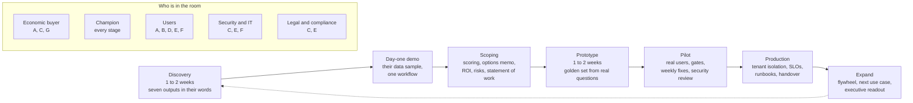
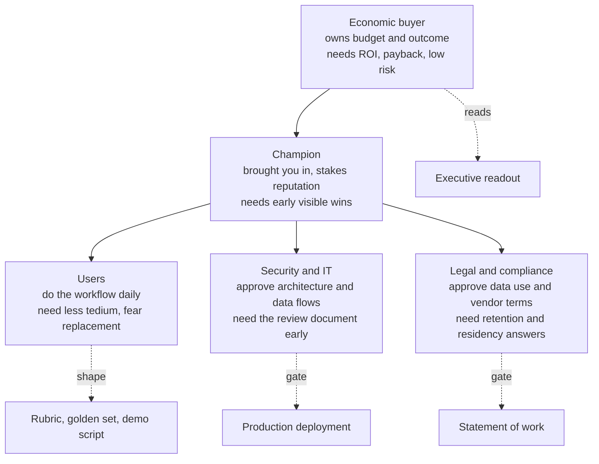
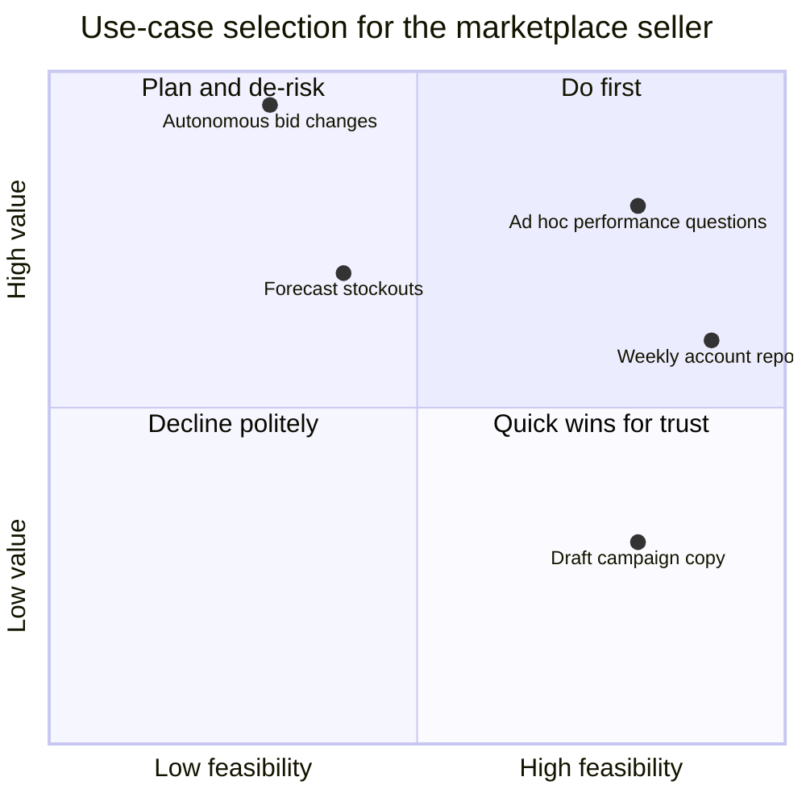
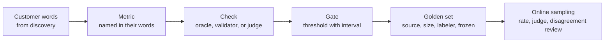
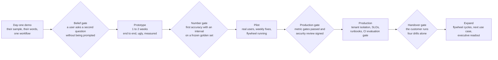
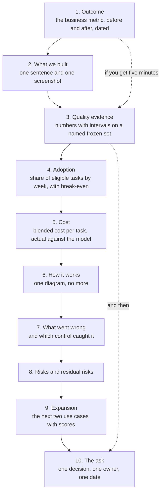

# Chapter 25: Engagements, from Discovery to Readout

> **What you will be able to do:** run a discovery that ends with the seven outputs written in the customer's words; score candidate use cases with weights you can defend and pick the first project; write an architecture options memo that makes three decisions; derive an evaluation plan and acceptance criteria from customer language; build an ROI model with a sensitivity table that survives a CFO; deliver the arc from day-one demo to handover and present a ten-slide executive readout.
>
> **Where it is used:** P5.1 (the engagement playbook), P5.2 (the capstone engagement), P5.3 (public artifacts and positioning). The templates in section 25.18 are the eight deliverables of P5.1.
>
> **Prerequisites:** Chapter 11 (bootstrap intervals and sample size), Chapter 13 (the serving cost model), Chapter 19 (the security review document), Chapter 20 (SLOs and postmortems), Chapter 21 (workflows versus agents). Everything else in this chapter stands alone.

## 25.0 The problem this chapter solves

A marketplace seller with forty million dollars of annual revenue asks for "AI for our advertising team". The account managers spend their mornings pulling campaign data into spreadsheets to answer questions from brand owners. The head of operations wants an agent that changes bids automatically. The CFO wants to know what it will cost and when it pays back. Security has not been told the project exists. Nobody has written down what a correct answer is.

Most technical people meet this situation and start building. Three months later a pilot exists, works on the demo data, and dies in procurement or in an argument about whether the answers are "good enough". The engineering was fine. The engagement was not. The stages that decide the outcome happen before the first line of code: discovery, scoring, the architecture decision, the agreed metric, the ROI model, the early security review, and the statement of work that names what "done" means.

This chapter is the method for those stages and for the stages after them: delivery, expectation management, change management, the executive readout, and the handover. It is the written form of what a forward deployed engineer (FDE) does that a research engineer or a platform engineer does not. The technical chapters give you the components. This chapter gives you the shape of the work into which the components go.

The chapter is built around one running example, synthetic and public, matching the capstone's Option A: an AI analyst and operations agent for a mid-market marketplace seller. Every table and every number in the ROI model uses that example, so the exercises can vary it.

## 25.1 What an FDE does, and the engagement lifecycle

An FDE sits between a customer's problem and a product's capabilities and closes the gap with engineering, in the customer's environment, on the customer's timeline. The job has three parts that a pure engineer or a pure consultant each does only one of: understanding the workflow well enough to change it, building the system that changes it, and carrying the organization through the change. The output is a deployed system that the customer keeps using and that improves after you leave.

The engagement lifecycle repeats across customers and domains. Seven stages, each with an exit condition and a different mix of stakeholders.



*Figure 25.1: The engagement lifecycle with the stages at which each stakeholder is present; the champion is present throughout.*

The exit conditions, in one line each. Discovery exits when the seven outputs of section 25.2 are written and corrected by the champion. The day-one demo exits when a user has seen their own data answer their own question. Scoping exits when the statement of work is signed. The prototype exits when the first numbers with intervals exist on a golden set built from real questions. The pilot exits when the production gate and the security review both pass. Production exits at handover. Expansion is the flywheel running and the next use case scored.

Two stages are where engagements are won or lost, and both are non-technical: discovery and scoping. The rest of this chapter spends most of its length there for that reason.

## 25.2 Discovery: outputs and interview technique

### The seven outputs

Discovery is done when you can write, in the customer's words, all seven of the following. If one is blank, discovery is not done, whatever the calendar says.

1. The business outcome and its measure. Not "better reporting" but "account managers answer brand questions the same day; today the median is two days".
2. The workflow as it happens today, step by step, with who does what, and where the minutes and the errors go.
3. Who decides, who champions, who can block, and who is qualified to judge output quality.
4. What data exists, who owns it, how it is accessed, how clean and how fresh it is, and what in it is sensitive.
5. What "correct" means for the output, in their words, with three examples of correct and three of wrong.
6. The constraints: security, residency, latency, budget, deadline, and any integration the output must land in.
7. The kill criteria: what would make them stop, and what would make them expand.

The output most often left blank is number 5. Everyone agrees the system should be "accurate" and nobody has said accurate at what, judged by whom, on which cases. Section 25.7 turns this output into the evaluation plan, which is why it cannot be skipped.

### Interview technique

Five rules, each with the failure it prevents.

**Ask open questions and follow the workflow, not your architecture.** "Show me how you answered the last question a brand asked you" beats "would retrieval over your reports help". The first produces a workflow with timings. The second produces polite agreement.

**Quantify pain when you hear it.** When a user says "that takes forever", ask how often it happens, how long it takes, and what it costs when it goes wrong. Write the three numbers down. They are the inputs to the ROI model in section 25.8 and they came from the customer, which is what makes the model defensible.

**Capture exact words.** The phrase a user uses for a task and for its quality bar becomes the name of the metric, the text of the rubric, and the script of the demo. "It should match what I would have pulled" is an oracle comparison. "It should not make things up" is a grounding check. Paraphrasing loses the meaning the customer will recognize.

**Ask what they tried before and why it failed.** A previous vendor, an internal script, a dashboard nobody opens. The answer tells you the real constraint, which is often adoption or data access, not model quality.

**Read back and ask what you got wrong.** End every conversation by restating what you heard in two minutes. People correct a summary far more readily than they volunteer a fact. The corrections are the most valuable minutes of the interview.

Forty-five minutes per interview, five to eight interviews across the stakeholder map, two to four pages of discovery document. Send the document to the champion for correction before scoring anything. Scoring on an uncorrected document scores your assumptions, not their workflow.

## 25.3 The stakeholder map and timing

Five roles appear in every enterprise engagement. Each needs something different from you and each is decisive at a different time.



*Figure 25.2: The stakeholder map; the champion connects the buyer to everyone else, and two of the five roles hold gates.*

The timing rule that most often decides an engagement: security and legal are brought in during scoping by good FDEs and during the pilot by everyone else. Late is how a working pilot dies in procurement. Security needs the architecture diagram, the data inventory, and the controls list, and all three can be drafted from the options memo (section 25.6) before any code exists. Legal needs the data-use terms, retention periods, residency, and the vendor's terms for any frontier API, and these are known at scoping. Send both documents in week two, not week ten.

The economic buyer appears three times: at the start to state the outcome, at the statement of work to fund it, and at the readout to decide the expansion. Every other contact goes through the champion. The champion's reputation is the asset you are spending, so the champion needs a visible win within the first two weeks, which is what the day-one demo is for.

Users decide adoption, and adoption decides the ROI. They are in the room during discovery, they shape the rubric, and they hold the feedback button in the pilot. A system users did not help define is a system users find reasons not to use.

## 25.4 Data readiness

A use case with wonderful value and no accessible data is not a first project. Assess five things before promising anything.

| Question | What to find out | Consequence if bad |
|---|---|---|
| Access | Who grants it, through what mechanism, and how many weeks it takes | The schedule starts at access, not at signature |
| Completeness and consistency | Missing fields, inconsistent identifiers, duplicated records, schema changes over time | Cleaning becomes the first deliverable and the ROI slips |
| Volume | Enough historical items for a golden set (hundreds) and enough daily traffic for a flywheel (tens per day) | No golden set means no gate; no traffic means no flywheel |
| Freshness | How current the data must be for the output to be useful, and how current it is | A daily batch cannot serve a question about this morning's campaign |
| Sensitivity | PII, PHI, financial, contractual; who may see it; where it may be processed | Determines API versus self-hosted and the redaction layer |

For the marketplace example: advertising and sales data live in a warehouse with a nightly load, identifiers are consistent, three years of history exist, about 150 brand questions arrive per week, and the sensitive fields are brand names and revenue. Readiness is high, freshness is one day, and the sensitive fields are handled by a redaction rule in the tracing layer and by the frontier vendor's terms on data retention. Write this as a table in the discovery document. It feeds the scoring in the next section directly.

## 25.5 Use-case scoring

Discovery produces more candidate use cases than you can build. Score them on five criteria, weight the criteria, and be ready to defend both the scores and the weights. The purpose of the exercise is not the number. It is that every stakeholder can see why the exciting use case is not first.

### The criteria and anchors

Score each criterion from 1 to 5 using anchors written before scoring, so that the scores are comparable across use cases and across the people scoring them.

| Criterion | Weight | Score 1 | Score 3 | Score 5 |
|---|---|---|---|---|
| Value | 0.30 | Under about $2,000 per month or unquantified | $2,000 to $10,000 per month | Over $10,000 per month, or a revenue or regulatory lever |
| Feasibility | 0.25 | A frontier model fails the quick test on most of 20 samples | Passes on most, fails on edge cases | Passes on nearly all 20 with a prompt alone |
| Data readiness | 0.20 | Data not accessible or not yet collected | Accessible within weeks, cleaning needed | Accessible now, clean enough, volume for a golden set |
| Risk | 0.15 | A wrong output moves money or affects a patient with no review step | A wrong output is caught by a reviewer before it takes effect | Read-only output; a wrong answer costs a re-run |
| Time to first demo | 0.10 | More than a month | One to two weeks | Days, on a data sample |

Risk is scored so that higher is safer, which keeps the weighted sum monotone: a higher total is always better. The feasibility score comes from a quick test, not from opinion: take twenty real items from discovery, run a frontier model with a careful prompt, and count. Twenty items give a rough signal only, and the score reflects that, but it is a signal and opinion is not.

### The weighted score

With weights $w_j$ summing to one and scores $s_{ij}$ for use case $i$ on criterion $j$:

$$
S_i = \sum_{j=1}^{5} w_j \, s_{ij}
$$

### Worked table

Three candidates from the marketplace discovery.

| Use case | Value (0.30) | Feasibility (0.25) | Data (0.20) | Risk (0.15) | Time (0.10) | Weighted score |
|---|---|---|---|---|---|---|
| Ad hoc performance questions in natural language, read-only | 4 | 4 | 5 | 4 | 5 | 1.20 + 1.00 + 1.00 + 0.60 + 0.50 = **4.30** |
| Automated weekly account report per brand | 3 | 5 | 5 | 4 | 4 | 0.90 + 1.25 + 1.00 + 0.60 + 0.40 = **4.15** |
| Autonomous bid changes from performance signals | 5 | 2 | 3 | 1 | 2 | 1.50 + 0.50 + 0.60 + 0.15 + 0.20 = **2.95** |

The autonomous agent scores highest on value and lowest overall. That is the usual shape. It becomes the third project, after the read-only analyst has built trust and the flywheel has produced the labeled outcomes that make bid recommendations evaluable.

### Weight sensitivity

A skeptical executive will ask whether the ranking depends on your weights. Show that it does not. Move the value weight to 0.50 and shrink the others to 0.15, 0.15, 0.10, 0.10. The scores become 4.25, 3.80, and 3.55. The order holds. If a ranking flips under a plausible reweighting, say so and present the two use cases as a choice for the buyer rather than a recommendation.



*Figure 25.3: Value against feasibility for five candidates; the first project comes from the top right, the exciting one from the top left waits.*

## 25.6 The architecture options memo

The memo makes three decisions and recommends one architecture. It is two pages, and its purpose is a decision, not a survey. Each decision has a framework in the roadmap or in an earlier chapter; the memo restates the framework in one paragraph and applies it.

### Decision 1: prompt, retrieval, or fine-tuning

Start with a frontier model and a careful prompt. If quality is sufficient and the task needs private, fresh, or large knowledge, add retrieval with grounding and citations, and fine-tune the embeddings only if recall is the measured problem (Chapter 9). If a quality gap remains and it is a matter of style, format, or narrow-domain behavior, fine-tune a small model with LoRA on one to twenty thousand examples and always measure against the frontier baseline (Chapter 7). If the gap is reasoning on a verifiable task, follow supervised fine-tuning with preference optimization or GRPO against a verifiable reward (Chapter 8). Knowledge does not go into weights through fine-tuning; format and behavior do.

For the marketplace analyst: the schema is fixed and the questions are narrow, so the decision is a prompt with schema context first, retrieval over the catalog of metrics and prior queries second, and a fine-tuned 1.5B text-to-SQL model behind the gateway once the golden set shows where the frontier model fails and the volume justifies the work.

### Decision 2: API or self-hosted

The drivers are volume, residency, and latency. Under about one million tokens per day with no residency constraint, use the frontier API with prompt caching and invest in evaluation and the flywheel. At high volume on a narrow task with quality proven, distill or fine-tune a small model, serve it with vLLM, and route hard cases to the frontier. Under strict residency, self-host an open-weight model on the customer's Kubernetes. The break-even model from Chapter 13 puts numbers on the first two: cost per million tokens self-hosted is the GPU hourly price divided by tokens per hour at the achieved utilization, and the crossover moves fivefold when utilization moves from 20 to 100 percent.

For the marketplace analyst at about 650 tasks per month and about 12,000 tokens per task, the volume is about 260,000 tokens per day, well under the threshold. The recommendation is the API through a gateway, with the fine-tuned small model added as a routing target only if the volume grows or the per-task cost becomes material.

### Decision 3: workflow or agent

A workflow is a system where code decides the sequence of model calls and tool uses. An agent is a system where the model decides. Ask four questions: is the task multi-step and hard to specify in advance; does the outcome justify higher cost and latency; is the model capable at this task type; can errors be caught and recovered. A "no" to any of them means a workflow (Chapter 21). Most business problems are workflows wearing an agent costume.

For the analyst: a routing workflow (classify the question, generate SQL, validate, execute, summarize with the numbers cited) answers every question in scope. The bid-change use case is the one that would justify an agent, and it is third in the queue.

### The memo's shape

Present two or three viable architectures side by side with a row each for cost per month, largest risk, and time to pilot, then recommend one with the reasons a skeptical engineer would accept. Draw the chosen architecture as one diagram. The security review's architecture section is this diagram, which is why the memo is what unblocks security in week two.

## 25.7 Success metrics and the evaluation plan

The evaluation plan translates discovery output number 5, "what correct means", into metrics, a golden set, gates, and a review process. It is agreed before building. A pilot without an agreed metric ends in an argument about vibes, and the side with the demo loses that argument to the side with the first visible mistake.



*Figure 25.4: Each customer phrase becomes a metric, a check, a gate, a golden set requirement, and an online sampling rule.*

### Derivation table for the marketplace analyst

| Customer's words | Metric | Check | Pilot gate | Production gate |
|---|---|---|---|---|
| "It should match what I would have pulled" | Execution accuracy | Result set of generated SQL equals result set of the analyst's SQL on the same question | At least 80 percent, lower bound of the 95 percent interval at or above 75 | At least 85 percent, lower bound at or above 80 |
| "It should not make things up" | Grounding rate | Every number in the answer traces to a cell in the query result; judge checks the prose against the table | Ungrounded rate at most 3 percent | At most 2 percent |
| "It should know when to ask" | Clarification behavior | On a labeled ambiguous subset, asks a question; on a clear subset, does not | Asks on at least 70 percent of ambiguous items, false clarification at most 15 percent on clear items | 80 and 10 percent |
| "Fast enough to use in a brand call" | Latency | p95 end to end including SQL execution | Under 12 seconds | Under 8 seconds |
| "It must never change anything" | Write safety | Structural validator allows only SELECT; every attempted write is blocked and logged | 100 percent blocked on the red-team set | 100 percent, plus an alert |

### The golden set and its size

The golden set comes from real questions asked during discovery and the first pilot weeks, anonymized, labeled by the two most senior account managers, frozen at a version, and stratified by question type. Its size follows from the gate. To state execution accuracy near 85 percent with a 95 percent interval of half-width $E = 0.04$ (Chapter 11):

$$
n = \frac{z^2 \, p (1-p)}{E^2} = \frac{1.96^2 \times 0.85 \times 0.15}{0.04^2} \approx 306
$$

A 300-item golden set is therefore the right order. On 300 items an observed 87 percent has a standard error of $\sqrt{0.87 \times 0.13 / 300} \approx 0.019$, so the interval is about 83 to 91 percent and the production gate's lower bound of 80 is cleared. With 100 items the same observation gives about 80 to 94, and the gate is not cleared even though the point estimate is the same. This is the argument for the set size, and it is the argument you make when the champion asks why labeling 300 questions is worth the analysts' time.

Comparisons between two versions of the system use the paired bootstrap on the same items (Chapter 11). Online quality is sampled: at 150 questions per week, judge 30 percent with a calibrated judge, route every disagreement between judge and user feedback to a weekly ten-minute review with one named analyst, and report the judged rate with its interval in the weekly status.

## 25.8 The ROI model

The ROI model turns discovery's quantified pain into monthly benefit, sets it against monthly and one-time cost, and reports net benefit, payback, and a sensitivity table. Conservative models that survive scrutiny beat optimistic models that get challenged in the readout. Every input is a number the customer gave you or a price you can cite.

### Formulas

Symbols: $a$ is adoption, the fraction of eligible tasks that go through the system; $T$ is eligible tasks per month; $h$ is hours saved per task; $c$ is the loaded hourly cost of the person doing the task; $e_0$ and $e_1$ are the error rates per task before and after; $C_e$ is the average cost of one error; $R$ is any revenue effect, stated conservatively and usually zero in the base case.

Monthly benefit:

$$
B = \underbrace{a \, T \, h \, c}_{\text{hours saved}} + \underbrace{a \, T \, (e_0 - e_1) \, C_e}_{\text{errors avoided}} + R
$$

Monthly cost, with $q$ the blended model cost per task from the gateway's cost metrics (Chapter 16), $C_{infra}$ hosting and tooling, $C_{people}$ your maintenance time, and $C_{review}$ the customer's flywheel review time:

$$
C_{month} = a \, T \, q + C_{infra} + C_{people} + C_{review}
$$

Net monthly benefit and payback on one-time cost $C_0$ (delivery through pilot, plus the customer's discovery and labeling time):

$$
N = B - C_{month}, \qquad P = \frac{C_0}{N} \text{ months}
$$

Break-even adoption, the smallest $a$ at which $N \geq 0$:

$$
a^{*} = \frac{C_{infra} + C_{people} + C_{review}}{T \left( h c + (e_0 - e_1) C_e - q \right)}
$$

### Worked example

Inputs from the marketplace discovery. Six account managers each answer about 25 brand questions per week, so $T = 6 \times 25 \times 4.33 \approx 650$ tasks per month. Today a question takes about 20 minutes of data pulling; with the analyst and a review of the answer it takes about 5, so $h = 0.25$ hours. Loaded cost $c = \$60$ per hour. About 3 percent of manual pulls contain an error that leads to a wrong bid or a wrong brand conversation, average cost $C_e = \$400$ to detect and correct; with the validator and the review step the estimate is $e_1 = 0.015$. Revenue effects from faster answers are plausible and excluded: $R = 0$.

Costs. Blended model cost per task through the gateway with caching, $q = \$0.06$. Infrastructure (gateway, tracing, vector store, hosting) $C_{infra} = \$400$ per month. Maintenance ten hours per month at $150, $C_{people} = \$1{,}500$. One analyst reviewing the flywheel queue four hours per week, $C_{review} = 4 \times 4.33 \times 60 \approx \$1{,}040$. One-time cost: eight weeks of delivery at twenty hours per week at $150 is $24,000, plus about sixty hours of customer time for discovery, labeling 300 golden items, and pilot feedback at $60, which is $3,600, so $C_0 \approx \$27{,}600$.

At full adoption, $a = 1$:

$$
B = 650 \times 0.25 \times 60 + 650 \times 0.015 \times 400 = 9{,}750 + 3{,}900 = \$13{,}650
$$

$$
C_{month} = 650 \times 0.06 + 400 + 1{,}500 + 1{,}040 = 39 + 2{,}940 = \$2{,}979
$$

$$
N = 13{,}650 - 2{,}979 = \$10{,}671, \qquad P = \frac{27{,}600}{10{,}671} \approx 2.6 \text{ months}
$$

The model cost is about one percent of the monthly cost. This is the usual result at this volume and it is worth saying aloud: the bill is people, not tokens, and the API-versus-self-hosted decision in the memo is confirmed by it.

### Sensitivity table

Net monthly benefit in dollars and payback in months, varying adoption and hours saved per task, everything else fixed.

| Adoption $a$ | $h = 0.15$ h (pessimistic) | $h = 0.25$ h (expected) | $h = 0.30$ h (optimistic) |
|---|---|---|---|
| 0.50 | $1,916, payback 14.4 | $3,866, payback 7.1 | $4,841, payback 5.7 |
| 0.75 | $4,343, payback 6.4 | $7,268, payback 3.8 | $8,731, payback 3.2 |
| 1.00 | $6,771, payback 4.1 | $10,671, payback 2.6 | $12,621, payback 2.2 |

Break-even adoption at the pessimistic time saving:

$$
a^{*} = \frac{2{,}940}{650 \, (0.15 \times 60 + 0.015 \times 400 - 0.06)} = \frac{2{,}940}{650 \times 14.94} \approx 0.30
$$

Below about 30 percent adoption at the pessimistic saving the project loses money every month. That sentence goes in the readout, because it tells the buyer what the champion must deliver (adoption) and it tells you what to measure weekly. A model that shows only the expected case invites the question "and if adoption is half?", and a model that has already answered it is believed.

## 25.9 The risk register and the early security review

### The register

A risk register is a table with one row per risk, and no row without a named owner and a date. Its purpose is not to predict the future. It is to move risks from your head, where they produce anxiety, into a document, where they produce assignments.

Score likelihood $L$ and impact $I$ from 1 to 5 and take exposure $E = L \times I$, which ranges from 1 to 25. Two thresholds turn the score into behavior: a risk at $E \geq 12$ gets a line in the weekly status until it drops, and a risk at $E \geq 16$ must have a mitigation with a deadline before the next stage gate. The thresholds are arbitrary in the same way a p-value threshold is arbitrary. Their value is that they are fixed in advance, so that a risk is escalated by its score rather than by whoever is loudest.

Sweep eight categories so that you do not miss one: access and data, quality, integration, security, legal and procurement, adoption, cost, and people and schedule.

| Risk | Category | L | I | E | Mitigation | Owner | Trigger |
|---|---|---|---|---|---|---|---|
| Warehouse access not granted in time | Access | 4 | 4 | 16 | Access request filed in week 1 with a named approver; sanitized extract as a fallback | Champion | No credentials by end of week 2 |
| Execution accuracy below the 80 percent pilot gate | Quality | 3 | 5 | 15 | Golden set built in week 2, error taxonomy reviewed weekly, frontier route as fallback | You | Two consecutive weeks below 78 percent |
| Adoption below the 30 percent break-even | Adoption | 3 | 4 | 12 | Users co-write the rubric, feedback loop closed publicly, weekly usage per user | Champion | Week 4 usage under 25 percent |
| Golden set labeling slips | People | 4 | 3 | 12 | 300 items split across two analysts, two hours a week for three weeks, booked in calendars | Champion | Fewer than 100 items by end of week 3 |
| Security finds brand revenue leaving the tenant unacceptably | Security | 2 | 5 | 10 | Review document sent in week 2, redaction before tracing, vendor retention terms confirmed | Security lead | Any finding rated high |
| Warehouse schema changes break generated SQL | Integration | 3 | 3 | 9 | Catalog regenerated nightly, contract test on a schema hash, alert on failure | You | Schema hash mismatch |
| Blended cost per task exceeds the model | Cost | 2 | 2 | 4 | Per-tenant budget cap at the gateway, semantic cache, weekly cost report | You | Cost per task above 0.12 dollars |

Four rules keep a register alive. Every risk has one named person, never a team, because a team cannot be asked on Friday how it went. Every risk has a trigger, the observable event that means the risk has occurred, so that the register is checkable rather than a matter of opinion. Every mitigation is an action with a date, not an intention. And a risk that falls below the threshold stays in the register with its status set to closed and the date, so that nobody rediscovers it in month three and argues it was never considered.

### The early security review

Chapter 19, section 19.8 gives the seven sections a customer's security team asks for. Three of them can be written before any code exists, from the architecture options memo of section 25.6: the architecture and data flows, the data inventory, and the controls list. That is the whole reason the memo is worth writing well. Draft those three in week two, send them, and ask for a forty-five minute walkthrough rather than an email thread, because a document read alone generates questions and a document walked through generates a decision.

Security asks three questions first, in this order. Where does our data go, including every third party. Who can see it, including your own team. What happens when the system is wrong. The data inventory answers the first two. The controls list, the validator, the approval path, and the rollback plan answer the third.

The timing argument is the whole point of this section. A security review is calendar time, not work time, because it involves people whose queue you do not control. Started in week two it runs in parallel with building and costs the schedule nothing. Started in week ten it is the critical path, and a pilot that works technically waits behind it. This single sequencing decision has killed more working pilots than any model quality problem.

Confirm the frontier vendor's current data retention and training terms in writing, and record the date you confirmed them, because those terms change. Do not paraphrase them from memory into a customer document.

## 25.10 The statement of work and acceptance criteria

### What it contains

Eight parts, in this order: scope and objectives in one paragraph; phases with deliverables; acceptance criteria per deliverable; assumptions; explicit exclusions; schedule and milestones; change control; and commercial terms with sign-off. The parts that matter technically are the criteria, the assumptions, and the exclusions, and those three are yours to write because you are the only person who knows what can be measured.

### Acceptance criteria that can be measured

A criterion passes three tests. It can be computed without a meeting, which means the metric, the item population, and the procedure are all named. It refers to a frozen, versioned artifact, so that the set cannot drift toward whichever items the system happens to pass. And it carries an interval rather than a point estimate, because a point estimate on a finite sample is not a fact about the system.

A criterion that fails all three: "The assistant will answer questions accurately and quickly."

The same criterion rewritten:

> On golden set v1.0, 300 items frozen on 3 November 2026 and stratified as 40 percent single-table lookups, 40 percent multi-table aggregations, and 20 percent ambiguous questions, the system achieves execution accuracy of at least 85 percent with the lower bound of a 95 percent bootstrap interval at or above 80 percent; p95 end-to-end latency under 8 seconds measured over the final two weeks of pilot traffic; and zero successful write statements on the 120-item red-team set. Measured by the evaluation report, run by the forward deployed engineer, reviewed by the named senior analyst, on the last Friday of the pilot.

Every number in that paragraph came from section 25.7, which came from discovery output number 5, which came from a sentence a user said. That chain is what makes the criterion defensible when it is tight and negotiable when it is not.

One trap: a criterion stated over an item population you control invites narrowing the population until you pass. Name the population and its strata in the criterion, and freeze it at a version, so that the only way to move the number is to improve the system.

### Assumptions as a ledger

Assumptions are the customer's obligations. Each one gets an owner, a date, and a stated consequence, and the consequence is normally that the schedule moves day for day. The marketplace engagement's ledger: warehouse read access by 10 November; a named senior analyst available two hours per week for labeling through 1 December; a named approver for write actions before the pilot; the security review walkthrough scheduled within ten business days of the document being sent. Write them down at signature, and restate any that slip in the weekly status the week they slip, not the week they hurt.

### Exclusions

Write down what you are not doing, especially the things a reasonable person might assume you are. For the marketplace analyst: no writes to the advertising platform in this phase; no data cleaning beyond what the pilot questions need; no mobile application; no integration with the customer's ticketing system; no support outside business hours; no retraining after handover without a separate agreement. An exclusion list is not defensive. It is the cheapest way to discover, before signature, that the buyer expected something you had not heard.

### Change control

One paragraph: changes are requested in writing, priced in hours and schedule impact, and approved by the economic buyer before work starts. Without it, scope grows by a deliverable a week, each one reasonable on its own, and the acceptance criteria you signed become unreachable inside the hours you sold.

## 25.11 The weekly status

One page, the same shape every week, sent on the same day. Stakeholders learn where to look, and a fixed format makes a change visible: when the numbers section moves, everyone sees it moved, because it is always in the same place.

Six blocks. A headline of one sentence with a status of green, amber, or red. Done this week, as outcomes not activities. Planned next week. The numbers, always the same three or four metrics, each with its sample size, interval, and date. Risks and blockers, only those at or above the exposure threshold, each with an owner and a date. Decisions made and asks, each ask carrying a name and a date or it is not an ask.

Three rules. Never change a number quietly: if accuracy moved from 84 to 81 percent, the headline says so and the next line says what you are doing about it. A blocker that appears three weeks running goes to the economic buyer, because three weeks of the same blocker means the champion cannot clear it. And write the status even in a week where nothing went well, because the weeks you skip are the weeks people assume the worst.

A week-four example for the marketplace engagement, compressed:

> **Amber.** Execution accuracy is at 81 percent against the 80 percent pilot gate, and labeling is two weeks behind.
> **Done:** SQL validator blocking all non-SELECT statements, 118 of 300 golden items labeled, day-one demo shown to four account managers.
> **Next:** finish labeling, error taxonomy over the 57 current failures, add the catalog resource.
> **Numbers:** execution accuracy 81 percent, 95 percent interval 74 to 88, n equals 118, measured 27 November. Ungrounded rate 2.1 percent, n equals 118. p95 latency 11.4 seconds. Adoption 33 percent of eligible questions, week 4.
> **Risks:** labeling slippage, exposure 12, owner the champion, two analysts booked for Tuesday. Accuracy below gate, exposure 15, owner me, taxonomy Thursday.
> **Asks:** confirm the named write approver by 4 December (economic buyer).

## 25.12 The delivery arc



*Figure 25.5: The delivery arc as five stages separated by four gates, each gate checking evidence rather than opinion.*

| Stage | Typical length | Exit gate | Evidence | Who signs |
|---|---|---|---|---|
| Day-one demo | Hours, using the demo kit of Chapter 24 | A user asks a second question unprompted | A recording and the questions they asked | Champion |
| Prototype | 1 to 2 weeks | First accuracy number with an interval | Evaluation report on a frozen golden set | You and the named analyst |
| Pilot | 4 to 8 weeks | Pilot gates met, security review signed | Evaluation report, adoption chart, security sign-off | Champion and security lead |
| Production | 1 to 3 weeks | SLOs defined and met over a bake period, runbooks written | Dashboards, incident log, deployment from clean clone | Economic buyer and IT |
| Handover | 1 week plus a 30-day check-in | Four drills performed by the customer alone | Drill results, named owners, calendar entries | Customer engineering lead |

The day-one demo deserves its own paragraph because it is the stage most people skip and the one that changes the conversation. It runs on a sample of their data, uses their vocabulary, covers exactly one workflow they recognize, and is built in under an hour with the demo kit. Its purpose is not to prove capability. It is to move the discussion from "could this work" to "what else could it do", and it does that only if the data on screen is theirs. Show one failure during the demo on purpose, with the mechanism that caught it. An audience that has seen a failure handled well stops hunting for one.

The prototype is deliberately ugly. Its deliverable is a number, not an interface. If you spend prototype time on the interface, you arrive at the pilot with a beautiful system and no evidence, and the first argument about quality has no data in it.

The pilot is where the flywheel of Chapter 17 starts, not after production. Traces, feedback, and the review queue must exist during the pilot, because the pilot is the only period in which you are present to teach the customer how to run them.

## 25.13 Expectation management for probabilistic systems

### Say it early, in numbers

Say from the first meeting that the system is probabilistic, that quality is measured on a sample with a confidence interval, and that it will be wrong sometimes. Then translate the percentage into their unit. "85 percent execution accuracy" means nothing to an account manager. "About three of every twenty answers will be wrong in a way you will notice, and here is how you will notice" means something, and it is the same fact.

The reason to do this in week one rather than week ten is asymmetric. An executive who has seen the interval and the rollback plan treats the first mistake as expected behavior. An executive who has seen only a demo treats the first mistake as evidence that the system does not work. The mistake is identical. The framing was set months earlier.

### The three numbers rule

Every quality claim you make, in a slide, a status, or a sentence, carries three things: the sample size, the interval, and the date. A number without them is a rumor that will be quoted back to you in a procurement meeting with its context removed.

### Compounding across steps

Chain accuracy is the fact that surprises customers most. If a workflow has five steps and each step is correct with probability 0.95 independently, the end-to-end success is $0.95^5 = 0.774$. Roughly one task in four fails somewhere. To reach 0.90 end to end, each step must reach $0.90^{1/5} \approx 0.979$.

Two responses, and the second is almost always cheaper. Shorten the chain: three steps at 0.95 gives $0.857$. Or put a deterministic validator after the weakest step so that its errors are caught rather than propagated: if a validator catches 80 percent of step two's errors, that step's effective success becomes $1 - 0.05 \times 0.2 = 0.99$ and the chain becomes $0.95^4 \times 0.99 \approx 0.806$. Validators on every step at the same catch rate give $0.99^5 \approx 0.951$. This arithmetic is the honest answer to "why can't it just do the whole thing", and it is also the argument for the workflow-with-gates architecture of section 25.6.

### The demo-to-pilot drop

A demo runs on questions you chose. A pilot runs on questions users ask. The gap between them is a selection effect, not a regression, and it will be read as a regression unless you say so first.

Quantify it. Nineteen correct answers out of twenty demo questions is 95 percent, and the standard error of that estimate is $\sqrt{0.95 \times 0.05 / 20} \approx 0.049$, so the 95 percent interval runs from about 85 percent to 100 percent. Twenty items cannot distinguish a 95 percent system from an 85 percent one. Say that during the demo, name the golden set that will settle it, and the later number lands as a measurement rather than a disappointment.

### Show the catching mechanisms

Pair every admission of error with the control that catches it: the structural validator that blocks writes (Chapter 19), the grounding check on every number in the answer, the approval step on consequential actions (Chapter 21), the canary and rollback (Chapter 17), and the flywheel that turns a reported failure into a golden-set item and a fix. Customers do not require systems that are never wrong. They require systems whose errors are bounded, visible, and reversible.

## 25.14 Change management and adoption

Adoption is the variable $a$ in the ROI model, and section 25.8 showed the break-even at about 30 percent under pessimistic time savings. That makes adoption a number you track weekly, with the break-even drawn on the chart, not a soft concern raised at the end.

Define it precisely before the pilot: eligible tasks per week from the discovery workflow, tasks that went through the system, distinct users active in the week out of eligible users, and the fraction of users who return in their second week. The last one is the earliest honest signal. A user who tries the system once and does not return has told you something that a satisfaction survey will not.

The marketplace pilot's weekly adoption, out of 150 eligible questions per week: 22 in week 1 (15 percent), 38 in week 2 (25 percent), 49 in week 3 (33 percent), 61 in week 4 (41 percent), 82 in week 6 (55 percent), 104 in week 8 (69 percent). Break-even was crossed in week 3. The curve then flattened at 69 percent because two of the six account managers were not using it at all, which is a conversation with two named people, not a feature request.

Five levers, in the order they pay off.

**Involve users in the rubric.** A person who helped define what correct means will argue with an answer rather than abandon the system, and arguing is the behavior you want, because it produces labeled data.

**Close the feedback loop visibly.** The feedback button is worth nothing unless the user sees that pressing it changed something. Report it: of 34 negative ratings in the first month, 21 became golden-set items and 14 of those were fixed in the week-six release. Put that sentence in the weekly status. Adoption responds to it faster than to any model improvement.

**Train champions who train others.** Peer instruction beats vendor instruction. Pick one user per team, give them thirty minutes of your time a week, and let them run the team's questions.

**Keep the human in the loop on consequential actions until the data says otherwise.** Removing an approval step before the audit data justifies it saves seconds and costs trust, and trust is the slower thing to rebuild.

**Do not remove the old path before the new one clears its gate.** Forcing adoption ahead of quality converts a quality problem into a political problem.

Two smaller points that matter more than they should. Name the system after the task it does, not after the technology, because a name with "AI" in it invites a conversation about AI rather than about brand questions. And answer the replacement fear directly and specifically: name the task the system takes over and the tasks it does not, in the user's words, in the first meeting. Evasion on this point is read correctly as bad news.

## 25.15 The executive readout

Ten slides, leading with the answer. The structure exists because executives read the first slide and the last, and a technical narrative that builds to a conclusion loses them before the conclusion.



*Figure 25.6: The ten-slide readout; if the meeting collapses to five minutes, slides 1, 3, and 10 are the meeting.*

The marketplace readout after an eight-week pilot, with the numbers that go on each slide. Slide 1: median time to answer a brand question fell from two days to the same day, measured over weeks 5 to 8. Slide 3: execution accuracy 87 percent, 95 percent interval 83 to 91, on golden set v1.0 of 300 items, measured 18 December; ungrounded rate 1.8 percent; zero successful writes on the 120-item red-team set. Slide 4: 104 of 150 eligible questions per week in week 8, 69 percent, against a 30 percent break-even. Slide 5: blended 0.06 dollars per task, 27 dollars of model spend in the last month, against a modeled 39 dollars at full adoption. Slide 7: two incidents, one schema change that broke 14 queries for three hours and was caught by the contract test, one ungrounded total that a user reported and that became golden-set item 301.

Slide 5 also carries the realized ROI. At 69 percent adoption and the expected time saving, monthly benefit is $0.69 \times 13{,}650 = 9{,}419$ dollars, monthly cost is $0.69 \times 650 \times 0.06 + 2{,}940 = 2{,}967$ dollars, net is about 6,452 dollars, and payback on the 27,600 dollar one-time cost is about 4.3 months against the 2.6 months modeled at full adoption. Present both, and say which assumption moved. An ROI restated honestly at the readout is worth more than the original model, because it demonstrates that you will restate it again next quarter.

Slide 7 is the slide people want to cut. Keep it. It is the slide that makes slides 3 and 5 believable, and an executive who learns about an incident from you in a readout is in a different state of mind than one who learns about it from a user in a hallway.

The ask on slide 10 is exactly one decision, with the person who makes it and the date by which it is needed. "Approve the second use case, the weekly brand report, to start 12 January, decision needed by 20 December, owner the VP of operations." Three asks is no ask.

Everything else goes in an appendix that you do not present: the method, the full metric table, the architecture detail, the security review, the cost model spreadsheet. Rehearse the ten slides to under fifteen minutes so that half the meeting is discussion.

## 25.16 Handover

Handover is a deliverable with an acceptance test, not an email with links. What it leaves behind: runbooks and the on-call guide (Chapter 20), the infrastructure code and CI pipeline with the evaluation gate (Chapter 15), the evaluation suite with frozen golden sets and the labeling protocol (Chapter 11), the flywheel review queue with a named owner and a recurring calendar slot (Chapter 17), the model registry with its champion and challenger aliases and lineage, the architecture and security documents, the decision log with the reason for each decision, and a recorded training session.

The acceptance test is four drills, run by the customer's engineer with you in the room and not typing.

1. Deploy from a clean clone of the repository into the development environment, and reach a working endpoint. The roadmap's capstone target is under thirty minutes.
2. Run the evaluation suite against the deployed endpoint and read the report, including the intervals and which items flipped.
3. Promote a challenger to champion, then roll it back.
4. Take a user complaint, find the trace, identify the failing step, and add the item to the next golden set version.

Failure of each drill tells you something different. Drill 1 failing means the deployment depends on something in your head or your laptop. Drill 2 failing means the evaluation is your tool, not theirs. Drill 3 failing means they cannot recover from a bad model and will therefore never ship one. Drill 4 failing means the flywheel stops the day you leave.

The measure of a good handover is that the system improves after you leave. Check it at the thirty-day call with three questions that have factual answers: has the golden set grown with items the customer added, has the flywheel completed a cycle without you, and is every alert owned by a person who knows they own it. Book that call before you leave, because it will not be booked after.

## 25.17 Positioning yourself

The engagement skill is invisible unless you make artifacts from it. Four kinds, in decreasing order of how much they compound.

**Write-ups.** One per phase, in a fixed structure: the question you were answering, what you built, the numbers with intervals and dates, what surprised you, and what you would tell a customer. Put the results table in the first screen, the same way the project READMEs do. Titles that make a claim outperform titles that describe a topic, because a claim can be agreed or disagreed with and a topic cannot. Write only claims your definition of done supports. A number published without an interval is the fastest way to lose a technical reader, and the second fastest is a number without a date.

**A maintained toolkit.** Repositories that other people can use and that you keep working are evidence of engineering judgment that a resume cannot carry: evalkit from P1.6, the demo kit from P4.4, the MCP server from P4.2, the playbook from P5.1. Maintained means issues triaged, a release tag, a README whose first screen is a results table, and tests that run. One maintained repository beats five abandoned ones, and a reader can tell the difference in thirty seconds.

**A talk.** The capstone readout with the technical depth added back and the customer specifics removed. A meetup or an internal session is enough. A talk forces the compression that makes the story usable in an interview.

**A story bank.** Twelve stories in situation, task, action, result form, each mapped to one competency and each containing a number. Draft them from the weekly log, because the numbers are already there and memory will not supply them later. Cover at least: an ambiguous request you scoped, a quality bar you had to negotiate, a system you had to make safe, a number you had to correct in public, a stakeholder conflict, a deadline you hit by cutting scope, a production incident, and a handover.

FDE interview loops commonly have four components, though the mix varies by company, so verify against the specific process. A system design exercise for a described customer, which tests whether you ask about data, constraints, and the definition of correct before drawing boxes. A take-home or live coding task, which tests ordinary engineering under time pressure. A customer role-play, usually a discovery conversation or a difficult stakeholder, which tests whether you can resist answering a question that has not been asked. And behavioral questions about ambiguity, conflict, and shipping, which is where the story bank is spent. The role-play is the component technical candidates underprepare for, and it is the one this chapter is practice for: run the discovery, quantify the pain, read back what you heard, and do not propose an architecture in the first fifteen minutes.

## 25.18 Implementation notes: the template skeletons

Nine skeletons follow. They cover the template deliverables of P5.1, which counts the risk register with the security review, and groups the statement of work, the weekly status, and the readout skeleton; the remaining P5.1 deliverable is the mock discovery, which exercises the first skeleton. Copy them into the playbook repository, fill one per engagement, and revise the skeleton itself afterward with whatever you found yourself writing by hand. Two rules for all nine. Keep them in the repository as Markdown so that they diff, rather than in a slide deck where changes are invisible. And keep the customer-specific instance in the customer's own repository, not in yours, so that the handover includes the reasoning and not only the code.

**Template 25.1: Discovery question bank.** Grouped by the seven outputs of section 25.2, with follow-ups.

```markdown
# Discovery question bank

## 1. Outcome and its measure
- What would be different in six months if this works?
- How do you measure that today, and what is the number now?

## 2. The workflow today
- Walk me through the last time you did this. What did you open first?
- Where do the minutes go? What step do you dread?
- What happens when it goes wrong? How often, and what does it cost?

## 3. People
- Who decides? Who pays? Who can stop this?
- Who is qualified to judge whether an answer is right?

## 4. Data
- Where does it live, who owns it, how do I get access, how long does that take?
- How fresh is it? What is missing or inconsistent?
- What in it is sensitive, and where may it be processed?

## 5. What correct means
- Show me three answers that are right and three that are wrong.
- What would make you stop trusting it?

## 6. Constraints
- Security, residency, latency, budget, deadline, where the output must land.

## 7. Kill criteria
- What would make you stop this project? What would make you expand it?
- What have you tried before, and why did it not stick?
```

**Template 25.2: Use-case scoring sheet.** Anchors are written before any scoring.

```markdown
# Use-case scoring

## Weights (set before scoring, recorded with the date)
Value 0.30, Feasibility 0.25, Data readiness 0.20, Risk 0.15, Time to demo 0.10

## Anchors
One to two sentences for scores 1, 3, and 5 on each criterion.

## Feasibility quick test
20 real items, one careful prompt, a frontier model, count correct.
Record the date, the model, the prompt, and the raw count.

## Scores
| Use case | Value | Feasibility | Data | Risk | Time | Weighted |

## Sensitivity
Recompute with value weighted 0.50. If the ranking flips, present the top two
as a choice for the buyer rather than a recommendation.

## Recommendation
One use case, three sentences, with the reason the higher-value one is not first.
```

**Template 25.3: Architecture options memo.** Two pages, three decisions, one recommendation.

```markdown
# Architecture options memo

## The problem in one paragraph, in their words

## Decision 1: prompt, retrieval, or fine-tuning
Framework in one paragraph, then the choice and why.

## Decision 2: API or self-hosted
Volume, residency, latency. The break-even calculation with its inputs.

## Decision 3: workflow or agent
The four questions, answered.

## Options
| | Option A | Option B | Option C |
| Cost per month | | | |
| Largest risk | | | |
| Time to pilot | | | |

## Recommendation, with the reasons a skeptical engineer would accept

## The chosen architecture as one diagram
(this diagram becomes section 1 of the security review)

## What would change this decision
```

**Template 25.4: Evaluation plan.** Derived from customer language, agreed before building.

```markdown
# Evaluation plan

## Derivation
| Customer's words | Metric | Check | Pilot gate | Production gate |

## Golden set
Source, anonymization, labelers by name, strata and proportions, size with the
sample-size calculation, version, freeze date, storage location.

## Statistics
Bootstrap intervals everywhere, paired bootstrap between versions, per-stratum reporting.

## Online sampling
Judge sampling rate, judge calibration against human labels with kappa,
who reviews disagreements, on what day, for how long.

## Reporting
Where the numbers appear (weekly status, CI comment, dashboard) and who reads them.
```

**Template 25.5: ROI model.** A spreadsheet with three tabs; every input cites its source.

```markdown
# ROI model

## Inputs (one row per input: value, unit, source, date, who said it)
Eligible tasks per month T; hours saved per task h; loaded hourly cost c;
error rates e0 and e1; cost per error Ce; revenue effect R (default 0);
blended model cost per task q; infrastructure, maintenance, and review costs;
one-time delivery cost C0; adoption a.

## Outputs
Monthly benefit B, monthly cost C, net N, payback P, break-even adoption a*.

## Sensitivity
Net and payback over adoption {0.5, 0.75, 1.0} by hours saved
{pessimistic, expected, optimistic}, plus break-even adoption at the pessimistic case.

## For the readout
One sentence naming the break-even adoption and what must happen to clear it.
```

**Template 25.6: Risk register and security review index.**

```markdown
# Risk register
| # | Risk | Category | L | I | E | Mitigation | Owner | Trigger | Review date | Status |

Categories swept: access and data, quality, integration, security, legal and
procurement, adoption, cost, people and schedule. Escalation: E >= 12 appears in
the weekly status; E >= 16 needs a dated mitigation before the next stage gate.

# Security review (sections per Chapter 19)
1. Architecture and data flows      (draft in week 2 from the options memo)
2. Data inventory                   (draft in week 2)
3. Controls mapped to a framework   (draft in week 2, numbers added at pilot)
4. Authentication and authorization
5. Testing evidence
6. Incident response
7. Residual risks
Sent on: ____   Walkthrough held on: ____   Findings closed on: ____
```

**Template 25.7: Statement of work.**

```markdown
# Statement of work

## 1. Scope and objectives (one paragraph)
## 2. Phases and deliverables (one row per deliverable, with a date)
## 3. Acceptance criteria
   One per deliverable, naming the metric, the frozen item population and its
   version, the threshold with an interval, the procedure, who runs it and
   reviews it, and on what date.
## 4. Assumptions
   One row each: assumption, owner, date, consequence if missed.
## 5. Out of scope (the explicit list)
## 6. Schedule and milestones
## 7. Change control
   In writing, priced in hours and schedule impact, approved by the buyer first.
## 8. Commercial terms and sign-off
```

**Template 25.8: Weekly status.** One page, same day every week.

```markdown
# Week N status, <date>

**Headline (green / amber / red):** one sentence.
**Done this week:** outcomes, not activities.
**Planned next week:**
**Numbers:** the same three or four every week, each with n, interval, and date.
**Risks and blockers:** only E >= 12. Risk, exposure, owner, next action, date.
**Decisions made:**
**Asks:** one line each, with a name and a date.
```

**Template 25.9: Executive readout deck.** Ten slides, one message each.

```markdown
# Readout, <customer>, <date>

Ten slides in the order of Figure 25.6, one message each. The two that are
written last and cut first, so write them first instead: slide 5 states the
realized net benefit and payback and names the assumption that moved against
the original model; slide 7 names two incidents and the control that caught each.
Slide 10 carries exactly one decision, one owner, and one date.

Appendix, not presented: method, full metric table, architecture detail,
security review, cost model.
```

## 25.19 Failure modes

| Symptom | Likely cause | How to confirm | Fix |
|---|---|---|---|
| A working pilot dies in procurement | Security and legal engaged at pilot rather than at scoping | Find the date of the first document sent to security | Send sections 1 to 3 of the security review in week 2 and hold a walkthrough |
| Endless argument about whether quality is good enough | No agreed metric, or a golden set that was never frozen | Ask for the acceptance criterion in writing; if nobody can compute it, it does not exist | Derive metrics from customer language in scoping; freeze and version the set |
| Adoption stalls below break-even | Users were not involved, or feedback visibly changes nothing | Weekly usage per named user; interview the non-users | Close the feedback loop in public; train a champion per team; do not remove the old path first |
| The ROI model is challenged and collapses | Only the optimistic case was shown, or an input has no source | Check every input against a named person and date | Cite the discovery source per input; lead with the sensitivity table and the break-even adoption |
| Schedule slips from week one | The clock started at signature, not at data access | Compare the access-granted date with kickoff | Put data access in the assumption ledger with a day-for-day consequence |
| Scope grows without budget | No change control clause | Count deliverables added since signature | Write change control into the statement of work and price each change |
| The demo dazzles and the pilot disappoints | Demo questions were selected from the head of the distribution | Compare demo item accuracy with stratified golden-set accuracy | Demo on a random draw from the stratified set; show one failure on purpose |
| An executive treats a point estimate as a guarantee | Numbers quoted without sample size, interval, or date | Read the deck for any number missing the three | Apply the three numbers rule everywhere, including verbally |
| The system degrades within weeks of handover | No named owner for the review queue, no drill performed | Thirty-day check: has the flywheel completed a cycle | Run the four drills before leaving; assign a named owner with calendar time |
| Two stakeholders disagree about what correct means | Discovery output 5 came from one person | Have three people label 30 items and compute agreement (Chapter 11) | Label with two seniors, resolve disagreements, then freeze |
| The champion goes quiet | The champion has nothing to show their own leadership | Count artifacts they have forwarded upward | Deliver something forwardable within two weeks, starting with the day-one demo |
| The exciting use case was picked and stalls | Scoring skipped, or weights chosen after the scores | Check whether the weights were written and dated before scoring | Write anchors and weights first; show the sensitivity analysis with the ranking |
| Acceptance is disputed at the end | Criteria were narrowed to a population you control | Compare the measured item set to the criterion's strata | Name the population and strata in the criterion and freeze the version |

## 25.20 On your machine

This chapter's work is documents, but P5.2 runs the whole engagement on the RTX 4060 laptop over ten days, and the sizing matters because the demo and the evaluation compete for the same 8 GB.

**What runs locally and what it costs.** Postgres for agent checkpoints and the review queue idles at about 100 MB of RAM. A Langfuse stack in Docker Desktop with its database and analytics store needs roughly 2 to 3 GB of RAM. A three-node `kind` cluster for the Kubernetes deployment takes about 4 GB. A fine-tuned 1.5B text-to-SQL model in bf16 under vLLM takes about 3 to 4 GB of VRAM and leaves enough KV cache for a demo's concurrency. All of that fits inside 32 GB of RAM and 8 GB of VRAM at once, with one rule: never run a training job and the demo on the 4060 at the same time, because the p95 latency you quote in the readout must be measured on an idle GPU.

**Re-fine-tuning from flywheel data.** A LoRA pass over about 3,000 curated examples at sequence length 1024 on a 1.5B model runs in well under an hour on the 4060 by the sizing in Chapter 7. Two flywheel cycles in the capstone therefore cost about two hours of GPU time and no money.

**The evaluation passes are the real bill.** A full pass over a 300-item golden set at about 12,000 tokens per item is about 3.6 million input tokens. At an illustrative 3 dollars per million input tokens that is about 11 dollars per pass, so four passes across prototype, pilot gate, production gate, and readout are about 45 dollars before prompt caching, which cuts the stable prefix substantially. Check this against the roadmap's Appendix D cost model before committing a number to the log.

**A rented A100** appears once, to produce the datacenter serving cost point that the API-versus-self-hosted paragraph of the memo needs. One to two hours on RunPod Community Cloud at about 1.39 dollars per hour as of September 2026 is enough, and the pod must be stopped when the benchmark ends. **Kaggle's two T4s** play no role here.

**The demo machine is a risk, not a tool.** Record the fallback video the morning of the readout, keep it on the local disk rather than in a browser tab, and rehearse the five beats once on the machine and network you will actually use (Chapter 24).

## Exercises

**Exercise 25.1.** Score three further candidates for the marketplace seller with the weights of section 25.5: drafting campaign copy (Value 2, Feasibility 5, Data 5, Risk 3, Time 5); forecasting stockouts (5, 2, 3, 3, 2); a weekly brand-health digest (3, 4, 5, 4, 4). Rank them, then rerun with value weighted 0.50 and the others 0.15, 0.15, 0.10, 0.10, and say what you would tell the buyer.

<details><summary>Solution</summary>

Base weights (0.30, 0.25, 0.20, 0.15, 0.10). Copy: $0.6 + 1.25 + 1.0 + 0.45 + 0.5 = 3.80$. Stockouts: $1.5 + 0.5 + 0.6 + 0.45 + 0.2 = 3.25$. Digest: $0.9 + 1.0 + 1.0 + 0.6 + 0.4 = 3.90$. Ranking: digest, copy, stockouts.

Reweighted (0.50, 0.15, 0.15, 0.10, 0.10). Copy: $1.0 + 0.75 + 0.75 + 0.3 + 0.5 = 3.30$. Stockouts: $2.5 + 0.3 + 0.45 + 0.3 + 0.2 = 3.75$. Digest: $1.5 + 0.6 + 0.75 + 0.4 + 0.4 = 3.65$. Ranking flips to stockouts, digest, copy.

The ranking is not robust, so do not present a recommendation. Present the digest and the stockout forecast as a choice, state that the difference is entirely how much the buyer weights value against feasibility, and note that the stockout feasibility score of 2 came from a quick test on 20 items rather than an opinion, so it is the score most worth improving with more evidence before deciding.

</details>

**Exercise 25.2.** A support team handles $T = 2{,}000$ tickets per month. The system saves $h = 0.1$ hours per ticket at a loaded cost of 45 dollars per hour, reduces the error rate from 6 percent to 4 percent at 150 dollars per error, and costs 0.04 dollars per ticket in models plus 600 dollars infrastructure, 2,000 dollars maintenance, and 700 dollars of customer review time per month. One-time cost is 40,000 dollars. Compute the net monthly benefit and payback at 60 percent adoption, and the break-even adoption. Then recompute both with the error term removed, as a CFO who does not believe it would.

<details><summary>Solution</summary>

At $a = 1$: $B = 2{,}000 \times 0.1 \times 45 + 2{,}000 \times 0.02 \times 150 = 9{,}000 + 6{,}000 = 15{,}000$ dollars. At $a = 0.6$: $B = 9{,}000$ dollars. $C_{month} = 0.6 \times 2{,}000 \times 0.04 + 3{,}300 = 48 + 3{,}300 = 3{,}348$ dollars. $N = 5{,}652$ dollars and $P = 40{,}000 / 5{,}652 \approx 7.1$ months.

Break-even adoption: $a^{*} = 3{,}300 / \left(2{,}000 (0.1 \times 45 + 0.02 \times 150 - 0.04)\right) = 3{,}300 / (2{,}000 \times 7.46) \approx 0.22$.

Without the error term: at $a = 0.6$, $B = 0.6 \times 9{,}000 = 5{,}400$ dollars, $N = 2{,}052$ dollars, $P \approx 19.5$ months, and $a^{*} = 3{,}300 / (2{,}000 \times 4.46) \approx 0.37$. The error term is carrying more than half the case, so it needs a defensible source: the rate must come from the customer's own sample of tickets, and the 150 dollars per error must be a number they gave you. If it cannot be sourced, present the model without it and let the payback be 19.5 months, because a 7.1-month payback that collapses under one question is worse than a 19.5-month payback that survives.

</details>

**Exercise 25.3.** Rewrite this acceptance criterion so that it passes the three tests of section 25.10: "The extraction service will process invoices with high accuracy and acceptable turnaround." State each test and how the rewrite satisfies it.

<details><summary>Solution</summary>

One acceptable rewrite: "On held-out invoice set v1.2, 400 documents frozen on 4 May 2026 and stratified as 60 percent clean digital PDFs, 25 percent scans, and 15 percent low-quality or rotated scans, the service achieves document-level accuracy, meaning all seven required fields correct after normalization, of at least 90 percent with the lower bound of a 95 percent bootstrap interval at or above 87 percent; per-field F1 at or above 0.95 for invoice number, date, and total; and p95 processing time per document under 20 seconds. Measured by the evaluation report run by the vendor, reviewed by the named accounts payable lead, on 12 June 2026."

Test one, computable without a meeting: the metric, the normalization rules, the field list, and the procedure are all named, so two people running it get the same number. Test two, a frozen versioned artifact: set v1.2 with a freeze date and stated strata, so accuracy cannot be improved by quietly dropping the hard scans. Test three, an interval: the threshold is stated on the lower bound of a bootstrap interval, so a lucky sample does not pass and an unlucky one does not fail without evidence.

</details>

**Exercise 25.4.** A proposed workflow has six model-driven steps, each correct with probability 0.94 independently. Compute the end-to-end success. What per-step accuracy would be needed for 0.90 end to end? Give two design changes and compute the result of each.

<details><summary>Solution</summary>

End to end: $0.94^6 \approx 0.690$. For 0.90 end to end: $0.90^{1/6} \approx 0.9826$, so every step would need about 98.3 percent, which is not a realistic ask.

Change one, shorten the chain to four steps by merging two pairs: $0.94^4 \approx 0.780$.

Change two, add a deterministic validator after each step that catches 80 percent of that step's errors, giving an effective per-step success of $1 - 0.06 \times 0.2 = 0.988$ and an end-to-end $0.988^6 \approx 0.930$. Validation beats shortening here because the validators are cheap, deterministic, and independently testable, while merging steps makes each step harder and its failures less diagnosable. Report both to the customer alongside the arithmetic, because this is the calculation that explains why the autonomous version of the workflow waits.

</details>

**Exercise 25.5.** Score these risks and decide which appear in the weekly status under the thresholds of section 25.9: (a) the customer's identity provider integration is untested, likelihood 3, impact 4; (b) the named analyst is on leave for two weeks in the labeling window, 4, 3; (c) the frontier vendor changes pricing, 2, 2; (d) generated SQL times out on the largest brand's data, 3, 3; (e) nobody has confirmed who approves write actions, 4, 4. One row has a defect beyond its score. Find it.

<details><summary>Solution</summary>

Exposures: (a) 12, (b) 12, (c) 4, (d) 9, (e) 16. Under the thresholds, (a), (b), and (e) appear in the weekly status, and (e), at 16, also needs a dated mitigation before the next stage gate.

The defect is (e). It is not really a risk, it is an unmet assumption from the statement of work with an owner and a date already attached, and it belongs in the assumption ledger and in the asks block of the weekly status rather than only in the register. Risks are things that might happen; a missing named approver is something that has already happened and is waiting for one person to spend five minutes. Filing it as a risk is how it stays open for six weeks.

</details>

**Exercise 25.6.** You demo 20 questions and 19 are answered correctly. The champion writes "95 percent accurate" in an email to the economic buyer. Compute the interval on that estimate, and write the two sentences you send in reply.

<details><summary>Solution</summary>

$\hat{p} = 0.95$, standard error $\sqrt{0.95 \times 0.05 / 20} \approx 0.0487$, so the 95 percent normal-approximation interval is roughly 85 to 100 percent. Twenty items cannot distinguish an 85 percent system from a 100 percent one, and these twenty were chosen by us, so they are also a biased sample of the question distribution.

The reply, in two sentences: "On the 20 questions in the demo we were right 19 times, which on a sample that size means the true rate is somewhere between about 85 and 100 percent, and those 20 were questions we picked. The number that will settle it is execution accuracy on the 300-item golden set your analysts are labeling, which we will report with its interval on 18 December." Sending that email in week two is what makes the 87 percent you eventually report an achievement rather than a decline.

</details>

**Exercise 25.7.** Write the ten-slide readout outline for a twelve-week contract-intelligence pilot for a procurement team: 2,400 contracts reviewed per year, the pilot extracted 11 fields per contract, document-level accuracy 88 percent with a 95 percent interval of 84 to 91 on a 400-document frozen set, adoption 5 of 7 reviewers, 0.31 dollars per document, one incident where a renewal date was extracted from the wrong clause and caught by the confidence threshold.

<details><summary>Solution</summary>

1. Outcome: median review time per contract fell from 42 to 17 minutes over weeks 7 to 12, measured on 480 contracts.
2. What we built: an extraction service that reads a contract and fills the 11 fields your review checklist already has, with a review queue for low-confidence documents.
3. Quality: document-level accuracy 88 percent, 95 percent interval 84 to 91, on held-out set v1.0 of 400 contracts frozen on a stated date; per-field F1 table in the appendix.
4. Adoption: 5 of 7 reviewers active in week 12; 61 percent of eligible contracts through the system; break-even line drawn.
5. Cost and ROI: 0.31 dollars per document, about 62 dollars per month at current volume, realized net benefit and payback against the modeled case, naming the assumption that moved.
6. How it works: one diagram, document to extraction to confidence threshold to review queue to the checklist.
7. What went wrong: a renewal date taken from a superseded clause, caught by the confidence threshold and routed to review, now a held-out item; the one change made in response.
8. Risks and residual risks: handwritten amendments remain below the threshold and always route to a human, at an estimated 4 percent of documents.
9. Expansion: the two next use cases with their scores, obligations extraction and renewal alerting.
10. The ask: approve production rollout to all seven reviewers starting a named date, decision owner named, decision needed by a named date.

</details>

**Exercise 25.8.** Design the handover drill for the marketplace analyst and state what the failure of each drill tells you. Then state the three factual questions you ask at the thirty-day check-in.

<details><summary>Solution</summary>

Drills, performed by the customer's engineer with you present and not typing. One, clone the repository into a clean environment and deploy to development until an endpoint answers, targeting under thirty minutes. Two, run the evaluation suite against that endpoint and read the report, naming the interval and two items that flipped since the last run. Three, promote the challenger adapter to champion, observe the canary, then roll back. Four, take a real user complaint, follow the trace to the failing step, and add the item to golden set v1.1.

Failures: drill one failing means the deployment depends on something undocumented on your machine. Drill two failing means the evaluation harness is yours, not theirs, and will stop being run. Drill three failing means they cannot recover from a bad model, so they will never ship one. Drill four failing means the flywheel stops the day you leave, and with it the improvement the ROI model assumed.

Thirty-day questions, all factual: has the golden set grown with items the customer added, and how many; has the flywheel completed a full cycle without you, and on what date; is every alert in the runbook owned by a named person who knows they own it. Answers of "not yet" to all three mean the handover failed regardless of how the system is performing, because the system is now frozen.

</details>

## Summary

- Discovery is done when seven outputs are written in the customer's words and corrected by the champion; the one most often blank is what "correct" means, and it is the one the whole evaluation plan is derived from.
- Security and legal are engaged during scoping, not during the pilot. Three of the seven security review sections can be drafted from the architecture options memo in week two, and late engagement is the most common way a working pilot dies.
- Use cases are scored on value, feasibility, data readiness, risk, and time to demo, with weights and anchors written before the scores; if the ranking flips under a plausible reweighting, present a choice rather than a recommendation.
- Acceptance criteria must be computable without a meeting, stated over a frozen versioned population with named strata, and expressed as a threshold on an interval rather than a point estimate.
- Risk exposure is likelihood times impact on a 1 to 5 scale; fixed thresholds decide what reaches the weekly status and what needs a dated mitigation, and no row exists without a named owner and a trigger.
- The weekly status has the same six blocks every week, every number carries its sample size, interval, and date, and a number that moved is announced in the headline.
- The delivery arc runs day-one demo, prototype, pilot, production, handover, with a gate between stages that checks evidence: a second unprompted question, a first interval, the pilot gates plus a signed security review, met SLOs, and four drills.
- Chain accuracy compounds: five steps at 0.95 give 0.774 end to end, so shortening the chain or adding deterministic validators beats demanding higher per-step accuracy.
- Adoption is the ROI model's most sensitive input; track it weekly against the break-even, close the feedback loop visibly, and never remove the old path before the new one clears its gate.
- The executive readout is ten slides leading with the outcome; slides 1, 3, and 10 are the meeting if it collapses, and the slide describing what went wrong is what makes the other numbers believable.
- Handover is a deliverable with an acceptance test of four drills and a booked thirty-day check-in; the measure of success is that the system improves after you leave.
- Positioning compounds through write-ups with intervals, one maintained toolkit, a talk built from the capstone, and twelve stories that each contain a number.

## Further reading

- Fitzpatrick, R., 2013. *The Mom Test: How to Talk to Customers and Learn If Your Business Is a Good Idea When Everyone Is Lying to You.* The interview technique in section 25.2, in book form.
- Minto, B., 1987. *The Pyramid Principle: Logic in Writing and Thinking.* The lead-with-the-answer structure that the readout of section 25.15 follows.
- Huyen, C., 2025. *AI Engineering.* The chapters on use-case selection and on evaluation-driven development.
- Beyer, B., Jones, C., Petoff, J., and Murphy, N., 2016. *Site Reliability Engineering: How Google Runs Production Systems.* The postmortem chapter, for the habit of showing what went wrong.
- Rogers, E., 1962. *Diffusion of Innovations.* The adoption curve and the role of local champions, which section 25.14 applies without the vocabulary.
- Published forward deployed engineering role descriptions from Anthropic and other AI labs, for the vocabulary hiring managers use; verify against current postings.
- Chapter 19, section 19.8 of this handbook, for the security review document that section 25.9 sends in week two, and Chapter 11 for every interval and sample-size calculation used here.
- Your own roadmap log, `ROADMAP_LOG.md`. The write-ups of section 25.17 are drafted from it, and the numbers are already there.
